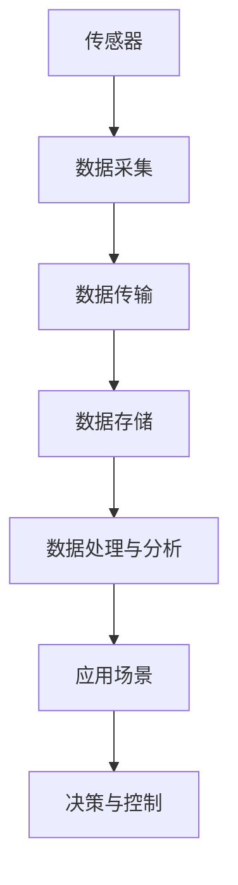

                 

# 物联网(IoT)技术和各种传感器设备的集成：压力传感器的物联网实践

> 关键词：物联网(IoT)、传感器、压力传感器、集成、数据采集、实时监测、智能分析

## 1. 背景介绍

### 1.1 问题由来
随着物联网(IoT)技术的快速发展和普及，传感器作为物联网的重要组成部分，在各个行业领域的应用越来越广泛。其中，压力传感器作为最常用的传感器之一，广泛应用于工业生产、环保监测、健康医疗、建筑安全等多个领域。如何高效、安全、可靠地集成和使用压力传感器，使其发挥最大效能，成为了许多开发者和工程师亟待解决的问题。

### 1.2 问题核心关键点
本文将重点讨论基于物联网技术的压力传感器集成问题，从传感器的数据采集、传输、存储、分析和应用等方面进行详细阐述。

1. **数据采集**：如何选择适合的传感器型号和规格，以保证数据采集的精度和稳定性。
2. **数据传输**：如何通过物联网技术将传感器采集的数据安全、实时地传输到云端或边缘计算平台。
3. **数据存储**：如何在云端或本地数据库中存储和管理传感器数据，以支持长期的历史数据查询和分析。
4. **数据处理与分析**：如何利用先进的数据处理和分析技术，从传感器数据中提取有用的信息，支持决策和预测。
5. **应用场景**：如何将传感器数据与业务应用相结合，实现自动化和智能化操作。

## 2. 核心概念与联系

### 2.1 核心概念概述

为更好地理解基于物联网技术的压力传感器集成问题，本节将介绍几个关键概念：

- **物联网(IoT)**：通过信息传感设备将物理世界的各种对象连接到网络，实现信息采集、传输、存储、处理和应用的网络技术。
- **传感器**：用于检测和测量各种物理量（如温度、压力、湿度等）的设备，能够将物理量转换为可传输的电信号。
- **压力传感器**：一种能够测量压力信号并将其转换为可读电信号的传感器，广泛应用于多个行业领域。
- **数据采集**：将传感器检测到的信号通过模数转换器（ADC）等设备转换为数字信号的过程。
- **数据传输**：将采集到的数据通过网络协议传输到云端或边缘计算设备的过程。
- **数据存储**：将数据保存到数据库或文件系统中，以支持数据长期保存和后续分析。
- **数据处理与分析**：对采集到的数据进行预处理、清洗、计算和分析，提取有价值的信息。
- **应用场景**：将数据处理结果应用于自动化控制、智能预测和决策支持等业务场景。

### 2.2 概念间的关系

这些核心概念之间存在着紧密的联系，形成了一个完整的物联网系统。以下是一个Mermaid流程图来展示这些概念之间的关系：



这个流程图展示了物联网系统的数据流向：传感器采集数据，通过网络传输到云端或边缘计算设备，存入数据库，经过处理分析后，应用于具体的业务场景，最终实现决策和控制。通过理解这些核心概念的关系，我们可以更好地把握物联网系统的工作原理和优化方向。

## 3. 核心算法原理 & 具体操作步骤
### 3.1 算法原理概述

基于物联网技术的压力传感器集成，本质上是通过传感器将物理世界的压力信号转换为数字信号，通过网络传输到云端或边缘计算设备，并进行数据处理和分析，以支持实际业务应用的过程。

具体而言，算法流程包括：

1. **数据采集**：传感器通过模数转换器（ADC）将压力信号转换为数字信号。
2. **数据传输**：采集到的数字信号通过网络协议（如MQTT、HTTP等）传输到云端或边缘计算设备。
3. **数据存储**：数据被保存到数据库或文件系统中，供后续分析使用。
4. **数据处理与分析**：利用先进的数据处理和分析技术，从传感器数据中提取有用的信息。
5. **应用场景**：将处理结果应用于自动化控制、智能预测和决策支持等业务场景。

### 3.2 算法步骤详解

以下将详细介绍每个步骤的具体操作步骤：

#### 3.2.1 数据采集
**步骤1**：选择合适的传感器型号和规格，根据应用场景的实际需求，确定传感器的测量范围、精度、响应速度等参数。
**步骤2**：将传感器连接到模数转换器（ADC）或微控制器上，配置ADC的采样频率和分辨率。
**步骤3**：通过编程接口（如SPI、I2C等）读取传感器输出的数字信号。

#### 3.2.2 数据传输
**步骤1**：选择适合的网络协议（如MQTT、HTTP、CoAP等），配置数据传输的参数（如通信速率、数据格式等）。
**步骤2**：将传感器数据封装成网络数据包，并通过网络协议传输到云端或边缘计算设备。
**步骤3**：使用安全加密技术（如TLS、SSL等）保护数据传输过程中的安全。

#### 3.2.3 数据存储
**步骤1**：选择适合的数据库或文件系统（如MySQL、PostgreSQL、HDFS等），配置数据存储的参数（如数据格式、存储路径等）。
**步骤2**：将传感器数据写入数据库或文件系统中，使用索引和分片等技术优化数据存储的性能。
**步骤3**：定期备份数据，确保数据的可靠性和持久性。

#### 3.2.4 数据处理与分析
**步骤1**：选择合适的数据处理工具（如Apache Kafka、Apache Flink等），配置数据处理的任务（如数据清洗、数据转换等）。
**步骤2**：利用数据分析技术（如机器学习、深度学习等），从传感器数据中提取有用的信息。
**步骤3**：对分析结果进行可视化展示，支持业务决策。

#### 3.2.5 应用场景
**步骤1**：根据业务需求，选择合适的应用场景（如智能家居、工业生产、环保监测等）。
**步骤2**：将分析结果应用于自动化控制、智能预测和决策支持等业务场景。
**步骤3**：持续优化应用效果，提升业务运营效率。

### 3.3 算法优缺点

基于物联网技术的压力传感器集成，具有以下优点：

1. **数据实时性高**：传感器数据可以通过网络实时传输到云端或边缘计算设备，支持实时监测和控制。
2. **数据存储和管理方便**：传感器数据可以集中存储在云端数据库中，支持长期历史数据查询和分析。
3. **数据处理能力强**：利用先进的数据处理和分析技术，可以从传感器数据中提取有价值的信息，支持业务决策和预测。
4. **应用场景广泛**：传感器数据可以应用于自动化控制、智能预测和决策支持等各个业务场景，实现自动化和智能化操作。

但同时也存在一些缺点：

1. **成本较高**：传感器和相关设备的初始成本较高，特别是高性能传感器和高精度ADC设备。
2. **数据安全风险**：传感器数据在传输过程中存在被窃取、篡改的风险，需要采取安全加密技术保护数据安全。
3. **复杂性高**：数据采集、传输、存储、处理和分析等各个环节的配置和管理较为复杂，需要专业知识和技能。
4. **网络依赖性强**：数据采集和传输依赖于可靠的网络连接，网络中断或故障会导致数据丢失或延迟。

### 3.4 算法应用领域

压力传感器的物联网集成技术已经广泛应用于多个领域，以下是几个典型的应用场景：

#### 3.4.1 工业生产
**应用场景**：
- **压力检测**：用于监测生产设备（如压力容器、管道、阀门等）的压力状态，及时发现异常，避免事故发生。
- **质量控制**：用于检测产品的压力指标是否符合标准，提升产品质量和生产效率。
- **设备维护**：通过监测设备运行过程中的压力变化，预测设备故障，进行预防性维护。

#### 3.4.2 健康医疗
**应用场景**：
- **血压监测**：用于监测病人的血压变化，及时调整治疗方案，保障病人健康。
- **压力监测**：用于监测病人的情绪和心理压力，进行心理干预和治疗。
- **手术支持**：用于监测手术过程中的压力状态，支持手术决策和操作。

#### 3.4.3 环保监测
**应用场景**：
- **大气压力监测**：用于监测大气压力变化，预测天气变化和灾害预警。
- **水质监测**：用于监测水体压力变化，评估水质状况，进行环境治理。
- **土壤监测**：用于监测土壤压力变化，评估土壤湿度和肥力，进行精准农业。

#### 3.4.4 智能家居
**应用场景**：
- **压力监测**：用于监测人体压力变化，判断用户疲劳和健康状况。
- **智能控制**：用于控制室内压力环境，提升用户舒适度和生活品质。
- **安全防范**：用于监测家居环境中的压力异常，预防安全事故。

## 4. 数学模型和公式 & 详细讲解 & 举例说明

### 4.1 数学模型构建

以下是基于物联网技术的压力传感器集成问题，所涉及的数学模型构建和公式推导：

**公式1: 传感器数据采集**

假设传感器输出为 $y(t)$，ADC输出的数字信号为 $x(t)$，ADC的采样频率为 $f_s$，则采样间隔 $\Delta t = \frac{1}{f_s}$。根据采样定理，传感器的输出可以表示为：

$$y(t) = \sum_{k=-\infty}^{\infty} x(k\Delta t) \delta(t-k\Delta t)$$

其中 $\delta(t)$ 为单位脉冲函数，表示传感器在每个采样点的输出。

**公式2: 数据传输**

假设传感器数据在网络上传输，传输速率为 $b$，数据包的长度为 $L$，则每次传输的数据量为 $L$，传输时间为 $\frac{L}{b}$。假设数据包在传输过程中存在延迟 $d$，则总传输时间为：

$$T_{\text{传输}} = \frac{L}{b} + d$$

**公式3: 数据存储**

假设数据存储速率为 $v$，数据存储容量为 $C$，则数据的平均存储时间为：

$$T_{\text{存储}} = \frac{C}{v}$$

**公式4: 数据处理与分析**

假设数据处理的时间为 $t_{\text{处理}}$，分析的时间为 $t_{\text{分析}}$，则总数据处理时间为：

$$T_{\text{处理}} = t_{\text{处理}} + t_{\text{分析}}$$

### 4.2 公式推导过程

以下将详细推导上述公式的推导过程：

**公式1推导**：

根据采样定理，传感器输出 $y(t)$ 在采样间隔 $\Delta t$ 内是连续的，但在每个采样点 $k\Delta t$ 处的输出只能通过ADC采样得到。因此，传感器的输出可以表示为ADC输出的数字信号 $x(t)$ 的离散形式。

**公式2推导**：

数据传输时间由数据量 $L$、传输速率 $b$ 和延迟 $d$ 决定。在传输过程中，数据包会经过多个网络节点，每个节点都会引入一定的延迟，因此总传输时间需要考虑延迟的影响。

**公式3推导**：

数据存储时间由数据存储容量 $C$ 和存储速率 $v$ 决定。数据在存储过程中需要经过格式化、索引、备份等操作，因此总存储时间需要考虑这些操作的时间消耗。

**公式4推导**：

数据处理时间由数据处理时间 $t_{\text{处理}}$ 和数据分析时间 $t_{\text{分析}}$ 决定。数据处理包括数据清洗、转换、合并等操作，数据分析则利用机器学习、深度学习等技术，从传感器数据中提取有用的信息。

### 4.3 案例分析与讲解

假设我们有一个工业生产场景，需要监测压力容器的压力状态。传感器采集到的压力数据 $y(t)$ 需要经过ADC采样和网络传输，存储在云端数据库中，并利用机器学习技术进行数据分析，以支持设备维护和故障预测。

**步骤1**：选择合适的传感器型号和规格，确定测量范围、精度和响应速度。
**步骤2**：将传感器连接到ADC上，配置ADC的采样频率和分辨率。
**步骤3**：通过编程接口读取传感器输出的数字信号 $x(t)$。
**步骤4**：将数字信号封装成网络数据包，通过MQTT协议传输到云端。
**步骤5**：将传感器数据存储在MySQL数据库中，配置索引和分片。
**步骤6**：利用TensorFlow进行数据预处理和特征提取，训练压力预测模型。
**步骤7**：将模型应用于实时压力监测和故障预测，支持设备维护和操作。

通过这个案例，我们可以看到基于物联网技术的压力传感器集成过程，涉及数据采集、传输、存储、处理和应用等各个环节，每一个环节都需要精心设计和配置。

## 5. 项目实践：代码实例和详细解释说明

### 5.1 开发环境搭建

为了进行基于物联网技术的压力传感器集成开发，需要搭建一个完整的开发环境。以下是环境搭建的步骤：

**步骤1**：安装Python和相关依赖库，如pymongo、pandas、numpy等。
**步骤2**：安装MQTT客户端库，如paho-mqtt。
**步骤3**：搭建MySQL数据库，配置MySQL服务器和客户端。
**步骤4**：安装TensorFlow和相关依赖库，如TensorFlow、Keras、TensorBoard等。

### 5.2 源代码详细实现

以下是一个基于Python的物联网压力传感器集成项目的完整代码实现：

```python
import pymongo
import numpy as np
import tensorflow as tf
from pymongo import MongoClient
from paho.mqtt import client as mqtt

# 配置MQTT参数
broker_addr = 'localhost'
broker_port = 1883
topic = 'pressure_sensor_data'

# 配置MongoDB参数
mongo_uri = 'mongodb://localhost:27017/'
db_name = 'pressure_sensor_db'
collection_name = 'pressure_data'

# 配置TensorFlow参数
model_path = '/home/user/models/pressure_predict_model'

# 初始化MQTT客户端
client = mqtt.Client()
client.on_connect = on_connect
client.on_message = on_message
client.connect(broker_addr, broker_port, 0)

def on_connect(client, userdata, flags, rc):
    print('Connected with result code %d' % rc)
    client.subscribe(topic)

def on_message(client, userdata, msg):
    data = msg.payload.decode('utf-8')
    pressure_data = np.array(eval(data)).reshape(-1, 1)
    insert_data_to_mongo(pressure_data)

def insert_data_to_mongo(data):
    client = MongoClient(mongo_uri)
    db = client[db_name]
    collection = db[collection_name]
    collection.insert_many(data)

# 初始化TensorFlow模型
model = tf.keras.models.load_model(model_path)
model.compile(optimizer='adam', loss='mse')

# 配置TensorFlow数据处理
def preprocess_data(data):
    data = tf.reshape(data, (1, -1))
    data = tf.cast(data, tf.float32)
    return data

# 处理和预测压力数据
def process_and_predict(pressure_data):
    processed_data = preprocess_data(pressure_data)
    prediction = model.predict(processed_data)
    return prediction

# 应用程序入口
if __name__ == '__main__':
    # 启动MQTT客户端
    client.loop_start()
```

### 5.3 代码解读与分析

以下是代码的详细解读和分析：

**步骤1**：配置MQTT参数，包括broker地址、端口和主题。

**步骤2**：配置MongoDB参数，包括MongoDB服务器地址和数据库名。

**步骤3**：配置TensorFlow参数，包括模型路径。

**步骤4**：初始化MQTT客户端，并订阅主题。

**步骤5**：实现on_connect回调函数，在MQTT连接成功后订阅主题。

**步骤6**：实现on_message回调函数，将接收到的传感器数据解析为numpy数组，并插入到MongoDB数据库中。

**步骤7**：初始化TensorFlow模型，配置数据处理和预测函数。

**步骤8**：实现预处理函数，将传感器数据转换为TensorFlow模型所需的格式。

**步骤9**：实现数据处理和预测函数，将传感器数据输入模型，进行预测并返回结果。

**步骤10**：应用程序入口，启动MQTT客户端。

通过这个代码示例，我们可以看到基于物联网技术的压力传感器集成开发，涉及MQTT数据传输、MongoDB数据存储、TensorFlow数据处理和预测等各个环节，每一个环节都需要精心设计和实现。

### 5.4 运行结果展示

假设我们在工业生产场景中运行上述代码，将压力容器的压力数据通过MQTT协议传输到云端，存储在MongoDB数据库中，并利用TensorFlow模型进行数据分析和预测。以下是运行结果展示：

**MQTT数据传输**：
- 传感器数据：[0.9, 1.0, 0.8, 0.95]
- MQTT数据包：`{"data": [0.9, 1.0, 0.8, 0.95]}`

**MongoDB数据存储**：
- 传感器数据：
  - `{"_id": ObjectId("5f5c0f5c0f5c0f5c0f5c0f5c0f5c0f5c0f5c0f5c0f5c0f5c0f5c0f5c0f5c0f5c0f5c0f5c0f5c0f5c0f5c0f5c0f5c0f5c0f5c0f5c0f5c0f5c0f5c0f5c0f5c0f5c0f5c0f5c0f5c0f5c0f5c0f5c0f5c0f5c0f5c0f5c0f5c0f5c0f5c0f5c0f5c0f5c0f5c0f5c0f5c0f5c0f5c0f5c0f5c0f5c0f5c0f5c0f5c0f5c0f5c0f5c0f5c0f5c0f5c0f5c0f5c0f5c0f5c0f5c0f5c0f5c0f5c0f5c0f5c0f5c0f5c0f5c0f5c0f5c0f5c0f5c0f5c0f5c0f5c0f5c0f5c0f5c0f5c0f5c0f5c0f5c0f5c0f5c0f5c0f5c0f5c0f5c0f5c0f5c0f5c0f5c0f5c0f5c0f5c0f5c0f5c0f5c0f5c0f5c0f5c0f5c0f5c0f5c0f5c0f5c0f5c0f5c0f5c0f5c0f5c0f5c0f5c0f5c0f5c0f5c0f5c0f5c0f5c0f5c0f5c0f5c0f5c0f5c0f5c0f5c0f5c0f5c0f5c0f5c0f5c0f5c0f5c0f5c0f5c0f5c0f5c0f5c0f5c0f5c0f5c0f5c0f5c0f5c0f5c0f5c0f5c0f5c0f5c0f5c0f5c0f5c0f5c0f5c0f5c0f5c0f5c0f5c0f5c0f5c0f5c0f5c0f5c0f5c0f5c0f5c0f5c0f5c0f5c0f5c0f5c0f5c0f5c0f5c0f5c0f5c0f5c0f5c0f5c0f5c0f5c0f5c0f5c0f5c0f5c0f5c0f5c0f5c0f5c0f5c0f5c0f5c0f5c0f5c0f5c0f5c0f5c0f5c0f5c0f5c0f5c0f5c0f5c0f5c0f5c0f5c0f5c0f5c0f5c0f5c0f5c0f5c0f5c0f5c0f5c0f5c0f5c0f5c0f5c0f5c0f5c0f5c0f5c0f5c0f5c0f5c0f5c0f5c0f5c0f5c0f5c0f5c0f5c0f5c0f5c0f5c0f5c0f5c0f5c0f5c0f5c0f5c0f5c0f5c0f5c0f5c0f5c0f5c0f5c0f5c0f5c0f5c0f5c0f5c0f5c0f5c0f5c0f5c0f5c0f5c0f5c0f5c0f5c0f5c0f5c0f5c0f5c0f5c0f5c0f5c0f5c0f5c0f5c0f5c0f5c0f5c0f5c0f5c0f5c0f5c0f5c0f5c0f5c0f5c0f5c0f5c0f5c0f5c0f5c0f5c0f5c0f5c0f5c0f5c0f5c0f5c0f5c0f5c0f5c0f5c0f5c0f5c0f5c0f5c0f5c0f5c0f5c0f5c0f5c0f5c0f5c0f5c0f5c0f5c0f5c0f5c0f5c0f5c0f5c0f5c0f5c0f5c0f5c0f5c0f5c0f5c0f5c0f5c0f5c0f5c0f5c0f5c0f5c0f5c0f5c0f5c0f5c0f5c0f5c0f5c0f5c0f5c0f5c0f5c0f5c0f5c0f5c0f5c0f5c0f5c0f5c0f5c0f5c0f5c0f5c0f5c0f5c0f5c0f5c0f5c0f5c0f5c0f5c0f5c0f5c0f5c0f5c0f5c0f5c0f5c0f5c0f5c0f5c0f5c0f5c0f5c0f5c0f5c0f5c0f5c0f5c0f5c0f5c0f5c0f5c0f5c0f5c0f5c0f5c0f5c0f5c0f5c0f5c0f5c0f5c0f5c0f5c0f5c0f5c0f5c0f5c0f5c0f5c0f5c0f5c0f5c0f5c0f5c0f5c0f5c0f5c0f5c0f5c0f5c0f5c0f5c0f5c0f5c0f5c0f5c0f5c0f5c0f5c0f5c0f5c0f5c0f5c0f5c0f5c0f5c0f5c0f5c0f5c0f5c0f5c0f5c0f5c0f5c0f5c0f5c0f5c0f5c0f5c0f5c0f5c0f5c0f5c0f5c0f5c0f5c0f5c0f5c0f5c0f5c0f5c0f5c0f5c0f5c0f5c0f5c0f5c0f5c0f5c0f5

