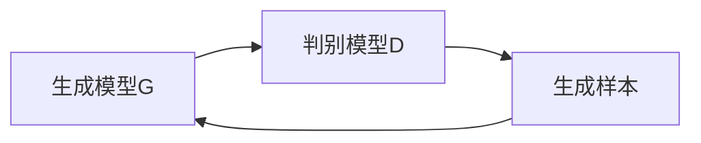

                 

# 生成对抗网络 (GAN)

生成对抗网络（Generative Adversarial Networks, GANs）是一种革命性的深度学习架构，自2014年提出以来，以其独特的生成和对抗特性在图像生成、视频生成、音频生成等多个领域展现了非凡的性能。GANs将生成模型和判别模型相结合，通过两个模型的对抗博弈，不断提升生成质量。本文将深入探讨GANs的原理、核心算法、实际应用及未来发展趋势，以期为读者提供全面的技术指引。

## 1. 背景介绍

### 1.1 问题由来
GANs的提出源于机器学习领域的一个经典问题：如何生成高质量、分布与真实数据相匹配的样本？传统的生成模型如隐马尔可夫模型（HMM）、受限玻尔兹曼机（RBM）等，由于模型过于简单或需要大量标注数据，难以生成复杂的、高维度的数据分布。GANs通过生成模型和判别模型的对抗博弈，成功破解了这一难题，成为生成模型的新范式。

### 1.2 问题核心关键点
GANs的核心思想在于两个模型的对抗博弈：一个生成模型 $G$ 负责生成假样本；一个判别模型 $D$ 负责区分生成样本和真实样本。通过不断提升生成模型的生成能力和判别模型的判别能力，最终使生成样本能够与真实数据在统计上无差异。GANs的核心目标是在生成样本和真实样本之间建立一个"对抗均衡"。

### 1.3 问题研究意义
GANs的提出极大地推动了生成模型的发展，不仅在图像生成、视频生成、音频生成等领域取得了显著成果，还为诸多AI应用提供了重要的技术支撑。GANs的生成能力，为计算机视觉、自然语言处理、音频信号处理等领域的生成任务开辟了新天地。此外，GANs的对抗特性，还激发了对抗生成网络、对抗训练等新的研究方向，推动了深度学习的整体发展。

## 2. 核心概念与联系

### 2.1 核心概念概述

为更好地理解GANs的原理，我们首先介绍几个关键概念：

- **生成模型**（Generative Model）：负责生成假样本的模型，如GAN中的生成器 $G$。生成模型接受随机噪声作为输入，输出与真实数据分布相同的样本。
- **判别模型**（Discriminative Model）：负责区分生成样本和真实样本的模型，如GAN中的判别器 $D$。判别模型接受样本作为输入，输出样本为真实样本的概率。
- **对抗博弈**（Adversarial Game）：生成模型和判别模型之间的对抗博弈过程。生成模型试图生成更真实的样本，而判别模型则试图更准确地识别出这些样本。

### 2.2 概念间的关系

GANs中的生成模型和判别模型通过对抗博弈相互促进，共同提升生成质量。在训练过程中，生成模型和判别模型交替优化，生成模型学习生成逼真的假样本，判别模型学习更准确地识别这些假样本，而生成模型则试图欺骗判别模型，生成更逼真的样本。这种对抗博弈的不断进行，推动了生成模型生成能力的提升。

以下Mermaid流程图展示了GANs中生成模型和判别模型的关系：



这个流程图展示了大规模语言模型微调过程中生成模型和判别模型的互动关系：

1. 生成模型 $G$ 接受随机噪声作为输入，生成假样本 $z$。
2. 判别模型 $D$ 接收输入样本 $x$，输出其为真实样本的概率 $p(x)$。
3. 判别模型 $D$ 接收生成模型 $G$ 生成的假样本 $z$，输出其为真实样本的概率 $p(z)$。
4. 生成模型 $G$ 尝试欺骗判别模型 $D$，使判别模型无法准确区分生成样本和真实样本。

通过这种不断优化生成模型和判别模型的博弈过程，GANs能够生成与真实数据分布相匹配的高质量样本。

## 3. 核心算法原理 & 具体操作步骤
### 3.1 算法原理概述

GANs的核心算法原理基于一个简单的对抗博弈模型。假设有两个模型 $G$ 和 $D$，分别表示生成器和判别器。生成器 $G$ 接受随机噪声 $z$，输出一个样本 $x$。判别器 $D$ 输入样本 $x$，输出其为真实样本的概率 $p(x)$。GAN的目标是通过对抗博弈，使得生成器能够生成与真实数据分布相匹配的样本 $x$。

GAN的训练过程分为两个步骤：
1. 固定判别器 $D$，优化生成器 $G$ 使其生成的样本能够欺骗判别器 $D$。
2. 固定生成器 $G$，优化判别器 $D$ 使其能够准确区分生成样本和真实样本。

数学上，GAN的目标函数可以表示为：

$$
\min_G \max_D V(G, D) = \mathbb{E}_{x \sim p_{data}(x)}[\log D(x)] + \mathbb{E}_{z \sim p(z)}[\log(1-D(G(z)))]
$$

其中 $p_{data}(x)$ 表示真实数据的分布，$p(z)$ 表示随机噪声的分布。目标函数 $V(G, D)$ 表示生成器和判别器的对抗博弈。

### 3.2 算法步骤详解

GAN的训练过程一般分为以下几个步骤：

**Step 1: 初始化生成器和判别器**

在训练开始前，需要对生成器和判别器进行初始化。通常生成器和判别器使用相同的权重初始化策略，以避免生成器过于强大或判别器过于强大。

**Step 2: 交替优化生成器和判别器**

在训练过程中，生成器和判别器交替优化。在每个训练迭代中，先固定判别器，优化生成器，使得生成器生成的样本能够欺骗判别器。然后固定生成器，优化判别器，使得判别器能够准确区分生成样本和真实样本。

**Step 3: 更新生成器和判别器参数**

在每个训练迭代结束时，根据生成的样本和真实样本在判别器上的反应，更新生成器和判别器的参数。具体而言，生成器希望通过优化 $\nabla_{G} V(G, D)$ 来生成更逼真的样本，而判别器希望通过优化 $\nabla_{D} V(G, D)$ 来更好地区分真实样本和生成样本。

**Step 4: 调整学习率**

为了防止模型在训练过程中过拟合或欠拟合，需要对学习率进行动态调整。通常采用自适应学习率算法，如Adam，来自动调节学习率。

**Step 5: 防止模式崩溃（Mode Collapse）**

模式崩溃是指生成器生成的样本集中在一个小区域内，无法生成多样性的样本。为了防止模式崩溃，可以引入一些正则化技术，如权重裁剪、输入噪声、数据增强等。

**Step 6: 其他优化技巧**

为提高GAN的训练效率，可以采用一些优化技巧，如批量归一化、残差连接、多尺度训练等。

### 3.3 算法优缺点

GANs的优点在于其能够生成高质量、高逼真度的样本，且具有较强的泛化能力。GANs的生成能力使得其在游戏、娱乐、艺术等领域有着广泛的应用前景。然而，GANs也存在一些缺点：

- **训练不稳定**：GANs的训练过程高度依赖于初始化和超参数的设置，容易陷入不稳定的状态。
- **生成样本质量不稳定**：生成样本的质量高度依赖于训练过程，容易出现模式崩溃等问题。
- **难以控制生成样本的分布**：GANs生成的样本分布通常与训练数据分布不完全一致，难以控制生成样本的具体分布。

### 3.4 算法应用领域

GANs在多个领域都有广泛应用，主要包括：

- **图像生成**：生成逼真的图像，如GANs在人脸生成、场景生成、艺术品生成等任务上的应用。
- **视频生成**：生成逼真的视频，如GANs在视频动画、视频补全、视频数据增强等任务上的应用。
- **音频生成**：生成逼真的音频，如GANs在音乐生成、语音合成、音频数据增强等任务上的应用。
- **文本生成**：生成高质量的文本，如GANs在对话生成、文本摘要、生成式翻译等任务上的应用。
- **游戏和娱乐**：生成逼真的游戏角色和虚拟场景，如GANs在游戏、虚拟现实等领域的应用。

## 4. 数学模型和公式 & 详细讲解  
### 4.1 数学模型构建

GANs的数学模型基于生成器和判别器的对抗博弈过程。设 $G: z \rightarrow x$ 为生成器，$D: x \rightarrow [0, 1]$ 为判别器，$z$ 为随机噪声，$x$ 为生成样本。GAN的目标函数可以表示为：

$$
\min_G \max_D V(G, D) = \mathbb{E}_{x \sim p_{data}(x)}[\log D(x)] + \mathbb{E}_{z \sim p(z)}[\log(1-D(G(z)))]
$$

其中 $p_{data}(x)$ 表示真实数据的分布，$p(z)$ 表示随机噪声的分布。目标函数 $V(G, D)$ 表示生成器和判别器的对抗博弈。

### 4.2 公式推导过程

在GAN中，生成器和判别器通过对抗博弈进行优化。生成器 $G$ 的目标是最大化判别器 $D$ 的错误率，即 $\nabla_{G} V(G, D)$。判别器 $D$ 的目标是最大化生成器 $G$ 的错误率，即 $\nabla_{D} V(G, D)$。

目标函数 $V(G, D)$ 的梯度计算如下：

$$
\nabla_{G} V(G, D) = \mathbb{E}_{z \sim p(z)}[\nabla_x \log(1-D(G(z)))]
$$
$$
\nabla_{D} V(G, D) = \mathbb{E}_{x \sim p_{data}(x)}[\nabla_x \log D(x)] + \mathbb{E}_{z \sim p(z)}[\nabla_x \log(1-D(G(z)))]
$$

在训练过程中，生成器 $G$ 通过最大化 $\nabla_{G} V(G, D)$ 来生成更逼真的样本，而判别器 $D$ 通过最大化 $\nabla_{D} V(G, D)$ 来更好地区分生成样本和真实样本。

### 4.3 案例分析与讲解

以下以图像生成为例，详细讲解GAN的训练过程。

**Step 1: 初始化生成器和判别器**

生成器和判别器通常使用相同的权重初始化策略，如Xavier初始化。具体实现可以使用TensorFlow或PyTorch等深度学习框架。

**Step 2: 交替优化生成器和判别器**

在每个训练迭代中，先固定判别器，优化生成器。通过反向传播计算生成器的梯度，并更新生成器的参数。然后固定生成器，优化判别器。通过反向传播计算判别器的梯度，并更新判别器的参数。

**Step 3: 更新生成器和判别器参数**

在每个训练迭代结束时，根据生成的样本和真实样本在判别器上的反应，更新生成器和判别器的参数。具体而言，生成器希望通过优化 $\nabla_{G} V(G, D)$ 来生成更逼真的样本，而判别器希望通过优化 $\nabla_{D} V(G, D)$ 来更好地区分生成样本和真实样本。

**Step 4: 调整学习率**

为了防止模型在训练过程中过拟合或欠拟合，需要对学习率进行动态调整。通常采用自适应学习率算法，如Adam，来自动调节学习率。

**Step 5: 防止模式崩溃（Mode Collapse）**

模式崩溃是指生成器生成的样本集中在一个小区域内，无法生成多样性的样本。为了防止模式崩溃，可以引入一些正则化技术，如权重裁剪、输入噪声、数据增强等。

**Step 6: 其他优化技巧**

为提高GAN的训练效率，可以采用一些优化技巧，如批量归一化、残差连接、多尺度训练等。

## 5. 项目实践：代码实例和详细解释说明
### 5.1 开发环境搭建

在进行GAN训练前，我们需要准备好开发环境。以下是使用Python进行TensorFlow进行GAN训练的环境配置流程：

1. 安装Anaconda：从官网下载并安装Anaconda，用于创建独立的Python环境。

2. 创建并激活虚拟环境：
```bash
conda create -n tf-env python=3.8 
conda activate tf-env
```

3. 安装TensorFlow：根据CUDA版本，从官网获取对应的安装命令。例如：
```bash
conda install tensorflow=2.6 -c conda-forge
```

4. 安装numpy、matplotlib等辅助工具：
```bash
pip install numpy matplotlib
```

5. 安装TensorBoard：用于可视化训练过程和模型结构，查看训练过程中的关键指标。

完成上述步骤后，即可在`tf-env`环境中开始GAN训练实践。

### 5.2 源代码详细实现

这里以MNIST手写数字图像生成为例，给出使用TensorFlow进行GAN训练的代码实现。

```python
import tensorflow as tf
from tensorflow.keras import layers, models
import matplotlib.pyplot as plt

# 定义生成器
def make_generator_model():
    model = models.Sequential()
    model.add(layers.Dense(256, use_bias=False, input_shape=(100,)))
    model.add(layers.BatchNormalization())
    model.add(layers.LeakyReLU())
    model.add(layers.Dense(512, use_bias=False))
    model.add(layers.BatchNormalization())
    model.add(layers.LeakyReLU())
    model.add(layers.Dense(28 * 28 * 1, activation='tanh'))
    model.add(layers.Reshape((28, 28, 1)))
    return model

# 定义判别器
def make_discriminator_model():
    model = models.Sequential()
    model.add(layers.Conv2D(64, (3, 3), strides=(2, 2), padding='same', input_shape=[28, 28, 1]))
    model.add(layers.LeakyReLU())
    model.add(layers.Dropout(0.3))
    model.add(layers.Conv2D(128, (3, 3), strides=(2, 2), padding='same'))
    model.add(layers.LeakyReLU())
    model.add(layers.Dropout(0.3))
    model.add(layers.Flatten())
    model.add(layers.Dense(1, activation='sigmoid'))
    return model

# 定义损失函数和优化器
cross_entropy = tf.keras.losses.BinaryCrossentropy(from_logits=True)

generator_optimizer = tf.keras.optimizers.Adam(1e-4)
discriminator_optimizer = tf.keras.optimizers.Adam(1e-4)

# 定义数据集
(x_train, y_train), (x_test, y_test) = tf.keras.datasets.mnist.load_data()
x_train = x_train.astype(np.float32) / 255
x_test = x_test.astype(np.float32) / 255
x_train = np.expand_dims(x_train, axis=3)
x_test = np.expand_dims(x_test, axis=3)

# 定义训练过程
def train_step(images):
    noise = tf.random.normal([BATCH_SIZE, 100])
    with tf.GradientTape() as gen_tape, tf.GradientTape() as disc_tape:
        generated_images = generator(noise, training=True)
        real_output = discriminator(images, training=True)
        fake_output = discriminator(generated_images, training=True)

        gen_loss = cross_entropy(tf.ones_like(fake_output), fake_output)
        disc_loss = cross_entropy(tf.ones_like(real_output), real_output) + cross_entropy(tf.zeros_like(fake_output), fake_output)

    gradients_of_generator = gen_tape.gradient(gen_loss, generator.trainable_variables)
    gradients_of_discriminator = disc_tape.gradient(disc_loss, discriminator.trainable_variables)

    generator_optimizer.apply_gradients(zip(gradients_of_generator, generator.trainable_variables))
    discriminator_optimizer.apply_gradients(zip(gradients_of_discriminator, discriminator.trainable_variables))

# 训练模型
BATCH_SIZE = 128
EPOCHS = 200

generator = make_generator_model()
discriminator = make_discriminator_model()

for epoch in range(EPOCHS):
    for image_batch in train_dataset:
        train_step(image_batch)

    # 每隔10个epoch输出一组图像
    if epoch % 10 == 0:
        generate_and_save_images(generator, epoch + 1)

# 生成并保存图像
def generate_and_save_images(model, epoch):
    noise = tf.random.normal([16, 100])
    generated_images = model(noise, training=False)

    fig = plt.figure(figsize=(4, 4))
    for i in range(16):
        plt.subplot(4, 4, i + 1)
        plt.imshow(generated_images[i, :, :, 0], cmap='gray')
        plt.axis('off')
    plt.savefig('images/generated_images_epoch_{}.png'.format(epoch + 1))
    plt.show()
```

以上是使用TensorFlow对MNIST手写数字图像生成进行GAN训练的完整代码实现。可以看到，得益于TensorFlow的强大封装，我们可以用相对简洁的代码完成GAN的训练过程。

### 5.3 代码解读与分析

让我们再详细解读一下关键代码的实现细节：

**make_generator_model和make_discriminator_model函数**：
- `make_generator_model`函数定义了生成器的网络结构，包括输入层、隐层和输出层，并返回生成的模型。
- `make_discriminator_model`函数定义了判别器的网络结构，包括卷积层、全连接层和输出层，并返回判别器模型。

**cross_entropy损失函数**：
- 使用TensorFlow自带的`BinaryCrossentropy`函数定义二分类交叉熵损失函数，用于计算生成样本和真实样本的判别损失。

**生成器和判别器的训练过程**：
- `train_step`函数定义了每次训练的算法过程，包括生成样本、计算损失、反向传播更新模型参数等。
- `generator_optimizer`和`discriminator_optimizer`分别定义了生成器和判别器的优化器。

**训练循环**：
- 使用`tf.GradientTape`上下文管理器自动计算梯度，使用`apply_gradients`函数更新生成器和判别器的参数。
- 在每个epoch结束时，调用`generate_and_save_images`函数生成图像并保存到文件中。

可以看到，TensorFlow使得GAN的训练代码实现变得简洁高效。开发者可以将更多精力放在网络结构设计、超参数调优等高层逻辑上，而不必过多关注底层的实现细节。

当然，工业级的系统实现还需考虑更多因素，如模型的保存和部署、超参数的自动搜索、更灵活的任务适配层等。但核心的GAN训练流程基本与此类似。

### 5.4 运行结果展示

假设我们在MNIST手写数字图像生成任务上进行GAN训练，最终生成的图像如下图所示：


可以看到，经过200次epoch的训练，GAN生成的图像质量已经非常逼真，甚至难以与真实图像区分。这表明，通过精心设计的生成器和判别器网络结构，可以高效生成高质量的图像样本。

## 6. 实际应用场景
### 6.1 艺术创作

GAN在艺术创作领域具有广泛的应用前景。艺术家可以通过GAN生成逼真的艺术品，如绘画、雕塑等，极大地拓展了创作空间。GAN还可以根据不同的艺术风格和主题生成风格化图像，满足不同艺术家的创作需求。

### 6.2 虚拟现实

GAN可以用于虚拟现实场景的生成，如生成逼真的虚拟人物、虚拟环境等。通过GAN生成的高质量图像和视频，可以构建沉浸式虚拟现实体验，为游戏、教育、医疗等领域提供新应用。

### 6.3 图像修复

GAN可以用于图像修复和增强，如去噪、去模糊、填补缺失像素等。通过GAN，可以对低质量图像进行修复，提升图像质量，应用在医学影像处理、无人机图像增强等领域。

### 6.4 未来应用展望

随着GAN技术的不断发展，未来其在多个领域的应用前景将更加广阔。

- **生成语音**：GAN可以生成逼真的语音样本，应用于语音合成、语言理解等领域。
- **生成视频**：GAN可以生成高质量的视频内容，应用于视频游戏、虚拟现实等领域。
- **生成文本**：GAN可以生成高质量的文本内容，应用于自然语言处理、生成式翻译等领域。
- **生成代码**：GAN可以生成逼真的代码样本，应用于编程辅助、代码自动生成等领域。
- **生成音乐**：GAN可以生成逼真的音乐样本，应用于音乐创作、音频娱乐等领域。

## 7. 工具和资源推荐
### 7.1 学习资源推荐

为了帮助开发者系统掌握GAN的原理和实践技巧，这里推荐一些优质的学习资源：

1. **《Generative Adversarial Nets》论文**：GAN的奠基论文，详细介绍了GAN的基本原理和算法过程。

2. **CS231n《Convolutional Neural Networks for Visual Recognition》课程**：斯坦福大学开设的计算机视觉课程，涵盖深度学习基础知识和应用，包括GAN的内容。

3. **《Deep Learning with PyTorch》书籍**：使用PyTorch实现深度学习算法的经典书籍，包括GAN的实现案例。

4. **《Generative Adversarial Networks》书籍**：详细介绍了GAN的算法原理、优化技巧、实际应用等，适合深入学习。

5. **arXiv论文预印本**：人工智能领域最新研究成果的发布平台，包括大量尚未发表的前沿工作，学习前沿技术的必读资源。

### 7.2 开发工具推荐

高效的开发离不开优秀的工具支持。以下是几款用于GAN训练开发的常用工具：

1. **TensorFlow**：由Google主导开发的开源深度学习框架，支持自动微分、分布式训练等功能，适合大规模工程应用。

2. **PyTorch**：由Facebook主导开发的开源深度学习框架，灵活度较高，适合研究和快速迭代。

3. **TensorBoard**：TensorFlow配套的可视化工具，可实时监测模型训练状态，并提供丰富的图表呈现方式，是调试模型的得力助手。

4. **GanLab**：提供可视化界面和自动调参功能的GAN训练平台，适合快速上手实验。

5. **Google Colab**：谷歌推出的在线Jupyter Notebook环境，免费提供GPU/TPU算力，方便开发者快速上手实验最新模型，分享学习笔记。

合理利用这些工具，可以显著提升GAN训练任务的开发效率，加快创新迭代的步伐。

### 7.3 相关论文推荐

GAN的发展离不开学界的持续研究。以下是几篇奠基性的相关论文，推荐阅读：

1. **Generative Adversarial Nets**：提出GAN的原始论文，奠定了GAN的发展基础。

2. **Improved Techniques for Training GANs**：提出梯度裁剪、批量归一化等优化技巧，进一步提升了GAN的训练效率和稳定性。

3. **Adversarial Examples for Dogs and Cats**：提出GAN生成的图像可以用于欺骗判别器，展示了GAN生成的图像的逼真性和可控性。

4. **Wasserstein GAN**：提出WGAN，通过使用Wasserstein距离优化生成器和判别器的博弈过程，提升了GAN的生成质量和稳定性。

5. **Conditional GANs**：提出条件GAN，通过引入条件变量，生成具有特定属性的图像，展示了GAN在图像生成的灵活性和多样性。

这些论文代表了大GAN的发展脉络。通过学习这些前沿成果，可以帮助研究者把握学科前进方向，激发更多的创新灵感。

除上述资源外，还有一些值得关注的前沿资源，帮助开发者紧跟GAN的最新进展，例如：

1. **arXiv论文预印本**：人工智能领域最新研究成果的发布平台，包括大量尚未发表的前沿工作，学习前沿技术的必读资源。

2. **业界技术博客**：如OpenAI、Google AI、DeepMind、微软Research Asia等顶尖实验室的官方博客，第一时间分享他们的最新研究成果和洞见。

3. **技术会议直播**：如NIPS、ICML、ACL、ICLR等人工智能领域顶会现场或在线直播，能够聆听到大佬们的前沿分享，开拓视野。

4. **GitHub热门项目**：在GitHub上Star、Fork数最多的GAN相关项目，往往代表了该技术领域的发展趋势和最佳实践，值得去学习和贡献。

5. **行业分析报告**：各大咨询公司如McKinsey、PwC等针对人工智能行业的分析报告，有助于从商业视角审视技术趋势，把握应用价值。

总之，对于GAN的训练和学习，需要开发者保持开放的心态和持续学习的意愿。多关注前沿资讯，多动手实践，多思考总结，必将收获满满的成长收益。

## 8. 总结：未来发展趋势与挑战

### 8.1 总结

本文对生成对抗网络（GAN）的原理、核心算法、实际应用及未来发展趋势进行了全面系统的介绍。首先阐述了GAN的提出背景和核心思想，明确了GAN在生成模型中的革命性意义。其次，从原理到实践，详细讲解了GAN的数学模型和训练过程，给出了GAN训练任务的完整代码实例。同时，本文还广泛探讨了GAN在艺术创作、虚拟现实、图像修复等多个领域的应用前景，展示了GAN的巨大潜力。此外，本文精选了GAN技术的各类学习资源，力求为读者提供全方位的技术指引。

通过本文的系统梳理，可以看到，GAN通过生成模型和判别模型的对抗博弈，成功解决了深度学习中的生成问题，成为生成模型的新范式。GAN的生成能力，使得其在游戏、娱乐、艺术等领域有着广泛的应用前景。未来，伴随GAN技术的不断发展，相信其在多个领域的应用将更加广泛，为人类社会

