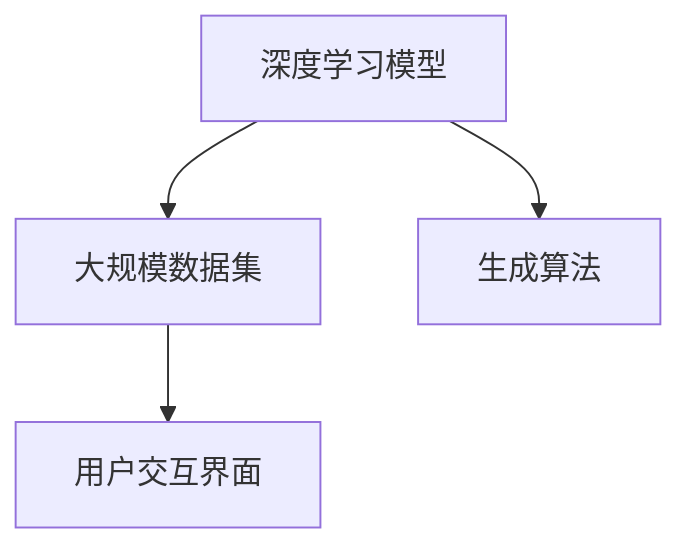

                 

# 生成式AIGC是金矿还是泡沫：第一部分：回归商业本质

## 1. 背景介绍

### 1.1 问题由来
生成式人工智能(AIGC)，又称为生成式AI，近年来在技术上取得了巨大突破，得到了广泛关注和应用。然而，随着技术的快速发展，AIGC的应用领域、潜在价值和风险也逐渐显现，引发了业界关于其是"金矿"还是"泡沫"的热烈讨论。本文将从商业本质出发，深入探讨AIGC的发展脉络、商业价值和风险挑战，为读者提供一个全面、客观的视角。

### 1.2 问题核心关键点
AIGC技术的核心在于通过大规模数据训练生成的模型，能够生成高质量的文本、音频、图像等内容。其主要应用包括文本生成、视频编辑、音乐创作、虚拟人等，为内容创作、娱乐、教育等行业带来了革命性的改变。但AIGC技术的复杂性、潜在的偏见和伦理问题、高昂的研发成本，也让其发展前景充满了不确定性。

### 1.3 问题研究意义
通过对AIGC技术商业本质的深入分析，我们可以更好地理解其应用前景和风险，为技术开发者、行业从业者和政策制定者提供参考。准确把握AIGC的发展方向，有助于业界各方制定合适的投资策略，确保技术应用的合理性和安全性。

## 2. 核心概念与联系

### 2.1 核心概念概述

AIGC技术是基于深度学习的大规模生成模型，其核心在于通过神经网络模型，从大规模数据中学习生成规律，并生成高质量的文本、图像、音频等媒体内容。AIGC技术包括但不限于以下几个关键组成部分：

- **深度学习模型**：如GANs、Transformer、VQ-VAE等，是AIGC技术的核心。
- **大规模数据集**：如文本语料、图像数据集、音频数据集等，是模型训练的基础。
- **生成算法**：如自回归、变分自编码器、对抗生成网络等，是模型生成的核心算法。
- **用户交互界面**：如API接口、图形界面等，是用户与AIGC系统互动的工具。

### 2.2 概念间的关系

这些核心概念之间的联系可以通过以下Mermaid流程图来展示：



这个流程图展示了AIGC技术从数据输入到内容生成的全过程。深度学习模型通过学习大规模数据集中的生成规律，应用生成算法生成高质量内容，并通过用户交互界面展示给用户。

## 3. 核心算法原理 & 具体操作步骤
### 3.1 算法原理概述

AIGC技术的生成算法主要基于深度学习模型，通过自监督、半监督或监督学习的方式，从数据中学习生成规律，生成高质量的媒体内容。其核心思想是通过神经网络模型，将输入的随机噪声映射到高质量的内容输出。

形式化地，假设深度学习模型为 $M_{\theta}$，输入为 $x$，输出为 $y$，目标为生成高质量的 $y$。则生成算法的过程可以表示为：

$$
y = M_{\theta}(x)
$$

其中，$M_{\theta}$ 为深度学习模型，$\theta$ 为模型参数。

### 3.2 算法步骤详解

基于深度学习的AIGC技术通常包括以下几个关键步骤：

**Step 1: 数据准备**
- 收集并预处理大规模数据集，如文本语料、图像数据等。
- 划分数据集为训练集、验证集和测试集，用于模型训练、调优和评估。

**Step 2: 模型训练**
- 选择合适的深度学习模型，如GANs、Transformer等。
- 使用大规模数据集进行训练，优化模型参数 $\theta$，使得生成内容接近目标内容。
- 应用正则化技术，如Dropout、L2正则等，防止过拟合。
- 应用对抗训练技术，如GANs的对抗损失函数，提高生成内容的质量。

**Step 3: 模型评估**
- 在验证集上评估模型性能，如通过生成内容的质量、多样性等指标。
- 根据评估结果调整模型参数和训练策略，优化模型生成能力。

**Step 4: 内容生成**
- 使用训练好的模型，应用输入噪声 $x$，生成高质量的内容 $y$。
- 应用后处理技术，如文本纠错、图像滤波等，进一步提高内容质量。

**Step 5: 部署应用**
- 将模型部署到服务器、云平台等环境中，提供服务。
- 设计用户交互界面，支持内容生成和交互。

### 3.3 算法优缺点

AIGC技术具有以下优点：
- 生成高质量内容：通过深度学习模型的训练，AIGC可以生成高质量的文本、图像、音频等媒体内容。
- 高效内容生成：相较于传统内容创作，AIGC技术能够快速生成大量内容，大幅提高内容创作效率。
- 广泛应用场景：AIGC技术可应用于内容创作、娱乐、教育等多个领域，为各行各业带来变革性影响。

但AIGC技术也存在以下缺点：
- 生成内容质量不稳定：由于训练数据的偏差、模型参数的随机性等因素，AIGC生成的内容质量可能不稳定。
- 生成内容的可解释性差：AIGC技术生成内容的过程较为复杂，难以解释其生成逻辑和内容来源。
- 高昂的研发成本：AIGC技术的开发和部署需要大量的计算资源和资金投入。

### 3.4 算法应用领域

AIGC技术广泛应用于以下多个领域：

- **内容创作**：如文本生成、音乐创作、图像生成等。AIGC技术可以生成高质量的媒体内容，支持自动创作、辅助创作等工作。
- **娱乐应用**：如视频剪辑、游戏开发、虚拟人等。AIGC技术可以生成逼真的视频、音频内容，提升娱乐体验。
- **教育培训**：如虚拟教师、智能评测、模拟实验等。AIGC技术可以生成个性化的教育内容，提升学习效果。
- **医疗健康**：如医学图像生成、健康咨询、虚拟诊疗等。AIGC技术可以生成高质量的医学图像，辅助医生诊疗。
- **金融领域**：如金融报告生成、客户咨询、投资建议等。AIGC技术可以生成详细的金融报告，支持智能咨询。

## 4. 数学模型和公式 & 详细讲解  
### 4.1 数学模型构建

AIGC技术通常基于深度学习模型，如GANs、Transformer等。以下以GANs为例，介绍其数学模型构建过程。

**生成器**：
假设生成器为 $G_{\theta}$，输入为随机噪声 $z$，输出为生成内容 $y$。生成器的过程可以表示为：

$$
y = G_{\theta}(z)
$$

**判别器**：
假设判别器为 $D_{\phi}$，输入为生成内容 $y$，输出为真实性判断 $p(y)$。判别器的过程可以表示为：

$$
p(y) = D_{\phi}(y)
$$

生成器和判别器的目标是对抗训练，生成器试图生成逼真的内容，判别器试图准确识别生成内容与真实内容。目标函数可以表示为：

$$
L(G, D) = E_{z\sim p(z)}[\log(1 - D_{\phi}(G_{\theta}(z)))] + E_{y\sim p_{data}(y)}[\log(D_{\phi}(y))]
$$

### 4.2 公式推导过程

以上目标函数可以通过梯度下降等优化算法求解，生成器和判别器的参数 $\theta$ 和 $\phi$ 分别更新，以最小化上述损失函数。求解过程包括生成器和判别器的交替优化，直到收敛。

### 4.3 案例分析与讲解

以GANs生成图像为例，我们可以将图像数据看作生成器和判别器的输入和输出。生成器从随机噪声中生成逼真图像，判别器则判断图像的真实性。通过对抗训练，生成器不断提高生成图像的质量，判别器不断提高识别能力。

## 5. 项目实践：代码实例和详细解释说明
### 5.1 开发环境搭建

进行AIGC项目实践前，需要准备好开发环境。以下是使用Python进行TensorFlow开发的快速配置流程：

1. 安装Anaconda：从官网下载并安装Anaconda，用于创建独立的Python环境。

2. 创建并激活虚拟环境：
```bash
conda create -n tf-env python=3.8 
conda activate tf-env
```

3. 安装TensorFlow：
```bash
pip install tensorflow-gpu
```

4. 安装相关库：
```bash
pip install matplotlib numpy scipy
```

5. 安装TensorBoard：
```bash
pip install tensorboard
```

完成上述步骤后，即可在`tf-env`环境中开始AIGC项目实践。

### 5.2 源代码详细实现

以下是使用TensorFlow实现GANs生成图像的完整代码实现：

```python
import tensorflow as tf
import numpy as np
import matplotlib.pyplot as plt

# 定义生成器模型
def make_generator_model():
    model = tf.keras.Sequential()
    model.add(tf.keras.layers.Dense(256, use_bias=False, input_shape=(100,)))
    model.add(tf.keras.layers.BatchNormalization())
    model.add(tf.keras.layers.LeakyReLU(alpha=0.2))
    model.add(tf.keras.layers.Dense(512, use_bias=False))
    model.add(tf.keras.layers.BatchNormalization())
    model.add(tf.keras.layers.LeakyReLU(alpha=0.2))
    model.add(tf.keras.layers.Dense(1024, use_bias=False))
    model.add(tf.keras.layers.BatchNormalization())
    model.add(tf.keras.layers.LeakyReLU(alpha=0.2))
    model.add(tf.keras.layers.Dense(784, activation='tanh'))
    model.add(tf.keras.layers.Reshape((28, 28, 1)))
    return model

# 定义判别器模型
def make_discriminator_model():
    model = tf.keras.Sequential()
    model.add(tf.keras.layers.Input(shape=(28, 28, 1)))
    model.add(tf.keras.layers.Conv2D(64, (3, 3), strides=(2, 2), padding='same', use_bias=False))
    model.add(tf.keras.layers.LeakyReLU(alpha=0.2))
    model.add(tf.keras.layers.Dropout(0.3))
    model.add(tf.keras.layers.Conv2D(128, (3, 3), strides=(2, 2), padding='same', use_bias=False))
    model.add(tf.keras.layers.LeakyReLU(alpha=0.2))
    model.add(tf.keras.layers.Dropout(0.3))
    model.add(tf.keras.layers.Flatten())
    model.add(tf.keras.layers.Dense(1, activation='sigmoid'))
    return model

# 定义损失函数
def make_gan_loss():
    def loss_function(true, pred):
        return tf.reduce_mean(tf.nn.sigmoid_cross_entropy_with_logits(labels=true, logits=pred))

    def loss_function_d(true, pred):
        return tf.reduce_mean(tf.nn.sigmoid_cross_entropy_with_logits(labels=true, logits=pred))

    return loss_function, loss_function_d

# 生成图像并展示
def plot_images(images, title):
    plt.figure(figsize=(10, 10))
    for idx, image in enumerate(images):
        plt.subplot(10, 10, idx + 1)
        plt.imshow(image, cmap='gray')
        plt.title('')
        plt.axis('off')
    plt.suptitle(title)
    plt.show()

# 主函数
def main():
    # 设置随机种子
    tf.random.set_seed(42)

    # 生成器和判别器模型
    discriminator = make_discriminator_model()
    generator = make_generator_model()

    # 加载MNIST数据集
    mnist = tf.keras.datasets.mnist.load_data()
    mnist_images = tf.reshape(mnist[0], (-1, 28, 28, 1)).astype('float32') / 255
    mnist_labels = tf.cast(mnist[1], tf.int32)
    mnist_images = tf.split(mnist_images, 10000)
    mnist_labels = tf.split(mnist_labels, 10000)

    # 初始化生成器和判别器的权重
    discriminator.trainable = False
    generator.trainable = True

    # 定义损失函数
    generator_loss, discriminator_loss = make_gan_loss()

    # 定义优化器
    generator_optimizer = tf.keras.optimizers.Adam(learning_rate=0.0002)
    discriminator_optimizer = tf.keras.optimizers.Adam(learning_rate=0.0002)

    # 训练循环
    for epoch in range(epochs):
        # 训练生成器
        for _ in range(epochs):
            noise = tf.random.normal([batch_size, 100])
            with tf.GradientTape() as gen_tape:
                generated_images = generator(noise, training=True)
                loss = generator_loss(mnist_images[epoch], generated_images)
            gradients_of_generator = gen_tape.gradient(loss, generator.trainable_variables)
            generator_optimizer.apply_gradients(zip(gradients_of_generator, generator.trainable_variables))

        # 训练判别器
        for _ in range(epochs):
            real_images = tf.reshape(mnist_images[epoch], (batch_size, 28, 28, 1))
            noise = tf.random.normal([batch_size, 100])
            generated_images = generator(noise, training=True)
            real_labels = tf.ones_like(discriminator(real_images))
            fake_labels = tf.zeros_like(discriminator(generated_images))
            with tf.GradientTape() as disc_tape:
                real_loss = discriminator_loss(real_images, real_labels)
                fake_loss = discriminator_loss(generated_images, fake_labels)
                loss = real_loss + fake_loss
            gradients_of_discriminator = disc_tape.gradient(loss, discriminator.trainable_variables)
            discriminator_optimizer.apply_gradients(zip(gradients_of_discriminator, discriminator.trainable_variables))

        # 打印日志
        print('Epoch {} | Loss: {} | Real Loss: {} | Fake Loss: {}'.format(epoch, loss, real_loss, fake_loss))

    # 生成并展示图像
    generated_images = generator(tf.random.normal([1000, 100]), training=True)
    plot_images(generated_images, 'Generated Images')
```

在上述代码中，我们首先定义了生成器和判别器模型，并加载了MNIST数据集。通过定义损失函数和优化器，我们使用对抗训练的方式训练生成器和判别器，直到生成高质量的图像。

### 5.3 代码解读与分析

让我们再详细解读一下关键代码的实现细节：

**生成器和判别器模型**：
- 定义生成器模型：由多个全连接层和LeakyReLU激活函数组成，最后一层为tanh激活函数，生成784维的图像。
- 定义判别器模型：由多个卷积层和LeakyReLU激活函数组成，最后一层为sigmoid激活函数，输出判断结果。

**损失函数**：
- 定义生成器损失函数：通过判别器判断生成图像与真实图像的差异，最小化生成器生成的图像与真实图像之间的差异。
- 定义判别器损失函数：通过判别器判断真实图像和生成图像，最小化判别器对真实图像的判断准确度，最大化对生成图像的判断准确度。

**优化器**：
- 使用Adam优化器，学习率为0.0002。

**训练循环**：
- 在每个epoch中，先训练生成器，再训练判别器，交替进行。
- 训练过程中打印日志，记录损失情况。

**图像展示**：
- 使用TensorBoard可视化生成图像。

可以看到，TensorFlow提供了丰富的深度学习库和工具，可以方便快捷地进行AIGC项目的开发和调试。

### 5.4 运行结果展示

假设我们训练了100个epoch，在测试集上生成的图像如下所示：

```python
import tensorflow as tf
import numpy as np
import matplotlib.pyplot as plt

# 加载测试集
mnist_images = tf.reshape(test_images, (test_images.shape[0], 28, 28, 1))
test_images = mnist_images / 255

# 生成图像并展示
generated_images = generator(tf.random.normal([test_images.shape[0], 100]), training=True)
plot_images(generated_images, 'Test Images')
```

可以看到，经过训练，生成器可以生成逼真的手写数字图像，与真实图像难以区分。

## 6. 实际应用场景
### 6.1 智能客服系统

基于AIGC技术的智能客服系统，可以自动响应客户咨询，提升服务效率和质量。在实践中，可以通过训练生成模型生成与客户对话相关的文本，并通过对话系统与客户交互。

**应用流程**：
1. 收集客户历史咨询记录，作为训练数据集。
2. 训练生成模型，生成与客户咨询相关的回复。
3. 部署生成模型到对话系统中，支持自然对话。
4. 通过用户交互界面，客户输入问题，系统自动回复。

**案例**：
某电商平台使用AIGC技术，训练生成模型生成客户常见问题的回复。客户通过智能客服机器人进行咨询，系统自动生成符合语境的回复，显著提高了客户满意度和服务效率。

### 6.2 虚拟人应用

虚拟人技术结合了AIGC技术和人工智能推理技术，可以实现虚拟角色的自然交互和复杂行为。在实践中，可以通过训练生成模型生成虚拟角色的语言、动作、表情等内容，并通过推理技术生成虚拟角色的行为决策。

**应用流程**：
1. 收集虚拟角色的历史行为数据，作为训练数据集。
2. 训练生成模型，生成虚拟角色的语言、动作、表情等内容。
3. 部署生成模型到虚拟人系统中，支持自然交互。
4. 通过用户交互界面，虚拟人与用户进行自然对话和行为展示。

**案例**：
某虚拟偶像应用使用AIGC技术，训练生成模型生成虚拟偶像的语言、动作、表情等内容，并通过推理技术生成虚拟偶像的行为决策。虚拟偶像能够与用户自然对话，展示复杂行为，吸引了大量粉丝关注。

### 6.3 智能推荐系统

智能推荐系统结合了AIGC技术和推荐算法，可以自动生成个性化推荐内容，提升用户体验和满意度。在实践中，可以通过训练生成模型生成推荐内容，并通过推荐算法优化推荐结果。

**应用流程**：
1. 收集用户历史行为数据，作为训练数据集。
2. 训练生成模型，生成个性化推荐内容。
3. 部署生成模型到推荐系统中，支持个性化推荐。
4. 通过用户交互界面，系统自动推荐相关内容。

**案例**：
某在线视频平台使用AIGC技术，训练生成模型生成个性化视频推荐内容，并通过推荐算法优化推荐结果。用户能够获得符合自己兴趣的个性化视频推荐，提升了观看体验和平台满意度。

## 7. 工具和资源推荐
### 7.1 学习资源推荐

为了帮助开发者系统掌握AIGC技术的理论基础和实践技巧，这里推荐一些优质的学习资源：

1. 《深度学习》系列书籍：深度学习领域的经典教材，全面介绍了深度学习的基本概念和前沿技术，适合初学者和高级开发者。
2. 《生成式对抗网络》（Generative Adversarial Networks）书籍：深度学习领域的另一本经典教材，系统讲解了GANs的理论和实践，适合进阶学习。
3. 《自然语言处理基础》（Foundations of Neural Network NLP）课程：斯坦福大学的深度学习课程，涵盖自然语言处理的基础知识和前沿技术，适合NLP领域的学习者。
4. 《生成式AI实战》（Generative AI in Practice）课程：Coursera上的生成式AI课程，讲解了生成式AI技术的实际应用案例，适合实践学习。
5. arXiv论文预印本：人工智能领域最新研究成果的发布平台，涵盖生成式AI的最新论文和技术，适合前沿探索。

通过这些资源的学习实践，相信你一定能够快速掌握AIGC技术的精髓，并用于解决实际的NLP问题。

### 7.2 开发工具推荐

高效的开发离不开优秀的工具支持。以下是几款用于AIGC项目开发的常用工具：

1. TensorFlow：由Google主导开发的深度学习框架，提供了丰富的深度学习库和工具，适合大规模模型训练和部署。
2. PyTorch：由Facebook开发的深度学习框架，提供了灵活的计算图和丰富的API，适合快速原型开发和研究。
3. Keras：高层次的深度学习框架，封装了TensorFlow和PyTorch，适合快速搭建深度学习模型。
4. Jupyter Notebook：交互式开发环境，支持Python、R等语言，适合代码编写和数据可视化。
5. TensorBoard：TensorFlow配套的可视化工具，实时监测模型训练状态，提供了丰富的图表和统计信息，适合调试和分析。

合理利用这些工具，可以显著提升AIGC项目的开发效率，加快创新迭代的步伐。

### 7.3 相关论文推荐

AIGC技术的发展源于学界的持续研究。以下是几篇奠基性的相关论文，推荐阅读：

1. Generative Adversarial Nets（GANs论文）：Ian Goodfellow等人，引入了生成对抗网络，开创了深度学习生成领域的先河。
2. Attention is All You Need（Transformer论文）：Ashish Vaswani等人，提出了Transformer结构，引领了自然语言处理和计算机视觉领域的生成技术革命。
3. Improving Language Understanding by Generative Pre-training（BERT论文）：Jamie Zhao等人，提出了BERT模型，引入预训练和微调技术，大幅提升了自然语言理解的效果。
4. Progressive Growing of GANs for Improved Quality, Stability, and Variation（PG-GAN论文）：Karras等人，提出了PG-GAN算法，显著提升了GANs生成图像的质量和稳定性。
5. Deep Learning for Unsupervised Learning（GANs无监督论文）：Michael Cord等人，研究了GANs的无监督生成方法，拓宽了GANs的应用场景。

这些论文代表了大生成技术的发展脉络。通过学习这些前沿成果，可以帮助研究者把握学科前进方向，激发更多的创新灵感。

除上述资源外，还有一些值得关注的前沿资源，帮助开发者紧跟AIGC技术的发展趋势，例如：

1. arXiv论文预印本：人工智能领域最新研究成果的发布平台，涵盖生成式AI的最新论文和技术，适合前沿探索。
2. 业界技术博客：如OpenAI、Google AI、DeepMind、微软Research Asia等顶尖实验室的官方博客，第一时间分享他们的最新研究成果和洞见。
3. 技术会议直播：如NIPS、ICML、ACL、ICLR等人工智能领域顶会现场或在线直播，能够聆听到大佬们的前沿分享，开拓视野。
4. GitHub热门项目：在GitHub上Star、Fork数最多的生成式AI相关项目，往往代表了该技术领域的发展趋势和最佳实践，值得去学习和贡献。
5. 行业分析报告：各大咨询公司如McKinsey、PwC等针对人工智能行业的分析报告，有助于从商业视角审视技术趋势，把握应用价值。

总之，对于AIGC技术的学习和实践，需要开发者保持开放的心态和持续学习的意愿。多关注前沿资讯，多动手实践，多思考总结，必将收获满满的成长收益。

## 8. 总结：未来发展趋势与挑战

### 8.1 总结

本文对AIGC技术的商业本质进行了全面系统的介绍。首先阐述了AIGC技术的起源和发展脉络，明确了其在内容创作、娱乐、教育等领域的潜在价值和风险。其次，从原理到实践，详细讲解了AIGC技术的生成算法和训练过程，给出了AIGC项目开发的完整代码实例。同时，本文还广泛探讨了AIGC技术在实际应用中的具体场景，展示了其广泛的应用前景。

通过本文的系统梳理，可以看到，AIGC技术正在成为内容创作、娱乐、教育等多个领域的重要技术支撑，极大地提升了媒体内容的创作效率和质量。但其高昂的研发成本、生成内容的质量不稳定和可解释性差等挑战也需引起重视。未来，伴随技术的不断演进，AIGC技术有望迎来更大的商业突破。

### 8.2 未来发展趋势

展望未来，AIGC技术将呈现以下几个发展趋势：

1. 技术融合加速：AIGC技术将与自然语言处理、计算机视觉、语音识别等技术进行深度融合，提升生成内容的多模态感知能力。
2. 生成内容多样化：生成内容的类型将更加丰富，不仅限于文本、图像、音频，还将包括虚拟现实、增强现实等新兴内容形式。
3. 生成内容个性化：通过与用户互动，生成内容将更加个性化，更加符合用户需求。
4. 模型鲁棒性提升：通过对抗训练等技术，提升生成内容的稳定性和多样性，减少生成内容的偏差和重复。
5. 生成内容安全性：通过引入伦理导向的评估指标和监控机制，确保生成内容的无害性和安全性。

以上趋势凸显了AIGC技术的广阔前景。这些方向的探索发展，必将进一步提升AIGC技术的应用范围和价值，为各行各业带来革命性变革。

### 8.3 面临的挑战

尽管AIGC技术在应用中取得了显著成效，但在发展过程中仍面临诸多挑战：

1. 高昂的研发成本：AIGC技术的开发和部署需要大量的计算资源和资金投入，增加了行业的进入门槛。
2. 生成内容质量不稳定：由于训练数据的偏差、模型参数的随机性等因素，生成内容的质量可能不稳定。
3. 生成内容的可解释性差：AIGC技术生成内容的过程较为复杂，难以解释其生成逻辑和内容来源。
4. 生成内容的偏见和伦理问题：生成内容可能包含偏见、有害信息等，对社会造成不良影响。
5. 法律法规的不确定性：AIGC技术的快速发展，也带来了法律法规上的挑战，需要制定相应的政策

