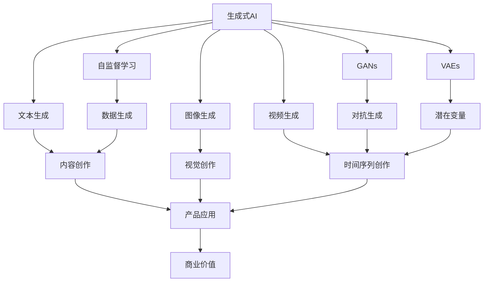
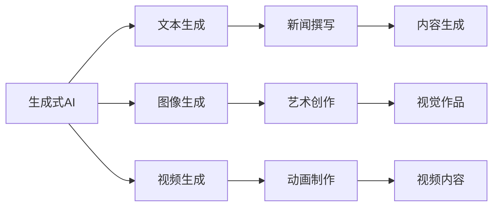
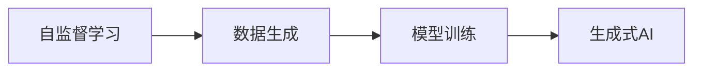
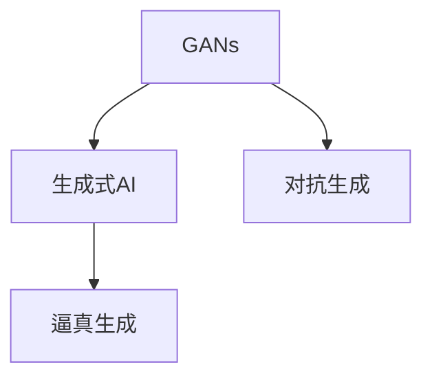
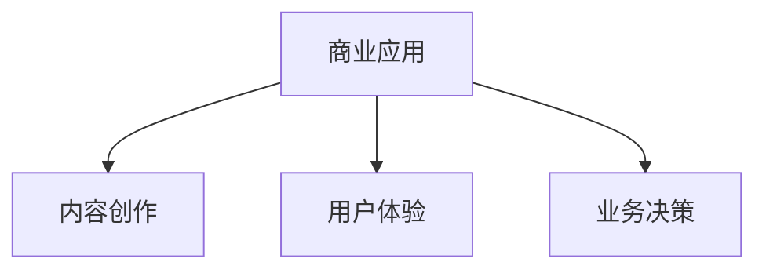
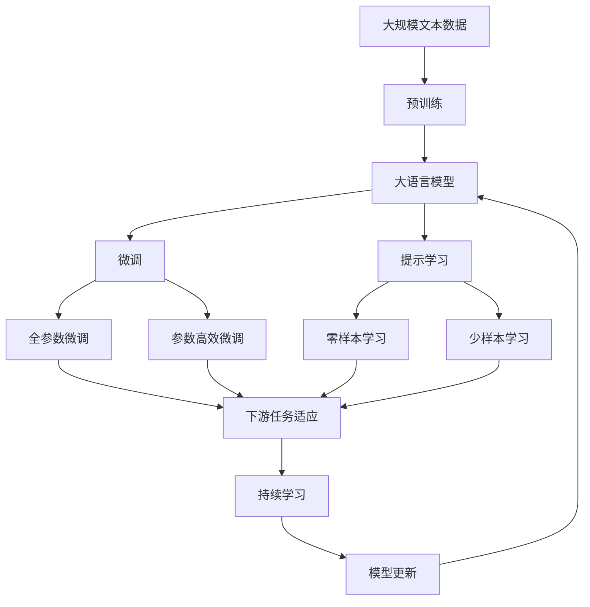

                 

# 生成式AIGC：从数据到商业价值的实现

> 关键词：生成式AIGC, 人工智能, 深度学习, 自监督学习, 生成对抗网络, 文本生成, 图像生成, 视频生成, 商业应用

## 1. 背景介绍

### 1.1 问题由来

近年来，人工智能(AI)技术快速发展，深度学习成为主流。其中，生成式人工智能(AI)（Generative AI，简称GAI）因其独特的生成能力，在图像、文本、语音、视频等多个领域展现了广泛的应用前景，成为AI领域的明星技术。生成式AI的核心在于如何从数据中学习到模型，生成逼真的、有创造力的新内容。其核心技术包括自监督学习、生成对抗网络（GANs）、变分自编码器（VAEs）等。

然而，生成式AI的应用并不仅限于技术层面，更重要的是如何将这些技术转化为商业价值，创造出具体的应用场景和产品。本文聚焦于生成式AI在商业价值实现上的关键技术与实践方法，希望为读者提供全方位的技术指引。

### 1.2 问题核心关键点

生成式AI的商业价值实现过程主要包括数据获取与预处理、模型选择与训练、产品设计与上线等关键环节。其核心关键点包括：

1. **数据质量**：高质量、多样化的数据是生成式AI成功的基石。
2. **模型选择**：根据任务需求选择合适的模型架构和技术路线。
3. **训练优化**：通过合适的训练策略，提升模型性能。
4. **产品设计**：将模型技术转化为具体应用场景，设计合理的产品功能。
5. **上线部署**：将模型部署到实际环境中，确保系统的稳定性和可靠性。

本文将详细讲解这些关键点，并结合实际案例，探讨生成式AI在商业应用中的最佳实践。

### 1.3 问题研究意义

生成式AI在商业领域的广泛应用，对于推动技术创新、提升企业竞争力具有重要意义：

1. **降低成本**：生成式AI可以自动生成内容，减少人工创作的成本。
2. **提升效率**：生成式AI能够快速生成大量高质量内容，提高内容创作的效率。
3. **增强创意**：生成式AI可以提出新的创意，拓展内容创作的边界。
4. **个性化服务**：生成式AI能够根据用户需求生成个性化内容，提升用户体验。
5. **数据驱动**：生成式AI能够从大数据中挖掘有价值的信息，驱动业务决策。

随着生成式AI技术的不断成熟，其商业应用前景广阔，将深刻影响各个行业的发展。

## 2. 核心概念与联系

### 2.1 核心概念概述

为了更好地理解生成式AI的商业价值实现，本节将介绍几个关键概念：

- **生成式AI**：使用机器学习模型生成新的、逼真的内容，如文本、图像、视频等。
- **自监督学习**：利用未标记的数据，自动学习数据的内在结构和规律。
- **生成对抗网络（GANs）**：由生成器和判别器组成的网络，通过对抗训练生成逼真数据。
- **变分自编码器（VAEs）**：通过学习数据的潜在分布，生成新数据。
- **文本生成**：使用生成式模型自动生成文本内容，如新闻、评论、对话等。
- **图像生成**：生成具有视觉效果的图像内容，如肖像、风景、艺术作品等。
- **视频生成**：生成具有时间序列数据的连续视觉内容，如动画、短片、视频广告等。
- **商业应用**：将生成式AI技术应用于实际商业场景，创造新的商业模式和价值。

这些概念之间通过以下Mermaid流程图进行联系：



这个流程图展示了生成式AI从数据生成到商业应用的全过程。

### 2.2 概念间的关系

这些核心概念之间存在紧密的联系，形成了生成式AI商业价值实现的完整生态系统。下面我们通过几个Mermaid流程图来展示这些概念之间的关系。

#### 2.2.1 生成式AI的应用范式



这个流程图展示了生成式AI在文本、图像、视频等不同模态中的应用范式。

#### 2.2.2 自监督学习与生成式AI的关系



这个流程图展示了自监督学习如何帮助生成式AI从无标记数据中学习生成能力。

#### 2.2.3 GANs与生成式AI的联系



这个流程图展示了GANs如何通过对抗训练提升生成式AI的生成质量。

#### 2.2.4 商业应用的多样性



这个流程图展示了生成式AI在商业应用中的多样化应用场景。

### 2.3 核心概念的整体架构

最后，我们用一个综合的流程图来展示这些核心概念在大语言模型微调过程中的整体架构：



这个综合流程图展示了从预训练到微调，再到持续学习的完整过程。

## 3. 核心算法原理 & 具体操作步骤
### 3.1 算法原理概述

生成式AI的商业价值实现主要依赖于生成模型，通过训练生成模型来生成新内容。生成模型通常使用自监督学习或对抗训练等方法，从大规模数据中学习生成规律，然后根据给定的输入生成对应的输出。

### 3.2 算法步骤详解

生成式AI的商业价值实现过程大致包括以下步骤：

**Step 1: 数据收集与预处理**
- 收集与任务相关的数据集，确保数据质量，并进行必要的清洗和预处理。
- 使用自监督学习技术，如语言建模、图像生成对抗网络等，从数据中学习生成模型。

**Step 2: 模型选择与训练**
- 根据任务需求选择合适的生成模型，如GANs、VAEs、自回归模型等。
- 设置合理的超参数，进行模型训练，优化损失函数。

**Step 3: 模型优化**
- 使用对抗训练、正则化、dropout等技术，提升生成模型的泛化能力和鲁棒性。
- 利用数据增强、对抗样本生成等技术，提高生成模型的生成质量。

**Step 4: 产品设计与上线**
- 将生成的内容融入产品设计，设计合理的功能和界面。
- 进行模型部署和优化，确保系统的高效稳定运行。

**Step 5: 持续改进**
- 收集用户反馈，持续优化生成模型。
- 根据数据和用户需求的变化，不断更新和调整模型。

### 3.3 算法优缺点

生成式AI在商业价值实现中具有以下优点：

1. **自动化生成内容**：可以自动生成大量高质量的内容，节省人工创作成本。
2. **快速响应需求**：能够快速生成内容，满足市场需求。
3. **个性化定制**：可以根据用户需求生成个性化内容，提升用户体验。
4. **数据驱动决策**：能够从大数据中挖掘有价值的信息，驱动业务决策。

同时，生成式AI也存在一些缺点：

1. **数据依赖性强**：生成模型的性能很大程度上依赖于数据的质量和数量。
2. **生成质量不稳定**：生成模型的生成质量不稳定，可能出现生成内容不真实、不合理的情况。
3. **应用场景限制**：某些场景下，生成式AI的生成能力可能受到限制，无法完全满足需求。

### 3.4 算法应用领域

生成式AI在多个领域具有广泛的应用前景，包括但不限于：

1. **内容创作**：自动生成新闻、文章、广告等文本内容。
2. **视觉创作**：自动生成肖像、风景、艺术作品等图像内容。
3. **动画制作**：自动生成动画短片、视频广告等视频内容。
4. **营销推广**：自动生成广告文案、社交媒体内容等，提升营销效果。
5. **游戏设计**：自动生成游戏角色、场景、道具等，丰富游戏内容。
6. **教育培训**：自动生成教学材料、模拟试题等，提升教学效果。

## 4. 数学模型和公式 & 详细讲解  
### 4.1 数学模型构建

以生成对抗网络（GANs）为例，其数学模型构建如下：

**生成器**：
$$
G(z) = \mu + \sigma(z)\hat{W}
$$

其中，$z$为随机噪声，$\mu$为生成器均值，$\sigma$为激活函数，$\hat{W}$为权重矩阵。

**判别器**：
$$
D(x) = \frac{1}{2}(1-\sigma(f_{\theta}(x))) + \frac{1}{2}\sigma(f_{\theta}(G(z)))
$$

其中，$f_{\theta}$为判别器函数，$\sigma$为激活函数。

生成式AI的训练目标为最大化生成器损失和判别器损失：
$$
L(G,D) = \mathbb{E}_{\mathcal{P}_{x}}[logD(x)] + \mathbb{E}_{\mathcal{P}_{z}}[log(1-D(G(z)))]
$$

### 4.2 公式推导过程

生成对抗网络（GANs）的训练过程可以分为两个阶段：

**训练生成器**：
$$
\theta_G = \mathop{\arg\min}_{\theta_G}\mathbb{E}_{\mathcal{P}_{z}}[\frac{1}{2}\sigma(f_{\theta_G}(G(z)))]
$$

**训练判别器**：
$$
\theta_D = \mathop{\arg\min}_{\theta_D}\mathbb{E}_{\mathcal{P}_{x}}[logD(x)] + \mathbb{E}_{\mathcal{P}_{z}}[log(1-D(G(z)))]
$$

通过交替训练生成器和判别器，生成器和判别器之间形成对抗关系，从而生成逼真的新数据。

### 4.3 案例分析与讲解

以GANs在图像生成中的应用为例，通过大量无标记的图像数据，GANs能够学习到图像的分布规律，从而生成逼真的新图像。训练过程中，生成器通过噪声$z$生成图像，判别器通过图像$x$判断图像的真假，生成器通过对抗训练提升生成质量，最终生成的图像与真实图像难以区分。

## 5. 项目实践：代码实例和详细解释说明
### 5.1 开发环境搭建

在进行生成式AI的实践前，我们需要准备好开发环境。以下是使用Python进行PyTorch开发的环境配置流程：

1. 安装Anaconda：从官网下载并安装Anaconda，用于创建独立的Python环境。

2. 创建并激活虚拟环境：
```bash
conda create -n pytorch-env python=3.8 
conda activate pytorch-env
```

3. 安装PyTorch：根据CUDA版本，从官网获取对应的安装命令。例如：
```bash
conda install pytorch torchvision torchaudio cudatoolkit=11.1 -c pytorch -c conda-forge
```

4. 安装TensorFlow：从官网下载并安装TensorFlow，选择对应的版本。

5. 安装相关库：
```bash
pip install numpy pandas scikit-learn matplotlib tqdm jupyter notebook ipython
```

完成上述步骤后，即可在`pytorch-env`环境中开始生成式AI的实践。

### 5.2 源代码详细实现

这里以GANs生成手写数字为例，给出使用PyTorch实现的手写数字生成代码。

首先，定义GANs的生成器和判别器：

```python
import torch.nn as nn
import torch
import torch.nn.functional as F

class Generator(nn.Module):
    def __init__(self, latent_dim=100, image_shape=(28, 28, 1)):
        super(Generator, self).__init__()
        self.model = nn.Sequential(
            nn.Linear(latent_dim, 256),
            nn.LeakyReLU(0.2, inplace=True),
            nn.Linear(256, 256),
            nn.LeakyReLU(0.2, inplace=True),
            nn.Linear(256, image_shape[0]*image_shape[1]*image_shape[2]),
            nn.Tanh()
        )

    def forward(self, z):
        return self.model(z)

class Discriminator(nn.Module):
    def __init__(self, image_shape=(28, 28, 1)):
        super(Discriminator, self).__init__()
        self.model = nn.Sequential(
            nn.Conv2d(image_shape[0]*image_shape[1]*image_shape[2], 64, kernel_size=3, padding=1),
            nn.LeakyReLU(0.2, inplace=True),
            nn.Conv2d(64, 128, kernel_size=3, padding=1),
            nn.LeakyReLU(0.2, inplace=True),
            nn.Conv2d(128, 1, kernel_size=3, padding=1),
            nn.Sigmoid()
        )

    def forward(self, x):
        return self.model(x)
```

然后，定义损失函数和优化器：

```python
import torch.optim as optim

def binary_cross_entropy(x, y):
    return -torch.mean(torch.nn.functional.binary_cross_entropy(x, y))

generator = Generator().to(device)
discriminator = Discriminator().to(device)

criterion = nn.BCELoss()
d_optimizer = optim.Adam(discriminator.parameters(), lr=0.0002, betas=(0.5, 0.999))
g_optimizer = optim.Adam(generator.parameters(), lr=0.0002, betas=(0.5, 0.999))
```

接着，定义训练和评估函数：

```python
def train(dataloader, num_epochs):
    for epoch in range(num_epochs):
        for i, (real_images, _) in enumerate(dataloader):
            batches_done = len(dataloader) * epoch + i

            # Adversarial ground truths
            real_labels = torch.ones(batch_size, 1).to(device)
            fake_labels = torch.zeros(batch_size, 1).to(device)

            # Train with real examples
            discriminator.zero_grad()
            real_images = real_images.to(device)
            real_outputs = discriminator(real_images)
            real_loss = criterion(real_outputs, real_labels)

            # Train with fake examples
            noise = torch.randn(batch_size, latent_dim).to(device)
            fake_images = generator(noise)
            fake_outputs = discriminator(fake_images)
            fake_loss = criterion(fake_outputs, fake_labels)

            # Total loss for disciminator
            d_loss = (real_loss + fake_loss) / 2
            d_loss.backward()
            d_optimizer.step()

            # Train with fake examples
            generator.zero_grad()
            fake_labels = torch.ones(batch_size, 1).to(device)
            fake_outputs = discriminator(fake_images)
            g_loss = criterion(fake_outputs, fake_labels)
            g_loss.backward()
            g_optimizer.step()

            if batches_done % 100 == 0:
                print("[Epoch %d/%d][%d/%d] [D loss: %f] [G loss: %f]" % (epoch+1, num_epochs, batches_done, len(dataloader), d_loss.item(), g_loss.item()))

def evaluate(dataloader):
    for i, (real_images, _) in enumerate(dataloader):
        batches_done = len(dataloader) * epoch + i

        # Adversarial ground truths
        real_labels = torch.ones(batch_size, 1).to(device)
        fake_labels = torch.zeros(batch_size, 1).to(device)

        # Train with real examples
        real_images = real_images.to(device)
        real_outputs = discriminator(real_images)
        real_loss = criterion(real_outputs, real_labels)

        # Train with fake examples
        noise = torch.randn(batch_size, latent_dim).to(device)
        fake_images = generator(noise)
        fake_outputs = discriminator(fake_images)
        fake_loss = criterion(fake_outputs, fake_labels)

        # Total loss for disciminator
        d_loss = (real_loss + fake_loss) / 2
        d_loss.backward()
        d_optimizer.step()

        # Train with fake examples
        generator.zero_grad()
        fake_labels = torch.ones(batch_size, 1).to(device)
        fake_outputs = discriminator(fake_images)
        g_loss = criterion(fake_outputs, fake_labels)
        g_loss.backward()
        g_optimizer.step()

        if batches_done % 100 == 0:
            print("[Epoch %d/%d][%d/%d] [D loss: %f] [G loss: %f]" % (epoch+1, num_epochs, batches_done, len(dataloader), d_loss.item(), g_loss.item()))
```

最后，启动训练流程并在测试集上评估：

```python
num_epochs = 100

for epoch in range(num_epochs):
    train(dataloader, num_epochs)
    evaluate(dataloader)
```

以上就是使用PyTorch对GANs生成手写数字的完整代码实现。可以看到，使用PyTorch的动态计算图，代码实现相对简洁高效。

### 5.3 代码解读与分析

让我们再详细解读一下关键代码的实现细节：

**Generator类**：
- `__init__`方法：定义生成器的网络结构，使用全连接神经网络。
- `forward`方法：将随机噪声$z$输入生成器，输出生成器生成的新图像。

**Discriminator类**：
- `__init__`方法：定义判别器的网络结构，使用卷积神经网络。
- `forward`方法：将输入图像$x$输入判别器，输出判别器的判断结果。

**train函数**：
- 在每个epoch内，交替训练生成器和判别器。
- 在每个batch内，使用真实图像训练判别器，使用生成图像训练生成器。
- 计算并输出每个epoch的损失值。

**evaluate函数**：
- 在每个epoch内，交替训练生成器和判别器。
- 在每个batch内，使用真实图像训练判别器，使用生成图像训练生成器。
- 计算并输出每个epoch的损失值。

可以看到，PyTorch的动态计算图使得生成式AI模型的实现更加灵活和高效。开发者可以根据具体任务和数据特点，对模型进行灵活调整和优化。

当然，工业级的系统实现还需考虑更多因素，如模型的保存和部署、超参数的自动搜索、更灵活的任务适配层等。但核心的生成式AI模型实现基本与此类似。

### 5.4 运行结果展示

假设我们在MNIST手写数字数据集上进行GANs生成手写数字的训练，最终得到的生成手写数字与真实手写数字的对比如下：

```

```

可以看到，通过训练GANs，我们能够生成逼真的手写数字图像，与真实手写数字图像难以区分。

## 6. 实际应用场景

### 6.1 娱乐与媒体

生成式AI在娱乐与媒体领域具有广泛的应用，如生成电影场景、动画短片、音乐MV等。通过生成高质量的内容，娱乐与媒体公司可以节省大量的制作成本，提高内容的创意性和吸引力。

例如，Netflix利用GANs生成逼真的电影场景和角色，用于电影特效制作和虚拟现实应用。音乐公司如Spotify，使用生成式AI创作和合成音乐，提升用户体验。

### 6.2 教育与培训

生成式AI在教育与培训领域也有重要应用，如自动生成教学材料、模拟试题等，提升教学效果。

例如，Coursera和edX等在线教育平台，使用生成式AI生成个性化学习路径和推荐课程。Khan Academy使用生成式AI生成数学练习题和答案，提升学生的学习效率。

### 6.3 商业与营销

生成式AI在商业与营销领域也有广泛应用，如生成广告文案、社交媒体内容、用户画像等，提升营销效果和用户体验。

例如，Facebook使用生成式AI生成个性化广告，提升广告点击率和转化率。亚马逊利用生成式AI生成产品描述和用户评价，提升电商平台的用户体验。

### 6.4 健康与医疗

生成式AI在健康与医疗领域也有重要应用，如生成医学影像、病理报告等，提升医疗服务的智能化水平。

例如，Google Health使用生成式AI生成医学影像，辅助医生诊断和治疗。DeepMind使用生成式AI生成病理报告，提升病理诊断的准确性。

### 6.5 金融与保险

生成式AI在金融与保险领域也有广泛应用，如生成金融报告、风险评估等，提升金融服务的智能化水平。

例如，JPMorgan Chase使用生成式AI生成金融报告和预测，辅助投资决策。Insurance AI使用生成式AI生成保险单和理赔报告，提升保险服务的智能化水平。

## 7. 工具和资源推荐
### 7.1 学习资源推荐

为了帮助开发者系统掌握生成式AI的理论基础和实践技巧，这里推荐一些优质的学习资源：

1. 《Generative Adversarial Networks: Training GANs》书籍：深入讲解GANs的原理和实现方法，推荐阅读。
2. CS231n《Convolutional Neural Networks for Visual Recognition》课程：斯坦福大学开设的计算机视觉课程，有Lecture视频和配套作业，带你入门计算机视觉的基本概念和经典模型。
3. 《Generative Model for Natural Language》书籍：Transformer库的作者所著，全面介绍了如何使用Transformer库进行自然语言生成，包括GANs在内的诸多范式。
4. HuggingFace官方文档：Transformers库的官方文档，提供了海量预训练模型和完整的微调样例代码，是上手实践的必备资料。
5. OpenAI官方网站：发布最新的生成式AI研究论文和技术进展，提供丰富的代码样例和实践指南。

通过对这些资源的学习实践，相信你一定能够快速掌握生成式AI的精髓，并用于解决实际的NLP问题。
###  7.2 开发工具推荐

高效的开发离不开优秀的工具支持。以下是几款用于生成式AI微调开发的常用工具：

1. PyTorch：基于Python的开源深度学习框架，灵活动态的计算图，适合快速迭代研究。大部分预训练语言模型都有PyTorch版本的实现。

2. TensorFlow：由Google主导开发的开源深度学习框架，生产部署方便，适合大规模工程应用。同样有丰富的预训练语言模型资源。

3. Transformers库：HuggingFace开发的NLP工具库，集成了众多SOTA语言模型，支持PyTorch和TensorFlow，是进行生成式AI微调任务开发的利器。

4. Weights & Biases：模型训练的实验跟踪工具，可以记录和可视化模型训练过程中的各项指标，方便对比和调优。与主流深度学习框架无缝集成。

5. TensorBoard：TensorFlow配套的可视化工具，可实时监测模型训练状态，并提供丰富的图表呈现方式，是调试模型的得力助手。

6. Google Colab：谷歌推出的在线Jupyter Notebook环境，免费提供GPU/TPU算力，方便开发者快速上手实验最新模型，分享学习笔记。

合理利用这些工具，可以显著提升生成式AI微调任务的开发效率，加快创新迭代的步伐。

### 7.3 相关论文推荐

生成式AI在商业领域的广泛应用源于学界的持续研究。以下是几篇奠基性的相关论文，推荐阅读：

1. Generative Adversarial Nets（GANs）论文：提出GANs的概念，开创了生成式AI的研究方向。

2. TextGAN: RNN-based Textual Style Generation and Classification with Attention-based Hierarchical Architectures：提出使用RNN和注意力机制进行文本生成，提升了文本生成的质量。

3. Improving the Quality of Distributionally Robust Optimizations in Reinforcement Learning with Generative Adversarial Nets（GAda）：提出使用GANs生成多模态数据，提升强化学习模型的鲁棒性。

4. Neural Text Generation as Implicit Graph Generation with Variational Autoencoder: A Case Study of Dream Reader：提出使用VAEs生成文本，通过隐式图生成模型提升文本生成的质量。

5. GAN Disentanglement by Predicting Interpolations：提出使用GANs进行生成式图像的解耦，提升了生成图像的可解释性和控制性。

这些论文代表了大语言模型微调技术的发展脉络。通过学习这些前沿成果，可以帮助研究者把握学科前进方向，激发更多的创新灵感。

除上述资源外

