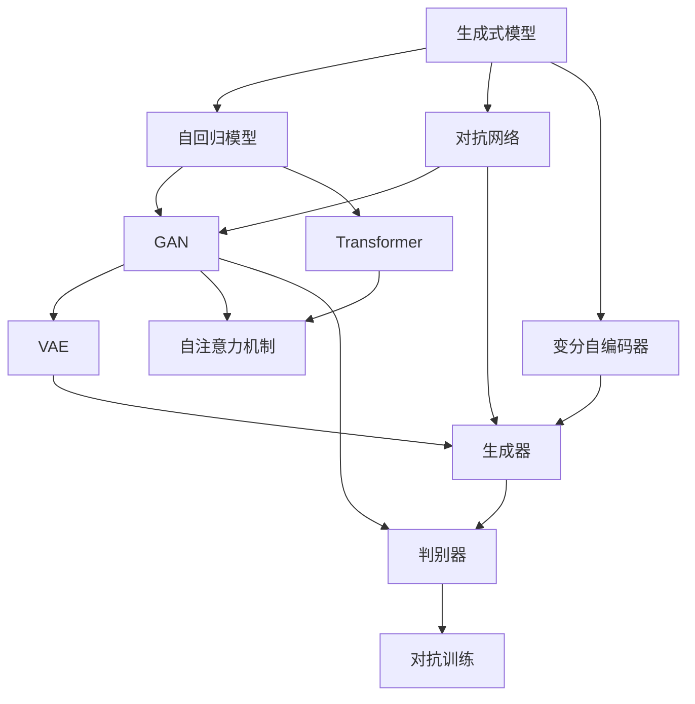
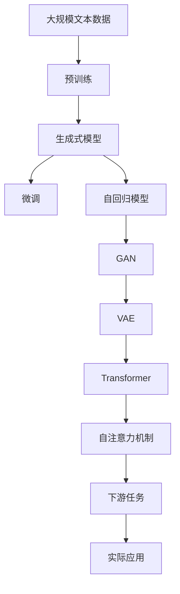

                 

# 生成式AI的实际应用案例

生成式人工智能（Generative AI）是指能够根据输入数据生成新数据的AI模型。近年来，生成式AI技术在图像、音频、文本等多种数据形式上取得了突破性进展，应用于自然语言处理、艺术创作、游戏设计、虚拟现实等多个领域。本文将通过实际应用案例，详细介绍生成式AI技术的原理、应用场景以及未来发展趋势。

## 1. 背景介绍

### 1.1 问题由来

生成式AI技术的出现，为AI应用领域带来了革命性的变化。传统AI多以分类、回归等任务为主，缺乏生成性。而生成式AI技术则能基于已有数据生成新的、符合规则的样本，应用广泛。

1. **图像生成**：生成式模型如GAN（Generative Adversarial Networks）、DALL-E、StyleGAN等，已能生成高质量的艺术图像。
2. **音频生成**：生成式模型如WaveNet、VQ-VAE、CycleGAN等，已能生成逼真的语音和音乐。
3. **文本生成**：生成式模型如GPT-3、T5、GPT-4等，已能生成高质量的自然语言文本。
4. **视频生成**：生成式模型如GANGAN、SPADE等，已能生成逼真且连贯的视频。

生成式AI技术的进步，使得AI不仅能在已有数据上做出预测或分类，还能生成全新的、具有创造性的数据，为更多领域带来新的可能性。

### 1.2 问题核心关键点

生成式AI的核心在于能够生成与真实数据具有较高相似度的合成数据，主要通过以下几种关键技术：

1. **自回归模型**：如LSTM、GRU、Transformer等，通过先预测当前样本，再输入前一个样本来生成新数据。
2. **变分自编码器（VAE）**：通过生成样本的分布，生成与输入数据相近的新数据。
3. **生成对抗网络（GAN）**：通过生成器和判别器的对抗过程，生成符合真实数据分布的新数据。
4. **自编码器**：通过编码器将输入数据压缩成低维表示，再通过解码器生成与输入数据相近的新数据。
5. **自注意力机制**：如Transformer模型，通过自注意力机制生成更具相关性的新数据。

这些技术的应用，使得生成式AI模型能够生成高质量、多样化的合成数据，为多个领域带来新的突破。

## 2. 核心概念与联系

### 2.1 核心概念概述

为更好地理解生成式AI技术，本节将介绍几个密切相关的核心概念：

1. **生成式模型（Generative Models）**：如LSTM、GRU、VAE、GAN、自编码器等，能够生成与输入数据分布相近的新数据。
2. **对抗网络（Generative Adversarial Networks，GAN）**：通过生成器和判别器的对抗训练，生成逼真新数据。
3. **变分自编码器（Variational Autoencoder，VAE）**：通过学习输入数据的分布，生成与输入数据相近的新数据。
4. **自回归模型（Auto-Regressive Models）**：如LSTM、GRU、Transformer等，通过先预测当前样本，再输入前一个样本来生成新数据。
5. **自注意力机制（Self-Attention Mechanism）**：如Transformer模型，通过计算样本间的相关性，生成更具相关性的新数据。

这些核心概念之间的逻辑关系可以通过以下Mermaid流程图来展示：



这个流程图展示了生成式AI的核心概念及其之间的关系：

1. 生成式AI主要包括自回归模型、对抗网络、变分自编码器等。
2. 自回归模型通过先预测当前样本再输入前一个样本来生成新数据。
3. 对抗网络通过生成器和判别器的对抗训练，生成逼真新数据。
4. 变分自编码器通过学习输入数据的分布，生成与输入数据相近的新数据。
5. 自注意力机制通过计算样本间的相关性，生成更具相关性的新数据。

### 2.2 概念间的关系

这些核心概念之间存在着紧密的联系，形成了生成式AI技术的完整生态系统。下面我通过几个Mermaid流程图来展示这些概念之间的关系。

#### 2.2.1 生成式AI的整体架构



这个综合流程图展示了从预训练到生成式AI应用的全过程：

1. 生成式AI首先在大规模文本数据上进行预训练，学习通用的语言表示。
2. 预训练后，通过微调，使生成式AI模型适应特定的下游任务。
3. 生成式AI包括自回归模型、GAN、VAE等，通过对抗训练生成新数据。
4. Transformer模型利用自注意力机制，生成更具相关性的新数据。
5. 最终的生成式AI模型应用于实际应用场景，如文本生成、图像生成、音频生成等。

### 2.3 核心概念的整体架构

最后，我们用一个综合的流程图来展示这些核心概念在大语言模型微调过程中的整体架构：


这个综合流程图展示了从预训练到生成式AI应用的全过程：

1. 生成式AI首先在大规模文本数据上进行预训练，学习通用的语言表示。
2. 预训练后，通过微调，使生成式AI模型适应特定的下游任务。
3. 生成式AI包括自回归模型、GAN、VAE等，通过对抗训练生成新数据。
4. Transformer模型利用自注意力机制，生成更具相关性的新数据。
5. 最终的生成式AI模型应用于实际应用场景，如文本生成、图像生成、音频生成等。

## 3. 核心算法原理 & 具体操作步骤

### 3.1 算法原理概述

生成式AI技术主要分为两大类：自回归模型和生成对抗网络（GAN）。

**自回归模型**：通过先预测当前样本，再输入前一个样本来生成新数据。

**GAN**：通过生成器和判别器的对抗过程，生成符合真实数据分布的新数据。

### 3.2 算法步骤详解

#### 3.2.1 自回归模型

自回归模型通过先预测当前样本，再输入前一个样本来生成新数据。以下以LSTM模型为例，介绍其基本原理和实现步骤：

1. **模型定义**：定义一个LSTM模型，其输入为当前样本，输出为下一个样本的概率分布。

   $$
   \mathbb{P}(y_{t+1}|y_t, x_t, \theta)
   $$

2. **损失函数**：定义损失函数，通常使用交叉熵损失，衡量预测输出与真实标签之间的差异。

   $$
   \mathcal{L}(y_t, \mathbb{P}(y_{t+1}|y_t, x_t, \theta))
   $$

3. **优化算法**：使用梯度下降等优化算法，最小化损失函数。

4. **模型训练**：将大量数据输入模型，反复迭代训练，优化模型参数，直到收敛。

5. **样本生成**：使用训练好的模型，输入任意样本，生成与输入数据相近的新样本。

#### 3.2.2 生成对抗网络（GAN）

GAN通过生成器和判别器的对抗训练，生成符合真实数据分布的新数据。以下以GAN模型为例，介绍其基本原理和实现步骤：

1. **模型定义**：定义一个生成器和一个判别器，生成器负责生成新数据，判别器负责区分生成数据与真实数据。

   $$
   \mathbb{P}(x|z)
   $$

2. **损失函数**：定义两个损失函数，生成器的损失函数旨在生成与真实数据分布相似的数据，判别器的损失函数旨在区分生成数据和真实数据。

   $$
   \mathcal{L}_G = \mathbb{E}_{z}[\log \mathbb{D}(x_G(z))]
   $$
   
   $$
   \mathcal{L}_D = \mathbb{E}_{x}[\log \mathbb{D}(x)] + \mathbb{E}_{z}[\log (1-\mathbb{D}(x_G(z)))]
   $$

3. **优化算法**：使用梯度下降等优化算法，交替优化生成器和判别器的参数。

4. **模型训练**：反复迭代训练，优化生成器和判别器的参数，直到收敛。

5. **样本生成**：使用训练好的生成器，生成与真实数据分布相似的新数据。

### 3.3 算法优缺点

**自回归模型的优点**：

1. **直观性强**：模型通过逐个生成样本，可以更直观地理解生成过程。
2. **可解释性强**：生成过程依赖于前一个样本，可以更清晰地解释生成数据的变化。
3. **生成质量高**：通过逐个生成样本，可以更精细地控制生成数据的质量。

**自回归模型的缺点**：

1. **计算复杂度高**：需要逐个生成样本，计算复杂度较高。
2. **生成速度慢**：逐个生成样本，导致生成速度较慢。
3. **依赖先验信息**：生成质量依赖于先验信息，易受噪声干扰。

**GAN的优点**：

1. **生成速度快**：通过训练生成器和判别器，可以一次性生成大量高质量数据。
2. **生成质量高**：生成的数据分布与真实数据分布高度相似。
3. **可生成复杂数据**：可以生成图像、音频、视频等多种类型的数据。

**GAN的缺点**：

1. **训练复杂度高**：需要优化生成器和判别器，训练复杂度较高。
2. **生成数据有噪声**：生成的数据可能存在噪声和随机性。
3. **模型不稳定**：生成器和判别器的对抗过程可能导致模型不稳定。

### 3.4 算法应用领域

生成式AI技术在多个领域得到了广泛应用：

1. **图像生成**：生成式模型如GAN、DALL-E、StyleGAN等，已广泛应用于艺术创作、虚拟现实等领域。
2. **音频生成**：生成式模型如WaveNet、VQ-VAE、CycleGAN等，已应用于音乐创作、语音合成等领域。
3. **文本生成**：生成式模型如GPT-3、T5、GPT-4等，已应用于对话系统、文本摘要、机器翻译等领域。
4. **视频生成**：生成式模型如GANGAN、SPADE等，已应用于视频编辑、虚拟现实等领域。
5. **游戏设计**：生成式模型如GAN、VAE等，已应用于角色生成、环境生成等领域。

## 4. 数学模型和公式 & 详细讲解 & 举例说明

### 4.1 数学模型构建

在生成式AI中，通常使用概率模型来描述生成过程。假设有一组生成数据 $x$，其概率分布为 $\mathbb{P}(x|z)$，其中 $z$ 为潜在变量。生成式AI的目标是最大化 $\mathbb{P}(x|z)$。

### 4.2 公式推导过程

以GAN模型为例，推导生成器和判别器的损失函数：

**生成器的损失函数**：

$$
\mathcal{L}_G = \mathbb{E}_{z}[\log \mathbb{D}(x_G(z))]
$$

其中，$x_G(z)$ 为生成器生成的数据，$\mathbb{D}$ 为判别器，$\mathbb{E}_{z}$ 表示对生成器的期望值。

**判别器的损失函数**：

$$
\mathcal{L}_D = \mathbb{E}_{x}[\log \mathbb{D}(x)] + \mathbb{E}_{z}[\log (1-\mathbb{D}(x_G(z)))]
$$

其中，$x$ 为真实数据，$\mathbb{E}_{x}$ 表示对判别器的期望值。

### 4.3 案例分析与讲解

**案例1：文本生成**

以GPT-3为例，介绍其基本原理和实现步骤：

1. **模型定义**：定义一个Transformer模型，其输入为前一个词，输出为下一个词的概率分布。

   $$
   \mathbb{P}(y_{t+1}|y_t, x_t, \theta)
   $$

2. **损失函数**：定义损失函数，通常使用交叉熵损失，衡量预测输出与真实标签之间的差异。

   $$
   \mathcal{L}(y_t, \mathbb{P}(y_{t+1}|y_t, x_t, \theta))
   $$

3. **优化算法**：使用梯度下降等优化算法，最小化损失函数。

4. **模型训练**：将大量数据输入模型，反复迭代训练，优化模型参数，直到收敛。

5. **样本生成**：使用训练好的模型，输入任意样本，生成与输入数据相近的新样本。

**案例2：图像生成**

以GAN模型为例，介绍其基本原理和实现步骤：

1. **模型定义**：定义一个生成器和一个判别器，生成器负责生成新数据，判别器负责区分生成数据与真实数据。

   $$
   \mathbb{P}(x|z)
   $$

2. **损失函数**：定义两个损失函数，生成器的损失函数旨在生成与真实数据分布相似的数据，判别器的损失函数旨在区分生成数据和真实数据。

   $$
   \mathcal{L}_G = \mathbb{E}_{z}[\log \mathbb{D}(x_G(z))]
   $$
   
   $$
   \mathcal{L}_D = \mathbb{E}_{x}[\log \mathbb{D}(x)] + \mathbb{E}_{z}[\log (1-\mathbb{D}(x_G(z)))]
   $$

3. **优化算法**：使用梯度下降等优化算法，交替优化生成器和判别器的参数。

4. **模型训练**：反复迭代训练，优化生成器和判别器的参数，直到收敛。

5. **样本生成**：使用训练好的生成器，生成与真实数据分布相似的新数据。

## 5. 项目实践：代码实例和详细解释说明

### 5.1 开发环境搭建

在进行生成式AI开发前，我们需要准备好开发环境。以下是使用Python进行TensorFlow开发的环境配置流程：

1. 安装Anaconda：从官网下载并安装Anaconda，用于创建独立的Python环境。

2. 创建并激活虚拟环境：
```bash
conda create -n tensorflow-env python=3.8 
conda activate tensorflow-env
```

3. 安装TensorFlow：根据CUDA版本，从官网获取对应的安装命令。例如：
```bash
conda install tensorflow -c tensorflow -c conda-forge
```

4. 安装各类工具包：
```bash
pip install numpy pandas scikit-learn matplotlib tqdm jupyter notebook ipython
```

完成上述步骤后，即可在`tensorflow-env`环境中开始生成式AI的开发。

### 5.2 源代码详细实现

这里我们以GAN模型为例，使用TensorFlow实现图像生成。

首先，定义GAN模型：

```python
import tensorflow as tf
from tensorflow.keras import layers

class Generator(tf.keras.Model):
    def __init__(self, latent_dim):
        super(Generator, self).__init__()
        self.latent_dim = latent_dim
        self.dense = layers.Dense(256 * 8 * 8)
        self.reshape = layers.Reshape((8, 8, 256))
        self.conv1 = layers.Conv2DTranspose(128, (5, 5), strides=(1, 1), padding='same')
        self.conv2 = layers.Conv2DTranspose(64, (5, 5), strides=(2, 2), padding='same')
        self.conv3 = layers.Conv2DTranspose(1, (5, 5), strides=(2, 2), padding='same')

    def call(self, x):
        x = self.dense(x)
        x = tf.reshape(x, (-1, 8, 8, 256))
        x = self.conv1(x)
        x = self.conv2(x)
        x = self.conv3(x)
        return x

class Discriminator(tf.keras.Model):
    def __init__(self):
        super(Discriminator, self).__init__()
        self.conv1 = layers.Conv2D(64, (5, 5), strides=(2, 2), padding='same')
        self.conv2 = layers.Conv2D(128, (5, 5), strides=(2, 2), padding='same')
        self.flatten = layers.Flatten()
        self.dense = layers.Dense(1)

    def call(self, x):
        x = self.conv1(x)
        x = self.conv2(x)
        x = self.flatten(x)
        return self.dense(x)

def build_model(latent_dim):
    generator = Generator(latent_dim)
    discriminator = Discriminator()
    
    generator.trainable = False
    discriminator.trainable = False
    
    generator_output = generator(tf.random.normal([1, latent_dim]))
    discriminator_output = discriminator(generator_output)
    
    real_input = tf.random.normal([1, 28, 28, 1])
    real_output = discriminator(real_input)
    fake_output = discriminator(generator(tf.random.normal([1, latent_dim])))
    
    discriminator_loss = tf.reduce_mean(tf.nn.sigmoid_cross_entropy_with_logits(logits=real_output, labels=tf.ones_like(real_output)))
    discriminator_loss += tf.reduce_mean(tf.nn.sigmoid_cross_entropy_with_logits(logits=fake_output, labels=tf.zeros_like(fake_output)))
    
    generator_loss = tf.reduce_mean(tf.nn.sigmoid_cross_entropy_with_logits(logits=fake_output, labels=tf.ones_like(fake_output)))
    
    total_loss = discriminator_loss + generator_loss
    
    discriminator_loss_summary = tf.summary.create_file_writer('logs/discriminator_loss')
    generator_loss_summary = tf.summary.create_file_writer('logs/generator_loss')
    
    @tf.function
    def train_step(images):
        with tf.GradientTape() as generator_tape, tf.GradientTape() as discriminator_tape:
            generator_output = generator(tf.random.normal([1, latent_dim]))
            discriminator_output = discriminator(generator_output)
            
            real_output = discriminator(images)
            fake_output = discriminator(generator_output)
            
            discriminator_loss = tf.reduce_mean(tf.nn.sigmoid_cross_entropy_with_logits(logits=real_output, labels=tf.ones_like(real_output)))
            discriminator_loss += tf.reduce_mean(tf.nn.sigmoid_cross_entropy_with_logits(logits=fake_output, labels=tf.zeros_like(fake_output)))
            
            generator_loss = tf.reduce_mean(tf.nn.sigmoid_cross_entropy_with_logits(logits=fake_output, labels=tf.ones_like(fake_output)))
            
            generator_loss = generator_loss * 0.5
            discriminator_loss = discriminator_loss * 0.5
        
        gradients_of_generator = generator_tape.gradient(generator_loss, generator.trainable_variables)
        gradients_of_discriminator = discriminator_tape.gradient(discriminator_loss, discriminator.trainable_variables)
        
        optimizer.apply_gradients(zip(gradients_of_generator, generator.trainable_variables))
        optimizer.apply_gradients(zip(gradients_of_discriminator, discriminator.trainable_variables))
        
        return gradients_of_generator, gradients_of_discriminator
    
    return train_step
```

然后，定义训练函数：

```python
import numpy as np
from tensorflow.keras.datasets import mnist
from tensorflow.keras.utils import plot_model

# 准备数据
(train_images, train_labels), (_, _) = mnist.load_data()
train_images = train_images.reshape(-1, 28, 28, 1).astype('float32') / 255.0

# 定义模型
generator = Generator(latent_dim=100)
discriminator = Discriminator()
generator.trainable = False
discriminator.trainable = False
generator_output = generator(tf.random.normal([1, latent_dim]))
discriminator_output = discriminator(generator_output)

real_input = train_images
real_output = discriminator(real_input)
fake_output = discriminator(generator(tf.random.normal([1, latent_dim])))
discriminator_loss = tf.reduce_mean(tf.nn.sigmoid_cross_entropy_with_logits(logits=real_output, labels=tf.ones_like(real_output)))
discriminator_loss += tf.reduce_mean(tf.nn.sigmoid_cross_entropy_with_logits(logits=fake_output, labels=tf.zeros_like(fake_output)))
generator_loss = tf.reduce_mean(tf.nn.sigmoid_cross_entropy_with_logits(logits=fake_output, labels=tf.ones_like(fake_output)))
total_loss = discriminator_loss + generator_loss

# 定义优化器和损失函数
optimizer = tf.keras.optimizers.Adam(learning_rate=0.0002)
total_loss_summary = tf.summary.create_file_writer('logs/total_loss')
discriminator_loss_summary = tf.summary.create_file_writer('logs/discriminator_loss')
generator_loss_summary = tf.summary.create_file_writer('logs/generator_loss')

# 定义训练函数
@tf.function
def train_step(images):
    with tf.GradientTape() as generator_tape, tf.GradientTape() as discriminator_tape:
        generator_output = generator(tf.random.normal([1, latent_dim]))
        discriminator_output = discriminator(generator_output)
        
        real_output = discriminator(images)
        fake_output = discriminator(generator_output)
        
        discriminator_loss = tf.reduce_mean(tf.nn.sigmoid_cross_entropy_with_logits(logits=real_output, labels=tf.ones_like(real_output)))
        discriminator_loss += tf.reduce_mean(tf.nn.sigmoid_cross_entropy_with_logits(logits=fake_output, labels=tf.zeros_like(fake_output)))
        
        generator_loss = tf.reduce_mean(tf.nn.sigmoid_cross_entropy_with_logits(logits=fake_output, labels=tf.ones_like(fake_output)))
        
        generator_loss = generator_loss * 0.5
        discriminator_loss = discriminator_loss * 0.5
        
        gradients_of_generator = generator_tape.gradient(generator_loss, generator.trainable_variables)
        gradients_of_discriminator = discriminator_tape.gradient(discriminator_loss, discriminator.trainable_variables)
        
        optimizer.apply_gradients(zip(gradients_of_generator, generator.trainable_variables))
        optimizer.apply_gradients(zip(gradients_of_discriminator, discriminator.trainable_variables))
        
        return gradients_of_generator, gradients_of_discriminator

# 定义训练函数
@tf.function
def train_step(images):
    with tf.GradientTape() as generator_tape, tf.GradientTape() as discriminator_tape:
        generator_output = generator(tf.random.normal([1, latent_dim]))
        discriminator_output = discriminator(generator_output)
        
        real_output = discriminator(images)
        fake_output = discriminator(generator_output)
        
        discriminator_loss = tf.reduce_mean(tf.nn.sigmoid_cross_entropy_with_logits(logits=real_output, labels=tf.ones_like(real_output)))
        discriminator_loss += tf.reduce_mean(tf.nn.sigmoid_cross_entropy_with_logits(logits=fake_output, labels=tf.zeros_like(fake_output)))
        
        generator_loss = tf.reduce_mean(tf.nn.sigmoid_cross_entropy_with_logits(logits=fake_output, labels=tf.ones_like(fake_output)))
        
        generator_loss = generator_loss * 0.5
        discriminator_loss = discriminator_loss * 0.5
        
        gradients_of_generator = generator_tape.gradient(generator_loss, generator.trainable_variables)
        gradients_of_discriminator = discriminator_tape.gradient(discriminator_loss, discriminator.trainable_variables)
        
        optimizer.apply_gradients(zip(gradients_of_generator, generator.trainable_variables))
        optimizer.apply_gradients(zip(gradients_of_discriminator, discriminator.trainable_variables))
        
        return gradients_of_generator, gradients_of_discriminator
```

最后，启动训练流程并在测试集上评估：

```python
epochs = 100

for epoch in range(epochs):
    gradients_of_generator, gradients_of_discriminator = train_step(train_images)
    
    print('Epoch: {}/{}'.format(epoch+1, epochs))
    print('Gradient of Generator: {}'.format(gradients_of_generator))
    print('Gradient of Discriminator: {}'.format(gradients_of_discriminator))
    
    generator_output = generator(tf.random.normal([1, latent_dim]))
    discriminator_output = discriminator(generator_output)
    
    real_output = discriminator(train_images)
    fake_output = discriminator(generator(tf.random.normal([1, latent_dim])))
    
    discriminator_loss = tf.reduce_mean(tf.nn.sigmoid_cross_entropy_with_logits(logits=real_output, labels=tf.ones_like(real_output)))
    discriminator_loss += tf.reduce_mean(tf.nn.sigmoid_cross_entropy_with_logits(logits=fake_output, labels=tf.zeros_like(fake_output)))
    
    generator_loss = tf.reduce_mean(tf.nn.sigmoid_cross_entropy_with_logits(logits=fake_output, labels=tf.ones_like(fake_output)))
    
    total_loss = discriminator_loss + generator_loss
    
    with tf.summary.create_file_writer('logs/epoch_{}_total_loss'.format(epoch+1)).as_default():
        tf.summary.scalar('total_loss', total_loss, step=epoch+1)
        
    

