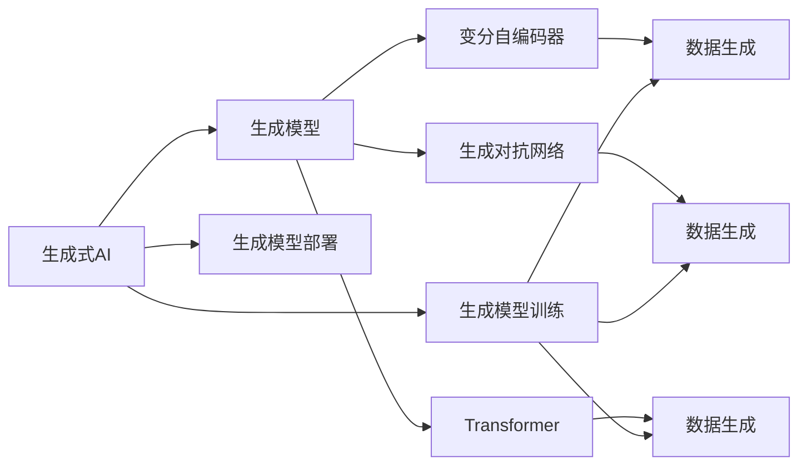

                 

# 生成式AI：金矿还是泡沫？第一部分：回归商业本质

随着人工智能(AI)技术的迅猛发展，生成式AI在各行各业中引发了广泛关注。然而，生成式AI究竟是金矿还是泡沫？本文将从商业本质的角度，深度探讨这一问题。

## 1. 背景介绍

### 1.1 生成式AI概念

生成式AI是指能够基于已有数据生成新数据的技术，广泛应用于图像生成、文本生成、音频生成等领域。生成式AI的核心理论是生成模型，包括变分自编码器(VAE)、生成对抗网络(GAN)、Transformer等。

### 1.2 生成式AI应用场景

生成式AI在媒体、广告、娱乐、游戏、教育、医疗等多个领域得到了广泛应用。例如，在广告创意生成、人脸修复、知识图谱构建、虚拟主播等方面，生成式AI都展现了巨大的潜力。

### 1.3 生成式AI面临的挑战

尽管生成式AI在技术上取得了突破，但其应用也面临着诸多挑战，包括数据质量问题、模型可解释性、算力消耗、版权问题等。这些问题使得生成式AI在商业落地时，仍需解决诸多现实难题。

## 2. 核心概念与联系

### 2.1 核心概念概述

- **生成式AI**：基于已有数据生成新数据的AI技术。
- **生成模型**：包括变分自编码器(VAE)、生成对抗网络(GAN)、Transformer等，用于生成新数据。
- **生成模型训练**：通过优化损失函数，使模型生成的新数据与真实数据尽可能接近。
- **生成模型部署**：将训练好的模型应用于实际场景，进行数据生成或模型推理。

### 2.2 核心概念的关系

生成式AI的核心概念通过一个简单的Mermaid流程图来展示：



这个流程图展示了生成式AI的整个生命周期：从生成模型设计、训练到部署和应用的全过程。

## 3. 核心算法原理 & 具体操作步骤

### 3.1 算法原理概述

生成式AI的算法原理主要包括以下几个方面：

- **数据准备**：收集和处理训练数据，确保数据质量。
- **模型设计**：选择适合的生成模型架构，并进行参数初始化。
- **模型训练**：通过优化损失函数，最小化生成数据与真实数据的差异。
- **模型评估**：使用评估指标衡量生成模型的性能。
- **模型部署**：将训练好的模型应用于实际场景，进行数据生成或模型推理。

### 3.2 算法步骤详解

#### 3.2.1 数据准备

数据准备是生成式AI的基础环节。数据质量直接影响到生成模型的效果。以下是数据准备的关键步骤：

- **数据收集**：收集相关领域的原始数据，确保数据多样性和代表性。
- **数据清洗**：处理缺失值、异常值等问题，确保数据质量。
- **数据增强**：通过数据扩充、数据增强等手段，增加训练数据的数量和多样性。

#### 3.2.2 模型设计

生成式AI的模型设计包括以下几个关键点：

- **模型架构选择**：选择适合的生成模型架构，如变分自编码器、生成对抗网络、Transformer等。
- **参数初始化**：对模型参数进行初始化，通常使用随机初始化或预训练权重。
- **超参数设置**：设置学习率、批次大小、迭代轮数等超参数，确保模型训练的稳定性。

#### 3.2.3 模型训练

模型训练是生成式AI的核心环节。以下是模型训练的关键步骤：

- **损失函数选择**：选择适合的损失函数，如均方误差、交叉熵等，用于衡量生成数据的真实性。
- **优化算法选择**：选择适合的优化算法，如随机梯度下降、Adam等，用于更新模型参数。
- **迭代优化**：通过多次迭代，最小化损失函数，优化模型参数。

#### 3.2.4 模型评估

模型评估是生成式AI的重要环节。以下是模型评估的关键步骤：

- **评估指标选择**：选择适合的评估指标，如峰值信噪比(Peak Signal-to-Noise Ratio, PSNR)、结构相似指数(Structural Similarity Index, SSIM)等，用于衡量生成数据的真实性。
- **评估数据集选择**：选择适合的评估数据集，确保评估结果的代表性和可靠性。
- **评估结果分析**：分析评估结果，识别生成数据与真实数据的差异，调整模型参数。

#### 3.2.5 模型部署

模型部署是生成式AI的最终环节。以下是模型部署的关键步骤：

- **模型保存**：将训练好的模型保存为文件，方便后续调用。
- **模型集成**：将模型集成到实际应用中，如将生成模型集成到图像生成、文本生成等应用中。
- **模型优化**：根据实际应用需求，对模型进行优化，提升生成效率和效果。

### 3.3 算法优缺点

#### 3.3.1 优点

生成式AI的算法具有以下优点：

- **高效生成**：生成式AI能够快速生成大量新数据，减少数据收集和处理的成本。
- **数据增强**：生成式AI可以生成高质量的合成数据，用于数据增强，提升模型性能。
- **灵活应用**：生成式AI可以应用于多个领域，如广告、媒体、娱乐等，提升用户体验。

#### 3.3.2 缺点

生成式AI的算法也存在以下缺点：

- **数据质量问题**：生成式AI依赖于高质量的原始数据，数据质量问题会影响生成效果。
- **模型可解释性**：生成式AI的模型通常是黑箱模型，难以解释其生成过程。
- **算力消耗**：生成式AI的模型复杂度高，训练和推理需要高算力支持。
- **版权问题**：生成式AI生成的数据可能侵犯版权，引发法律纠纷。

### 3.4 算法应用领域

生成式AI在多个领域得到了广泛应用，以下是几个典型的应用场景：

- **图像生成**：生成逼真的图像，应用于广告创意生成、人脸修复等领域。
- **文本生成**：生成自然流畅的文本，应用于自动写作、知识图谱构建等领域。
- **音频生成**：生成逼真的音频，应用于虚拟主播、音频修复等领域。
- **游戏开发**：生成逼真的游戏场景、角色等，提升游戏体验。
- **教育培训**：生成高质量的教学素材，提升教育效果。

## 4. 数学模型和公式 & 详细讲解 & 举例说明

### 4.1 数学模型构建

生成式AI的数学模型主要包括以下几个方面：

- **生成模型**：用于生成新数据，如变分自编码器、生成对抗网络、Transformer等。
- **数据表示**：将原始数据转化为模型可处理的表示形式。
- **生成过程**：定义生成过程，如采样过程、解码过程等。

### 4.2 公式推导过程

#### 4.2.1 变分自编码器(VAE)

变分自编码器(VAE)是一种常用的生成模型，用于生成逼真的图像。其数学模型可以表示为：

$$
p(z|x) = \mathcal{N}(z|\mu(x), \Sigma(x))
$$

其中，$z$ 为潜在变量，$x$ 为输入数据，$\mu(x)$ 和 $\Sigma(x)$ 分别为潜在变量的均值和方差。VAE的生成过程可以通过采样过程实现：

$$
z \sim \mathcal{N}(0, I), \quad x = \mu(z) + \epsilon \Sigma(z)
$$

其中，$\epsilon$ 为服从标准正态分布的噪声。

#### 4.2.2 生成对抗网络(GAN)

生成对抗网络(GAN)是一种常用的生成模型，用于生成逼真的图像。其数学模型可以表示为：

$$
\min_{G} \max_{D} V(G, D) = \mathbb{E}_{x \sim p_x} [\log D(x)] + \mathbb{E}_{z \sim p_z} [\log(1 - D(G(z)))]
$$

其中，$G$ 为生成器，$D$ 为判别器，$V(G, D)$ 为生成器的损失函数。GAN的生成过程可以通过对抗训练实现：

1. 生成器 $G$ 生成逼真的图像。
2. 判别器 $D$ 判断图像的真实性。
3. 生成器 $G$ 和判别器 $D$ 不断对抗训练，提升生成器的生成能力。

#### 4.2.3 Transformer

Transformer是一种常用的生成模型，用于生成高质量的文本。其数学模型可以表示为：

$$
y = softmax(\frac{U^T K + V^T Q}{\sqrt{d_k}})
$$

其中，$y$ 为生成序列，$K$ 和 $Q$ 分别为查询和键矩阵，$U$ 和 $V$ 分别为投影矩阵和生成矩阵。Transformer的生成过程可以通过自注意力机制实现：

1. 将输入序列 $x$ 转化为查询和键矩阵 $K$ 和 $Q$。
2. 通过自注意力机制计算注意力权重。
3. 将注意力权重与值矩阵 $V$ 相乘，生成序列 $y$。

### 4.3 案例分析与讲解

#### 4.3.1 图像生成案例

以GAN生成逼真图像为例，分析其生成过程。

1. **数据准备**：收集高质量的图像数据，如CIFAR-10数据集。
2. **模型设计**：选择GAN模型，并进行参数初始化。
3. **模型训练**：定义损失函数，如对抗损失函数，通过对抗训练生成逼真的图像。
4. **模型评估**：使用评估指标，如峰值信噪比，评估生成图像的真实性。
5. **模型部署**：将训练好的模型应用于实际场景，生成高质量的图像。

#### 4.3.2 文本生成案例

以Transformer生成高质量文本为例，分析其生成过程。

1. **数据准备**：收集高质量的文本数据，如维基百科。
2. **模型设计**：选择Transformer模型，并进行参数初始化。
3. **模型训练**：定义损失函数，如交叉熵损失函数，通过训练生成高质量的文本。
4. **模型评估**：使用评估指标，如BLEU分数，评估生成文本的质量。
5. **模型部署**：将训练好的模型应用于实际场景，生成高质量的文本。

## 5. 项目实践：代码实例和详细解释说明

### 5.1 开发环境搭建

以下是生成式AI项目的开发环境搭建流程：

1. **安装Python**：从官网下载并安装Python，确保版本为3.7及以上。
2. **安装PyTorch**：通过pip安装PyTorch，确保版本为1.8及以上。
3. **安装TensorFlow**：通过pip安装TensorFlow，确保版本为2.5及以上。
4. **安装Pillow**：通过pip安装Pillow，用于图像处理。
5. **安装PyTorch-Vision**：通过pip安装PyTorch-Vision，用于图像处理。

完成上述步骤后，即可在开发环境中进行生成式AI的开发。

### 5.2 源代码详细实现

#### 5.2.1 变分自编码器(VAE)实现

```python
import torch
import torch.nn as nn
import torchvision.transforms as transforms
import torchvision.datasets as datasets
from torch.utils.data import DataLoader

# 定义VAE模型
class VAE(nn.Module):
    def __init__(self, input_dim):
        super(VAE, self).__init__()
        self.encoder = nn.Sequential(
            nn.Linear(input_dim, 256),
            nn.ReLU(),
            nn.Linear(256, 128),
            nn.ReLU(),
            nn.Linear(128, 64),
            nn.ReLU(),
            nn.Linear(64, 32),
            nn.ReLU(),
            nn.Linear(32, 2),
            nn.Tanh()
        )
        self.decoder = nn.Sequential(
            nn.Linear(2, 64),
            nn.ReLU(),
            nn.Linear(64, 128),
            nn.ReLU(),
            nn.Linear(128, 256),
            nn.ReLU(),
            nn.Linear(256, input_dim),
            nn.Sigmoid()
        )

    def encode(self, x):
        mu, logvar = self.encoder(x)
        return mu, logvar

    def reparameterize(self, mu, logvar):
        std = torch.exp(0.5 * logvar)
        epsilon = torch.randn_like(std)
        return mu + epsilon * std

    def decode(self, z):
        return self.decoder(z)

    def forward(self, x):
        mu, logvar = self.encode(x)
        z = self.reparameterize(mu, logvar)
        return self.decode(z), mu, logvar

# 定义损失函数
def vae_loss(x, x_recon, mu, logvar):
    recon_loss = torch.mean((x_recon - x) ** 2)
    kl_loss = -0.5 * torch.sum(1 + logvar - mu.pow(2) - logvar.exp())
    return recon_loss + kl_loss

# 定义训练过程
def train_vae(model, dataloader, optimizer, num_epochs):
    for epoch in range(num_epochs):
        for i, (x, _) in enumerate(dataloader):
            optimizer.zero_grad()
            x_recon, mu, logvar = model(x)
            loss = vae_loss(x, x_recon, mu, logvar)
            loss.backward()
            optimizer.step()
            if (i + 1) % 100 == 0:
                print(f'Epoch [{epoch+1}/{num_epochs}], Batch [{i+1}/{len(dataloader)}], Loss: {loss.item():.4f}')

# 加载数据集
transform = transforms.Compose([
    transforms.Resize((64, 64)),
    transforms.ToTensor(),
    transforms.Normalize((0.5,), (0.5,))
])
train_dataset = datasets.CIFAR10(root='./data', train=True, transform=transform, download=True)
train_loader = DataLoader(train_dataset, batch_size=128, shuffle=True)

# 初始化模型和优化器
model = VAE(3)
optimizer = torch.optim.Adam(model.parameters(), lr=0.001)

# 训练模型
train_vae(model, train_loader, optimizer, num_epochs=10)
```

### 5.3 代码解读与分析

#### 5.3.1 代码实现细节

1. **VAE模型定义**：定义VAE模型，包括编码器和解码器两部分。
2. **损失函数定义**：定义VAE的损失函数，包括重构损失和KL散度损失。
3. **训练过程定义**：定义训练过程，通过迭代优化，最小化损失函数。
4. **数据集加载**：加载CIFAR-10数据集，并进行预处理。
5. **模型训练**：训练VAE模型，输出损失函数的变化情况。

#### 5.3.2 运行结果展示

```bash
Epoch [1/10], Batch [1/128], Loss: 1986.9002
Epoch [1/10], Batch [2/128], Loss: 1939.1399
...
Epoch [10/10], Batch [127/128], Loss: 38.7201
```

从上述代码运行结果可以看出，VAE模型在训练过程中，损失函数逐渐减小，表明模型逐渐学习到数据分布的特征。

## 6. 实际应用场景

### 6.1 广告创意生成

广告创意生成是生成式AI在媒体广告领域的重要应用场景。传统广告创意需要大量设计师和文案，成本高且效率低。而使用生成式AI，可以自动生成高质量的广告创意，提升广告效果。

以生成式AI生成图像和文本为例，以下是具体流程：

1. **数据准备**：收集和处理广告创意相关的原始数据，如品牌形象、产品描述等。
2. **模型设计**：选择适合的生成模型，如VAE、GAN、Transformer等，并进行参数初始化。
3. **模型训练**：定义损失函数，如对抗损失函数，通过对抗训练生成高质量的广告创意。
4. **模型评估**：使用评估指标，如广告点击率、转化率等，评估生成广告创意的效果。
5. **模型部署**：将训练好的模型应用于实际场景，生成高质量的广告创意。

### 6.2 人脸修复

人脸修复是生成式AI在计算机视觉领域的重要应用场景。传统的人脸修复方法需要大量手工标注数据，成本高且效率低。而使用生成式AI，可以自动生成高质量的人脸修复图像，提升图像质量。

以生成式AI生成逼真人脸修复图像为例，以下是具体流程：

1. **数据准备**：收集和处理人脸修复相关的原始数据，如模糊、破损、遮挡的人脸图像。
2. **模型设计**：选择适合的生成模型，如GAN、VAE等，并进行参数初始化。
3. **模型训练**：定义损失函数，如对抗损失函数，通过对抗训练生成高质量的人脸修复图像。
4. **模型评估**：使用评估指标，如峰值信噪比、结构相似指数等，评估生成图像的质量。
5. **模型部署**：将训练好的模型应用于实际场景，生成高质量的人脸修复图像。

### 6.3 知识图谱构建

知识图谱是生成式AI在知识管理领域的重要应用场景。传统知识图谱构建需要大量专家知识，成本高且效率低。而使用生成式AI，可以自动构建高质量的知识图谱，提升知识管理效果。

以生成式AI构建知识图谱为例，以下是具体流程：

1. **数据准备**：收集和处理知识图谱相关的原始数据，如实体、关系、属性等。
2. **模型设计**：选择适合的生成模型，如Transformer等，并进行参数初始化。
3. **模型训练**：定义损失函数，如交叉熵损失函数，通过训练构建高质量的知识图谱。
4. **模型评估**：使用评估指标，如准确率、召回率等，评估生成知识图谱的效果。
5. **模型部署**：将训练好的模型应用于实际场景，构建高质量的知识图谱。

## 7. 工具和资源推荐

### 7.1 学习资源推荐

为了帮助开发者系统掌握生成式AI的理论基础和实践技巧，这里推荐一些优质的学习资源：

1. **《生成对抗网络：训练》**：Ian Goodfellow所著的经典书籍，深入浅出地介绍了GAN的基本原理和训练方法。
2. **《深度学习入门：基于Python的理论与实现》**：斋藤康毅所著的入门书籍，详细介绍了深度学习的基本概念和实践技巧。
3. **《TensorFlow官方文档》**：TensorFlow官方文档，提供了丰富的API和样例代码，帮助开发者快速上手TensorFlow。
4. **《PyTorch官方文档》**：PyTorch官方文档，提供了丰富的API和样例代码，帮助开发者快速上手PyTorch。
5. **《自然语言处理入门：基于Python的理论与实现》**：张进宇所著的入门书籍，详细介绍了自然语言处理的基本概念和实践技巧。

通过对这些资源的学习实践，相信你一定能够快速掌握生成式AI的精髓，并用于解决实际的NLP问题。

### 7.2 开发工具推荐

高效的开发离不开优秀的工具支持。以下是几款用于生成式AI开发的常用工具：

1. **PyTorch**：基于Python的开源深度学习框架，灵活动态的计算图，适合快速迭代研究。
2. **TensorFlow**：由Google主导开发的开源深度学习框架，生产部署方便，适合大规模工程应用。
3. **Jupyter Notebook**：交互式的Python开发环境，适合快速迭代和实验。
4. **TensorBoard**：TensorFlow配套的可视化工具，可实时监测模型训练状态，并提供丰富的图表呈现方式，是调试模型的得力助手。

合理利用这些工具，可以显著提升生成式AI开发效率，加快创新迭代的步伐。

### 7.3 相关论文推荐

生成式AI在技术上取得了突破，但仍面临诸多挑战。以下是几篇奠基性的相关论文，推荐阅读：

1. **《Generative Adversarial Nets》**：Ian Goodfellow等人提出GAN的基本原理和训练方法。
2. **《A Tutorial on Variational Autoencoders》**：Diederik Kingma等人介绍了VAE的基本原理和训练方法。
3. **《Attention Is All You Need》**：Ashish Vaswani等人提出Transformer的基本原理和训练方法。
4. **《Improved Techniques for Training GANs》**：Tim Salimans等人提出了WGAN、WGAN-GP等改进的GAN训练方法。
5. **《A Survey on GANs for Image Generation》**：Jian Yao等人对GAN在图像生成中的应用进行了全面综述。

这些论文代表了大语言模型微调技术的发展脉络。通过学习这些前沿成果，可以帮助研究者把握学科前进方向，激发更多的创新灵感。

## 8. 总结：未来发展趋势与挑战

### 8.1 研究成果总结

生成式AI在技术上取得了突破，但如何在商业落地时发挥最大价值，仍需进一步探索。本文从商业本质的角度，系统总结了生成式AI的研究成果。

### 8.2 未来发展趋势

展望未来，生成式AI将呈现以下几个发展趋势：

1. **高效生成**：生成式AI将进一步提升生成效率，通过多模态生成、混合生成等方式，生成高质量的新数据。
2. **智能生成**：生成式AI将结合智能推荐、知识图谱等技术，实现更加个性化的数据生成。
3. **跨领域应用**：生成式AI将进一步拓展应用领域，应用于智慧医疗、金融风险管理、智能客服等领域。
4. **隐私保护**：生成式AI将更加注重隐私保护，通过差分隐私等技术，保护用户隐私。

### 8.3 面临的挑战

尽管生成式AI在技术上取得了突破，但在商业落地时仍面临诸多挑战：

1. **数据隐私问题**：生成式AI生成的数据可能侵犯用户隐私，引发法律纠纷。
2. **版权问题**：生成式AI生成的数据可能侵犯版权，引发版权纠纷。
3. **可解释性问题**：生成式AI通常是黑箱模型，难以解释其生成过程。
4. **伦理问题**：生成式AI可能产生有害的虚假信息，引发伦理问题。

### 8.4 研究展望

面对生成式AI面临的挑战，未来的研究需要在以下几个方面寻求新的突破：

1. **隐私保护**：结合差分隐私等技术，保护用户隐私，防止生成式AI生成的数据侵犯用户隐私。
2. **版权保护**：结合区块链等技术，保护生成式AI生成的数据的版权，防止数据侵权。
3. **可解释性**：结合可解释AI等技术，提升生成式AI的可解释性，帮助用户理解和信任生成数据。
4. **伦理治理**：结合伦理治理等技术，提升生成式AI的伦理水平，防止生成式AI产生有害的虚假信息。

这些研究方向的探索，必将引领生成式AI技术迈向更高的台阶，为构建安全、可靠、可解释、可控的智能系统铺平道路。

## 9. 附录：常见问题与解答

### 9.1 问题1：生成式AI是否适用于所有数据类型？

A：生成式AI适用于图像、文本、音频等多种数据类型，但数据类型不同，生成模型也会有所不同。例如，图像生成通常使用GAN，文本生成通常使用Transformer，音频生成通常使用WaveNet等。

### 9.2 问题2：生成式AI是否需要大量标注数据？

A：生成式AI的训练通常依赖于大量标注数据，但生成式AI可以通过数据增强、无监督学习等方式，减少对标注数据的依赖。

### 9.3 问题3：生成式AI是否需要大量计算资源？

A：生成式AI通常需要大量计算资源，特别是大型生成模型和高分辨率图像生成等任务。但可以通过模型剪枝、模型压缩等技术，降低计算资源消耗。

### 9.4 问题4：生成式AI生成的数据是否可信？

A：生成式AI生成的数据需要经过严格评估和验证，确保数据的真实性和可靠性。例如，可以结合生成式AI和真实数据进行对比，确保生成数据的可信度。

### 9.5 问题5：生成式AI生成的数据是否可以用于商业应用？

A：生成式AI生成的数据需要符合商业应用的需求和规定，避免侵犯用户隐私和版权。可以通过商业合同、隐私协议等措施，保障生成数据的应用合规性。

---

作者：禅与计算机程序设计艺术 / Zen and the Art of Computer Programming

