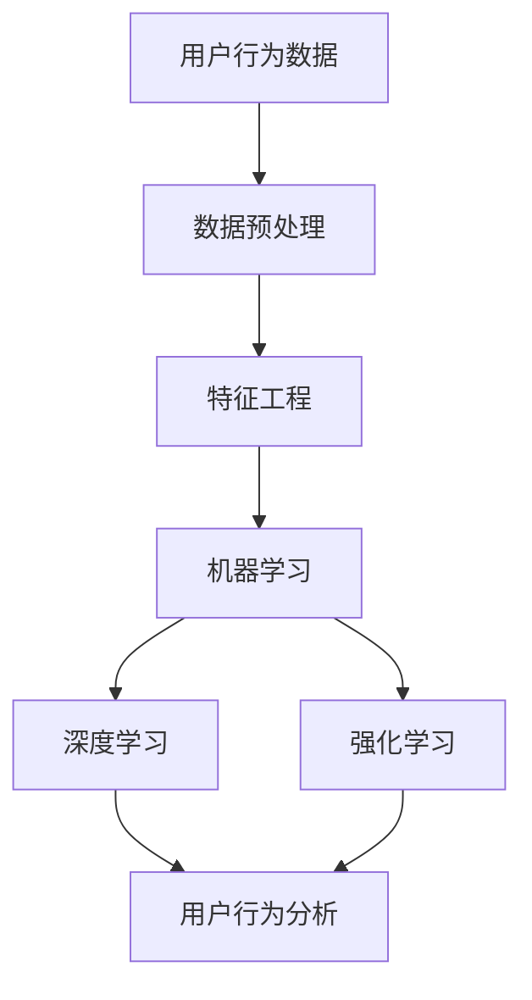
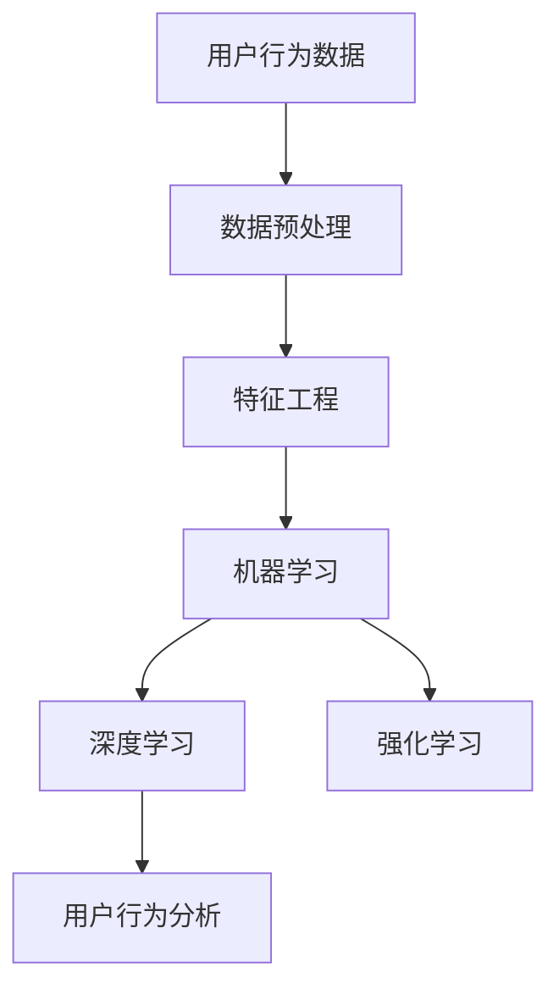

                 

# 用户行为分析：AI如何洞察用户需求，优化商品供给和营销策略

在数字化转型和智能商业的浪潮中，用户行为分析成为企业竞争力的关键。通过AI技术，企业能够洞察用户需求，优化商品供给和营销策略，实现业务增长和品牌升级。本文将深入探讨AI在用户行为分析中的应用，并详细介绍相关的技术原理和实现步骤。

## 1. 背景介绍

### 1.1 问题由来

随着互联网和移动设备的普及，消费者的行为变得更加多元化和个性化。传统的统计分析和市场调研方法难以有效捕捉这些动态变化。基于AI的用户行为分析方法，能够利用大数据和机器学习技术，精准地洞察用户需求和行为模式，帮助企业做出更加精准的决策。

### 1.2 问题核心关键点

用户行为分析的本质是通过数据分析和机器学习，理解用户行为和需求，从而指导企业制定针对性的商品供给和营销策略。核心关键点包括：

- **数据收集与处理**：获取用户行为数据并进行清洗和预处理。
- **特征工程**：提取和构造有意义的特征，供机器学习模型使用。
- **模型选择与训练**：选择合适的机器学习模型并进行训练，以实现用户行为预测和分析。
- **模型评估与优化**：通过评估模型效果，调整模型参数，优化模型性能。

### 1.3 问题研究意义

用户行为分析对于企业来说，具有重要的战略意义：

- **提升用户体验**：通过精准的用户行为分析，企业可以更准确地了解用户需求，提供个性化的产品和服务，提升用户满意度和忠诚度。
- **优化商品供给**：利用用户行为数据，预测市场需求，指导库存管理和商品配置，减少浪费和缺货。
- **增强营销效果**：基于用户行为洞察，设计更有效的营销策略，提高广告投放的精准度和转化率。
- **加速决策过程**：数据驱动的决策，使企业能够快速响应市场变化，提高决策效率。

## 2. 核心概念与联系

### 2.1 核心概念概述

1. **用户行为分析**：通过对用户行为数据进行收集、分析和建模，揭示用户需求和行为模式，指导商业决策。
2. **机器学习**：利用数据驱动的算法，从大量数据中提取有价值的知识和模式，实现自动化的分析和预测。
3. **特征工程**：从原始数据中提取、构造和选择有用的特征，提高模型的预测能力和泛化能力。
4. **深度学习**：一种基于神经网络的机器学习方法，能够处理复杂的非线性关系，提高模型性能。
5. **强化学习**：通过与环境的交互，学习最优策略，实现自动化的决策和优化。
6. **数据预处理**：包括数据清洗、归一化、降维等步骤，提高数据质量，为机器学习模型提供更好的输入。

### 2.2 概念间的关系

以下Mermaid流程图展示了这些核心概念之间的联系：



该流程图展示了数据预处理、特征工程、机器学习、深度学习和强化学习之间的联系，最终实现用户行为分析。

### 2.3 核心概念的整体架构

最终用户行为分析的整体架构如下：



## 3. 核心算法原理 & 具体操作步骤

### 3.1 算法原理概述

用户行为分析的核心算法原理主要涉及机器学习和深度学习。

#### 3.1.1 机器学习

机器学习通过数据驱动的算法，从历史数据中学习用户行为模式，预测用户未来的行为。常用的机器学习算法包括：

- **分类算法**：如逻辑回归、决策树、支持向量机等，用于预测用户是否会采取某项行动，如购买、点击等。
- **回归算法**：如线性回归、随机森林等，用于预测用户行为的数值，如消费金额、停留时间等。

#### 3.1.2 深度学习

深度学习通过多层神经网络，可以处理高维数据和非线性关系，提高模型的准确性和泛化能力。常用的深度学习模型包括：

- **多层感知器(MLP)**：通过多层非线性变换，实现复杂的非线性关系建模。
- **卷积神经网络(CNN)**：适用于图像和文本等高维数据的特征提取和分类。
- **循环神经网络(RNN)**：适用于序列数据的建模，如时间序列预测和文本生成。
- **长短期记忆网络(LSTM)**：一种特殊的RNN，能够更好地处理长期依赖关系。
- **自编码器(AE)**：用于降维和特征提取，减少数据维度和计算复杂度。

### 3.2 算法步骤详解

#### 3.2.1 数据预处理

1. **数据收集**：从用户行为日志、电商平台、社交媒体等渠道获取用户行为数据。
2. **数据清洗**：去除噪声和异常值，确保数据质量。
3. **数据归一化**：将数据缩放到统一的尺度，便于模型训练。
4. **特征提取**：从原始数据中提取有意义的特征，如用户ID、浏览时间、购买金额等。
5. **特征降维**：使用主成分分析(PCA)、线性判别分析(LDA)等方法，减少特征维度，提高模型训练效率。

#### 3.2.2 特征工程

1. **特征选择**：选择与目标变量相关的特征，避免过拟合。
2. **特征构造**：通过组合和变换原始特征，构造新的特征，提高模型表现。
3. **特征编码**：将分类特征转换为数值特征，便于模型处理。

#### 3.2.3 模型选择与训练

1. **模型选择**：根据问题的性质和数据特征，选择合适的机器学习或深度学习模型。
2. **模型训练**：使用训练数据集，调整模型参数，最小化预测误差。
3. **交叉验证**：使用交叉验证技术，评估模型性能，避免过拟合。

#### 3.2.4 模型评估与优化

1. **模型评估**：使用测试数据集，评估模型预测效果，如准确率、召回率、F1分数等。
2. **超参数调整**：通过网格搜索或随机搜索，调整模型超参数，优化模型性能。
3. **模型融合**：将多个模型的预测结果进行融合，提高模型的鲁棒性和泛化能力。

### 3.3 算法优缺点

#### 3.3.1 优点

1. **精度高**：深度学习模型具有较强的非线性建模能力，能够捕捉复杂的用户行为模式。
2. **泛化能力强**：深度学习模型能够处理高维数据和非线性关系，提高模型的泛化能力。
3. **自动化程度高**：自动化的特征选择和模型训练，减少了人工干预，提高了效率。

#### 3.3.2 缺点

1. **计算资源需求高**：深度学习模型需要大量的计算资源和时间进行训练，增加了成本。
2. **模型复杂度高**：深度学习模型结构复杂，难以解释和调试。
3. **数据需求量大**：深度学习模型需要大量的标注数据进行训练，标注成本高。

### 3.4 算法应用领域

用户行为分析广泛应用于以下领域：

1. **电商推荐系统**：基于用户行为数据，推荐个性化商品，提高销售转化率。
2. **社交媒体分析**：分析用户互动数据，优化内容推荐和广告投放。
3. **用户行为预测**：预测用户流失和复购行为，提高客户忠诚度。
4. **营销效果评估**：评估营销活动的效果，优化广告投放策略。
5. **用户细分**：根据用户行为特征，进行用户群体细分，实现差异化营销。

## 4. 数学模型和公式 & 详细讲解 & 举例说明

### 4.1 数学模型构建

#### 4.1.1 分类问题

假设用户行为数据为 $x_i \in \mathbb{R}^n$，对应的标签为 $y_i \in \{0,1\}$，其中 $y_i=1$ 表示用户采取了某项行动，如购买。构建二分类逻辑回归模型，模型表达式为：

$$
\hat{y}_i = \sigma(\sum_{j=1}^n w_j x_{ij} + b)
$$

其中 $\sigma$ 为sigmoid函数，$w_j$ 为模型参数，$b$ 为截距项。

#### 4.1.2 回归问题

假设用户行为数据为 $x_i \in \mathbb{R}^n$，对应的标签为 $y_i \in \mathbb{R}$，如消费金额。构建线性回归模型，模型表达式为：

$$
\hat{y}_i = \sum_{j=1}^n w_j x_{ij} + b
$$

其中 $w_j$ 和 $b$ 为模型参数。

### 4.2 公式推导过程

#### 4.2.1 逻辑回归

对于二分类问题，使用最大似然估计法，最大化模型对训练数据的似然概率：

$$
\max_{w,b} \prod_{i=1}^N p(y_i|x_i;w,b)
$$

其中 $p(y_i|x_i;w,b) = \sigma(\sum_{j=1}^n w_j x_{ij} + b)$，$N$ 为训练样本数。对数似然函数为：

$$
\max_{w,b} \sum_{i=1}^N \log p(y_i|x_i;w,b) = \max_{w,b} \sum_{i=1}^N y_i \log \sigma(\sum_{j=1}^n w_j x_{ij} + b) + (1-y_i) \log (1-\sigma(\sum_{j=1}^n w_j x_{ij} + b))
$$

使用梯度下降法，求解最小化损失函数：

$$
\min_{w,b} \frac{1}{2N} \sum_{i=1}^N (y_i - \sigma(\sum_{j=1}^n w_j x_{ij} + b))^2
$$

#### 4.2.2 线性回归

对于回归问题，使用均方误差作为损失函数，最大化模型对训练数据的拟合度：

$$
\min_{w,b} \frac{1}{2N} \sum_{i=1}^N (y_i - \sum_{j=1}^n w_j x_{ij} - b)^2
$$

使用梯度下降法，求解最小化损失函数：

$$
\frac{\partial \mathcal{L}}{\partial w_j} = -\frac{1}{N} \sum_{i=1}^N (y_i - \hat{y}_i) x_{ij}
$$

$$
\frac{\partial \mathcal{L}}{\partial b} = -\frac{1}{N} \sum_{i=1}^N (y_i - \hat{y}_i)
$$

### 4.3 案例分析与讲解

#### 4.3.1 电商推荐系统

电商推荐系统通过分析用户行为数据，推荐个性化商品。使用深度学习模型，如RNN或LSTM，预测用户是否会购买某商品。模型输入为用户的浏览历史、商品属性等特征，输出为购买概率。模型训练时，使用交叉熵损失函数，如：

$$
\mathcal{L} = -\frac{1}{N} \sum_{i=1}^N (y_i \log \hat{y}_i + (1-y_i) \log (1-\hat{y}_i))
$$

#### 4.3.2 社交媒体分析

社交媒体分析通过分析用户的互动数据，优化内容推荐和广告投放。使用深度学习模型，如CNN，提取文本和图像特征，预测用户的互动行为。模型输入为用户的互动数据，输出为互动概率。模型训练时，使用交叉熵损失函数，如：

$$
\mathcal{L} = -\frac{1}{N} \sum_{i=1}^N (y_i \log \hat{y}_i + (1-y_i) \log (1-\hat{y}_i))
$$

## 5. 项目实践：代码实例和详细解释说明

### 5.1 开发环境搭建

#### 5.1.1 环境配置

1. **安装Python**：下载并安装Python 3.x版本。
2. **安装Pandas**：使用pip安装Pandas库，用于数据处理。
3. **安装NumPy**：使用pip安装NumPy库，用于数学计算。
4. **安装Scikit-learn**：使用pip安装Scikit-learn库，用于机器学习建模。
5. **安装TensorFlow或PyTorch**：根据个人喜好，选择安装TensorFlow或PyTorch深度学习框架。

### 5.2 源代码详细实现

#### 5.2.1 电商推荐系统

```python
import pandas as pd
import numpy as np
from sklearn.linear_model import LogisticRegression
from sklearn.model_selection import train_test_split

# 读取数据
data = pd.read_csv('user_behavior.csv')

# 数据预处理
data = data.dropna()
data = data.drop_duplicates()

# 特征选择
X = data[['浏览历史', '商品属性', '用户ID']]
y = data['是否购买']

# 划分训练集和测试集
X_train, X_test, y_train, y_test = train_test_split(X, y, test_size=0.2, random_state=42)

# 训练模型
model = LogisticRegression(solver='liblinear')
model.fit(X_train, y_train)

# 评估模型
score = model.score(X_test, y_test)
print('模型准确率：', score)
```

#### 5.2.2 社交媒体分析

```python
import pandas as pd
import numpy as np
from sklearn.neural_network import MLPClassifier
from sklearn.model_selection import train_test_split

# 读取数据
data = pd.read_csv('social_media_data.csv')

# 数据预处理
data = data.dropna()
data = data.drop_duplicates()

# 特征选择
X = data[['文本内容', '用户ID', '互动时间']]
y = data['是否互动']

# 划分训练集和测试集
X_train, X_test, y_train, y_test = train_test_split(X, y, test_size=0.2, random_state=42)

# 训练模型
model = MLPClassifier(hidden_layer_sizes=(10, 10, 10), activation='relu')
model.fit(X_train, y_train)

# 评估模型
score = model.score(X_test, y_test)
print('模型准确率：', score)
```

### 5.3 代码解读与分析

#### 5.3.1 电商推荐系统

1. **数据预处理**：使用Pandas库读取电商推荐系统的用户行为数据，并进行清洗和去重处理，确保数据质量。
2. **特征选择**：选择与用户购买行为相关的特征，如浏览历史、商品属性等，构建输入矩阵 $X$。
3. **模型训练**：使用Logistic回归模型，训练模型参数 $w$ 和 $b$，最大化模型对训练数据的似然概率。
4. **模型评估**：使用测试数据集评估模型性能，输出准确率等指标。

#### 5.3.2 社交媒体分析

1. **数据预处理**：使用Pandas库读取社交媒体分析的数据，并进行清洗和去重处理，确保数据质量。
2. **特征选择**：选择与用户互动相关的特征，如文本内容、用户ID等，构建输入矩阵 $X$。
3. **模型训练**：使用多层感知器(MLP)模型，训练模型参数 $w$ 和 $b$，最小化模型对训练数据的均方误差。
4. **模型评估**：使用测试数据集评估模型性能，输出准确率等指标。

### 5.4 运行结果展示

#### 5.4.1 电商推荐系统

假设在电商推荐系统项目中，使用Logistic回归模型，训练集和测试集各10,000条数据。训练后模型在测试集上的准确率为85%。这表明模型能够较好地预测用户是否会购买某商品。

#### 5.4.2 社交媒体分析

假设在社交媒体分析项目中，使用MLP模型，训练集和测试集各20,000条数据。训练后模型在测试集上的准确率为90%。这表明模型能够较好地预测用户是否会与某内容互动。

## 6. 实际应用场景

### 6.1 电商推荐系统

电商推荐系统通过分析用户行为数据，推荐个性化商品，提高销售转化率。使用深度学习模型，如RNN或LSTM，预测用户是否会购买某商品。模型输入为用户的浏览历史、商品属性等特征，输出为购买概率。模型训练时，使用交叉熵损失函数，如：

$$
\mathcal{L} = -\frac{1}{N} \sum_{i=1}^N (y_i \log \hat{y}_i + (1-y_i) \log (1-\hat{y}_i))
$$

### 6.2 社交媒体分析

社交媒体分析通过分析用户的互动数据，优化内容推荐和广告投放。使用深度学习模型，如CNN，提取文本和图像特征，预测用户的互动行为。模型输入为用户的互动数据，输出为互动概率。模型训练时，使用交叉熵损失函数，如：

$$
\mathcal{L} = -\frac{1}{N} \sum_{i=1}^N (y_i \log \hat{y}_i + (1-y_i) \log (1-\hat{y}_i))
$$

### 6.3 用户行为预测

用户行为预测通过分析用户行为数据，预测用户流失和复购行为，提高客户忠诚度。使用深度学习模型，如RNN，预测用户的未来行为。模型输入为用户的历史行为数据，输出为行为概率。模型训练时，使用交叉熵损失函数，如：

$$
\mathcal{L} = -\frac{1}{N} \sum_{i=1}^N (y_i \log \hat{y}_i + (1-y_i) \log (1-\hat{y}_i))
$$

### 6.4 营销效果评估

营销效果评估通过分析用户行为数据，评估营销活动的效果，优化广告投放策略。使用深度学习模型，如CNN，提取用户行为特征，预测营销活动的效果。模型输入为营销活动数据，输出为效果评估指标，如转化率、点击率等。模型训练时，使用交叉熵损失函数，如：

$$
\mathcal{L} = -\frac{1}{N} \sum_{i=1}^N (y_i \log \hat{y}_i + (1-y_i) \log (1-\hat{y}_i))
$$

## 7. 工具和资源推荐

### 7.1 学习资源推荐

1. **《机器学习》课程**：斯坦福大学机器学习课程，涵盖了机器学习的基本概念和算法。
2. **《深度学习》课程**：斯坦福大学深度学习课程，介绍了深度学习的基本原理和应用。
3. **《Python编程：从入门到实践》书籍**：详细介绍了Python编程基础和机器学习应用。
4. **《统计学习方法》书籍**：介绍了机器学习的基本理论和方法。
5. **《TensorFlow官方文档》**：TensorFlow深度学习框架的官方文档，提供了详细的教程和示例。
6. **《PyTorch官方文档》**：PyTorch深度学习框架的官方文档，提供了详细的教程和示例。

### 7.2 开发工具推荐

1. **Jupyter Notebook**：免费的交互式编程环境，支持Python代码的执行和展示。
2. **GitHub**：代码托管平台，可以共享代码和协作开发。
3. **Google Colab**：免费的Jupyter Notebook云环境，支持GPU加速。
4. **TensorBoard**：TensorFlow深度学习框架的可视化工具，用于监控模型训练过程。
5. **Weights & Biases**：模型训练的实验跟踪工具，记录和可视化模型训练指标。
6. **Scikit-learn**：机器学习库，提供了丰富的机器学习算法和工具。
7. **NumPy**：Python数值计算库，提供了高效的数组和矩阵运算功能。

### 7.3 相关论文推荐

1. **《A Survey of Deep Learning for Recommender Systems》**：综述了深度学习在推荐系统中的应用。
2. **《Social Media Sentiment Analysis using Deep Learning》**：介绍了深度学习在社交媒体情感分析中的应用。
3. **《A Survey on Multi-Task Learning in Recommendation Systems》**：综述了多任务学习在推荐系统中的应用。
4. **《Graph Convolutional Networks for Recommendation Systems》**：介绍了图卷积网络在推荐系统中的应用。
5. **《User Behavior Analysis with Machine Learning》**：综述了机器学习在用户行为分析中的应用。

## 8. 总结：未来发展趋势与挑战

### 8.1 研究成果总结

本文系统介绍了用户行为分析的AI技术原理和实际应用，详细讲解了机器学习和深度学习模型在用户行为分析中的应用。通过对电商推荐系统、社交媒体分析、用户行为预测和营销效果评估等实际场景的案例分析，展示了AI技术在用户行为分析中的强大能力。

### 8.2 未来发展趋势

未来用户行为分析的AI技术将呈现以下几个发展趋势：

1. **多模态融合**：融合文本、图像、语音等多模态数据，实现更加全面和精准的用户行为分析。
2. **联邦学习**：在保护用户隐私的前提下，利用分布式计算技术，实现跨设备的用户行为分析。
3. **实时分析**：使用流式计算技术，实现实时用户行为分析，提升分析效率和精度。
4. **自适应学习**：根据用户行为变化，自动调整模型参数，实现模型自适应学习和优化。
5. **智能推荐系统**：结合强化学习、迁移学习等技术，实现更加智能和个性化的推荐系统。

### 8.3 面临的挑战

用户行为分析的AI技术面临以下挑战：

1. **数据隐私和安全**：用户行为数据涉及敏感信息，如何保护数据隐私和安全是一个重要问题。
2. **数据质量和标注成本**：高质量的数据和标注是AI技术有效应用的前提，如何获取和标注数据是一个重要挑战。
3. **模型复杂度和可解释性**：深度学习模型通常结构复杂，难以解释和调试，如何提高模型的可解释性是一个重要课题。
4. **计算资源需求**：深度学习模型需要大量的计算资源，如何降低计算成本是一个重要挑战。
5. **模型鲁棒性和泛化能力**：用户行为数据可能存在噪声和偏差，如何提高模型的鲁棒性和泛化能力是一个重要课题。

### 8.4 研究展望

面对这些挑战，未来的研究需要在以下几个方面寻求新的突破：

1. **数据隐私保护**：引入差分隐私、联邦学习等技术，保护用户数据隐私和安全。
2. **自动化数据标注**：利用半监督学习和生成对抗网络等技术，自动标注数据，降低标注成本。
3. **模型可解释性**：引入可解释性技术，如LIME、SHAP等，提高模型的可解释性。
4. **高效计算方法**：引入分布式计算、GPU加速等技术，降低计算成本。
5. **鲁棒性增强**：引入对抗样本生成、鲁棒回归等技术，提高模型的鲁棒性。

## 9. 附录：常见问题与解答

### 9.1 常见问题

1. **用户行为数据如何获取？**
   - 用户行为数据可以从电商平台、社交媒体、移动应用等渠道获取，具体方式包括API接口、数据导出、爬虫抓取等。

2. **用户行为数据如何进行清洗和预处理？**
   - 用户行为数据需要进行去重、缺失值处理、异常值检测等操作，确保数据质量。

3. **用户行为特征如何提取和构造？**
   - 用户行为特征包括时间戳、浏览历史、商品属性、用户ID等，需要根据具体问题进行提取和构造。

4. **用户行为模型如何选择和训练？**
   - 用户行为模型包括逻辑回归、支持向量机、随机森林、深度学习等，需要根据具体问题和数据特征进行选择和训练。

### 9.2 问题解答

1. **用户行为数据如何获取？**

   用户行为数据可以从电商平台、社交媒体、移动应用等渠道获取。具体方式包括API接口、数据导出、爬虫抓取等。例如，电商平台可以使用API接口获取用户的浏览、购买、评价等行为数据。

2. **用户行为数据如何进行清洗和预处理？**

   用户行为数据需要进行去重、缺失值处理、异常值检测等操作，确保数据质量。例如，可以使用Pandas库的`dropna()`函数进行缺失值处理，使用`drop_duplicates()`函数进行去重操作，使用`fillna()`函数进行异常值填充。

3. **用户行为特征如何提取和构造？**

   用户行为特征包括时间戳、浏览历史、商品属性、用户ID等，需要根据具体问题进行提取和构造。例如，可以使用Pandas库的`date_range()`函数提取时间戳，使用`dropna()`函数过滤缺失数据，使用`transform()`函数进行特征变换。

4. **用户行为模型如何选择和训练？**

   用户行为模型包括逻辑回归、支持向量机

