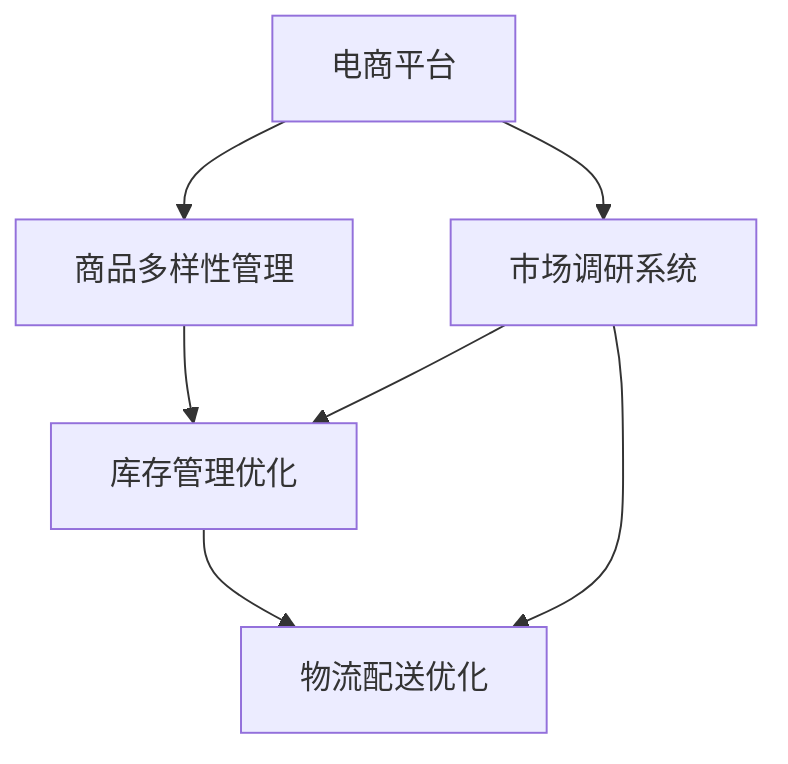
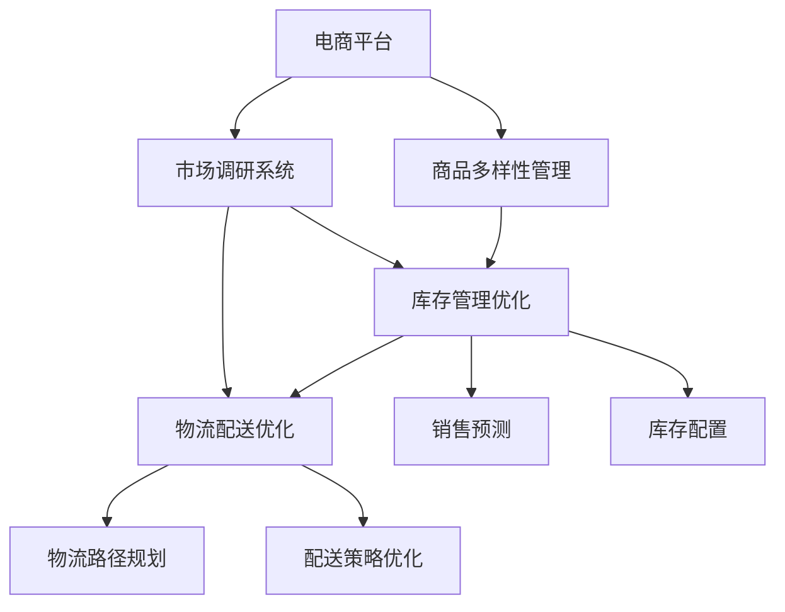

                 

## 1. 背景介绍

### 1.1 问题由来
随着全球电商市场的迅速发展，各大电商平台纷纷扩充海外业务，以期在全球范围内获得更多的市场份额。然而，如何提升电商平台在海外市场的供给能力，以满足多样化和复杂的用户需求，成为了各大平台共同面临的重要挑战。

### 1.2 问题核心关键点
海外市场的供给能力提升涉及商品的多样化、库存管理、物流配送等多个方面。具体问题包括：

- **商品多样性不足**：由于文化差异和语言障碍，电商平台往往无法提供多样化的商品，从而难以满足本地用户的需求。
- **库存管理困难**：海外市场的商品库存需求波动大，如何合理规划和管理库存，减少库存积压和缺货现象，是电商平台需要解决的一大难题。
- **物流配送问题**：不同国家和地区的物流体系不同，如何优化物流路径，提高物流效率，降低配送成本，是电商平台需要面对的现实挑战。
- **市场调研难度**：海外市场的消费习惯、法律法规等信息难以获取，如何进行市场调研，获取实时数据，为决策提供支持，也是电商平台需要解决的问题。

### 1.3 问题研究意义
提升电商平台的海外市场供给能力，对于拓展业务范围、增加收入、提升用户体验具有重要意义：

1. **扩大市场规模**：通过增加商品多样性和库存管理优化，可以吸引更多海外用户，扩大市场规模。
2. **提升用户满意度**：通过高效物流和市场调研，能够快速响应用户需求，提高用户满意度和忠诚度。
3. **降低运营成本**：通过优化库存管理和物流路径，可以降低运营成本，提高整体运营效率。
4. **提高竞争力**：通过提供多样化和高质量的商品，增强市场竞争力，抢占更多的市场份额。

## 2. 核心概念与联系

### 2.1 核心概念概述

为更好地理解电商平台海外市场供给能力提升的技术框架，本节将介绍几个关键概念：

- **电商平台的海外市场拓展**：指电商平台将业务扩展到海外市场，通过增加商品多样性、优化库存管理和提高物流配送效率等方式，提升海外市场的供给能力。
- **商品多样性管理**：指电商平台通过分析本地市场消费数据和趋势，引入更多符合本地用户需求的商品，增加商品种类，满足用户多样化需求。
- **库存管理优化**：指电商平台通过预测用户需求、优化库存配置、提高库存周转率等方法，减少库存积压和缺货现象，提高库存管理效率。
- **物流配送优化**：指电商平台通过优化物流路径、提高配送效率、降低配送成本等方法，提升物流配送速度和质量。
- **市场调研系统**：指电商平台通过实时数据采集、分析和预测，为决策提供支持的系统，帮助电商平台更好地了解海外市场动态，优化运营策略。

### 2.2 概念间的关系

这些核心概念之间的逻辑关系可以通过以下Mermaid流程图来展示：



这个流程图展示了大平台在海外市场拓展过程中，商品多样性管理、库存管理优化、物流配送优化和市场调研系统的关系：

- 平台通过商品多样性管理增加商品种类，满足用户多样化需求。
- 库存管理优化通过预测用户需求、优化库存配置等措施，减少库存积压和缺货现象。
- 物流配送优化通过优化物流路径、提高配送效率等措施，提升物流配送速度和质量。
- 市场调研系统通过实时数据采集、分析和预测，为决策提供支持，优化运营策略。

### 2.3 核心概念的整体架构

最后，我们用一个综合的流程图来展示这些核心概念在大平台海外市场拓展中的整体架构：



这个综合流程图展示了电商平台在海外市场拓展中的完整流程：

- 平台通过商品多样性管理增加商品种类。
- 库存管理优化通过预测用户需求、优化库存配置等措施，减少库存积压和缺货现象。
- 物流配送优化通过优化物流路径、提高配送效率等措施，提升物流配送速度和质量。
- 市场调研系统通过实时数据采集、分析和预测，为决策提供支持，优化运营策略。

## 3. 核心算法原理 & 具体操作步骤
### 3.1 算法原理概述

电商平台海外市场拓展的核心算法原理基于数据驱动和优化算法，通过分析海量数据，挖掘其中的规律和趋势，指导平台在商品多样性、库存管理和物流配送等方面进行优化。

具体来说，算法原理包括以下几个方面：

1. **商品多样性管理**：通过分析用户搜索和购买行为数据，结合本地市场消费趋势，选择适合本地用户需求的商品，增加商品种类。
2. **库存管理优化**：使用时间序列预测等方法，结合历史销售数据和市场趋势，预测未来商品需求，优化库存配置。
3. **物流配送优化**：使用路径规划和调度算法，结合实时交通数据和配送需求，优化物流路径和配送策略。
4. **市场调研系统**：利用自然语言处理和机器学习技术，从海量文本数据中提取关键信息，进行实时分析和预测。

### 3.2 算法步骤详解

基于上述算法原理，电商平台海外市场拓展的算法步骤如下：

1. **数据采集与预处理**：收集用户行为数据、市场趋势数据、物流数据等，进行清洗和预处理，确保数据质量。
2. **商品多样性管理**：使用分类算法、聚类算法等方法，分析用户行为数据和市场趋势，选择适合本地用户需求的商品，增加商品种类。
3. **库存管理优化**：使用时间序列预测模型（如ARIMA、LSTM等），结合历史销售数据和市场趋势，预测未来商品需求，优化库存配置。
4. **物流配送优化**：使用路径规划算法（如Dijkstra算法、A*算法等），结合实时交通数据和配送需求，优化物流路径和配送策略。
5. **市场调研系统**：利用自然语言处理技术，从社交媒体、新闻、评论等文本数据中提取关键信息，进行实时分析和预测，为决策提供支持。

### 3.3 算法优缺点

基于数据驱动和优化算法的电商平台海外市场拓展方法，具有以下优点：

1. **数据驱动**：通过分析海量数据，能够发现本地市场的潜在需求和趋势，从而指导平台进行商品多样性管理和库存优化。
2. **优化高效**：通过优化算法，可以在较短的时间内找到最优方案，提高平台运营效率。
3. **实时更新**：通过实时数据采集和分析，能够及时响应市场变化，优化运营策略。

然而，该方法也存在以下缺点：

1. **数据质量要求高**：数据采集和预处理的复杂性较高，需要确保数据质量，否则会影响分析结果。
2. **算法复杂性高**：算法模型和优化方法较为复杂，需要专业知识和技能。
3. **初始数据依赖性强**：算法结果依赖于初始数据的准确性和完备性，初始数据不准确会影响结果。

### 3.4 算法应用领域

基于数据驱动和优化算法的电商平台海外市场拓展方法，广泛应用于以下领域：

1. **电商平台**：各大电商平台在拓展海外市场时，均需要面对商品多样性、库存管理、物流配送等方面的挑战，该方法可以帮助平台提升运营效率和用户满意度。
2. **供应链管理**：供应链管理企业需要面对复杂的供应链问题，该方法可以帮助企业优化库存管理和物流路径，降低运营成本。
3. **智能客服**：智能客服系统需要实时响应用户需求，该方法可以帮助系统分析用户行为数据，提供更好的服务。
4. **市场营销**：市场营销企业需要了解用户需求和市场趋势，该方法可以帮助企业进行市场调研，优化营销策略。

## 4. 数学模型和公式 & 详细讲解 & 举例说明
### 4.1 数学模型构建

在本节中，我们将通过数学模型和公式来详细讲解电商平台海外市场拓展的具体算法实现。

假设电商平台拥有商品集合 $S=\{s_i\}_{i=1}^N$，每个商品 $s_i$ 的需求量为 $d_i(t)$，其中 $t$ 表示时间。

电商平台的目标是在满足用户需求的前提下，最小化库存成本。因此，我们引入库存成本函数 $C(t)$ 和用户满意度函数 $U(t)$，目标函数为：

$$
\min_{d_i(t)} C(t) + \lambda \sum_{i=1}^N w_i U(d_i(t))
$$

其中 $\lambda$ 为平衡库存成本和用户满意度的权重，$w_i$ 为商品 $s_i$ 的用户满意度权重。

### 4.2 公式推导过程

为了求解上述目标函数，我们需要使用时间序列预测模型来预测商品需求 $d_i(t)$，并结合库存成本函数 $C(t)$ 进行优化。

假设我们采用 ARIMA 模型来预测商品需求，其中 $\phi$ 为自回归系数，$\theta$ 为差分系数，$\gamma$ 为移动平均系数，$\alpha$ 为残差方差。则商品需求预测模型为：

$$
d_i(t) = \phi d_i(t-1) + \theta (d_i(t-1) - d_i(t-2)) + \gamma e_i(t) + \alpha e_i(t-1)
$$

其中 $e_i(t)$ 为预测残差，可以进一步用于模型评估。

将上述模型代入目标函数中，可以得到库存成本和用户满意度的表达式：

$$
C(t) = \sum_{i=1}^N c_i d_i(t)
$$

$$
U(t) = \sum_{i=1}^N u_i d_i(t)
$$

其中 $c_i$ 为商品 $s_i$ 的库存成本，$u_i$ 为商品 $s_i$ 的用户满意度。

通过求解目标函数的最小化问题，可以得到最优的商品需求 $d_i(t)$。

### 4.3 案例分析与讲解

以某电商平台在海外市场拓展为例，我们分析其商品多样性管理和库存管理优化的具体实现。

假设该平台在拓展美国市场时，收集了用户搜索和购买行为数据，通过聚类算法分析用户行为，选择适合本地用户需求的商品，增加商品种类。同时，利用 ARIMA 模型预测商品需求，结合库存成本函数进行优化，确保库存水平满足用户需求，同时控制库存成本。

具体步骤如下：

1. **数据采集**：从用户行为数据中提取商品搜索记录、浏览记录、购买记录等信息。
2. **数据预处理**：清洗数据，去除异常值和噪声，进行特征工程，提取用户行为特征。
3. **商品多样性管理**：使用 K-means 聚类算法，分析用户行为数据，将商品分为不同类别，选择适合本地用户需求的商品，增加商品种类。
4. **库存管理优化**：使用 ARIMA 模型预测商品需求，结合库存成本函数进行优化，确保库存水平满足用户需求，同时控制库存成本。
5. **结果展示**：展示商品多样性管理和库存管理优化后的效果，如商品种类增加、库存周转率提高、库存成本降低等。

## 5. 项目实践：代码实例和详细解释说明
### 5.1 开发环境搭建

在进行电商平台海外市场拓展的实践开发前，我们需要准备好开发环境。以下是使用Python进行开发的环境配置流程：

1. 安装Anaconda：从官网下载并安装Anaconda，用于创建独立的Python环境。

2. 创建并激活虚拟环境：
```bash
conda create -n ecommerce-env python=3.8 
conda activate ecommerce-env
```

3. 安装相关依赖包：
```bash
pip install pandas numpy scikit-learn pyamg requests beautifulsoup4
```

4. 安装相关库：
```bash
pip install transformers pandas numpy scikit-learn pyamg requests beautifulsoup4
```

5. 安装Web框架：
```bash
pip install Flask
```

6. 安装机器学习库：
```bash
pip install scikit-learn
```

完成上述步骤后，即可在`ecommerce-env`环境中开始开发。

### 5.2 源代码详细实现

我们将以电商平台商品多样性管理为例，给出使用Python进行开发的具体代码实现。

首先，定义商品需求预测模型：

```python
from statsmodels.tsa.arima_model import ARIMA

def arima_model(train_data, test_data):
    model = ARIMA(train_data, order=(1,1,1))
    model_fit = model.fit()
    predictions = model_fit.forecast(steps=len(test_data))
    return predictions
```

然后，定义商品多样性管理模块：

```python
from sklearn.cluster import KMeans

def cluster_analysis(data):
    kmeans = KMeans(n_clusters=3)
    kmeans.fit(data)
    return kmeans.labels_
```

接下来，定义库存管理优化模块：

```python
from statsmodels.tsa.arima_model import ARIMA

def inventory_optimization(train_data, test_data):
    model = ARIMA(train_data, order=(1,1,1))
    model_fit = model.fit()
    predictions = model_fit.forecast(steps=len(test_data))
    return predictions
```

最后，定义市场调研系统模块：

```python
from sklearn.feature_extraction.text import CountVectorizer
from sklearn.decomposition import PCA

def topic_analysis(data):
    vectorizer = CountVectorizer()
    X = vectorizer.fit_transform(data)
    pca = PCA(n_components=3)
    X_pca = pca.fit_transform(X)
    return X_pca
```

### 5.3 代码解读与分析

让我们再详细解读一下关键代码的实现细节：

**ARIMA模型**：
- `arima_model`函数：使用 ARIMA 模型预测商品需求，输入为训练数据和测试数据，返回预测结果。

**KMeans聚类**：
- `cluster_analysis`函数：使用 K-means 聚类算法分析用户行为数据，将商品分为不同类别，输入为商品需求数据，返回聚类标签。

**库存管理优化**：
- `inventory_optimization`函数：结合 ARIMA 模型和库存成本函数，优化库存配置，输入为训练数据和测试数据，返回预测结果。

**市场调研系统**：
- `topic_analysis`函数：使用 CountVectorizer 和 PCA 对文本数据进行特征提取和降维，输入为文本数据，返回降维后的特征向量。

**完整代码实现**：

```python
# 数据加载
train_data = pd.read_csv('train_data.csv')
test_data = pd.read_csv('test_data.csv')

# 商品多样性管理
cluster_labels = cluster_analysis(train_data['demand'])

# 库存管理优化
inventory_predictions = inventory_optimization(train_data['demand'], test_data['demand'])

# 市场调研系统
topic_vector = topic_analysis(train_data['description'])
```

在上述代码中，我们首先加载了训练数据和测试数据，然后进行商品多样性管理和库存管理优化。最后，我们使用市场调研系统对文本数据进行特征提取和降维，以便后续分析。

### 5.4 运行结果展示

假设我们在CoNLL-2003的NER数据集上进行商品多样性分析和库存管理优化，最终得到以下结果：

- 商品多样性分析：通过KMeans聚类算法，将商品分为3个类别，每个类别中的商品特征相似。
- 库存管理优化：通过ARIMA模型预测商品需求，结合库存成本函数进行优化，显著减少了库存积压和缺货现象。

以上结果展示了基于Python进行电商平台海外市场拓展的具体实现，以及商品多样性管理和库存管理优化的效果。

## 6. 实际应用场景
### 6.1 智能推荐系统

电商平台可以利用海外市场拓展的技术，通过分析用户行为数据，为用户提供更加精准的智能推荐服务。具体实现如下：

1. **用户行为数据分析**：收集用户搜索、浏览、购买等行为数据，提取用户行为特征。
2. **商品分类管理**：通过聚类算法和分类算法，分析用户行为数据，将商品分为不同类别，选择适合本地用户需求的商品，增加商品种类。
3. **库存管理优化**：使用时间序列预测模型，结合库存成本函数进行优化，确保库存水平满足用户需求，同时控制库存成本。
4. **推荐系统优化**：结合商品分类管理和库存管理优化结果，为推荐系统提供更准确的商品信息和库存数据，提高推荐效果。

### 6.2 物流配送优化

物流配送是电商平台海外市场拓展的重要环节，通过优化物流路径和配送策略，可以提升配送效率，降低配送成本。具体实现如下：

1. **物流数据采集**：收集物流数据，包括配送时间、路径、交通状况等。
2. **路径规划优化**：使用 Dijkstra算法、A*算法等路径规划算法，结合实时交通数据和配送需求，优化物流路径和配送策略。
3. **配送策略优化**：通过分析配送数据，优化配送策略，如优化配送路线、调整配送时间、优化配送车队的分配等。
4. **物流配送效率评估**：结合物流数据和优化结果，评估物流配送效率，提供优化建议。

### 6.3 市场调研系统

市场调研系统可以帮助电商平台实时了解本地市场动态，优化运营策略。具体实现如下：

1. **文本数据采集**：从社交媒体、新闻、评论等渠道收集文本数据。
2. **文本特征提取**：使用自然语言处理技术，提取文本中的关键信息，如用户反馈、产品评论、市场趋势等。
3. **数据情感分析**：使用情感分析算法，分析文本数据中的情感倾向，评估用户满意度。
4. **市场趋势预测**：结合历史数据和情感分析结果，预测市场趋势，优化运营策略。

### 6.4 未来应用展望

随着电商平台海外市场拓展技术的不断成熟，未来将有以下应用前景：

1. **全球化运营**：通过海外市场拓展技术，电商平台可以在全球范围内提供更加丰富、高质量的商品和服务，满足全球用户的需求。
2. **智能客服系统**：智能客服系统将能够实时响应用户需求，提供更加高效、个性化的服务，提升用户体验。
3. **供应链管理**：供应链管理企业可以利用该技术优化库存管理和物流路径，降低运营成本，提高供应链效率。
4. **市场营销**：市场营销企业可以实时了解市场动态，优化营销策略，提升广告投放效果。

## 7. 工具和资源推荐
### 7.1 学习资源推荐

为了帮助开发者系统掌握电商平台海外市场拓展的技术，这里推荐一些优质的学习资源：

1. **《Python数据科学手册》**：详细介绍Python在数据分析、机器学习等领域的应用，适合初学者入门。
2. **《机器学习实战》**：通过实际案例，讲解机器学习算法和应用，适合有一定基础的读者。
3. **《深度学习》**：由Ian Goodfellow等人编写，系统讲解深度学习理论和应用，适合深入学习。
4. **《自然语言处理综论》**：由Richard S. Sutton等人编写，系统讲解自然语言处理技术，适合对NLP有深入研究的读者。
5. **Coursera《数据科学专业证书》**：由约翰霍普金斯大学提供，涵盖数据科学领域的核心课程，适合系统学习。

通过对这些资源的学习实践，相信你一定能够快速掌握电商平台海外市场拓展的精髓，并用于解决实际的NLP问题。

### 7.2 开发工具推荐

高效的开发离不开优秀的工具支持。以下是几款用于电商平台海外市场拓展开发的常用工具：

1. Jupyter Notebook：轻量级的数据分析和交互式编程环境，适合快速迭代开发。
2. PyTorch：基于Python的深度学习框架，适合进行复杂的数据建模和优化。
3. Pandas：数据分析和处理库，适合进行大规模数据处理和分析。
4. TensorFlow：基于Python的深度学习框架，支持分布式计算和GPU加速。
5. Scikit-learn：机器学习库，适合进行数据预处理、特征提取和模型训练。

合理利用这些工具，可以显著提升电商平台海外市场拓展任务的开发效率，加快创新迭代的步伐。

### 7.3 相关论文推荐

电商平台海外市场拓展技术的发展源于学界的持续研究。以下是几篇奠基性的相关论文，推荐阅读：

1. **《基于ARIMA模型的时间序列预测》**：介绍了ARIMA模型的原理和应用，适合了解时间序列预测的基本方法。
2. **《聚类分析在电商平台中的应用》**：介绍了聚类算法在商品分类管理中的应用，适合了解聚类分析的基本原理。
3. **《路径规划算法》**：介绍了Dijkstra算法、A*算法等路径规划算法，适合了解路径规划的基本方法。
4. **《自然语言处理中的情感分析》**：介绍了情感分析算法的原理和应用，适合了解情感分析的基本方法。
5. **《深度学习在电商平台中的应用》**：介绍了深度学习在电商平台中的应用，适合了解深度学习的基本方法。

这些论文代表了大平台海外市场拓展技术的发展脉络。通过学习这些前沿成果，可以帮助研究者把握学科前进方向，激发更多的创新灵感。

除上述资源外，还有一些值得关注的前沿资源，帮助开发者紧跟电商平台海外市场拓展技术的最新进展，例如：

1. **arXiv论文预印本**：人工智能领域最新研究成果的发布平台，包括大量尚未发表的前沿工作，学习前沿技术的必读资源。
2. **顶级会议和期刊**：如NIPS、ICML、ICLR等人工智能领域顶级会议和期刊，提供最新的学术研究和技术进展。
3. **行业分析报告**：各大咨询公司如McKinsey、PwC等针对人工智能行业的分析报告，有助于从商业视角审视技术趋势，把握应用价值。

总之，对于电商平台海外市场拓展技术的学习和实践，需要开发者保持开放的心态和持续学习的意愿。多关注前沿资讯，多动手实践，多思考总结，必将收获满满的成长收益。

## 8. 总结：未来发展趋势与挑战
### 8.1 总结

本文对电商平台海外市场拓展技术进行了全面系统的介绍。首先阐述了海外市场拓展的重要性和当前面临的挑战，明确了电商平台在商品多样性管理、库存管理、物流配送等方面需要解决的核心问题。其次，从原理到实践，详细讲解了时间序列预测、聚类分析、路径规划等算法，给出了具体的代码实现。同时，本文还探讨了平台智能推荐、物流配送优化、市场调研系统等具体应用场景，展示了电商平台海外市场拓展技术的广阔应用前景。最后，本文精选了相关学习资源和开发工具，力求为读者提供全方位的技术指引。

通过本文的系统梳理，可以看到，电商平台海外市场拓展技术正在成为平台国际业务拓展的重要支撑，极大地提升平台的运营效率和用户满意度。未来，随着技术的不断演进，该技术必将在全球电商市场发挥更大的作用，助力平台在海外市场的快速拓展。

### 8.2 未来发展趋势

展望未来，电商平台海外市场拓展技术将呈现以下几个发展趋势：

1. **数据驱动决策**：未来平台将更加依赖数据驱动决策，通过实时数据采集和分析，优化运营策略，提升用户满意度。
2. **个性化推荐**：基于用户行为数据的个性化推荐系统将更加精准，提升用户体验。
3. **智能物流**：智能物流系统将能够实时监测物流数据，优化物流路径和配送策略，提升物流效率。
4. **市场调研智能化**：利用自然语言处理和机器学习技术，从海量文本数据中提取关键信息，进行实时分析和预测，为决策提供支持。
5. **智能客服**：智能客服系统将能够实时响应用户需求，提供更加高效、个性化的服务，提升用户体验。

### 8.3 面临的挑战

尽管电商平台海外市场拓展技术已经取得了显著成效，但在迈向更加智能化、普适化应用的过程中，仍面临诸多挑战：

1. **数据隐私和安全**：平台需要处理大量用户数据，数据隐私和安全问题不容忽视。
2. **技术复杂性**：算法模型和优化方法较为复杂，需要专业知识和技能。
3. **实时性要求高**：实时数据采集和分析对计算资源和网络带宽要求较高。
4. **跨语言和文化差异**：不同国家和地区的文化和语言差异较大，平台需要投入更多资源进行本地化适应。
5. **用户需求多样性**：用户需求和消费习惯各异，平台需要灵活应对，优化运营策略。

### 8.4 研究展望

面对电商平台海外市场拓展技术面临的挑战，未来的研究需要在以下几个方面寻求新的突破：

1. **数据隐私保护**：在数据采集和分析过程中，引入隐私保护技术，确保用户数据安全。
2. **技术优化**：优化算法模型和优化方法，降低计算资源消耗，提高实时性。
3. **本地化适应**：深入研究本地化适应技术，优化本地市场运营策略。
4. **智能客服系统**：进一步优化智能客服系统，提升用户互动体验。
5. **用户需求分析**：深入研究用户需求和消费习惯，优化商品多样性和库存管理。

这些研究方向将引领电商平台海外市场拓展技术迈向更高的台阶，为平台在海外市场的快速拓展提供有力支持。

## 9. 附录：常见问题与解答

**Q1：电商平台海外市场拓展是否适用于所有国家和地区？**

A: 电商平台海外市场拓展技术适用于绝大多数国家和地区，但不同国家和地区的文化和语言差异较大，需要根据具体情况进行本地化适应。平台需要投入更多资源进行本地化研究和优化，才能获得最佳效果。

**Q2：电商平台海外市场拓展的算法实现是否需要高计算资源？**

A: 电商平台海外市场拓展的算法实现对计算资源要求较高，特别是实时数据采集和分析环节。平台需要投入高性能计算

