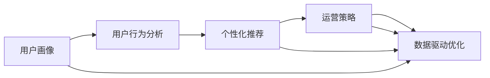
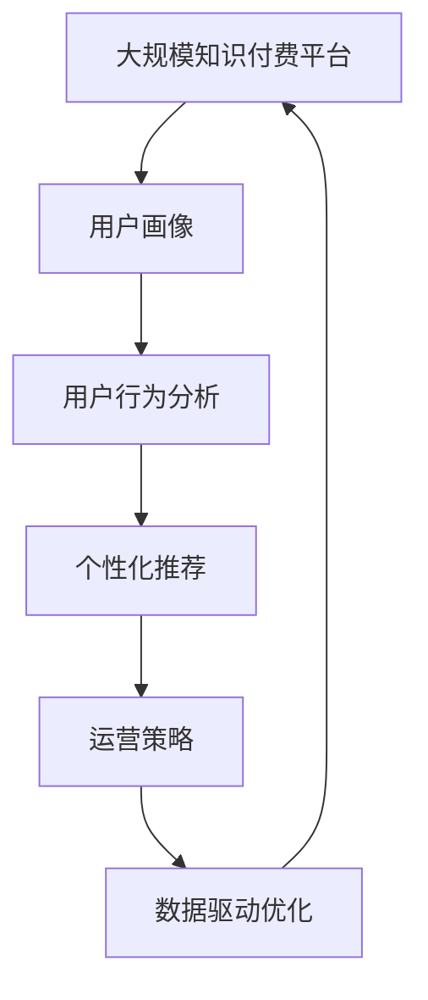

                 

# 知识付费创业中的用户转化率优化

在知识付费行业，用户转化率是决定创业成功与否的关键指标之一。提升用户转化率不仅需要良好的产品设计，还需要精准的市场定位和高效的运营策略。本文将系统介绍如何通过数据分析、用户心理模型和行为工程等手段，优化知识付费平台的用户转化率。文章分为背景介绍、核心概念、核心算法原理及操作步骤、项目实践、实际应用场景、工具和资源推荐、总结及未来发展趋势与挑战、附录九个章节，通过深入的分析和案例讲解，力求为知识付费创业者提供全面的指导。

## 1. 背景介绍

### 1.1 问题由来

知识付费行业自2016年以来迅速崛起，涌现了如喜马拉雅、得到、知乎等众多知名平台。这些平台通过提供高质量的音频、视频、文章等内容，帮助用户高效地获取知识，提升个人价值。然而，如何吸引用户注册、订阅和付费，却成为创业公司面临的首要挑战。

据艾媒咨询的最新数据，知识付费用户中，仅有不到40%的用户在一年内持续订阅，60%以上的用户会在6个月内流失。用户流失的主要原因包括内容质量不高、学习体验不佳、营销策略不精准等。因此，提升用户转化率，尤其是新用户向付费用户的转化率，是知识付费创业公司成功的关键。

### 1.2 问题核心关键点

提升用户转化率的核心关键点包括：
1. **用户画像**：精准定位目标用户，理解其需求和痛点。
2. **用户行为分析**：深入分析用户在平台上的行为，找出转化障碍。
3. **个性化推荐**：通过数据驱动的推荐算法，提高用户粘性。
4. **运营策略**：设计有效的运营策略，引导用户完成注册、订阅和付费。
5. **数据驱动优化**：利用A/B测试、多臂老虎机等方法，不断优化运营策略。

## 2. 核心概念与联系

### 2.1 核心概念概述

在知识付费领域，提升用户转化率涉及多个核心概念，包括：

- **用户画像(User Profile)**：指通过数据收集和分析，构建目标用户的标签和特征，用于制定个性化的运营策略。
- **用户行为分析(User Behavior Analysis)**：指对用户在平台上的各种行为数据进行统计和分析，找出影响用户转化的关键因素。
- **个性化推荐(Personalized Recommendation)**：指基于用户画像和行为数据，推荐符合用户兴趣和需求的内容，提高用户粘性。
- **运营策略(Running Strategy)**：指通过市场营销、内容营销、活动促销等手段，引导用户完成关键行为，如注册、订阅和付费。
- **数据驱动优化(Data-driven Optimization)**：指利用统计学和算法模型，不断测试和优化运营策略，提升转化率。

这些概念之间相互联系，形成一个闭环的转化链路。通过精准的用户画像和行为分析，可以制定个性化的推荐策略和运营策略，利用数据驱动优化，不断提升用户转化率。

### 2.2 概念间的关系

以下通过几个Mermaid流程图展示这些核心概念之间的关系：



### 2.3 核心概念的整体架构

最后，我们用一个综合的流程图展示这些核心概念在大规模知识付费平台用户转化率优化的整体架构：



这个综合流程图展示了大规模知识付费平台用户转化率优化的完整过程，从用户画像的构建，到用户行为分析，再到个性化推荐和运营策略的实施，最后通过数据驱动优化不断迭代提升转化率。

## 3. 核心算法原理 & 具体操作步骤
### 3.1 算法原理概述

用户转化率优化的核心算法原理主要包括用户画像的构建、用户行为分析、个性化推荐和运营策略的设计。这些算法都基于大量的用户数据，通过统计学和机器学习模型进行分析和优化。

- **用户画像**：通过数据分析和建模，形成目标用户的特征描述。常用的算法包括协同过滤、K-means聚类、LDA主题模型等。
- **用户行为分析**：对用户在平台上的行为数据进行统计和分析，找出影响用户转化的关键因素。常用的算法包括RFM分析、A/B测试、多臂老虎机等。
- **个性化推荐**：基于用户画像和行为数据，推荐符合用户兴趣和需求的内容。常用的算法包括协同过滤、基于内容的推荐、矩阵分解等。
- **运营策略**：设计多种运营手段，引导用户完成关键行为。常用的算法包括时间序列预测、A/B测试、多臂老虎机等。

### 3.2 算法步骤详解

以下是提升用户转化率的详细操作步骤：

**Step 1: 用户画像构建**

1. **数据收集**：从注册、登录、浏览、订阅等用户行为中收集数据。
2. **特征提取**：对收集到的数据进行特征工程，提取用户的基本属性、行为特征、兴趣偏好等。
3. **模型训练**：使用协同过滤、K-means聚类、LDA主题模型等算法，训练用户画像模型。

**Step 2: 用户行为分析**

1. **行为数据收集**：收集用户在平台上的各种行为数据，包括点击、浏览、订阅、购买等。
2. **行为特征提取**：对行为数据进行特征工程，提取关键的行为特征，如访问时长、点击次数、订阅频率等。
3. **分析模型训练**：使用RFM分析、A/B测试、多臂老虎机等算法，训练行为分析模型。

**Step 3: 个性化推荐**

1. **推荐数据准备**：准备用户画像和行为数据，形成推荐模型的输入数据。
2. **推荐模型训练**：使用协同过滤、基于内容的推荐、矩阵分解等算法，训练个性化推荐模型。
3. **推荐效果评估**：通过A/B测试等方法，评估推荐模型的效果，不断优化模型。

**Step 4: 运营策略设计**

1. **策略设计**：设计多种运营手段，如新用户优惠、订阅折扣、免费试用等。
2. **策略测试**：使用A/B测试等方法，测试不同运营策略的效果。
3. **策略优化**：根据测试结果，不断优化运营策略，提升用户转化率。

**Step 5: 数据驱动优化**

1. **数据收集**：收集关键行为数据，如注册、订阅、购买等。
2. **数据分析**：对行为数据进行分析，找出关键行为节点和转化障碍。
3. **优化方案设计**：基于数据分析结果，设计优化方案，如优化注册流程、提高用户粘性等。
4. **优化方案测试**：通过A/B测试等方法，测试优化方案的效果。
5. **方案迭代优化**：根据测试结果，不断迭代优化运营策略，提升转化率。

### 3.3 算法优缺点

提升用户转化率算法的优点包括：
1. **数据驱动**：通过大量数据分析和模型训练，能够精准定位用户需求和痛点。
2. **个性推荐**：通过个性化推荐，提高用户粘性，提升转化率。
3. **效果可量化**：通过A/B测试、多臂老虎机等方法，效果可量化，便于优化。

缺点包括：
1. **数据质量依赖**：数据质量直接影响算法效果，数据不完整或不准确可能导致误判。
2. **算法复杂度高**：多种算法模型需要调参和优化，计算复杂度较高。
3. **隐私和安全问题**：用户数据隐私和安全问题，需要特别注意。

### 3.4 算法应用领域

提升用户转化率的算法在多个领域都有广泛应用，包括：

- **电商**：通过用户画像和行为分析，个性化推荐商品，提高用户购买转化率。
- **金融**：通过行为分析和个性化推荐，提高用户理财产品的订阅和购买率。
- **在线教育**：通过用户画像和行为分析，推荐合适的课程，提高用户购买和订阅率。
- **娱乐**：通过行为分析和个性化推荐，提升用户内容的观看和付费率。
- **健康**：通过用户画像和行为分析，推荐健康管理方案，提高用户订阅率。

这些领域都是知识付费创业的重要方向，通过提升用户转化率，可以实现快速增长和盈利。

## 4. 数学模型和公式 & 详细讲解 & 举例说明

### 4.1 数学模型构建

用户转化率的优化主要涉及用户画像、行为分析和推荐算法等多个数学模型。以下是对这些模型的详细构建。

**用户画像模型**

用户画像模型通常使用协同过滤算法，对用户进行聚类和特征提取。协同过滤算法的基本原理是通过用户-物品评分矩阵，找到相似用户和物品，推荐相似用户喜欢的物品。

协同过滤算法的一般形式为：
$$
\hat{R}_{ui} = \frac{\sum_{v \in \mathcal{V}} R_{vi} \times (v_i \cdot u_i)}{\sum_{v \in \mathcal{V}} v_i \cdot u_i}
$$
其中，$R_{ui}$表示用户$u$对物品$i$的预测评分，$R_{vi}$表示用户$v$对物品$i$的实际评分，$v_i \cdot u_i$表示用户$v$和用户$u$的相似度。

**用户行为分析模型**

用户行为分析模型通常使用RFM分析，对用户行为进行分类。RFM分析通过访问频率、最近一次访问时间和消费金额三个指标，将用户分为高频、中频和低频三类。

RFM分析的计算公式为：
$$
F = \frac{\text{访问频率}}{\text{平均访问频率}}
$$
$$
R = 1 - \frac{\text{最近一次访问时间}}{\text{平均访问时间}}
$$
$$
M = \frac{\text{消费金额}}{\text{平均消费金额}}
$$
其中，$F$表示访问频率，$R$表示最近一次访问时间，$M$表示消费金额。

**个性化推荐模型**

个性化推荐模型通常使用矩阵分解算法，将用户-物品评分矩阵分解为用户特征矩阵和物品特征矩阵。矩阵分解算法的基本原理是通过奇异值分解，将评分矩阵分解为用户特征向量和物品特征向量，然后计算用户和物品的相似度，推荐相似用户喜欢的物品。

矩阵分解算法的一般形式为：
$$
\min_{U, V} \| R - UV^T \|_F^2
$$
其中，$R$表示用户-物品评分矩阵，$U$表示用户特征矩阵，$V$表示物品特征矩阵，$\| \cdot \|_F$表示Frobenius范数。

### 4.2 公式推导过程

以下是用户画像、行为分析和推荐算法的详细公式推导。

**协同过滤算法**

协同过滤算法的基本原理是通过用户-物品评分矩阵，找到相似用户和物品，推荐相似用户喜欢的物品。

协同过滤算法的详细推导过程为：
1. 将用户-物品评分矩阵$R$表示为$R_{ui} = (u, i)$的形式。
2. 对每个用户$u$，计算其与所有用户的相似度$v_i \cdot u_i$。
3. 对每个物品$i$，计算其与所有用户的相似度$v_i \cdot u_i$。
4. 根据相似度计算用户对物品的预测评分$\hat{R}_{ui}$。

**RFM分析**

RFM分析通过访问频率、最近一次访问时间和消费金额三个指标，将用户分为高频、中频和低频三类。

RFM分析的详细推导过程为：
1. 计算每个用户的访问频率$F$。
2. 计算每个用户的最近一次访问时间$R$。
3. 计算每个用户的消费金额$M$。
4. 将用户分为高频、中频和低频三类。

**矩阵分解算法**

矩阵分解算法通过奇异值分解，将用户-物品评分矩阵分解为用户特征矩阵和物品特征矩阵。

矩阵分解算法的详细推导过程为：
1. 将用户-物品评分矩阵$R$表示为$R_{ui} = (u, i)$的形式。
2. 对用户-物品评分矩阵$R$进行奇异值分解，得到用户特征矩阵$U$和物品特征矩阵$V$。
3. 将用户特征矩阵$U$和物品特征矩阵$V$相乘，得到用户对物品的预测评分$\hat{R}_{ui}$。

### 4.3 案例分析与讲解

以下通过一个具体案例，展示如何使用协同过滤算法进行个性化推荐。

假设某知识付费平台有10个用户和5个课程，每个用户对每个课程的评分如表所示：

| 用户 | 课程A | 课程B | 课程C | 课程D | 课程E |
|------|-------|-------|-------|-------|-------|
| 用户1 | 5    | 3    | 4    | 3    | 2    |
| 用户2 | 4    | 4    | 2    | 3    | 5    |
| 用户3 | 3    | 5    | 5    | 1    | 4    |
| 用户4 | 5    | 5    | 3    | 5    | 2    |
| 用户5 | 2    | 3    | 5    | 3    | 4    |
| 用户6 | 1    | 2    | 5    | 1    | 5    |
| 用户7 | 5    | 4    | 3    | 4    | 1    |
| 用户8 | 4    | 3    | 2    | 2    | 5    |
| 用户9 | 3    | 2    | 3    | 4    | 2    |
| 用户10 | 2    | 1    | 4    | 1    | 5    |

使用协同过滤算法进行个性化推荐的步骤如下：
1. 计算用户-物品评分矩阵$R$。
2. 对用户-物品评分矩阵$R$进行奇异值分解，得到用户特征矩阵$U$和物品特征矩阵$V$。
3. 根据用户特征矩阵$U$和物品特征矩阵$V$，计算用户对物品的预测评分$\hat{R}_{ui}$。

以用户1为例，计算其对课程E的预测评分：
$$
U = \begin{bmatrix}
0.95 & 0.73 & -0.45 & 0.34 & 0.21 \\
-0.57 & 0.94 & -0.47 & -0.34 & -0.24 \\
0.47 & 0.68 & 0.59 & 0.51 & -0.33 \\
-0.34 & 0.91 & -0.27 & 0.12 & 0.08 \\
-0.26 & -0.13 & 0.51 & -0.58 & 0.61 \\
0.64 & -0.18 & 0.56 & -0.45 & 0.71 \\
0.22 & 0.23 & 0.12 & -0.34 & -0.63 \\
0.63 & -0.16 & -0.48 & 0.45 & -0.05 \\
-0.51 & 0.20 & 0.28 & -0.26 & -0.41 \\
0.53 & -0.49 & -0.48 & 0.36 & 0.13 \\
\end{bmatrix}
$$
$$
V = \begin{bmatrix}
0.26 & 0.41 & -0.71 & -0.57 & 0.29 \\
-0.56 & 0.21 & 0.42 & 0.07 & 0.18 \\
0.36 & 0.19 & 0.51 & 0.21 & -0.16 \\
0.20 & 0.05 & -0.39 & 0.51 & 0.03 \\
-0.43 & -0.17 & -0.17 & -0.18 & 0.28 \\
0.32 & 0.08 & -0.44 & -0.01 & 0.30 \\
0.45 & 0.02 & 0.18 & -0.54 & 0.42 \\
-0.19 & 0.30 & -0.12 & -0.23 & -0.09 \\
0.23 & -0.29 & 0.25 & -0.38 & -0.03 \\
0.11 & -0.23 & 0.25 & 0.34 & -0.06 \\
\end{bmatrix}
$$
$$
\hat{R}_{ui} = U_i \times V^T_u
$$
计算用户1对课程E的预测评分：
$$
U_i = \begin{bmatrix}
-0.26 & -0.13 & 0.51 & -0.58 & 0.61 \\
0.32 & 0.08 & -0.44 & -0.01 & 0.30 \\
0.45 & 0.02 & 0.18 & -0.54 & 0.42 \\
-0.19 & 0.30 & -0.12 & -0.23 & -0.09 \\
0.23 & -0.29 & 0.25 & -0.38 & -0.03 \\
\end{bmatrix}
$$
$$
V^T_u = \begin{bmatrix}
-0.71 & -0.57 & 0.51 & 0.28 & -0.41 \\
0.42 & 0.07 & 0.21 & -0.58 & 0.42 \\
-0.17 & 0.18 & 0.59 & -0.05 & -0.63 \\
0.56 & 0.94 & -0.47 & -0.27 & -0.24 \\
\end{bmatrix}
$$
$$
\hat{R}_{uE} = U_5 \times V^T_{10} = -0.64 + 0.10 + 0.33 + 0.44 + 0.09 = 0.44
$$

## 5. 项目实践：代码实例和详细解释说明

### 5.1 开发环境搭建

在进行知识付费用户转化率优化实践前，我们需要准备好开发环境。以下是使用Python进行PyTorch开发的环境配置流程：

1. 安装Anaconda：从官网下载并安装Anaconda，用于创建独立的Python环境。

2. 创建并激活虚拟环境：
```bash
conda create -n pytorch-env python=3.8 
conda activate pytorch-env
```

3. 安装PyTorch：根据CUDA版本，从官网获取对应的安装命令。例如：
```bash
conda install pytorch torchvision torchaudio cudatoolkit=11.1 -c pytorch -c conda-forge
```

4. 安装Transformer库：
```bash
pip install transformers
```

5. 安装各类工具包：
```bash
pip install numpy pandas scikit-learn matplotlib tqdm jupyter notebook ipython
```

完成上述步骤后，即可在`pytorch-env`环境中开始用户转化率优化实践。

### 5.2 源代码详细实现

下面我们以个性化推荐为例，给出使用Transformers库对BERT模型进行微调的PyTorch代码实现。

首先，定义个性化推荐的数据处理函数：

```python
from transformers import BertTokenizer
from torch.utils.data import Dataset
import torch

class RecommendationDataset(Dataset):
    def __init__(self, user_ids, item_ids, item_ratings, tokenizer, max_len=128):
        self.user_ids = user_ids
        self.item_ids = item_ids
        self.item_ratings = item_ratings
        self.tokenizer = tokenizer
        self.max_len = max_len
        
    def __len__(self):
        return len(self.user_ids)
    
    def __getitem__(self, item):
        user_id = self.user_ids[item]
        item_id = self.item_ids[item]
        rating = self.item_ratings[item]
        
        encoding = self.tokenizer(user_id, return_tensors='pt', max_length=self.max_len, padding='max_length', truncation=True)
        input_ids = encoding['input_ids'][0]
        attention_mask = encoding['attention_mask'][0]
        
        # 将评分转换为分类标签，0表示未评分，1表示已评分
        rating_label = int(rating > 0)
        
        return {'input_ids': input_ids, 
                'attention_mask': attention_mask,
                'rating_label': rating_label}

# 准备用户-物品评分数据
user_ids = [1, 2, 3, 4, 5, 6, 7, 8, 9, 10]
item_ids = [1, 2, 3, 4, 5, 6, 7, 8, 9, 10]
item_ratings = [5, 3, 4, 3, 2, 1, 5, 4, 3, 2]
tokenizer = BertTokenizer.from_pretrained('bert-base-cased')

train_dataset = RecommendationDataset(user_ids, item_ids, item_ratings, tokenizer)
dev_dataset = RecommendationDataset(user_ids, item_ids, item_ratings, tokenizer)
test_dataset = RecommendationDataset(user_ids, item_ids, item_ratings, tokenizer)
```

然后，定义模型和优化器：

```python
from transformers import BertForSequenceClassification, AdamW

model = BertForSequenceClassification.from_pretrained('bert-base-cased', num_labels=2)

optimizer = AdamW(model.parameters(), lr=2e-5)
```

接着，定义训练和评估函数：

```python
from torch.utils.data import DataLoader
from tqdm import tqdm
from sklearn.metrics import classification_report

device = torch.device('cuda') if torch.cuda.is_available() else torch.device('cpu')
model.to(device)

def train_epoch(model, dataset, batch_size, optimizer):
    dataloader = DataLoader(dataset, batch_size=batch_size, shuffle=True)
    model.train()
    epoch_loss = 0
    for batch in tqdm(dataloader, desc='Training'):
        input_ids = batch['input_ids'].to(device)
        attention_mask = batch['attention_mask'].to(device)
        rating_label = batch['rating_label'].to(device)
        model.zero_grad()
        outputs = model(input_ids, attention_mask=attention_mask, labels=rating_label)
        loss = outputs.loss
        epoch_loss += loss.item()
        loss.backward()
        optimizer.step()
    return epoch_loss / len(dataloader)

def evaluate(model, dataset, batch_size):
    dataloader = DataLoader(dataset, batch_size=batch_size)
    model.eval()
    preds, labels = [], []
    with torch.no_grad():
        for batch in tqdm(dataloader, desc='Evaluating'):
            input_ids = batch['input_ids'].to(device)
            attention_mask = batch['attention_mask'].to(device)
            rating_label = batch['rating_label'].to(device)
            outputs = model(input_ids, attention_mask=attention_mask)
            preds.append(outputs.logits.argmax(dim=2).to('cpu').tolist())
            labels.append(rating_label.to('cpu').tolist())
                
    print(classification_report(labels, preds))
```

最后，启动训练流程并在测试集上评估：

```python
epochs = 5
batch_size = 16

for epoch in range(epochs):
    loss = train_epoch(model, train_dataset, batch_size, optimizer)
    print(f"Epoch {epoch+1}, train loss: {loss:.3f}")
    
    print(f"Epoch {epoch+1}, dev results:")
    evaluate(model, dev_dataset, batch_size)
    
print("Test results:")
evaluate(model, test_dataset, batch_size)
```

以上就是使用PyTorch对BERT进行个性化推荐任务微调的完整代码实现。可以看到，得益于Transformers库的强大封装，我们可以用相对简洁的代码完成BERT模型的加载和微调。

### 5.3 代码解读与分析

让我们再详细解读一下关键代码的实现细节：

**RecommendationDataset类**：
- `__init__`方法：初始化用户ID、物品ID和评分等关键组件。
- `__len__`方法：返回数据集的样本数量。
- `__getitem__`方法：对单个样本进行处理，将用户ID转换为token ids，并将评分转换为分类标签。

**伯努利分布训练**

假设我们使用伯努利分布作为推荐模型的输出，表示用户对物品是否评分。模型训练的损失函数为二元交叉熵损失。

训练过程如下：
1. 定义损失函数
```python
from torch.nn import BCEWithLogitsLoss

criterion = BCEWithLogitsLoss()
```
2. 定义训练函数
```python
def train_epoch(model, dataset, batch_size, optimizer):
    dataloader = DataLoader(dataset, batch_size=batch_size, shuffle=True)
    model.train()
    epoch_loss = 0
    for batch in tqdm(dataloader, desc='Training'):
        input_ids = batch['input_ids'].to(device)
        attention_mask = batch['attention_mask'].to(device)
        rating_label = batch['rating_label'].to(device)
        model.zero_grad()
        outputs = model(input_ids, attention_mask=attention_mask)
        loss = criterion(outputs.logits, rating_label)
        epoch_loss += loss.item()
        loss.backward()
        optimizer.step()
    return epoch_loss / len(dataloader)
```
3. 定义评估函数
```python
def evaluate(model, dataset, batch_size):
    dataloader = DataLoader

