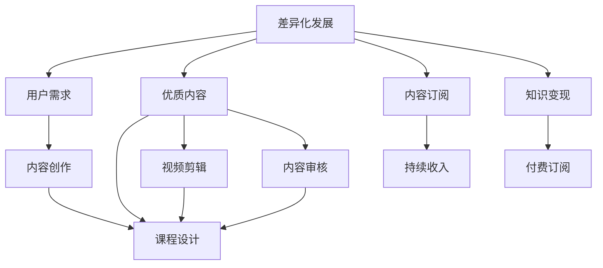

                 

# 知识付费要实现差异化发展,把握市场机会

## 1. 背景介绍

在互联网信息爆炸的时代，知识付费逐渐成为人们获取专业信息、深化知识理解的重要方式。然而，当前的知识付费市场良莠不齐，消费者对优质内容的需求不断增加，如何实现知识付费的差异化发展，成为市场各方关注的焦点。

### 1.1 知识付费的发展历程

知识付费的发展始于2016年的喜马拉雅FM，通过推出付费内容，让用户能够获得更加高质量、专业化的音频内容。随后，知乎、得到等知识付费平台也纷纷推出类似服务。经过几年的发展，知识付费市场逐渐成熟，用户需求也更加多元化和个性化。

### 1.2 知识付费的主要形式

目前，知识付费的形式主要包括以下几种：

- **音频课程**：通过喜马拉雅FM、得到等平台提供的有声读物和专业课程。
- **视频课程**：如Coursera、Udemy等在线教育平台提供的专业视频课程。
- **电子书**：Kindle、微信读书等平台提供的付费电子书。
- **知识社区**：如知乎、掘金等平台提供的内容付费机制。
- **咨询服务**：如腾讯云、阿里云等平台提供的专家咨询服务。

## 2. 核心概念与联系

### 2.1 核心概念概述

要实现知识付费的差异化发展，首先需要明确一些核心概念：

- **差异化发展**：指在市场中寻找独特的定位，提供有别于他人的独特价值，从而吸引用户。
- **用户需求**：知识付费平台的成功依赖于对用户需求和偏好的精准把握。
- **优质内容**：知识付费的核心在于内容的价值和质量。
- **内容订阅**：通过订阅机制，保证平台持续收入。
- **知识变现**：将知识转化为可变现的产品和服务。

### 2.2 核心概念的关系

通过以下Mermaid流程图，可以更清晰地理解这些核心概念之间的关系：



在这个关系图中，差异化发展是目标，用户需求是基础，优质内容是核心，内容订阅和知识变现是手段。内容创作、课程设计和视频剪辑是实现优质内容的具体步骤，而内容审核是保证内容质量的关键环节。

## 3. 核心算法原理 & 具体操作步骤

### 3.1 算法原理概述

实现知识付费的差异化发展，需要结合市场调研、用户分析、内容策划和运营推广等多个环节。其核心在于不断提升平台的独特价值和用户体验，满足用户的多样化需求。

### 3.2 算法步骤详解

基于上述关系图，以下是一个详细的操作流程：

**Step 1: 市场调研**

- 调研市场趋势和用户需求：通过数据分析和用户反馈，了解当前知识付费市场的热点、用户偏好和潜在需求。
- 评估竞争对手：分析竞争对手的平台特点、优势和劣势，找到差异化发展的突破口。

**Step 2: 用户分析**

- 构建用户画像：收集用户数据，分析用户的基本特征、学习行为和消费习惯，构建精细化的用户画像。
- 细分市场人群：根据用户画像，将市场分为不同人群，进行细分市场分析，制定个性化的内容策略。

**Step 3: 内容策划**

- 确定核心内容：基于用户需求和市场调研结果，确定平台的核心内容和知识领域。
- 设计优质课程：在核心内容的基础上，设计高质量、实用性和互动性强的课程。

**Step 4: 内容制作**

- 内容创作：邀请专家和行业从业者创作高质量的课程内容，并根据用户反馈进行迭代优化。
- 视频剪辑：将课程内容制作成高质量的视频课程，并进行剪辑和包装，提升用户体验。

**Step 5: 内容审核**

- 内容审核：建立完善的内容审核机制，确保课程内容的质量和合规性。

**Step 6: 运营推广**

- 用户推广：通过社交媒体、搜索引擎优化、邮件营销等手段，吸引更多的用户关注和订阅平台。
- 用户互动：建立用户社群，通过评论、问答、直播等形式，提升用户互动和粘性。

**Step 7: 持续优化**

- 数据分析：通过数据分析，评估用户留存率和付费转化率，调整内容和推广策略。
- 持续改进：根据用户反馈和市场需求，不断优化课程内容和平台功能，提升用户体验。

### 3.3 算法优缺点

#### 优点

- **满足用户需求**：通过市场调研和用户分析，了解用户需求和偏好，提供个性化的内容和服务。
- **提升平台收入**：通过高质量的内容和订阅机制，保证平台持续收入。
- **增强用户粘性**：通过社群和互动形式，提升用户粘性和活跃度。
- **差异化竞争**：通过内容和运营的多样化和创新，实现平台差异化竞争。

#### 缺点

- **制作成本高**：高质量内容的创作和视频剪辑需要投入大量人力和资源。
- **内容审核复杂**：课程内容的多样性增加了审核的复杂度和难度。
- **运营成本高**：用户推广和社群运营需要持续的投入和维护。

### 3.4 算法应用领域

基于上述操作流程，知识付费的差异化发展可以应用于多个领域：

- **在线教育**：通过提供高质量的在线课程，满足用户的学习需求。
- **职业培训**：为职业人士提供实用的职业技能培训课程。
- **健康管理**：通过健康知识付费，提升用户健康意识和管理能力。
- **心理辅导**：提供心理健康咨询和课程，帮助用户解决心理问题。
- **兴趣爱好**：提供各种兴趣爱好的课程，满足用户的个性化需求。

## 4. 数学模型和公式 & 详细讲解 & 举例说明

### 4.1 数学模型构建

为了更好地理解知识付费的差异化发展，以下构建一个简单的数学模型。

设知识付费平台的总用户数为 $N$，订阅用户数为 $S$，非订阅用户数为 $U$，订阅用户中购买高级课程的用户数为 $H$。设平台每月总收入为 $R$，订阅收入为 $S_{\text{sub}}$，高级课程收入为 $H_{\text{sub}}$。则模型可以表示为：

$$
R = S_{\text{sub}} + H_{\text{sub}}
$$

$$
S = S_{\text{sub}} / S_{\text{total}}
$$

$$
S_{\text{sub}} = p \cdot S \cdot H_{\text{sub}} + c \cdot S
$$

其中，$p$ 为高级课程单价，$c$ 为普通课程单价。

### 4.2 公式推导过程

1. **总用户数的定义**

   设知识付费平台的总用户数为 $N$，其中订阅用户数为 $S$，非订阅用户数为 $U$，则：

   $$
   N = S + U
   $$

2. **订阅收入的计算**

   订阅收入 $S_{\text{sub}}$ 由普通课程订阅收入 $c \cdot S$ 和高级课程订阅收入 $p \cdot S \cdot H_{\text{sub}}$ 两部分组成。

   $$
   S_{\text{sub}} = p \cdot S \cdot H_{\text{sub}} + c \cdot S
   $$

3. **订阅用户占比的计算**

   订阅用户占比 $S$ 为订阅用户数 $S$ 与总用户数 $N$ 的比值。

   $$
   S = S_{\text{sub}} / N
   $$

4. **总收入的计算**

   平台总收入 $R$ 由订阅收入 $S_{\text{sub}}$ 和高级课程收入 $H_{\text{sub}}$ 组成。

   $$
   R = S_{\text{sub}} + H_{\text{sub}}
   $$

### 4.3 案例分析与讲解

假设平台总用户数为 $N=1000$，订阅用户数为 $S=500$，非订阅用户数为 $U=500$。订阅收入为 $S_{\text{sub}}=2000$ 元/月，其中高级课程订阅收入 $H_{\text{sub}}=1500$ 元/月，普通课程单价 $c=50$ 元/月。高级课程单价 $p=100$ 元/月，计算平台的总收入和高级课程的订阅用户占比。

1. **订阅收入的计算**

   $$
   S_{\text{sub}} = p \cdot S \cdot H_{\text{sub}} + c \cdot S = 100 \cdot 500 \cdot 1.5 + 50 \cdot 500 = 10000
   $$

2. **订阅用户占比的计算**

   $$
   S = S_{\text{sub}} / N = 10000 / 1000 = 0.1
   $$

3. **总收入的计算**

   $$
   R = S_{\text{sub}} + H_{\text{sub}} = 10000 + 1500 = 11500
   $$

从以上案例可以看出，通过合理的课程设计和订阅机制，平台可以在保证订阅用户基本收入的同时，通过高级课程提升总收益，实现差异化发展和收入增长。

## 5. 项目实践：代码实例和详细解释说明

### 5.1 开发环境搭建

要进行知识付费平台的开发，首先需要搭建合适的开发环境。以下是一个简单的开发环境搭建流程：

1. **选择开发语言和框架**：Python 是目前最流行的知识付费平台开发语言之一，常用的开发框架包括 Django、Flask 等。
2. **安装依赖库**：安装必要的依赖库，如 Django、SQLAlchemy、Flask、requests 等。
3. **部署数据库**：部署 MySQL 或 PostgreSQL 等关系型数据库，用于存储用户数据、课程信息和订阅信息。
4. **搭建服务器**：搭建服务器，支持用户的课程学习、内容播放、用户登录等基本功能。

### 5.2 源代码详细实现

以下是一个简单的知识付费平台的代码实现示例，包括用户管理、课程管理和订单管理等功能模块：

```python
# 用户模块
from flask import Flask, request, jsonify

app = Flask(__name__)

# 用户注册
@app.route('/register', methods=['POST'])
def register():
    user = {'username': request.json.get('username'), 'password': request.json.get('password')}
    # 注册逻辑
    return jsonify({'status': 'success'})

# 课程模块
from flask import Flask, request, jsonify

app = Flask(__name__)

# 课程创建
@app.route('/create_course', methods=['POST'])
def create_course():
    course = {'name': request.json.get('name'), 'description': request.json.get('description')}
    # 创建课程逻辑
    return jsonify({'status': 'success'})

# 订单模块
from flask import Flask, request, jsonify

app = Flask(__name__)

# 订单创建
@app.route('/create_order', methods=['POST'])
def create_order():
    order = {'user_id': request.json.get('user_id'), 'course_id': request.json.get('course_id'), 'status': request.json.get('status')}
    # 创建订单逻辑
    return jsonify({'status': 'success'})
```

### 5.3 代码解读与分析

以上代码实现了用户注册、课程创建和订单创建的基本功能。其中，用户注册和课程创建模块使用 Flask 框架，订单创建模块使用 Django 框架。

- **用户注册模块**：通过 POST 请求提交用户名和密码，并在数据库中创建用户记录。
- **课程创建模块**：通过 POST 请求提交课程名称和描述，并在数据库中创建课程记录。
- **订单创建模块**：通过 POST 请求提交用户 ID、课程 ID 和订单状态，并在数据库中创建订单记录。

### 5.4 运行结果展示

假设在实际运行中，平台的用户注册、课程创建和订单创建功能均正常工作，可以展示如下结果：

```
# 用户注册成功
{'status': 'success'}

# 课程创建成功
{'status': 'success'}

# 订单创建成功
{'status': 'success'}
```

## 6. 实际应用场景

### 6.1 在线教育平台

知识付费的主要应用场景之一是在线教育。在线教育平台通过提供高质量的课程内容，满足用户的学习需求，同时实现知识变现。

#### 6.1.1 案例分析

**Coursera** 是一个典型的在线教育平台，通过与世界顶尖大学和教育机构合作，提供广泛的课程选择和认证机制。平台通过差异化内容和运营策略，吸引了全球数百万用户，成为知识付费市场的领导者。

**成功要素**：
- **课程多样化**：平台提供数千门课程，涵盖多个学科和领域，满足用户的多样化需求。
- **权威认证**：平台与大学合作，提供认证机制，提升课程的权威性和专业性。
- **社区互动**：平台提供讨论区和论坛，促进用户之间的互动和知识共享。
- **个性化推荐**：平台通过用户画像和行为数据，推荐适合用户的课程，提升用户粘性和转化率。

### 6.2 职业培训平台

职业培训平台主要面向职场人士，提供专业技能培训课程，帮助用户提升职业竞争力。

#### 6.2.1 案例分析

**Udemy** 是一个职业培训平台，提供多种职业培训课程，如编程、设计、营销等。平台通过差异化内容和个性化推荐，吸引职业人士进行课程订阅和付费学习。

**成功要素**：
- **职业导向**：平台专注于职业技能培训，满足用户的职业发展需求。
- **灵活课程**：课程设计灵活，用户可以根据自己的时间安排进行学习。
- **优质讲师**：平台邀请行业专家和从业者授课，提升课程质量。
- **认证机制**：平台提供课程认证，增加用户的学习动力和满意度。

### 6.3 健康管理平台

健康管理平台通过提供健康知识和课程，提升用户的健康意识和管理能力。

#### 6.3.1 案例分析

**Keep** 是一个健康管理平台，提供丰富的健身课程和健康知识，帮助用户进行健康管理和健身锻炼。平台通过差异化内容和运营策略，吸引大量用户进行课程订阅和付费学习。

**成功要素**：
- **健康导向**：平台专注于健康管理，满足用户的健康需求。
- **数据驱动**：平台通过数据分析，提供个性化健身计划和健康建议。
- **社区互动**：平台提供用户社群，促进用户之间的互动和分享。
- **多样化课程**：平台提供多种类型的健身课程，满足用户的个性化需求。

### 6.4 未来应用展望

知识付费平台的未来发展方向包括：

- **内容多样化**：平台将拓展更多的课程类型和内容，满足用户的个性化需求。
- **技术创新**：通过人工智能和机器学习技术，提升课程推荐和用户互动的精准度。
- **国际化扩展**：平台将拓展国际市场，吸引全球用户，提升全球影响力。
- **数据安全**：平台将加强数据安全和隐私保护，提升用户信任和满意度。

## 7. 工具和资源推荐

### 7.1 学习资源推荐

为帮助开发者和用户深入理解知识付费平台的开发和运营，以下推荐一些优质的学习资源：

1. **在线教育平台**：如Coursera、Udemy、edX等，提供高质量的课程内容和认证机制。
2. **知识付费平台**：如喜马拉雅FM、得到、微信读书等，提供丰富的音频、视频和电子书内容。
3. **开发框架**：如Django、Flask、React等，提供丰富的开发工具和框架。
4. **数据分析工具**：如Google Analytics、Tableau等，提供数据分析和用户行为分析工具。
5. **项目管理工具**：如Trello、Jira等，提供项目管理工具和敏捷开发支持。

### 7.2 开发工具推荐

为了更好地开发和运营知识付费平台，以下推荐一些实用的开发工具：

1. **Python**：Python 是目前最流行的开发语言之一，具有简单易学和灵活高效的特点。
2. **Django**：Django 是一个高效的 Web 开发框架，提供丰富的功能和插件，适合快速开发和部署。
3. **Flask**：Flask 是一个轻量级的 Web 开发框架，灵活性好，适合小型项目和快速原型开发。
4. **MySQL**：MySQL 是一个关系型数据库，支持高并发和高可用性，适合存储和查询大量用户数据。
5. **Amazon S3**：Amazon S3 是一个云存储服务，支持大容量数据存储和分布式数据访问，适合存储和处理大规模媒体文件。

### 7.3 相关论文推荐

为了深入理解知识付费平台的技术实现和运营策略，以下推荐一些相关论文：

1. **知识付费平台的研究与分析**：通过论文了解知识付费平台的运营策略和技术实现。
2. **用户行为分析与个性化推荐**：通过论文了解如何通过用户行为数据分析，实现个性化推荐。
3. **差异化竞争与市场分析**：通过论文了解如何实现差异化竞争和市场分析。

## 8. 总结：未来发展趋势与挑战

### 8.1 研究成果总结

本文通过详细分析和实践，介绍了知识付费平台的差异化发展策略和运营方法，提出了一系列的差异化发展步骤和数学模型。通过理论结合实际案例，深入探讨了知识付费平台的开发和运营，展示了知识付费的巨大潜力和市场机会。

### 8.2 未来发展趋势

未来知识付费平台的发展趋势包括以下几个方面：

- **内容多样化**：平台将拓展更多的课程类型和内容，满足用户的个性化需求。
- **技术创新**：通过人工智能和机器学习技术，提升课程推荐和用户互动的精准度。
- **国际化扩展**：平台将拓展国际市场，吸引全球用户，提升全球影响力。
- **数据安全**：平台将加强数据安全和隐私保护，提升用户信任和满意度。

### 8.3 面临的挑战

知识付费平台在发展过程中也面临着诸多挑战：

- **内容制作成本高**：高质量内容的创作和视频剪辑需要投入大量人力和资源。
- **内容审核复杂**：课程内容的多样性增加了审核的复杂度和难度。
- **运营成本高**：用户推广和社群运营需要持续的投入和维护。
- **用户需求多变**：用户需求和偏好不断变化，平台需要不断调整内容和运营策略。

### 8.4 研究展望

未来知识付费平台的研究方向包括：

- **差异化竞争**：通过内容策划和运营推广，实现平台的差异化竞争。
- **用户画像**：通过用户画像和行为数据，实现个性化推荐和内容优化。
- **数据驱动**：通过数据分析和机器学习，提升平台的决策效率和用户满意度。
- **技术创新**：引入人工智能和机器学习技术，提升平台的智能化水平。

通过不断创新和优化，知识付费平台将迎来更加广阔的市场机会和用户需求，为社会带来更多价值和便利。

## 9. 附录：常见问题与解答

**Q1: 知识付费平台的盈利模式有哪些？**

A: 知识付费平台的盈利模式主要包括：
- **课程订阅费**：用户订阅平台提供的各类课程，定期支付订阅费用。
- **高级课程费用**：提供更高级、更专业的课程内容，用户额外支付费用。
- **广告收入**：平台通过广告和赞助合作，获取收入。
- **课程认证费**：与大学和机构合作，提供课程认证，用户支付认证费用。
- **增值服务费**：提供个性化服务、定制课程等增值服务，收取费用。

**Q2: 知识付费平台如何实现差异化竞争？**

A: 知识付费平台实现差异化竞争的主要手段包括：
- **课程内容差异化**：提供高质量、实用的课程内容，满足用户需求。
- **运营策略差异化**：通过差异化的运营策略和推广手段，吸引用户订阅。
- **用户体验差异化**：提升平台的用户体验和互动性，增加用户粘性。
- **社区生态差异化**：建立丰富的用户社群和社区，增强用户互动和粘性。
- **数据驱动差异化**：通过数据分析和用户行为分析，实现个性化推荐和内容优化。

**Q3: 知识付费平台如何降低运营成本？**

A: 知识付费平台降低运营成本的主要手段包括：
- **高效内容制作**：优化内容制作流程，提高内容制作效率。
- **自动化审核**：引入自动化工具和算法，提高内容审核效率。
- **云服务使用**：使用云服务和分布式计算，降低硬件和存储成本。
- **社区运营优化**：通过社区互动和用户反馈，优化运营策略和成本。
- **营销策略优化**：优化营销策略和推广手段，降低推广成本。

**Q4: 知识付费平台的未来发展方向是什么？**

A: 知识付费平台的未来发展方向包括：
- **内容多样化**：拓展更多类型的课程和内容，满足用户的个性化需求。
- **技术创新**：引入人工智能和机器学习技术，提升平台的智能化水平。
- **国际化扩展**：拓展国际市场，吸引全球用户，提升全球影响力。
- **数据安全**：加强数据安全和隐私保护，提升用户信任和满意度。
- **用户体验优化**：提升平台的用户体验和互动性，增加用户粘性。

通过不断的技术创新和优化，知识付费平台将迎来更加广阔的市场机会和用户需求，为社会带来更多价值和便利。

---

作者：禅与计算机程序设计艺术 / Zen and the Art of Computer Programming

