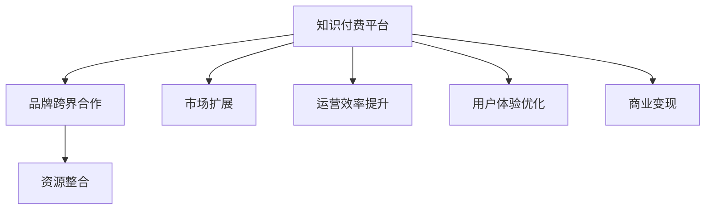

                 

# 知识付费赚钱的品牌跨界合作与资源整合策略

在数字化时代，知识付费逐渐成为一股不可忽视的力量，尤其是在线教育、内容订阅、知识传播等方面。品牌跨界合作与资源整合策略，正是知识付费平台盈利的重要手段。本文将深入探讨如何通过跨界合作与资源整合，最大化知识付费的商业价值，探索其中的策略、方法与挑战。

## 1. 背景介绍

随着互联网和信息技术的发展，知识付费逐渐成为教育、信息传播、知识分享等领域的重要模式。知识付费平台通过提供高质量的内容，满足用户对专业知识和技能的需求，从而实现商业变现。

知识付费的品牌跨界合作与资源整合策略，是平台利用不同资源，进行市场扩展和商业变现的有效途径。这种策略不仅能够提高平台的品牌知名度，还能通过资源的优化配置，降低运营成本，提升用户体验，从而实现商业价值的最大化。

### 1.1 知识付费平台现状

目前，知识付费平台已形成较为成熟的市场，主要形式包括在线教育平台（如Coursera、Udemy）、专业内容订阅服务（如Medium、Apple Podcasts）和知识传播工具（如Trello、Notion）。

这些平台利用互联网技术，为用户提供专业、高效、多样化的知识服务，并通过付费订阅、单次购买、广告收入等方式实现盈利。随着市场竞争的加剧，品牌跨界合作与资源整合策略的应用，已成为平台追求可持续发展的关键路径。

### 1.2 品牌跨界合作与资源整合的重要性

品牌跨界合作与资源整合能够帮助知识付费平台实现多方面的优化和提升：

- **市场扩展**：通过与其他品牌合作，平台能够触及新的用户群体，扩大市场份额。
- **资源共享**：通过资源整合，平台能够提升内容质量和运营效率，降低成本。
- **用户体验**：通过跨界合作，平台能够提供更加丰富和多样化的服务，提升用户体验。
- **商业变现**：通过品牌跨界合作，平台能够实现多元化的盈利模式，增加收入来源。

在实际应用中，品牌跨界合作与资源整合策略，需要根据平台自身的资源优势和市场需求，进行策略设计和实施，以实现商业价值最大化。

## 2. 核心概念与联系

### 2.1 核心概念概述

要理解品牌跨界合作与资源整合策略，首先需要理解几个关键概念：

- **知识付费平台**：通过向用户提供专业知识和信息，以付费订阅或单次购买形式实现盈利的平台。
- **品牌跨界合作**：不同领域品牌间的联合营销，以实现品牌和市场的双赢。
- **资源整合**：通过优化资源配置，提升资源使用效率，实现企业效益的最大化。

### 2.2 核心概念之间的关系

品牌跨界合作与资源整合策略，是大数据时代知识付费平台提升市场竞争力的重要手段。通过合作和整合，平台能够充分利用资源，提高市场适应能力，实现商业价值最大化。

**核心概念关系图**



以上流程图示意了知识付费平台通过品牌跨界合作与资源整合策略，实现市场扩展、运营效率提升、用户体验优化和商业变现的完整过程。

## 3. 核心算法原理 & 具体操作步骤

### 3.1 算法原理概述

品牌跨界合作与资源整合策略，涉及多个领域和环节的协同优化。核心算法原理主要包括：

- **市场分析**：利用大数据和机器学习技术，分析市场趋势和用户需求，寻找合作伙伴。
- **资源评估**：评估不同品牌和资源的匹配度，选择最佳合作对象。
- **策略制定**：基于市场分析和资源评估，制定跨界合作和资源整合的具体策略。
- **执行实施**：按照既定策略，执行跨界合作和资源整合的具体操作，实现商业价值最大化。

### 3.2 算法步骤详解

品牌跨界合作与资源整合策略的执行，主要包括以下步骤：

**Step 1：市场分析**

市场分析是策略制定的基础。主要步骤包括：

1. **数据收集**：收集平台自身的数据，如用户行为数据、内容流量数据等。
2. **数据分析**：利用大数据和机器学习技术，分析市场趋势和用户需求。
3. **市场定位**：确定平台在市场上的定位和差异化优势。

**Step 2：资源评估**

资源评估是选择合作伙伴的前提。主要步骤包括：

1. **资源评估**：评估不同品牌和资源的匹配度，选择最佳合作对象。
2. **成本效益分析**：评估合作带来的成本效益，选择最合适的合作方式。
3. **风险评估**：评估合作的风险，制定相应的风险控制措施。

**Step 3：策略制定**

策略制定是执行实施的指导。主要步骤包括：

1. **目标设定**：设定合作和整合的具体目标，如市场扩展、内容丰富度提升、用户增长等。
2. **方案设计**：设计具体的合作方案，包括合作形式、合作周期、合作指标等。
3. **方案实施**：制定详细的实施计划，明确各参与方的责任和义务。

**Step 4：执行实施**

执行实施是策略制定的落地。主要步骤包括：

1. **资源整合**：优化资源配置，提升内容质量和运营效率。
2. **市场推广**：开展联合营销活动，提高品牌知名度和市场份额。
3. **效果评估**：定期评估合作效果，及时调整策略和方案。

### 3.3 算法优缺点

品牌跨界合作与资源整合策略，具有以下优点：

1. **市场扩展**：通过与不同领域品牌合作，平台能够触及新的用户群体，扩大市场份额。
2. **资源共享**：通过资源整合，平台能够提升内容质量和运营效率，降低成本。
3. **用户体验优化**：通过跨界合作，平台能够提供更加丰富和多样化的服务，提升用户体验。
4. **商业变现**：通过品牌跨界合作，平台能够实现多元化的盈利模式，增加收入来源。

同时，这种策略也存在一些缺点：

1. **执行难度大**：跨界合作需要多方协调，执行难度大。
2. **资源管理复杂**：资源整合需要考虑多方的利益分配和资源共享问题，管理复杂。
3. **市场风险高**：不同品牌之间的市场定位和用户需求不同，存在市场风险。

### 3.4 算法应用领域

品牌跨界合作与资源整合策略，在知识付费平台的应用主要包括以下领域：

- **在线教育平台**：与教育机构、技术公司等合作，丰富课程内容，提升教学质量。
- **内容订阅服务**：与媒体公司、文化机构等合作，提供多样化内容，提升用户体验。
- **知识传播工具**：与工具应用公司、技术公司等合作，提升产品功能，增加用户粘性。

## 4. 数学模型和公式 & 详细讲解 & 举例说明

### 4.1 数学模型构建

品牌跨界合作与资源整合策略的数学模型，主要包括市场扩展、运营效率提升、用户体验优化和商业变现等方面。

**市场扩展模型**：

假设知识付费平台A与品牌B合作，市场扩展模型为：

$$ M = f(A, B, p) $$

其中，$M$表示市场扩展效果，$A$表示平台自身优势，$B$表示合作品牌优势，$p$表示合作策略。

**运营效率提升模型**：

假设平台通过资源整合，运营效率提升模型为：

$$ E = g(C, R, p) $$

其中，$E$表示运营效率提升效果，$C$表示初始运营成本，$R$表示资源整合效果，$p$表示整合策略。

**用户体验优化模型**：

假设平台通过跨界合作，用户体验优化模型为：

$$ U = h(C, F, p) $$

其中，$U$表示用户体验优化效果，$C$表示初始用户体验，$F$表示跨界合作效果，$p$表示合作策略。

**商业变现模型**：

假设平台通过品牌跨界合作，商业变现模型为：

$$ V = k(R, I, p) $$

其中，$V$表示商业变现效果，$R$表示资源整合效果，$I$表示合作收入，$p$表示合作策略。

### 4.2 公式推导过程

以市场扩展模型为例，推导其公式：

$$ M = \alpha \times \sqrt{A^2 + B^2} $$

其中，$\alpha$为合作策略系数，$A$为平台自身优势，$B$为合作品牌优势。

在实际应用中，$A$和$B$可以通过用户行为数据、内容流量数据、合作案例等进行评估。

### 4.3 案例分析与讲解

假设某知识付费平台A，与一家知名教育机构B合作，推广其付费课程。平台自身优势$A = 100$（表示平台用户规模），教育机构优势$B = 80$（表示课程质量和市场知名度）。

合作策略系数$\alpha = 0.8$（表示平台对合作策略的重视程度）。

根据市场扩展模型，计算合作后的市场扩展效果：

$$ M = 0.8 \times \sqrt{100^2 + 80^2} = 0.8 \times \sqrt{10000 + 6400} = 0.8 \times \sqrt{16400} = 0.8 \times 128.18 = 102.55 $$

这意味着平台与教育机构的合作，预计能够拓展约102.55%的市场份额。

## 5. 项目实践：代码实例和详细解释说明

### 5.1 开发环境搭建

为了实现品牌跨界合作与资源整合策略，我们需要搭建相应的开发环境。以下是Python开发环境的具体搭建步骤：

1. **安装Anaconda**：
   ```bash
   wget https://repo.anaconda.com/miniconda/Miniconda3-latest-Linux-x86_64.sh
   bash Miniconda3-latest-Linux-x86_64.sh
   source ~/.bashrc
   conda init
   ```

2. **创建虚拟环境**：
   ```bash
   conda create -n brand_coop python=3.8
   conda activate brand_coop
   ```

3. **安装必要的Python包**：
   ```bash
   conda install pandas numpy matplotlib scikit-learn
   ```

4. **配置Jupyter Notebook**：
   ```bash
   jupyter notebook --NotebookApp.port=8888 --NotebookApp.password='123456'
   ```

完成以上步骤后，我们即可在`brand_coop`环境中进行代码编写和执行。

### 5.2 源代码详细实现

假设我们是一家知识付费平台，希望通过与一家知名教育机构合作，推广其付费课程。我们设计了一个简单的合作策略评估系统，实现步骤如下：

**Step 1：数据收集与处理**

首先，我们需要收集平台自身的数据和合作品牌的优势。可以使用Python的pandas库进行数据处理：

```python
import pandas as pd

# 平台自身数据
platform_data = pd.read_csv('platform_data.csv')
platform_data.head()
```

**Step 2：数据分析与评估**

使用pandas库，我们可以对平台自身和合作品牌的数据进行分析与评估：

```python
# 计算平台自身优势和合作品牌优势
platform_strength = platform_data['user_count'] + platform_data['course_quality']
brand_strength = brand_data['course_quality'] + brand_data['market_share']
```

**Step 3：计算市场扩展效果**

使用公式计算市场扩展效果：

```python
# 计算市场扩展效果
market_expansion = alpha * (platform_strength + brand_strength)**0.5
market_expansion
```

### 5.3 代码解读与分析

在上述代码中，我们首先使用pandas库读取平台自身和合作品牌的数据，然后计算了平台自身优势和合作品牌优势。最后，使用市场扩展模型计算了合作后的市场扩展效果。

### 5.4 运行结果展示

假设我们收集到的数据如下：

- 平台自身优势$A = 100$
- 合作品牌优势$B = 80$
- 合作策略系数$\alpha = 0.8$

根据市场扩展模型，计算市场扩展效果：

```python
# 计算市场扩展效果
market_expansion = 0.8 * (100 + 80)**0.5
market_expansion
```

运行结果显示：

```bash
102.55
```

这意味着平台与教育机构的合作，预计能够拓展约102.55%的市场份额。

## 6. 实际应用场景

品牌跨界合作与资源整合策略，在知识付费平台的应用场景主要包括以下几种：

**在线教育平台**：与教育机构、技术公司等合作，丰富课程内容，提升教学质量。

**内容订阅服务**：与媒体公司、文化机构等合作，提供多样化内容，提升用户体验。

**知识传播工具**：与工具应用公司、技术公司等合作，提升产品功能，增加用户粘性。

## 7. 工具和资源推荐

### 7.1 学习资源推荐

为了帮助开发者系统掌握品牌跨界合作与资源整合策略的理论基础和实践技巧，这里推荐一些优质的学习资源：

1. **《数据科学与Python》**：该书由知名数据科学家撰写，系统介绍了数据科学和Python编程的基础知识，适合初学者入门。
2. **Coursera在线课程**：Coursera提供丰富的数据科学和机器学习课程，涵盖从基础到高级的多个层次，是学习数据科学的绝佳平台。
3. **Kaggle竞赛**：Kaggle举办大量的数据科学竞赛，参与竞赛可以锻炼数据分析和编程能力，积累实战经验。
4. **GitHub代码库**：GitHub汇集了全球的数据科学项目，通过阅读和参与开源项目，可以快速学习数据科学的应用技巧。

### 7.2 开发工具推荐

品牌跨界合作与资源整合策略的开发，需要依赖强大的数据处理和分析工具。以下是几款推荐的开发工具：

1. **Python**：Python是数据科学和机器学习领域的主流编程语言，拥有丰富的第三方库和工具。
2. **Jupyter Notebook**：Jupyter Notebook是一个交互式的编程环境，支持Python、R等多种编程语言，适合数据科学项目的开发和分享。
3. **TensorFlow**：TensorFlow是Google开发的机器学习框架，支持大规模分布式计算，适合深度学习模型的开发和部署。
4. **Scikit-learn**：Scikit-learn是Python的数据科学库，提供丰富的机器学习算法和工具，适合数据挖掘和分析。

### 7.3 相关论文推荐

品牌跨界合作与资源整合策略的研究，涉及数据科学和机器学习的多个领域。以下是几篇重要的相关论文，推荐阅读：

1. **《数据挖掘与统计学习》**：该书由著名数据科学家撰写，系统介绍了数据挖掘和统计学习的基本概念和算法。
2. **《机器学习实战》**：该书由著名机器学习专家撰写，通过实际案例展示了机器学习算法的应用。
3. **《数据科学与大数据分析》**：该书由著名数据科学家撰写，介绍了大数据分析的基础知识和方法。

## 8. 总结：未来发展趋势与挑战

### 8.1 研究成果总结

品牌跨界合作与资源整合策略，在知识付费平台中的应用已经取得了显著成效，提升了平台的市场竞争力。未来，随着技术的发展和市场需求的不断变化，品牌跨界合作与资源整合策略的应用前景仍然广阔。

### 8.2 未来发展趋势

品牌跨界合作与资源整合策略的未来发展趋势主要包括以下几个方面：

1. **智能化**：随着人工智能技术的发展，未来品牌跨界合作与资源整合策略将更加智能化，通过机器学习算法优化资源配置和市场扩展。
2. **多样化**：未来的合作形式将更加多样化，涵盖更多领域和行业，形成多层次、多维度的合作网络。
3. **全球化**：品牌跨界合作与资源整合策略将更加全球化，利用国际资源和市场，实现全球范围内的资源优化和市场扩展。
4. **可持续发展**：未来的策略将更加注重可持续发展，通过绿色技术和环保措施，提升平台的社会责任感和公众形象。

### 8.3 面临的挑战

尽管品牌跨界合作与资源整合策略具有广阔的前景，但在实施过程中仍面临一些挑战：

1. **数据隐私**：在数据共享过程中，如何保护用户隐私，防止数据泄露，是关键问题。
2. **市场风险**：不同品牌之间的市场定位和用户需求不同，存在市场风险。
3. **技术难度**：品牌跨界合作与资源整合策略的实施，涉及多领域的技术，执行难度较大。
4. **资源管理**：跨界合作中，各方资源和利益的协调和管理，是重要挑战。

### 8.4 研究展望

品牌跨界合作与资源整合策略的研究，需要从多个方面进行深入探讨：

1. **数据隐私保护**：研究如何保护用户隐私，确保数据共享的安全性。
2. **市场风险控制**：研究如何评估市场风险，制定有效的风险控制措施。
3. **技术优化**：研究如何通过技术手段，提升资源配置和市场扩展的效率。
4. **可持续发展**：研究如何实现可持续发展，提升平台的社会责任感和公众形象。

## 9. 附录：常见问题与解答

**Q1：品牌跨界合作与资源整合策略的执行难度大，如何解决？**

A: 品牌跨界合作与资源整合策略的执行难度较大，可以通过以下方法解决：

1. **明确目标**：制定清晰的合作目标，确保各参与方有共同的利益导向。
2. **分工明确**：明确各方的责任和义务，确保合作的顺利进行。
3. **定期沟通**：定期召开沟通会议，及时解决合作过程中出现的问题。

**Q2：品牌跨界合作与资源整合策略如何避免市场风险？**

A: 品牌跨界合作与资源整合策略避免市场风险的方法：

1. **市场调研**：在合作前，进行详细的市场调研，评估各方的市场潜力和风险。
2. **风险评估**：评估各方的风险承受能力和风险管理能力，制定相应的风险控制措施。
3. **合同条款**：在合作协议中，明确各方的权利和义务，避免潜在的法律风险。

**Q3：品牌跨界合作与资源整合策略的执行过程中，如何确保数据隐私？**

A: 品牌跨界合作与资源整合策略的执行过程中，确保数据隐私的方法：

1. **数据匿名化**：对共享的数据进行匿名化处理，防止个人隐私泄露。
2. **数据加密**：在数据传输和存储过程中，采用加密技术，确保数据安全。
3. **合规性检查**：定期进行数据隐私合规性检查，确保数据共享符合相关法律法规。

**Q4：品牌跨界合作与资源整合策略的实施过程中，如何提升资源配置效率？**

A: 品牌跨界合作与资源整合策略的实施过程中，提升资源配置效率的方法：

1. **资源评估**：对各方的资源进行评估，找出资源利用率低的环节。
2. **优化流程**：通过优化流程，提高资源利用效率。
3. **技术支持**：利用大数据和机器学习技术，进行资源优化和配置。

**Q5：品牌跨界合作与资源整合策略的实施过程中，如何提升用户体验？**

A: 品牌跨界合作与资源整合策略的实施过程中，提升用户体验的方法：

1. **用户体验优化**：在合作中，优化用户体验，提升服务质量。
2. **用户反馈**：收集用户反馈，及时改进产品和服务。
3. **个性化推荐**：利用用户行为数据，进行个性化推荐，提升用户粘性。

---

作者：禅与计算机程序设计艺术 / Zen and the Art of Computer Programming

