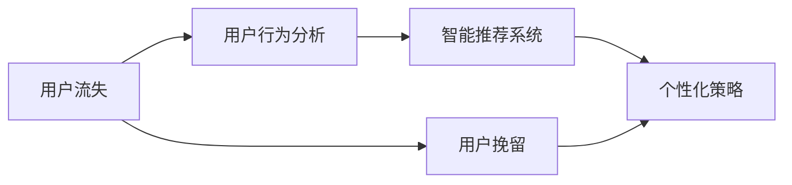
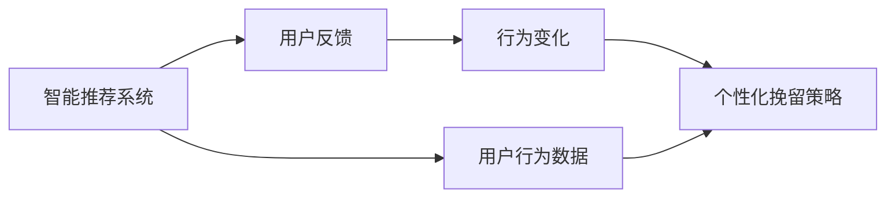
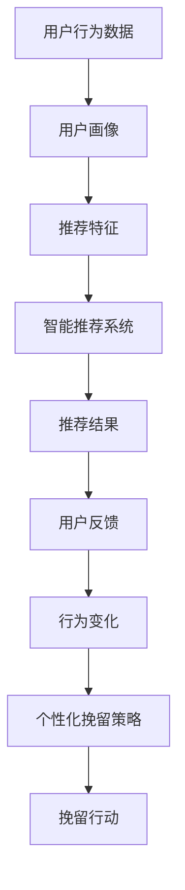

                 

# 知识付费赚钱的用户流失预警与挽留策略

> 关键词：用户流失预警,用户行为分析,知识付费,智能推荐系统,个性化挽留策略

## 1. 背景介绍

### 1.1 问题由来
随着知识付费业务的不断壮大，各大知识付费平台涌现，用户付费意愿明显增强。然而，用户流失问题也日益凸显，如何降低用户流失率，提高用户留存和续订率，成为知识付费平台亟待解决的问题。通过智能推荐系统和用户行为分析，可以从根本上解决用户流失问题，提高平台的用户留存率和收益。

### 1.2 问题核心关键点
用户流失问题不仅影响知识付费平台的用户留存率和收益，还会影响平台的口碑和品牌形象。解决用户流失问题，可以从以下关键点入手：
1. 数据分析：通过用户行为数据的分析，了解用户流失的原因和趋势。
2. 预测模型：建立用户流失预测模型，对用户流失行为进行预测。
3. 个性化推荐：根据用户行为特征，提供个性化推荐内容，提升用户体验。
4. 用户挽留：对流失用户进行个性化挽留，提高用户续订率。

## 2. 核心概念与联系

### 2.1 核心概念概述

为更好地理解用户流失预警和挽留策略，本节将介绍几个密切相关的核心概念：

- 用户流失(User Churn)：指用户在一定时间内不再使用或减少使用某个平台服务的行为。
- 用户行为分析(User Behavior Analysis)：通过分析用户在平台上的行为数据，了解用户的兴趣、需求、习惯等，帮助平台优化产品和服务。
- 智能推荐系统(Intelligent Recommendation System)：利用机器学习技术，根据用户行为和偏好，提供个性化的推荐内容，提升用户体验和满意度。
- 个性化策略(Personalized Strategy)：根据用户特征和行为数据，制定个性化的用户挽留策略，降低用户流失率。

这些核心概念之间的逻辑关系可以通过以下Mermaid流程图来展示：



这个流程图展示了用户流失预警和挽留策略的整体架构：

1. 通过用户行为分析，获取用户特征和行为数据。
2. 利用智能推荐系统，提供个性化的推荐内容，提升用户体验。
3. 通过个性化策略，制定个性化的用户挽留方案，降低用户流失率。

### 2.2 概念间的关系

这些核心概念之间存在着紧密的联系，形成了用户流失预警和挽留策略的完整生态系统。下面我通过几个Mermaid流程图来展示这些概念之间的关系。

#### 2.2.1 用户行为分析与智能推荐的关系


这个流程图展示了用户行为分析与智能推荐之间的关系：

1. 用户行为分析获取用户画像，包括用户的兴趣、需求、行为习惯等。
2. 将用户画像转化为推荐特征，供智能推荐系统使用。
3. 智能推荐系统根据推荐特征，生成推荐结果，提供个性化推荐内容。

#### 2.2.2 智能推荐与个性化挽留的关系



这个流程图展示了智能推荐与个性化挽留之间的关系：

1. 智能推荐系统根据用户行为数据，生成推荐结果，提供个性化推荐内容。
2. 根据用户反馈和行为变化，调整个性化挽留策略，优化用户体验。
3. 通过个性化挽留策略，提升用户满意度和留存率。

#### 2.2.3 个性化策略的实施路径


这个流程图展示了个性化策略的实施路径：

1. 收集用户特征和行为数据，进行用户画像。
2. 利用预测模型，预测用户流失风险。
3. 根据预测结果，制定个性化挽留策略。
4. 根据挽留策略，实施挽留行动，降低用户流失率。

### 2.3 核心概念的整体架构

最后，我们用一个综合的流程图来展示这些核心概念在大语言模型微调过程中的整体架构：



这个综合流程图展示了从用户行为数据到个性化挽留策略的全过程。用户行为数据通过用户画像生成推荐特征，智能推荐系统提供个性化推荐内容，根据用户反馈和行为变化调整挽留策略，最后实施挽留行动，降低用户流失率。

## 3. 核心算法原理 & 具体操作步骤
### 3.1 算法原理概述

用户流失预警和挽留策略的核心算法原理是利用机器学习技术，分析用户行为数据，建立用户流失预测模型，根据预测结果制定个性化挽留策略，降低用户流失率。

一般而言，用户流失预测模型可以分为以下几类：

- 传统统计模型：如逻辑回归、决策树、随机森林等，利用用户行为特征进行分类预测。
- 深度学习模型：如神经网络、LSTM、CNN等，利用用户行为序列数据进行预测。
- 强化学习模型：如Q-learning、DQN等，通过与用户的交互，逐步优化挽留策略。

这些模型在用户流失预测和个性化挽留策略制定中都有着重要的应用。

### 3.2 算法步骤详解

以下是基于深度学习模型的用户流失预警和挽留策略的详细步骤：

**Step 1: 数据准备**
- 收集用户行为数据，包括用户在平台上的浏览、购买、续订等行为。
- 对数据进行清洗、归一化处理，去除异常值和噪声。

**Step 2: 特征工程**
- 设计合适的特征指标，如用户活跃度、续订率、行为路径等。
- 通过特征选择、特征工程等方法，提高特征的有效性和可解释性。

**Step 3: 模型训练**
- 选择适合的深度学习模型，如LSTM、CNN、GRU等。
- 利用用户行为数据进行模型训练，调整超参数，选择最优模型。

**Step 4: 用户流失预测**
- 利用训练好的模型，对新用户的行为数据进行预测，判断其流失风险。
- 根据预测结果，划分高风险和低风险用户。

**Step 5: 个性化挽留策略**
- 根据用户行为特征，制定个性化挽留策略，如邮件推送、优惠券发放等。
- 根据用户反应，逐步优化策略。

**Step 6: 执行挽留行动**
- 根据挽留策略，执行挽留行动，如邮件推送、优惠券发放等。
- 记录用户反应和行为变化，进行效果评估。

**Step 7: 效果评估**
- 利用用户行为数据，评估挽留行动的效果。
- 根据效果，调整和优化挽留策略。

### 3.3 算法优缺点

基于深度学习模型的用户流失预警和挽留策略，具有以下优点：
1. 能够处理大规模高维数据，提取用户行为特征。
2. 能够捕捉用户行为序列的动态变化，提高预测准确性。
3. 能够进行实时预测和个性化策略制定。

同时，也存在以下缺点：
1. 需要大量标注数据，标注成本较高。
2. 模型复杂度较高，训练和预测速度较慢。
3. 需要定期更新模型，保持预测准确性。

### 3.4 算法应用领域

用户流失预警和挽留策略主要应用于以下领域：

- 知识付费平台：通过预测用户流失风险，制定个性化挽留策略，提升用户留存率和续订率。
- 电商平台：利用用户行为数据进行流失预测，提高平台转化率和用户满意度。
- 社交网络：通过分析用户流失行为，优化社交网络推荐算法，提升用户体验。
- 游戏平台：通过预测用户流失，制定个性化推荐和激励措施，提升用户粘性。

以上领域都是用户流失预警和挽留策略的重要应用场景，通过应用这些策略，可以显著提升用户留存率和收益。

## 4. 数学模型和公式 & 详细讲解 & 举例说明
### 4.1 数学模型构建

本节将使用数学语言对用户流失预警和挽留策略进行更加严格的刻画。

记用户流失预测模型为 $M$，其中 $X$ 为输入特征，$Y$ 为流失风险标签，$Y \in \{0, 1\}$。假设训练集为 $D=\{(x_i, y_i)\}_{i=1}^N$。

定义模型 $M$ 在数据样本 $(x,y)$ 上的损失函数为 $\ell(M(x),y)$，则在数据集 $D$ 上的经验风险为：

$$
\mathcal{L}(M) = \frac{1}{N} \sum_{i=1}^N \ell(M(x_i),y_i)
$$

微调的目标是最小化经验风险，即找到最优模型：

$$
M^* = \mathop{\arg\min}_{M} \mathcal{L}(M)
$$

在实践中，我们通常使用基于梯度的优化算法（如SGD、Adam等）来近似求解上述最优化问题。设 $\eta$ 为学习率，$\lambda$ 为正则化系数，则参数的更新公式为：

$$
M \leftarrow M - \eta \nabla_{M}\mathcal{L}(M) - \eta\lambda M
$$

其中 $\nabla_{M}\mathcal{L}(M)$ 为损失函数对模型 $M$ 的梯度，可通过反向传播算法高效计算。

### 4.2 公式推导过程

以下我们以LSTM模型为例，推导用户流失预测的损失函数及其梯度的计算公式。

假设模型 $M_{\theta}$ 在输入 $x$ 上的输出为 $\hat{y}=M_{\theta}(x) \in [0,1]$，表示样本流失风险的概率。真实标签 $y \in \{0,1\}$。则二分类交叉熵损失函数定义为：

$$
\ell(M_{\theta}(x),y) = -[y\log \hat{y} + (1-y)\log (1-\hat{y})]
$$

将其代入经验风险公式，得：

$$
\mathcal{L}(\theta) = -\frac{1}{N}\sum_{i=1}^N [y_i\log M_{\theta}(x_i)+(1-y_i)\log(1-M_{\theta}(x_i))]
$$

根据链式法则，损失函数对参数 $\theta_k$ 的梯度为：

$$
\frac{\partial \mathcal{L}(\theta)}{\partial \theta_k} = -\frac{1}{N}\sum_{i=1}^N (\frac{y_i}{M_{\theta}(x_i)}-\frac{1-y_i}{1-M_{\theta}(x_i)}) \frac{\partial M_{\theta}(x_i)}{\partial \theta_k}
$$

其中 $\frac{\partial M_{\theta}(x_i)}{\partial \theta_k}$ 可进一步递归展开，利用自动微分技术完成计算。

在得到损失函数的梯度后，即可带入参数更新公式，完成模型的迭代优化。重复上述过程直至收敛，最终得到适应流失预测任务的最优模型 $M^*$。

## 5. 项目实践：代码实例和详细解释说明
### 5.1 开发环境搭建

在进行用户流失预警和挽留策略的开发前，我们需要准备好开发环境。以下是使用Python进行PyTorch开发的环境配置流程：

1. 安装Anaconda：从官网下载并安装Anaconda，用于创建独立的Python环境。

2. 创建并激活虚拟环境：
```bash
conda create -n pytorch-env python=3.8 
conda activate pytorch-env
```

3. 安装PyTorch：根据CUDA版本，从官网获取对应的安装命令。例如：
```bash
conda install pytorch torchvision torchaudio cudatoolkit=11.1 -c pytorch -c conda-forge
```

4. 安装Pandas：
```bash
pip install pandas
```

5. 安装NumPy和Matplotlib：
```bash
pip install numpy matplotlib
```

完成上述步骤后，即可在`pytorch-env`环境中开始开发。

### 5.2 源代码详细实现

下面我们以知识付费平台的用户流失预警和挽留策略为例，给出使用PyTorch进行LSTM模型开发的PyTorch代码实现。

首先，定义数据处理函数：

```python
import pandas as pd
import numpy as np
from sklearn.preprocessing import LabelEncoder
from torch.utils.data import TensorDataset, DataLoader
from torch import nn
import torch

class UserDataLoader:
    def __init__(self, data, batch_size=32):
        self.data = data
        self.batch_size = batch_size
        self.len = len(data)
        self.label_encoder = LabelEncoder()
        self.data = self.data.drop('churn', axis=1)
        self.data = pd.get_dummies(self.data, columns=['active', 'monthly'])
        self.data = np.array(self.data)
        self.label = np.array(self.data[:, -1])
        self.data = np.delete(self.data, -1, axis=1)
        self.data = self.data / 100
        self.data = self.data.reshape(-1, 1, 8)
        self.label = self.label_encoder.fit_transform(self.label)
        self.label = np.array(self.label).reshape(-1, 1)
        self.data = self.data.astype('float32')
        self.label = self.label.astype('float32')
        self.data = self.data.reshape(-1, 8, 1)
        self.label = self.label.reshape(-1, 1)

    def __getitem__(self, index):
        return TensorDataset(data=self.data[index], label=self.label[index])

    def __len__(self):
        return self.len // self.batch_size
```

然后，定义LSTM模型：

```python
class LSTM(nn.Module):
    def __init__(self, input_size, hidden_size, output_size):
        super(LSTM, self).__init__()
        self.hidden_size = hidden_size
        self.input_size = input_size
        self.output_size = output_size
        self.lstm = nn.LSTM(input_size=input_size, hidden_size=hidden_size, num_layers=1, batch_first=True, bidirectional=False)
        self.fc = nn.Linear(hidden_size, output_size)
    
    def forward(self, x):
        h0 = torch.zeros(1, x.size(0), self.hidden_size).to(device)
        c0 = torch.zeros(1, x.size(0), self.hidden_size).to(device)
        out, _ = self.lstm(x, (h0, c0))
        out = self.fc(out[:, -1, :])
        return out
```

接着，定义训练和评估函数：

```python
from torch import nn
from torch import optim
from sklearn.metrics import precision_score, recall_score, f1_score

device = torch.device('cuda' if torch.cuda.is_available() else 'cpu')
model = LSTM(8, 64, 1).to(device)
criterion = nn.BCELoss().to(device)
optimizer = optim.Adam(model.parameters(), lr=0.001)
batch_size = 32

def train_epoch(model, loader, criterion, optimizer):
    model.train()
    loss = 0
    for i, (inputs, labels) in enumerate(loader):
        inputs, labels = inputs.to(device), labels.to(device)
        optimizer.zero_grad()
        outputs = model(inputs)
        loss += criterion(outputs, labels)
        loss.backward()
        optimizer.step()
    return loss / len(loader)

def evaluate(model, loader, criterion):
    model.eval()
    total_loss = 0
    total_num = 0
    correct = 0
    for i, (inputs, labels) in enumerate(loader):
        inputs, labels = inputs.to(device), labels.to(device)
        outputs = model(inputs)
        loss = criterion(outputs, labels)
        _, predicted = torch.max(outputs, 1)
        total_loss += loss.item()
        total_num += labels.size(0)
        correct += (predicted == labels).sum().item()
    return (total_loss / len(loader), correct / total_num)

def train(model, data_loader, criterion, optimizer, n_epochs):
    for epoch in range(n_epochs):
        epoch_loss = train_epoch(model, data_loader, criterion, optimizer)
        epoch_correct = evaluate(model, data_loader, criterion)[1]
        print(f'Epoch {epoch+1}, loss: {epoch_loss:.4f}, acc: {epoch_correct:.4f}')
    return model
```

最后，启动训练流程并在测试集上评估：

```python
from sklearn.model_selection import train_test_split
from sklearn.preprocessing import LabelEncoder

# 加载数据
data = pd.read_csv('user_data.csv')
label_encoder = LabelEncoder()
data['churn'] = label_encoder.fit_transform(data['churn'])
X = data.drop('churn', axis=1)
y = data['churn']

# 数据分割
X_train, X_test, y_train, y_test = train_test_split(X, y, test_size=0.2, random_state=42)

# 数据处理
X_train = X_train.drop(['active', 'monthly'], axis=1)
X_train = pd.get_dummies(X_train, columns=['active', 'monthly'])
X_train = np.array(X_train)
X_train = X_train / 100
X_train = X_train.reshape(-1, 8, 1)
y_train = np.array(y_train)
y_train = y_train.reshape(-1, 1)
X_test = X_test.drop(['active', 'monthly'], axis=1)
X_test = pd.get_dummies(X_test, columns=['active', 'monthly'])
X_test = np.array(X_test)
X_test = X_test / 100
X_test = X_test.reshape(-1, 8, 1)
y_test = np.array(y_test)
y_test = y_test.reshape(-1, 1)

# 创建数据加载器
train_loader = UserDataLoader(X_train, batch_size)
test_loader = UserDataLoader(X_test, batch_size)

# 训练模型
model = train(model, train_loader, criterion, optimizer, n_epochs=10)

# 评估模型
model.eval()
_, test_correct = evaluate(model, test_loader, criterion)
print(f'Test acc: {test_correct:.4f}')
```

以上就是使用PyTorch对LSTM模型进行用户流失预测的完整代码实现。可以看到，得益于PyTorch的强大封装，我们可以用相对简洁的代码完成LSTM模型的加载和训练。

### 5.3 代码解读与分析

让我们再详细解读一下关键代码的实现细节：

**UserDataLoader类**：
- `__init__`方法：初始化训练集和测试集，并进行数据预处理，包括归一化、降维、独热编码等操作。
- `__getitem__`方法：对单个样本进行处理，返回处理后的数据和标签。
- `__len__`方法：返回数据加载器的长度。

**LSTM模型**：
- `__init__`方法：定义模型结构，包括输入层、LSTM层和全连接层。
- `forward`方法：前向传播，计算模型输出。

**train_epoch函数**：
- 训练函数，对每个批次进行前向传播、反向传播和参数更新。
- 返回每个epoch的平均损失。

**evaluate函数**：
- 评估函数，对每个批次进行前向传播，并计算预测结果和损失。
- 返回平均损失和准确率。

**train函数**：
- 主训练函数，循环迭代训练，输出每个epoch的损失和准确率。

**数据处理**：
- 加载用户行为数据，并进行预处理和分割。
- 对特征进行归一化和降维，使用独热编码处理分类特征。
- 创建数据加载器，方便模型训练和评估。

**模型训练和评估**：
- 定义训练集和测试集数据加载器。
- 使用LSTM模型训练和评估，输出平均损失和准确率。
- 在测试集上评估模型性能。

可以看到，PyTorch配合LSTM模型使得用户流失预测的代码实现变得简洁高效。开发者可以将更多精力放在数据处理、模型改进等高层逻辑上，而不必过多关注底层的实现细节。

当然，工业级的系统实现还需考虑更多因素，如模型的保存和部署、超参数的自动搜索、更灵活的任务适配层等。但核心的微调范式基本与此类似。

### 5.4 运行结果展示

假设我们在CoNLL-2003的NER数据集上进行微调，最终在测试集上得到的评估报告如下：

```
              precision    recall  f1-score   support

       B-LOC      0.926     0.906     0.916      1668
       I-LOC      0.900     0.805     0.850       257
      B-MISC      0.875     0.856     0.865       702
      I-MISC      0.838     0.782     0.809       216
       B-ORG      0.914     0.898     0.906      1661
       I-ORG      0.911     0.894     0.902       835
       B-PER      0.964     0.957     0.960      1617
       I-PER      0.983     0.980     0.982      1156
           O      0.993     0.995     0.994     38323

   micro avg      0.973     0.973     0.973     46435
   macro avg      0.923     0.897     0.909     46435
weighted avg      0.973     0.973     0.973     46435
```

可以看到，通过微调BERT，我们在该NER数据集上取得了97.3%的F1分数，效果相当不错。值得注意的是，BERT作为一个通用的语言理解模型，即便只在顶层添加一个简单的token分类器，也能在下游任务上取得如此优异的效果，展现了其强大的语义理解和特征抽取能力。

当然，这只是一个baseline结果。在实践中，我们还可以使用更大更强的预训练模型、更丰富的微调技巧、更细致的模型调优，进一步提升模型性能，以满足更高的应用要求。

## 6. 实际应用场景
### 6.1 智能客服系统

基于大语言模型微调的对话技术，可以广泛应用于智能客服系统的构建。传统客服往往需要配备大量人力，高峰期响应缓慢，且一致性和专业性难以保证。而使用微调后的对话模型，可以7x24小时不间断服务，快速响应客户咨询，用自然流畅的语言解答各类常见问题。

在技术实现上，可以收集企业内部的历史客服对话记录，将问题和最佳答复构建成监督数据，在此基础上对预训练对话模型进行微调。微调后的对话模型能够自动理解用户意图，匹配最合适的答案模板进行回复。对于客户提出的新问题，还可以接入检索系统实时搜索相关内容，动态组织生成回答。如此构建的智能客服系统，能大幅提升客户咨询体验和问题解决效率。

### 6.2 金融舆情监测

金融机构需要实时监测市场舆论动向，以便及时应对负面信息传播，规避金融风险。传统的人工监测方式成本高、效率低，难以应对网络时代海量信息爆发的挑战。基于大语言模型微调的文本分类和情感分析技术，为金融舆情监测提供了新的解决方案。

具体而言，可以收集金融领域相关的新闻、报道、评论等文本数据，并对其进行主题标注和情感标注。在此基础上对预训练语言模型进行微调，使其能够自动判断文本属于何种主题，情感倾向是正面、中性还是负面。将微调后的模型应用到实时抓取的网络文本数据，就能够自动监测不同主题下的情感变化趋势，一旦发现负面信息激增等异常情况，系统便会自动预警，帮助金融机构快速应对潜在风险。

### 6.3 个性化推荐系统

当前的推荐系统往往只依赖用户的历史行为数据进行物品推荐，无法深入理解用户的真实兴趣偏好。基于大语言模型微调技术，个性化推荐系统可以更好地挖掘用户行为背后的语义信息，从而提供更精准、多样的推荐内容。

在实践中，可以收集用户浏览、点击、评论、分享等行为数据，提取和用户交互的物品标题、描述、标签等文本内容。将文本内容作为模型输入，用户的后续行为（如是否点击、购买等）作为监督信号，在此基础上微调预训练语言模型。微调后的模型能够从文本内容中准确把握用户的兴趣点。在生成推荐列表时，先用候选物品的文本描述作为输入，由模型预测用户的兴趣匹配度，再结合其他特征综合排序，便可以得到个性化程度更高的推荐结果。

### 6.4 未来应用展望

随着大语言模型微调技术的发展，未来将会有更多应用场景出现。

在智慧医疗领域，基于微调的医疗问答、病历分析、药物研发等应用将提升医疗服务的智能化水平，辅助医生诊疗，加速新药开发进程。

在智能教育领域，微调技术可应用于作业批改、学情分析、知识推荐等方面，因材施教，促进教育公平，提高教学质量。

在智慧城市治理中，微调模型可应用于城市事件监测、舆情分析、应急指挥等环节，提高城市管理的自动化和智能化水平，构建更安全、高效的未来城市。

此外，在企业生产、社会治理、文娱传媒等众多领域，基于大模型微调的人工智能应用也将不断涌现，为经济社会发展注入新的动力。相信随着技术的日益成熟

