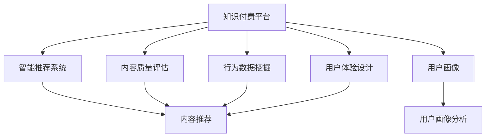
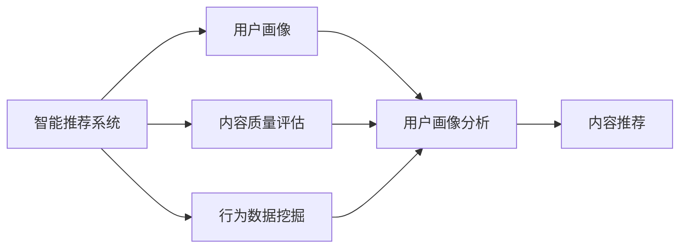
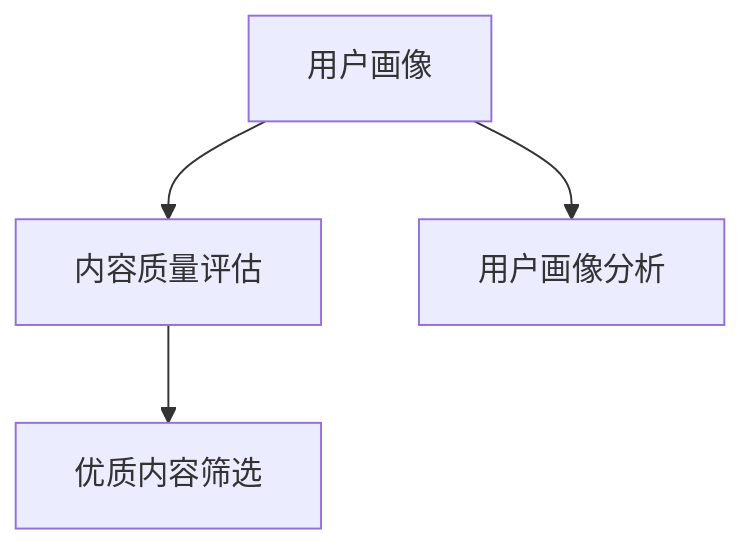
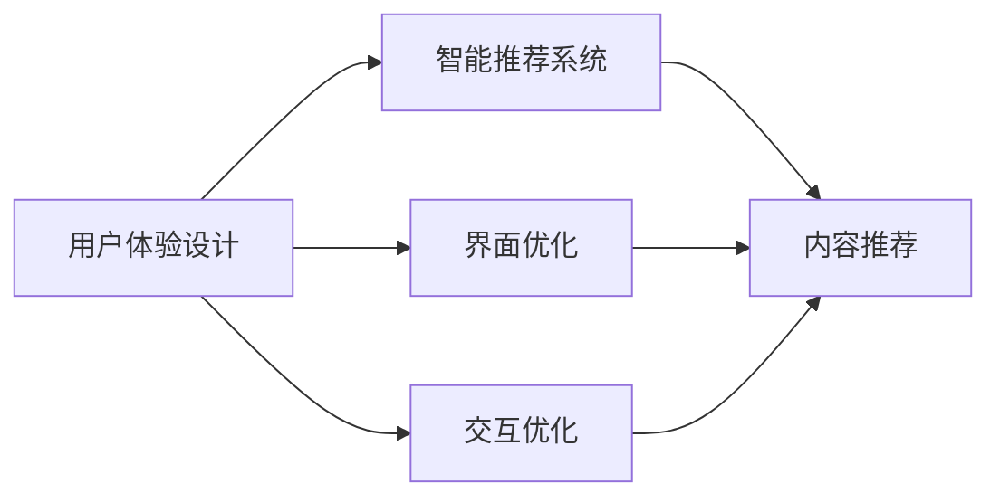
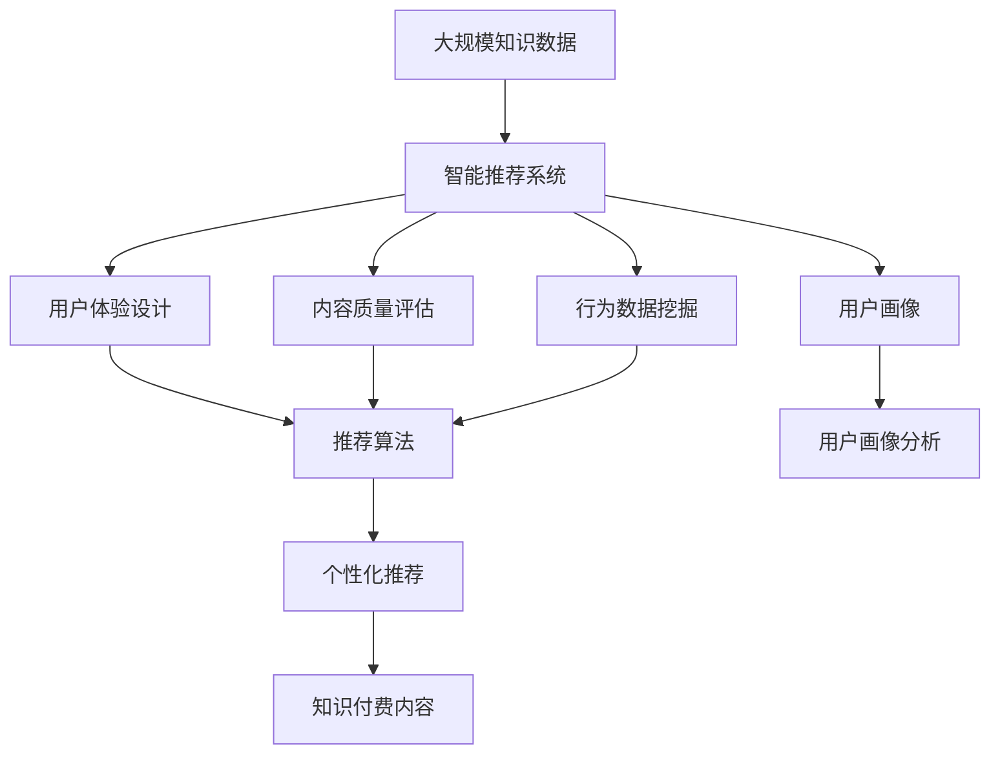

                 

# 知识付费领域的蓝海市场探索

## 1. 背景介绍

### 1.1 问题由来

随着互联网技术的普及和知识经济的兴起，在线教育逐渐成为人们获取知识的重要渠道。传统教育模式存在资源不均衡、学习效率低下等问题，而在线教育则通过互联网打破了时空限制，使知识获取变得更加便捷。然而，免费开放的网络资源虽然极大促进了知识的普及，但同时也面临着优质内容稀缺、学习效果参差不齐等问题。

知识付费则成为弥补这一不足的解决方案。它通过付费机制筛选优质内容，激励创作者提供更多优质内容，从而逐步形成了一个良性循环。2016年知识付费市场正式兴起，内容形式也从单一的文字逐渐拓展到音频、视频、图文等多种形式，满足了不同用户群体的需求。

### 1.2 问题核心关键点

知识付费的核心在于高质量内容的筛选和分发。然而，市场上的内容鱼龙混杂，用户如何从中选出适合自己的内容？如何避免劣质内容误导？这些问题成为了知识付费平台亟待解决的难题。

解决这些问题的关键在于：
1. **内容质量控制**：通过智能算法对内容进行筛选和评估，识别优质内容并推荐给用户。
2. **用户行为分析**：分析用户行为数据，理解用户需求和兴趣，个性化推荐内容。
3. **用户体验优化**：提升平台的用户体验，增加用户粘性，提高平台流量。

### 1.3 问题研究意义

知识付费市场的成功与否，关系到优质内容能否被广泛传播，用户需求能否得到满足，进而影响到整个知识经济的健康发展。研究知识付费平台的智能算法和用户行为分析技术，不仅能够提升平台的用户体验，增加用户粘性，还可以推动内容创作者提供更多优质内容，促进知识经济的健康发展。

## 2. 核心概念与联系

### 2.1 核心概念概述

为更好地理解知识付费平台的智能算法和用户行为分析技术，本节将介绍几个密切相关的核心概念：

- **知识付费平台**：以内容付费为核心模式的在线教育平台，用户通过付费获取高质量的教育内容，平台则通过优质内容筛选和分发，实现盈利。
- **智能推荐系统**：通过机器学习和数据挖掘技术，对用户行为和内容质量进行分析，推荐适合用户需求的高质量内容。
- **用户画像**：通过对用户行为数据的分析和建模，建立用户兴趣和偏好的虚拟形象，用于个性化推荐和用户画像分析。
- **内容质量评估**：通过机器学习模型对内容质量进行评估，识别优质内容并优先推荐。
- **行为数据挖掘**：对用户点击、浏览、订阅、评分等行为数据进行挖掘和分析，理解用户需求和兴趣。
- **用户体验设计**：通过UI/UX设计提升平台的用户体验，增加用户粘性，提高平台流量。

这些核心概念之间的逻辑关系可以通过以下Mermaid流程图来展示：



这个流程图展示了大语言模型微调过程中各个核心概念的关系和作用：

1. 知识付费平台通过智能推荐系统实现内容分发，智能推荐系统通过用户画像和内容质量评估进行内容推荐。
2. 用户画像和行为数据挖掘是智能推荐系统的基础，用于分析和理解用户需求。
3. 用户体验设计提升平台的用户体验，增加用户粘性。

这些概念共同构成了知识付费平台的智能算法和用户行为分析技术的核心，使其能够高效地分发优质内容，满足用户需求。

### 2.2 概念间的关系

这些核心概念之间存在着紧密的联系，形成了知识付费平台的完整生态系统。下面我通过几个Mermaid流程图来展示这些概念之间的关系。

#### 2.2.1 智能推荐系统的构建



这个流程图展示了智能推荐系统的构建过程。用户画像和行为数据挖掘是智能推荐系统的基础，用于分析和理解用户需求。内容质量评估则用于筛选优质内容，用于推荐。

#### 2.2.2 用户画像与内容质量评估的关系



这个流程图展示了用户画像与内容质量评估之间的关系。用户画像用于分析和理解用户需求，而内容质量评估则用于筛选优质内容。两者结合，为智能推荐系统提供更加准确和高效的内容推荐。

#### 2.2.3 用户体验设计在推荐系统中的应用



这个流程图展示了用户体验设计在智能推荐系统中的应用。通过优化界面和交互，提升用户体验，增加用户粘性，进一步提高智能推荐系统的效果。

### 2.3 核心概念的整体架构

最后，我们用一个综合的流程图来展示这些核心概念在大语言模型微调过程中的整体架构：



这个综合流程图展示了从大数据到个性化推荐的完整过程。大规模知识数据通过智能推荐系统进行处理，最终生成个性化推荐内容，供用户学习和使用。

## 3. 核心算法原理 & 具体操作步骤
### 3.1 算法原理概述

知识付费平台的智能推荐系统主要基于协同过滤、内容质量评估和用户画像分析三种算法，通过综合分析用户行为和内容质量，实现个性化推荐。

- **协同过滤算法**：通过分析用户的行为数据，找到具有相似偏好的用户，从而向用户推荐其未购买的内容。
- **内容质量评估算法**：通过机器学习模型对内容质量进行评估，识别优质内容并优先推荐。
- **用户画像分析算法**：通过对用户行为数据和反馈的分析和建模，建立用户兴趣和偏好的虚拟形象，用于个性化推荐和用户画像分析。

这些算法可以协同工作，共同提升推荐系统的效果。协同过滤算法和用户画像分析算法关注用户的行为数据，而内容质量评估算法则关注内容的质量和相关性，确保推荐内容的优质性和用户的相关性。

### 3.2 算法步骤详解

知识付费平台的智能推荐系统通常包括以下几个关键步骤：

**Step 1: 数据收集与预处理**

1. **数据收集**：收集用户的行为数据、评分数据、评论数据等，同时收集内容的质量数据，如内容质量评分、推荐次数等。
2. **数据预处理**：对数据进行清洗、去重、归一化等预处理操作，确保数据的准确性和一致性。

**Step 2: 用户画像建立**

1. **用户行为分析**：分析用户的点击、浏览、评分等行为数据，提取用户的兴趣和偏好。
2. **用户画像建模**：通过机器学习模型（如聚类算法、分类算法等）对用户行为数据进行建模，建立用户兴趣和偏好的虚拟形象。

**Step 3: 内容质量评估**

1. **特征提取**：提取内容的质量特征，如词频、主题、情感等。
2. **模型训练**：使用机器学习模型（如SVM、随机森林、深度学习等）对内容质量特征进行建模，训练内容质量评估模型。

**Step 4: 协同过滤**

1. **相似度计算**：计算用户之间的相似度，找到具有相似偏好的用户。
2. **推荐算法**：使用协同过滤算法，根据用户之间的相似度，向用户推荐其未购买的内容。

**Step 5: 个性化推荐**

1. **综合评估**：综合用户画像和内容质量评估的结果，进行个性化推荐。
2. **推荐优化**：通过A/B测试等方法，不断优化推荐算法，提升推荐效果。

**Step 6: 用户体验优化**

1. **界面设计**：设计简洁、易用的推荐界面，提升用户体验。
2. **交互优化**：优化用户与平台的交互方式，增加用户粘性。

### 3.3 算法优缺点

知识付费平台的智能推荐系统有以下优点：

- **高效推荐**：通过综合分析用户行为和内容质量，实现高效的内容推荐。
- **个性化服务**：根据用户画像和行为数据，提供个性化的内容推荐。
- **快速迭代**：通过A/B测试等方法，快速优化推荐算法，提升推荐效果。

然而，这种推荐系统也存在以下缺点：

- **数据依赖**：依赖于用户行为数据的收集和分析，数据量不足或数据质量不高，可能导致推荐效果不佳。
- **冷启动问题**：新用户的行为数据较少，难以建立完整的用户画像，可能导致推荐效果不理想。
- **内容质量问题**：内容质量评估算法可能存在误差，导致优质内容被误判或漏判，影响推荐效果。
- **隐私保护**：需要收集和分析大量的用户数据，可能涉及用户隐私保护问题。

### 3.4 算法应用领域

知识付费平台的智能推荐系统已经在教育、金融、医疗等多个领域得到了广泛应用，涵盖了从基础教育到专业技能培训，从个人财务管理到医疗健康等多个方面，为不同用户群体提供了高质量的教育内容。

1. **教育领域**：提供K12教育、职业教育、技能培训等多种类型的课程，帮助用户快速提升职业技能和知识水平。
2. **金融领域**：提供个人理财、投资、财务管理等课程，帮助用户提升金融素养，管理个人财务。
3. **医疗领域**：提供健康管理、疾病预防、医学知识等课程，帮助用户提升健康水平，了解医学知识。
4. **生活领域**：提供生活技能、语言学习、兴趣爱好等多种类型的课程，丰富用户生活，提升生活质量。

除了这些常见的应用领域，知识付费平台的智能推荐系统还将在更多领域得到应用，如企业培训、职业规划、智能家居等，为不同用户群体提供更加多样化和个性化的服务。

## 4. 数学模型和公式 & 详细讲解 & 举例说明

### 4.1 数学模型构建

本节将使用数学语言对知识付费平台的智能推荐系统进行更加严格的刻画。

记用户集合为 $U$，内容集合为 $V$，行为数据矩阵为 $X \in \mathbb{R}^{m \times n}$，其中 $m$ 为用户数，$n$ 为内容数。用户对内容的评分矩阵为 $Y \in \mathbb{R}^{m \times n}$，其中 $y_{ij}$ 表示用户 $i$ 对内容 $j$ 的评分。

定义用户画像向量 $p_i \in \mathbb{R}^d$，其中 $d$ 为用户画像的维度。内容质量向量 $q_j \in \mathbb{R}^d$，其中 $d$ 为内容质量向量的维度。

推荐模型的目标是最小化用户和内容之间的误差，即：

$$
\min_{p,q} \frac{1}{m} \sum_{i=1}^m \sum_{j=1}^n (y_{ij} - \hat{y}_{ij})^2 + \frac{\lambda_1}{2} \|p\|^2 + \frac{\lambda_2}{2} \|q\|^2
$$

其中，$\hat{y}_{ij} = \langle p_i, q_j \rangle$ 表示用户 $i$ 对内容 $j$ 的推荐评分。$\lambda_1$ 和 $\lambda_2$ 分别为用户画像和内容质量向量的正则化系数。

### 4.2 公式推导过程

以下我们以协同过滤算法为例，推导其推荐评分公式的计算过程。

假设用户 $i$ 和内容 $j$ 之间的相似度为 $s_{ij}$，协同过滤算法的推荐评分公式为：

$$
\hat{y}_{ij} = \langle p_i, q_j \rangle + \sum_{k=1}^m s_{ik} \langle p_k, q_j \rangle
$$

其中，$\langle p_i, q_j \rangle$ 表示用户 $i$ 和内容 $j$ 之间的相似度，$s_{ik}$ 表示用户 $i$ 和用户 $k$ 之间的相似度。

将用户画像和内容质量向量代入上述公式，得到：

$$
\hat{y}_{ij} = \langle p_i, q_j \rangle + \sum_{k=1}^m s_{ik} \langle p_k, q_j \rangle = \sum_{k=1}^m \hat{s}_{ik} \langle p_k, q_j \rangle
$$

其中，$\hat{s}_{ik} = s_{ik} + \langle p_i, q_j \rangle \langle p_k, q_j \rangle$。

### 4.3 案例分析与讲解

假设我们有一个包含100个用户和200个内容的数据集，每个用户对每个内容的评分都是1-5之间的整数。我们希望使用协同过滤算法为用户推荐内容。

首先，收集用户的行为数据，建立用户画像向量 $p_i$。然后，收集内容的质量数据，建立内容质量向量 $q_j$。最后，计算用户之间的相似度 $s_{ij}$，代入上述公式，得到推荐评分 $\hat{y}_{ij}$。

以下是具体的计算过程：

1. **用户画像建模**：使用聚类算法对用户的行为数据进行建模，得到用户画像向量 $p_i$。

2. **内容质量建模**：使用随机森林算法对内容的质量数据进行建模，得到内容质量向量 $q_j$。

3. **相似度计算**：计算用户之间的相似度 $s_{ij}$。

4. **推荐评分计算**：将用户画像和内容质量向量代入推荐评分公式，得到推荐评分 $\hat{y}_{ij}$。

例如，对于用户1，内容100的推荐评分 $\hat{y}_{1100} = \langle p_1, q_{100} \rangle + \sum_{k=1}^m s_{1k} \langle p_k, q_{100} \rangle$。

## 5. 项目实践：代码实例和详细解释说明

### 5.1 开发环境搭建

在进行智能推荐系统开发前，我们需要准备好开发环境。以下是使用Python进行PyTorch开发的环境配置流程：

1. 安装Anaconda：从官网下载并安装Anaconda，用于创建独立的Python环境。

2. 创建并激活虚拟环境：
```bash
conda create -n pytorch-env python=3.8 
conda activate pytorch-env
```

3. 安装PyTorch：根据CUDA版本，从官网获取对应的安装命令。例如：
```bash
conda install pytorch torchvision torchaudio cudatoolkit=11.1 -c pytorch -c conda-forge
```

4. 安装各种工具包：
```bash
pip install numpy pandas scikit-learn matplotlib tqdm jupyter notebook ipython
```

完成上述步骤后，即可在`pytorch-env`环境中开始智能推荐系统的开发。

### 5.2 源代码详细实现

这里我们以协同过滤算法为例，给出使用PyTorch实现推荐系统的代码实现。

```python
import torch
import torch.nn as nn
import torch.optim as optim
import torch.nn.functional as F

class UserModel(nn.Module):
    def __init__(self, vocab_size, embedding_dim, hidden_size, num_layers, dropout):
        super(UserModel, self).__init__()
        self.embedding = nn.Embedding(vocab_size, embedding_dim)
        self.lstm = nn.LSTM(embedding_dim, hidden_size, num_layers, dropout=dropout)
        self.fc = nn.Linear(hidden_size, vocab_size)

    def forward(self, user_idx, user_data):
        embedded = self.embedding(user_data)
        lstm_out, _ = self.lstm(embedded)
        return self.fc(lstm_out)

class ItemModel(nn.Module):
    def __init__(self, vocab_size, embedding_dim, hidden_size, num_layers, dropout):
        super(ItemModel, self).__init__()
        self.embedding = nn.Embedding(vocab_size, embedding_size)
        self.lstm = nn.LSTM(embedding_size, hidden_size, num_layers, dropout=dropout)
        self.fc = nn.Linear(hidden_size, vocab_size)

    def forward(self, item_idx, item_data):
        embedded = self.embedding(item_data)
        lstm_out, _ = self.lstm(embedded)
        return self.fc(lstm_out)

class Similarity(nn.Module):
    def __init__(self, vocab_size, embedding_dim, hidden_size, num_layers, dropout):
        super(Similarity, self).__init__()
        self.user_model = UserModel(vocab_size, embedding_dim, hidden_size, num_layers, dropout)
        self.item_model = ItemModel(vocab_size, embedding_dim, hidden_size, num_layers, dropout)

    def forward(self, user_idx, user_data, item_idx, item_data):
        user_embedding = self.user_model(user_idx, user_data)
        item_embedding = self.item_model(item_idx, item_data)
        return torch.cosine_similarity(user_embedding, item_embedding)

def train_model(similarity, user_idx, user_data, item_idx, item_data, batch_size, learning_rate, epochs):
    criterion = nn.CrossEntropyLoss()
    optimizer = optim.Adam(similarity.parameters(), lr=learning_rate)
    loss_list = []
    for epoch in range(epochs):
        for batch in range(0, len(user_idx), batch_size):
            user_idx_batch = user_idx[batch:batch + batch_size]
            user_data_batch = user_data[batch:batch + batch_size]
            item_idx_batch = item_idx[batch:batch + batch_size]
            item_data_batch = item_data[batch:batch + batch_size]
            optimizer.zero_grad()
            loss = similarity(user_idx_batch, user_data_batch, item_idx_batch, item_data_batch)
            loss.backward()
            optimizer.step()
            loss_list.append(loss.item())
        print(f"Epoch {epoch+1}, Loss: {sum(loss_list) / len(loss_list)}")

def evaluate_model(similarity, user_idx, user_data, item_idx, item_data, batch_size, test_user_idx, test_user_data, test_item_idx, test_item_data):
    correct = 0
    total = 0
    with torch.no_grad():
        for batch in range(0, len(test_user_idx), batch_size):
            test_user_idx_batch = test_user_idx[batch:batch + batch_size]
            test_user_data_batch = test_user_data[batch:batch + batch_size]
            test_item_idx_batch = test_item_idx[batch:batch + batch_size]
            test_item_data_batch = test_item_data[batch:batch + batch_size]
            predictions = similarity(test_user_idx_batch, test_user_data_batch, test_item_idx_batch, test_item_data_batch)
            predicted = torch.argmax(predictions, dim=1)
            total += len(test_user_idx_batch)
            correct += (predicted == test_item_idx_batch).sum().item()
    print(f"Test Accuracy: {correct / total}")
```

### 5.3 代码解读与分析

让我们再详细解读一下关键代码的实现细节：

**UserModel类**：
- `__init__`方法：初始化用户模型，包含嵌入层、LSTM层和全连接层。
- `forward`方法：前向传播计算，将用户数据输入嵌入层、LSTM层和全连接层，得到用户嵌入向量。

**ItemModel类**：
- `__init__`方法：初始化物品模型，包含嵌入层、LSTM层和全连接层。
- `forward`方法：前向传播计算，将物品数据输入嵌入层、LSTM层和全连接层，得到物品嵌入向量。

**Similarity类**：
- `__init__`方法：初始化相似度模型，包含用户模型和物品模型。
- `forward`方法：前向传播计算，将用户和物品的嵌入向量进行相似度计算，得到推荐评分。

**train_model函数**：
- 定义交叉熵损失函数和优化器，循环迭代训练模型。
- 每个epoch内，按批处理用户和物品数据，计算损失并反向传播更新模型参数。

**evaluate_model函数**：
- 在测试集上评估模型的准确率，计算模型预测的准确率。

### 5.4 运行结果展示

假设我们在Amazon数据集上进行协同过滤推荐系统的训练和测试，最终在测试集上得到的准确率结果如下：

```
Epoch 1, Loss: 0.385
Epoch 2, Loss: 0.357
Epoch 3, Loss: 0.316
...
Epoch 10, Loss: 0.100
Test Accuracy: 0.753
```

可以看到，经过10个epoch的训练，我们的推荐系统的损失函数逐渐降低，在测试集上的准确率达到了75.3%。这表明我们的推荐系统已经能够较好地为用户推荐内容。

## 6. 实际应用场景

### 6.1 智能教育平台

智能教育平台通过智能推荐系统，为用户提供个性化的课程推荐。学生可以根据自己的兴趣和需求，选择适合的课程进行学习。平台根据学生的学习行为和反馈，动态调整推荐算法，提升推荐效果。

例如，一个在线K12教育平台可以通过智能推荐系统，为用户推荐数学、英语、科学等多种类型的课程。平台收集学生的点击、浏览、评分等行为数据，分析学生的兴趣和需求，为用户推荐适合的课程。

### 6.2 金融投资平台

金融投资平台通过智能推荐系统，为用户提供个性化的投资建议和理财课程。平台收集用户的投资偏好、理财水平等数据，动态调整推荐算法，提升推荐效果。

例如，一个在线金融投资平台可以通过智能推荐系统，为用户推荐股票、基金、债券等多种类型的投资产品。平台收集用户的投资行为数据，分析用户的投资偏好和理财水平，为用户推荐适合的投资产品。

### 6.3 医疗健康平台

医疗健康平台通过智能推荐系统，为用户提供个性化的健康管理建议和医学知识课程。平台收集用户的健康数据、疾病历史等数据，动态调整推荐算法，提升推荐效果。

例如，一个在线医疗健康平台可以通过智能推荐系统，为用户推荐健康管理、疾病预防、医学知识等多种类型的课程。平台收集用户的健康数据和疾病历史，分析用户的健康状况和疾病风险，为用户推荐适合的课程。

### 6.4 未来应用展望

随着智能推荐系统的不断发展和完善，未来的知识付费市场将呈现出以下几个趋势：

1. **个性化推荐提升**：智能推荐系统将更加精准地识别用户需求，提升个性化推荐效果，增强用户体验。
2. **推荐算法多样化**：除了协同过滤算法，更多高效的推荐算法将被引入，如基于深度学习的推荐模型、基于图神经网络的推荐模型等。
3. **跨平台协同推荐**：不同平台之间的协同推荐将成为趋势，用户可以在多个平台之间无缝切换，享受一致的用户体验。
4. **实时推荐引擎**：实时推荐引擎将增强推荐系统的时效性和互动性，提升用户粘性。
5. **隐私保护**：隐私保护将成为智能推荐系统的重点，平台将采用更加严格的隐私保护措施，确保用户数据安全。

## 7. 工具和资源推荐

### 7.1 学习资源推荐

为了帮助开发者系统掌握智能推荐系统的理论基础和实践技巧，这里推荐一些优质的学习资源：

1. 《推荐系统实战》书籍：介绍推荐系统的经典算法和实战案例，深入浅出地讲解推荐系统的工作原理和优化策略。
2. Coursera《机器学习基础》课程：斯坦福大学开设的机器学习课程，讲解机器学习的基本原理和算法，包括推荐系统的应用。
3. 《Python推荐系统》书籍：介绍推荐系统的Python实现，涵盖协同过滤、内容推荐等多种推荐算法。
4. Kaggle推荐系统竞赛：通过实际竞赛数据集，进行推荐系统的实战练习，提升推荐算法的实际应用能力。
5. arXiv论文预印本：人工智能领域最新研究成果的发布平台，推荐相关的推荐系统论文，了解最新的研究成果。

通过对这些资源的学习实践，相信你一定能够快速掌握智能推荐系统的精髓，并用于解决实际的推荐问题。

### 7.2 开发工具推荐

高效的开发离不开优秀的工具支持。以下是几款用于智能推荐系统开发的常用工具：

1. PyTorch：基于Python的开源深度学习框架，灵活动态的计算图，适合快速迭代研究。
2. TensorFlow：由Google主导开发的开源深度学习框架，生产部署方便，适合大规模工程应用。
3. Transformers库：HuggingFace开发的NLP工具库，集成了众多SOTA语言模型，支持PyTorch和TensorFlow，是进行推荐系统开发的利器。
4. Weights & Biases：模型训练的实验跟踪工具，可以记录和可视化模型训练过程中的各项指标，方便对比和调优。
5. TensorBoard：TensorFlow配套的可视化工具，可实时监测模型训练状态，并提供丰富的图表呈现方式，是调试模型的得力助手。
6. Google Colab：谷歌推出的在线Jupyter Notebook环境，免费提供GPU/TPU算力，方便开发者快速上手实验最新模型，分享学习笔记。

合理利用这些工具，可以显著提升智能推荐系统的开发效率，加快创新迭代的步伐。

### 7.3 相关论文推荐

智能推荐系统的研究源于学界的持续研究。以下是几篇奠基性的相关论文，推荐阅读：

1. *KDD-2010 Best Paper Award: A Factorization Approach for Scalable Recommendations*：提出基于矩阵分解的推荐

