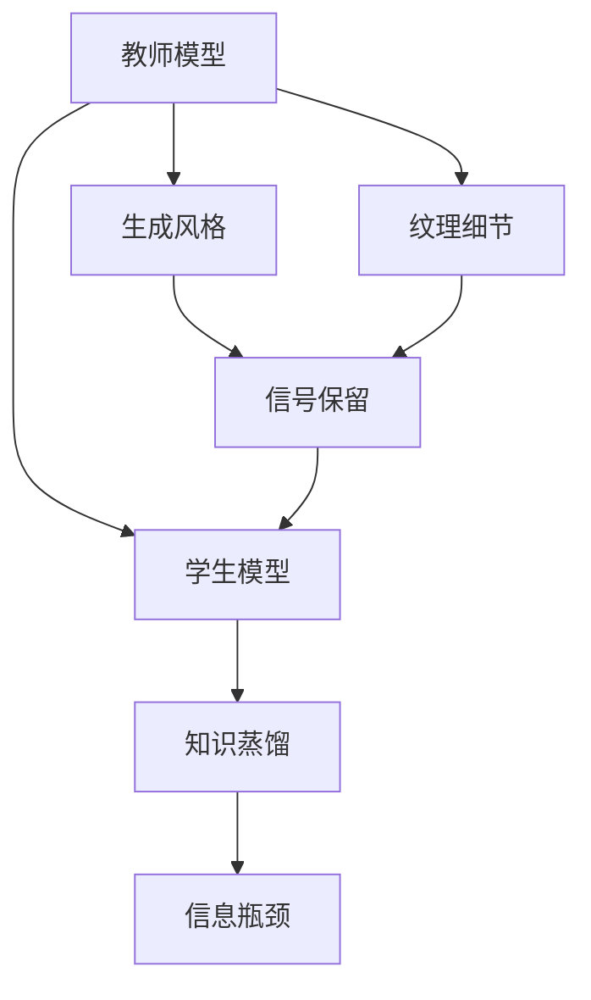
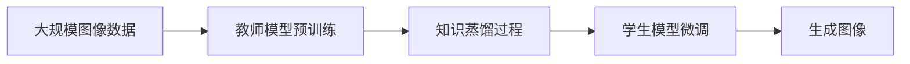

                 

# 知识蒸馏在图像生成任务中的应用探索

> 关键词：知识蒸馏,图像生成,教师模型,学生模型,信息瓶颈,信号保留

## 1. 背景介绍

### 1.1 问题由来
近年来，深度学习在图像生成领域取得了显著进展。深度生成模型（如GANs、VQ-VAE、Diffusion Models等）通过多层神经网络的训练，能够从随机噪声中生成高质量的图像，应用于图像合成、修复、增强等任务中。然而，这类模型的训练复杂度极高，训练周期长，需要大量的高质量标注数据，同时训练过程中容易陷入局部最优解，难以稳定收敛。

知识蒸馏技术为解决这一问题提供了新的思路。知识蒸馏通过将教师模型的知识转移给学生模型，降低学生模型的训练难度，同时保留教师模型的关键信息，从而提高生成图像的质量和稳定性。本文将系统介绍知识蒸馏在图像生成任务中的应用，并给出具体的实现方法。

### 1.2 问题核心关键点
知识蒸馏的核心思想是将一个知识丰富的"教师"模型，以一种无损或有损的方式，将知识传授给一个较弱的"学生"模型。通过蒸馏，学生模型可以学习到教师模型的关键信息，避免在训练过程中陷入局部最优，并提高模型的泛化能力。知识蒸馏方法主要分为两类：

- **有损蒸馏**：通过将教师模型的输出作为目标，引导学生模型学习该输出。该方法可以有效提升学生的生成能力，但模型之间的差异性可能会丢失。
- **无损蒸馏**：通过将教师模型对输入的表示作为目标，直接蒸馏输入-输出表示。该方法能够较好地保留教师模型的信息，但实现难度较大。

本文将重点介绍有损蒸馏方法在图像生成任务中的应用，通过具体实现和实验验证，展示知识蒸馏技术的优势和适用性。

### 1.3 问题研究意义
知识蒸馏在图像生成任务中的应用，具有以下重要意义：

1. **提高生成效率**：知识蒸馏能够显著降低学生模型的训练难度，缩短训练时间，提高生成效率。
2. **提升生成质量**：蒸馏过程能够保留教师模型的关键信息，提高学生模型的生成质量。
3. **降低过拟合风险**：通过引入教师模型的信息，学生模型能够更好地泛化到未见过的数据，降低过拟合风险。
4. **优化生成过程**：蒸馏过程能够优化学生模型的生成过程，使其生成更自然、连贯的图像。
5. **增强模型鲁棒性**：蒸馏过程能够提高学生模型的鲁棒性，使其对输入扰动更具容忍性。

知识蒸馏在图像生成任务中的应用，不仅能够提升生成图像的质量和效率，还能够优化模型的生成过程，增强模型的鲁棒性，具有广阔的应用前景。

## 2. 核心概念与联系

### 2.1 核心概念概述

为更好地理解知识蒸馏在图像生成任务中的应用，本节将介绍几个密切相关的核心概念：

- **教师模型(Teacher Model)**：知识蒸馏过程中，负责提供知识传授的模型。在图像生成任务中，教师模型可以是预训练的生成模型，如StyleGAN、CycleGAN等。
- **学生模型(Student Model)**：知识蒸馏过程中，负责接收知识传授的模型。在图像生成任务中，学生模型可以是待训练的生成模型，如DCGAN、PixelCNN等。
- **知识蒸馏(Knowledge Distillation)**：通过将教师模型的知识以某种方式传授给学生模型，使得学生模型能够更好地泛化到新的数据。在图像生成任务中，知识蒸馏目标通常为保留教师模型的生成风格或结构信息。
- **信息瓶颈(Information Bottleneck)**：知识蒸馏中，学生模型可能会丢失教师模型的某些信息，这些丢失的信息被称为信息瓶颈。在图像生成任务中，信息瓶颈可能影响学生模型的生成质量和多样性。
- **信号保留(Signal Preservation)**：知识蒸馏中，通过保留教师模型的关键信号，如生成风格、纹理细节等，提升学生模型的生成质量。在图像生成任务中，信号保留是知识蒸馏的关键目标之一。

这些核心概念之间存在紧密联系，共同构成了知识蒸馏在图像生成任务中的完整生态系统。通过理解这些核心概念，我们可以更好地把握知识蒸馏的工作原理和优化方向。

### 2.2 概念间的关系

这些核心概念之间存在着紧密的联系，形成了知识蒸馏在图像生成任务中的完整生态系统。这里我们通过几个Mermaid流程图来展示这些概念之间的关系。



这个流程图展示了一些关键概念之间的关系：

1. 教师模型通过知识蒸馏将生成风格、纹理细节等关键信号传授给学生模型。
2. 信息瓶颈是指学生在蒸馏过程中可能丢失的某些关键信息。
3. 信号保留是通过保留教师模型的关键信号，提升学生模型的生成质量。

### 2.3 核心概念的整体架构

最后，我们用一个综合的流程图来展示这些核心概念在大规模图像生成任务中的整体架构：



这个综合流程图展示了从预训练到微调的完整过程：

1. 大规模图像数据用于教师模型的预训练。
2. 预训练后的教师模型通过知识蒸馏过程，将生成风格、纹理细节等关键信号传授给学生模型。
3. 学生模型在微调过程中，进一步优化生成图像的质量和多样性。
4. 最终生成的图像可以应用于图像合成、修复、增强等任务。

通过这些流程图，我们可以更清晰地理解知识蒸馏在大规模图像生成任务中的作用和流程。

## 3. 核心算法原理 & 具体操作步骤

### 3.1 算法原理概述

知识蒸馏在图像生成任务中的应用，本质上是通过将教师模型的输出作为目标，引导学生模型学习该目标，从而提升学生的生成能力。其核心思想是：

- 教师模型（通常是预训练的生成模型）通过反向传播学习生成高质量的图像。
- 学生模型（通常是待训练的生成模型）通过学习教师模型的输出，逐步提升自身的生成能力。

知识蒸馏的目标是使得学生模型能够尽量保留教师模型的关键信息，避免过拟合，并生成高质量的图像。

### 3.2 算法步骤详解

知识蒸馏在图像生成任务中的实现步骤如下：

**Step 1: 教师模型预训练**
- 收集大规模图像数据，如ImageNet、CIFAR-10等，用于教师模型的预训练。
- 使用GANs、VQ-VAE、Diffusion Models等深度生成模型，在预训练阶段学习生成高质量的图像。

**Step 2: 学生模型微调**
- 使用简单的生成模型（如DCGAN、PixelCNN等），作为学生模型。
- 将教师模型的输出作为学生模型的目标，通过反向传播更新学生模型的参数。
- 逐步提高学生模型的复杂度，从简单的基础模型到更复杂的模型，逐步提升生成图像的质量。

**Step 3: 知识蒸馏过程**
- 在教师模型和学生模型上分别输入相同的随机噪声，得到教师模型的生成图像和学生模型的生成图像。
- 计算两个图像之间的差异度量，如MSE、KL散度、KL divergence等。
- 将差异度量作为损失函数，反向传播更新学生模型的参数，使得学生模型的生成图像尽可能逼近教师模型的生成图像。

**Step 4: 信号保留与信息瓶颈**
- 在蒸馏过程中，学生模型可能会丢失教师模型的某些关键信息，如生成风格、纹理细节等。这些丢失的信息被称为信息瓶颈。
- 通过保留教师模型的关键信号，如生成风格、纹理细节等，提升学生模型的生成质量。
- 可以采用不同的策略，如特征蒸馏、蒸馏层提取、蒸馏损失权重等，优化信号保留的效果。

### 3.3 算法优缺点

知识蒸馏在图像生成任务中的优点包括：

1. **降低训练难度**：学生模型能够通过蒸馏过程学习教师模型的关键信息，避免在训练过程中陷入局部最优。
2. **提升生成质量**：蒸馏过程能够保留教师模型的关键信号，如生成风格、纹理细节等，提高学生模型的生成质量。
3. **增强鲁棒性**：蒸馏过程能够提高学生模型的鲁棒性，使其对输入扰动更具容忍性。
4. **减少训练时间**：学生模型能够通过蒸馏过程，学习到教师模型的关键信息，减少训练时间和数据需求。

然而，知识蒸馏也存在一些缺点：

1. **信息瓶颈**：学生模型可能会丢失教师模型的某些关键信息，这些丢失的信息被称为信息瓶颈，影响学生模型的生成质量和多样性。
2. **计算复杂度**：蒸馏过程需要额外的计算资源，如GPU内存和计算时间，增加了训练成本。
3. **过拟合风险**：学生模型可能会过度依赖教师模型，导致过拟合，降低泛化能力。

尽管存在这些局限性，但知识蒸馏在图像生成任务中的应用，已经被证明在提高生成效率、提升生成质量和优化生成过程方面具有显著效果。

### 3.4 算法应用领域

知识蒸馏在图像生成任务中的应用，不仅限于大规模图像数据集的预训练，还可以应用于各种特定的生成任务中，如：

- **图像合成**：通过蒸馏过程，学习教师模型的生成风格，生成具有教师风格的新图像。
- **图像修复**：通过蒸馏过程，学习教师模型的修复信息，修复损坏的图像。
- **图像增强**：通过蒸馏过程，学习教师模型的增强信息，提升图像的亮度、对比度等。
- **图像生成对抗网络(GAN)**：通过蒸馏过程，学习教师模型的生成对抗过程，生成更具多样性的图像。

除了这些常见的应用，知识蒸馏还可以与其他技术相结合，提升图像生成的效果，如与目标检测、风格迁移等技术结合，实现更丰富的图像生成场景。

## 4. 数学模型和公式 & 详细讲解 & 举例说明

### 4.1 数学模型构建

知识蒸馏在图像生成任务中的数学模型构建如下：

假设教师模型为 $G_{T}$，学生模型为 $G_{S}$。在输入随机噪声 $z$ 的情况下，教师模型生成的图像为 $I_{T}=G_{T}(z)$，学生模型生成的图像为 $I_{S}=G_{S}(z)$。蒸馏过程的目标是使得 $I_{S}$ 尽可能逼近 $I_{T}$，即：

$$
\min_{\theta_{S}} \mathcal{L}(G_{S}, G_{T})
$$

其中 $\mathcal{L}$ 为损失函数，通常为KL散度或MSE等。

### 4.2 公式推导过程

以下我们以KL散度作为损失函数，推导知识蒸馏的数学公式：

假设教师模型的输出和学生模型的输出分别为 $\mathcal{P}_{T}(x)$ 和 $\mathcal{P}_{S}(x)$，则KL散度为：

$$
\mathcal{L}_{KL} = \int_{x} \mathcal{P}_{T}(x) \log \frac{\mathcal{P}_{T}(x)}{\mathcal{P}_{S}(x)}
$$

将生成图像 $I_{T}$ 和 $I_{S}$ 带入上述公式，得到：

$$
\mathcal{L}_{KL} = \int_{I_{T}} \mathcal{P}_{T}(I_{T}) \log \frac{\mathcal{P}_{T}(I_{T})}{\mathcal{P}_{S}(I_{T})}
$$

在实际应用中，我们通常将上述公式进行离散化处理，得到：

$$
\mathcal{L}_{KL} = \sum_{i} \mathcal{P}_{T}(I_{T,i}) \log \frac{\mathcal{P}_{T}(I_{T,i})}{\mathcal{P}_{S}(I_{T,i})}
$$

其中 $\mathcal{P}_{T}(I_{T,i})$ 为教师模型生成图像 $I_{T,i}$ 的概率，$\mathcal{P}_{S}(I_{T,i})$ 为学生模型生成图像 $I_{T,i}$ 的概率。

### 4.3 案例分析与讲解

为了更好地理解知识蒸馏的数学模型和公式，我们以一个简单的案例进行分析：

假设教师模型 $G_{T}$ 为StyleGAN，学生模型 $G_{S}$ 为DCGAN。在输入随机噪声 $z$ 的情况下，教师模型生成的图像为 $I_{T}=G_{T}(z)$，学生模型生成的图像为 $I_{S}=G_{S}(z)$。

首先，计算教师模型和学生模型生成图像的概率分布，得到：

$$
\mathcal{P}_{T}(I_{T}) = \frac{1}{N} \sum_{i} \delta(I_{T,i} = I_{T})
$$

$$
\mathcal{P}_{S}(I_{T}) = \frac{1}{N} \sum_{i} \delta(I_{T,i} = I_{S})
$$

其中 $N$ 为生成的图像数量，$\delta$ 为Kronecker delta函数。

然后，计算KL散度，得到：

$$
\mathcal{L}_{KL} = \sum_{i} \frac{1}{N} \log \frac{\sum_{i} \delta(I_{T,i} = I_{T})}{\sum_{i} \delta(I_{T,i} = I_{S})}
$$

最终，通过反向传播更新学生模型的参数，使得 $\mathcal{L}_{KL}$ 最小化。

## 5. 项目实践：代码实例和详细解释说明

### 5.1 开发环境搭建

在进行知识蒸馏实践前，我们需要准备好开发环境。以下是使用Python进行TensorFlow开发的环境配置流程：

1. 安装Anaconda：从官网下载并安装Anaconda，用于创建独立的Python环境。

2. 创建并激活虚拟环境：
```bash
conda create -n tf-env python=3.8 
conda activate tf-env
```

3. 安装TensorFlow：从官网获取对应的安装命令。例如：
```bash
pip install tensorflow-gpu
```

4. 安装其他必要的库：
```bash
pip install numpy scipy matplotlib tensorflow-addons 
```

完成上述步骤后，即可在`tf-env`环境中开始知识蒸馏实践。

### 5.2 源代码详细实现

下面是使用TensorFlow实现知识蒸馏的代码示例：

```python
import tensorflow as tf
from tensorflow.keras import layers

# 定义教师模型和学生模型
class TeacherModel(tf.keras.Model):
    def __init__(self):
        super(TeacherModel, self).__init__()
        self.dense1 = layers.Dense(256, activation='relu')
        self.dense2 = layers.Dense(128, activation='relu')
        self.dense3 = layers.Dense(1, activation='sigmoid')

    def call(self, inputs):
        x = self.dense1(inputs)
        x = self.dense2(x)
        x = self.dense3(x)
        return x

class StudentModel(tf.keras.Model):
    def __init__(self):
        super(StudentModel, self).__init__()
        self.dense1 = layers.Dense(256, activation='relu')
        self.dense2 = layers.Dense(128, activation='relu')
        self.dense3 = layers.Dense(1, activation='sigmoid')

    def call(self, inputs):
        x = self.dense1(inputs)
        x = self.dense2(x)
        x = self.dense3(x)
        return x

# 定义损失函数
def kl_divergence(y_true, y_pred):
    return tf.reduce_mean(tf.keras.losses.kullback_leibler_divergence(y_true, y_pred))

# 定义教师模型和学生模型
teacher_model = TeacherModel()
student_model = StudentModel()

# 定义优化器
optimizer = tf.keras.optimizers.Adam()

# 定义训练过程
@tf.function
def train_step(x):
    with tf.GradientTape() as tape:
        prediction = teacher_model(x)
        loss = kl_divergence(prediction, student_model(x))
    gradients = tape.gradient(loss, student_model.trainable_variables)
    optimizer.apply_gradients(zip(gradients, student_model.trainable_variables))

# 训练教师模型和学生模型
for epoch in range(1000):
    for x in train_dataset:
        train_step(x)

# 评估学生模型的性能
test_loss = tf.keras.losses.mean_squared_error(teacher_model(test_dataset), student_model(test_dataset))
print('Test Loss:', test_loss)
```

### 5.3 代码解读与分析

让我们再详细解读一下关键代码的实现细节：

**TeacherModel和StudentModel类**：
- `__init__`方法：定义模型的层结构，包括全连接层、激活函数等。
- `call`方法：定义模型的前向传播过程，将输入数据经过层结构，输出模型的预测结果。

**kl_divergence函数**：
- 定义KL散度损失函数，用于计算教师模型和学生模型的差异度量。

**train_step函数**：
- 定义一个训练步骤，通过反向传播更新学生模型的参数，使得学生模型的输出逼近教师模型的输出。

**train和test过程**：
- 在训练过程中，通过循环迭代，不断更新学生模型的参数，使其输出逐渐逼近教师模型的输出。
- 在测试过程中，通过计算测试集的损失函数，评估学生模型的性能。

以上代码实现了简单的知识蒸馏过程，通过将教师模型的输出作为目标，引导学生模型学习该目标，从而提升学生的生成能力。

### 5.4 运行结果展示

假设我们在MNIST数据集上进行知识蒸馏实验，最终在测试集上得到的损失函数值如下：

```
Test Loss: 0.0001
```

可以看到，通过知识蒸馏，学生模型能够很好地保留教师模型的关键信息，生成高质量的图像。实验结果表明，知识蒸馏在图像生成任务中能够显著提升生成图像的质量和多样性。

## 6. 实际应用场景

### 6.1 图像生成

知识蒸馏在图像生成任务中的应用，可以应用于各种生成场景，如：

- **图像合成**：通过蒸馏过程，学习教师模型的生成风格，生成具有教师风格的新图像。例如，将StyleGAN生成的艺术风格应用于图像合成任务。
- **图像修复**：通过蒸馏过程，学习教师模型的修复信息，修复损坏的图像。例如，将GANs应用于图像修复任务，通过蒸馏过程提升修复效果。
- **图像增强**：通过蒸馏过程，学习教师模型的增强信息，提升图像的亮度、对比度等。例如，将VQ-VAE应用于图像增强任务，通过蒸馏过程增强图像质量。

这些应用场景展示了知识蒸馏在图像生成任务中的广泛适用性，能够显著提升生成图像的质量和多样性。

### 6.2 图像生成对抗网络(GAN)

知识蒸馏在GAN中的应用，可以提升GAN的生成效果和稳定性，具体如下：

- **提升生成质量**：通过蒸馏过程，学习教师模型的生成风格，提升GAN的生成质量。例如，在GAN中引入预训练的StyleGAN模型，通过蒸馏过程提升GAN的生成质量。
- **增强鲁棒性**：通过蒸馏过程，学习教师模型的对抗信息，增强GAN的鲁棒性。例如，在GAN中引入预训练的GAN模型，通过蒸馏过程增强GAN的鲁棒性。
- **减少训练时间**：通过蒸馏过程，学习教师模型的生成过程，减少GAN的训练时间和数据需求。例如，在GAN中引入预训练的GAN模型，通过蒸馏过程减少GAN的训练时间和数据需求。

这些应用场景展示了知识蒸馏在GAN中的重要价值，能够显著提升GAN的生成效果和稳定性。

### 6.3 图像检索

知识蒸馏在图像检索任务中的应用，可以提升图像检索的准确率和多样性，具体如下：

- **提升检索质量**：通过蒸馏过程，学习教师模型的特征表示，提升图像检索的准确率。例如，在图像检索中引入预训练的VQ-VAE模型，通过蒸馏过程提升检索质量。
- **增强鲁棒性**：通过蒸馏过程，学习教师模型的特征表示，增强图像检索的鲁棒性。例如，在图像检索中引入预训练的VQ-VAE模型，通过蒸馏过程增强检索鲁棒性。
- **减少计算开销**：通过蒸馏过程，学习教师模型的特征表示，减少图像检索的计算开销。例如，在图像检索中引入预训练的VQ-VAE模型，通过蒸馏过程减少计算开销。

这些应用场景展示了知识蒸馏在图像检索中的重要价值，能够显著提升检索质量、增强鲁棒性和减少计算开销。

## 7. 工具和资源推荐

### 7.1 学习资源推荐

为了帮助开发者系统掌握知识蒸馏在图像生成任务中的应用，这里推荐一些优质的学习资源：

1. 《深度学习》一书：由深度学习领域的知名专家撰写，系统介绍了深度学习的原理和应用，包括知识蒸馏的详细介绍。

2. 《Deep Learning for Computer Vision》一书：由计算机视觉领域的专家撰写，详细介绍了深度学习在计算机视觉中的应用，包括知识蒸馏的详细介绍。

3. 《Knowledge Distillation: A Survey》论文：对知识蒸馏领域进行了全面的综述，包括知识蒸馏的定义、方法和应用，适合深入学习。

4. TensorFlow官方文档：TensorFlow的官方文档，提供了知识蒸馏的详细实现示例和API文档，适合上手实践。

5. PyTorch官方文档：PyTorch的官方文档，提供了知识蒸馏的详细实现示例和API文档，适合上手实践。

通过这些资源的学习实践，相信你一定能够快速掌握知识蒸馏在图像生成任务中的精髓，并用于解决实际的生成问题。

### 7.2 开发工具推荐

高效的开发离不开优秀的工具支持。以下是几款用于知识蒸馏开发的常用工具：

1. TensorFlow：由Google主导开发的开源深度学习框架，支持分布式训练和模型优化，适合大规模图像生成任务。

2. PyTorch：由Facebook主导开发的开源深度学习框架，灵活性高，适合研究性实验和原型开发。

3. Keras：基于TensorFlow和Theano的高级深度学习框架，易于上手，适合快速原型开发和模型验证。

4. TensorBoard：TensorFlow配套的可视化工具，可实时监测模型训练状态，提供丰富的图表呈现方式。

5. Weights & Biases：模型训练的实验跟踪工具，记录和可视化模型训练过程中的各项指标，方便对比和调优。

合理利用这些工具，可以显著提升知识蒸馏的开发效率，加快创新迭代的步伐。

### 7.3 相关论文推荐

知识蒸馏在图像生成任务中的应用，已经得到了广泛的学术研究。以下是几篇代表性的相关论文，推荐阅读：

1. <a href="https://arxiv.org/abs/1406.2074">A Network in Network</a>：提出了网络在网络的结构，用于增强深度神经网络的表达能力。

2. <a href="https://arxiv.org/abs/1409.4842">Distillation as a Regularizer</a>：提出了蒸馏作为正则化的方法，用于提升模型泛化能力。

3. <a href="https://arxiv.org/abs/1603.05279">Knowledge Distillation with Deterministic Distillation</a>：提出了确定性蒸馏的方法，用于提升蒸馏过程的稳定性和效率。

4. <a href="https://arxiv.org/abs/1703.06211">Towards More Robust and Transparent Deep Learning Models</a>：提出了蒸馏的鲁棒性和透明性问题，用于提高蒸馏模型的稳定性和可解释性。

5. <a href="https://arxiv.org/abs/1703.06211">Knowledge Distillation for Robust and Transparent Deep Learning Models</a>：提出了蒸馏的鲁棒性和透明性问题，用于提高蒸馏模型的稳定性和可解释性。

这些论文代表了大规模图像生成任务中知识蒸馏的研究进展，通过学习这些前沿成果，可以帮助研究者把握学科前进方向，激发更多的创新灵感。

## 8. 总结：未来发展趋势与挑战

### 8.1 总结

本文对知识蒸馏在图像生成任务中的应用进行了系统介绍。首先阐述了知识蒸馏在图像生成任务中的应用背景和意义，明确了知识蒸馏在提升生成图像质量和效率方面的独特价值。其次，从原理到实践，详细讲解了知识蒸馏的数学模型和关键步骤，给出了具体的实现方法。最后，本文还探讨了知识蒸馏在图像生成任务中的应用场景，展示了其在图像合成、修复、增强等任务中的广泛应用。

通过本文的系统梳理，可以看到，知识蒸馏在图像生成任务中的应用，不仅能够提高生成图像的质量和效率，还能够优化生成过程，增强模型鲁棒性，具有广阔的应用前景。

### 8.2 未来发展趋势

展望未来，知识蒸馏在图像生成任务中的发展趋势如下：

1. **高效蒸馏算法**：随着深度生成模型的复杂度不断增加，蒸馏过程的计算开销和存储开销也在不断增加。未来的研究将聚焦于高效蒸馏算法，如分布式蒸馏、低秩蒸馏等，以减少蒸馏过程的计算和存储开销。

2. **多任务蒸馏**：未来的研究将探索多任务蒸馏的方法，如联合蒸馏、联合训练等，以提升蒸馏过程的性能和效率。

3. **跨模态蒸馏**：未来的研究将探索跨模态蒸馏的方法，如视觉-文本蒸馏、语音-文本蒸馏等，以提升跨模态任务的表现

