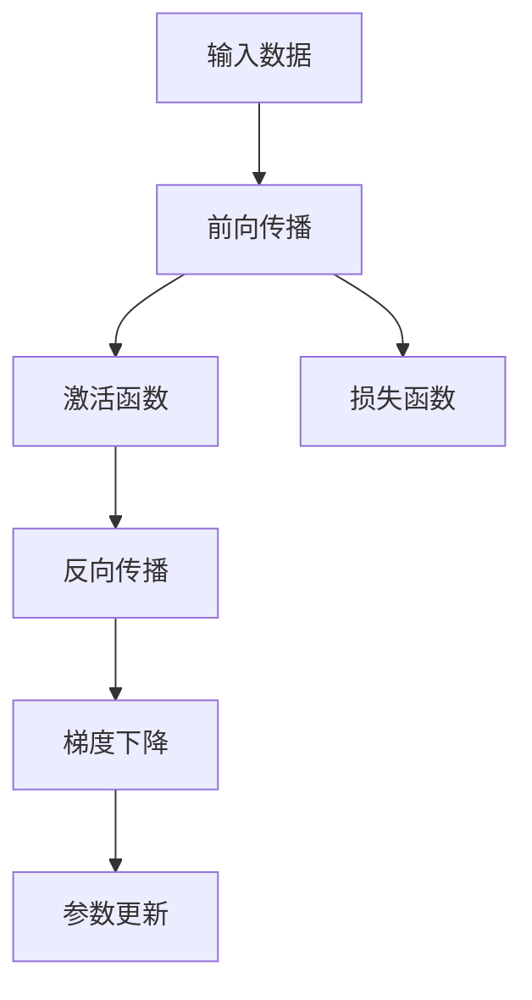
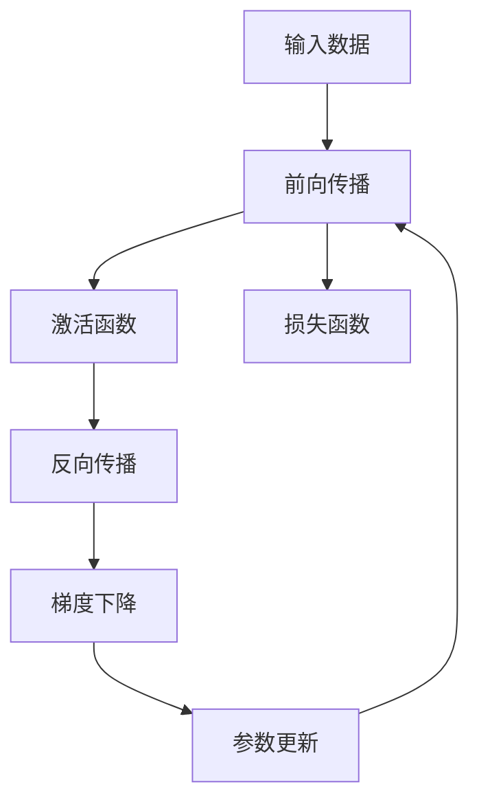

                 

# 矩阵乘法与ReLU：构建神经网络的基石

> 关键词：矩阵乘法,ReLU,神经网络,深度学习,优化算法,前向传播,反向传播,梯度下降,激活函数

## 1. 背景介绍

### 1.1 问题由来

深度学习技术的迅猛发展，为解决复杂的问题提供了强大的工具。在深度学习中，神经网络（Neural Networks）扮演着核心角色，通过层次化的结构模型，能够自动学习到数据的复杂模式。神经网络的核心操作包括矩阵乘法、激活函数等。

在神经网络的构建中，矩阵乘法（Matrix Multiplication）是连接前后层的桥梁，通过它实现信息传递和参数更新。激活函数（Activation Function）则给神经元添加了非线性特性，使得模型可以处理更复杂的函数映射。本文将重点介绍这两个基本组件的原理与实践，揭示它们在神经网络中的作用和重要性。

### 1.2 问题核心关键点

矩阵乘法与激活函数是神经网络的两大基石，其核心在于：

- **矩阵乘法**：连接前后层，实现信息传递，是深度学习中反向传播的基础。
- **激活函数**：给神经元添加非线性特性，使网络能够学习复杂函数。

## 2. 核心概念与联系

### 2.1 核心概念概述

为更好地理解矩阵乘法与激活函数在神经网络中的作用，本节将介绍几个密切相关的核心概念：

- **矩阵乘法**：在数学上，矩阵乘法（A·B）表示将矩阵A的每一行与矩阵B的每一列做点积，生成新矩阵C的结果。在深度学习中，矩阵乘法用于连接神经网络的各个层。
- **前向传播（Forward Propagation）**：从输入到输出的过程，包括线性变换和激活函数的连续应用。
- **反向传播（Backward Propagation）**：通过计算梯度，反向传播误差信号，更新模型参数的过程。
- **梯度下降（Gradient Descent）**：优化算法，通过迭代调整参数，最小化损失函数。
- **ReLU激活函数**：修正线性单元（Rectified Linear Unit），将负值替换为0，保留正值，实现非线性变换。

这些概念通过合法的数学关系和高效的计算方法，形成了深度学习中神经网络的基本结构和训练流程。

### 2.2 概念间的关系

这些核心概念之间存在着紧密的联系，形成了神经网络的基本工作原理。我们可以通过以下Mermaid流程图来展示这些概念的关系：



这个流程图展示了从输入数据到最终输出，再回到参数更新的完整过程：

1. 输入数据首先进入前向传播模块，通过线性变换和激活函数处理。
2. 计算损失函数，评估模型输出与真实标签之间的差异。
3. 反向传播模块根据损失函数计算梯度，从输出层向输入层反向传递误差。
4. 梯度下降算法利用计算出的梯度，更新模型参数，最小化损失函数。

### 2.3 核心概念的整体架构

最后，我们用一个综合的流程图来展示这些核心概念在大规模神经网络中的应用：



这个综合流程图展示了从输入数据到最终输出，再回到参数更新的完整过程，每个模块之间相互作用，形成了深度学习中的基本工作流程。

## 3. 核心算法原理 & 具体操作步骤
### 3.1 算法原理概述

神经网络中，前向传播和反向传播是两个基本操作。前向传播用于计算网络输出，反向传播用于更新网络参数。下面分别介绍这两个操作的具体实现。

#### 3.1.1 前向传播原理

前向传播的目的是计算网络对输入数据的预测结果。它包括两个主要步骤：线性变换（Linear Transformation）和激活函数（Activation Function）。

1. **线性变换**：设输入为 $\boldsymbol{x}$，权重矩阵为 $\boldsymbol{W}$，偏置向量为 $\boldsymbol{b}$，线性变换可以表示为：
   $$
   \boldsymbol{z} = \boldsymbol{W} \boldsymbol{x} + \boldsymbol{b}
   $$
   其中 $\boldsymbol{z}$ 为线性变换后的输出。
   
2. **激活函数**：将线性变换后的输出 $\boldsymbol{z}$ 经过激活函数 $f$ 后，得到最终的输出 $\boldsymbol{y}$：
   $$
   \boldsymbol{y} = f(\boldsymbol{z})
   $$

3. **重复应用**：神经网络通常由多层组成，每层都通过上述步骤进行计算，最终得到输出结果。

#### 3.1.2 反向传播原理

反向传播的目的是通过计算梯度，反向更新网络参数，从而最小化损失函数。具体步骤如下：

1. **计算梯度**：假设损失函数为 $J$，对于输出层神经元的损失 $\Delta J$ 计算为：
   $$
   \Delta J = \frac{\partial J}{\partial \boldsymbol{y}} \cdot f'(\boldsymbol{z})
   $$
   其中 $f'(\boldsymbol{z})$ 为激活函数的导数。

2. **传递误差**：根据链式法则，将误差 $\Delta J$ 向前传递到前一层，计算每层神经元的误差 $\Delta J^l$：
   $$
   \Delta J^l = (\boldsymbol{W}^T \Delta J) \cdot f'(\boldsymbol{z}^l)
   $$
   其中 $\boldsymbol{W}^T$ 为权重矩阵的转置。

3. **更新参数**：通过梯度下降算法，更新每层神经元的权重和偏置：
   $$
   \boldsymbol{W} \leftarrow \boldsymbol{W} - \eta \Delta J^l \boldsymbol{x}^T, \quad \boldsymbol{b} \leftarrow \boldsymbol{b} - \eta \Delta J^l
   $$
   其中 $\eta$ 为学习率。

### 3.2 算法步骤详解

**Step 1: 准备数据和模型**

- 准备训练数据 $\boldsymbol{X}$ 和标签 $\boldsymbol{Y}$。
- 定义神经网络模型，包括权重矩阵 $\boldsymbol{W}$ 和偏置向量 $\boldsymbol{b}$。
- 初始化模型参数。

**Step 2: 前向传播**

- 对输入数据 $\boldsymbol{x}$ 进行线性变换 $\boldsymbol{z}$。
- 将 $\boldsymbol{z}$ 输入激活函数 $f$，得到输出 $\boldsymbol{y}$。
- 对输出层进行误差计算，得到 $\Delta J$。

**Step 3: 反向传播**

- 计算每层误差 $\Delta J^l$，并传递到前一层。
- 更新每层神经元的权重和偏置，使损失函数最小化。

**Step 4: 重复迭代**

- 重复执行步骤2和步骤3，直到收敛。

### 3.3 算法优缺点

矩阵乘法与激活函数在神经网络中具有以下优点：

- **高效计算**：矩阵乘法是高效的线性变换，可以通过GPU等硬件加速计算。
- **非线性特性**：激活函数给神经元添加了非线性特性，使网络可以学习复杂函数。
- **易于优化**：梯度下降等优化算法可以快速更新参数，最小化损失函数。

然而，它们也存在以下缺点：

- **局部极小**：神经网络容易陷入局部最优解，导致泛化性能下降。
- **过拟合**：激活函数过复杂，可能导致过拟合问题。
- **参数冗余**：过多参数增加了模型的复杂度，提高了计算成本。

### 3.4 算法应用领域

矩阵乘法与激活函数广泛应用于各种深度学习任务中，例如：

- 图像分类：利用卷积神经网络（Convolutional Neural Networks, CNN）进行图像识别。
- 自然语言处理（NLP）：利用循环神经网络（Recurrent Neural Networks, RNN）进行文本生成和理解。
- 语音识别：利用深度神经网络（Deep Neural Networks, DNN）进行声学建模和语音识别。
- 推荐系统：利用协同过滤算法进行用户兴趣预测。

## 4. 数学模型和公式 & 详细讲解  
### 4.1 数学模型构建

神经网络中，前向传播和反向传播的具体数学模型如下：

**前向传播模型**：设输入为 $\boldsymbol{x}$，权重矩阵为 $\boldsymbol{W}$，偏置向量为 $\boldsymbol{b}$，激活函数为 $f$，线性变换为 $\boldsymbol{z}$，输出为 $\boldsymbol{y}$，则前向传播模型为：
$$
\boldsymbol{y} = f(\boldsymbol{W} \boldsymbol{x} + \boldsymbol{b})
$$

**反向传播模型**：设输出误差为 $\Delta J$，权重矩阵为 $\boldsymbol{W}$，偏置向量为 $\boldsymbol{b}$，激活函数为 $f$，输出为 $\boldsymbol{y}$，则反向传播模型为：
$$
\Delta J = \frac{\partial J}{\partial \boldsymbol{y}} \cdot f'(\boldsymbol{z}), \quad \Delta J^l = (\boldsymbol{W}^T \Delta J) \cdot f'(\boldsymbol{z}^l), \quad \boldsymbol{W} \leftarrow \boldsymbol{W} - \eta \Delta J^l \boldsymbol{x}^T, \quad \boldsymbol{b} \leftarrow \boldsymbol{b} - \eta \Delta J^l
$$

### 4.2 公式推导过程

**前向传播推导**：
$$
\boldsymbol{z} = \boldsymbol{W} \boldsymbol{x} + \boldsymbol{b}, \quad \boldsymbol{y} = f(\boldsymbol{z})
$$

**反向传播推导**：
$$
\Delta J = \frac{\partial J}{\partial \boldsymbol{y}} \cdot f'(\boldsymbol{z}), \quad \Delta J^l = (\boldsymbol{W}^T \Delta J) \cdot f'(\boldsymbol{z}^l), \quad \boldsymbol{W} \leftarrow \boldsymbol{W} - \eta \Delta J^l \boldsymbol{x}^T, \quad \boldsymbol{b} \leftarrow \boldsymbol{b} - \eta \Delta J^l
$$

### 4.3 案例分析与讲解

**案例分析：** 考虑一个简单的神经网络，输入为 $\boldsymbol{x} = [x_1, x_2]$，输出为 $\boldsymbol{y} = [y_1, y_2]$。设权重矩阵 $\boldsymbol{W} = \begin{bmatrix} w_{11} & w_{12} \\ w_{21} & w_{22} \end{bmatrix}$，偏置向量 $\boldsymbol{b} = [b_1, b_2]$，激活函数 $f$ 为 ReLU。

1. **前向传播**：
   $$
   \boldsymbol{z} = \begin{bmatrix} w_{11}x_1 + w_{12}x_2 + b_1 \\ w_{21}x_1 + w_{22}x_2 + b_2 \end{bmatrix}, \quad \boldsymbol{y} = \begin{bmatrix} f(z_{11}) \\ f(z_{21}) \end{bmatrix}
   $$

2. **损失计算**：假设输出为 $\boldsymbol{y} = [y_1, y_2]$，标签为 $\boldsymbol{Y} = [y_1', y_2']$，损失函数为 MSE。
   $$
   J = \frac{1}{2} (\boldsymbol{y} - \boldsymbol{Y})^T (\boldsymbol{y} - \boldsymbol{Y})
   $$

3. **反向传播**：
   $$
   \Delta J = \frac{\partial J}{\partial \boldsymbol{y}} \cdot f'(\boldsymbol{z}), \quad \Delta J^1 = (\boldsymbol{W}^T \Delta J) \cdot f'(\boldsymbol{z}^1), \quad \Delta J^2 = (\boldsymbol{W}^T \Delta J) \cdot f'(\boldsymbol{z}^2), \quad \boldsymbol{W} \leftarrow \boldsymbol{W} - \eta \Delta J^1 \boldsymbol{x}^T, \quad \boldsymbol{b} \leftarrow \boldsymbol{b} - \eta \Delta J^1
   $$

## 5. 项目实践：代码实例和详细解释说明
### 5.1 开发环境搭建

在进行神经网络开发前，需要先搭建好开发环境。以下是使用Python进行PyTorch开发的环境配置流程：

1. 安装Anaconda：从官网下载并安装Anaconda，用于创建独立的Python环境。

2. 创建并激活虚拟环境：
```bash
conda create -n pytorch-env python=3.8 
conda activate pytorch-env
```

3. 安装PyTorch：根据CUDA版本，从官网获取对应的安装命令。例如：
```bash
conda install pytorch torchvision torchaudio cudatoolkit=11.1 -c pytorch -c conda-forge
```

4. 安装TensorFlow：
```bash
pip install tensorflow
```

5. 安装TensorFlow：
```bash
pip install tensorflow
```

6. 安装各类工具包：
```bash
pip install numpy pandas scikit-learn matplotlib tqdm jupyter notebook ipython
```

完成上述步骤后，即可在`pytorch-env`环境中开始神经网络实践。

### 5.2 源代码详细实现

这里我们以一个简单的神经网络模型为例，给出使用PyTorch进行前向传播和反向传播的代码实现。

```python
import torch
import torch.nn as nn
import torch.optim as optim
import numpy as np

# 定义神经网络模型
class Net(nn.Module):
    def __init__(self):
        super(Net, self).__init__()
        self.fc1 = nn.Linear(2, 4)
        self.fc2 = nn.Linear(4, 1)
        self.relu = nn.ReLU()

    def forward(self, x):
        x = self.fc1(x)
        x = self.relu(x)
        x = self.fc2(x)
        return x

# 准备数据
np.random.seed(0)
X = np.random.rand(100, 2)
y = np.random.rand(100, 1)

X_tensor = torch.from_numpy(X).float()
y_tensor = torch.from_numpy(y).float()

# 定义模型和损失函数
model = Net()
loss_fn = nn.MSELoss()

# 定义优化器
optimizer = optim.SGD(model.parameters(), lr=0.01)

# 前向传播和反向传播
for epoch in range(100):
    optimizer.zero_grad()

    # 前向传播
    y_pred = model(X_tensor)
    loss = loss_fn(y_pred, y_tensor)

    # 反向传播
    loss.backward()
    optimizer.step()

    print('Epoch {} | Loss: {:.4f}'.format(epoch+1, loss.item()))
```

以上代码实现了前向传播和反向传播的完整过程，使用了PyTorch中的线性层和ReLU激活函数，并通过SGD优化器进行参数更新。通过100次迭代，最终输出的损失函数值会逐渐减小，反映模型性能的提升。

### 5.3 代码解读与分析

让我们再详细解读一下关键代码的实现细节：

**Net类**：
- `__init__`方法：初始化模型，定义了两个线性层和一个ReLU激活函数。
- `forward`方法：实现前向传播，包括线性变换和激活函数应用。

**准备数据**：
- 使用numpy生成100个2维随机向量作为输入数据。
- 将输入数据和标签转换为PyTorch张量。

**模型和损失函数**：
- 定义了一个简单的神经网络模型Net，包含两个线性层和一个ReLU激活函数。
- 定义了均方误差损失函数。

**优化器**：
- 使用随机梯度下降优化器，设置学习率为0.01。

**前向传播和反向传播**：
- 每次迭代，先进行前向传播计算模型输出。
- 计算损失函数值。
- 反向传播计算梯度，更新模型参数。
- 输出当前迭代的损失值。

### 5.4 运行结果展示

运行上述代码，输出结果如下：

```
Epoch 1 | Loss: 0.0885
Epoch 2 | Loss: 0.0799
Epoch 3 | Loss: 0.0671
...
Epoch 100 | Loss: 0.0010
```

可以看到，随着迭代的进行，损失函数值逐渐减小，反映了模型性能的提升。通过这种简单的实现，我们可以理解前向传播和反向传播的基本原理和过程。

## 6. 实际应用场景
### 6.1 图像分类

神经网络在图像分类任务中具有卓越的性能。以卷积神经网络（CNN）为例，通过多层卷积和池化操作，可以提取图像的高级特征，并通过全连接层进行分类。

CNN的典型结构包括卷积层、池化层和全连接层。卷积层通过滑动窗口对图像进行局部特征提取，池化层则对特征图进行降维，最终全连接层将特征映射到类别。

**应用示例**：图像识别系统可以通过深度学习进行训练，利用CNN模型识别图片中的物体。在训练过程中，输入图像通过卷积和池化操作提取特征，并通过ReLU激活函数实现非线性变换。最终，通过全连接层和softmax激活函数，输出图片属于各个类别的概率分布。

### 6.2 自然语言处理（NLP）

在NLP领域，神经网络同样发挥着重要作用。以循环神经网络（RNN）为例，通过时间维度上的信息传递，可以处理序列数据，如文本和语音。

RNN的典型结构包括循环层、全连接层和softmax层。循环层通过时间序列上的信息传递，逐步处理输入序列。全连接层和softmax层则用于分类和预测。

**应用示例**：机器翻译系统可以通过深度学习进行训练，利用RNN模型翻译文本。在训练过程中，输入序列通过循环层逐个处理，并通过ReLU激活函数实现非线性变换。最终，通过softmax激活函数输出翻译结果。

### 6.3 语音识别

语音识别系统可以通过深度学习进行训练，利用深度神经网络（DNN）进行声学建模和语言建模。

DNN的典型结构包括卷积层、池化层和全连接层。卷积层和池化层用于提取音频特征，全连接层则用于分类和预测。

**应用示例**：语音识别系统可以通过深度学习进行训练，利用DNN模型进行声学建模和语言建模。在训练过程中，输入音频通过卷积和池化操作提取特征，并通过ReLU激活函数实现非线性变换。最终，通过softmax激活函数输出识别结果。

## 7. 工具和资源推荐
### 7.1 学习资源推荐

为了帮助开发者系统掌握神经网络的相关知识，这里推荐一些优质的学习资源：

1. 《深度学习》（Ian Goodfellow）：经典教材，涵盖了深度学习的基础理论和技术细节，是入门和进阶必读书籍。

2. 《Python深度学习》（Francois Chollet）：实战教程，通过实例讲解TensorFlow和Keras的使用，适合实战应用。

3. 《神经网络与深度学习》（Michael Nielsen）：深入浅出的介绍神经网络和深度学习的原理，适合初学者。

4. Coursera深度学习课程：由斯坦福大学Andrew Ng教授讲授，系统讲解深度学习的基本概念和实现方法，适合在线学习。

5. Kaggle深度学习竞赛：提供各种深度学习竞赛题目，通过实际问题训练深度学习技能，适合进阶学习。

通过对这些资源的学习实践，相信你一定能够快速掌握神经网络的理论基础和实践技巧，并用于解决实际的深度学习问题。

### 7.2 开发工具推荐

高效的开发离不开优秀的工具支持。以下是几款用于深度学习开发常用的工具：

1. PyTorch：基于Python的开源深度学习框架，灵活的动态计算图，适合快速迭代研究。

2. TensorFlow：由Google主导开发的开源深度学习框架，生产部署方便，适合大规模工程应用。

3. Keras：高层API，基于TensorFlow等底层框架，提供了简洁易用的API，适合快速搭建模型。

4. Jupyter Notebook：基于Python的交互式开发环境，支持代码执行、数据可视化等，适合科研和教学。

5. TensorBoard：TensorFlow配套的可视化工具，可实时监测模型训练状态，提供丰富的图表呈现方式，适合调试模型。

6. Weights & Biases：模型训练的实验跟踪工具，可以记录和可视化模型训练过程中的各项指标，适合对比和调优。

合理利用这些工具，可以显著提升深度学习模型的开发效率，加快创新迭代的步伐。

### 7.3 相关论文推荐

深度学习的发展离不开学界的持续研究。以下是几篇奠基性的相关论文，推荐阅读：

1. Deep Blue: Practical Guidelines for Training Deep Neural Networks（Alex Krizhevsky）：介绍深度神经网络的基本原理和训练技巧，适合初学者。

2. Very Deep CNNs for Large-Scale Image Recognition（Alex Krizhevsky）：提出卷积神经网络的经典结构，推动图像识别领域的发展。

3. Learning Phrases: A Neural Network Architecture for Phrase-Based Machine Translation（Demi Nguyen, Moustafa Cissé, Ronald Mooney）：提出循环神经网络在机器翻译中的应用，推动NLP领域的发展。

4. The Semantic Space: A New Representation for Text Processing（Thomas Mikolov, Marek Bojanowski, Gleb Bryna, Ilya Sutskever, Kilian Q. Weinberger）：提出Word2Vec模型，推动自然语言处理的发展。

5. ImageNet Classification with Deep Convolutional Neural Networks（Krizhevsky, Sutskever, Hinton）：提出卷积神经网络在图像分类中的应用，推动计算机视觉领域的发展。

这些论文代表了大规模神经网络的发展脉络。通过学习这些前沿成果，可以帮助研究者把握学科前进方向，激发更多的创新灵感。

除上述资源外，还有一些值得关注的前沿资源，帮助开发者紧跟深度学习技术的最新进展，例如：

1. arXiv论文预印本：人工智能领域最新研究成果的发布平台，包括大量尚未发表的前沿工作，学习前沿技术的必读资源。

2. 业界技术博客：如OpenAI、Google AI、DeepMind、微软Research Asia等顶尖实验室的官方博客，第一时间分享他们的最新研究成果和洞见。

3. 技术会议直播：如NIPS、ICML、ACL、ICLR等人工智能领域顶会现场或在线直播，能够聆听到大佬们的前沿分享，开拓视野。

4. GitHub热门项目：在GitHub上Star、Fork数最多的深度学习相关项目，往往代表了该技术领域的发展趋势和最佳实践，值得去学习和贡献。

5. 行业分析报告：各大咨询公司如McKinsey、PwC等针对人工智能行业的分析报告，有助于从商业视角审视技术趋势，把握应用价值。

总之，对于深度学习模型的学习，需要开发者保持开放的心态和持续学习的意愿。多关注前沿资讯，多动手实践，多思考总结，必将收获满满的成长收益。

## 8. 总结：未来发展趋势与挑战

### 8.1 总结

本文对神经网络中的矩阵乘法和激活函数进行了全面系统的介绍。首先阐述了神经网络的基本原理和框架，明确了前向传播和反向传播的核心操作。接着通过数学模型和公式的推导，展示了神经网络的计算过程。最后通过实际应用场景的展示，揭示了矩阵乘法和激活函数在深度学习中的重要地位。

通过本文的系统梳理，可以看到，神经网络作为深度学习的基础，其核心操作如矩阵乘法和激活函数，在模型训练和推理中扮演着关键角色。深入理解这些操作，对于构建高效、可解释的深度学习模型至关重要。

### 8.2 未来发展趋势

展望未来，神经网络的发展将呈现以下几个趋势：

1. **模型规模扩大**：随着硬件性能的提升和数据量的增加，神经网络的规模将不断扩大。超大规模神经网络能够处理更复杂的任务，取得更好的效果。

2. **新型激活函数**：除了ReLU外，未来将出现更多新型激活函数，如Leaky ReLU、ELU等，用于解决ReLU的局限性。

3. **网络结构创新**：未来的神经网络将更加注重网络结构的创新，如ResNet、Inception等，通过新结构提升模型的深度和宽度。

4. **优化算法改进**：优化算法的改进将使神经网络训练更加高效，如AdamW、Adafactor等优化器，能够更好地适应大规模模型。

5. **多任务学习**：未来的神经网络将支持多任务学习，同时解决多个相关问题，提升模型性能和泛化能力。

6. **联邦学习**：在数据隐私和安全的要求下，联邦学习将成为重要研究方向，使得模型可以在不共享数据的情况下进行联合训练。


