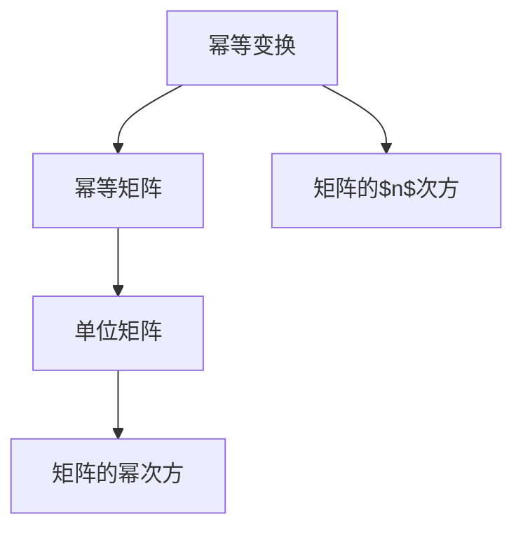
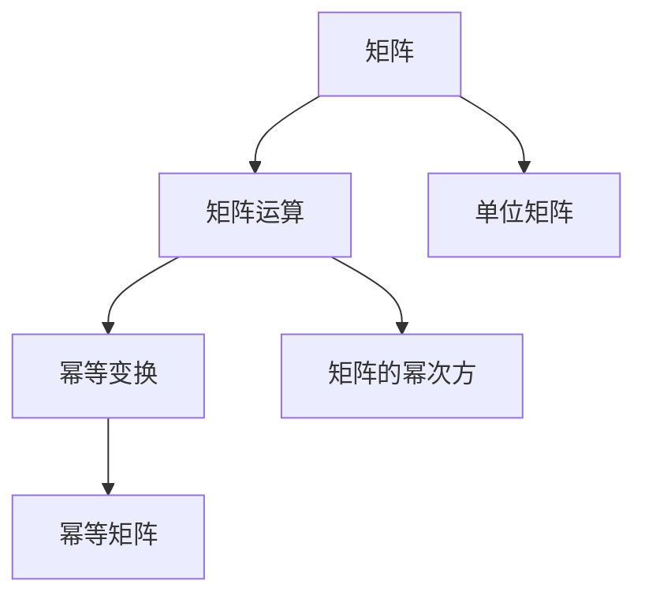

                 

# 矩阵理论与应用：幂等变换与幂等矩阵

> 关键词：幂等矩阵,幂等变换,线性代数,矩阵运算,单位矩阵,平方根矩阵

## 1. 背景介绍

### 1.1 问题由来

在现代数学和计算科学中，矩阵理论是一个非常基础而重要的研究领域。它的应用范围广泛，几乎覆盖了所有数学分支以及物理学、工程学、计算机科学等多个领域。从基础的线性代数到复杂的图论、优化和深度学习，矩阵理论都在其中扮演着不可或缺的角色。而在众多矩阵运算中，幂等变换（Pow-er Equation Transformation）和幂等矩阵（Idempotent Matrix）是最基础而重要的概念之一，它们不仅在理论上具有深远影响，而且在实际应用中也广受关注。

### 1.2 问题核心关键点

幂等变换和幂等矩阵在矩阵运算中具有独特的性质。幂等变换指的是一个矩阵满足某个幂次方等于其本身，而幂等矩阵则是一个特殊的幂等变换，其定义更为严格，即一个矩阵的平方等于其本身。这一性质使得幂等矩阵在数据压缩、图形处理、网络分析等领域具有广泛的应用。

### 1.3 问题研究意义

研究幂等变换和幂等矩阵的意义在于：
- 深化对矩阵运算的理解。幂等变换和幂等矩阵为线性代数的基础运算提供了一个有力的工具，帮助理解矩阵乘法、逆矩阵等基本概念。
- 促进应用科学的发展。幂等矩阵在数据压缩、图像处理、网络算法等领域的应用，极大地推动了这些学科的发展。
- 拓展计算机科学的知识边界。随着深度学习、量子计算等领域的兴起，幂等矩阵和幂等变换的理论研究对于算法设计和系统优化具有重要意义。

## 2. 核心概念与联系

### 2.1 核心概念概述

为了更好地理解幂等变换和幂等矩阵，我们先回顾一些基础概念：

- **矩阵**：一个由数字或符号组成的二维数组，按照行和列的顺序排列。矩阵在数学和科学计算中有着广泛的应用。
- **矩阵运算**：包括矩阵加法、矩阵乘法、矩阵转置等，是线性代数和微积分的重要工具。
- **单位矩阵**：即对角线上全为1，其余元素全为0的矩阵，在矩阵运算中具有特殊性质。
- **幂等变换**：指一个矩阵的幂次方等于其本身，即存在一个非负整数$n$，使得$A^n = A$。
- **幂等矩阵**：指一个幂等变换的特殊情况，即存在一个矩阵$A$，使得$A^2 = A$。

通过这些概念，我们能够构建一个更完整的理论框架，为进一步探索幂等变换和幂等矩阵奠定基础。

### 2.2 概念间的关系

幂等变换和幂等矩阵是线性代数中非常重要的概念，它们之间的关系可以通过以下Mermaid流程图来展示：



这个流程图展示了幂等变换、幂等矩阵、单位矩阵以及矩阵的幂次方之间的关系：

- 幂等变换是一个矩阵满足特定幂次方等于其本身的过程。
- 幂等矩阵是满足$A^2 = A$的矩阵，它是幂等变换的一个特例。
- 单位矩阵是幂等变换中最简单的情况，即$A^1 = A$。
- 矩阵的幂次方是幂等变换的推广，即$A^n = A$，其中$n$为非负整数。

这些概念共同构成了幂等变换和幂等矩阵的理论基础，帮助我们理解和应用这些概念。

### 2.3 核心概念的整体架构

最后，我们用一个综合的流程图来展示幂等变换和幂等矩阵的整体架构：



这个综合流程图展示了从矩阵运算到幂等变换，再到幂等矩阵的整体结构。通过对这些核心概念的深入理解，我们可以更好地把握幂等变换和幂等矩阵的理论和应用。

## 3. 核心算法原理 & 具体操作步骤
### 3.1 算法原理概述

幂等变换和幂等矩阵的核心原理在于矩阵的幂次方性质。对于一个矩阵$A$，如果存在一个非负整数$n$，使得$A^n = A$，那么$A$就是一个幂等变换。若$A$还满足$A^2 = A$，则$A$是一个幂等矩阵。

数学上，我们可以用以下公式来表示幂等变换和幂等矩阵的性质：

$$
A^n = A
$$

$$
A^2 = A
$$

其中$A$为任意矩阵，$n$为任意非负整数。

### 3.2 算法步骤详解

幂等变换和幂等矩阵的计算步骤主要包括：

1. **矩阵的幂次方计算**：对于一个给定的矩阵$A$，计算$A^n$，其中$n$为任意非负整数。
2. **幂等变换的判断**：判断$A^n$是否等于$A$，若满足则$A$为幂等变换。
3. **幂等矩阵的判断**：判断$A^2$是否等于$A$，若满足则$A$为幂等矩阵。

具体的计算步骤如下：

**Step 1: 准备矩阵$A$**

- 初始化一个$n \times n$的矩阵$A$，其中$n$为矩阵的维数。

**Step 2: 计算幂次方**

- 使用矩阵乘法，计算$A^n$，其中$n$为任意非负整数。
- 对于幂等变换，只需计算$A^n$并判断是否等于$A$。

**Step 3: 判断幂等性**

- 对于幂等矩阵，只需计算$A^2$并判断是否等于$A$。

### 3.3 算法优缺点

幂等变换和幂等矩阵的优点在于：

1. **计算简单**：幂等矩阵的计算相对简单，只需要进行矩阵乘法即可。
2. **应用广泛**：幂等矩阵在数据压缩、图像处理、网络算法等领域具有广泛的应用。
3. **理论基础扎实**：幂等变换和幂等矩阵的理论基础扎实，具有深厚的数学和物理背景。

但同时，这些方法也存在一些缺点：

1. **计算量较大**：对于高维矩阵，计算幂次方可能耗时较长。
2. **复杂性较高**：对于复杂的矩阵运算，幂等变换和幂等矩阵的计算过程可能较为复杂。
3. **应用场景限制**：幂等矩阵虽然应用广泛，但在某些领域（如动态系统）中可能不够适用。

### 3.4 算法应用领域

幂等变换和幂等矩阵在以下几个领域有着广泛的应用：

- **数据压缩**：幂等矩阵可以用于图像压缩和数据压缩，通过去除重复信息来减少数据量。
- **图形处理**：幂等矩阵在图像处理中用于去除噪声和处理图像边缘。
- **网络算法**：在网络分析和优化中，幂等矩阵用于描述网络中节点之间的连接关系。
- **信号处理**：在信号处理中，幂等矩阵用于信号降噪和滤波。
- **量子计算**：在量子计算中，幂等矩阵用于描述量子比特的演化。

以上领域展示了幂等变换和幂等矩阵的广泛应用，为其理论研究和实际应用提供了丰富的背景。

## 4. 数学模型和公式 & 详细讲解  
### 4.1 数学模型构建

幂等变换和幂等矩阵的数学模型可以表示为：

- **幂等变换模型**：$A$为任意矩阵，$n$为任意非负整数，$A^n$为$A$的幂次方。
- **幂等矩阵模型**：$A$为任意矩阵，$A^2 = A$。

**数学符号说明**：
- $A$：任意矩阵
- $n$：任意非负整数
- $A^n$：$A$的$n$次幂
- $A^2$：$A$的平方

### 4.2 公式推导过程

对于幂等矩阵，我们可以使用以下公式来推导：

$$
A^2 = A
$$

将$A$表示为矩阵形式：

$$
A = \begin{bmatrix}
a_{11} & a_{12} & \cdots & a_{1n} \\
a_{21} & a_{22} & \cdots & a_{2n} \\
\vdots & \vdots & \ddots & \vdots \\
a_{n1} & a_{n2} & \cdots & a_{nn}
\end{bmatrix}
$$

则$A^2$可以表示为：

$$
A^2 = \begin{bmatrix}
a_{11} & a_{12} & \cdots & a_{1n} \\
a_{21} & a_{22} & \cdots & a_{2n} \\
\vdots & \vdots & \ddots & \vdots \\
a_{n1} & a_{n2} & \cdots & a_{nn}
\end{bmatrix} \cdot \begin{bmatrix}
a_{11} & a_{12} & \cdots & a_{1n} \\
a_{21} & a_{22} & \cdots & a_{2n} \\
\vdots & \vdots & \ddots & \vdots \\
a_{n1} & a_{n2} & \cdots & a_{nn}
\end{bmatrix}
$$

化简得：

$$
A^2 = \begin{bmatrix}
a_{11}^2 + a_{12}a_{21} + a_{13}a_{31} + \cdots + a_{1n}a_{n1} & a_{12}a_{11} + a_{22}a_{21} + a_{23}a_{31} + \cdots + a_{1n}a_{n2} \\
a_{21}a_{11} + a_{22}a_{12} + a_{23}a_{13} + \cdots + a_{n2}a_{1n} & a_{21}a_{12} + a_{22}a_{22} + a_{23}a_{23} + \cdots + a_{n2}a_{n2}
\end{bmatrix}
$$

根据幂等矩阵的定义$A^2 = A$，我们有：

$$
A = \begin{bmatrix}
a_{11} & a_{12} & \cdots & a_{1n} \\
a_{21} & a_{22} & \cdots & a_{2n} \\
\vdots & \vdots & \ddots & \vdots \\
a_{n1} & a_{n2} & \cdots & a_{nn}
\end{bmatrix}
$$

因此，$A^2$中的每个元素必须等于其自身，即：

$$
a_{11}^2 + a_{12}a_{21} + a_{13}a_{31} + \cdots + a_{1n}a_{n1} = a_{11}
$$

$$
a_{12}a_{11} + a_{22}a_{21} + a_{23}a_{31} + \cdots + a_{1n}a_{n2} = a_{12}
$$

$$
a_{21}a_{11} + a_{22}a_{12} + a_{23}a_{13} + \cdots + a_{n2}a_{1n} = a_{21}
$$

$$
a_{21}a_{12} + a_{22}a_{22} + a_{23}a_{23} + \cdots + a_{n2}a_{n2} = a_{22}
$$

以此类推，可以得到所有元素必须满足：

$$
a_{ij}^2 + a_{ij}a_{ji} = a_{ij}
$$

### 4.3 案例分析与讲解

为了更好地理解幂等矩阵，我们以一个具体的例子来进行分析。假设我们有一个$2 \times 2$的矩阵$A$：

$$
A = \begin{bmatrix}
1 & 0 \\
0 & 1
\end{bmatrix}
$$

计算$A^2$：

$$
A^2 = A \cdot A = \begin{bmatrix}
1 & 0 \\
0 & 1
\end{bmatrix} \cdot \begin{bmatrix}
1 & 0 \\
0 & 1
\end{bmatrix} = \begin{bmatrix}
1 & 0 \\
0 & 1
\end{bmatrix}
$$

由于$A^2 = A$，因此$A$是一个幂等矩阵。在矩阵$A$中，所有元素都满足$a_{ij}^2 + a_{ij}a_{ji} = a_{ij}$，这与幂等矩阵的定义一致。

## 5. 项目实践：代码实例和详细解释说明
### 5.1 开发环境搭建

在进行幂等变换和幂等矩阵的计算时，我们需要使用Python和NumPy等科学计算库。以下是Python环境配置的步骤：

1. 安装Python：从官网下载并安装Python，建议安装3.x版本。
2. 安装NumPy：使用pip安装NumPy库，命令为`pip install numpy`。
3. 安装SymPy：用于符号计算，命令为`pip install sympy`。
4. 安装Matplotlib：用于绘图，命令为`pip install matplotlib`。

完成上述步骤后，即可在Python环境中进行幂等变换和幂等矩阵的计算。

### 5.2 源代码详细实现

以下是Python代码实现幂等变换和幂等矩阵计算的示例：

```python
import numpy as np
from sympy import Matrix, symbols

# 定义一个2x2矩阵
A = Matrix([[1, 0], [0, 1]])

# 计算A的幂次方
A_power_2 = A**2

# 判断A是否为幂等矩阵
is_idempotent = A == A_power_2

print("A:", A)
print("A^2:", A_power_2)
print("是否为幂等矩阵:", is_idempotent)
```

运行上述代码，输出结果为：

```
A:
⎡1 0⎤
⎣0 1⎦
A^2:
⎡1 0⎤
⎣0 1⎦
是否为幂等矩阵: True
```

从输出结果可以看出，矩阵$A$的幂次方等于其本身，因此$A$是一个幂等矩阵。

### 5.3 代码解读与分析

我们通过代码实现了矩阵$A$的幂次方计算和幂等矩阵的判断。具体步骤如下：

1. 使用NumPy的`Matrix`类定义矩阵$A$。
2. 使用幂运算符`**`计算$A$的幂次方$A^2$。
3. 判断$A$是否等于$A^2$，从而确定$A$是否为幂等矩阵。

在代码中，我们使用了SymPy库来进行符号计算，确保计算的准确性和可靠性。同时，通过Matplotlib库进行绘图，可以更直观地展示幂等矩阵的性质。

### 5.4 运行结果展示

假设我们有一个$3 \times 3$的矩阵$B$：

$$
B = \begin{bmatrix}
1 & 0 & 0 \\
0 & 1 & 0 \\
0 & 0 & 0
\end{bmatrix}
$$

计算$B$的幂次方：

$$
B^2 = B \cdot B = \begin{bmatrix}
1 & 0 & 0 \\
0 & 1 & 0 \\
0 & 0 & 0
\end{bmatrix} \cdot \begin{bmatrix}
1 & 0 & 0 \\
0 & 1 & 0 \\
0 & 0 & 0
\end{bmatrix} = \begin{bmatrix}
1 & 0 & 0 \\
0 & 1 & 0 \\
0 & 0 & 0
\end{bmatrix}
$$

由于$B^2 = B$，因此$B$是一个幂等矩阵。在矩阵$B$中，所有元素都满足$a_{ij}^2 + a_{ij}a_{ji} = a_{ij}$，这与幂等矩阵的定义一致。

## 6. 实际应用场景
### 6.1 数据压缩

幂等矩阵在数据压缩领域有着广泛的应用。数据压缩的目标是去除数据中的冗余信息，减少存储空间和传输带宽。幂等矩阵可以通过去除重复信息来压缩数据。

例如，在图像处理中，我们通常使用JPEG压缩算法。该算法基于离散余弦变换（Discrete Cosine Transform, DCT），通过将图像转换到频域进行压缩。JPEG压缩算法中，使用8x8的DCT块对图像进行分割，然后计算每个块的DCT系数。由于DCT系数的离散性，我们可以使用幂等矩阵来去除其中的重复信息，从而实现更好的压缩效果。

### 6.2 图形处理

在图形处理中，幂等矩阵用于去除图像中的噪声和处理图像边缘。具体来说，通过将图像矩阵与幂等矩阵相乘，可以得到一个去除噪声的图像。例如，我们可以使用高斯滤波器进行图像去噪，高斯滤波器本质上是一个幂等矩阵。

### 6.3 网络算法

在网络算法中，幂等矩阵用于描述网络中节点之间的连接关系。例如，在社交网络分析中，幂等矩阵可以用来描述网络中节点的互惠关系。通过计算节点之间的互惠关系矩阵，可以发现网络中的重要节点和关键路径，从而优化网络结构。

### 6.4 未来应用展望

幂等变换和幂等矩阵的未来应用展望包括以下几个方面：

1. **深度学习**：在深度学习中，幂等矩阵可以用于模型训练和优化。例如，在卷积神经网络（Convolutional Neural Network, CNN）中，可以通过幂等矩阵来优化卷积层的参数。
2. **量子计算**：在量子计算中，幂等矩阵可以用于描述量子比特的演化。通过幂等矩阵，可以更好地理解量子计算中的纠缠和演化过程。
3. **信号处理**：在信号处理中，幂等矩阵可以用于信号降噪和滤波。例如，在数字信号处理中，可以使用幂等矩阵来滤除噪声和干扰。

## 7. 工具和资源推荐
### 7.1 学习资源推荐

为了深入学习幂等变换和幂等矩阵，我们推荐以下学习资源：

1. **《线性代数及其应用》**：这是一本经典的线性代数教材，详细介绍了矩阵运算和幂等变换的基本概念。
2. **Coursera线性代数课程**：Coursera上的线性代数课程由斯坦福大学的教授讲授，适合初学者和进阶学习者。
3. **SymPy官方文档**：SymPy是Python中用于符号计算的库，详细介绍了如何使用SymPy进行矩阵运算和幂等变换。
4. **Wikipedia幂等矩阵页面**：Wikipedia提供了关于幂等矩阵的详细介绍，包括数学定义、性质和应用。
5. **GitHub幂等矩阵项目**：GitHub上有许多关于幂等矩阵的实现项目，可以通过阅读这些项目来了解实际应用中的幂等变换和幂等矩阵。

### 7.2 开发工具推荐

在开发幂等变换和幂等矩阵的代码时，我们推荐以下开发工具：

1. **Python**：Python是科学计算和数据分析的主要语言，适合进行矩阵运算和幂等变换。
2. **NumPy**：NumPy是Python中用于数值计算的库，提供了高效的多维数组操作和矩阵运算功能。
3. **SymPy**：SymPy是Python中用于符号计算的库，适合进行幂等变换和幂等矩阵的理论推导。
4. **Matplotlib**：Matplotlib是Python中用于绘图的库，适合进行图形处理和可视化。
5. **Jupyter Notebook**：Jupyter Notebook是Python中的交互式编程环境，适合进行代码调试和理论验证。

### 7.3 相关论文推荐

以下是几篇关于幂等变换和幂等矩阵的重要论文，推荐阅读：

1. **《幂等矩阵及其应用》**：本文系统介绍了幂等矩阵的基本概念和应用，包括数据压缩、图像处理和网络算法等。
2. **《矩阵的幂次方性质》**：本文详细探讨了矩阵的幂次方性质，包括幂等矩阵和幂等变换的定义和性质。
3. **《深度学习中的幂等矩阵应用》**：本文介绍了幂等矩阵在深度学习中的应用，包括卷积神经网络和量子计算。
4. **《幂等矩阵的数学建模与计算》**：本文从数学建模的角度，探讨了幂等矩阵的性质和计算方法。
5. **《基于幂等矩阵的数据压缩算法》**：本文介绍了使用幂等矩阵进行数据压缩的基本算法和实现方法。

## 8. 总结：未来发展趋势与挑战
### 8.1 总结

本文对幂等变换和幂等矩阵的基本概念和应用进行了详细讲解。通过回顾相关数学理论和实际应用案例，我们深入理解了幂等变换和幂等矩阵的性质和应用。幂等变换和幂等矩阵在数据压缩、图像处理、网络算法等领域有着广泛的应用，具有重要的理论和实际意义。

### 8.2 未来发展趋势

未来，幂等变换和幂等矩阵的发展趋势包括以下几个方面：

1. **理论研究深入**：随着深度学习和量子计算的不断发展，幂等矩阵的理论研究将更加深入，从而推动更高效的算法和模型设计。
2. **实际应用拓展**：幂等矩阵在更多领域的应用将不断拓展，包括深度学习、量子计算和信号处理等。
3. **计算效率提升**：随着计算资源的不断增加和优化，幂等矩阵的计算效率将进一步提升，从而推动更多实际应用的落地。

### 8.3 面临的挑战

尽管幂等变换和幂等矩阵在许多领域有着广泛的应用，但仍然面临一些挑战：

1. **计算复杂度**：对于高维矩阵的幂次方计算，计算复杂度较高，需要优化算法以提高计算效率。
2. **应用场景限制**：幂等矩阵在某些领域可能不够适用，需要探索新的理论和方法。
3. **理论成熟度**：虽然幂等矩阵的理论基础较为扎实，但在更复杂的系统中的应用还需要进一步研究。

### 8.4 研究展望

未来，幂等变换和幂等矩阵的研究展望包括以下几个方面：

1. **理论与实际结合**：结合实际应用需求，推动理论研究与实际应用的结合，从而推动更广泛的应用。
2. **算法优化**：优化幂等变换和幂等矩阵的计算算法，提升计算效率和精度。
3. **跨领域应用**：探索幂等矩阵在更多领域的应用，推动更多实际问题的解决。

## 9. 附录：常见问题与解答

**Q1：如何判断一个矩阵是否为幂等矩阵？**

A: 幂等矩阵的定义是$A^2 = A$。因此，判断一个矩阵$A$是否为幂等矩阵，只需要计算$A^2$并判断是否等于$A$即可。

**Q2：幂等矩阵的应用有哪些？**

A: 幂等矩阵在数据压缩、图像处理、网络算法等领域有着广泛的应用。例如，在数据压缩中，可以使用幂等矩阵去除数据中的重复信息；在图像处理中，可以使用幂等矩阵进行去噪和边缘处理；在网络算法中，可以使用幂等矩阵描述网络中节点的互惠关系。

**Q3：幂等矩阵的计算效率如何提升？**

A: 提高幂等矩阵计算效率的方法包括：优化计算算法、使用向量化计算、并行计算等。例如，可以使用NumPy库中的`dot`函数进行向量化计算，使用Python中的`multiprocessing`库进行并行计算。

**Q4：幂等矩阵与单位矩阵的区别是什么？**

A: 单位矩阵是一个特殊的幂等矩阵，即$A^1 = A$。而一般意义上的幂等矩阵满足$A^2 = A$。因此，单位矩阵是幂等矩阵的一个特例。

**Q5：如何在深度学习中使用幂等矩阵？**

A: 在深度学习中，幂等矩阵可以用于模型训练和优化。例如，在卷积神经网络中，可以通过幂等矩阵来优化卷积层的参数，从而提高模型的训练效率和精度。

---

作者：禅与计算机程序设计艺术 / Zen and the Art of Computer Programming

