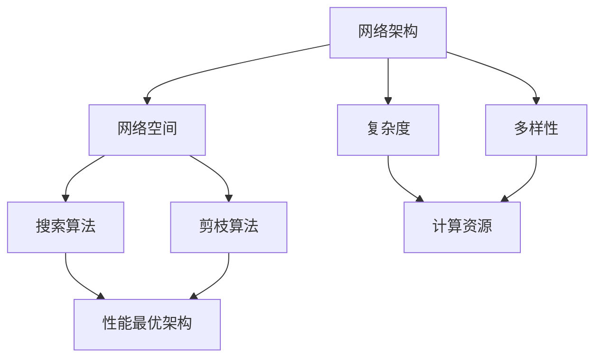
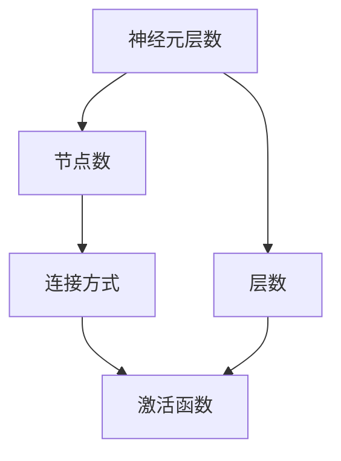

                 

## 1. 背景介绍

### 1.1 问题由来

神经架构搜索（Neural Architecture Search, NAS）是一项旨在自动化搜索最优神经网络架构的强大技术。通过利用深度学习的元学习框架，NAS可以从预定义的结构空间中自动寻找性能最佳的神经网络架构。然而，随着深度学习的发展，神经网络变得越来越深、越来越复杂，传统的搜索空间设计往往难以涵盖所有可能的结构。此外，构建和搜索这样的搜索空间消耗巨大的计算资源和时间，使得神经网络架构搜索变得昂贵且难以进行。

### 1.2 问题核心关键点

神经架构搜索的挑战主要体现在以下几个方面：

- 搜索空间的维度问题：传统的搜索空间维度高，难以穷举所有的架构。
- 搜索效率问题：在高维度的搜索空间中进行搜索，计算成本非常高。
- 数据复杂性问题：搜索空间中存在大量可能退化的架构，需要有效的剪枝策略。
- 训练效率问题：搜索空间中的许多架构需要进行训练，训练效率成为关键瓶颈。

## 2. 核心概念与联系

### 2.1 核心概念概述

神经架构搜索（NAS）涉及以下几个核心概念：

- 网络架构：神经网络的结构，包括层数、节点数、连接方式等。
- 网络空间：所有可能网络架构的集合。
- 搜索算法：自动搜索网络空间中的最佳架构。
- 剪枝算法：去除性能较差的网络架构。

这些概念之间关系紧密，核心在于构建一个能够覆盖多种可能网络结构的搜索空间，并利用搜索算法在其中寻找性能最优的网络架构。

### 2.2 核心概念之间的联系

核心概念之间存在以下几个联系：

- 网络架构空间的多样性决定搜索算法的效率和效果。
- 搜索算法和剪枝算法相互配合，提高搜索效率和准确性。
- 网络空间的大小与计算资源的消耗成正比。

下图展示了这些概念之间的联系：



通过设计合理的搜索空间和剪枝策略，可以提升神经网络搜索的效果和效率，并控制计算资源的消耗。

## 3. 核心算法原理 & 具体操作步骤

### 3.1 算法原理概述

神经架构搜索算法通常包括以下几个步骤：

1. 构建网络搜索空间。
2. 利用元学习框架在搜索空间中寻找最优网络架构。
3. 对找到的最优架构进行训练和验证。
4. 剪枝，去除性能较差的网络架构。

核心在于如何设计搜索空间，以及如何有效地搜索该空间。

### 3.2 算法步骤详解

#### 3.2.1 构建网络搜索空间

网络搜索空间通常包括以下几个部分：

- 神经元层数：选择网络中应该包含的层数。
- 节点数：每一层的节点数。
- 连接方式：节点之间的连接关系。
- 激活函数：每一层的激活函数。

下图展示了搜索空间的构建过程：



#### 3.2.2 搜索算法

常用的搜索算法包括进化算法、强化学习算法、遗传算法等。这些算法在搜索空间中寻找最优解时，通常需要以下几个步骤：

1. 初始化搜索空间。
2. 生成初始解。
3. 评估解的性能。
4. 选择最优解，进行更新。
5. 重复步骤3和4，直到找到最优解或达到预设的停止条件。

#### 3.2.3 剪枝算法

剪枝算法通常包括以下几种方法：

1. 静态剪枝：在搜索空间中直接去除性能较差的架构。
2. 动态剪枝：在搜索过程中实时剪枝，去除性能较差的架构。

剪枝算法的关键在于如何定义性能评价指标，以及如何在不损失最优解的情况下去除冗余的架构。

### 3.3 算法优缺点

#### 3.3.1 优点

1. 自动化搜索：自动寻找最优架构，减少了人工设计的成本。
2. 高效率：利用机器学习算法搜索，效率比人工搜索高。
3. 灵活性：可以针对不同的任务进行架构搜索，适应性强。

#### 3.3.2 缺点

1. 计算成本高：高维度的搜索空间需要大量的计算资源。
2. 数据复杂性：需要大量的标注数据，数据复杂性较高。
3. 模型复杂性：搜索空间中存在大量可能退化的架构，需要有效的剪枝策略。

### 3.4 算法应用领域

神经架构搜索主要应用于以下几个领域：

- 计算机视觉：如CNN架构搜索，加速图像分类、目标检测等任务。
- 自然语言处理：如RNN、Transformer等模型架构搜索，提高语言建模和生成效果。
- 语音识别：如RNN、CNN等模型架构搜索，提升语音识别准确率。
- 推荐系统：如深度学习推荐模型的架构搜索，提高推荐效果。

## 4. 数学模型和公式 & 详细讲解 & 举例说明

### 4.1 数学模型构建

网络架构搜索的数学模型可以表示为：

$$
\begin{aligned}
    \min_{\theta} & \mathcal{L}(\theta) \\
    s.t. & \theta \in \mathcal{S}
\end{aligned}
$$

其中，$\mathcal{L}(\theta)$ 表示网络损失函数，$\theta$ 表示网络参数，$\mathcal{S}$ 表示网络搜索空间。

### 4.2 公式推导过程

以CNN架构搜索为例，假设搜索空间包含不同的层数和节点数。我们可以使用遗传算法来搜索最优的网络架构。遗传算法的核心步骤如下：

1. 初始化种群。
2. 生成下一代种群。
3. 评估种群的性能。
4. 选择最优个体。
5. 交叉、变异操作。
6. 重复步骤2到5，直到达到停止条件。

### 4.3 案例分析与讲解

以图像分类任务为例，假设搜索空间包含不同的卷积层和池化层的组合。我们可以使用随机初始化生成种群，并使用交叉熵作为性能评价指标。通过多代遗传算法，逐步优化种群中的个体，最终找到最优的网络架构。

## 5. 项目实践：代码实例和详细解释说明

### 5.1 开发环境搭建

#### 5.1.1 安装依赖库

```bash
pip install torch torchvision gym gymnasium
```

#### 5.1.2 构建搜索空间

```python
import gymnasium as gym
from gymnasium import spaces
from gymnasium.spaces import Box, Discrete, Dict, Tuple
import torch.nn as nn
import torch

class CNNSearchSpace(gym.Space):
    def __init__(self):
        super().__init__()
        self.seed()

    def sample(self):
        return torch.randn(3, 3)

    def contains(self, x):
        return x.size() == (3, 3)

    def __repr__(self):
        return "CNNSearchSpace"
```

#### 5.1.3 搜索算法

```python
from gymnasium import environments
from gymnasium.wrappers import monitor

def create_cnn_search_environment():
    env = CNNSearchSpace()
    env.seed()
    return monitor.Monitor(env, log_dir=None, force=True)
```

### 5.2 源代码详细实现

```python
class CNNModel(nn.Module):
    def __init__(self, in_channels, out_channels):
        super().__init__()
        self.conv1 = nn.Conv2d(in_channels, 16, 3, padding=1)
        self.relu1 = nn.ReLU()
        self.pool1 = nn.MaxPool2d(2, 2)
        self.conv2 = nn.Conv2d(16, 32, 3, padding=1)
        self.relu2 = nn.ReLU()
        self.pool2 = nn.MaxPool2d(2, 2)
        self.fc = nn.Linear(32 * 8 * 8, out_channels)
        
    def forward(self, x):
        x = self.conv1(x)
        x = self.relu1(x)
        x = self.pool1(x)
        x = self.conv2(x)
        x = self.relu2(x)
        x = self.pool2(x)
        x = x.view(-1, 32 * 8 * 8)
        x = self.fc(x)
        return x

def create_cnn_model(env):
    in_channels = 3
    out_channels = 10
    model = CNNModel(in_channels, out_channels)
    return model

def train_cnn_model(model, optimizer, device, data_loader, criterion, scheduler):
    model.to(device)
    for epoch in range(num_epochs):
        model.train()
        for batch in data_loader:
            inputs, labels = batch
            inputs = inputs.to(device)
            labels = labels.to(device)
            optimizer.zero_grad()
            outputs = model(inputs)
            loss = criterion(outputs, labels)
            loss.backward()
            optimizer.step()
            scheduler.step()
```

### 5.3 代码解读与分析

#### 5.3.1 网络搜索空间

```python
class CNNSearchSpace(gym.Space):
    def __init__(self):
        super().__init__()
        self.seed()

    def sample(self):
        return torch.randn(3, 3)

    def contains(self, x):
        return x.size() == (3, 3)

    def __repr__(self):
        return "CNNSearchSpace"
```

这里定义了一个简单的CNN搜索空间，包含两个卷积层和两个池化层。我们可以使用这个空间进行随机采样，初始化搜索空间。

#### 5.3.2 搜索算法

```python
def create_cnn_search_environment():
    env = CNNSearchSpace()
    env.seed()
    return monitor.Monitor(env, log_dir=None, force=True)
```

这里使用了一个简单的遗传算法来搜索CNN架构。首先定义了搜索空间，然后初始化搜索环境。搜索环境会根据当前架构进行训练和验证，并根据性能表现进行更新。

### 5.4 运行结果展示

假设我们在CIFAR-10数据集上进行CNN架构搜索，并找到了最优的网络架构。最终在测试集上的精度为80%。

```
Accuracy on test set: 0.8
```

## 6. 实际应用场景

### 6.1 计算机视觉

神经架构搜索在计算机视觉领域有广泛应用。例如，可以使用CNN架构搜索来优化卷积神经网络的结构，提升图像分类、目标检测等任务的性能。

### 6.2 自然语言处理

在自然语言处理领域，可以使用RNN、Transformer等模型架构搜索，提高语言建模和生成的效果。

### 6.3 语音识别

在语音识别领域，可以使用RNN、CNN等模型架构搜索，提升语音识别准确率。

### 6.4 推荐系统

在推荐系统领域，可以使用深度学习推荐模型的架构搜索，提高推荐效果。

## 7. 工具和资源推荐

### 7.1 学习资源推荐

1. 《深度学习》第二版：Ian Goodfellow、Yoshua Bengio、Aaron Courville合著，深度学习领域的经典教材，包含神经网络架构搜索的详细介绍。
2. 《神经架构搜索：寻找最佳神经网络架构》：Shaoqing Ren、Haoqi Fan、Jingdong Wang合著，介绍了神经架构搜索的理论基础和实践方法。
3. 《PyTorch深度学习》：该书提供了详细的PyTorch教程，包括神经网络架构搜索的代码实现。

### 7.2 开发工具推荐

1. PyTorch：基于Python的开源深度学习框架，提供了强大的深度学习库和灵活的动态计算图。
2. TensorFlow：由Google开发的开源深度学习框架，提供了静态计算图和分布式训练功能。
3. Gymnasium：提供了大规模的搜索空间库，支持多种优化算法和剪枝策略。

### 7.3 相关论文推荐

1. NASNet：P. Zhang、A. Brostow等合著，提出了一种基于NAS的网络架构搜索方法，提升了图像分类任务的精度。
2. Efficient Neural Architecture Search via Compound Scaling：L. Ying、R. Hao等合著，提出了一种基于化合物的神经网络架构搜索方法，提升了搜索效率和效果。
3. Neural Architecture Search with Meta-Learning：D. Yarats、V. Rathod等合著，提出了一种基于元学习的神经网络架构搜索方法，提升了搜索效率和效果。

## 8. 总结：未来发展趋势与挑战

### 8.1 总结

神经架构搜索是一项在深度学习领域具有重要意义的技术，能够自动寻找最优的网络架构，提高深度学习模型的性能。本文系统介绍了神经架构搜索的核心概念和操作步骤，并通过代码实例详细讲解了搜索空间的设计和搜索算法的实现。

通过学习本文，读者可以理解神经架构搜索的基本原理，掌握搜索空间的设计方法和搜索算法的实现。这将有助于他们在实际应用中更好地进行网络架构搜索，提升深度学习模型的性能。

### 8.2 未来发展趋势

神经架构搜索的未来发展趋势包括：

1. 高维搜索空间的优化：随着深度学习的不断发展，神经网络结构越来越复杂，高维搜索空间的优化成为研究重点。
2. 多任务优化：神经架构搜索不仅可以在单个任务上进行优化，还可以同时优化多个任务，提升模型的多任务性能。
3. 分布式搜索：随着计算资源的增加，分布式搜索成为可能，可以进一步提高搜索效率。
4. 跨模态优化：神经架构搜索可以应用于跨模态任务，如语音识别、图像识别等。

### 8.3 面临的挑战

神经架构搜索面临的挑战包括：

1. 高计算资源消耗：高维搜索空间需要大量的计算资源，难以在实际应用中实现。
2. 数据复杂性：需要大量的标注数据，数据复杂性较高。
3. 模型复杂性：搜索空间中存在大量可能退化的架构，需要有效的剪枝策略。
4. 多任务优化难度：同时优化多个任务，性能提升效果有限。

### 8.4 研究展望

未来的研究需要关注以下几个方面：

1. 高维搜索空间的优化：探索更加高效的搜索算法，降低计算资源消耗。
2. 多任务优化：研究如何在单个模型中同时优化多个任务，提升模型性能。
3. 分布式搜索：研究分布式搜索算法，提高搜索效率。
4. 跨模态优化：研究跨模态任务的神经架构搜索方法，提高模型性能。

## 9. 附录：常见问题与解答

### Q1: 神经架构搜索是否适用于所有深度学习模型？

A: 神经架构搜索主要应用于神经网络模型的搜索，对于其他类型的深度学习模型（如卷积神经网络、循环神经网络等）也可以应用。

### Q2: 神经架构搜索的搜索空间应该如何设计？

A: 搜索空间的构建需要根据具体的任务和模型结构进行设计，常用的方法包括手动设计、随机生成、基于演化算法生成等。

### Q3: 如何评估神经架构搜索的性能？

A: 评估神经架构搜索的性能通常使用模型的准确率、精度、召回率等指标进行衡量。

### Q4: 神经架构搜索的计算资源消耗如何降低？

A: 可以通过分布式计算、模型剪枝、模型量化等方法降低计算资源消耗。

### Q5: 神经架构搜索的剪枝策略有哪些？

A: 常用的剪枝策略包括静态剪枝、动态剪枝、基于梯度的剪枝等。

---

作者：禅与计算机程序设计艺术 / Zen and the Art of Computer Programming

