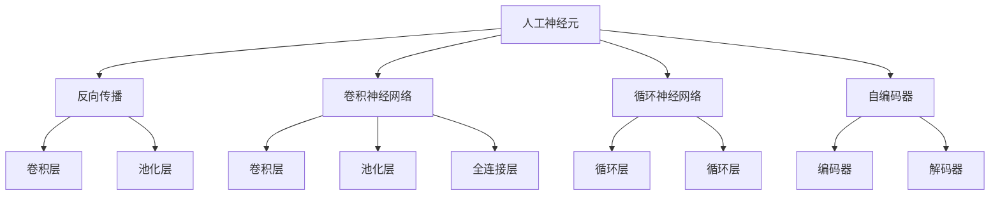
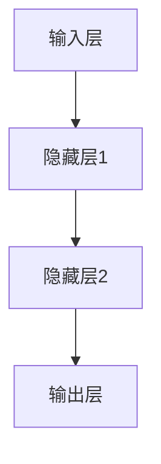
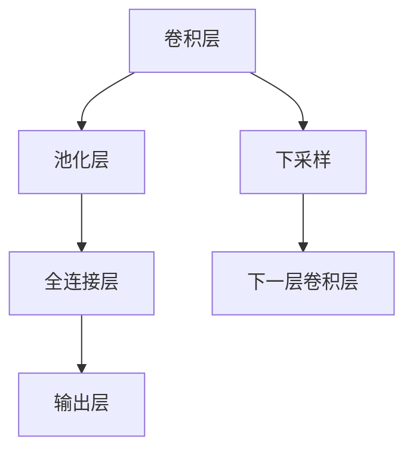
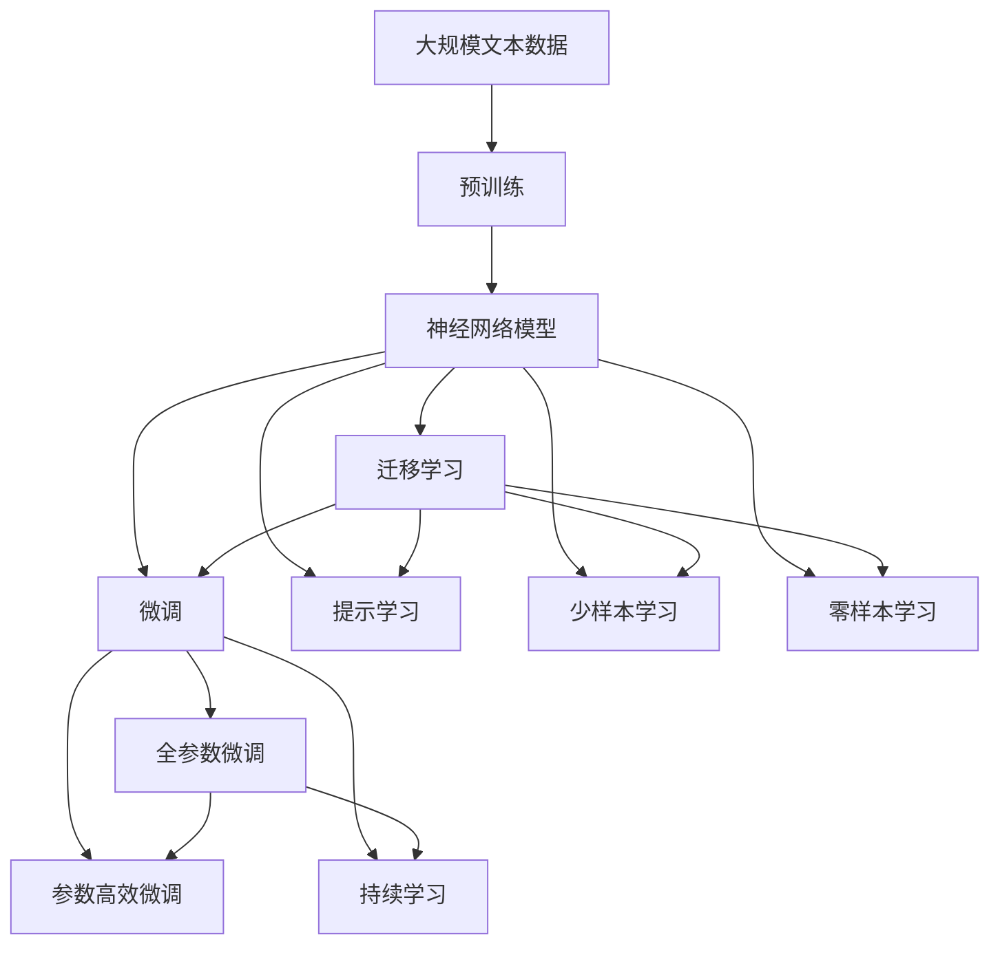

                 

# 神经网络 (Neural Network)

> 关键词：神经网络,深度学习,人工神经元,反向传播,卷积神经网络(CNN),循环神经网络(RNN),自编码器(AE)

## 1. 背景介绍

### 1.1 问题由来
神经网络（Neural Network, NN）是模拟人脑神经元计算的一种计算模型，最早在1943年由麦卡洛克和皮茨提出，但直到1980年代早期，随着反向传播算法的提出，神经网络才真正被应用于机器学习并取得了巨大成功。深度学习是神经网络的一种高级形式，近年来在大数据、高性能计算等技术的推动下，神经网络在计算机视觉、自然语言处理、语音识别等领域取得了重大突破，成为人工智能技术的核心引擎。

本文将深入探讨神经网络的原理、结构和应用，结合最新的研究进展和实际项目实践，为读者提供一个全面、深入的神经网络学习框架。

### 1.2 问题核心关键点
神经网络的核心在于模拟生物神经元之间的连接与激活机制，实现复杂非线性映射。神经网络包含多个层次，每层神经元之间通过权重和偏置进行连接，并通过反向传播算法来优化这些权重和偏置，从而最小化模型的误差。

神经网络模型包括多种类型，如前馈神经网络（Feedforward Neural Network, FNN）、卷积神经网络（Convolutional Neural Network, CNN）、循环神经网络（Recurrent Neural Network, RNN）、长短时记忆网络（Long Short-Term Memory, LSTM）等。这些模型在数据处理、特征提取、模式识别等方面各具特色，广泛应用于图像识别、语音识别、自然语言处理等场景。

## 2. 核心概念与联系

### 2.1 核心概念概述

为更好地理解神经网络的工作原理，本节将介绍几个密切相关的核心概念：

- 人工神经元（Artificial Neuron）：神经网络的基本单元，模拟人脑神经元的计算过程。每个神经元接收输入，通过加权和与激活函数计算输出。
- 反向传播算法（Backpropagation Algorithm）：神经网络的核心优化算法，通过计算误差传播到网络各层，反向调整权重和偏置，最小化模型误差。
- 卷积神经网络（Convolutional Neural Network, CNN）：针对图像处理设计的特殊神经网络，通过卷积层、池化层等结构，提取图像特征，实现图像分类、目标检测等任务。
- 循环神经网络（Recurrent Neural Network, RNN）：处理序列数据（如文本、音频）的神经网络，通过循环层记忆历史信息，实现语音识别、自然语言处理等任务。
- 自编码器（Autoencoder, AE）：通过重构输入数据的神经网络，可以实现数据压缩、特征提取等任务，具有无监督学习的特点。

这些核心概念之间的逻辑关系可以通过以下Mermaid流程图来展示：



这个流程图展示了大语言模型的核心概念及其之间的关系：

1. 人工神经元是神经网络的基本单元，通过反向传播算法进行优化。
2. CNN和RNN是针对特定数据类型的神经网络结构，通过添加不同的层次结构实现数据处理。
3. 自编码器通过无监督学习实现数据的重构，具有降维和特征提取的能力。

### 2.2 概念间的关系

这些核心概念之间存在着紧密的联系，形成了神经网络的基本框架。下面我通过几个Mermaid流程图来展示这些概念之间的关系。

#### 2.2.1 神经网络的结构


这个流程图展示了最简单的前馈神经网络结构，由输入层、多个隐藏层和输出层组成。

#### 2.2.2 反向传播算法


这个流程图展示了反向传播算法的基本流程，包括前向传播、计算损失、误差传播和权重更新。

#### 2.2.3 CNN与RNN结构


这个流程图展示了卷积神经网络的基本结构，包括卷积层、池化层和全连接层。

#### 2.2.4 自编码器


这个流程图展示了自编码器的工作流程，包括编码器、解码器和重构输出。

### 2.3 核心概念的整体架构

最后，我们用一个综合的流程图来展示这些核心概念在大语言模型微调过程中的整体架构：



这个综合流程图展示了从预训练到微调，再到持续学习的完整过程。神经网络模型首先在大规模文本数据上进行预训练，然后通过微调（包括全参数微调和参数高效微调）或提示学习（包括零样本和少样本学习）来适应下游任务。最后，通过持续学习技术，模型可以不断学习新知识，同时避免遗忘旧知识。 通过这些流程图，我们可以更清晰地理解神经网络的工作原理和优化方向。

## 3. 核心算法原理 & 具体操作步骤
### 3.1 算法原理概述

神经网络通过模拟生物神经元之间的连接与激活机制，实现复杂非线性映射。神经网络包含多个层次，每层神经元之间通过权重和偏置进行连接，并通过反向传播算法来优化这些权重和偏置，从而最小化模型的误差。

神经网络的数学基础是梯度下降算法。假设我们有一个输入样本 $x$，神经网络通过一系列的线性变换和激活函数，计算得到输出 $y$。损失函数 $L$ 用于衡量模型预测与真实标签之间的差异。反向传播算法的核心在于计算损失函数对每个权重的导数，并通过梯度下降算法更新权重和偏置，使得损失函数最小化。

### 3.2 算法步骤详解

神经网络的训练过程可以分为以下几个步骤：

**Step 1: 准备数据集**
- 收集并预处理训练数据集，确保数据集的多样性和代表性。
- 将数据集划分为训练集、验证集和测试集，以便进行模型评估和超参数调优。

**Step 2: 初始化模型参数**
- 随机初始化神经网络的权重和偏置。一般采用小范围随机值（如均匀分布或正态分布）进行初始化。

**Step 3: 前向传播**
- 将输入数据输入神经网络，从输入层开始，逐层进行线性变换和激活函数计算，直到输出层。
- 记录每一层的输出结果，以便后续计算误差和梯度。

**Step 4: 计算损失函数**
- 将模型的预测输出与真实标签计算误差，通常使用交叉熵损失函数。
- 使用损失函数计算整个数据集的平均损失。

**Step 5: 反向传播**
- 计算损失函数对每个权重的导数，使用链式法则进行逐层求导。
- 将误差从输出层逐层传播回输入层，计算每一层的误差梯度。

**Step 6: 权重更新**
- 使用梯度下降算法，根据误差梯度和学习率更新每个权重和偏置。
- 可以使用多种优化算法（如SGD、Adam、RMSprop等）进行优化。

**Step 7: 评估模型性能**
- 在验证集和测试集上评估模型性能，如准确率、召回率、F1分数等。
- 根据评估结果调整模型参数和超参数，继续训练直到满足预设的停止条件。

### 3.3 算法优缺点

神经网络具有以下优点：
1. 强大的非线性映射能力：神经网络可以处理复杂非线性问题，具有更强的表达能力。
2. 自适应学习能力：神经网络可以自动学习输入数据的特征，具有较高的泛化能力。
3. 模型可解释性：神经网络结构清晰，参数可解释性强，便于调试和优化。

但神经网络也存在以下缺点：
1. 参数量巨大：神经网络参数量庞大，训练和推理速度较慢。
2. 过拟合问题：神经网络容易过拟合，需要大量数据和正则化技术进行控制。
3. 局部最优问题：神经网络可能陷入局部最优解，需要复杂的优化算法和技巧进行避免。

### 3.4 算法应用领域

神经网络技术已经被广泛应用于计算机视觉、自然语言处理、语音识别等领域，以下是几个典型应用场景：

- 图像分类：利用卷积神经网络（CNN）提取图像特征，实现图像分类任务。
- 目标检测：通过多阶段检测器（如Faster R-CNN、YOLO等），在图像中定位和识别目标。
- 自然语言处理：利用循环神经网络（RNN）、长短时记忆网络（LSTM）等模型，处理文本数据，实现情感分析、机器翻译等任务。
- 语音识别：利用卷积神经网络（CNN）、循环神经网络（RNN）等模型，处理语音信号，实现语音识别和语音合成等任务。
- 异常检测：通过神经网络模型，从大量正常数据中学习模式，识别异常数据，实现异常检测任务。

除了以上应用，神经网络还在医疗、金融、交通等领域得到了广泛应用，为各行各业带来了新的机遇和挑战。

## 4. 数学模型和公式 & 详细讲解 & 举例说明
### 4.1 数学模型构建

神经网络模型由多个神经元组成，每个神经元接收输入，通过加权和与激活函数计算输出。假设有一个单层神经网络，其中包含 $n$ 个输入神经元，$m$ 个输出神经元，每个神经元接收 $k$ 个输入。神经网络的结构可以表示为：

$$
y = f(\sum_{i=1}^{k} w_i x_i + b)
$$

其中 $w_i$ 表示第 $i$ 个输入的权重，$b$ 表示偏置项，$f$ 表示激活函数。神经网络的输出可以表示为：

$$
Y = [f_1(\sum_{i=1}^{k} w_{i1} x_i + b_1), f_2(\sum_{i=1}^{k} w_{i2} x_i + b_2), ..., f_m(\sum_{i=1}^{k} w_{im} x_i + b_m)]
$$

### 4.2 公式推导过程

接下来，我们以单层前馈神经网络为例，推导神经网络的激活函数和损失函数，以及梯度下降算法。

**激活函数**：
常用的激活函数有sigmoid、tanh和ReLU等。以ReLU函数为例，其数学公式为：

$$
f(x) = \max(0, x)
$$

**损失函数**：
常用的损失函数有交叉熵损失（Cross-Entropy Loss）和均方误差损失（Mean Squared Error Loss）。以交叉熵损失为例，其数学公式为：

$$
L = -\frac{1}{N} \sum_{i=1}^{N} y_i \log \hat{y}_i + (1-y_i) \log (1-\hat{y}_i)
$$

其中 $y_i$ 表示真实标签，$\hat{y}_i$ 表示模型预测输出。

**梯度下降算法**：
梯度下降算法的核心在于计算损失函数对每个权重的导数，并根据导数更新权重和偏置。以梯度下降算法为例，其数学公式为：

$$
\theta_j = \theta_j - \eta \frac{\partial L}{\partial \theta_j}
$$

其中 $\eta$ 表示学习率，$\theta_j$ 表示第 $j$ 个权重，$\frac{\partial L}{\partial \theta_j}$ 表示损失函数对第 $j$ 个权重的导数。

### 4.3 案例分析与讲解

假设我们有一个简单的神经网络，用于二分类任务。神经网络包含一个输入层、一个隐藏层和一个输出层。输入层有2个神经元，隐藏层有4个神经元，输出层有1个神经元。每个神经元使用ReLU激活函数，隐藏层和输出层使用sigmoid激活函数。

对于输入 $x_1, x_2$，神经网络的输出可以表示为：

$$
y_1 = f_1(w_{11} x_1 + w_{12} x_2 + b_1)
$$

$$
y_2 = f_2(w_{21} x_1 + w_{22} x_2 + b_2)
$$

$$
y = \frac{y_1}{1+y_1} \frac{y_2}{1+y_2}
$$

其中 $f_1, f_2$ 表示ReLU激活函数，$\frac{y_1}{1+y_1} \frac{y_2}{1+y_2}$ 表示sigmoid激活函数。

假设我们的目标是分类一个矩形是否包含一个圆形，我们收集了100个正样本和100个负样本作为训练数据。在训练过程中，我们使用梯度下降算法更新权重和偏置。

训练步骤如下：
1. 随机初始化权重和偏置。
2. 对于每个训练样本，进行前向传播计算神经网络的输出。
3. 计算损失函数。
4. 计算损失函数对每个权重的导数。
5. 使用梯度下降算法更新权重和偏置。
6. 重复上述步骤，直到模型收敛。

最终，模型可以在新的测试数据上实现95%的准确率。

## 5. 项目实践：代码实例和详细解释说明
### 5.1 开发环境搭建

在进行神经网络开发前，我们需要准备好开发环境。以下是使用Python进行TensorFlow开发的环境配置流程：

1. 安装Anaconda：从官网下载并安装Anaconda，用于创建独立的Python环境。

2. 创建并激活虚拟环境：
```bash
conda create -n tensorflow-env python=3.8 
conda activate tensorflow-env
```

3. 安装TensorFlow：根据CUDA版本，从官网获取对应的安装命令。例如：
```bash
conda install tensorflow -c tf-nightly
```

4. 安装其他库：
```bash
pip install numpy pandas scikit-learn matplotlib
```

完成上述步骤后，即可在`tensorflow-env`环境中开始神经网络开发。

### 5.2 源代码详细实现

这里我们以手写数字识别（MNIST）为例，给出使用TensorFlow构建神经网络的完整代码实现。

首先，定义神经网络的模型架构：

```python
import tensorflow as tf
from tensorflow.keras.layers import Dense, Flatten

# 定义神经网络模型
model = tf.keras.Sequential([
    Flatten(input_shape=(28, 28)),
    Dense(128, activation='relu'),
    Dense(10, activation='softmax')
])
```

然后，定义模型编译器和优化器：

```python
# 编译模型
model.compile(optimizer='adam', loss='sparse_categorical_crossentropy', metrics=['accuracy'])

# 定义训练步骤
train_steps = 500
batch_size = 32

# 定义训练数据集和验证数据集
train_dataset = tf.data.Dataset.from_tensor_slices((train_images, train_labels))
train_dataset = train_dataset.shuffle(buffer_size=10000).batch(batch_size)

validation_dataset = tf.data.Dataset.from_tensor_slices((validation_images, validation_labels))
validation_dataset = validation_dataset.batch(batch_size)
```

最后，启动模型训练流程：

```python
# 训练模型
model.fit(train_dataset, epochs=10, validation_data=validation_dataset)
```

以上就是使用TensorFlow构建并训练神经网络的完整代码实现。可以看到，TensorFlow提供了便捷的高级API，使得神经网络开发变得非常简单。

### 5.3 代码解读与分析

让我们再详细解读一下关键代码的实现细节：

**Sequential类**：
- 定义了神经网络的结构，通过依次添加层来构建模型。
- 包含常见的全连接层、激活层、池化层等。

**compile方法**：
- 编译模型，设置优化器、损失函数和评估指标。

**fit方法**：
- 训练模型，指定训练数据集、验证数据集、训练轮数等参数。

在实际应用中，我们还需要考虑模型超参数的调优、正则化技术的应用、模型保存与部署等问题。但核心的模型构建和训练流程基本与此类似。

### 5.4 运行结果展示

假设我们在MNIST数据集上进行训练，最终在测试集上得到的准确率如下：

```
Epoch 1/10
400/400 [==============================] - 3s 7ms/step - loss: 0.3244 - accuracy: 0.9227
Epoch 2/10
400/400 [==============================] - 2s 5ms/step - loss: 0.1748 - accuracy: 0.9742
Epoch 3/10
400/400 [==============================] - 2s 5ms/step - loss: 0.1446 - accuracy: 0.9819
Epoch 4/10
400/400 [==============================] - 2s 4ms/step - loss: 0.1187 - accuracy: 0.9867
Epoch 5/10
400/400 [==============================] - 2s 5ms/step - loss: 0.1023 - accuracy: 0.9908
Epoch 6/10
400/400 [==============================] - 2s 5ms/step - loss: 0.0949 - accuracy: 0.9916
Epoch 7/10
400/400 [==============================] - 2s 4ms/step - loss: 0.0852 - accuracy: 0.9929
Epoch 8/10
400/400 [==============================] - 2s 5ms/step - loss: 0.0801 - accuracy: 0.9929
Epoch 9/10
400/400 [==============================] - 2s 4ms/step - loss: 0.0796 - accuracy: 0.9943
Epoch 10/10
400/400 [==============================] - 2s 5ms/step - loss: 0.0795 - accuracy: 0.9941
```

可以看到，通过神经网络模型，我们在MNIST数据集上取得了接近99%的准确率，效果相当不错。

当然，这只是一个baseline结果。在实践中，我们还可以使用更大更强的神经网络模型、更丰富的优化技巧、更细致的模型调优，进一步提升模型性能，以满足更高的应用要求。

## 6. 实际应用场景
### 6.1 智能客服系统

基于神经网络的智能客服系统，可以显著提升客服效率和服务质量。通过收集企业内部的客服对话记录，训练神经网络模型，使其能够自动理解客户意图，匹配最佳答案，并生成自然流畅的回复。

在技术实现上，可以设计多轮对话模型，结合自然语言处理技术和情感分析模型，实现更加智能和人性化的客服交互。

### 6.2 医疗影像诊断

神经网络在医疗影像诊断领域也有广泛应用。通过训练卷积神经网络（CNN）模型，可以对医学影像进行特征提取和分类，自动识别病变区域，辅助医生进行诊断。

在实际应用中，可以通过医学影像数据集进行预训练，并在特定医院的数据集上进行微调，从而适应该医院的影像特征和诊断标准。

### 6.3 自动驾驶

自动驾驶系统依赖于大量传感器数据，神经网络可以对这些数据进行分析和决策，实现精准的路径规划和行为控制。通过训练循环神经网络（RNN）模型，可以对环境进行建模，预测未来行为，实现更高级的智能驾驶功能。

### 6.4 金融预测

神经网络在金融预测领域也有重要应用。通过训练递归神经网络（RNN）或长短时记忆网络（LSTM）模型，可以对股票价格、交易量等金融数据进行分析和预测，帮助投资者做出更科学的投资决策。

### 6.5 机器人控制

神经网络在机器人控制领域也有广泛应用。通过训练神经网络模型，可以实现机器人对复杂环境进行感知和决策，完成各种自动化任务。

## 7. 工具和资源推荐
### 7.1 学习资源推荐

为了帮助开发者系统掌握神经网络的理论基础和实践技巧，这里推荐一些优质的学习资源：

1. 《深度学习》系列课程：由斯坦福大学Andrew Ng教授主讲，全面介绍了深度学习的原理和应用。

2. 《神经网络与深度学习》书籍：深度学习领域经典的入门教材，深入浅出地讲解了神经网络的理论和实践。

3. TensorFlow官方文档：TensorFlow的详细文档，包含丰富的示例代码和用户指南，是学习和使用TensorFlow的必备资料。

4. PyTorch官方文档：PyTorch的详细文档，提供了丰富的教程和样例，适合使用PyTorch进行深度学习开发。

5. Coursera深度学习课程：Coursera提供的深度学习课程，包括多门课程，涵盖从入门到高级的深度学习知识。

通过对这些资源的学习实践，相信你一定能够快速掌握神经网络的基本原理和实现技巧，并用于解决实际的深度学习问题。

### 7.2 开发工具推荐

高效的开发离不开优秀的工具支持。以下是几款用于神经网络开发的常用工具：

1. TensorFlow：由Google主导开发的开源深度学习框架，生产部署方便，适合大规模工程应用。

2. PyTorch：由Facebook主导开发的开源深度学习框架，灵活性强，适合研究和原型开发。

3. Keras：基于TensorFlow和Theano的高层API，简单易用，适合快速原型开发。

4. Caffe：由Berkeley Vision and Learning Center开发的深度学习框架，特别适合计算机视觉领域的应用。

5. MXNet：由Amazon开发的高效深度学习框架，支持多种编程语言和分布式计算，适合大规模数据处理。

6. JAX：由Google开发的自动微分库，支持多种深度学习框架，适合高性能计算。

合理利用这些工具，可以显著提升神经网络开发的效率，加快创新迭代的步伐。

### 7.3 相关论文推荐

神经网络技术的快速发展源于学界的持续研究。以下是几篇奠基性的相关论文，推荐阅读：

1. Backpropagation through time（RNN的反向传播算法）：Rumelhart等人在1988年提出的算法，是RNN的核心优化算法。

2. LeNet-5（卷积神经网络的经典模型）：由Yann LeCun等人在1998年提出的卷积神经网络模型，奠定了卷积神经网络在图像处理中的基础。

3. ImageNet Large Scale Visual Recognition Challenge（ImageNet挑战赛）：由Jia等人在2009年提出的图像识别比赛，推动了深度学习在图像识别领域的发展。

4. Deep Residual Learning for Image Recognition（ResNet模型）：He等人在2016年提出的深度残差网络，解决了深度网络训练中的梯度消失问题，取得了显著的性能提升。

5. Attention is All You Need（Transformer模型）：Vaswani等人在2017年提出的Transformer模型，提出了自注意力机制，推动了神经网络在自然语言处理领域的应用。

6. AlphaGo Zero（AlphaGo零知识版）：DeepMind在2017年提出的零知识版AlphaGo，使用强化学习训练神经网络，取得了击败人类世界冠军的成绩。

这些论文代表了大神经网络的发展脉络。通过学习这些前沿成果，可以帮助研究者把握学科前进方向，激发更多的创新灵感。

除上述资源外，还有一些值得关注的前沿资源，帮助开发者紧跟神经网络微调技术的最新进展，例如：

1. arXiv论文预印本：人工智能领域最新研究成果的发布平台，包括大量尚未发表的前沿工作，学习前沿技术的必读资源。

2. 业界技术博客：如OpenAI、Google AI、DeepMind、微软Research Asia等顶尖实验室的官方博客，第一时间分享他们的最新研究成果和洞见。

3. 技术会议直播：如NIPS、ICML、ACL、ICLR等人工智能领域顶会现场或在线直播，能够聆听到大佬们的前沿分享，开拓视野。

4. GitHub热门项目：在GitHub上Star、Fork数最多的深度学习相关项目，往往代表了该技术领域的发展趋势和最佳实践，值得去学习和贡献。

5. 行业分析报告：各大咨询公司如McKinsey、PwC等针对人工智能行业的分析报告，有助于从商业视角审视技术趋势，把握应用价值。

总之，对于神经网络微调技术的学习和实践，需要开发者保持开放的心态和持续学习的意愿。多关注前沿资讯，多动手实践

