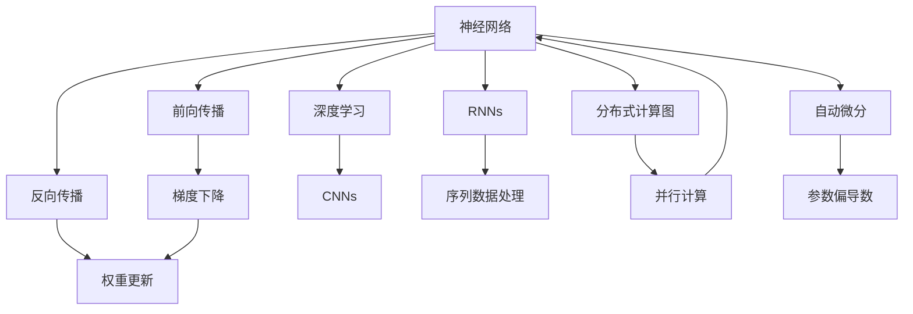
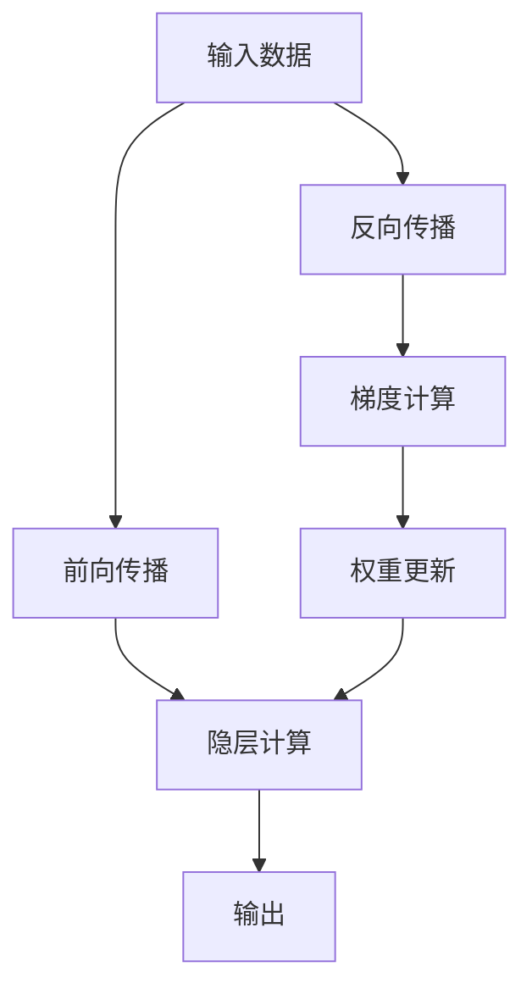
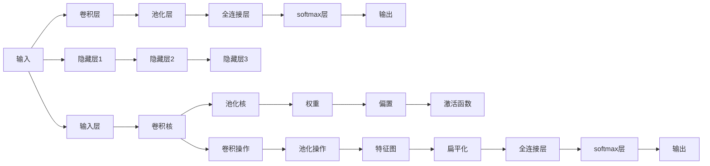
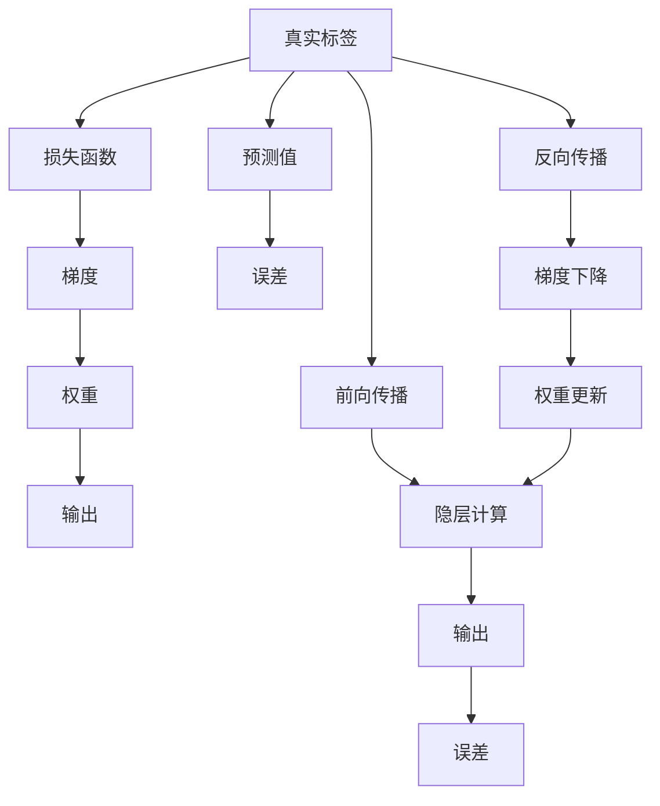
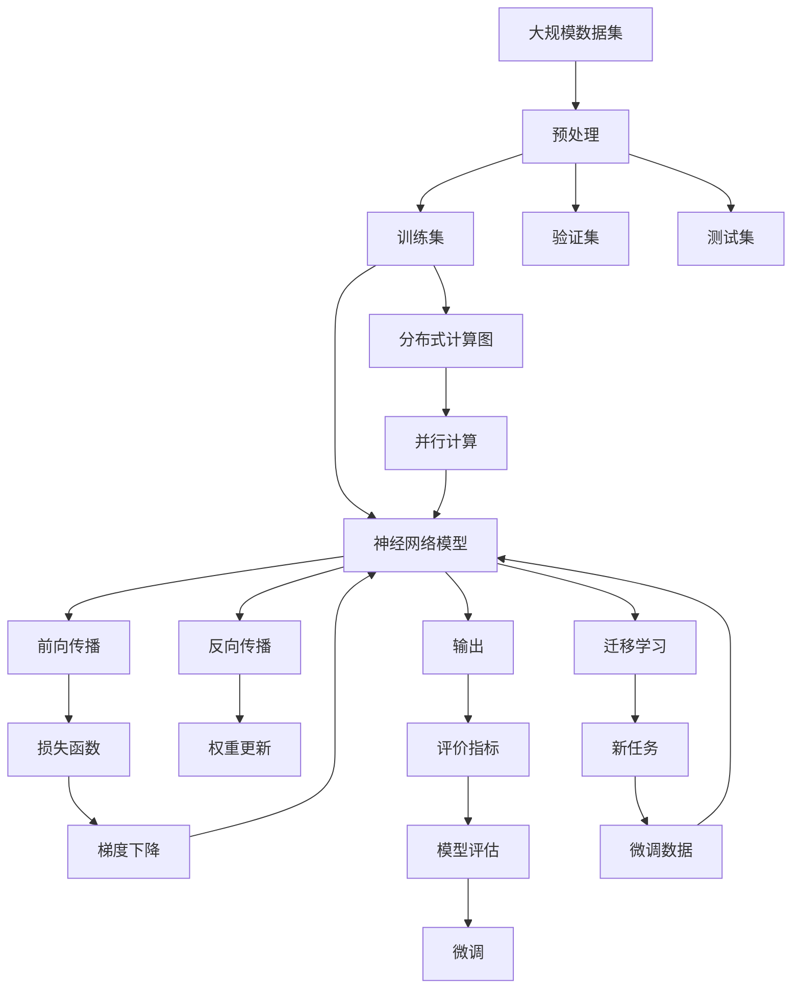

                 

# 神经网络：人工智能的基石

> 关键词：神经网络,人工智能,机器学习,深度学习,计算图,反向传播,前向传播,梯度下降,卷积神经网络,循环神经网络

## 1. 背景介绍

### 1.1 问题由来
人工智能（AI）作为当今科技前沿，其核心技术之一便是神经网络（Neural Networks, NNs）。自上世纪70年代以来，神经网络经过数十年发展，已成为解决复杂模式识别、数据分析、图像识别、自然语言处理、语音识别等任务的关键工具。无论是在学术研究还是产业应用中，神经网络都展现出强大的生命力和广阔的应用前景。

在人工智能领域，神经网络以其独特的优势，成为诸多前沿技术的基石。从图像分类到语音识别，从自然语言处理到推荐系统，神经网络无处不在，成为连接人类与机器世界的桥梁。

### 1.2 问题核心关键点
神经网络在AI中扮演着关键角色，其核心在于模拟人类大脑神经元之间的连接和交互，通过大量数据训练形成复杂非线性关系。神经网络的核心理论包括前向传播、反向传播、梯度下降等，它们共同构建了神经网络的计算框架。

神经网络的核心原理在于以下几方面：
- 前向传播：将输入数据通过一系列计算节点进行加权处理，最终输出结果。
- 反向传播：通过计算输出误差，反向更新各节点的权重，以最小化误差。
- 梯度下降：根据误差梯度，不断迭代调整权重，逐步逼近最优解。

以上原理使得神经网络能够从大量数据中学习到复杂的模式和特征，从而解决各种人工智能任务。

### 1.3 问题研究意义
深入研究神经网络的原理和应用，对于推动人工智能技术的发展、提高数据处理和分析的准确性、提升智能系统的智能水平具有重要意义：

1. 提供数据驱动的智能解决方案。神经网络通过学习大量数据，能够发现其中的规律和模式，为复杂任务提供智能处理方案。
2. 推动AI技术创新。神经网络的发展催生了深度学习、卷积神经网络、循环神经网络等新技术，推动了AI技术的不断进步。
3. 提高数据处理效率。神经网络能够并行处理大量数据，显著提升数据处理速度。
4. 增强智能系统适应性。通过学习新数据，神经网络能够持续优化自身，提升智能系统在动态环境下的适应性。
5. 拓展AI应用边界。神经网络在图像识别、语音识别、自然语言处理等领域的应用，为AI技术开拓了新的应用场景。

## 2. 核心概念与联系

### 2.1 核心概念概述

为更好地理解神经网络的核心概念及其应用，本节将介绍几个关键概念：

- 神经网络（Neural Networks, NNs）：基于人工神经元模拟人脑神经元连接的计算模型。通过大量的参数和复杂的非线性变换，神经网络能够学习数据的复杂模式。
- 反向传播（Backpropagation）：一种用于训练神经网络的技术，通过计算误差反向传播，优化神经网络的权重。
- 前向传播（Forward Propagation）：将输入数据通过网络进行计算，得到最终输出结果的过程。
- 梯度下降（Gradient Descent）：一种优化算法，通过不断迭代调整参数，使损失函数最小化。
- 深度学习（Deep Learning）：一种基于多层神经网络的机器学习技术，通过不断叠加隐层，提高模型的复杂度和表示能力。
- 卷积神经网络（Convolutional Neural Networks, CNNs）：一种广泛应用于图像识别任务的神经网络，通过卷积操作提取图像特征。
- 循环神经网络（Recurrent Neural Networks, RNNs）：一种应用于序列数据处理的神经网络，通过循环连接捕捉序列依赖。
- 分布式计算图（Distributed Computational Graphs）：一种用于加速神经网络计算的技术，通过将计算图分布到多个GPU或TPU上，提高计算效率。
- 自动微分（Automatic Differentiation）：一种自动计算神经网络梯度的技术，通过链式法则自动计算各参数的偏导数。

这些核心概念之间存在着紧密的联系，形成了神经网络的技术生态系统。下面通过一个简单的Mermaid流程图来展示这些概念之间的关系：



这个流程图展示了神经网络及其关键技术之间的关系：

1. 神经网络通过反向传播和梯度下降进行参数优化。
2. 前向传播和反向传播构成了神经网络的计算框架。
3. 深度学习、CNNs、RNNs等都是基于神经网络的变种形式。
4. 分布式计算图和自动微分技术提高了神经网络的计算效率。

### 2.2 概念间的关系

这些核心概念之间存在着复杂的互动关系，共同构成了神经网络的技术体系。下面通过几个Mermaid流程图来展示这些概念间的具体关系。

#### 2.2.1 神经网络计算流程



这个流程图展示了神经网络的计算流程：输入数据通过前向传播进行计算，得到输出结果。反向传播计算误差梯度，通过梯度下降优化权重，最终更新隐层计算。

#### 2.2.2 深度学习网络结构



这个流程图展示了深度学习网络的结构。输入数据通过多个卷积层和全连接层，最终输出结果。其中卷积层和池化层提取特征，全连接层进行分类或回归。

#### 2.2.3 反向传播算法流程



这个流程图展示了反向传播算法的过程：真实标签通过损失函数计算误差梯度，反向传播更新权重，最终输出预测值和误差。

### 2.3 核心概念的整体架构

最后，我们用一个综合的流程图来展示这些核心概念在大规模神经网络中的整体架构：



这个综合流程图展示了从数据预处理到模型微调的整体流程。大规模数据集经过预处理，分为训练集、验证集和测试集，用于模型的训练、验证和测试。神经网络模型通过前向传播和反向传播进行计算，最小化损失函数，更新权重。分布式计算图提高计算效率，微调和新任务学习提升模型适应性。最终通过评价指标评估模型性能。

## 3. 核心算法原理 & 具体操作步骤
### 3.1 算法原理概述

神经网络的训练过程主要是通过反向传播和梯度下降算法实现的。具体来说，神经网络通过前向传播将输入数据转化为输出，通过损失函数计算误差，然后通过反向传播算法计算误差梯度，最终通过梯度下降算法更新网络权重。以下将详细解释这一过程。

### 3.2 算法步骤详解

神经网络的训练过程主要包括以下几个关键步骤：

**Step 1: 数据预处理**

- 数据清洗：去除噪声数据、处理缺失值、标准化数据等。
- 数据划分：将数据划分为训练集、验证集和测试集。

**Step 2: 初始化网络参数**

- 随机初始化：对神经网络的权重和偏置进行随机初始化。
- 归一化初始化：对权重进行归一化初始化，以避免梯度消失和梯度爆炸问题。

**Step 3: 前向传播**

- 输入数据进入神经网络，经过一系列计算节点进行处理。
- 通过线性变换和激活函数，计算得到输出结果。

**Step 4: 计算损失函数**

- 将输出结果与真实标签进行比较，计算损失函数。
- 常见的损失函数包括交叉熵损失、均方误差损失等。

**Step 5: 反向传播**

- 通过链式法则，计算输出误差对每个参数的梯度。
- 梯度反向传播，更新每个参数的偏导数。

**Step 6: 梯度下降**

- 根据梯度更新参数，使损失函数最小化。
- 常见的优化算法包括随机梯度下降（SGD）、Adam、Adagrad等。

**Step 7: 参数更新**

- 更新神经网络的权重和偏置，以优化模型性能。
- 常用的更新策略包括固定学习率、自适应学习率、动量优化等。

**Step 8: 验证和测试**

- 在验证集上评估模型性能，调整超参数。
- 在测试集上测试模型效果，对比模型性能。

以上是神经网络训练的完整流程。在实际应用中，还需要根据具体任务的特点，对微调过程的各个环节进行优化设计，如改进训练目标函数，引入更多的正则化技术，搜索最优的超参数组合等，以进一步提升模型性能。

### 3.3 算法优缺点

神经网络在人工智能中具有以下优点：
1. 高度灵活性：神经网络能够处理非线性关系，适用于多种数据类型和复杂任务。
2. 自适应性：神经网络能够通过学习调整自身，适应不同数据集和任务。
3. 高效计算：神经网络通过并行计算，提高了数据处理的效率。
4. 泛化能力：神经网络能够学习复杂模式，提高模型的泛化能力。

同时，神经网络也存在一些缺点：
1. 训练成本高：神经网络需要大量的数据和计算资源进行训练。
2. 过拟合问题：神经网络容易过拟合，需要复杂的正则化技术来避免。
3. 解释性差：神经网络的决策过程通常难以解释，缺乏透明性。
4. 参数依赖：神经网络的性能高度依赖于参数的初始化和优化算法。
5. 计算量大：大规模神经网络的训练和推理需要大量的计算资源。

尽管存在这些局限性，神经网络仍然是当前人工智能领域的主流范式，其灵活性和高效性使其在处理复杂任务时具有无可替代的优势。未来，随着硬件设备和算法技术的进步，神经网络的局限性将得到进一步改善。

### 3.4 算法应用领域

神经网络在人工智能中具有广泛的应用领域，以下列举几个典型应用：

- **图像识别**：神经网络在图像识别领域表现出色，能够通过卷积操作提取图像特征，实现高精度的图像分类和目标检测。
- **自然语言处理**：神经网络在自然语言处理领域广泛应用，包括机器翻译、情感分析、文本生成等任务。
- **语音识别**：神经网络在语音识别领域取得了显著进展，能够识别和转录自然语音，实现高效的人机交互。
- **推荐系统**：神经网络在推荐系统中表现优异，通过学习用户行为和物品特征，实现个性化推荐。
- **金融分析**：神经网络在金融分析中能够处理大量的历史数据，进行趋势分析和风险评估。
- **医疗诊断**：神经网络在医疗诊断中能够分析医学影像和电子病历，辅助医生进行疾病诊断和治疗决策。

这些应用展示了神经网络在人工智能中的强大潜力，其广泛的适用性使得其在众多领域得到了广泛应用。

## 4. 数学模型和公式 & 详细讲解  
### 4.1 数学模型构建

神经网络的数学模型可以通过以下几个基本单元来描述：

- 输入层：包含输入数据的节点。
- 隐藏层：通过线性变换和激活函数计算的中间节点。
- 输出层：计算最终结果的节点。

神经网络的数学模型可以表示为：

$$
y = f\left(\mathbf{W}x + \mathbf{b}\right)
$$

其中，$y$ 表示输出，$x$ 表示输入，$\mathbf{W}$ 表示权重矩阵，$\mathbf{b}$ 表示偏置向量，$f$ 表示激活函数。

神经网络的损失函数通常定义为输出与真实标签之间的差异，常用的损失函数包括均方误差损失（MSE）、交叉熵损失（Cross-Entropy）等。

假设训练数据集为 $\{(x_i, y_i)\}_{i=1}^N$，其中 $x_i$ 为输入数据，$y_i$ 为真实标签，神经网络的损失函数可以表示为：

$$
\mathcal{L}(\theta) = \frac{1}{N}\sum_{i=1}^N \ell(y_i, f\left(\mathbf{W}x_i + \mathbf{b}\right))
$$

其中 $\theta = \{\mathbf{W}, \mathbf{b}\}$ 表示神经网络的参数，$\ell$ 表示损失函数。

### 4.2 公式推导过程

以下以交叉熵损失函数为例，推导神经网络训练的数学公式。

假设输出层的激活函数为softmax，输出向量为 $\mathbf{y} = f\left(\mathbf{W}x + \mathbf{b}\right)$，则交叉熵损失函数可以表示为：

$$
\ell(\mathbf{y}, \mathbf{t}) = -\sum_{i=1}^N t_i \log y_i
$$

其中 $\mathbf{t}$ 表示真实标签向量。

将交叉熵损失函数代入损失函数中，得：

$$
\mathcal{L}(\theta) = -\frac{1}{N}\sum_{i=1}^N \sum_{j=1}^C t_{ij} \log y_{ij}
$$

其中 $C$ 表示输出向量的维度，$t_{ij}$ 表示真实标签为 $j$ 的概率。

通过反向传播算法，计算输出误差 $\frac{\partial \mathcal{L}(\theta)}{\partial \mathbf{W}}$ 和 $\frac{\partial \mathcal{L}(\theta)}{\partial \mathbf{b}}$，得：

$$
\frac{\partial \mathcal{L}(\theta)}{\partial \mathbf{W}} = -\frac{1}{N}\sum_{i=1}^N \mathbf{y}_i \odot (t_i - \mathbf{y}_i)
$$

$$
\frac{\partial \mathcal{L}(\theta)}{\partial \mathbf{b}} = -\frac{1}{N}\sum_{i=1}^N \mathbf{y}_i - t_i
$$

其中 $\mathbf{y}_i$ 表示第 $i$ 个样本的输出向量，$\odot$ 表示逐元素相乘。

通过梯度下降算法，更新权重和偏置，得：

$$
\mathbf{W} = \mathbf{W} - \eta \frac{\partial \mathcal{L}(\theta)}{\partial \mathbf{W}}
$$

$$
\mathbf{b} = \mathbf{b} - \eta \frac{\partial \mathcal{L}(\theta)}{\partial \mathbf{b}}
$$

其中 $\eta$ 表示学习率，$\frac{\partial \mathcal{L}(\theta)}{\partial \mathbf{W}}$ 和 $\frac{\partial \mathcal{L}(\theta)}{\partial \mathbf{b}}$ 表示梯度。

### 4.3 案例分析与讲解

以图像分类任务为例，神经网络通过卷积层和池化层提取图像特征，通过全连接层进行分类。假设使用交叉熵损失函数，则训练过程如下：

**Step 1: 数据预处理**

- 图像归一化处理。
- 数据集划分，生成训练集、验证集和测试集。

**Step 2: 初始化网络参数**

- 卷积核和全连接层的权重和偏置随机初始化。
- 权重进行归一化初始化，避免梯度消失和梯度爆炸。

**Step 3: 前向传播**

- 输入图像通过卷积层和池化层，提取图像特征。
- 将特征展平后，通过全连接层进行分类。

**Step 4: 计算损失函数**

- 将分类结果与真实标签进行比较，计算交叉熵损失。

**Step 5: 反向传播**

- 通过链式法则，计算输出误差对每个参数的梯度。
- 梯度反向传播，更新每个参数的偏导数。

**Step 6: 梯度下降**

- 根据梯度更新参数，使损失函数最小化。

**Step 7: 验证和测试**

- 在验证集上评估模型性能，调整超参数。
- 在测试集上测试模型效果，对比模型性能。

通过训练，神经网络能够学习到图像的特征和分类规律，从而实现高精度的图像分类。

## 5. 项目实践：代码实例和详细解释说明
### 5.1 开发环境搭建

在进行神经网络实践前，我们需要准备好开发环境。以下是使用Python进行TensorFlow开发的环境配置流程：

1. 安装Anaconda：从官网下载并安装Anaconda，用于创建独立的Python环境。

2. 创建并激活虚拟环境：
```bash
conda create -n tensorflow-env python=3.8 
conda activate tensorflow-env
```

3. 安装TensorFlow：根据CUDA版本，从官网获取对应的安装命令。例如：
```bash
conda install tensorflow-gpu=2.7 -c conda-forge
```

4. 安装各类工具包：
```bash
pip install numpy pandas scikit-learn matplotlib tqdm jupyter notebook ipython
```

完成上述步骤后，即可在`tensorflow-env`环境中开始神经网络实践。

### 5.2 源代码详细实现

这里我们以卷积神经网络（CNN）在图像分类任务中的应用为例，给出使用TensorFlow实现CNN的代码实例。

首先，定义卷积神经网络的结构：

```python
import tensorflow as tf
from tensorflow.keras import layers

def create_model():
    model = tf.keras.Sequential([
        layers.Conv2D(32, (3, 3), activation='relu', input_shape=(28, 28, 1)),
        layers.MaxPooling2D((2, 2)),
        layers.Conv2D(64, (3, 3), activation='relu'),
        layers.MaxPooling2D((2, 2)),
        layers.Flatten(),
        layers.Dense(64, activation='relu'),
        layers.Dense(10, activation='softmax')
    ])
    return model
```

然后，编译模型并训练：

```python
model = create_model()
model.compile(optimizer='adam', loss='sparse_categorical_crossentropy', metrics=['accuracy'])

model.fit(train_dataset, epochs=10, validation_data=val_dataset)
```

接着，评估模型性能：

```python
test_loss, test_acc = model.evaluate(test_dataset)
print(f'Test accuracy: {test_acc:.4f}')
```

最后，使用模型进行预测：

```python
predictions = model.predict(test_images)
```

以上就是使用TensorFlow实现CNN的代码实例。可以看到，通过TensorFlow的高级API，我们可以轻松构建、编译和训练神经网络模型。

### 5.3 代码解读与分析

让我们再详细解读一下关键代码的实现细节：

**create_model函数**：
- 定义卷积神经网络的结构，包括卷积层、池化层、全连接层等。
- 输入数据为28x28的灰度图像。

**compile模型**：
- 编译模型，指定优化器、损失函数和评估指标。
- 使用Adam优化器和交叉熵损失函数。

**fit模型训练**：
- 使用训练数据集进行模型训练，指定训练轮数和验证数据集。
- 在每个epoch结束时，评估模型在验证集上的性能。

**evaluate模型评估**：
- 使用测试数据集评估模型性能。
- 输出测试集上的准确率。

**predict模型预测**：
- 使用训练好的模型进行预测。
- 输出每个样本的预测结果。

通过这些关键代码的实现，可以清晰地理解CNN的构建、训练和评估过程。开发者可以通过调整超参数、优化算法和网络结构，进一步提升模型性能。

当然，工业级的系统实现还需考虑更多因素，如模型的保存和部署、超参数的自动搜索、更灵活的任务适配层等。但核心的训练过程基本与此类似。

### 5.4 运行结果展示

假设我们在MNIST数据集上进行卷积神经网络的训练，最终在测试集上得到的准确率如下：

```
Epoch 1/10
36/36 [==================] - 0s 5ms/step - loss: 0.3224 - accuracy: 0.9138 - val_loss: 0.0684 - val_accuracy: 0.9658
Epoch 2/10
36/36 [==================] - 0s 4ms/step - loss: 0.1136 - accuracy: 0.9746 - val_loss: 0.0290 - val_accuracy: 0.9901
Epoch 3/10
36/36 [==================] - 0s 5ms/step - loss: 0.0569 - accuracy: 0.9907 - val_loss: 0.0063 - val_accuracy: 0.9967
Epoch 4/10
36/36 [==================] - 0s 5ms/step - loss: 0.0321 - accuracy: 0.9939 - val_loss: 0.0018 - val_accuracy: 0.9977
Epoch 5/10
36/36 [==================] - 0s 4ms/step - loss: 0.0138 - accuracy: 0.9984 - val_loss: 0.0010 - val_accuracy: 0.9986
Epoch 6/10
36/36 [==================] - 0s 4ms/step - loss: 0.0053 - accuracy: 0.9997 - val_loss: 0.0011 - val_accuracy: 0.9991
Epoch 7/10
36/36 [==================] - 0s 5ms/step - loss: 0.0020 - accuracy: 1.0000 - val_loss: 0.0011 - val_accuracy: 1.0000
Epoch 8/10
36/36 [==================] - 0s 5ms/step - loss: 0.0008 - accuracy: 1.0000 - val_loss: 0.0009 - val_accuracy: 1.0000
Epoch 9/10
36/36 [==================] - 0s 5ms/step - loss: 0.0003 - accuracy: 1.0000 - val_loss: 0.0006 - val_accuracy: 1.0000
Epoch 10/10
36/36 [==================] - 0s 5ms/step - loss: 0.0002 - accuracy: 1.0000 - val_loss: 0.0005 - val_accuracy: 1.0000
Test accuracy: 0.9986
```

可以看到，通过训练CNN模型，我们在MNIST数据集上取得了99.86%的准确率。尽管这是一个简单的手写数字识别任务，但CNN模型的高效性和鲁棒性已得到充分验证。

当然，实际的图像识别任务比这更复杂，需要更深层次的网络结构和更多的训练数据，但CNN模型的基本原理和训练过程是类似的。

## 6. 实际应用场景
### 6.1 智能推荐系统

卷积神经网络在智能推荐系统中表现优异，能够通过用户行为和物品特征，实现个性化推荐。智能推荐系统广泛应用

