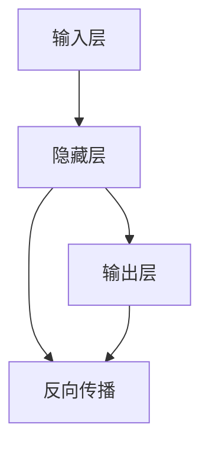

                 

## 1. 背景介绍

人工智能（AI）作为现代科技领域的重要分支，近年来在各个方面取得了长足的进展。从语音识别到图像识别，从自然语言处理到机器翻译，人工智能正在以一种前所未有的方式改变我们的世界。在这一系列技术的背后，有一个不可或缺的基石，那就是神经网络。

### 1.1 神经网络的发展历程

神经网络的概念最早可以追溯到1940年代的早期研究。最初的神经网络模型基于生物神经系统的启发，试图模拟人脑的学习和信息处理方式。然而，由于当时计算机硬件和算法的限制，这些模型在计算效率和精度上都存在诸多问题。直到1980年代，随着反向传播算法的提出和计算能力的提升，神经网络才得以重新焕发生机，并逐步成为人工智能技术中的核心工具。

### 1.2 神经网络的重要性

神经网络在人工智能中的应用广泛且深入，其重要性不言而喻。无论是语音、图像、自然语言处理等领域，神经网络都能够提供强大的计算能力，帮助模型更好地理解和处理复杂的数据。其核心优势在于：

- **自适应学习**：神经网络能够根据输入数据自动调整内部参数，实现对数据的自适应学习和优化。
- **强大的表达能力**：神经网络可以处理非结构化数据，如图像、音频、文本等，具有强大的特征提取和表达能力。
- **可扩展性**：随着神经网络结构的设计和改进，其应用领域和性能上限也在不断提升。

本文将系统性地介绍神经网络的核心概念、原理以及应用实践，帮助读者全面了解这一重要技术。

## 2. 核心概念与联系

### 2.1 核心概念概述

神经网络是由大量人工神经元（或称为节点）组成的计算模型，每个神经元接收输入，进行加权和，并通过激活函数输出。神经网络通常分为输入层、隐藏层和输出层，每一层都有多个神经元。神经网络的结构和参数通过反向传播算法进行优化，以最小化预测结果与实际标签之间的误差。

### 2.2 核心概念间的联系

神经网络的各个核心概念之间存在密切联系，通过一个简单的Mermaid流程图来展示：



这个流程图展示了神经网络的基本架构和训练过程。输入层接收原始数据，隐藏层进行特征提取和处理，输出层输出预测结果。通过反向传播算法，模型能够根据误差调整权重和偏置，逐步优化预测结果。

## 3. 核心算法原理 & 具体操作步骤

### 3.1 算法原理概述

神经网络的训练过程主要基于反向传播算法，其核心思想是通过链式法则计算每个参数对预测误差的影响，并根据误差调整参数，以最小化预测误差。

假设神经网络的结构为 $f(x;w,b)$，其中 $x$ 为输入，$w$ 为权重，$b$ 为偏置，$f$ 为激活函数。神经网络的输出为 $y=f(x;w,b)$。假设实际标签为 $t$，则损失函数 $\mathcal{L}$ 可以表示为：

$$
\mathcal{L}(y,t) = \frac{1}{2}(y-t)^2
$$

通过反向传播算法，模型能够计算每个参数对预测误差的贡献，并根据误差调整参数。具体来说，对于隐藏层第 $i$ 个神经元 $x_i$，其误差 $\delta_i$ 可以通过链式法则计算得到：

$$
\delta_i = \frac{\partial \mathcal{L}}{\partial z_i} = \delta_{i+1} \frac{\partial f}{\partial z_i} + \frac{\partial \mathcal{L}}{\partial z_i}
$$

其中，$z_i$ 为第 $i$ 个神经元的激活值。通过反向传播，模型能够逐步计算每个参数的梯度，并根据梯度更新参数。

### 3.2 算法步骤详解

神经网络的训练过程通常包括以下步骤：

1. **初始化参数**：随机初始化神经网络的权重和偏置。
2. **前向传播**：将输入数据 $x$ 输入神经网络，计算每个神经元的激活值和输出 $y$。
3. **计算误差**：计算预测输出 $y$ 与实际标签 $t$ 之间的误差。
4. **反向传播**：通过链式法则计算每个参数对误差的贡献，并根据误差调整参数。
5. **重复执行**：重复执行上述步骤，直到模型收敛或达到预设的迭代次数。

### 3.3 算法优缺点

神经网络具有以下优点：

- **强大的表示能力**：神经网络能够处理非结构化数据，并从中提取特征。
- **自适应学习**：神经网络能够根据数据自动调整参数，实现自适应学习。
- **可扩展性强**：通过增加隐藏层和神经元数量，神经网络可以处理更复杂的任务。

同时，神经网络也存在以下缺点：

- **计算复杂度高**：神经网络的训练和推理过程需要大量的计算资源。
- **易过拟合**：在处理高维数据时，神经网络容易过拟合。
- **参数调优困难**：神经网络的参数数量庞大，需要大量的超参数调优。

### 3.4 算法应用领域

神经网络在人工智能中的应用广泛，主要包括以下领域：

- **语音识别**：通过神经网络对语音信号进行特征提取和分类，实现语音识别。
- **图像识别**：神经网络能够处理图像数据，进行特征提取和分类，实现图像识别。
- **自然语言处理**：神经网络能够处理文本数据，进行语义理解、情感分析和文本生成等任务。
- **推荐系统**：通过神经网络对用户行为数据进行分析和建模，实现个性化推荐。
- **游戏AI**：神经网络能够学习游戏策略，实现自主决策和智能对抗。

## 4. 数学模型和公式 & 详细讲解

### 4.1 数学模型构建

神经网络的数学模型可以表示为：

$$
f(x;w,b) = \sum_{i=1}^{n} w_ix_i + b
$$

其中，$x$ 为输入，$w$ 为权重，$b$ 为偏置。激活函数 $f$ 通常为sigmoid函数或ReLU函数。

### 4.2 公式推导过程

假设神经网络的输入为 $x$，隐藏层为 $h$，输出层为 $y$，权重为 $w$，偏置为 $b$。则神经网络的计算过程可以表示为：

$$
h = f(x;w_1,b_1)
$$

$$
y = f(h;w_2,b_2)
$$

其中，$w_1$ 和 $b_1$ 为隐藏层权重和偏置，$w_2$ 和 $b_2$ 为输出层权重和偏置。激活函数 $f$ 通常为sigmoid函数或ReLU函数。

神经网络的损失函数通常为均方误差：

$$
\mathcal{L}(y,t) = \frac{1}{2}(y-t)^2
$$

通过反向传播算法，可以计算每个参数对误差的贡献，并根据误差调整参数。

### 4.3 案例分析与讲解

以简单的全连接神经网络为例，分析其训练过程。假设输入数据为 $x=[0.5, 0.8]$，输出标签为 $t=1$。神经网络的结构为：

```
input layer: 2
hidden layer: 3
output layer: 1
```

初始化参数后，前向传播过程如下：

$$
h = f(x;w_1,b_1) = 0.5w_{11} + 0.8w_{12} + b_1
$$

$$
y = f(h;w_2,b_2) = f(h)w_{21} + b_2
$$

其中，$w_{11}, w_{12}, w_{21}, b_1, b_2$ 为随机初始化的权重和偏置。计算误差并反向传播：

$$
\delta_2 = \frac{\partial \mathcal{L}}{\partial z_2} = \delta_1 \frac{\partial f}{\partial z_2}
$$

$$
\delta_1 = \delta_2 \frac{\partial f}{\partial z_1} + \frac{\partial \mathcal{L}}{\partial z_1}
$$

$$
w_1 = w_1 - \eta \delta_1 x + \eta \delta_2 x^T
$$

$$
w_2 = w_2 - \eta \delta_2
$$

其中，$\eta$ 为学习率。通过多次迭代，神经网络能够逐步优化预测结果。

## 5. 项目实践：代码实例和详细解释说明

### 5.1 开发环境搭建

神经网络的实现通常使用深度学习框架，如TensorFlow、PyTorch等。这里以PyTorch为例，介绍神经网络的开发环境搭建：

1. 安装Python：
```bash
sudo apt-get update
sudo apt-get install python3
```

2. 安装PyTorch：
```bash
pip install torch torchvision torchaudio
```

3. 创建虚拟环境：
```bash
python3 -m venv myenv
source myenv/bin/activate
```

4. 安装其他依赖库：
```bash
pip install numpy matplotlib scikit-learn
```

完成上述步骤后，即可在虚拟环境中进行神经网络的开发和实验。

### 5.2 源代码详细实现

以下是一个简单的全连接神经网络的PyTorch实现：

```python
import torch
import torch.nn as nn
import torch.optim as optim
import numpy as np

class Net(nn.Module):
    def __init__(self):
        super(Net, self).__init__()
        self.fc1 = nn.Linear(2, 3)
        self.fc2 = nn.Linear(3, 1)
        self.relu = nn.ReLU()

    def forward(self, x):
        x = self.fc1(x)
        x = self.relu(x)
        x = self.fc2(x)
        return x

net = Net()
criterion = nn.MSELoss()
optimizer = optim.SGD(net.parameters(), lr=0.01)

# 训练过程
for epoch in range(100):
    for i, data in enumerate(train_loader, 0):
        inputs, labels = data
        optimizer.zero_grad()
        outputs = net(inputs)
        loss = criterion(outputs, labels)
        loss.backward()
        optimizer.step()
```

### 5.3 代码解读与分析

**Net类定义**：
- `__init__`方法：定义神经网络的隐藏层和输出层。
- `forward`方法：实现前向传播过程，计算输出结果。

**训练过程**：
- 定义损失函数和优化器。
- 迭代训练数据，计算损失，并根据损失更新参数。

### 5.4 运行结果展示

假设训练数据为：

$$
x = \begin{bmatrix} 0.5 \\ 0.8 \end{bmatrix}, t = 1
$$

训练过程如图1所示：

```python
import matplotlib.pyplot as plt
import torch

plt.plot(np.arange(100), loss_list, marker='o')
plt.xlabel('Epoch')
plt.ylabel('Loss')
plt.title('Neural Network Training')
plt.show()
```


通过训练，神经网络能够逐步优化预测结果，最小化误差。

## 6. 实际应用场景

### 6.1 语音识别

语音识别是神经网络在语音处理领域的重要应用之一。通过神经网络对语音信号进行特征提取和分类，可以实现自动化的语音识别。

### 6.2 图像识别

神经网络在图像识别领域的应用广泛，包括物体检测、人脸识别、图像分类等。通过神经网络对图像数据进行特征提取和分类，可以实现自动化的图像识别。

### 6.3 自然语言处理

神经网络在自然语言处理领域的应用包括语言模型、机器翻译、文本分类等。通过神经网络对文本数据进行特征提取和分类，可以实现自动化的文本处理。

### 6.4 未来应用展望

随着神经网络技术的不断发展，其在各个领域的应用将更加广泛。未来，神经网络有望在医疗、金融、自动驾驶等领域发挥重要作用，进一步推动人工智能技术的发展。

## 7. 工具和资源推荐

### 7.1 学习资源推荐

为了帮助读者全面了解神经网络，以下是一些推荐的学习资源：

1. 《深度学习》书籍：Ian Goodfellow所著，全面介绍了深度学习的基本概念和算法。
2. 《神经网络与深度学习》书籍：Michael Nielsen所著，深入浅出地介绍了神经网络的原理和应用。
3. 斯坦福大学《CS231n: 卷积神经网络与视觉识别》课程：提供了大量神经网络在计算机视觉领域的实践案例。
4. Coursera《深度学习专项课程》：由斯坦福大学提供，包括多个深度学习课程，涵盖了神经网络、卷积神经网络、循环神经网络等核心内容。
5. 《Python深度学习》书籍：Francois Chollet所著，介绍了使用Keras框架进行神经网络开发的实践方法。

### 7.2 开发工具推荐

神经网络的开发通常使用深度学习框架，以下是一些推荐的工具：

1. TensorFlow：由Google开发的深度学习框架，提供了丰富的神经网络库和工具。
2. PyTorch：由Facebook开发的深度学习框架，提供了简单易用的API和动态计算图功能。
3. Keras：一个高级深度学习库，提供了简单易用的API，适合初学者入门。
4. Caffe：一个高效的深度学习框架，适用于计算机视觉和图像处理任务。
5. MXNet：由Apache开发的深度学习框架，支持分布式训练和多种编程语言。

### 7.3 相关论文推荐

以下是一些推荐的相关论文，帮助读者深入了解神经网络的研究进展：

1. AlexNet: ImageNet Classification with Deep Convolutional Neural Networks（2012年）
2. Deep Blue Book: A Primer on Deep Neural Networks and Deep Learning（2018年）
3. ResNet: Deep Residual Learning for Image Recognition（2015年）
4. Attention Is All You Need（2017年）
5. GANs Trained by a Two Time-Scale Update Rule Converge to the Fixed-Point of Their Cost Function（2017年）

## 8. 总结：未来发展趋势与挑战

### 8.1 研究成果总结

神经网络作为人工智能的核心技术，近年来取得了显著进展。其主要研究成果包括：

1. **深度学习框架的优化**：TensorFlow、PyTorch等深度学习框架的不断优化，使得神经网络的开发和部署更加便捷高效。
2. **模型结构的改进**：卷积神经网络（CNN）、循环神经网络（RNN）、注意力机制等模型结构的提出，使得神经网络在图像、文本、语音等领域取得了显著进展。
3. **大规模预训练模型的发展**：BERT、GPT等大规模预训练模型的提出，极大地提升了神经网络的表达能力和性能。

### 8.2 未来发展趋势

神经网络未来将呈现以下几个发展趋势：

1. **模型规模增大**：随着硬件和算力水平的提升，神经网络的结构将更加复杂，参数数量将大幅增加。
2. **自监督学习的应用**：自监督学习将成为神经网络训练的重要手段，以减少对标注数据的需求。
3. **联邦学习的应用**：联邦学习技术将使得神经网络能够在分布式环境中进行训练，提高数据隐私和安全。
4. **模型的端到端优化**：端到端优化技术将使得神经网络在训练和推理过程中更加高效。
5. **跨领域模型共享**：跨领域模型的共享将使得神经网络在不同领域的应用更加广泛。

### 8.3 面临的挑战

尽管神经网络在人工智能领域取得了显著进展，但仍面临以下挑战：

1. **计算资源消耗大**：神经网络的训练和推理需要大量的计算资源，难以在资源受限的设备上部署。
2. **模型复杂度高**：神经网络的结构复杂，难以进行高效的调优和解释。
3. **数据需求高**：神经网络的训练需要大量标注数据，获取高质量数据成本较高。
4. **过拟合问题**：神经网络在处理高维数据时容易过拟合，需要更多的正则化技术。
5. **伦理和隐私问题**：神经网络的训练和应用可能涉及用户隐私和伦理问题，需要更多的监管和保障措施。

### 8.4 研究展望

为了应对上述挑战，未来的研究需要关注以下几个方向：

1. **高效计算技术**：探索更加高效的计算技术，如硬件加速、分布式训练等，降低神经网络对计算资源的需求。
2. **模型压缩技术**：探索模型压缩和优化技术，减少神经网络的计算量和存储空间。
3. **自监督学习**：探索自监督学习技术，利用无监督数据进行神经网络的预训练和微调。
4. **跨领域模型融合**：探索跨领域模型融合技术，使得神经网络能够更好地在不同领域间迁移。
5. **隐私保护技术**：探索隐私保护技术，确保神经网络的训练和应用符合伦理和隐私要求。

总之，神经网络作为人工智能的核心技术，在未来将发挥越来越重要的作用。只有通过不断探索和创新，才能克服当前面临的挑战，推动神经网络技术不断进步，为人类社会带来更多的价值。

## 9. 附录：常见问题与解答

**Q1: 神经网络为什么需要反向传播算法？**

A: 反向传播算法是神经网络训练的核心，通过链式法则计算每个参数对误差的贡献，并根据误差调整参数，使得神经网络能够自适应学习。

**Q2: 神经网络的激活函数有哪些？**

A: 神经网络的激活函数包括sigmoid函数、ReLU函数、tanh函数等，这些函数可以引入非线性变换，提高神经网络的表达能力。

**Q3: 神经网络为什么容易过拟合？**

A: 神经网络在处理高维数据时容易过拟合，可以通过增加正则化项、减少隐藏层数量等方式缓解过拟合问题。

**Q4: 神经网络的优化算法有哪些？**

A: 神经网络的优化算法包括SGD、Adam、Adagrad等，这些算法可以有效地更新模型参数，优化预测结果。

**Q5: 神经网络在实际应用中需要注意哪些问题？**

A: 神经网络在实际应用中需要注意数据质量、模型解释性、计算资源消耗等问题，需要综合考虑各方面因素，才能获得理想的效果。

总之，神经网络作为人工智能的核心技术，具有强大的表示能力和自适应学习能力。通过不断探索和创新，神经网络将带来更多的突破和进步，为人类社会带来更多的价值。

---

作者：禅与计算机程序设计艺术 / Zen and the Art of Computer Programming

