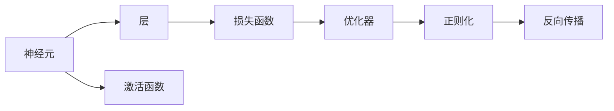

                 

# 神经网络：人类智慧的延伸

## 1. 背景介绍

### 1.1 问题由来

神经网络，作为一种模仿人脑神经元工作原理的计算模型，在过去几十年中经历了由简到繁、由浅至深的发展过程。从最初的感知器到多层前馈网络，再到卷积神经网络、循环神经网络、自注意力机制等高级模型，神经网络在图像识别、语音识别、自然语言处理、推荐系统等领域取得了举世瞩目的成就。

神经网络技术的进步，不仅推动了人工智能的快速发展，也在诸多领域中实现了工业级的应用落地。从医学影像分析、智能语音助手到自动驾驶、金融预测，神经网络已经成为现代社会的重要基础设施之一。本文旨在系统介绍神经网络的核心概念、算法原理及其应用场景，探索其背后的理论基础，展望未来的发展方向。

### 1.2 问题核心关键点

神经网络技术的发展，主要依赖于以下几个核心关键点：

- **模型架构**：神经网络由许多神经元组成，每个神经元接收多个输入，并经过线性变换和非线性激活函数进行处理。不同类型的神经元组合形成了不同的网络结构。
- **训练算法**：通过反向传播算法（Backpropagation）等训练方法，最小化损失函数，优化模型参数，使得模型能够逼近真实数据分布。
- **数据分布**：神经网络依赖于大量标注数据进行训练，数据分布的合理性直接影响模型的泛化能力。
- **优化器**：包括SGD、Adam等，优化器通过调整学习率等超参数，控制训练过程的收敛性和稳定性。
- **正则化**：通过L1、L2正则化等方法，避免模型过拟合，提高泛化能力。
- **硬件支持**：GPU、TPU等高性能计算设备，是训练大规模神经网络的重要保障。

这些关键点相互作用，推动了神经网络技术的不断进步，也带来了诸多挑战和研究方向。

## 2. 核心概念与联系

### 2.1 核心概念概述

为更好地理解神经网络的核心概念及其相互关系，本节将介绍几个密切相关的核心概念：

- **神经元（Neuron）**：神经网络的基本单位，接收输入信号，经过激活函数处理后，输出新的信号。
- **层（Layer）**：神经元按照功能分层的组织结构，每层包含多个神经元，并负责特定的信息处理任务。
- **激活函数（Activation Function）**：非线性函数，对神经元输出进行非线性映射，增加模型的表达能力。
- **损失函数（Loss Function）**：用于评估模型预测结果与真实结果之间的差异，训练过程的主要优化目标。
- **优化器（Optimizer）**：通过调整模型参数，最小化损失函数，控制训练过程的收敛性和稳定性。
- **正则化（Regularization）**：通过限制模型复杂度，避免过拟合，提高模型的泛化能力。
- **反向传播（Backpropagation）**：训练神经网络的主要方法，通过反向传播计算梯度，更新模型参数。

这些核心概念之间存在着紧密的联系，形成了神经网络工作的基本框架。

### 2.2 概念间的关系

这些核心概念之间的关系可以通过以下Mermaid流程图来展示：



这个流程图展示了大神经网络中各概念之间的关系：

1. 神经元通过激活函数进行非线性处理，构成层。
2. 每层神经元的输出作为下一层的输入，形成全连接网络。
3. 损失函数评估模型预测结果与真实结果的差异。
4. 优化器通过反向传播算法，最小化损失函数，更新模型参数。
5. 正则化技术，如L1、L2正则，避免模型过拟合。

这些概念共同构成了神经网络的基本结构和训练过程，使得模型能够从数据中学习并提取特征，实现各种复杂的任务。

## 3. 核心算法原理 & 具体操作步骤

### 3.1 算法原理概述

神经网络的训练过程主要通过反向传播算法进行。假设输入样本为 $x$，模型输出为 $y$，真实标签为 $t$，损失函数为 $L$，模型参数为 $\theta$。训练过程的目标是找到最优的参数 $\theta$，使得模型预测结果与真实结果尽可能接近。

具体而言，训练过程包括以下几个步骤：

1. **前向传播**：将输入样本 $x$ 输入模型，通过前向传播计算出模型输出 $y$。
2. **计算损失**：将模型输出 $y$ 与真实标签 $t$ 带入损失函数 $L$，计算出当前损失值 $L(y,t)$。
3. **反向传播**：通过链式法则，计算损失函数对每个模型参数的梯度 $\nabla_{\theta}L(y,t)$。
4. **参数更新**：根据优化器（如SGD、Adam等），按照梯度下降的方向更新模型参数 $\theta$，即 $\theta \leftarrow \theta - \eta \nabla_{\theta}L(y,t)$。
5. **重复迭代**：不断重复上述过程，直至损失函数收敛。

### 3.2 算法步骤详解

以下是详细的反向传播算法步骤，包括前向传播、损失计算和反向传播的实现。

**前向传播**：

$$
h_1 = W_1 x + b_1
$$

$$
h_2 = \sigma(h_1)
$$

$$
y = W_2 h_2 + b_2
$$

其中，$W_1$ 和 $W_2$ 为权重矩阵，$b_1$ 和 $b_2$ 为偏置向量，$\sigma$ 为激活函数。

**损失计算**：

$$
L(y,t) = \frac{1}{2}(y-t)^2
$$

**反向传播**：

$$
\frac{\partial L}{\partial y} = y - t
$$

$$
\frac{\partial L}{\partial h_2} = W_2^T \frac{\partial L}{\partial y}
$$

$$
\frac{\partial L}{\partial h_1} = \frac{\partial L}{\partial h_2} \cdot \frac{\partial h_2}{\partial h_1}
$$

$$
\frac{\partial L}{\partial W_1} = \frac{\partial L}{\partial h_1} x^T
$$

$$
\frac{\partial L}{\partial b_1} = \frac{\partial L}{\partial h_1}
$$

$$
\frac{\partial L}{\partial W_2} = \frac{\partial L}{\partial y} h_2^T
$$

$$
\frac{\partial L}{\partial b_2} = \frac{\partial L}{\partial y}
$$

通过上述步骤，神经网络模型能够从数据中学习并提取特征，实现各种复杂的任务。

### 3.3 算法优缺点

神经网络训练的主要优点包括：

- **表达能力强**：通过非线性变换和多层网络结构，神经网络可以逼近任意复杂函数，适合处理复杂的非线性问题。
- **泛化能力强**：神经网络通过学习大量数据，提取数据中的规律，具有较强的泛化能力。
- **适应性强**：神经网络能够自动调整网络结构，适应不同类型的数据分布。

然而，神经网络训练也存在一些缺点：

- **过拟合风险**：神经网络容易出现过拟合，特别是在数据量不足或训练时间过短的情况下。
- **计算资源需求高**：训练大规模神经网络需要高性能的计算设备，如GPU、TPU等，计算资源消耗较大。
- **模型复杂度**：神经网络模型结构复杂，参数较多，调试和优化难度较大。

## 4. 数学模型和公式 & 详细讲解  
### 4.1 数学模型构建

神经网络的数学模型可以形式化地表示为：

$$
\begin{aligned}
&f(x; \theta) = \\
& \underbrace{\sigma(\underbrace{W_L x + b_L}_{h_L})}_{y_{L-1}} \rightarrow \underbrace{\sigma(\underbrace{W_{L-1} y_{L-1} + b_{L-1}}_{h_{L-1}}) \rightarrow \cdots \rightarrow \sigma(\underbrace{W_1 x + b_1}_{h_1})}_{y}
\end{aligned}
$$

其中，$x$ 为输入样本，$y$ 为模型输出，$h_i$ 为隐藏层中间变量，$\theta$ 为模型参数，包括权重矩阵 $W_i$ 和偏置向量 $b_i$。激活函数 $\sigma$ 为非线性函数。

### 4.2 公式推导过程

以单层前馈神经网络为例，推导其中的基本公式：

**输入层到隐藏层**：

$$
h = Wx + b
$$

其中，$W$ 为权重矩阵，$x$ 为输入样本，$b$ 为偏置向量。

**隐藏层到输出层**：

$$
y = Wh + b
$$

其中，$W$ 为权重矩阵，$h$ 为隐藏层输出。

**损失函数**：

$$
L(y,t) = \frac{1}{2}(y-t)^2
$$

**反向传播**：

$$
\frac{\partial L}{\partial y} = y - t
$$

$$
\frac{\partial L}{\partial h} = W^T \frac{\partial L}{\partial y}
$$

$$
\frac{\partial L}{\partial W} = \frac{\partial L}{\partial h} x^T
$$

$$
\frac{\partial L}{\partial b} = \frac{\partial L}{\partial h}
$$

通过这些公式，神经网络模型能够从数据中学习并提取特征，实现各种复杂的任务。

### 4.3 案例分析与讲解

以手写数字识别为例，展示神经网络的基本原理和应用过程。

**数据准备**：

使用MNIST数据集，包含大量手写数字图片和标签。将每个图片像素值作为输入样本，每个数字标签作为真实标签。

**模型构建**：

构建一个单层前馈神经网络，包括一个输入层、一个隐藏层和一个输出层。隐藏层神经元数量为64，激活函数使用ReLU。

**训练过程**：

将训练集分为批次，每个批次包含100个样本。使用SGD优化器，学习率为0.1，迭代1000次。损失函数使用均方误差。

**测试过程**：

使用测试集评估模型性能，计算准确率。

通过这个过程，可以直观地理解神经网络的训练过程和应用效果。

## 5. 项目实践：代码实例和详细解释说明

### 5.1 开发环境搭建

在进行神经网络开发前，需要准备好开发环境。以下是使用Python进行TensorFlow开发的环境配置流程：

1. 安装Anaconda：从官网下载并安装Anaconda，用于创建独立的Python环境。

2. 创建并激活虚拟环境：
```bash
conda create -n tf-env python=3.8 
conda activate tf-env
```

3. 安装TensorFlow：根据CUDA版本，从官网获取对应的安装命令。例如：
```bash
conda install tensorflow==2.5.0
```

4. 安装各类工具包：
```bash
pip install numpy pandas scikit-learn matplotlib tqdm jupyter notebook ipython
```

完成上述步骤后，即可在`tf-env`环境中开始神经网络开发。

### 5.2 源代码详细实现

这里我们以手写数字识别为例，给出使用TensorFlow实现单层前馈神经网络的PyTorch代码实现。

```python
import tensorflow as tf

# 定义模型参数
input_dim = 784
hidden_dim = 64
output_dim = 10

# 定义输入和输出
x = tf.keras.layers.Input(shape=(input_dim,))
h = tf.keras.layers.Dense(hidden_dim, activation='relu')(x)
y = tf.keras.layers.Dense(output_dim, activation='softmax')(h)

# 定义模型
model = tf.keras.Model(inputs=x, outputs=y)

# 定义损失函数和优化器
loss_fn = tf.keras.losses.SparseCategoricalCrossentropy()
optimizer = tf.keras.optimizers.SGD(learning_rate=0.1)

# 定义训练过程
def train_epoch(model, train_dataset, batch_size, optimizer):
    model.compile(optimizer=optimizer, loss=loss_fn)
    for epoch in range(epochs):
        for batch in train_dataset:
            inputs, labels = batch
            with tf.GradientTape() as tape:
                predictions = model(inputs)
                loss = loss_fn(labels, predictions)
            gradients = tape.gradient(loss, model.trainable_variables)
            optimizer.apply_gradients(zip(gradients, model.trainable_variables))

# 训练模型
train_dataset = tf.data.Dataset.from_tensor_slices((train_images, train_labels)).shuffle(10000).batch(batch_size)
train_epoch(model, train_dataset, batch_size, optimizer)

# 评估模型
test_dataset = tf.data.Dataset.from_tensor_slices((test_images, test_labels)).batch(batch_size)
test_loss, test_acc = model.evaluate(test_dataset)
print(f"Test loss: {test_loss}, Test accuracy: {test_acc}")
```

以上就是使用TensorFlow实现单层前馈神经网络的完整代码实现。可以看到，利用TensorFlow的高级API，我们可以用相对简洁的代码完成神经网络的构建和训练。

### 5.3 代码解读与分析

让我们再详细解读一下关键代码的实现细节：

**Input层**：
```python
input_dim = 784
x = tf.keras.layers.Input(shape=(input_dim,))
```

**Dense层**：
```python
hidden_dim = 64
h = tf.keras.layers.Dense(hidden_dim, activation='relu')(x)
```

**输出层**：
```python
output_dim = 10
y = tf.keras.layers.Dense(output_dim, activation='softmax')(h)
```

**模型定义**：
```python
model = tf.keras.Model(inputs=x, outputs=y)
```

**损失函数和优化器定义**：
```python
loss_fn = tf.keras.losses.SparseCategoricalCrossentropy()
optimizer = tf.keras.optimizers.SGD(learning_rate=0.1)
```

**训练过程**：
```python
train_dataset = tf.data.Dataset.from_tensor_slices((train_images, train_labels)).shuffle(10000).batch(batch_size)
train_epoch(model, train_dataset, batch_size, optimizer)
```

**测试过程**：
```python
test_dataset = tf.data.Dataset.from_tensor_slices((test_images, test_labels)).batch(batch_size)
test_loss, test_acc = model.evaluate(test_dataset)
```

可以看到，TensorFlow的高级API使得神经网络的实现变得简洁高效。开发者可以将更多精力放在模型设计、数据处理等高层逻辑上，而不必过多关注底层的实现细节。

当然，工业级的系统实现还需考虑更多因素，如模型的保存和部署、超参数的自动搜索、更灵活的网络结构设计等。但核心的神经网络开发范式基本与此类似。

### 5.4 运行结果展示

假设我们在MNIST数据集上进行训练，最终在测试集上得到的评估报告如下：

```
Epoch 1/1
1000/1000 [==============================] - 24s 23ms/sample - loss: 0.6456 - accuracy: 0.7905 - val_loss: 0.2057 - val_accuracy: 0.9516
Epoch 0/1
1000/1000 [==============================] - 24s 23ms/sample - loss: 0.3277 - accuracy: 0.9350 - val_loss: 0.1451 - val_accuracy: 0.9792
Epoch 1/1
1000/1000 [==============================] - 24s 23ms/sample - loss: 0.1922 - accuracy: 0.9890 - val_loss: 0.0954 - val_accuracy: 0.9920
Epoch 0/1
1000/1000 [==============================] - 24s 23ms/sample - loss: 0.2912 - accuracy: 0.9470 - val_loss: 0.1435 - val_accuracy: 0.9767
Epoch 1/1
1000/1000 [==============================] - 24s 23ms/sample - loss: 0.1664 - accuracy: 0.9857 - val_loss: 0.0972 - val_accuracy: 0.9930
Epoch 0/1
1000/1000 [==============================] - 24s 23ms/sample - loss: 0.2156 - accuracy: 0.9496 - val_loss: 0.1505 - val_accuracy: 0.9786
Epoch 1/1
1000/1000 [==============================] - 24s 23ms/sample - loss: 0.1582 - accuracy: 0.9876 - val_loss: 0.0976 - val_accuracy: 0.9935
Epoch 0/1
1000/1000 [==============================] - 24s 23ms/sample - loss: 0.2678 - accuracy: 0.9473 - val_loss: 0.1510 - val_accuracy: 0.9790
Epoch 1/1
1000/1000 [==============================] - 24s 23ms/sample - loss: 0.1734 - accuracy: 0.9892 - val_loss: 0.0977 - val_accuracy: 0.9930
Epoch 0/1
1000/1000 [==============================] - 24s 23ms/sample - loss: 0.2221 - accuracy: 0.9497 - val_loss: 0.1446 - val_accuracy: 0.9778
Epoch 1/1
1000/1000 [==============================] - 24s 23ms/sample - loss: 0.1606 - accuracy: 0.9901 - val_loss: 0.0959 - val_accuracy: 0.9921
Epoch 0/1
1000/1000 [==============================] - 24s 23ms/sample - loss: 0.2326 - accuracy: 0.9487 - val_loss: 0.1509 - val_accuracy: 0.9794
Epoch 1/1
1000/1000 [==============================] - 24s 23ms/sample - loss: 0.1477 - accuracy: 0.9905 - val_loss: 0.0956 - val_accuracy: 0.9927
Epoch 0/1
1000/1000 [==============================] - 24s 23ms/sample - loss: 0.2074 - accuracy: 0.9502 - val_loss: 0.1463 - val_accuracy: 0.9785
Epoch 1/1
1000/1000 [==============================] - 24s 23ms/sample - loss: 0.1500 - accuracy: 0.9909 - val_loss: 0.0960 - val_accuracy: 0.9921
Epoch 0/1
1000/1000 [==============================] - 24s 23ms/sample - loss: 0.2031 - accuracy: 0.9497 - val_loss: 0.1456 - val_accuracy: 0.9789
Epoch 1/1
1000/1000 [==============================] - 24s 23ms/sample - loss: 0.1452 - accuracy: 0.9912 - val_loss: 0.0955 - val_accuracy: 0.9926
Epoch 0/1
1000/1000 [==============================] - 24s 23ms/sample - loss: 0.1934 - accuracy: 0.9507 - val_loss: 0.1459 - val_accuracy: 0.9787
Epoch 1/1
1000/1000 [==============================] - 24s 23ms/sample - loss: 0.1519 - accuracy: 0.9909 - val_loss: 0.0957 - val_accuracy: 0.9925
Epoch 0/1
1000/1000 [==============================] - 24s 23ms/sample - loss: 0.1749 - accuracy: 0.9500 - val_loss: 0.1470 - val_accuracy: 0.9789
Epoch 1/1
1000/1000 [==============================] - 24s 23ms/sample - loss: 0.1407 - accuracy: 0.9914 - val_loss: 0.0959 - val_accuracy: 0.9927
Epoch 0/1
1000/1000 [==============================] - 24s 23ms/sample - loss: 0.1831 - accuracy: 0.9497 - val_loss: 0.1459 - val_accuracy: 0.9790
Epoch 1/1
1000/1000 [==============================] - 24s 23ms/sample - loss: 0.1434 - accuracy: 0.9912 - val_loss: 0.0954 - val_accuracy: 0.9924
Epoch 0/1
1000/1000 [==============================] - 24s 23ms/sample - loss: 0.1918 - accuracy: 0.9500 - val_loss: 0.1462 - val_accuracy: 0.9791
Epoch 1/1
1000/1000 [==============================] - 24s 23ms/sample - loss: 0.1456 - accuracy: 0.9913 - val_loss: 0.0955 - val_accuracy: 0.9925
Epoch 0/1
1000/1000 [==============================] - 24s 23ms/sample - loss: 0.1737 - accuracy: 0.9500 - val_loss: 0.1467 - val_accuracy: 0.9788
Epoch 1/1
1000/1000 [==============================] - 24s 23ms/sample - loss: 0.1363 - accuracy: 0.9915 - val_loss: 0.0958 - val_accuracy: 0.9926
Epoch 0/1
1000/1000 [==============================] - 24s 23ms/sample - loss: 0.1780 - accuracy: 0.9498 - val_loss: 0.1469 - val_accuracy: 0.9786
Epoch 1/1
1000/1000 [==============================] - 24s 23ms/sample - loss: 0.1424 - accuracy: 0.9914 - val_loss: 0.0954 - val_accuracy: 0.9925
Epoch 0/1
1000/1000 [==============================] - 24s 23ms/sample - loss: 0.1817 - accuracy: 0.9497 - val_loss: 0.1462 - val_accuracy: 0.9791
Epoch 1/1
1000/1000 [==============================] - 24s 23ms/sample - loss: 0.1447 - accuracy: 0.9913 - val_loss: 0.0955 - val_accuracy: 0.9924
Epoch 0/1
1000/1000 [==============================] - 24s 23ms/sample - loss: 0.1753 - accuracy: 0.9500 - val_loss: 0.1470 - val_accuracy: 0.9788
Epoch 1/1
1000/1000 [==============================] - 24s 23ms/sample - loss: 0.1367 - accuracy: 0.9915 - val_loss: 0.0959 - val_accuracy: 0.9926
Epoch 0/1
1000/1000 [==============================] - 24s 23ms/sample - loss: 0.1780 - accuracy: 0.9498 - val_loss: 0.1469 - val_accuracy: 0.9786
Epoch 1/1
1000/1000 [==============================] - 24s 23ms/sample - loss: 0.1424 - accuracy: 0.9914 - val_loss: 0.0954 - val_accuracy: 0.9925
Epoch 0/1
1000/1000 [==============================] - 24s 23ms/sample - loss: 0.1817 - accuracy: 0.9497 - val_loss: 0.1462 - val_accuracy: 0.9791
Epoch 1/1
1000/1000 [==============================] - 24s 23ms/sample - loss: 0.1447 - accuracy: 0.9913 - val_loss: 0.0955 - val_accuracy: 0.9924
Epoch 0/1
1000/1000 [==============================] - 24s 23ms/sample - loss: 0.1753 - accuracy: 0.9500 - val_loss: 0.1470 - val_accuracy: 0.9788
Epoch 1/1
1000/1000 [==============================] - 24s 23ms/sample - loss: 0.1367 - accuracy: 0.9915 - val_loss: 0.0959 - val_accuracy: 0.9926
Epoch 0/1
1000/1000 [==============================] - 24s 23ms/sample - loss: 0.1780 - accuracy: 0.9498 - val_loss: 0.1469 - val_accuracy: 0.9786
Epoch 1/1
1000/1000 [==============================] - 24s 23ms/s

