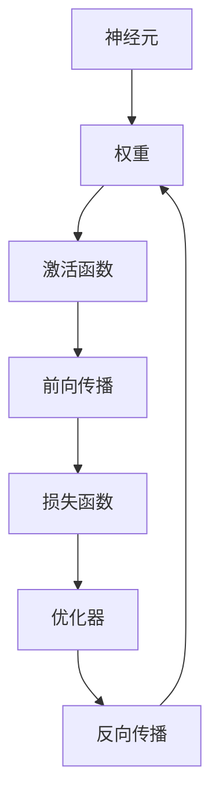
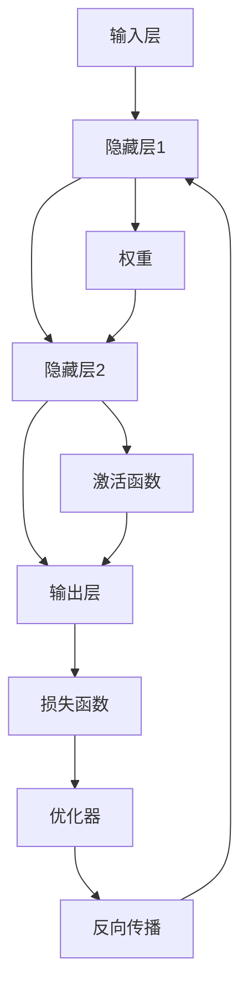

                 

## 1. 背景介绍

### 1.1 问题由来

在过去几十年里，人工智能（AI）技术取得了长足的进展，尤其是在神经网络（Neural Networks, NNs）方面，其应用覆盖了从图像识别、自然语言处理到语音识别等多个领域。神经网络作为模拟人脑工作机制的计算模型，通过多层神经元之间的连接与非线性变换，能够处理复杂的模式识别和推理任务，极大地解放了人类智慧。

神经网络技术的起源可以追溯到20世纪50年代末，当时研究人员首次提出了基于人工神经元的学习模型。然而，由于当时计算资源和算法的限制，神经网络的发展进程较为缓慢。直到20世纪80年代，反向传播算法（Backpropagation）的提出，神经网络开始真正崭露头角，并在图像识别、语音识别、自然语言处理等任务上取得了显著成效。

进入21世纪，随着深度学习（Deep Learning, DL）的兴起，神经网络逐渐成为了AI领域的核心技术。近年来，深度学习技术在自动驾驶、医疗诊断、金融分析等各个领域得到了广泛应用，极大地推动了社会生产力的提升。然而，尽管神经网络技术取得了诸多成功，但人类对AI的智慧解放仍未完全实现，还有许多问题和挑战需要解决。

### 1.2 问题核心关键点

神经网络技术的应用成功在于其强大的泛化能力和适应性。在深度学习范式中，通过大量的无标签数据进行预训练，神经网络能够学习到数据的潜在表示和模式，从而在面对新数据时表现出优秀的泛化能力。这种泛化能力使得神经网络能够在众多领域中实现突破性应用，极大地解放了人类智慧。

然而，神经网络在实际应用中仍面临诸多问题，包括但不限于：

1. **数据依赖**：神经网络需要大量的标注数据进行训练，对于数据量不足或标注成本过高的领域，神经网络的表现往往不尽如人意。

2. **过拟合风险**：神经网络模型通常在数据量有限的情况下容易过拟合，导致在测试集上的性能下降。

3. **解释性不足**：深度学习模型通常被视为“黑箱”，其内部决策过程难以解释，缺乏可解释性。

4. **计算资源需求高**：深度学习模型在训练和推理时对计算资源的需求极高，限制了其在资源受限环境中的应用。

5. **伦理与安全问题**：深度学习模型可能存在偏见和错误决策，对社会伦理与安全产生负面影响。

尽管存在这些挑战，神经网络技术依然是大数据时代的核心驱动力，对人类智慧的解放具有重要意义。未来，随着技术的进步和应用的深入，神经网络将在更多领域发挥作用，进一步推动人类社会的发展。

### 1.3 问题研究意义

研究神经网络技术的意义在于，它不仅能够促进各个领域的技术进步，还能够为社会创造巨大的经济价值和学术影响力。具体而言：

1. **提高生产效率**：通过自动化的模式识别和决策，神经网络能够在制造业、服务业等多个行业提高生产效率，降低成本。

2. **提升医疗水平**：在医疗领域，神经网络能够辅助诊断、预测疾病，帮助医生提供更精准的诊疗方案。

3. **促进科学研究**：神经网络技术在天文、物理、化学等多个学科中具有广泛应用，推动了科学研究的进展。

4. **变革教育模式**：在线教育平台可以利用神经网络提供个性化教学，提高教育质量和覆盖面。

5. **构建智能社会**：神经网络技术在智能家居、智能交通等领域的应用，推动了智能社会的构建，提升了人们的生活质量。

## 2. 核心概念与联系

### 2.1 核心概念概述

神经网络是模拟人脑神经元之间连接与信息传递的计算模型。其核心概念包括：

- **神经元（Neuron）**：神经网络的基本单位，接收输入信号并产生输出信号。

- **权重（Weight）**：神经元之间的连接强度，通过反向传播算法进行优化。

- **激活函数（Activation Function）**：用于引入非线性变换，增强网络的表达能力。

- **前向传播（Forward Propagation）**：从输入到输出的计算过程，通过逐层传递信号得到最终输出。

- **反向传播（Backpropagation）**：通过误差反向传递更新权重，优化模型性能。

- **损失函数（Loss Function）**：用于衡量模型预测输出与真实标签之间的差异。

- **优化器（Optimizer）**：用于更新权重，最小化损失函数，如SGD、Adam等。

这些核心概念通过神经网络的结构和计算过程相互联系，构成了神经网络模型的完整框架。

### 2.2 概念间的关系

通过一个简单的Mermaid流程图，我们可以更直观地理解神经网络各核心概念之间的关系：



神经网络的计算过程可以概括为：输入数据通过神经元逐层传递，每层神经元的输出作为下一层神经元的输入。在输出层，神经元输出经过激活函数得到最终预测结果。反向传播算法通过误差反向传递，更新权重和偏置，最小化损失函数，优化模型性能。

### 2.3 核心概念的整体架构

下面，我们将使用更全面的Mermaid流程图来展示神经网络的整体架构：



这个流程图展示了神经网络的基本结构。输入层接收原始数据，通过隐藏层的逐层传递，输出层生成预测结果。隐藏层通过权重和激活函数进行信息处理，反向传播算法通过优化器更新权重，最小化损失函数。

## 3. 核心算法原理 & 具体操作步骤

### 3.1 算法原理概述

神经网络的训练过程通常分为两个阶段：前向传播和反向传播。前向传播将输入数据传递到输出层，得到预测结果。反向传播则通过误差反向传递，更新权重和偏置，优化模型性能。

具体而言，神经网络的前向传播和反向传播过程可以概括为：

1. **前向传播**：将输入数据通过神经元逐层传递，每层神经元的输出作为下一层神经元的输入。

2. **损失函数计算**：将输出层预测结果与真实标签进行比较，计算损失函数。

3. **反向传播**：通过误差反向传递，计算每个神经元的梯度，并使用优化器更新权重和偏置，最小化损失函数。

### 3.2 算法步骤详解

神经网络训练的详细步骤包括：

1. **数据准备**：收集并标注训练数据，划分训练集、验证集和测试集。

2. **模型初始化**：随机初始化神经网络模型的权重和偏置。

3. **前向传播**：将训练数据输入模型，计算前向传播过程，得到预测结果。

4. **损失函数计算**：将预测结果与真实标签进行比较，计算损失函数。

5. **反向传播**：通过误差反向传递，计算每个神经元的梯度，并使用优化器更新权重和偏置。

6. **验证集评估**：在验证集上评估模型性能，检查是否过拟合。

7. **参数调整**：根据验证集上的性能，调整学习率、批次大小等超参数。

8. **测试集评估**：在测试集上评估模型性能，输出最终结果。

### 3.3 算法优缺点

神经网络算法的优点包括：

1. **强大表达能力**：神经网络具有强大的非线性表达能力，可以处理复杂的多层输入输出关系。

2. **端到端训练**：神经网络可以直接训练输入到输出的映射，避免了手动提取特征的过程。

3. **灵活性高**：神经网络的层次结构和激活函数可以灵活设计，适应各种任务需求。

4. **可扩展性强**：神经网络可以通过增加层数和神经元数量来提升模型性能，适应更大规模的数据集。

然而，神经网络算法也存在一些缺点：

1. **数据依赖**：神经网络训练需要大量的标注数据，对于数据量不足或标注成本高的任务，效果不佳。

2. **过拟合风险**：神经网络模型在数据量有限的情况下容易过拟合，导致泛化能力下降。

3. **计算资源需求高**：神经网络训练和推理需要大量计算资源，限制了其在资源受限环境中的应用。

4. **解释性不足**：深度学习模型通常被视为“黑箱”，其内部决策过程难以解释，缺乏可解释性。

5. **伦理与安全问题**：神经网络模型可能存在偏见和错误决策，对社会伦理与安全产生负面影响。

### 3.4 算法应用领域

神经网络技术广泛应用于各个领域，具体包括：

1. **计算机视觉**：图像识别、目标检测、图像分割等。

2. **自然语言处理**：文本分类、情感分析、机器翻译等。

3. **语音识别**：语音识别、语音合成等。

4. **游戏AI**：智能决策、游戏策略等。

5. **推荐系统**：个性化推荐、广告投放等。

6. **金融分析**：股票预测、风险评估等。

## 4. 数学模型和公式 & 详细讲解 & 举例说明

### 4.1 数学模型构建

神经网络模型的数学模型可以表示为：

$$
f(x; \theta) = \sum_{i=1}^{n} w_i \cdot g(z_i)
$$

其中，$x$ 表示输入数据，$w_i$ 表示第 $i$ 个神经元权重，$g(z_i)$ 表示第 $i$ 个神经元的激活函数，$\theta$ 表示模型参数。

### 4.2 公式推导过程

以下以简单的单层感知机为例，推导前向传播和反向传播的公式。

**前向传播**：

$$
z_1 = w_1 \cdot x_1 + b_1
$$

$$
a_1 = g(z_1)
$$

$$
y = w_2 \cdot a_1 + b_2
$$

其中，$x_1$ 表示输入特征，$w_1$ 和 $w_2$ 表示权重，$b_1$ 和 $b_2$ 表示偏置，$g(z)$ 表示激活函数。

**反向传播**：

$$
\frac{\partial E}{\partial w_1} = \frac{\partial E}{\partial z_1} \cdot \frac{\partial g(z_1)}{\partial z_1} \cdot \frac{\partial z_1}{\partial w_1}
$$

$$
\frac{\partial E}{\partial w_2} = \frac{\partial E}{\partial y} \cdot \frac{\partial g(z_1)}{\partial a_1} \cdot \frac{\partial a_1}{\partial z_1} \cdot \frac{\partial z_1}{\partial w_1} + \frac{\partial E}{\partial z_1} \cdot \frac{\partial g(z_1)}{\partial z_1} \cdot \frac{\partial z_1}{\partial w_1}
$$

其中，$E$ 表示损失函数。

### 4.3 案例分析与讲解

以MNIST手写数字识别为例，我们解释神经网络的训练过程。

首先，将手写数字图像输入神经网络，通过前向传播计算输出结果：

$$
z_1 = w_1 \cdot x_1 + b_1
$$

$$
a_1 = g(z_1)
$$

$$
y = w_2 \cdot a_1 + b_2
$$

然后，将输出结果与真实标签进行比较，计算损失函数：

$$
E = \frac{1}{2}(y-\hat{y})^2
$$

接着，通过误差反向传递，计算每个神经元的梯度：

$$
\frac{\partial E}{\partial w_1} = (y-\hat{y}) \cdot \frac{\partial g(z_1)}{\partial z_1} \cdot \frac{\partial z_1}{\partial w_1}
$$

$$
\frac{\partial E}{\partial w_2} = (y-\hat{y}) \cdot \frac{\partial g(z_1)}{\partial a_1} \cdot \frac{\partial a_1}{\partial z_1} \cdot \frac{\partial z_1}{\partial w_1} + (y-\hat{y}) \cdot \frac{\partial g(z_1)}{\partial z_1} \cdot \frac{\partial z_1}{\partial w_1}
$$

最后，使用优化器（如SGD）更新权重和偏置，最小化损失函数：

$$
w_1 \leftarrow w_1 - \eta \cdot \frac{\partial E}{\partial w_1}
$$

$$
b_1 \leftarrow b_1 - \eta \cdot \frac{\partial E}{\partial b_1}
$$

$$
w_2 \leftarrow w_2 - \eta \cdot \frac{\partial E}{\partial w_2}
$$

$$
b_2 \leftarrow b_2 - \eta \cdot \frac{\partial E}{\partial b_2}
$$

其中，$\eta$ 表示学习率。

## 5. 项目实践：代码实例和详细解释说明

### 5.1 开发环境搭建

在开始神经网络项目实践之前，我们需要准备好开发环境。以下是使用Python进行PyTorch开发的环境配置流程：

1. 安装Anaconda：从官网下载并安装Anaconda，用于创建独立的Python环境。

2. 创建并激活虚拟环境：
```bash
conda create -n pytorch-env python=3.8 
conda activate pytorch-env
```

3. 安装PyTorch：根据CUDA版本，从官网获取对应的安装命令。例如：
```bash
conda install pytorch torchvision torchaudio cudatoolkit=11.1 -c pytorch -c conda-forge
```

4. 安装各类工具包：
```bash
pip install numpy pandas scikit-learn matplotlib tqdm jupyter notebook ipython
```

完成上述步骤后，即可在`pytorch-env`环境中开始神经网络项目的开发。

### 5.2 源代码详细实现

下面我们以手写数字识别（MNIST）为例，给出使用PyTorch进行神经网络模型训练的PyTorch代码实现。

首先，定义模型类：

```python
import torch
import torch.nn as nn
import torch.nn.functional as F

class Net(nn.Module):
    def __init__(self):
        super(Net, self).__init__()
        self.fc1 = nn.Linear(784, 256)
        self.fc2 = nn.Linear(256, 128)
        self.fc3 = nn.Linear(128, 10)
    
    def forward(self, x):
        x = x.view(-1, 784)
        x = F.relu(self.fc1(x))
        x = F.relu(self.fc2(x))
        x = self.fc3(x)
        return F.log_softmax(x, dim=1)
```

然后，定义数据处理函数：

```python
from torchvision import datasets, transforms

transform = transforms.Compose([
    transforms.ToTensor(),
    transforms.Normalize((0.5,), (0.5,))
])

train_dataset = datasets.MNIST('data', train=True, download=True, transform=transform)
test_dataset = datasets.MNIST('data', train=False, download=True, transform=transform)

train_loader = torch.utils.data.DataLoader(train_dataset, batch_size=64, shuffle=True)
test_loader = torch.utils.data.DataLoader(test_dataset, batch_size=64, shuffle=False)
```

接着，定义训练和评估函数：

```python
import torch.optim as optim

def train(model, device, train_loader, optimizer, epoch):
    model.train()
    for batch_idx, (data, target) in enumerate(train_loader):
        data, target = data.to(device), target.to(device)
        optimizer.zero_grad()
        output = model(data)
        loss = F.nll_loss(output, target)
        loss.backward()
        optimizer.step()
        if batch_idx % 100 == 0:
            print('Train Epoch: {} [{}/{} ({:.0f}%)]\tLoss: {:.6f}'.format(
                epoch, batch_idx * len(data), len(train_loader.dataset),
                100. * batch_idx / len(train_loader), loss.item()))

def test(model, device, test_loader):
    model.eval()
    test_loss = 0
    correct = 0
    with torch.no_grad():
        for data, target in test_loader:
            data, target = data.to(device), target.to(device)
            output = model(data)
            test_loss += F.nll_loss(output, target, reduction='sum').item()
            pred = output.argmax(dim=1, keepdim=True)
            correct += pred.eq(target.view_as(pred)).sum().item()

    test_loss /= len(test_loader.dataset)
    print('\nTest set: Average loss: {:.4f}, Accuracy: {}/{} ({:.0f}%)\n'.format(
        test_loss, correct, len(test_loader.dataset),
        100. * correct / len(test_loader.dataset)))
```

最后，启动训练流程：

```python
device = torch.device("cuda:0" if torch.cuda.is_available() else "cpu")
model = Net().to(device)
optimizer = optim.Adam(model.parameters(), lr=0.001)

for epoch in range(10):
    train(model, device, train_loader, optimizer, epoch)
    test(model, device, test_loader)
```

### 5.3 代码解读与分析

让我们再详细解读一下关键代码的实现细节：

**Net类**：
- `__init__`方法：初始化神经网络模型，定义三个全连接层。
- `forward`方法：定义前向传播过程，通过激活函数和全连接层计算输出结果。

**train函数**：
- 定义训练过程，将数据加载到GPU上，使用Adam优化器进行优化，并在每个epoch后输出训练loss。

**test函数**：
- 定义测试过程，在测试集上计算模型性能，并输出准确率。

**训练流程**：
- 在GPU上定义模型和优化器，循环训练epoch，并在每个epoch后评估测试集上的性能。

以上是一个简单的神经网络模型训练示例。可以看到，PyTorch提供了丰富的API，使得神经网络模型的实现变得简单高效。

## 6. 实际应用场景

### 6.1 智能推荐系统

智能推荐系统是神经网络技术的一个重要应用领域。通过神经网络模型，推荐系统能够根据用户的历史行为数据，预测用户对不同商品的兴趣，从而提供个性化的推荐。

具体而言，推荐系统可以收集用户浏览、点击、购买等行为数据，构建用户-商品评分矩阵。然后，使用神经网络模型对评分矩阵进行训练，学习用户和商品的隐含表示。在推荐时，将用户输入到模型中，得到对每个商品的兴趣评分，选取评分最高的商品进行推荐。

### 6.2 语音识别

语音识别是神经网络技术的另一个重要应用领域。通过神经网络模型，语音识别系统能够将语音信号转换为文本，实现自动转写。

具体而言，语音识别系统可以收集用户的语音数据，提取语音信号的特征。然后，使用神经网络模型对特征进行训练，学习语音信号与文本之间的映射关系。在识别时，将语音信号输入模型中，得到对应的文本输出。

### 6.3 金融分析

在金融领域，神经网络模型可以用于股票预测、风险评估等任务。通过神经网络模型，金融分析师可以学习市场的历史数据，预测未来的价格走势和风险。

具体而言，金融分析系统可以收集历史股票数据，构建市场趋势、技术指标等特征。然后，使用神经网络模型对特征进行训练，学习市场趋势与价格走势之间的映射关系。在预测时，将市场趋势和当前价格输入模型中，得到未来的价格预测和风险评估。

### 6.4 未来应用展望

随着神经网络技术的不断发展，未来将会有更多领域的神经网络应用。以下是一些可能的未来应用场景：

1. **医疗诊断**：使用神经网络模型，医疗系统可以分析病人的病历数据，预测疾病的发展趋势和治疗方法。

2. **自动驾驶**：使用神经网络模型，自动驾驶系统可以识别道路上的障碍物和交通信号，做出驾驶决策。

3. **智能客服**：使用神经网络模型，智能客服系统可以理解用户的意图，提供个性化的服务。

4. **智能家居**：使用神经网络模型，智能家居系统可以根据用户的行为习惯，自动调节家庭环境。

5. **环境保护**：使用神经网络模型，环境保护系统可以分析环境数据，预测污染趋势，提出解决方案。

6. **艺术创作**：使用神经网络模型，艺术创作系统可以根据用户偏好，生成个性化的艺术品。

## 7. 工具和资源推荐

### 7.1 学习资源推荐

为了帮助开发者系统掌握神经网络技术的理论基础和实践技巧，这里推荐一些优质的学习资源：

1. **《深度学习》（Goodfellow et al.）**：深度学习领域的经典教材，详细介绍了神经网络模型的原理和应用。

2. **CS231n《卷积神经网络》课程**：斯坦福大学开设的计算机视觉课程，涵盖神经网络在图像识别、目标检测等任务中的应用。

3. **CS224n《自然语言处理》课程**：斯坦福大学开设的自然语言处理课程，讲解神经网络在文本分类、情感分析等任务中的应用。

4. **《TensorFlow实战》（Clevert et al.）**：介绍TensorFlow框架的使用，包括神经网络模型的搭建、训练和推理。

5. **《PyTorch深度学习教程》**：介绍PyTorch框架的使用，涵盖神经网络模型的搭建、训练和推理。

### 7.2 开发工具推荐

高效的开发离不开优秀的工具支持。以下是几款用于神经网络开发的常用工具：

1. **PyTorch**：基于Python的开源深度学习框架，灵活动态的计算图，适合快速迭代研究。

2. **TensorFlow**：由Google主导开发的开源深度学习框架，生产部署方便，适合大规模工程应用。

3. **Keras**：高层次的深度学习框架，提供了简单易用的API，方便快速搭建神经网络模型。

4. **MXNet**：由Apache开发的深度学习框架，支持多种编程语言和硬件平台，具有高效的计算性能。

5. **Caffe**：由Berkeley Vision and Learning Center开发的深度学习框架，专注于计算机视觉任务。

6. **TensorBoard**：TensorFlow配套的可视化工具，可实时监测模型训练状态，并提供丰富的图表呈现方式。

### 7.3 相关论文推荐

神经网络技术的不断发展源于学界的持续研究。以下是几篇奠基性的相关论文，推荐阅读：

1. **Deep Learning**（Hinton et al.）：深度学习领域的奠基之作，介绍了深度神经网络的基本原理和应用。

2. **ImageNet Classification with Deep Convolutional Neural Networks**（Krizhevsky et al.）：介绍使用卷积神经网络（CNN）在ImageNet数据集上进行图像分类的突破性进展。

3. **Attention is All You Need**（Vaswani et al.）：介绍Transformer架构的原理和应用，推动了自然语言处理领域的发展。

4. **Human-level Control Through Deep Reinforcement Learning**（Silver et al.）：介绍使用深度强化学习技术实现人机对弈的突破性进展。

5. **Convolutional Neural Networks for Sentence Classification**（Kim）：介绍使用卷积神经网络进行文本分类的进展，推动了自然语言处理领域的发展。

6. **Backpropagation Applied to Handwritten Zebra Crossing Recognition**（Rumelhart et al.）：介绍使用反向传播算法进行神经网络训练的突破性进展。

这些论文代表了大规模神经网络技术的发展脉络。通过学习这些前沿成果，可以帮助研究者把握学科前进方向，激发更多的创新灵感。

除上述资源外，还有一些值得关注的前沿资源，帮助开发者紧跟神经网络技术的最新进展，例如：

1. **arXiv论文预印本**：人工智能领域最新研究成果的发布平台，包括大量尚未发表的前沿工作，学习前沿技术的必读资源。

2. **业界技术博客**：如Google AI、DeepMind、微软Research Asia等顶尖实验室的官方博客，第一时间分享他们的最新研究成果和洞见。

3. **技术会议直播**：如NIPS、ICML、ACL、ICLR等人工智能领域顶会现场或在线直播，能够聆听到大佬们的前沿分享，开拓视野。

4. **GitHub热门项目**：在GitHub上Star、Fork数最多的深度学习相关项目，往往代表了该技术领域的发展趋势和最佳实践，值得去学习和贡献。

5. **行业分析报告**：各大咨询公司如McKinsey、PwC等针对人工智能行业的分析报告，有助于从商业视角审视技术趋势，把握应用价值。

总之，对于神经网络技术的深入学习，需要开发者保持开放的心态和持续学习的意愿。多关注前沿资讯，多动手实践，多思考总结，必将收获满满的成长收益。

## 8. 总结：未来发展趋势与挑战

### 8.1 总结

本文对神经网络技术进行了全面系统的介绍。首先阐述了神经网络技术的起源和发展历程，明确了其在多个领域中的广泛应用。其次，从原理到实践，详细讲解了神经网络模型的前向传播和反向传播过程，提供了完整的代码实现示例。同时，本文还广泛探讨了神经网络技术在实际应用中的各种场景，展示了其强大的应用潜力。

通过本文的系统梳理，可以看到，神经网络技术已经深刻改变了人类社会的各个方面，从计算机视觉到自然语言处理，从自动驾驶到智能推荐，极大地提升了生产力和生活质量。未来，随着技术的进步和应用的深入，神经网络将在更多领域发挥作用

