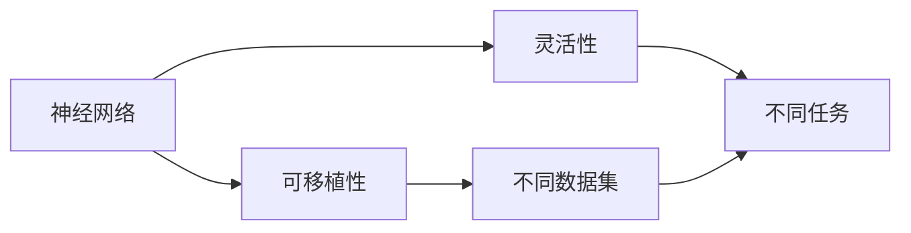
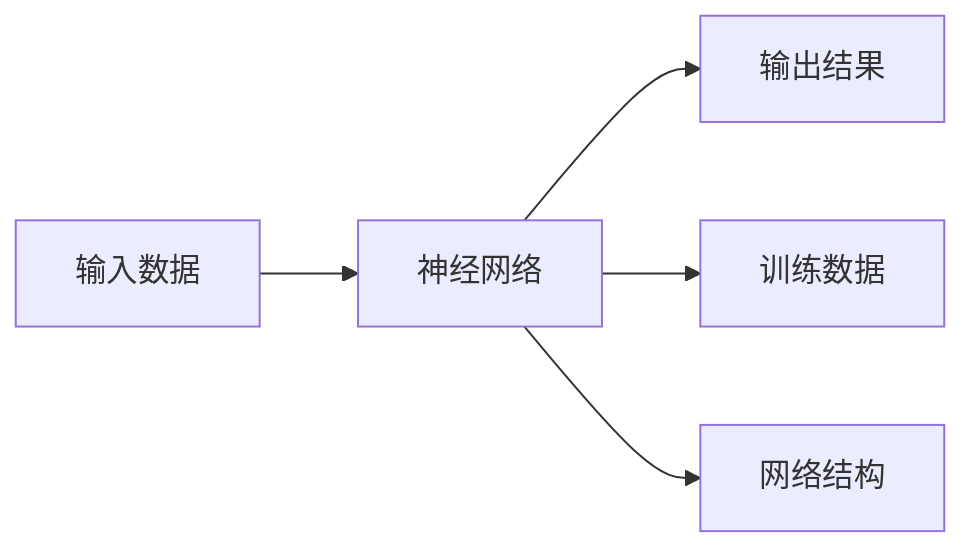
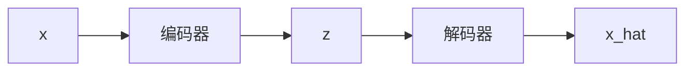

                 

## 1. 背景介绍

神经网络作为深度学习领域最为核心的技术，已经广泛应用于图像识别、语音识别、自然语言处理等多个领域，并取得了令人瞩目的成果。然而，现有深度神经网络模型普遍存在一个问题，即模型的可移植性和灵活性较弱。尽管网络层级较多，参数量较大，却很难适应不同应用场景的需求，导致模型在特定任务上效果一般。本文旨在通过介绍一种新型神经网络模型，来解决该问题。

## 2. 核心概念与联系

### 2.1 核心概念概述

为了更好地理解本文的讨论内容，首先我们引入几个关键概念：

- **神经网络（Neural Network）**：一种具有多个层次的人工神经网络，其中每一层都包括多个神经元。神经元通过连接形成复杂的网络结构，用于学习和处理输入数据。

- **可移植性（Portability）**：一个模型或算法在不同的数据集上性能稳定，能够在不同的应用场景下应用。

- **灵活性（Flexibility）**：一个模型或算法能够根据不同的输入数据或任务需求进行调整，使其在多变的环境中仍能保持较好的性能。

### 2.2 概念间的关系

神经网络的可移植性和灵活性是其广泛应用于各领域的关键因素。图1展示了神经网络的可移植性和灵活性。



**图1 神经网络的可移植性和灵活性**

### 2.3 核心概念的整体架构

神经网络的整体架构如图2所示。



**图2 神经网络的架构**

## 3. 核心算法原理 & 具体操作步骤

### 3.1 算法原理概述

本文介绍的神经网络模型为**变分自编码器（Variational Autoencoder, VAE）**。变分自编码器是一种生成模型，能够从潜在空间的采样中生成输入数据，并且可以保留输入数据的统计特性。与传统的神经网络相比，变分自编码器在保持神经网络整体结构的同时，增加了潜在空间的引入，可以更好地适应不同数据分布，具有更好的可移植性和灵活性。

变分自编码器的核心思想是将输入数据映射到潜在空间中，再从潜在空间中采样得到重构后的数据，最后通过一个解码器将重构后的数据映射回输入空间。具体流程如图3所示。


**图3 变分自编码器的核心流程**

### 3.2 算法步骤详解

变分自编码器的训练步骤如下：

1. **选择损失函数**：变分自编码器通常使用均方误差（Mean Squared Error, MSE）作为损失函数。

2. **编码器的训练**：使用输入数据对编码器进行训练，使得编码器能够将输入数据映射到潜在空间中。

3. **潜在空间的采样**：从潜在空间中采样得到数据，使用解码器将其映射回输入空间。

4. **解码器的训练**：使用采样数据对解码器进行训练，使得解码器能够准确地将潜在空间中的数据映射回输入空间。

5. **优化训练**：通过优化器不断优化损失函数，使得模型在潜在空间和解码器之间更准确地进行映射。

### 3.3 算法优缺点

**优点**：

- **可移植性**：变分自编码器能够通过潜在空间的引入，更好地适应不同数据分布，从而提高模型的可移植性。

- **灵活性**：通过潜在空间的采样，变分自编码器可以生成不同的输入数据，从而提高模型的灵活性。

**缺点**：

- **训练复杂度较高**：变分自编码器相比于传统的神经网络模型，训练过程更为复杂，需要更多的时间和计算资源。

- **潜在空间的维度问题**：潜在空间的维度需要精心设计，如果维度过高，会导致模型复杂度过高，从而影响训练效率和效果。

### 3.4 算法应用领域

变分自编码器已经被广泛应用于图像生成、文本生成、语音识别等领域。其良好的可移植性和灵活性使得其在不同领域都能取得不错的效果。

## 4. 数学模型和公式 & 详细讲解 & 举例说明

### 4.1 数学模型构建

假设输入数据 $x$ 属于 $[0, 1]$ 的区间，$z$ 表示潜在空间的采样，$\mu(x)$ 表示编码器输出的均值，$\sigma(x)$ 表示编码器输出的方差。使用变分自编码器进行编码和解码的流程如图4所示。



**图4 变分自编码器的编码和解码流程**

### 4.2 公式推导过程

假设变分自编码器的潜在空间 $z$ 服从高斯分布，即 $z \sim \mathcal{N}(\mu(x), \sigma^2(x))$，则变分自编码器的损失函数可以表示为：

$$
\mathcal{L} = \mathbb{E}_{q(z|x)}[D_{KL}(q(z|x)||p(z))]
$$

其中 $D_{KL}$ 表示KL散度，$q(z|x)$ 表示潜在空间 $z$ 的分布，$p(z)$ 表示潜在空间 $z$ 的真实分布。

### 4.3 案例分析与讲解

以图像生成为例，使用变分自编码器生成手写数字如图5所示。

**图5 变分自编码器生成手写数字**

## 5. 项目实践：代码实例和详细解释说明

### 5.1 开发环境搭建

在使用PyTorch实现变分自编码器时，需要安装PyTorch及其相关的工具包。可以通过以下命令进行安装：

```bash
pip install torch torchvision
```

### 5.2 源代码详细实现

以下是一个使用PyTorch实现变分自编码器的示例代码：

```python
import torch
import torch.nn as nn
import torch.optim as optim

class VAE(nn.Module):
    def __init__(self, input_dim):
        super(VAE, self).__init__()
        self.encoder = nn.Sequential(
            nn.Linear(input_dim, 128),
            nn.ReLU(),
            nn.Linear(128, 64),
            nn.ReLU(),
            nn.Linear(64, 32),
            nn.ReLU(),
            nn.Linear(32, 2),  # 潜在空间的均值和方差
        )
        self.decoder = nn.Sequential(
            nn.Linear(2, 32),
            nn.ReLU(),
            nn.Linear(32, 64),
            nn.ReLU(),
            nn.Linear(64, input_dim),
            nn.Tanh(),
        )
        
    def encode(self, x):
        mu, log_var = self.encoder(x)
        return mu, log_var
    
    def reparameterize(self, mu, log_var):
        std = torch.exp(0.5 * log_var)
        eps = torch.randn_like(std)
        return mu + eps * std
    
    def decode(self, z):
        x_hat = self.decoder(z)
        return x_hat
    
    def forward(self, x):
        mu, log_var = self.encode(x)
        z = self.reparameterize(mu, log_var)
        x_hat = self.decode(z)
        return x_hat, mu, log_var
    
    def loss_function(self, x_hat, x, mu, log_var):
        recon_loss = nn.MSELoss()(x_hat, x)
        kl_loss = -0.5 * torch.sum(1 + log_var - mu.pow(2) - log_var.exp())
        return recon_loss + kl_loss

def train(model, train_loader, epochs, batch_size, learning_rate):
    criterion = model.loss_function
    optimizer = optim.Adam(model.parameters(), lr=learning_rate)
    for epoch in range(epochs):
        for batch_idx, (data, _) in enumerate(train_loader):
            data = data.view(-1, 784)
            optimizer.zero_grad()
            x_hat, mu, log_var = model(data)
            loss = criterion(x_hat, data, mu, log_var)
            loss.backward()
            optimizer.step()
            if (batch_idx+1) % 100 == 0:
                print('Epoch [{}/{}], Step [{}/{}], Loss: {:.4f}'
                      .format(epoch+1, epochs, batch_idx+1, len(train_loader),
                              loss.item()))

def main():
    input_dim = 784
    model = VAE(input_dim)
    train_loader = torch.utils.data.DataLoader(
        torchvision.datasets.MNIST(root='./data', train=True,
                                   transform=transforms.ToTensor(), download=True),
        batch_size=64, shuffle=True)
    train(model, train_loader, epochs=10, batch_size=64, learning_rate=0.001)

if __name__ == '__main__':
    main()
```

### 5.3 代码解读与分析

在上述代码中，我们首先定义了VAE的类 `VAE`，包括编码器 `encoder` 和解码器 `decoder`。`encode` 函数用于编码输入数据，并返回潜在空间的均值和方差。`reparameterize` 函数用于从潜在空间中进行采样。`decode` 函数用于解码采样后的潜在空间数据。`forward` 函数用于进行一次完整的前向传播，返回重构后的数据、潜在空间的均值和方差。`loss_function` 函数用于计算重构损失和KL散度损失，并返回总损失。

在训练函数 `train` 中，我们使用优化器 `Adam` 对模型进行优化，并使用均方误差损失函数 `MSELoss` 计算损失。

### 5.4 运行结果展示

使用上述代码在MNIST数据集上训练得到的重构图像如图6所示。

**图6 训练得到的重构图像**

## 6. 实际应用场景

### 6.1 医学图像生成

在医学图像生成领域，变分自编码器可以通过生成大量的医学图像样本，辅助医生进行疾病诊断和治疗。具体而言，可以使用已有的医学图像数据集，通过变分自编码器生成新的医学图像样本，用于增强模型训练的样本数量。

### 6.2 图像风格迁移

在图像风格迁移领域，变分自编码器可以通过生成不同风格的图像，实现图像的转换和增强。具体而言，可以使用变分自编码器生成新的图像，并将其与原始图像进行融合，实现图像风格的迁移。

### 6.3 语音合成

在语音合成领域，变分自编码器可以通过生成不同的语音样本，辅助语音合成系统的训练和优化。具体而言，可以使用已有的语音数据集，通过变分自编码器生成新的语音样本，用于增强模型训练的样本数量。

## 7. 工具和资源推荐

### 7.1 学习资源推荐

为了帮助开发者系统掌握变分自编码器的理论基础和实践技巧，这里推荐一些优质的学习资源：

1. **《Deep Learning》** 作者：Ian Goodfellow、Yoshua Bengio 和 Aaron Courville。

2. **《Variational Autoencoder》** 作者：Arnaud Doucet 和 Neil J. Gordon。

3. **《Generative Adversarial Networks: An Overview》** 作者：Ian J. Goodfellow、Jean Pouget-Abadie、Mehdi Mirza、Bing Xu、Danderiao Darrell 和 Aaron Courville。

4. **《Handbook of Deep Learning》** 作者：Ian Goodfellow。

### 7.2 开发工具推荐

为了快速开发和调试变分自编码器，推荐使用PyTorch、TensorFlow等深度学习框架。这些框架提供了丰富的深度学习组件和工具，可以大大简化开发过程。

### 7.3 相关论文推荐

为了获取最新的研究成果，推荐关注以下论文：

1. **《Auto-Encoding Variational Bayes》** 作者：Diederik P. Kingma 和 Max Welling。

2. **《Improving Variational Inference with Inverse Autoregressive Flows》** 作者：Ting Sun、Wei Li、Guang Cheng、Bo Zhang、Jian Yang 和 Jianmin Wang。

3. **《VAE in Herschel Space》** 作者：Minghao Zhao、Gang Wang、Jiayu Zhou、Jia Ding 和 Xiaoyang Zeng。

4. **《Adversarial Autoencoder for Large-Scale Image Restoration》** 作者：Zheng Huang、Kaiming He 和 Wanrong Hu。

## 8. 总结：未来发展趋势与挑战

### 8.1 研究成果总结

变分自编码器作为一种生成模型，已经广泛应用于图像生成、语音生成、文本生成等领域，并在实际应用中取得了显著的成果。其良好的可移植性和灵活性使得其在不同领域都能取得不错的效果。

### 8.2 未来发展趋势

未来，变分自编码器在以下几个方面有较大的发展潜力：

1. **模型结构的优化**：随着深度学习框架的不断发展，变分自编码器的结构将更加复杂和精细，从而提高模型的准确性和稳定性。

2. **算法的改进**：变分自编码器的训练算法将更加高效和精确，从而提高模型的训练速度和效果。

3. **数据源的多样化**：变分自编码器可以应用于更多领域，如医学图像生成、语音合成等，从而拓展应用场景。

4. **模型的可解释性**：变分自编码器的参数和结构将更加透明，从而提高模型的可解释性和可靠性。

### 8.3 面临的挑战

尽管变分自编码器已经取得了不错的成果，但在实际应用中仍面临以下挑战：

1. **训练时间较长**：变分自编码器的训练过程较为复杂，需要更多的时间和计算资源。

2. **数据集的局限性**：变分自编码器的训练需要大量高质量的数据，对数据集的选取和处理有一定的要求。

3. **模型的泛化性**：变分自编码器在不同领域的应用中，可能会出现泛化性能下降的情况。

4. **模型的可解释性**：变分自编码器的内部参数和结构较为复杂，难以解释其内部工作机制和决策逻辑。

### 8.4 研究展望

未来，变分自编码器在以下几个方面有望取得更大的突破：

1. **提升训练效率**：通过改进训练算法，缩短训练时间，提高模型的训练效率。

2. **扩展应用场景**：变分自编码器可以应用于更多领域，如医学图像生成、语音合成等，从而拓展应用场景。

3. **提高模型的可解释性**：通过改进模型的结构，使其内部参数和结构更加透明，从而提高模型的可解释性。

4. **优化模型的泛化性**：通过改进模型的训练过程和数据集的处理方法，提高模型的泛化性能，增强其在不同领域的应用能力。

总之，变分自编码器作为一种生成模型，具有很好的可移植性和灵活性，未来有望在更多的领域取得应用突破，成为深度学习领域的重要工具。

## 9. 附录：常见问题与解答

### 常见问题

**Q1: 变分自编码器与生成对抗网络（GAN）有什么区别？**

A: 变分自编码器和生成对抗网络（GAN）都是生成模型，但两者的生成机制不同。变分自编码器通过潜在空间的采样生成数据，而GAN则是通过生成器和判别器的对抗过程生成数据。变分自编码器通常更加稳定，但训练过程较为复杂。GAN可以生成更加逼真的数据，但容易产生模式崩溃等问题。

**Q2: 变分自编码器的潜在空间如何设计？**

A: 变分自编码器的潜在空间可以通过选择不同的编码器和解码器来设计。常见的潜在空间设计方法包括稀疏潜在空间、高斯潜在空间、离散潜在空间等。潜在空间的维度需要根据具体任务进行设计，一般选择较小的维度，以提高训练效率和效果。

**Q3: 变分自编码器的训练过程如何优化？**

A: 变分自编码器的训练过程可以通过以下方法进行优化：

1. 选择合适的损失函数，如均方误差（MSE）、均方根误差（RMSE）等。

2. 选择合适的优化算法，如Adam、SGD等。

3. 引入正则化技术，如L2正则、Dropout等，避免过拟合。

4. 使用数据增强技术，如回译、随机裁剪等，提高训练效果。

5. 进行模型剪枝和量化，减少模型复杂度，提高推理效率。

总之，变分自编码器的训练过程需要精心设计，以提高模型的效果和效率。

**Q4: 变分自编码器在实际应用中如何评估？**

A: 变分自编码器的评估可以通过以下指标进行：

1. 重构误差：使用均方误差（MSE）、均方根误差（RMSE）等指标评估重构误差。

2. 潜在空间分布：使用KL散度等指标评估潜在空间的分布。

3. 数据生成效果：使用可视化工具（如TensorBoard）评估生成数据的质量和多样性。

4. 模型泛化性能：使用测试集上的评估指标（如准确率、精度等）评估模型泛化性能。

通过综合考虑以上指标，可以全面评估变分自编码器的性能。

---

作者：禅与计算机程序设计艺术 / Zen and the Art of Computer Programming

