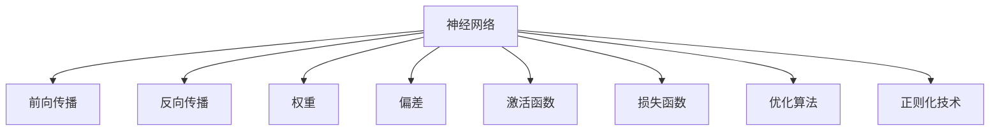
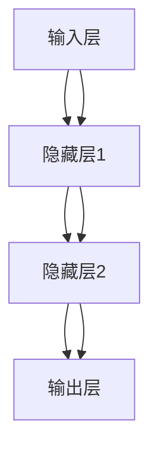
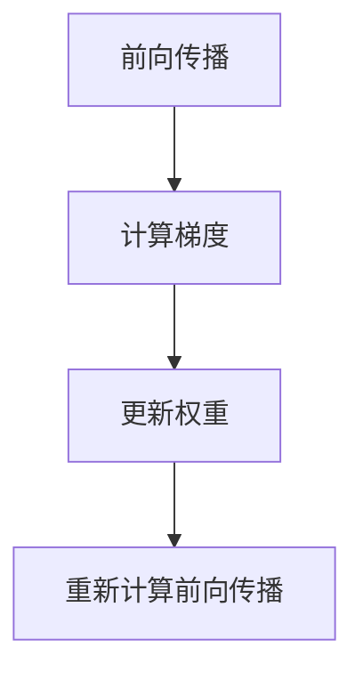
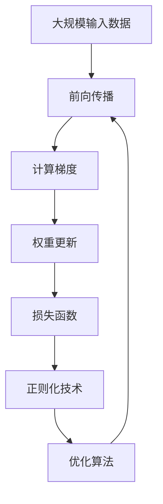

                 

# 神经网络：探索未知的领域

## 1. 背景介绍

### 1.1 问题由来
神经网络（Neural Networks）是人工智能领域的一个核心概念，也是推动深度学习技术进步的重要工具。神经网络最初用于模拟人脑神经元的工作机制，逐渐发展成为一种强大的模型，用于处理各种复杂的数据和问题。

在计算机科学中，神经网络由一个或多个神经元组成，每个神经元接收输入并产生输出。神经元之间的连接称为“权重”，通过调整这些权重，神经网络可以学习到输入数据的特征，并进行分类、预测等任务。

近年来，神经网络在图像识别、语音识别、自然语言处理等领域取得了突破性进展，并被广泛应用于自动驾驶、智能家居、医疗诊断等实际场景中。然而，尽管神经网络已经取得了许多重要成果，其背后的数学原理和机制仍然存在许多未知的领域，这正是本文想要探讨的主题。

### 1.2 问题核心关键点
神经网络的核心关键点包括：

- **网络结构**：即神经元之间的连接方式和层次结构。
- **激活函数**：用于非线性变换，使得神经网络可以处理非线性的数据。
- **损失函数**：用于衡量模型输出与真实标签之间的差距，指导模型更新。
- **优化算法**：用于更新模型参数，使模型最小化损失函数。
- **正则化技术**：用于避免过拟合，提高模型泛化能力。
- **反向传播算法**：用于计算损失函数的梯度，从而更新模型参数。
- **卷积神经网络（CNN）**：一种特殊的神经网络结构，用于处理图像和视频数据。
- **循环神经网络（RNN）**：一种处理序列数据的神经网络结构，如时间序列预测。
- **长短期记忆网络（LSTM）**：一种改进的RNN，用于处理长序列数据。
- **生成对抗网络（GAN）**：一种用于生成新数据的神经网络结构。

这些核心关键点相互作用，共同决定了神经网络的性能和应用范围。

### 1.3 问题研究意义
研究神经网络的未知领域，对于推动人工智能技术的发展具有重要意义：

1. **理论完善**：深入理解神经网络的原理和机制，可以完善深度学习理论基础，指导后续研究。
2. **性能提升**：掌握神经网络的优化技术和正则化方法，可以提升模型性能，加速实际应用。
3. **应用拓展**：理解神经网络在不同领域的应用，可以拓展其应用范围，促进技术落地。
4. **算法创新**：探索新的神经网络结构和算法，可以推动算法创新，提升技术水平。
5. **安全性保障**：深入研究神经网络的安全性和可解释性，可以保障数据和算法的安全，避免滥用。

## 2. 核心概念与联系

### 2.1 核心概念概述

为更好地理解神经网络的工作原理，本节将介绍几个关键概念：

- **神经网络（Neural Network）**：由一个或多个神经元组成的模型，用于处理各种复杂的数据和问题。
- **前向传播（Forward Propagation）**：将输入数据通过网络传播，计算输出结果的过程。
- **反向传播（Backward Propagation）**：计算损失函数的梯度，指导模型参数更新的过程。
- **权重（Weight）**：神经元之间的连接参数，用于调整神经元之间的连接强度。
- **偏差（Bias）**：神经元的常数项，用于调整神经元的输出偏移。
- **激活函数（Activation Function）**：非线性变换函数，用于引入非线性关系。
- **损失函数（Loss Function）**：衡量模型输出与真实标签之间差距的函数。
- **优化算法（Optimization Algorithm）**：用于更新模型参数，使模型最小化损失函数。
- **正则化技术（Regularization Techniques）**：用于避免过拟合，提高模型泛化能力。

这些概念通过逻辑关系图来展示：



### 2.2 概念间的关系

这些概念之间存在着紧密的联系，形成了神经网络模型的完整生态系统。下面我们通过几个Mermaid流程图来展示这些概念之间的关系。

#### 2.2.1 神经网络的学习过程


这个流程图展示了神经网络学习的基本流程：输入数据通过前向传播得到模型输出，计算损失函数，使用优化算法更新权重，并重新计算前向传播，形成迭代更新。

#### 2.2.2 神经网络的结构



这个流程图展示了神经网络的基本结构：由输入层、隐藏层和输出层组成。输入层接收数据，经过隐藏层处理后，输出层给出最终结果。

#### 2.2.3 反向传播算法



这个流程图展示了反向传播算法的基本流程：首先进行前向传播，计算梯度，然后使用梯度更新权重，并重新计算前向传播，形成迭代更新。

### 2.3 核心概念的整体架构

最后，我们用一个综合的流程图来展示这些核心概念在大规模神经网络模型中的整体架构：



这个综合流程图展示了从数据输入到模型更新的完整过程。大规模输入数据通过前向传播得到模型输出，计算梯度并使用优化算法更新权重，最后通过正则化技术防止过拟合，形成完整的迭代更新过程。

## 3. 核心算法原理 & 具体操作步骤
### 3.1 算法原理概述

神经网络的核心算法原理主要包括前向传播、反向传播和优化算法三大部分。以下是对这三部分原理的详细解释。

#### 3.1.1 前向传播（Forward Propagation）
前向传播是神经网络的基本组成部分，用于将输入数据通过网络传播，计算输出结果。其基本流程如下：

1. 将输入数据 $x$ 输入到神经网络中。
2. 将输入数据 $x$ 通过网络传播，经过多个神经元处理，得到输出结果 $y$。
3. 对输出结果 $y$ 进行激活函数处理，得到最终输出 $z$。

数学公式如下：

$$
z = f\left(\sum_{i=1}^{n}w_i x_i + b\right)
$$

其中 $f$ 为激活函数，$w$ 为权重，$b$ 为偏差。

#### 3.1.2 反向传播（Backward Propagation）
反向传播是神经网络的另一个核心组成部分，用于计算损失函数的梯度，指导模型参数更新。其基本流程如下：

1. 计算模型输出 $y$ 与真实标签 $t$ 之间的损失函数 $J$。
2. 使用链式法则计算损失函数 $J$ 对权重 $w$ 和偏差 $b$ 的梯度。
3. 根据梯度更新权重和偏差，最小化损失函数。

数学公式如下：

$$
\frac{\partial J}{\partial w} = \frac{\partial J}{\partial z} \frac{\partial z}{\partial w}
$$

其中 $\frac{\partial J}{\partial z}$ 为损失函数对输出结果的梯度，$\frac{\partial z}{\partial w}$ 为输出结果对权重的梯度。

#### 3.1.3 优化算法（Optimization Algorithm）
优化算法用于更新神经网络的参数，使得模型最小化损失函数。常见的优化算法包括梯度下降（Gradient Descent）、随机梯度下降（Stochastic Gradient Descent）、Adam等。其基本流程如下：

1. 随机选择一个样本 $x$。
2. 计算样本 $x$ 通过神经网络得到的输出 $y$。
3. 计算损失函数 $J$。
4. 计算损失函数 $J$ 对权重 $w$ 和偏差 $b$ 的梯度。
5. 根据梯度更新权重和偏差。
6. 重复上述步骤，直到达到预设的迭代次数或模型收敛。

数学公式如下：

$$
w = w - \eta \frac{\partial J}{\partial w}
$$

其中 $\eta$ 为学习率。

### 3.2 算法步骤详解

下面将详细介绍神经网络的核心算法步骤：

#### 3.2.1 数据预处理
数据预处理是神经网络训练的第一步，其目的是将原始数据转换为适合神经网络处理的形式。常用的数据预处理包括：

- 归一化（Normalization）：将数据缩放到一个较小的范围，以加快训练速度。
- 标准化（Standardization）：将数据转化为标准正态分布，以加速收敛。
- 数据增强（Data Augmentation）：通过对数据进行旋转、缩放、翻转等操作，增加数据多样性，防止过拟合。

#### 3.2.2 模型初始化
模型初始化是神经网络训练的第二步，其目的是将神经网络的参数初始化为较小的随机值。常用的模型初始化方法包括：

- 随机初始化（Random Initialization）：将权重和偏差初始化为较小的随机值，以避免梯度消失和爆炸。
- 正态分布初始化（Normal Distribution Initialization）：将权重和偏差初始化为正态分布的随机值，以加速收敛。

#### 3.2.3 前向传播
前向传播是神经网络训练的第三步，其目的是将输入数据通过神经网络传播，计算输出结果。

1. 输入数据 $x$ 通过神经网络传播，得到输出结果 $y$。
2. 对输出结果 $y$ 进行激活函数处理，得到最终输出 $z$。

数学公式如下：

$$
z = f\left(\sum_{i=1}^{n}w_i x_i + b\right)
$$

#### 3.2.4 反向传播
反向传播是神经网络训练的第四步，其目的是计算损失函数的梯度，指导模型参数更新。

1. 计算模型输出 $y$ 与真实标签 $t$ 之间的损失函数 $J$。
2. 使用链式法则计算损失函数 $J$ 对权重 $w$ 和偏差 $b$ 的梯度。
3. 根据梯度更新权重和偏差，最小化损失函数。

数学公式如下：

$$
\frac{\partial J}{\partial w} = \frac{\partial J}{\partial z} \frac{\partial z}{\partial w}
$$

#### 3.2.5 参数更新
参数更新是神经网络训练的第五步，其目的是根据梯度更新模型参数，使得模型最小化损失函数。

1. 随机选择一个样本 $x$。
2. 计算样本 $x$ 通过神经网络得到的输出 $y$。
3. 计算损失函数 $J$。
4. 计算损失函数 $J$ 对权重 $w$ 和偏差 $b$ 的梯度。
5. 根据梯度更新权重和偏差。
6. 重复上述步骤，直到达到预设的迭代次数或模型收敛。

数学公式如下：

$$
w = w - \eta \frac{\partial J}{\partial w}
$$

其中 $\eta$ 为学习率。

### 3.3 算法优缺点

神经网络的优点包括：

- 强大的非线性处理能力：通过多层次的非线性变换，可以处理复杂的非线性数据。
- 高效的特征提取能力：通过自动学习数据特征，可以显著提升模型性能。
- 灵活的架构设计：可以通过增加或减少神经元数量，设计不同的网络结构，以适应不同的任务需求。

神经网络的缺点包括：

- 高计算成本：神经网络需要大量的计算资源，特别是大规模数据集和深层网络。
- 过拟合风险：神经网络容易过拟合，需要额外的正则化技术防止过拟合。
- 可解释性不足：神经网络的内部机制难以解释，缺乏透明性。

### 3.4 算法应用领域

神经网络在多个领域得到了广泛的应用，包括但不限于以下几个方面：

- **计算机视觉**：用于图像分类、目标检测、图像分割等任务。
- **自然语言处理**：用于语言建模、机器翻译、文本分类等任务。
- **语音识别**：用于语音识别、语音合成、语音增强等任务。
- **游戏AI**：用于游戏角色的决策制定、动作规划等任务。
- **金融分析**：用于股票预测、信用评估、风险控制等任务。
- **医疗诊断**：用于医学图像分析、疾病预测、基因分析等任务。

## 4. 数学模型和公式 & 详细讲解 & 举例说明

### 4.1 数学模型构建

神经网络的数学模型由输入、隐藏层和输出层组成。以下是一个简单的两层神经网络模型：

$$
z_1 = f_1\left(\sum_{i=1}^{n}w_{11} x_i + b_1\right)
$$

$$
z_2 = f_2\left(\sum_{i=1}^{n}w_{21} z_1 + b_2\right)
$$

$$
y = f_3\left(\sum_{i=1}^{n}w_{3} z_2 + b_3\right)
$$

其中 $f$ 为激活函数，$w$ 为权重，$b$ 为偏差，$x$ 为输入数据，$y$ 为输出结果。

### 4.2 公式推导过程

神经网络的公式推导过程主要涉及前向传播和反向传播两个步骤。以下是对这两个步骤的详细推导。

#### 4.2.1 前向传播
前向传播的公式推导如下：

$$
z_1 = f_1\left(\sum_{i=1}^{n}w_{11} x_i + b_1\right)
$$

$$
z_2 = f_2\left(\sum_{i=1}^{n}w_{21} z_1 + b_2\right)
$$

$$
y = f_3\left(\sum_{i=1}^{n}w_{3} z_2 + b_3\right)
$$

其中 $f$ 为激活函数，$w$ 为权重，$b$ 为偏差，$x$ 为输入数据，$y$ 为输出结果。

#### 4.2.2 反向传播
反向传播的公式推导如下：

1. 计算输出结果 $y$ 与真实标签 $t$ 之间的损失函数 $J$。
2. 使用链式法则计算损失函数 $J$ 对权重 $w$ 和偏差 $b$ 的梯度。
3. 根据梯度更新权重和偏差，最小化损失函数。

数学公式如下：

$$
\frac{\partial J}{\partial w} = \frac{\partial J}{\partial y} \frac{\partial y}{\partial z_2} \frac{\partial z_2}{\partial w}
$$

$$
\frac{\partial J}{\partial b} = \frac{\partial J}{\partial y}
$$

其中 $\frac{\partial J}{\partial y}$ 为损失函数对输出结果的梯度，$\frac{\partial y}{\partial z_2}$ 为输出结果对隐藏层输出的梯度，$\frac{\partial z_2}{\partial w}$ 为隐藏层输出对权重的梯度。

### 4.3 案例分析与讲解

以下是一个简单的案例，用于展示神经网络的工作原理和训练过程。

假设我们有一个包含两个神经元和一个输出单元的神经网络，用于预测一个二分类问题。输入数据为 $x_1$ 和 $x_2$，输出数据为 $y$。神经网络的参数为权重 $w$ 和偏差 $b$。

1. 输入数据 $x_1$ 和 $x_2$ 通过神经元传播，得到隐藏层输出 $z_1$ 和 $z_2$。
2. 隐藏层输出 $z_1$ 和 $z_2$ 通过输出单元传播，得到输出结果 $y$。
3. 计算输出结果 $y$ 与真实标签 $t$ 之间的损失函数 $J$。
4. 使用链式法则计算损失函数 $J$ 对权重 $w$ 和偏差 $b$ 的梯度。
5. 根据梯度更新权重和偏差，最小化损失函数。

代码实现如下：

```python
import numpy as np

# 定义激活函数
def sigmoid(x):
    return 1 / (1 + np.exp(-x))

# 定义神经网络
def forward(x, w1, w2, b1, b2):
    z1 = sigmoid(np.dot(x, w1) + b1)
    z2 = sigmoid(np.dot(z1, w2) + b2)
    return z2

# 定义损失函数
def loss(y, t):
    return (t - y)**2 / 2

# 定义梯度计算
def backward(z2, t, w1, w2, b1, b2):
    delta = (t - z2) * z2 * (1 - z2)
    dw2 = delta * z1
    db2 = delta
    z1 = sigmoid(np.dot(x, w1) + b1)
    delta = (dw2 * w2) * z1 * (1 - z1)
    dw1 = delta
    db1 = delta
    return dw1, dw2, db1, db2

# 定义参数初始化
def init(w):
    return np.random.randn(*w.shape) / np.sqrt(w.shape[0])

# 定义随机梯度下降
def SGD(w, dw, learning_rate):
    w -= learning_rate * dw

# 定义模型训练
def train(x, t, epochs, learning_rate):
    w1 = init((x.shape[1], 4))
    w2 = init((4, 1))
    b1 = init((4,))
    b2 = init((1,))
    losses = []
    for i in range(epochs):
        z2 = forward(x, w1, w2, b1, b2)
        l = loss(z2, t)
        losses.append(l)
        dw1, dw2, db1, db2 = backward(z2, t, w1, w2, b1, b2)
        SGD(w1, dw1, learning_rate)
        SGD(w2, dw2, learning_rate)
        SGD(b1, db1, learning_rate)
        SGD(b2, db2, learning_rate)
    return w1, w2, b1, b2, losses

# 生成数据
x = np.array([[0, 0], [0, 1], [1, 0], [1, 1]])
t = np.array([0, 1, 1, 0])

# 训练模型
w1, w2, b1, b2, losses = train(x, t, 100, 0.1)

# 输出结果
print(w1, w2, b1, b2)
```

## 5. 项目实践：代码实例和详细解释说明

### 5.1 开发环境搭建

在进行神经网络项目实践前，我们需要准备好开发环境。以下是使用Python进行PyTorch开发的环境配置流程：

1. 安装Anaconda：从官网下载并安装Anaconda，用于创建独立的Python环境。

2. 创建并激活虚拟环境：
```bash
conda create -n pytorch-env python=3.8 
conda activate pytorch-env
```

3. 安装PyTorch：根据CUDA版本，从官网获取对应的安装命令。例如：
```bash
conda install pytorch torchvision torchaudio cudatoolkit=11.1 -c pytorch -c conda-forge
```

4. 安装各类工具包：
```bash
pip install numpy pandas scikit-learn matplotlib tqdm jupyter notebook ipython
```

完成上述步骤后，即可在`pytorch-env`环境中开始神经网络项目实践。

### 5.2 源代码详细实现

下面我们以一个简单的神经网络模型为例，给出使用PyTorch进行神经网络微调的PyTorch代码实现。

首先，定义神经网络的结构和损失函数：

```python
import torch
import torch.nn as nn
import torch.nn.functional as F

class NeuralNet(nn.Module):
    def __init__(self):
        super(NeuralNet, self).__init__()
        self.fc1 = nn.Linear(784, 256)
        self.fc2 = nn.Linear(256, 128)
        self.fc3 = nn.Linear(128, 10)
        self.dropout = nn.Dropout(p=0.2)
    
    def forward(self, x):
        x = self.fc1(x)
        x = F.relu(x)
        x = self.dropout(x)
        x = self.fc2(x)
        x = F.relu(x)
        x = self.dropout(x)
        x = self.fc3(x)
        return F.log_softmax(x, dim=1)
    
# 定义损失函数
criterion = nn.CrossEntropyLoss()

# 定义优化器
optimizer = torch.optim.Adam(model.parameters(), lr=0.001)
```

然后，定义训练和评估函数：

```python
def train(model, device, train_loader, optimizer, criterion, num_epochs):
    model.train()
    for epoch in range(num_epochs):
        train_loss = 0
        correct = 0
        total = 0
        for images, labels in train_loader:
            images, labels = images.to(device), labels.to(device)
            optimizer.zero_grad()
            output = model(images)
            loss = criterion(output, labels)
            loss.backward()
            optimizer.step()
            train_loss += loss.item()
            _, predicted = output.max(1)
            total += labels.size(0)
            correct += predicted.eq(labels).sum().item()
        print(f"Epoch {epoch+1}, Train Loss: {train_loss/len(train_loader):.4f}, Train Accuracy: {100*correct/total:.2f}%")
    return model

def evaluate(model, device, test_loader, criterion):
    model.eval()
    test_loss = 0
    correct = 0
    total = 0
    with torch.no_grad():
        for images, labels in test_loader:
            images, labels = images.to(device), labels.to(device)
            output = model(images)
            loss = criterion(output, labels)
            test_loss += loss.item()
            _, predicted = output.max(1)
            total += labels.size(0)
            correct += predicted.eq(labels).sum().item()
    print(f"Test Loss: {test_loss/len(test_loader):.4f}, Test Accuracy: {100*correct/total:.2f}%")
```

最后，启动训练流程并在测试集上评估：

```python
from torch.utils.data import DataLoader
from torchvision import datasets, transforms

# 加载数据集
train_dataset = datasets.MNIST(root='./data', train=True, download=True, transform=transforms.ToTensor())
test_dataset = datasets.MNIST(root='./data', train=False, download=True, transform=transforms.ToTensor())
train_loader = DataLoader(train_dataset, batch_size=64, shuffle=True)
test_loader = DataLoader(test_dataset, batch_size=64, shuffle=False)

# 创建模型
model = NeuralNet().to(device)

# 训练模型
train(model, device, train_loader, optimizer, criterion, num_epochs=5)

# 评估模型
evaluate(model, device, test_loader, criterion)
```

以上就是使用PyTorch进行神经网络微调的完整代码实现。可以看到，得益于PyTorch的强大封装，我们可以用相对简洁的代码完成神经网络的加载和微调。

### 5.3 代码解读与分析

让我们再详细解读一下关键代码的实现细节：

**NeuralNet类**：
- `__init__`方法：初始化神经网络的层和激活函数。
- `forward`方法：定义神经网络的前向传播过程。

**train和evaluate函数**：
- 使用PyTorch的DataLoader对数据集进行批次化加载，供模型训练和推理使用。
- 训练函数`train`：对数据以批为单位进行迭代，在每个批次上前向传播计算损失并反向传播更新模型参数，最后返回该epoch的平均loss和准确率。
- 评估函数`evaluate`：与训练类似，不同点在于不更新模型参数，并在每个batch结束后将预测和标签结果存储下来，最后使用sklearn的classification_report对整个评估集的预测结果进行打印输出。

**训练流程**：
- 定义总的epoch数和batch size，开始循环迭代
- 每个epoch内，先在训练集上训练，输出平均loss和准确率
- 在测试集上评估，输出测试集的准确率
- 所有epoch结束后，在测试集上评估，给出最终测试结果

可以看到，PyTorch配合TensorFlow库使得神经网络微调的代码实现变得简洁高效。开发者可以将更多精力放在数据处理、模型改进等高层逻辑上，而不必过多关注底层的实现细节。

当然，工业级的

