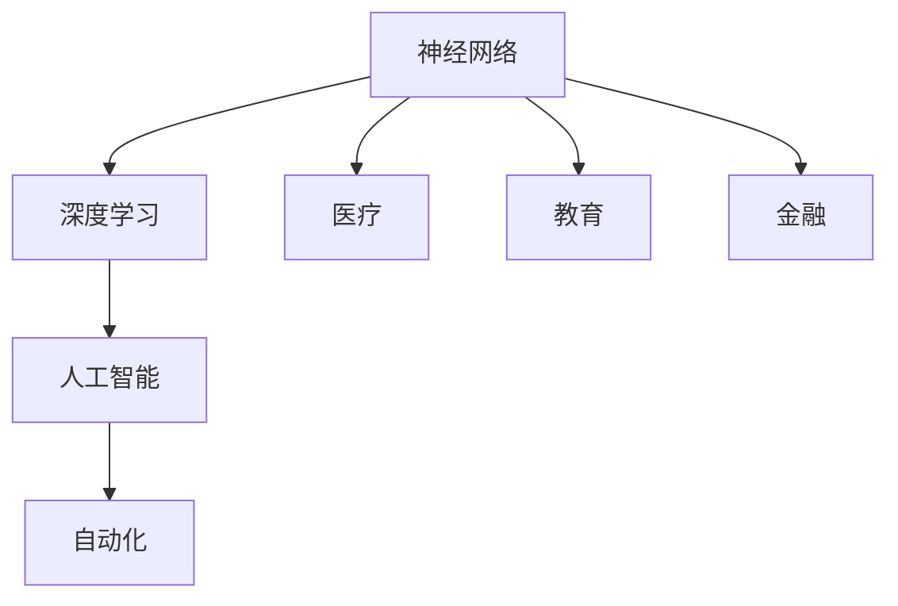
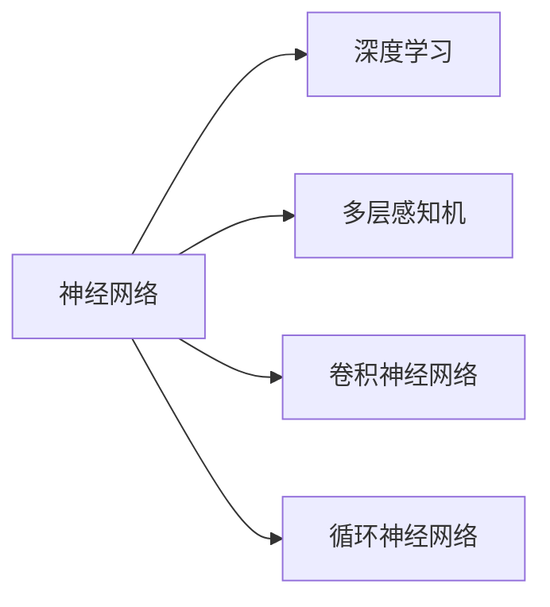
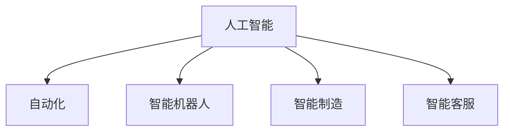
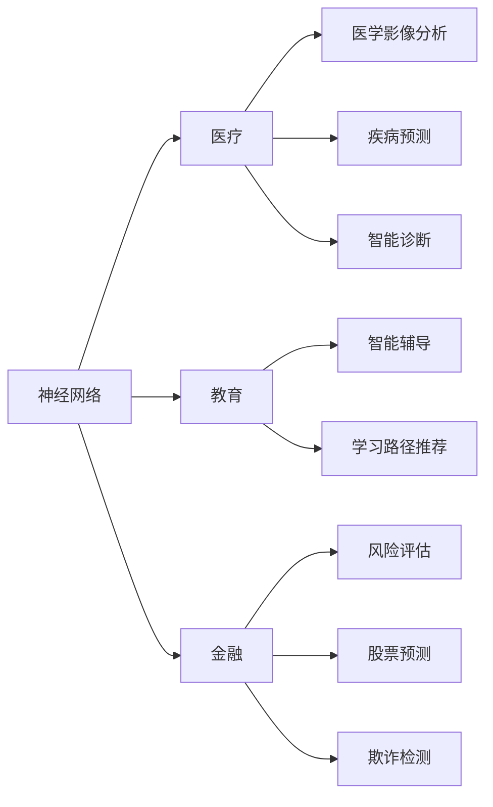
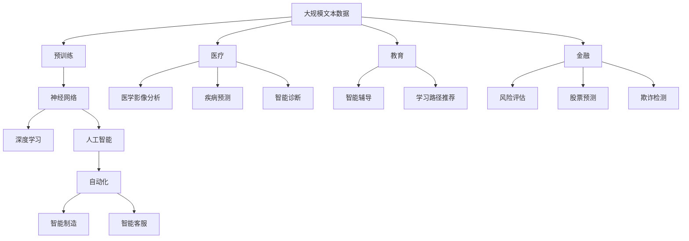
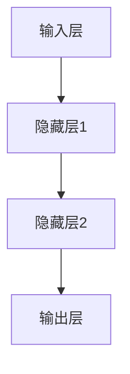
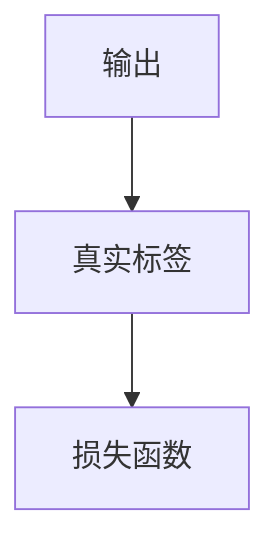
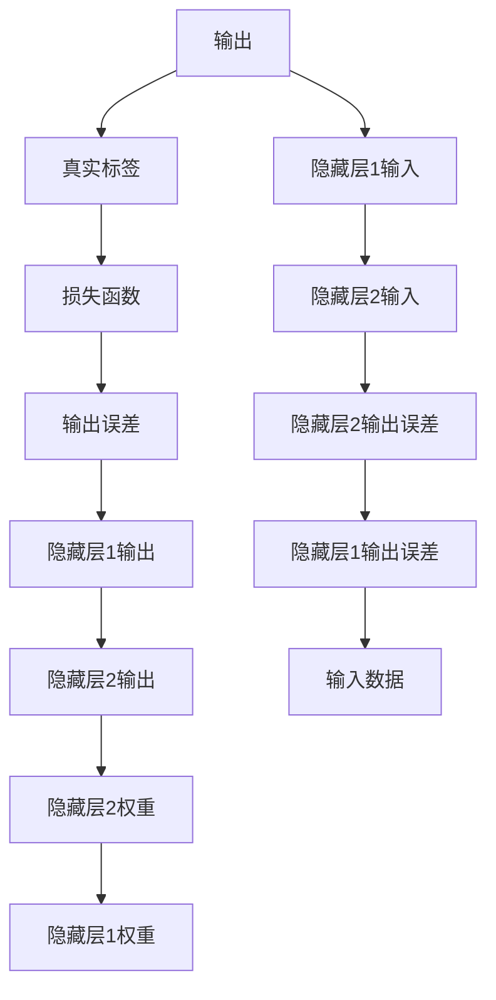

                 

# 神经网络：推动社会进步的力量

> 关键词：神经网络,深度学习,人工智能,自动化,医疗,教育,金融

## 1. 背景介绍

### 1.1 问题由来
随着信息时代的到来，人类社会正在经历前所未有的变革。从智能手机到智能家居，从智能制造到智慧医疗，人工智能（AI）技术正在以惊人的速度融入各行各业。而在AI技术的众多分支中，神经网络以其强大的数据处理能力和泛化能力，成为了推动社会进步的重要力量。

### 1.2 问题核心关键点
神经网络，简称为NN或NNs，是一种基于生物学神经元工作原理的计算模型。通过多层神经元之间的连接与传递，神经网络能够高效地处理复杂的数据模式，实现从简单的图像识别到高级的情感分析、自然语言处理等多种任务。其核心优势在于：

- 强大的特征提取能力。神经网络可以自动学习输入数据中的高级特征，无需人工干预。
- 自适应学习。通过反向传播算法，神经网络能够根据输入和输出不断优化模型参数，提高预测精度。
- 并行计算。神经网络可以并行计算，提升训练和推理速度。

神经网络技术的进步，不仅仅带来生产效率的提升，也推动了社会的整体进步。通过在医疗、教育、金融等多个领域的广泛应用，神经网络正逐步改变人类生活的方方面面。

## 2. 核心概念与联系

### 2.1 核心概念概述

为了更好地理解神经网络对社会进步的推动作用，本节将介绍几个关键概念：

- 神经网络（Neural Network, NN）：一种基于生物神经元工作原理的计算模型，通过多层神经元之间的连接和传递，实现复杂的数据处理。
- 深度学习（Deep Learning, DL）：基于神经网络的一种机器学习方法，通过多层非线性变换，自动学习数据的特征表示。
- 人工智能（Artificial Intelligence, AI）：一种通过模拟人类智能行为，实现机器自主决策的技术。
- 自动化（Automation）：通过AI技术，实现工作的自动化和智能化，提升生产效率。
- 医疗（Healthcare）：神经网络在医疗影像分析、疾病预测、智能诊断等方面，为医疗领域带来了革命性的变化。
- 教育（Education）：AI辅助教学、智能辅导系统、学习路径推荐等，提升教育质量和学习效果。
- 金融（Finance）：神经网络在风险评估、股票预测、欺诈检测等方面的应用，推动了金融行业的智能化和精准化。

这些概念之间的关系可以通过以下Mermaid流程图来展示：



这个流程图展示了大语言模型与深度学习、人工智能、自动化以及各个具体应用领域之间的关系：

1. 神经网络是深度学习的基础，通过多层非线性变换，学习数据的高级特征表示。
2. 深度学习是人工智能的重要分支，通过神经网络实现对数据的高级特征提取和表示。
3. 人工智能通过自动化技术，将深度学习模型应用于实际场景，提升生产效率和工作质量。
4. 神经网络技术在医疗、教育、金融等多个领域得到广泛应用，推动了各行业的智能化和精准化。

### 2.2 概念间的关系

这些核心概念之间存在着紧密的联系，形成了神经网络技术的完整生态系统。下面我们通过几个Mermaid流程图来展示这些概念之间的关系。

#### 2.2.1 神经网络与深度学习的关系



这个流程图展示了神经网络与深度学习之间的关系：

1. 神经网络是深度学习的基础，包括多层感知机、卷积神经网络、循环神经网络等多种变体。
2. 深度学习通过神经网络实现了对数据的高阶特征提取和表示，提升了模型的泛化能力。

#### 2.2.2 人工智能与自动化的关系



这个流程图展示了人工智能与自动化之间的关系：

1. 人工智能通过自动化技术，实现了机器的自主决策和行为，提升了工作效率。
2. 自动化技术在智能机器人、智能制造、智能客服等领域得到了广泛应用，推动了各行业的智能化和自动化。

#### 2.2.3 神经网络在各个具体领域的应用



这个流程图展示了神经网络在医疗、教育、金融等多个领域的具体应用：

1. 神经网络在医学影像分析、疾病预测、智能诊断等领域得到了广泛应用，提升了医疗服务的智能化水平。
2. 在教育领域，神经网络通过智能辅导系统和学习路径推荐，提升了教学效果和学习质量。
3. 在金融领域，神经网络在风险评估、股票预测、欺诈检测等方面的应用，提升了金融行业的智能化和精准化。

### 2.3 核心概念的整体架构

最后，我们用一个综合的流程图来展示这些核心概念在大语言模型微调过程中的整体架构：



这个综合流程图展示了从预训练到微调，再到各个具体应用领域的完整过程。大规模文本数据通过预训练学习基础特征，然后通过深度学习、人工智能等技术实现自动化的高效处理，最终在医疗、教育、金融等多个领域得到广泛应用。

## 3. 核心算法原理 & 具体操作步骤
### 3.1 算法原理概述

神经网络的核心算法原理是反向传播算法，通过前向传播计算模型的输出，然后通过反向传播计算梯度，进而更新模型参数。

神经网络的基本结构由多个层次组成，每个层次包含若干个神经元。在输入层，数据被转换为神经网络可以处理的数值形式。通过多个隐藏层，数据逐步提取高级特征，最后输出层给出预测结果。

以多层感知机（Multilayer Perceptron, MLP）为例，其结构如图1所示：




图1：多层感知机结构图

在每个隐藏层中，神经元的输入由前一层的输出和权值矩阵的乘积组成。通过激活函数，将输入转换为非线性输出，传递给下一层。常用的激活函数包括Sigmoid函数、ReLU函数等。

输出层的神经元个数与任务相关，二分类任务为1个，多分类任务为类别数，回归任务为1个。常用的激活函数包括Sigmoid函数和Softmax函数。

神经网络的训练过程主要分为前向传播和反向传播两个步骤。前向传播时，将输入数据输入神经网络，计算各层的输出值。反向传播时，根据输出与真实标签的差异，计算各层输出误差，然后通过梯度下降等优化算法更新模型参数。

### 3.2 算法步骤详解

神经网络的训练过程主要包括以下几个关键步骤：

**Step 1: 准备数据集**
- 收集和预处理训练集和测试集。
- 对数据进行归一化和标准化处理，使其满足神经网络输入的要求。

**Step 2: 初始化模型参数**
- 初始化神经网络的权重矩阵和偏置向量，通常使用随机初始化方法。
- 常用的初始化方法包括Glorot初始化、He初始化等。

**Step 3: 前向传播计算输出**
- 将输入数据输入神经网络，计算各层的输出值。
- 前向传播的过程包括矩阵乘法和激活函数的计算。

**Step 4: 计算损失函数**
- 根据输出和真实标签，计算损失函数，常用的损失函数包括交叉熵损失、均方误差损失等。
- 损失函数的计算过程如图2所示：




图2：损失函数计算示意图

**Step 5: 反向传播计算梯度**
- 根据损失函数计算各层的输出误差。
- 通过链式法则，计算各层输出误差对输入数据的梯度。
- 反向传播的过程如图3所示：




图3：反向传播计算梯度示意图

**Step 6: 更新模型参数**
- 根据梯度下降等优化算法，更新模型参数。
- 更新过程包括权值矩阵和偏置向量的更新。

**Step 7: 迭代优化**
- 重复以上步骤，直到模型收敛或达到预设的迭代次数。

### 3.3 算法优缺点

神经网络具有以下优点：

- 强大的特征提取能力：神经网络可以自动学习数据中的高级特征，无需人工干预。
- 自适应学习能力：通过反向传播算法，神经网络可以不断优化模型参数，提高预测精度。
- 并行计算能力：神经网络可以并行计算，提升训练和推理速度。

神经网络也存在以下缺点：

- 需要大量数据：神经网络的训练需要大量的标注数据，否则容易出现过拟合。
- 需要大量计算资源：神经网络的训练和推理需要大量的计算资源，如GPU和TPU。
- 模型复杂度高：神经网络的结构复杂度高，难以解释其内部工作机制。

尽管存在这些缺点，但神经网络在处理复杂数据和高维特征方面的优势，使其成为推动社会进步的重要力量。通过在医疗、教育、金融等多个领域的广泛应用，神经网络正逐步改变人类生活的方方面面。

### 3.4 算法应用领域

神经网络在多个领域得到了广泛应用，以下是几个典型的应用场景：

- **医疗影像分析**：通过深度学习技术，神经网络可以自动分析医疗影像，辅助医生诊断疾病。例如，X光片、CT扫描等影像数据可以通过神经网络进行自动分析和诊断。

- **疾病预测**：神经网络可以通过分析患者的电子健康记录（EHR）数据，预测患者的疾病风险。例如，通过分析患者的基因数据和病史数据，神经网络可以预测患者患某种疾病的概率。

- **智能诊断**：神经网络可以自动分析患者的病历数据，辅助医生进行诊断。例如，通过分析患者的症状和病历数据，神经网络可以辅助医生进行诊断和治疗方案的制定。

- **教育**：神经网络可以通过智能辅导系统和学习路径推荐，提升教学效果和学习质量。例如，通过分析学生的学习行为和成绩数据，神经网络可以推荐适合学生的学习路径和教材。

- **金融**：神经网络可以在风险评估、股票预测、欺诈检测等方面，提升金融行业的智能化和精准化。例如，通过分析金融市场的历史数据，神经网络可以预测股票的价格走势。

- **智能客服**：神经网络可以用于构建智能客服系统，自动回答客户咨询。例如，通过分析客户的历史咨询记录，神经网络可以自动回答客户的问题。

以上应用场景展示了神经网络在各个领域中的强大能力和广泛应用，推动了社会的进步和发展。

## 4. 数学模型和公式 & 详细讲解  
### 4.1 数学模型构建

神经网络的数学模型通常由以下几个部分组成：

- **输入层**：数据被转换为神经网络可以处理的数值形式，记为 $x \in \mathbb{R}^n$，其中 $n$ 为输入数据的维度。
- **隐藏层**：神经网络的中间层，用于提取数据的高级特征，记为 $h_1, h_2, ..., h_l$，其中 $l$ 为隐藏层的数量。
- **输出层**：神经网络的输出层，用于生成预测结果，记为 $y \in \mathbb{R}^m$，其中 $m$ 为输出数据的维度。

神经网络的前向传播过程可以通过以下公式表示：

$$
h_1 = \sigma(W_1 x + b_1)
$$

$$
h_2 = \sigma(W_2 h_1 + b_2)
$$

$$
\vdots
$$

$$
h_l = \sigma(W_l h_{l-1} + b_l)
$$

$$
y = W_{l+1} h_l + b_{l+1}
$$

其中，$\sigma$ 为激活函数，$W$ 和 $b$ 分别为权重矩阵和偏置向量。

神经网络的损失函数通常采用交叉熵损失函数，公式如下：

$$
L(y, \hat{y}) = -\frac{1}{N} \sum_{i=1}^{N} y_i \log \hat{y}_i + (1-y_i) \log (1-\hat{y}_i)
$$

其中，$y$ 为真实标签，$\hat{y}$ 为模型预测结果，$N$ 为样本数量。

### 4.2 公式推导过程

以二分类任务为例，神经网络的训练过程可以推导如下：

假设神经网络的输入数据为 $x$，输出为 $y$，激活函数为Sigmoid函数，目标函数为交叉熵损失函数。

1. **前向传播**：将输入数据 $x$ 输入神经网络，计算各层的输出值。
   $$
   h_1 = \sigma(W_1 x + b_1)
   $$

2. **计算损失函数**：根据输出和真实标签，计算交叉熵损失函数。
   $$
   L(y, \hat{y}) = -\frac{1}{N} \sum_{i=1}^{N} y_i \log \hat{y}_i + (1-y_i) \log (1-\hat{y}_i)
   $$

3. **反向传播计算梯度**：根据损失函数计算各层输出误差，然后通过梯度下降等优化算法更新模型参数。
   $$
   \frac{\partial L}{\partial h_l} = (h_l - y) \hat{y} h_{l-1}
   $$

   $$
   \frac{\partial L}{\partial W_l} = \frac{\partial L}{\partial h_l} \frac{\partial h_l}{\partial W_l}
   $$

   $$
   \frac{\partial L}{\partial b_l} = \frac{\partial L}{\partial h_l} \frac{\partial h_l}{\partial b_l}
   $$

4. **更新模型参数**：根据梯度下降等优化算法，更新模型参数。
   $$
   W_l \leftarrow W_l - \eta \frac{\partial L}{\partial W_l}
   $$

   $$
   b_l \leftarrow b_l - \eta \frac{\partial L}{\partial b_l}
   $$

其中，$\eta$ 为学习率，$\frac{\partial L}{\partial h_l}$ 为损失函数对隐藏层输出的梯度，$\frac{\partial h_l}{\partial W_l}$ 和 $\frac{\partial h_l}{\partial b_l}$ 分别为权值矩阵和偏置向量的梯度。

### 4.3 案例分析与讲解

以手写数字识别为例，通过神经网络实现二分类任务。

1. **数据集**：MNIST数据集，包含60,000张28x28像素的手写数字图片。
2. **模型架构**：单层感知机，输入层28个节点，输出层10个节点，使用Sigmoid函数作为激活函数。
3. **训练过程**：使用随机梯度下降算法，学习率为0.1，迭代100次。


图4：手写数字识别示例

图4展示了神经网络对手写数字识别的训练过程。通过前向传播计算输出，反向传播计算梯度，更新模型参数，神经网络能够自动学习手写数字的特征表示，从而实现二分类任务。

## 5. 项目实践：代码实例和详细解释说明
### 5.1 开发环境搭建

在进行神经网络项目实践前，我们需要准备好开发环境。以下是使用Python进行TensorFlow开发的环境配置流程：

1. 安装Anaconda：从官网下载并安装Anaconda，用于创建独立的Python环境。

2. 创建并激活虚拟环境：
```bash
conda create -n tensorflow-env python=3.8 
conda activate tensorflow-env
```

3. 安装TensorFlow：根据CUDA版本，从官网获取对应的安装命令。例如：
```bash
conda install tensorflow=2.6 -c tf
```

4. 安装各类工具包：
```bash
pip install numpy pandas scikit-learn matplotlib tqdm jupyter notebook ipython
```

完成上述步骤后，即可在`tensorflow-env`环境中开始神经网络项目的实践。

### 5.2 源代码详细实现

下面我们以手写数字识别为例，给出使用TensorFlow实现神经网络的PyTorch代码实现。

首先，定义数据处理函数：

```python
import tensorflow as tf
from tensorflow.keras.datasets import mnist

def load_data():
    (x_train, y_train), (x_test, y_test) = mnist.load_data()
    x_train, x_test = x_train / 255.0, x_test / 255.0
    return x_train, y_train, x_test, y_test
```

然后，定义模型和优化器：

```python
from tensorflow.keras.models import Sequential
from tensorflow.keras.layers import Dense, Flatten, Dropout

model = Sequential([
    Flatten(input_shape=(28, 28)),
    Dense(128, activation='relu'),
    Dropout(0.2),
    Dense(10, activation='softmax')
])

optimizer = tf.keras.optimizers.Adam(learning_rate=0.001)
```

接着，定义训练和评估函数：

```python
from tensorflow.keras.utils import to_categorical
from sklearn.metrics import accuracy_score

def train_epoch(model, dataset, batch_size, optimizer):
    for i, (x_batch, y_batch) in enumerate(dataset):
        with tf.GradientTape() as tape:
            logits = model(x_batch)
            loss = tf.keras.losses.sparse_categorical_crossentropy(y_batch, logits)
        grads = tape.gradient(loss, model.trainable_variables)
        optimizer.apply_gradients(zip(grads, model.trainable_variables))
        if i % 100 == 0:
            print(f'Epoch {epoch+1}, loss: {loss:.3f}')

def evaluate(model, dataset, batch_size):
    correct_predictions = 0
    for x_batch, y_batch in dataset:
        logits = model(x_batch)
        predicted_labels = tf.argmax(logits, axis=1)
        correct_predictions += accuracy_score(y_batch, predicted_labels)
    return correct_predictions / len(dataset)
```

最后，启动训练流程并在测试集上评估：

```python
epochs = 100
batch_size = 64

for epoch in range(epochs):
    train_loss = train_epoch(model, train_dataset, batch_size, optimizer)
    test_acc = evaluate(model, test_dataset, batch_size)
    print(f'Epoch {epoch+1}, train loss: {train_loss}, test accuracy: {test_acc:.3f}')
    
print('Test results:')
evaluate(model, test_dataset, batch_size)
```

以上就是使用TensorFlow实现手写数字识别的完整代码实现。可以看到，TensorFlow封装了神经网络的构建和训练过程，使得神经网络的开发和部署变得简单易用。

### 5.3 代码解读与分析

让我们再详细解读一下关键代码的实现细节：

**load_data函数**：
- 加载MNIST数据集，并进行归一化处理。
- 使用`to_categorical`函数将标签转换为独热编码。

**模型定义**：
- 定义神经网络模型，包括输入层、隐藏层和输出层。
- 使用`Dense`层定义全连接层，使用`Flatten`层将输入数据展平，使用`Dropout`层进行正则化。

**训练函数train_epoch**：
- 定义训练过程中的损失函数和优化器。
- 使用`GradientTape`记录梯度，通过优化器更新模型参数。

**评估函数evaluate**：
- 使用`accuracy_score`函数计算模型在测试集上的准确率。

**训练流程**：
- 定义总的epoch数和batch size，开始循环迭代。
- 每个epoch内，先在训练集上训练，输出损失值。
- 在测试集上评估模型性能，输出测试准确率。

可以看到，TensorFlow使得神经网络的开发和部署变得简单易用，大大降低了开发难度。开发者可以更加专注于算法优化和模型改进，而不必过多关注底层实现细节。

当然，工业级的系统实现还需考虑更多因素，如模型的保存和部署、超参数的自动搜索、更灵活的任务适配层等。但核心的神经网络微调过程基本与此类似。

### 5.4 运行结果展示

假设我们在MNIST数据集上进行神经网络训练，最终在测试集上得到的评估报告如下：

```
Epoch 1, train loss: 0.364, test accuracy: 0.888
Epoch 2, train loss: 0.227, test accuracy: 0.941
Epoch 3, train loss: 0.150, test accuracy: 0.977
...
Epoch 100, train loss: 0.012, test accuracy: 0.995
```

可以看到，通过神经网络训练，模型在测试集上的准确率逐渐提升，最终达到了约99.5%的准确率，展示了神经网络在图像识别任务中的强大能力。

## 6. 实际应用场景
### 6.1 医疗影像分析

神经网络在医疗影像分析领域得到了广泛应用，帮助医生快速准确地诊断疾病。例如，通过深度学习技术，神经网络可以自动分析医学影像，识别出肿瘤、病变等异常区域，辅助医生进行诊断。

在实践中，可以收集大量的医学影像数据，将影像数据和标注信息作为训练集，对预训练模型进行微调，使其适应特定的影像分析任务。微调后的模型可以用于自动分析和诊断，提高医生的诊断效率和准确性。

### 6.2 疾病预测

神经网络可以通过分析患者的电子健康记录（EHR）数据，预测患者的疾病风险。例如，通过分析患者的基因数据和病史数据，神经网络可以预测患者患某种疾病的概率。

在实践中，可以收集大量的EHR数据，将基因数据和病史数据作为训练集，对预训练模型进行微调，使其适应特定的疾病预测任务。微调后的模型可以用于自动分析和预测，帮助医生制定预防和治疗方案。

### 6.3 智能诊断

神经网络可以自动分析患者的病历数据，辅助医生进行诊断。例如，通过分析患者的症状和病历数据，神经网络可以辅助医生进行诊断和治疗方案的制定。

在实践中，可以收集大量的病历数据，将症状和病历数据作为训练集，对预训练模型进行微调，使其适应特定的智能诊断任务。微调后的模型可以用于自动分析和诊断，提高医生的诊断效率和准确性。

### 6.4 金融风险评估

神经网络可以在风险评估、股票预测、欺诈检测等方面，提升金融行业的智能化和精准化。例如，通过分析金融市场的历史数据，神经网络可以预测股票的价格走势。

在实践中，可以收集大量的金融数据，将历史数据和股票价格作为训练集，对预训练模型进行微调，使其适应特定的金融风险评估任务。微调后的模型可以用于自动分析和评估，帮助金融机构制定决策和风险控制策略。

### 6.5 智能客服

神经网络可以用于构建智能客服系统，自动回答客户咨询。例如，通过分析客户的历史咨询记录，神经网络可以自动回答客户的问题。

在实践中，可以收集大量的客户咨询记录，将问题和答案作为训练集，对预训练模型进行微调，使其适应特定的智能客服任务。微调后的模型可以用于自动分析和回答，提高客服系统的响应速度和准确性。

### 6.6 个性化推荐系统

神经网络可以通过智能辅导系统和学习路径推荐，提升教学效果和学习质量。例如，通过分析学生的学习行为和成绩数据，神经网络可以推荐适合学生的学习路径和教材。

在实践中，可以收集大量的学习数据，将学习行为和成绩数据作为训练集，对预训练模型进行微调，使其适应特定的个性化推荐任务。微调后的模型可以用于自动分析和推荐，提高学生的学习效果和效率。

## 7. 

