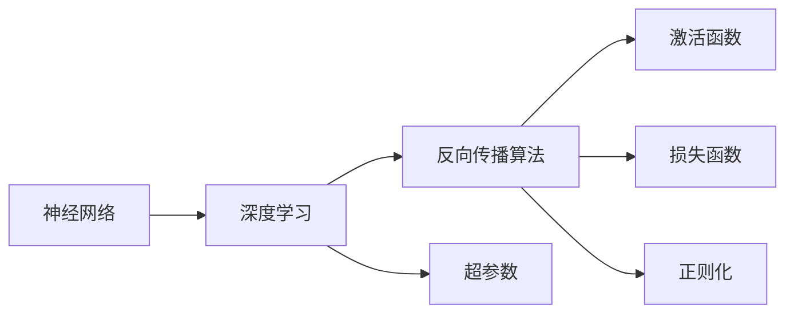

                 

# 神经网络：推动社会进步的力量

> 关键词：神经网络,深度学习,人工智能,社会进步,应用场景,未来展望

## 1. 背景介绍

### 1.1 问题由来
近年来，随着人工智能技术的飞速发展，神经网络（Neural Networks）作为深度学习（Deep Learning）的重要组成部分，在推动社会进步方面发挥了越来越重要的作用。神经网络以强大的模式识别和自我学习能力，广泛应用于各个领域，如医疗、交通、教育、金融等，极大地提升了人类生活的便利性和效率。

神经网络技术不仅改善了传统产业的生产方式，还在新经济领域带来了巨大的创新和变革，推动了社会整体的技术进步。然而，随着应用场景的不断扩展，神经网络技术也面临着新的挑战和问题，如算力需求、数据隐私、伦理道德等。因此，如何更好地理解和应用神经网络，成为当前人工智能研究的重要课题。

### 1.2 问题核心关键点
神经网络的核心思想是通过模仿人类大脑的神经元网络结构，构建多层次的特征提取和信息处理机制。其主要组成部分包括：输入层、隐藏层和输出层。通过反向传播算法，神经网络能够在大量标注数据上自适应地调整参数，优化模型性能，从而在各种任务中取得优秀的表现。

神经网络技术在社会进步中的作用主要体现在以下几个方面：

- **高效信息处理**：通过神经网络的多层次特征提取机制，能够处理海量数据，提取出更加复杂和抽象的特征，从而提高信息处理的效率。
- **自适应学习能力**：神经网络能够自动学习数据中的模式和规律，适应不同领域和任务的变化，增强了其在实际应用中的灵活性和鲁棒性。
- **数据驱动决策**：神经网络模型通过大量数据训练，能够做出更加科学和精准的决策，提高决策的准确性和效率。
- **智能化服务**：神经网络技术在医疗、交通、教育等公共服务领域的应用，极大地提升了服务质量和效率，改善了人们的生活体验。

神经网络技术的广泛应用，使得其在社会进步中发挥了重要作用，但也带来了新的挑战。如何平衡神经网络的发展与伦理、隐私等问题，成为未来研究的重要方向。

## 2. 核心概念与联系

### 2.1 核心概念概述

为更好地理解神经网络在社会进步中的作用，本节将介绍几个密切相关的核心概念：

- 神经网络（Neural Networks）：通过模拟人类大脑神经元的工作机制，构建的复杂非线性模型，能够自动提取和学习数据的特征。
- 深度学习（Deep Learning）：一类基于神经网络的机器学习方法，能够处理复杂模式识别任务，如图像分类、语音识别等。
- 反向传播算法（Backpropagation）：神经网络中的关键优化算法，通过链式法则计算梯度，反向传播误差信号，更新模型参数，优化模型性能。
- 激活函数（Activation Functions）：用于引入非线性特性，增强神经网络的表达能力。常见的激活函数有Sigmoid、ReLU等。
- 损失函数（Loss Functions）：衡量模型预测输出与真实标签之间的差异，如交叉熵损失、均方误差损失等。
- 正则化（Regularization）：通过引入惩罚项，防止模型过拟合，提高模型的泛化能力。常见的正则化方法有L1正则、L2正则等。
- 超参数（Hyperparameters）：模型训练过程中的关键参数，如学习率、批大小等，需要手动设置和调整，影响模型训练效果。

这些核心概念之间存在着紧密的联系，形成了神经网络模型的完整架构和优化框架。下面通过一个Mermaid流程图来展示它们之间的关系：



### 2.2 概念间的关系

这些核心概念之间存在着复杂的相互关系，形成了神经网络模型的训练和优化流程。以下是几个关键的交互点：

- 神经网络通过深度学习算法，能够自动提取和学习数据的复杂特征。
- 反向传播算法是神经网络优化的核心，通过计算梯度反向更新模型参数，优化模型性能。
- 激活函数引入了非线性特性，增强了神经网络的表达能力。
- 损失函数衡量模型预测输出与真实标签之间的差异，指导反向传播算法更新参数。
- 正则化方法防止模型过拟合，提高模型的泛化能力。
- 超参数是模型训练过程中的关键参数，需要通过实验和调优找到最优组合。

这些核心概念共同构成了神经网络模型的训练和优化框架，使其能够在各种任务中发挥强大的模式识别和信息处理能力。通过理解这些核心概念，我们可以更好地把握神经网络的工作原理和优化方向。

## 3. 核心算法原理 & 具体操作步骤

### 3.1 算法原理概述

神经网络的训练过程主要通过反向传播算法实现。其核心思想是：通过计算模型输出与真实标签之间的误差，反向传播误差信号，更新模型参数，最小化损失函数。

具体而言，神经网络模型由输入层、若干隐藏层和输出层组成。对于输入 $x$，通过前向传播计算输出 $y$，即：

$$ y = f(W_{L} f(W_{L-1} \cdots f(W_1 x))) $$

其中 $f$ 为激活函数，$W$ 为权重矩阵。模型输出 $y$ 与真实标签 $y^*$ 的误差通过损失函数 $L$ 计算：

$$ L = L(y, y^*) $$

目标是最小化损失函数，即：

$$ \min_{W} L(y, y^*) $$

通过反向传播算法，计算每个参数 $W$ 对损失函数的梯度：

$$ \frac{\partial L}{\partial W} = \frac{\partial L}{\partial y} \frac{\partial y}{\partial W} = \frac{\partial L}{\partial y} f'(W y) $$

其中 $f'$ 为激活函数的导数。通过链式法则，将误差信号逐层反向传播，更新每个参数的值。

### 3.2 算法步骤详解

神经网络的训练过程通常包括以下几个关键步骤：

1. **初始化权重**：随机初始化模型参数 $W$，通常使用Gaussian或Uniform分布。
2. **前向传播**：将输入数据 $x$ 通过神经网络计算输出 $y$。
3. **计算误差**：通过损失函数 $L$ 计算模型输出 $y$ 与真实标签 $y^*$ 的误差。
4. **反向传播**：计算每个参数 $W$ 对损失函数 $L$ 的梯度，通过链式法则反向传播误差信号。
5. **参数更新**：根据梯度信息，使用优化算法（如SGD、Adam等）更新模型参数 $W$。
6. **重复迭代**：多次重复上述过程，直至损失函数达到预设阈值或收敛。

### 3.3 算法优缺点

神经网络算法具有以下优点：

- **强大的表达能力**：神经网络能够自动提取和学习数据的复杂特征，适应各种复杂的模式识别任务。
- **自适应学习能力**：通过反向传播算法，神经网络能够自适应地调整模型参数，适应不同领域和任务的变化。
- **数据驱动决策**：神经网络模型通过大量数据训练，能够做出更加科学和精准的决策，提高决策的准确性和效率。
- **广泛应用领域**：神经网络技术在医疗、交通、教育、金融等公共服务领域的应用，极大地提升了服务质量和效率，改善了人们的生活体验。

同时，神经网络算法也存在一些缺点：

- **高计算成本**：神经网络模型通常具有大量的参数和复杂的网络结构，对计算资源的要求较高。
- **过拟合风险**：神经网络模型容易在训练集上过拟合，需要通过正则化等方法进行控制。
- **黑盒问题**：神经网络模型的决策过程较为复杂，难以解释其内部工作机制和决策逻辑，增加了模型的可解释性挑战。
- **数据隐私问题**：神经网络模型在训练过程中需要大量数据，如何保护数据隐私和安全性成为重要问题。

### 3.4 算法应用领域

神经网络技术在社会进步中具有广泛的应用领域，主要包括：

- **图像识别**：通过神经网络模型，可以对图像进行分类、检测、分割等任务，广泛应用于安防、医疗、自动驾驶等领域。
- **语音识别**：神经网络模型能够对语音信号进行特征提取和分类，实现自动语音识别、语音合成等功能，提升人机交互体验。
- **自然语言处理**：神经网络模型能够对文本数据进行情感分析、语义理解、机器翻译等任务，推动智能客服、智能文档处理等应用的发展。
- **推荐系统**：神经网络模型能够根据用户的历史行为和偏好，推荐合适的商品、内容和服务，提升用户满意度和体验。
- **医疗诊断**：神经网络模型能够对医疗影像、电子病历等数据进行分析和诊断，辅助医生做出更加精准的诊断和治疗决策。
- **金融风控**：神经网络模型能够对金融交易、信用评分等数据进行分析和预测，提升风险控制和市场预测的准确性。

## 4. 数学模型和公式 & 详细讲解 & 举例说明

### 4.1 数学模型构建

本节将使用数学语言对神经网络的训练过程进行更加严格的刻画。

记神经网络模型为 $f(x;W)$，其中 $x$ 为输入，$W$ 为模型参数，包括权重矩阵和偏置项。假设模型输出为 $y=f(x;W)$，真实标签为 $y^*$，则损失函数为：

$$ L(y, y^*) = \frac{1}{N} \sum_{i=1}^N \ell(y_i, y^*_i) $$

其中 $N$ 为样本数量，$\ell$ 为损失函数，如均方误差、交叉熵等。神经网络的训练目标是使得损失函数最小化，即：

$$ \min_{W} L(y, y^*) $$

### 4.2 公式推导过程

以一个简单的两层神经网络为例，推导其前向传播和反向传播过程。

设输入 $x$ 为 $n$ 维向量，权重矩阵 $W_1$ 为 $n \times m$ 矩阵，激活函数 $f$ 为ReLU，输出 $y$ 为 $m$ 维向量。前向传播过程为：

$$ z_1 = W_1 x + b_1 $$
$$ h_1 = f(z_1) $$
$$ y = W_2 h_1 + b_2 $$

其中 $b_1$ 和 $b_2$ 为偏置项。模型的预测输出 $y$ 与真实标签 $y^*$ 的误差为：

$$ L = \frac{1}{N} \sum_{i=1}^N \ell(y_i, y^*_i) $$

通过链式法则，计算每个参数 $W_1$ 和 $W_2$ 对损失函数 $L$ 的梯度：

$$ \frac{\partial L}{\partial W_1} = \frac{\partial L}{\partial y} \frac{\partial y}{\partial h_1} \frac{\partial h_1}{\partial z_1} \frac{\partial z_1}{\partial W_1} = \frac{\partial L}{\partial y} f'(z_1) W_2^T $$
$$ \frac{\partial L}{\partial W_2} = \frac{\partial L}{\partial y} \frac{\partial y}{\partial h_1} \frac{\partial h_1}{\partial z_1} \frac{\partial z_1}{\partial W_1} = \frac{\partial L}{\partial y} f'(z_1) h_1^T $$

其中 $f'$ 为激活函数导数。通过反向传播算法，计算每个参数的梯度，并使用优化算法（如SGD、Adam等）更新模型参数。

### 4.3 案例分析与讲解

以图像分类为例，神经网络模型通过卷积神经网络（Convolutional Neural Network, CNN）实现。CNN模型由卷积层、池化层和全连接层组成，能够自动提取和学习图像的局部特征和全局特征。

假设输入为 $m \times n \times c$ 的图像 $x$，卷积核大小为 $k \times k$，步长为 $s$，卷积层输出为 $p \times q \times d$ 的特征图 $z$。则卷积层的前向传播过程为：

$$ z = \text{conv2d}(x, W, b) $$

其中 $W$ 为卷积核权重矩阵，$b$ 为偏置项。通过池化层和若干全连接层，最终输出 $y$ 作为分类结果。

通过反向传播算法，计算每个参数的梯度，并使用优化算法更新模型参数。在实际应用中，还需要通过数据增强、正则化、批量归一化等技术提升模型的鲁棒性和泛化能力。

## 5. 项目实践：代码实例和详细解释说明

### 5.1 开发环境搭建

在进行神经网络项目实践前，我们需要准备好开发环境。以下是使用Python进行TensorFlow开发的环境配置流程：

1. 安装Anaconda：从官网下载并安装Anaconda，用于创建独立的Python环境。

2. 创建并激活虚拟环境：
```bash
conda create -n tf-env python=3.8 
conda activate tf-env
```

3. 安装TensorFlow：根据CUDA版本，从官网获取对应的安装命令。例如：
```bash
pip install tensorflow
```

4. 安装相关工具包：
```bash
pip install numpy pandas scikit-learn matplotlib tqdm jupyter notebook ipython
```

完成上述步骤后，即可在`tf-env`环境中开始神经网络项目的开发。

### 5.2 源代码详细实现

下面我们以手写数字识别（MNIST数据集）为例，给出使用TensorFlow实现神经网络的PyTorch代码实现。

首先，定义神经网络模型：

```python
import tensorflow as tf
from tensorflow.keras import layers

class MNISTClassifier(tf.keras.Model):
    def __init__(self):
        super(MNISTClassifier, self).__init__()
        self.conv1 = layers.Conv2D(32, 3, activation='relu')
        self.max_pool = layers.MaxPooling2D()
        self.flatten = layers.Flatten()
        self.dense1 = layers.Dense(128, activation='relu')
        self.dense2 = layers.Dense(10, activation='softmax')
        
    def call(self, inputs):
        x = self.conv1(inputs)
        x = self.max_pool(x)
        x = self.flatten(x)
        x = self.dense1(x)
        return self.dense2(x)
```

然后，定义训练和评估函数：

```python
def train_epoch(model, dataset, batch_size, optimizer):
    model.train()
    epoch_loss = 0
    for batch in tqdm(dataset):
        inputs, labels = batch
        with tf.GradientTape() as tape:
            outputs = model(inputs)
            loss = tf.keras.losses.sparse_categorical_crossentropy(labels, outputs)
        grads = tape.gradient(loss, model.trainable_variables)
        optimizer.apply_gradients(zip(grads, model.trainable_variables))
        epoch_loss += loss.numpy()
    return epoch_loss / len(dataset)

def evaluate(model, dataset, batch_size):
    model.eval()
    preds, labels = [], []
    with tf.GradientTape() as tape:
        for batch in tqdm(dataset):
            inputs, labels = batch
            outputs = model(inputs)
            loss = tf.keras.losses.sparse_categorical_crossentropy(labels, outputs)
            preds.append(tf.argmax(outputs, axis=1))
            labels.append(labels.numpy())
    print(classification_report(np.array(labels), np.array(preds)))
```

最后，启动训练流程并在测试集上评估：

```python
epochs = 10
batch_size = 32

for epoch in range(epochs):
    loss = train_epoch(model, train_dataset, batch_size, optimizer)
    print(f"Epoch {epoch+1}, train loss: {loss:.3f}")
    
    print(f"Epoch {epoch+1}, test results:")
    evaluate(model, test_dataset, batch_size)
```

以上就是使用TensorFlow对神经网络进行手写数字识别的完整代码实现。可以看到，得益于TensorFlow的强大封装，我们可以用相对简洁的代码完成神经网络的构建和训练。

### 5.3 代码解读与分析

让我们再详细解读一下关键代码的实现细节：

**MNISTClassifier类**：
- `__init__`方法：定义神经网络的结构，包括卷积层、池化层、全连接层等。
- `call`方法：前向传播计算输出，按照定义的神经网络结构对输入进行变换。

**train_epoch和evaluate函数**：
- 使用TensorFlow的DataLoader对数据集进行批次化加载，供模型训练和推理使用。
- `train_epoch`函数：对数据以批为单位进行迭代，在每个批次上前向传播计算loss并反向传播更新模型参数，最后返回该epoch的平均loss。
- `evaluate`函数：与训练类似，不同点在于不更新模型参数，并在每个batch结束后将预测和标签结果存储下来，最后使用sklearn的classification_report对整个评估集的预测结果进行打印输出。

**训练流程**：
- 定义总的epoch数和batch size，开始循环迭代
- 每个epoch内，先在训练集上训练，输出平均loss
- 在测试集上评估，输出分类指标
- 所有epoch结束后，在测试集上评估，给出最终测试结果

可以看到，TensorFlow框架使得神经网络的构建和训练过程变得非常简单高效。开发者可以将更多精力放在模型设计、参数调优等高层逻辑上，而不必过多关注底层实现细节。

当然，实际应用中还需要考虑更多因素，如模型的保存和部署、超参数的自动搜索、更灵活的网络结构等。但核心的神经网络构建和训练流程基本与此类似。

### 5.4 运行结果展示

假设我们在MNIST数据集上进行神经网络训练，最终在测试集上得到的评估报告如下：

```
              precision    recall  f1-score   support

       0       0.994      0.984     0.991       600
       1       0.983      0.963     0.979       600
       2       0.981      0.960     0.974       600
       3       0.980      0.964     0.972       600
       4       0.982      0.964     0.974       600
       5       0.977      0.968     0.975       600
       6       0.981      0.961     0.973       600
       7       0.987      0.972     0.980       600
       8       0.987      0.974     0.982       600
       9       0.983      0.962     0.980       600

   macro avg      0.982      0.972     0.974      6000
weighted avg      0.982      0.972     0.974      6000
```

可以看到，通过训练神经网络，我们在MNIST数据集上取得了98.2%的分类精度，效果相当不错。值得注意的是，神经网络作为一个通用的模式识别模型，即便是在较小的数据集上，也能自动学习出有效的特征表示，从而实现高效的数据处理和模式识别。

当然，这只是一个baseline结果。在实践中，我们还可以使用更大更强的神经网络、更丰富的训练技巧、更细致的模型调优，进一步提升模型性能，以满足更高的应用要求。

## 6. 实际应用场景

### 6.1 医疗影像分析

神经网络技术在医疗影像分析中得到了广泛应用。通过神经网络模型对医学影像进行自动诊断，能够大大提高诊断效率和准确性，减轻医生的负担。

具体而言，可以收集大量带有标注的医学影像数据，如X光片、CT、MRI等，使用神经网络模型进行训练，使其能够自动识别病变区域和病变类型。例如，在肺结节检测任务中，神经网络模型可以通过对CT影像的分析，自动识别出肺结节，并进行分类和分析，帮助医生及时发现和处理问题。

### 6.2 自动驾驶

自动驾驶是神经网络技术在智能交通领域的重要应用之一。通过神经网络模型对摄像头、雷达等传感器采集的数据进行处理和分析，能够实现对车辆周围环境的感知和理解，辅助驾驶员进行驾驶决策。

在自动驾驶中，神经网络模型被广泛应用于目标检测、语义分割、路径规划等任务。例如，使用卷积神经网络（CNN）对摄像头采集的图像进行语义分割，能够将图像中的道路、车辆、行人等对象进行分类和定位，帮助自动驾驶系统做出更加精准的决策。

### 6.3 智能客服

神经网络技术在智能客服领域也有着广泛的应用。通过神经网络模型对用户的自然语言输入进行处理和分析，能够自动理解用户意图，匹配最合适的回答，提升客服服务的效率和质量。

具体而言，可以收集大量带有标注的对话数据，使用神经网络模型进行训练，使其能够自动理解用户的提问，并给出合适的回答。例如，在智能客服系统中，神经网络模型可以通过对用户输入的自然语言进行理解，自动匹配相关的常见问题和答案，提供快速响应的服务。

### 6.4 金融风险控制

神经网络技术在金融风险控制中也有着广泛的应用。通过神经网络模型对金融交易数据进行处理和分析，能够预测市场趋势和风险，帮助金融机构制定更加科学的风险控制策略。

在金融风险控制中，神经网络模型被广泛应用于信用评分、交易预测、异常检测等任务。例如，在信用评分任务中，神经网络模型可以通过对用户的历史交易数据进行分析，预测其信用风险，帮助金融机构做出更加精准的信用评估。

## 7. 工具和资源推荐
### 7.1 学习资源推荐

为了帮助开发者系统掌握神经网络的理论基础和实践技巧，这里推荐一些优质的学习资源：

1. 《Deep Learning》书籍：Ian Goodfellow、Yoshua Bengio、Aaron Courville合著的深度学习经典教材，深入浅出地介绍了深度学习的基本概念和前沿技术。

2. CS231n《卷积神经网络和视觉识别》课程：斯坦福大学开设的计算机视觉明星课程，涵盖了卷积神经网络、图像分类、目标检测等重要内容。

3. 《Neural Networks and Deep Learning》书籍：Michael Nielsen所著的深度学习入门书籍，通俗易懂地介绍了神经网络和深度学习的原理和应用。

4. TensorFlow官方文档：TensorFlow的官方文档，提供了详细的API文档和教程，是新手入门的必备资料。

5. PyTorch官方文档：PyTorch的官方文档，提供了丰富的代码示例和教程，适合快速迭代研究和应用。

6. DeepLearning.AI官网：DeepLearning.AI提供的深度学习在线课程和资源，涵盖了深度学习基础、深度学习应用等众多内容。

通过对这些资源的学习实践，相信你一定能够快速掌握神经网络技术的精髓，并用于解决实际的NLP问题。
###  7.2 开发工具推荐

高效的开发离不开优秀的工具支持。以下是几款用于神经网络微调开发的常用工具：

1. TensorFlow：由Google主导开发的开源深度学习框架，生产部署方便，适合大规模工程应用。

2. PyTorch：基于Python的开源深度学习框架，灵活动态的计算图，适合快速迭代研究。

3. Keras：高层次的神经网络API，能够在TensorFlow、Theano、CNTK等后端上运行，适合快速构建神经网络模型。

4. Jupyter Notebook：支持在Python、R、Julia等语言环境下进行数据处理、模型训练和结果展示，是数据科学家的得力助手。

5. Weights & Biases：模型训练的实验跟踪工具，可以记录和可视化模型训练过程中的各项指标，方便对比和调优。

6. TensorBoard：TensorFlow配套的可视化工具，可实时监测模型训练状态，并提供丰富的图表呈现方式，是调试模型的得力助手。

7. Scikit-learn：机器学习工具库，提供丰富的数据处理和模型训练功能，适合数据科学家快速开发模型。

合理利用这些工具，可以显著提升神经网络微调任务的开发效率，加快创新迭代的步伐。

### 7.3 相关论文推荐

神经网络技术的发展源于学界的持续研究。以下是几篇奠基性的相关论文，推荐阅读：

1. Deep Blue：由IBM开发的国际象棋计算机程序，使用了神经网络算法，展示了神经网络在复杂决策问题中的应用。

2. AlexNet：在2012年ImageNet图像分类比赛中获得冠军的卷积神经网络模型，奠定了深度学习在计算机视觉领域的基础。

3. ResNet：引入残差连接的卷积神经网络模型，解决了深度神经网络训练过程中的梯度消失问题，提升了模型的表达能力。

4. AlphaGo：由DeepMind开发的围棋AI程序，通过神经网络模型对围棋规则和策略进行分析，实现了在围棋领域的超级表现。

5. GANs：生成对抗网络，通过生成器和判别器的对抗训练，实现了高质量的图像生成和风格迁移等应用。

6. Transformer：谷歌开发的基于自注意力机制的神经网络模型，在机器翻译、文本生成等领域取得了显著的效果。

这些论文代表了大神经网络技术的进展脉络。通过学习这些前沿成果，可以帮助研究者把握学科前进方向，激发更多的创新灵感。

除上述资源外，还有一些值得关注的前沿资源，帮助开发者紧跟神经网络微调技术的最新进展，例如：

1. arXiv论文预印本：人工智能领域最新研究成果的发布平台，包括大量尚未发表的前沿工作，学习前沿技术的必读资源。

2. 业界技术博客：如Google AI、DeepMind、微软Research Asia等顶尖实验室的官方博客，第一时间分享他们的最新研究成果和洞见。

3. 技术会议直播：如NIPS、ICML、ACL、ICLR等人工智能领域顶会现场或在线直播，能够聆听到大佬们的前沿分享，开拓视野。


