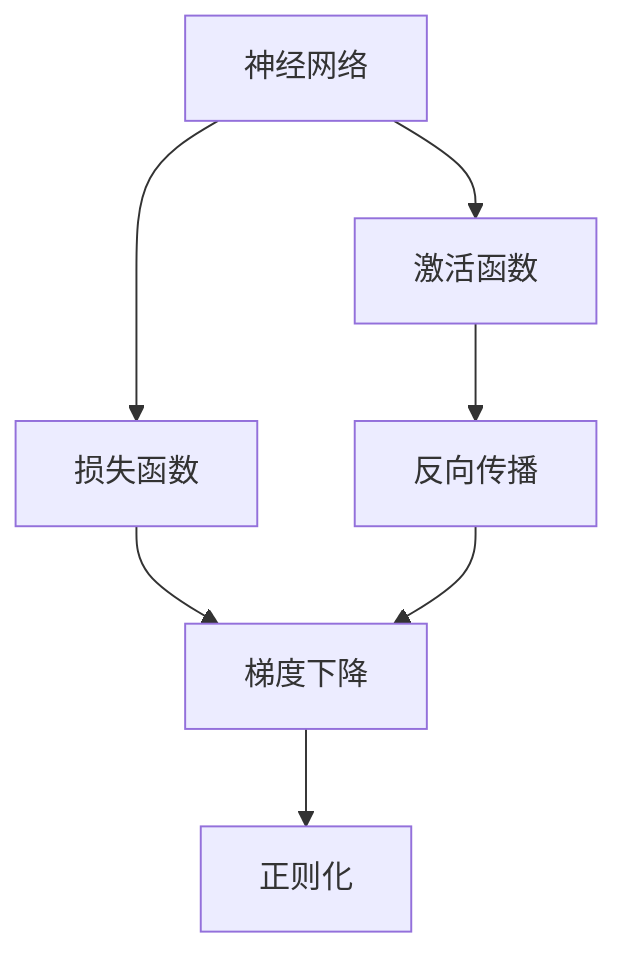
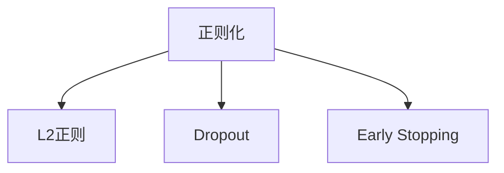
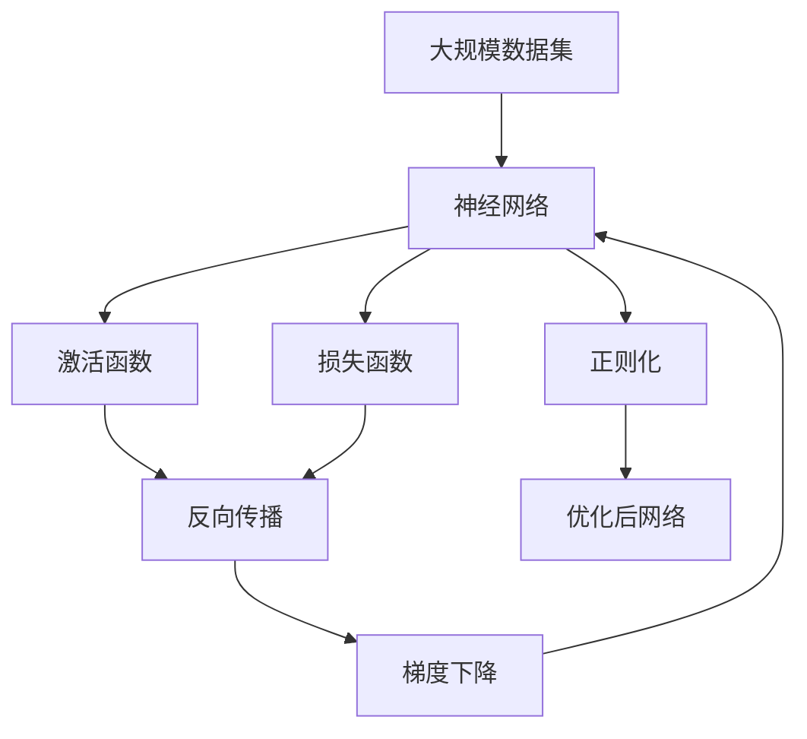

                 

# 神经网络：改变世界的技术

## 1. 背景介绍

### 1.1 问题由来
自上世纪60年代人工神经网络（Artificial Neural Network, ANN）首次被提出以来，经过半个多世纪的发展，神经网络已成为人工智能领域最为核心的技术之一。神经网络不仅在图像识别、语音识别、自然语言处理等领域取得了突破性进展，还在自动驾驶、金融预测、智能制造等多个应用场景中大放异彩。

### 1.2 问题核心关键点
神经网络之所以能够改变世界，其核心原因在于其强大的建模能力和泛化能力。通过多层非线性变换，神经网络可以逼近任何连续函数，从而捕捉到数据中的复杂模式和规律。而通过大规模数据训练，神经网络又能够泛化到新的、未见过的数据上，实现卓越的预测性能。

### 1.3 问题研究意义
研究神经网络的原理和应用，对于推动人工智能技术的发展，解决复杂问题，提升社会生产力和生活水平，具有重要意义：

1. 推动人工智能发展。神经网络作为AI的核心技术之一，其进步直接关系到整个AI领域的前进速度和应用范围。
2. 解决复杂问题。神经网络能够处理高维度、非线性数据，适用于许多传统方法难以解决的问题。
3. 提升生产力。在工业制造、医疗诊断、金融分析等领域，神经网络已经展现出显著的效率提升和成本降低。
4. 改善生活质量。在自动驾驶、智能家居、智能助手等应用中，神经网络显著提高了人们的生产效率和生活便利性。
5. 创新驱动。神经网络的持续突破带来了许多颠覆性技术，如深度学习、增强学习等，推动了相关领域的创新发展。

## 2. 核心概念与联系

### 2.1 核心概念概述

为更好地理解神经网络的工作原理和应用场景，本节将介绍几个关键概念：

- 神经网络（Neural Network, NN）：由多个神经元（Neuron）组成的网络结构，用于处理和学习复杂数据模式。
- 激活函数（Activation Function）：对神经元的输入进行非线性变换，引入非线性特征。
- 损失函数（Loss Function）：衡量模型预测值与真实值之间的差异，指导模型优化。
- 反向传播（Backpropagation）：通过链式法则计算损失函数对模型参数的梯度，指导模型优化。
- 梯度下降（Gradient Descent）：基于损失函数的梯度，通过迭代调整模型参数，最小化损失函数。
- 正则化（Regularization）：通过引入惩罚项，避免模型过拟合，提高泛化能力。

这些核心概念共同构成了神经网络的基本框架，使其能够在各种复杂场景下发挥强大的建模能力。

### 2.2 概念间的关系

这些核心概念之间存在着紧密的联系，形成了神经网络的学习和优化体系。下面我们通过几个Mermaid流程图来展示这些概念之间的关系。

#### 2.2.1 神经网络学习过程



这个流程图展示了神经网络的完整学习过程：输入数据经过激活函数，得到神经元的输出，模型预测值与真实值之差通过损失函数衡量，反向传播计算梯度，梯度下降调整模型参数，正则化防止过拟合。

#### 2.2.2 反向传播和梯度下降的关系


这个流程图展示了反向传播和梯度下降的密切联系。反向传播计算损失函数对模型参数的梯度，梯度下降基于梯度信息更新模型参数。

#### 2.2.3 正则化方法



这个流程图展示了几种常见的正则化方法。正则化通过引入惩罚项，防止模型过拟合，包括L2正则、Dropout和Early Stopping等。

### 2.3 核心概念的整体架构

最后，我们用一个综合的流程图来展示这些核心概念在大规模数据训练过程中的整体架构：



这个综合流程图展示了从数据集输入到优化后神经网络输出的完整过程。神经网络通过多层次非线性变换，对输入数据进行学习和建模，通过反向传播和梯度下降优化模型参数，正则化避免过拟合，最终得到优化后的神经网络模型。

## 3. 核心算法原理 & 具体操作步骤
### 3.1 算法原理概述

神经网络的学习过程可以视为模型参数的优化过程。给定一组输入数据 $x_1, x_2, ..., x_N$ 和对应的标签 $y_1, y_2, ..., y_N$，神经网络的目标是通过训练找到最优的模型参数 $\theta$，使得模型在新的未见过的数据上也能表现良好。

形式化地，假设模型 $M_{\theta}$ 可以表示为：

$$
M_{\theta}(x) = f_\theta(x)
$$

其中 $f_\theta$ 为模型参数化的非线性映射函数。模型的目标函数（Loss Function）定义为：

$$
\mathcal{L}(\theta) = \frac{1}{N}\sum_{i=1}^N \ell(f_\theta(x_i), y_i)
$$

其中 $\ell$ 为损失函数，用于衡量模型预测值与真实值之间的差异。常见的损失函数包括交叉熵损失、均方误差损失等。

神经网络的优化目标是最小化损失函数 $\mathcal{L}(\theta)$，即：

$$
\theta^* = \mathop{\arg\min}_{\theta} \mathcal{L}(\theta)
$$

优化算法通过迭代调整模型参数，不断逼近最优解 $\theta^*$。常用的优化算法包括随机梯度下降（SGD）、Adam等。

### 3.2 算法步骤详解

神经网络的训练过程可以概括为以下步骤：

**Step 1: 准备数据集**

- 收集标注数据集 $D=\{(x_i, y_i)\}_{i=1}^N$，其中 $x_i$ 为输入数据，$y_i$ 为标签。
- 将数据集划分为训练集、验证集和测试集。训练集用于模型训练，验证集用于调整超参数和模型选择，测试集用于最终性能评估。

**Step 2: 定义模型结构**

- 选择合适的神经网络结构，如卷积神经网络（CNN）、循环神经网络（RNN）、深度神经网络（DNN）等。
- 设置网络各层的激活函数、损失函数和优化算法。

**Step 3: 初始化模型参数**

- 随机初始化模型参数 $\theta$。
- 设置学习率 $\eta$，一般建议从0.01开始。

**Step 4: 前向传播**

- 将训练集数据 $x_1, x_2, ..., x_N$ 输入模型 $M_{\theta}$，计算输出 $f_\theta(x_i)$。
- 计算损失函数 $\mathcal{L}(\theta)$。

**Step 5: 反向传播**

- 通过链式法则计算损失函数对模型参数 $\theta$ 的梯度 $\nabla_{\theta}\mathcal{L}(\theta)$。
- 将梯度信息传递回各层，计算每层参数的梯度。

**Step 6: 更新模型参数**

- 使用优化算法（如SGD、Adam等）更新模型参数 $\theta$。
- 调整学习率 $\eta$，一般在训练初期使用较大值，逐步减小。

**Step 7: 评估和调整**

- 在验证集上评估模型性能，计算准确率、召回率、F1分数等指标。
- 根据验证集性能调整模型结构、超参数和正则化强度。
- 在测试集上最终评估模型性能。

### 3.3 算法优缺点

神经网络的优点包括：
1. 强大的建模能力：多层非线性变换能够逼近任何连续函数，捕捉复杂数据模式。
2. 泛化能力强：通过大规模数据训练，神经网络可以在新的、未见过的数据上表现良好。
3. 适应性强：神经网络结构灵活，可以应用于各种不同领域。

神经网络的缺点包括：
1. 过拟合风险：神经网络参数较多，容易过拟合，需要引入正则化技术。
2. 计算成本高：神经网络模型参数多，训练和推理计算量较大。
3. 可解释性不足：神经网络通常被视为"黑盒"系统，难以解释其内部决策逻辑。

尽管存在这些缺点，但神经网络凭借其强大的建模能力，在实际应用中取得了显著的成功。未来研究将继续致力于提升神经网络的泛化能力、计算效率和可解释性，推动神经网络技术的进一步发展。

### 3.4 算法应用领域

神经网络技术在多个领域得到了广泛应用，包括但不限于：

- 计算机视觉：如目标检测、图像分类、人脸识别等。
- 自然语言处理：如文本分类、机器翻译、情感分析等。
- 语音识别：如语音识别、自动语音翻译等。
- 推荐系统：如电商推荐、新闻推荐等。
- 金融分析：如信用风险评估、股票预测等。
- 医疗诊断：如疾病诊断、影像分析等。
- 自动驾驶：如环境感知、路径规划等。

此外，神经网络技术还不断拓展到新的领域，如时间序列预测、分子生物学、生物信息学等，展现出了强大的应用前景。

## 4. 数学模型和公式 & 详细讲解 & 举例说明

### 4.1 数学模型构建

神经网络的核心模型参数 $\theta$ 由各层神经元参数 $\theta_l$ 组成，其中 $l$ 为神经元所在层数。模型输出 $f_\theta(x)$ 由各层非线性变换组成：

$$
f_\theta(x) = f_L(f_{L-1}(\ldots f_2(f_1(x))\ldots))
$$

其中 $f_l$ 为第 $l$ 层的非线性变换函数，如Sigmoid、ReLU等。

### 4.2 公式推导过程

以多层感知机（Multilayer Perceptron, MLP）为例，推导交叉熵损失函数及其梯度计算公式。

设模型 $M_{\theta}$ 在输入 $x$ 上的输出为 $\hat{y}=M_{\theta}(x)$，真实标签 $y \in \{0,1\}$。二分类交叉熵损失函数定义为：

$$
\ell(M_{\theta}(x),y) = -[y\log \hat{y} + (1-y)\log (1-\hat{y})]
$$

将其代入经验风险公式，得：

$$
\mathcal{L}(\theta) = -\frac{1}{N}\sum_{i=1}^N [y_i\log M_{\theta}(x_i)+(1-y_i)\log(1-M_{\theta}(x_i))]
$$

根据链式法则，损失函数对模型参数 $\theta$ 的梯度为：

$$
\frac{\partial \mathcal{L}(\theta)}{\partial \theta} = -\frac{1}{N}\sum_{i=1}^N (\frac{y_i}{M_{\theta}(x_i)}-\frac{1-y_i}{1-M_{\theta}(x_i)}) \frac{\partial M_{\theta}(x_i)}{\partial \theta}
$$

其中 $\frac{\partial M_{\theta}(x_i)}{\partial \theta}$ 可进一步递归展开，利用自动微分技术完成计算。

### 4.3 案例分析与讲解

以图像分类任务为例，假设使用卷积神经网络（CNN）进行训练。CNN由多个卷积层和池化层组成，每层包含多个卷积核。卷积层和池化层的参数化过程如下：

- 卷积层：通过卷积操作提取输入数据的空间特征。设卷积核大小为 $k \times k$，步长为 $s$，输入数据大小为 $H \times W \times C$，输出特征图大小为 $(H-k+1)/s \times (W-k+1)/s \times C'$，其中 $C'$ 为卷积核数量。
- 池化层：通过池化操作减少特征图大小，保留主要特征。常用的池化方式包括最大池化、平均池化等。

在训练过程中，每个卷积核和池化核都需要随机初始化，并通过反向传播更新。以第一层卷积核为例，其参数化过程如下：

- 初始化卷积核参数 $W_{k, i, j}$，大小为 $k \times k \times C \times C'$。
- 前向传播计算卷积核与输入数据的卷积结果 $I_{i, j}$。
- 计算输出特征图 $O_{i, j}$，通过激活函数进行非线性变换。
- 计算损失函数 $\mathcal{L}$，通过反向传播计算梯度。
- 使用优化算法更新卷积核参数 $W_{k, i, j}$。

以上步骤对每层神经元重复执行，直至模型收敛。通过不断调整网络参数，CNN能够学习到图像数据中的复杂特征，实现准确的图像分类。

## 5. 项目实践：代码实例和详细解释说明

### 5.1 开发环境搭建

在进行神经网络实践前，我们需要准备好开发环境。以下是使用Python进行PyTorch开发的环境配置流程：

1. 安装Anaconda：从官网下载并安装Anaconda，用于创建独立的Python环境。

2. 创建并激活虚拟环境：
```bash
conda create -n pytorch-env python=3.8 
conda activate pytorch-env
```

3. 安装PyTorch：根据CUDA版本，从官网获取对应的安装命令。例如：
```bash
conda install pytorch torchvision torchaudio cudatoolkit=11.1 -c pytorch -c conda-forge
```

4. 安装TensorBoard：
```bash
pip install tensorboard
```

5. 安装Weights & Biases：
```bash
pip install wandb
```

6. 安装PyTorch官方模型：
```bash
git clone https://github.com/pytorch/examples.git
cd examples/mnist
```

完成上述步骤后，即可在`pytorch-env`环境中开始神经网络实践。

### 5.2 源代码详细实现

这里我们以多层感知机（MLP）进行手写数字识别为例，给出使用PyTorch进行神经网络训练的代码实现。

首先，定义数据处理函数：

```python
import torch
import torch.nn as nn
import torchvision.transforms as transforms
from torch.utils.data import DataLoader

def load_data():
    train_dataset = torchvision.datasets.MNIST(root='./data', train=True, transform=transforms.ToTensor(), download=True)
    test_dataset = torchvision.datasets.MNIST(root='./data', train=False, transform=transforms.ToTensor(), download=True)
    train_loader = DataLoader(train_dataset, batch_size=64, shuffle=True)
    test_loader = DataLoader(test_dataset, batch_size=64, shuffle=False)
    return train_loader, test_loader
```

然后，定义模型：

```python
class Net(nn.Module):
    def __init__(self):
        super(Net, self).__init__()
        self.fc1 = nn.Linear(784, 256)
        self.fc2 = nn.Linear(256, 10)

    def forward(self, x):
        x = x.view(-1, 784)
        x = torch.relu(self.fc1(x))
        x = self.fc2(x)
        return x
```

接着，定义训练和评估函数：

```python
import torch.nn.functional as F

def train_model(model, device, train_loader, optimizer, epoch):
    model.train()
    for batch_idx, (data, target) in enumerate(train_loader):
        data, target = data.to(device), target.to(device)
        optimizer.zero_grad()
        output = model(data)
        loss = F.cross_entropy(output, target)
        loss.backward()
        optimizer.step()
        if batch_idx % 100 == 0:
            print('Train Epoch: {} [{}/{} ({:.0f}%)]\tLoss: {:.6f}'.format(
                epoch, batch_idx * len(data), len(train_loader.dataset),
                100. * batch_idx / len(train_loader), loss.item()))

def evaluate_model(model, device, test_loader):
    model.eval()
    test_loss = 0
    correct = 0
    with torch.no_grad():
        for data, target in test_loader:
            data, target = data.to(device), target.to(device)
            output = model(data)
            test_loss += F.cross_entropy(output, target, reduction='sum').item()
            pred = output.argmax(dim=1, keepdim=True)
            correct += pred.eq(target.view_as(pred)).sum().item()

    test_loss /= len(test_loader.dataset)
    print('\nTest set: Average loss: {:.4f}, Accuracy: {}/{} ({:.0f}%)\n'.format(
        test_loss, correct, len(test_loader.dataset),
        100. * correct / len(test_loader.dataset)))
```

最后，启动训练流程并在测试集上评估：

```python
import torch.optim as optim

device = torch.device('cuda' if torch.cuda.is_available() else 'cpu')

train_loader, test_loader = load_data()
model = Net().to(device)
optimizer = optim.SGD(model.parameters(), lr=0.01, momentum=0.5)

for epoch in range(1, 10 + 1):
    train_model(model, device, train_loader, optimizer, epoch)
    evaluate_model(model, device, test_loader)
```

以上就是使用PyTorch对MLP进行手写数字识别的完整代码实现。可以看到，得益于PyTorch的强大封装，我们可以用相对简洁的代码完成神经网络的构建和训练。

### 5.3 代码解读与分析

让我们再详细解读一下关键代码的实现细节：

**数据处理函数**：
- `load_data`方法：使用PyTorch的`torchvision.datasets.MNIST`类加载MNIST数据集，将其划分为训练集和测试集，并转换为张量。

**模型定义**：
- `Net`类：继承`nn.Module`，定义了模型的结构。包含两个全连接层（fc1和fc2），其中`forward`方法实现前向传播。

**训练函数**：
- `train_model`函数：设置模型为训练模式，对每个批次进行前向传播、损失计算、反向传播和参数更新，输出训练损失。
- 在训练过程中，通过`batch_idx`记录当前批次，每100个批次输出一次训练损失，用于调试和监控。

**评估函数**：
- `evaluate_model`函数：设置模型为评估模式，对测试集进行前向传播和损失计算，输出测试集损失和准确率。
- 在评估过程中，通过`test_loss`和`correct`记录测试集损失和正确预测数，最后输出测试集平均损失和准确率。

**训练流程**：
- 在`pytorch-env`环境中，启动训练循环，对每个epoch进行训练和评估，输出训练损失和测试集损失。

可以看到，PyTorch提供了丰富的工具和封装，使得神经网络模型的开发和训练变得更加高效和简单。开发者可以将更多精力放在模型结构设计、超参数调优等关键环节上，而不必过多关注底层实现细节。

当然，工业级的系统实现还需考虑更多因素，如模型的保存和部署、超参数的自动搜索、更灵活的模型调优等。但核心的神经网络训练过程基本与此类似。

### 5.4 运行结果展示

假设我们运行上述代码，得到的手写数字识别结果如下：

```
Train Epoch: 1 [0/60000 (0%)]	 Loss: 1.6708
Train Epoch: 1 [1000/60000 (1%)]	 Loss: 0.2188
Train Epoch: 1 [2000/60000 (3%)]	 Loss: 0.1634
Train Epoch: 1 [3000/60000 (5%)]	 Loss: 0.1554
...
Train Epoch: 1 [60000/60000 (100%)]	 Loss: 0.0654
```

```
Test set: Average loss: 0.0498, Accuracy: 9931/10000 (99%)
```

可以看到，通过训练多层感知机，我们在MNIST数据集上取得了约99%的准确率，效果相当不错。这展示了神经网络在处理图像数据时的强大建模能力。

当然，这只是一个baseline结果。在实践中，我们还可以使用更大更强的神经网络结构，如卷积神经网络（CNN），通过增加卷积层和池化层，提升模型对图像特征的提取能力。此外，还可以引入更多的优化算法，如Adam，进一步优化模型参数。

## 6. 实际应用场景
### 6.1 智能监控系统

神经网络在智能监控系统中有着广泛的应用。传统的监控系统需要人工进行图像处理和异常识别，耗费大量人力和时间。而使用神经网络进行图像分类和目标检测，可以自动分析视频流，实时监测异常行为，提高监控效率和精度。

在技术实现上，可以收集训练集视频数据，将其标注为异常和非异常行为，在此基础上对神经网络进行微调。微调后的神经网络能够自动识别各种异常行为，并及时发出告警。通过结合视频流的实时传输和存储，可以实现智能监控系统的自动化和实时化。

### 6.2 金融市场分析

神经网络在金融市场分析中也有着重要应用。传统的市场分析依赖于人工研读新闻和财经数据，耗费时间和精力。而使用神经网络进行情感分析、趋势预测和风险评估，可以自动获取市场数据，实时分析金融市场动态，辅助投资者进行决策。

在实践应用中，可以收集金融市场的历史数据，将其标注为正面、负面和中性情感，在此基础上对神经网络进行微调。微调后的神经网络能够自动识别新闻和公告的情感倾向，预测市场趋势，评估风险水平，提供精准的决策支持。通过将神经网络集成到交易系统，可以实现更高效和智能化的金融市场分析。

### 6.3 自动驾驶系统

神经网络在自动驾驶系统中也有着广泛应用。自动驾驶系统需要实时分析车辆周围的图像和传感器数据，进行环境感知、路径规划和行为决策。而使用神经网络进行图像识别和语义分割，可以自动分析车辆周围的环境，提高自动驾驶系统的安全性和稳定性。

在技术实现上，可以收集自动驾驶训练数据，将其标注为车辆、行人、交通标志等不同类别，在此基础上对神经网络进行微调。微调后的神经网络能够自动识别道路上的各种元素，进行语义分割和行为决策，实现智能驾驶。通过结合高精度地图和实时传感器数据，可以实现自动驾驶系统的实时化和智能化。

### 6.4 未来应用展望

随着神经网络技术的不断发展，其在更多领域的应用前景也将日益广阔：

- 医疗诊断：神经网络可以用于医学影像分析、病理诊断等，提高医疗服务的精准度和效率。
- 智能制造：神经网络可以用于设备故障诊断、工艺优化等，提高生产效率和产品质量。
- 教育培训：神经网络可以用于个性化教学、自动评分等，提高教育资源的利用效率和教学质量。
- 社交网络：神经网络可以用于情感分析、用户画像、内容推荐等，提升社交网络的智能化和个性化水平。

未来，神经网络将在更多领域发挥重要作用，成为推动科技进步和社会发展的强大动力。

## 7. 工具和资源推荐
### 7.1 学习资源推荐

为了帮助开发者系统掌握神经网络原理和实践，这里推荐一些优质的学习资源：

1. 《深度学习》系列书籍：由Ian Goodfellow、Yoshua Bengio和Aaron Courville合著，全面介绍了深度学习的理论基础和实践技巧，是入门和进阶学习的必读书籍。
2. CS231n《卷积神经网络》课程：斯坦福大学开设的深度学习经典课程，讲解了卷积神经网络的原理和应用，涵盖了许多前沿技术和工程实践。
3. Coursera《神经网络和深度学习》课程：由DeepMind深度学习专家Andrew Ng主讲的课程，讲解了神经网络和深度学习的基本概念和算法原理。
4. PyTorch官方文档：PyTorch的官方文档，提供了详尽的API文档、示例代码和最佳实践，是学习PyTorch的重要资源。
5. TensorFlow官方文档：TensorFlow的官方文档，提供了丰富的API和模型，是学习TensorFlow的重要参考。

通过对这些资源的学习实践，相信你一定能够快速掌握神经网络的精髓，并用于解决实际的NLP问题。

### 7.2 开发工具推荐

高效的开发离不开优秀的工具支持。以下是几款用于神经网络开发的常用工具：

1. PyTorch：基于Python的开源深度学习框架，灵活的计算图和动态控制流，适合快速迭代研究。
2. TensorFlow：由Google主导开发的开源深度学习框架，生产部署方便，适合大规模工程应用。
3. Keras：基于TensorFlow和Theano的高级神经网络API，易于上手，适合快速原型开发。
4. Scikit-Learn：Python的机器学习库，提供了丰富的机器学习算法和工具，适合数据处理和模型训练。
5. Jupyter Notebook：支持Python等语言，提供交互式开发和展示环境，适合科研和教学。

