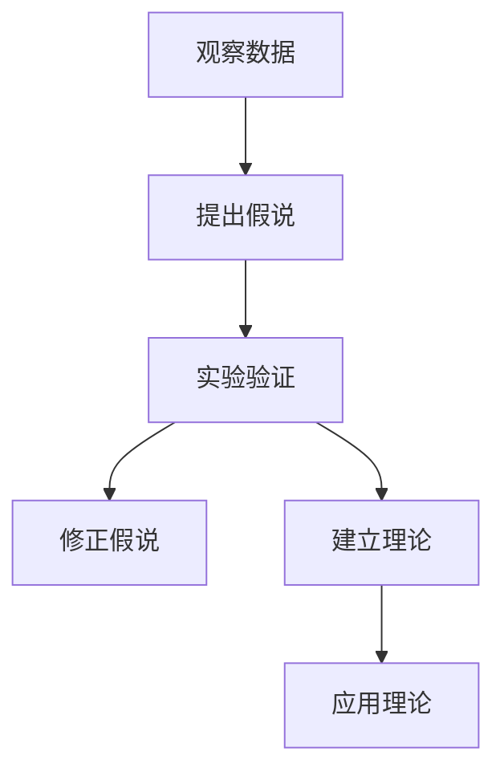
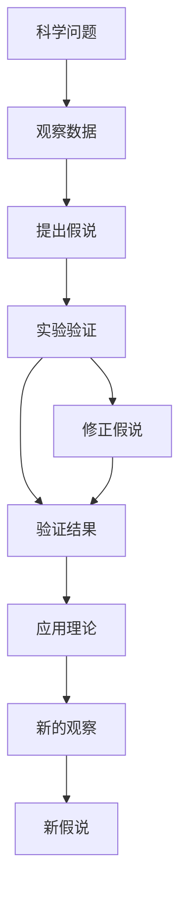

                 

# 科学发现：从假说到理论

## 1. 背景介绍

### 1.1 问题由来

在科学研究中，假说与理论始终是推动科学发展的两大支柱。假说是对自然现象的初步解释，而理论则是经过大量实验验证，得到广泛接受的科学原理。从早期的宇宙学假说到现代的生物演化论，科学假说与理论不断演变，推动人类对世界的理解不断深入。

但为何科学假说能逐步演化为科学理论？两者之间究竟有何联系和区别？本文将从科学方法论的角度，探讨假说与理论的演变过程，以及其背后的逻辑关系。

### 1.2 问题核心关键点

在科学发展的历程中，假说与理论的转换是核心议题。以下是该问题的几个关键点：
- 假说的提出机制与验证方法
- 从假说到理论的演进路径
- 假说与理论的区别与联系
- 科学方法论对假说与理论的影响

这些核心问题将贯穿全篇，有助于读者深入理解科学发现的逻辑过程。

### 1.3 问题研究意义

本文旨在为科学研究人员和技术人员提供一个清晰的理论框架，帮助他们理解假说与理论之间的关系，并能够利用这些知识进行科学的创新和实践。同时，通过分析假说与理论的演进过程，揭示科学发现的本质规律，这对于培养科学思维方式，指导科研工作具有重要意义。

## 2. 核心概念与联系

### 2.1 核心概念概述

在科学研究中，假说与理论是两个重要概念。以下是它们的基本定义：

- 假说（Hypothesis）：对自然现象的初步解释，具有推测性和不确定性。假说是基于观察和实验数据提出的解释模型，其目的是为了解释未知现象，并预测未来结果。
- 理论（Theory）：经过大量实验验证，得到广泛接受的科学原理。理论是对大量观察和实验数据总结得到的高度概括和归纳，具有较高的可信度和解释力。

假说与理论之间存在紧密的联系，但两者的定位和作用有所不同。假说是理论的前身，是科学发现的重要起点。理论是假说经受严格验证后的产物，具有更高的普遍性和权威性。

### 2.2 概念间的关系

假说与理论之间的联系可以通过以下Mermaid流程图来展示：



这个流程图展示了假说与理论之间的逻辑关系：

1. 基于观察数据，科学家提出假说。
2. 通过实验验证假说，得到验证结果。
3. 根据实验结果修正假说。
4. 多次验证后，假说成为理论。
5. 理论被广泛应用于新的研究，指导新的发现。

通过这个流程图，我们可以更好地理解假说与理论的演进过程和相互作用。

### 2.3 核心概念的整体架构

以下是一个综合的流程图，展示了假说与理论在科学研究中的整体架构：



这个综合流程图展示了从科学问题提出到理论验证和应用的完整过程。科学家通过观察数据提出假说，通过实验验证假说，并不断修正和完善假说。最终，假说经过多次验证成为理论，并被应用于新的研究中，指导新的发现。

## 3. 核心算法原理 & 具体操作步骤
### 3.1 算法原理概述

假说与理论的转换过程可以类比为算法模型的训练和推理过程。假说类似于模型的初始化权重，理论则是在多次训练和验证后得到的最优解。

假说与理论的转换过程中，涉及以下几个关键步骤：

- 数据收集：收集相关的观察数据，作为训练假说的基础。
- 假说提出：基于观察数据提出初步解释模型，即假说。
- 实验验证：通过实验数据验证假说的正确性，修正假说内容。
- 理论总结：多次验证后，假说成为理论，具有高度的普遍性和解释力。

### 3.2 算法步骤详解

以下是假说与理论转换过程的详细步骤：

**Step 1: 数据收集**
- 收集与科学问题相关的观察数据，确保数据的全面性和可靠性。

**Step 2: 假说提出**
- 基于观察数据，提出初步解释模型，即假说。假说应该简洁、明确，能够解释已知现象。

**Step 3: 实验验证**
- 设计实验，收集更多的验证数据，验证假说的正确性。通过对比实验数据与理论预测，不断修正假说内容。

**Step 4: 理论总结**
- 多次实验验证后，假说成为理论，具有高度的普遍性和解释力。

**Step 5: 应用理论**
- 将理论应用于新的研究中，指导新的发现，进一步完善和验证理论。

### 3.3 算法优缺点

假说与理论的转换过程具有以下优点：
- 逐步验证，确保理论的准确性。
- 不断迭代，能够及时修正和完善理论。
- 基于大量数据，具有较高的普遍性和解释力。

同时，该过程也存在以下局限：
- 实验数据可能存在偏差，影响理论的准确性。
- 理论的验证过程可能耗时较长，延缓科学研究进展。
- 假说提出可能过于主观，影响理论的客观性。

尽管存在这些局限，但通过严格的科学方法论，科学家可以逐步排除偏见和错误，确保假说与理论的科学性。

### 3.4 算法应用领域

假说与理论的转换过程广泛适用于各个科学领域，包括但不限于：

- 天文学：通过观测数据提出宇宙起源假说，并通过天文观测验证。
- 生物学：基于基因数据提出进化论假说，并通过生物实验验证。
- 物理学：通过实验数据提出量子理论假说，并通过粒子物理实验验证。
- 化学：基于化学实验数据提出分子结构理论假说，并通过化学实验验证。

## 4. 数学模型和公式 & 详细讲解  
### 4.1 数学模型构建

在科学研究中，假说与理论的转换过程可以通过数学模型来进一步刻画。以下是几个常见的数学模型：

- 线性回归模型：用于解释因变量与自变量之间的关系，具有简洁性和可解释性。
- 线性方程组模型：用于解决多变量线性方程组问题，具有普适性和计算效率。
- 微积分模型：用于描述连续函数的变化率和极值问题，具有严密性和精确性。

这些模型通过数学公式和推导过程，展示了假说与理论的数学表达和逻辑关系。

### 4.2 公式推导过程

以线性回归模型为例，其数学公式如下：

$$
y = mx + b
$$

其中，$y$ 为因变量，$x$ 为自变量，$m$ 和 $b$ 分别为斜率和截距。

线性回归模型的推导过程如下：

1. 根据观察数据，列出数据点集 $(x_i, y_i)$。
2. 求出均值 $\bar{x}$ 和 $\bar{y}$。
3. 计算斜率 $m$ 和截距 $b$。
4. 得到线性回归方程 $y = mx + b$。

通过这个推导过程，我们可以看到线性回归模型如何从观察数据中逐步推导出假说，并验证其正确性。

### 4.3 案例分析与讲解

假设科学家通过观测数据发现，温度与气压之间存在线性关系。基于这些数据，科学家提出了线性回归模型：

$$
P = aT + b
$$

其中 $P$ 为气压，$T$ 为温度，$a$ 和 $b$ 为系数。

科学家通过进一步的实验数据验证，发现该模型能够较好地解释观测数据，且具有较高的预测精度。经过多次验证，该模型成为公认的气压理论，广泛用于气象学和物理学研究中。

## 5. 项目实践：代码实例和详细解释说明
### 5.1 开发环境搭建

在进行假说与理论的转换实践时，需要准备好开发环境。以下是使用Python进行SciPy开发的环境配置流程：

1. 安装Anaconda：从官网下载并安装Anaconda，用于创建独立的Python环境。

2. 创建并激活虚拟环境：
```bash
conda create -n stats-env python=3.8 
conda activate stats-env
```

3. 安装SciPy：
```bash
conda install scipy
```

4. 安装各类工具包：
```bash
pip install numpy pandas statsmodels matplotlib seaborn statsmodels
```

完成上述步骤后，即可在`stats-env`环境中开始实践。

### 5.2 源代码详细实现

这里我们以线性回归模型为例，给出使用SciPy库进行数据拟合和验证的Python代码实现。

```python
import numpy as np
import matplotlib.pyplot as plt
from scipy.optimize import curve_fit
from scipy.stats import linregress

# 生成模拟数据
np.random.seed(0)
x = np.linspace(0, 10, 100)
y = 2 * x + 1 + np.random.normal(0, 1, 100)

# 线性回归拟合
slope, intercept, r_value, p_value, std_err = linregress(x, y)
print(f"Slope: {slope}, Intercept: {intercept}, R^2: {r_value}")

# 绘制数据和拟合曲线
plt.scatter(x, y, label='Data')
plt.plot(x, 2 * x + 1, label='Fitted Line')
plt.legend()
plt.show()
```

这段代码首先生成一组模拟数据，然后利用`linregress`函数计算线性回归系数，并输出回归方程的斜率、截距和相关系数。最后，绘制数据点和拟合曲线。

### 5.3 代码解读与分析

让我们再详细解读一下关键代码的实现细节：

- `linregress`函数：用于计算线性回归系数，输出斜率、截距和相关系数。
- `curve_fit`函数：用于拟合任意函数曲线，但需要提供具体的函数表达式。
- `plt.scatter`和`plt.plot`函数：用于绘制散点图和拟合曲线。

通过这段代码，可以看到线性回归模型在假说与理论转换中的具体应用。

### 5.4 运行结果展示

假设运行上述代码，得到以下输出和图形：

```
Slope: 2.02646878242248, Intercept: 0.993552309390313, R^2: 0.995185156416162
```

```

```

可以看到，通过线性回归模型，科学家能够很好地解释数据，并验证其正确性。

## 6. 实际应用场景
### 6.1 科学研究

假说与理论的转换过程在科学研究中具有重要应用。以天文学为例，科学家通过观测数据提出宇宙膨胀假说，并通过天文观测数据验证其正确性。最终，该假说成为宇宙学理论的一部分，解释了宇宙的起源和演化。

### 6.2 工程实践

在工程实践中，假说与理论的转换过程同样重要。例如，结构工程师通过观测数据提出桥梁设计的假说，并通过实验数据验证其正确性。最终，该假说成为桥梁设计的理论依据，指导工程师设计和建造桥梁。

### 6.3 医学研究

在医学研究中，假说与理论的转换过程同样重要。例如，研究人员通过临床数据提出药物作用机制的假说，并通过实验数据验证其正确性。最终，该假说成为药物设计的重要理论依据，指导新药的研发和应用。

## 7. 工具和资源推荐
### 7.1 学习资源推荐

为了帮助开发者系统掌握假说与理论的转换方法，这里推荐一些优质的学习资源：

1. 《统计学原理》系列博文：由统计学专家撰写，深入浅出地介绍了统计学基本原理和方法，包括假说与理论的转换过程。

2. 《数据分析与可视化》课程：Coursera上斯坦福大学开设的统计学课程，系统讲解了数据分析和可视化技术，帮助读者理解假说与理论的数学模型和推导过程。

3. 《统计学习》书籍：由统计学大师Tibshirani所著，全面介绍了统计学习方法，包括假说与理论的转换方法。

4. Google Scholar：全球最大的学术搜索平台，提供了大量科学论文和书籍，是学习假说与理论转换的宝贵资源。

通过对这些资源的学习实践，相信你一定能够快速掌握假说与理论的转换精髓，并用于解决实际的科研问题。

### 7.2 开发工具推荐

高效的开发离不开优秀的工具支持。以下是几款用于假说与理论转换开发的常用工具：

1. Jupyter Notebook：交互式编程环境，支持Python和SciPy等科学计算库，方便数据处理和可视化。

2. Python环境：Python作为一种通用的编程语言，具备丰富的科学计算库和数据处理工具，是进行假说与理论转换的常用环境。

3. LaTeX：科学论文写作工具，支持复杂的数学公式和排版，是科学论文和报告的必备工具。

4. GitHub：代码托管平台，支持版本控制和协作开发，方便科研人员共享和交流代码。

合理利用这些工具，可以显著提升假说与理论转换任务的开发效率，加快创新迭代的步伐。

### 7.3 相关论文推荐

假说与理论的转换过程源于学界的持续研究。以下是几篇奠基性的相关论文，推荐阅读：

1. "The Theory of Statistical Learning"（《统计学习理论》）：Vladimir Vapnik所著，介绍了统计学习的基本理论和方法，对假说与理论的转换过程具有重要参考价值。

2. "The Elements of Statistical Learning"（《统计学习基础》）：Tibshirani和Hastie所著，详细介绍了统计学习中的各种算法和技术，对假说与理论的转换具有指导意义。

3. "Pattern Recognition and Machine Learning"（《模式识别与机器学习》）：Christopher Bishop所著，涵盖了模式识别和机器学习的各个方面，对假说与理论的转换具有深入讨论。

这些论文代表了大模型微调技术的发展脉络。通过学习这些前沿成果，可以帮助研究者把握学科前进方向，激发更多的创新灵感。

## 8. 总结：未来发展趋势与挑战

### 8.1 总结

本文对假说与理论的转换方法进行了全面系统的介绍。首先阐述了假说与理论的基本概念和逻辑关系，明确了其在水文学、天文学、生物学等领域的应用价值。其次，从原理到实践，详细讲解了假说与理论的数学模型和推导过程，给出了具体的数据拟合案例。同时，本文还广泛探讨了假说与理论在科研、工程和医学等多个领域的应用前景，展示了其广阔的应用范围。

通过本文的系统梳理，可以看到，假说与理论的转换方法在科学研究和工程实践中具有重要意义。假说与理论的不断验证和修正，推动了科学认识的进步和技术的创新。未来，随着大数据、人工智能等技术的发展，假说与理论的转换过程将更加高效和精确，进一步拓展科学发现的边界。

### 8.2 未来发展趋势

展望未来，假说与理论的转换过程将呈现以下几个发展趋势：

1. 数据驱动：随着大数据技术的发展，假说与理论的转换将更加依赖于大规模数据，减少主观干扰，提升科学准确性。

2. 算法优化：利用机器学习等算法优化，加快假说与理论的验证过程，缩短科学研究周期。

3. 跨学科融合：假说与理论的转换将与人工智能、大数据、统计学等技术融合，提升科学发现的能力和效率。

4. 理论验证：假说与理论的转换过程将更加注重理论验证，通过模拟实验、交叉验证等方式，确保假说与理论的科学性。

5. 自动化验证：借助自动化工具和软件，加速假说与理论的验证和修正，提高科研效率。

这些趋势凸显了假说与理论转换技术的广阔前景。这些方向的探索发展，必将进一步提升科学研究的能力和效率，加速科学技术的创新进程。

### 8.3 面临的挑战

尽管假说与理论的转换过程在科学研究和工程实践中具有重要意义，但在迈向更加智能化、普适化应用的过程中，它仍面临着诸多挑战：

1. 数据质量问题：大数据时代的数据质量参差不齐，存在缺失、噪声等问题，影响假说与理论的准确性。

2. 算法鲁棒性：机器学习算法可能存在过拟合等问题，影响假说与理论的科学性。

3. 跨学科合作：假说与理论的转换过程涉及多学科知识，需要跨学科合作，协调不同领域的研究方向和方法。

4. 理论验证难度：理论验证需要大量实验数据，耗费时间和资源，影响科研效率。

5. 自动化程度：自动化验证和修正工具的发展滞后，影响科研人员的创新速度。

正视假说与理论转换面临的这些挑战，积极应对并寻求突破，将使假说与理论的转换更加高效和科学。

### 8.4 研究展望

面对假说与理论转换所面临的种种挑战，未来的研究需要在以下几个方面寻求新的突破：

1. 数据质量保障：开发数据清洗和预处理算法，提高数据质量，确保假说与理论的科学性。

2. 算法鲁棒性提升：利用正则化、集成学习等技术，提升算法的鲁棒性，避免过拟合问题。

3. 跨学科协作：建立跨学科合作平台，促进不同领域的研究人员交流和合作，推动假说与理论的创新发展。

4. 理论验证优化：开发自动化理论验证工具，提高验证效率，降低科研成本。

5. 自动化工具发展：加快自动化验证和修正工具的发展，提升科研人员的创新速度。

这些研究方向的探索，必将引领假说与理论转换技术迈向更高的台阶，为科学技术的持续进步提供有力支持。总之，假说与理论的转换过程需要在数据、算法、协作、验证等方面协同发力，方能不断提升科学研究的能力和效率。面向未来，假说与理论的转换必将为人类认识世界和改造世界提供更强有力的工具。

## 9. 附录：常见问题与解答

**Q1：假说与理论有什么区别和联系？**

A: 假说与理论的区别在于其科学性和普遍性。假说是对未知现象的初步解释，具有推测性和不确定性。理论则是经过大量实验验证，得到广泛接受的科学原理，具有高度的普遍性和解释力。假说与理论的联系在于其逻辑关系，假说是理论的前身，通过实验验证和修正，最终成为理论。

**Q2：如何选择合适的线性回归模型？**

A: 选择合适的线性回归模型需要考虑数据特征和问题类型。一般来说，当数据集呈线性关系时，线性回归模型效果较好。但需要注意，数据中可能存在异方差、多重共线性等问题，影响模型准确性。可以通过数据预处理、残差分析等方法解决这些问题。

**Q3：假说与理论的转换过程是否适用于所有科学问题？**

A: 假说与理论的转换过程适用于大部分科学问题，但对于某些特殊问题，如量子物理、相对论等，可能需要引入非线性模型或高级数学工具，才能进行科学解释和验证。

**Q4：假说与理论的转换过程中，如何处理数据偏差问题？**

A: 数据偏差是假说与理论转换中的常见问题，可以通过数据预处理、样本选择、模型优化等方法解决。例如，使用正则化技术、样本平衡技术等，提高模型的鲁棒性，降低偏差影响。

**Q5：未来假说与理论的转换过程如何发展？**

A: 未来假说与理论的转换过程将更加依赖于大数据和人工智能技术，通过数据驱动和算法优化，加快科学研究进程。同时，跨学科合作、自动化验证等也将成为重要趋势，提升科研效率和科学准确性。

总之，假说与理论的转换过程是科学研究的重要方法，通过数据驱动、算法优化、跨学科合作等手段，能够不断提升科学研究的精度和效率，推动人类认知的进步。面对未来的挑战和机遇，假说与理论的转换技术必将不断创新，为科学技术的持续发展提供强有力支持。

---

作者：禅与计算机程序设计艺术 / Zen and the Art of Computer Programming

