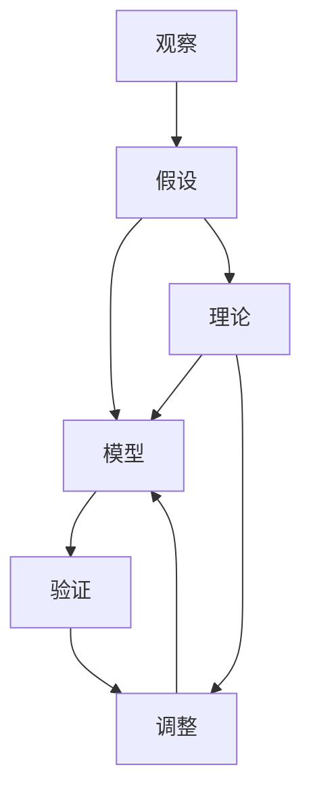
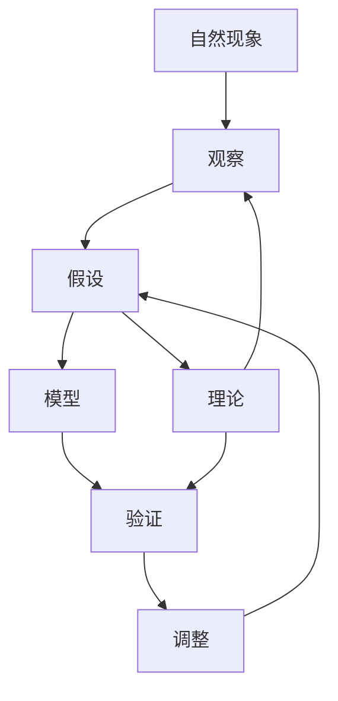

                 

# 科学探究：从假说到真理

## 1. 背景介绍

### 1.1 问题由来
科学探究是人类文明进步的重要推动力之一，从古老的哥白尼日心说到现代的量子力学，科学探究方法经历了无数次迭代与升华。无论是数学建模、物理实验，还是数据统计，科学探究总是围绕着一系列假设与检验展开，逐步逼近真理。

然而，即便如此，科学探究并非总能一帆风顺。过时旧说、证据缺失、理论漏洞等问题常常困扰着科学的前进。特别是在数据缺乏和理论不完备的情况下，如何验证假设的真实性，成为一项严峻挑战。

### 1.2 问题核心关键点
科学探究的核心关键点在于建立和检验假说，即对现象的合理解释和预测，并基于新证据调整理论。这一过程包括以下几个主要步骤：

1. **观察与假设**：根据观察到的现象，提出初步的假设。
2. **建立模型**：根据假设构建数学或物理模型，并设定可观测指标。
3. **实验设计**：设计实验验证模型的预测，同时确保实验过程的可重复性。
4. **数据收集与分析**：执行实验，收集数据，并进行统计分析。
5. **结果解读**：解释实验结果，验证假设的真伪，并提出新的理论或调整现有理论。

在实际应用中，科学探究还需要结合领域知识和经验，处理异常值，排除实验误差，确保结果的可靠性。

### 1.3 问题研究意义
科学探究方法对科技发展和人类进步具有重要意义：

1. **推动技术革新**：科学探究带来了无数的创新和技术突破，如蒸汽机、互联网等。
2. **解决实际问题**：通过深入研究自然现象，科学探究能够有效解决人类生活中的各种问题。
3. **形成知识体系**：科学探究构建了完善的科学知识体系，成为教育、科研的基础。
4. **推动社会进步**：科学探究推动了社会的整体进步，提升了人类的生活质量和文明水平。

## 2. 核心概念与联系

### 2.1 核心概念概述

为更好地理解科学探究的全过程，本节将介绍几个关键概念：

- **观察（Observation）**：对自然现象的直接记录和描述。
- **假设（Hypothesis）**：对观察现象提出的初步解释或假设。
- **模型（Model）**：基于假设构建的数学或物理模型，用于预测和解释现象。
- **验证（Verification）**：通过实验验证模型的预测是否准确。
- **调整（Revision）**：根据新数据或实验结果调整和改进模型。
- **理论（Theory）**：通过多次验证和调整，构建完善的科学理论。

这些概念之间存在着紧密的联系，共同构成了科学探究的完整框架。

### 2.2 概念间的关系

这些核心概念之间的关系可以通过以下Mermaid流程图来展示：



这个流程图展示了从观察到假设，再到模型验证和理论调整的完整过程：

1. 观察是科学探究的起点，直接或间接地启发假设的形成。
2. 假设是对观察现象提出的初步解释，构建初步的模型框架。
3. 模型是基于假设构建的数学或物理模型，用于预测和解释现象。
4. 验证通过实验验证模型的预测，确保其正确性。
5. 调整根据新数据或实验结果，不断调整和改进模型。
6. 理论经过多次验证和调整，逐步构建完善的科学理论。

### 2.3 核心概念的整体架构

最后，我们用一个综合的流程图来展示这些核心概念在大科学探究过程中的整体架构：



这个综合流程图展示了从自然现象到理论构建的完整科学探究过程：

1. 自然现象是科学探究的对象，通过观察获取相关数据。
2. 观察结果启发假设的形成，构建初步的模型。
3. 模型通过实验验证，得到初步的实验结果。
4. 根据实验结果进行模型调整，确保预测准确性。
5. 理论经过多次验证和调整，逐步完善和深化。
6. 理论不断应用于新的观察和实验，形成科学知识体系。

通过这些流程图，我们可以更清晰地理解科学探究的各个环节及其相互作用。

## 3. 核心算法原理 & 具体操作步骤
### 3.1 算法原理概述

科学探究的核心算法原理是通过假设检验，逐步验证和调整模型，以逼近真理。形式化地，假设检验过程包括以下步骤：

1. **建立假设**：建立原假设 $H_0$ 和备择假设 $H_1$。原假设通常是默认正确的，备择假设则是对原假设的否定。
2. **设定显著性水平**：定义统计检验的显著性水平 $\alpha$，即在原假设为真的情况下，错误拒绝原假设的概率。
3. **选择检验统计量**：根据样本数据，计算检验统计量 $T$，常用的统计量包括t检验、卡方检验、F检验等。
4. **计算p值**：计算检验统计量 $T$ 在原假设下发生的概率 $p$，即p值。
5. **比较p值与显著性水平**：如果 $p < \alpha$，则拒绝原假设，接受备择假设；否则，不拒绝原假设。

在实际操作中，还需要考虑样本量、数据分布、误差估计等因素，确保检验结果的可靠性。

### 3.2 算法步骤详解

科学探究的具体操作步骤包括以下几个关键步骤：

**Step 1: 数据收集**
- 根据假设设计实验，收集相关数据。
- 确保数据采集的随机性、可重复性和完备性。
- 处理数据缺失和异常值，确保数据的可靠性。

**Step 2: 数据预处理**
- 对数据进行清洗和归一化，去除噪声和干扰。
- 将数据划分为训练集和测试集，以进行模型训练和验证。

**Step 3: 建立模型**
- 根据假设构建数学模型，如线性回归、逻辑回归、神经网络等。
- 设定模型参数，并使用训练集数据进行训练。

**Step 4: 模型验证**
- 使用测试集数据验证模型的预测结果。
- 计算模型误差和指标，如均方误差、交叉熵等。
- 分析模型的泛化能力和鲁棒性。

**Step 5: 结果解读**
- 解释模型预测结果，分析其与真实值的差异。
- 根据模型误差和性能指标，调整和优化模型。

**Step 6: 理论调整**
- 根据新数据和实验结果，调整和改进假设和模型。
- 进行多次迭代，逐步逼近真实情况。
- 验证新理论的可靠性，形成完整的科学知识体系。

### 3.3 算法优缺点

科学探究方法具有以下优点：
1. 系统性：通过假设检验，逐步验证和调整模型，确保结果的可靠性。
2. 可重复性：实验过程可重复，便于验证和推广。
3. 科学性：基于数据驱动，避免了主观判断和猜测。
4. 普适性：适用于多种科学领域和应用场景。

同时，科学探究也存在一些局限性：
1. 数据依赖：依赖于高质量的数据，数据缺失或错误会影响结果的可靠性。
2. 实验成本：实验设计和执行可能需要大量资源和成本。
3. 理论修正：需要不断调整和改进模型，过程繁琐且复杂。
4. 假设局限：假设未必总能完全覆盖实际情况，可能存在偏差。

尽管有这些局限性，科学探究仍是当前主流的研究范式，广泛应用于科技、医学、工程等多个领域。

### 3.4 算法应用领域

科学探究方法在诸多领域都得到了广泛应用，例如：

- **医学**：通过临床实验验证药物疗效和安全性，逐步构建完善的医学理论。
- **化学**：通过化学反应实验，发现新物质和新反应机制，推动化学进展。
- **天文学**：通过天文观测，验证和调整宇宙模型，探索宇宙奥秘。
- **物理学**：通过实验验证物理规律，发现新现象和理论，推动物理学发展。
- **社会科学**：通过问卷调查和统计分析，研究社会现象和行为规律，提供政策建议。
- **计算机科学**：通过实验验证算法和模型，改进和优化算法性能。

除了上述领域，科学探究方法在更多新兴领域也展现出其独特的价值，如生物信息学、人工智能等。

## 4. 数学模型和公式 & 详细讲解  
### 4.1 数学模型构建

在科学探究中，数学模型是最常用的工具之一。以下我们以线性回归为例，介绍如何构建和验证数学模型。

假设有一组样本数据 $(x_i, y_i)$，其中 $x_i$ 为自变量，$y_i$ 为因变量。建立线性回归模型 $y = \beta_0 + \beta_1 x + \epsilon$，其中 $\beta_0$ 和 $\beta_1$ 为模型参数，$\epsilon$ 为误差项。

在给定样本数据的情况下，需要最小化预测值与真实值之间的误差，即最小化均方误差（MSE）：

$$
\min_{\beta_0, \beta_1} \frac{1}{n} \sum_{i=1}^n (y_i - \beta_0 - \beta_1 x_i)^2
$$

可以通过梯度下降等优化算法求解上述最优化问题，得到模型参数 $\beta_0$ 和 $\beta_1$。

### 4.2 公式推导过程

线性回归的公式推导过程如下：

1. **假设函数**：设 $y = \beta_0 + \beta_1 x + \epsilon$，其中 $\beta_0$ 和 $\beta_1$ 为未知参数。
2. **损失函数**：定义均方误差损失函数：

$$
L(\beta_0, \beta_1) = \frac{1}{n} \sum_{i=1}^n (y_i - \beta_0 - \beta_1 x_i)^2
$$

3. **梯度下降**：对损失函数求偏导数，得到梯度向量：

$$
\nabla_{\beta_0, \beta_1} L = \begin{bmatrix} -\frac{2}{n} \sum_{i=1}^n (y_i - \beta_0 - \beta_1 x_i) \\ -\frac{2}{n} \sum_{i=1}^n (y_i - \beta_0 - \beta_1 x_i)x_i \end{bmatrix}
$$

4. **参数更新**：通过梯度下降算法更新模型参数：

$$
\begin{bmatrix} \beta_0 \\ \beta_1 \end{bmatrix} \leftarrow \begin{bmatrix} \beta_0 \\ \beta_1 \end{bmatrix} - \eta \nabla_{\beta_0, \beta_1} L
$$

其中 $\eta$ 为学习率。

### 4.3 案例分析与讲解

以一个简单的案例来说明如何应用线性回归模型进行科学探究：

假设要研究身高和体重之间的关系。收集一组数据，每个样本包含身高 $x_i$ 和体重 $y_i$，其中 $i=1,2,...,n$。

1. **假设构建**：初步假设身高和体重之间存在线性关系，即体重可以表示为身高的线性函数：$y = \beta_0 + \beta_1 x$。
2. **模型训练**：使用梯度下降算法训练线性回归模型，得到 $\beta_0$ 和 $\beta_1$ 的值。
3. **模型验证**：使用验证集数据验证模型预测，计算均方误差（MSE）。
4. **结果解读**：分析模型预测结果，解释其与真实值的差异。
5. **理论调整**：根据新数据和实验结果，调整和改进假设和模型。

## 5. 项目实践：代码实例和详细解释说明
### 5.1 开发环境搭建

在进行科学探究的实践前，我们需要准备好开发环境。以下是使用Python进行Scikit-learn开发的环境配置流程：

1. 安装Anaconda：从官网下载并安装Anaconda，用于创建独立的Python环境。

2. 创建并激活虚拟环境：
```bash
conda create -n sci-investigation python=3.8 
conda activate sci-investigation
```

3. 安装Scikit-learn：
```bash
conda install scikit-learn
```

4. 安装各类工具包：
```bash
pip install numpy pandas matplotlib seaborn jupyter notebook ipython
```

完成上述步骤后，即可在`sci-investigation`环境中开始科学探究实践。

### 5.2 源代码详细实现

下面我们以线性回归为例，给出使用Scikit-learn进行科学探究的PyTorch代码实现。

首先，准备数据集：

```python
from sklearn.datasets import load_boston
from sklearn.model_selection import train_test_split
import pandas as pd
import numpy as np

# 加载波士顿房价数据集
boston = load_boston()
X = boston.data
y = boston.target

# 数据集分为训练集和测试集
X_train, X_test, y_train, y_test = train_test_split(X, y, test_size=0.2, random_state=42)
```

然后，构建线性回归模型并进行训练：

```python
from sklearn.linear_model import LinearRegression
from sklearn.metrics import mean_squared_error

# 构建线性回归模型
model = LinearRegression()

# 模型训练
model.fit(X_train, y_train)

# 模型预测
y_pred = model.predict(X_test)

# 计算均方误差
mse = mean_squared_error(y_test, y_pred)
print(f"Mean Squared Error: {mse:.2f}")
```

最后，评估模型性能：

```python
from sklearn.metrics import r2_score

# 计算R方值
r2 = r2_score(y_test, y_pred)
print(f"R-squared: {r2:.2f}")
```

以上就是使用Scikit-learn进行线性回归模型训练和评估的完整代码实现。可以看到，Scikit-learn提供了简单易用的API接口，方便开发者快速上手。

### 5.3 代码解读与分析

让我们再详细解读一下关键代码的实现细节：

**load_boston函数**：
- 从Scikit-learn库中加载波士顿房价数据集，返回一个字典，包含样本特征和目标变量。

**train_test_split函数**：
- 将数据集分为训练集和测试集，测试集占总数据的20%。

**LinearRegression类**：
- 从Scikit-learn库中导入线性回归模型，构建线性回归模型对象。

**模型训练**：
- 使用fit方法进行模型训练，将训练集数据X_train和y_train作为输入。

**模型预测**：
- 使用predict方法进行模型预测，将测试集数据X_test作为输入，得到预测结果y_pred。

**均方误差计算**：
- 使用mean_squared_error函数计算模型预测值与真实值之间的均方误差。

**R方值计算**：
- 使用r2_score函数计算模型预测值与真实值之间的R方值，表示模型解释变异的能力。

通过上述代码实现，我们成功构建了一个简单的线性回归模型，并对其性能进行了评估。

## 6. 实际应用场景
### 6.1 医学研究

科学探究方法在医学研究中得到了广泛应用，特别是在药物疗效验证和疾病诊断方面。

**药物疗效验证**：
- 通过临床实验，验证新药的疗效和安全性。
- 使用随机对照试验（RCT），设定对照组和实验组，测量药物的效果和副作用。
- 分析实验数据，得出药物的疗效和风险。
- 调整和改进药物配方，优化治疗方案。

**疾病诊断**：
- 使用统计模型，分析临床数据，预测疾病风险。
- 通过机器学习算法，构建疾病分类模型，辅助医生诊断。
- 根据新数据和实验结果，调整和改进模型，提高诊断准确性。

### 6.2 化学研究

科学探究方法在化学研究中也发挥了重要作用，特别是在新物质发现和反应机制研究方面。

**新物质发现**：
- 通过实验合成新物质，测量其物理和化学性质。
- 使用光谱分析等技术，解析新物质的分子结构。
- 根据实验数据，构建新物质的分子模型。
- 调整和改进合成方法和反应条件，提高合成效率和产量。

**反应机制研究**：
- 通过实验观察反应过程，分析反应机理。
- 使用量子化学计算，模拟反应过程，理解反应机理。
- 根据实验和计算结果，调整和改进反应条件，提高反应效率和选择性。

### 6.3 天文学研究

科学探究方法在天文学研究中也得到了广泛应用，特别是在宇宙模型验证和天体探索方面。

**宇宙模型验证**：
- 通过天文观测，验证宇宙模型的正确性。
- 使用大型望远镜，观测天体运动和光谱。
- 分析观测数据，调整和改进宇宙模型。
- 根据新数据和实验结果，逐步构建完善的宇宙模型。

**天体探索**：
- 使用光谱分析等技术，研究天体的物理和化学性质。
- 通过观测和计算，确定天体的运动轨迹和速度。
- 根据观测和计算结果，调整和改进观测方法和计算模型。
- 逐步揭示天体的本质和规律，推动天文学的进步。

### 6.4 未来应用展望

随着科学探究技术的不断进步，未来在以下领域将展现出更加广阔的应用前景：

1. **人工智能**：科学探究方法结合机器学习，推动人工智能的进步。通过数据驱动和模型验证，优化算法性能。
2. **环境科学**：科学探究方法用于环境监测和预测，分析环境变化规律。
3. **社会心理学**：科学探究方法用于社会行为分析，研究社会心理现象。
4. **生物医学**：科学探究方法用于生物医学研究，探索疾病机制和治疗方法。
5. **化学工程**：科学探究方法用于化学工程设计，优化化学反应过程。
6. **工程制造**：科学探究方法用于产品设计和制造，提高产品质量和生产效率。

未来，科学探究方法将在更多领域得到应用，推动人类社会不断进步。

## 7. 工具和资源推荐
### 7.1 学习资源推荐

为了帮助开发者系统掌握科学探究的理论基础和实践技巧，这里推荐一些优质的学习资源：

1. **《科学探究与统计分析》**：一本全面介绍科学探究方法的教材，涵盖实验设计、数据分析、假设检验等多个方面。

2. **《统计学基础》**：一本介绍统计学基本概念和方法的教材，适合初学者入门。

3. **Coursera《统计学导论》**：由约翰霍普金斯大学提供的免费在线课程，系统讲解统计学原理和应用。

4. **edX《科学探究方法》**：由哈佛大学提供的免费在线课程，详细讲解科学探究的全过程。

5. **Khan Academy《统计学》**：免费的在线教育平台，提供统计学基础知识和实践技巧。

通过对这些资源的学习实践，相信你一定能够快速掌握科学探究的精髓，并用于解决实际的科学问题。

### 7.2 开发工具推荐

高效的开发离不开优秀的工具支持。以下是几款用于科学探究开发的常用工具：

1. **Python**：一种通用编程语言，广泛用于科学探究和数据分析。
2. **Scikit-learn**：一个基于Python的机器学习库，提供丰富的统计学和机器学习算法。
3. **R**：一种专门用于统计分析和数据可视化的语言，适合科学探究和数据分析。
4. **MATLAB**：一个强大的科学计算和数据分析工具，适合数值计算和仿真建模。
5. **Jupyter Notebook**：一个交互式编程环境，支持Python、R等多种语言，适合数据分析和科学探究。
6. **Matplotlib**：一个Python数据可视化库，支持多种图表绘制，适合科学探究和数据分析。

合理利用这些工具，可以显著提升科学探究任务的开发效率，加快创新迭代的步伐。

### 7.3 相关论文推荐

科学探究方法的发展源于学界的持续研究。以下是几篇奠基性的相关论文，推荐阅读：

1. **《假设检验与统计显著性》**：一篇经典的统计学论文，详细讲解假设检验的基本原理和方法。
2. **《科学探究中的随机化实验设计》**：一篇关于随机对照试验的综述论文，详细介绍实验设计的原则和方法。
3. **《机器学习在科学探究中的应用》**：一篇关于机器学习在科学探究中的应用的综述论文，涵盖多种机器学习算法和应用实例。
4. **《深度学习在科学探究中的进展》**：一篇关于深度学习在科学探究中的应用进展的综述论文，涵盖多种深度学习模型和应用实例。

这些论文代表了大科学探究方法的发展脉络。通过学习这些前沿成果，可以帮助研究者把握学科前进方向，激发更多的创新灵感。

除上述资源外，还有一些值得关注的前沿资源，帮助开发者紧跟科学探究技术的最新进展，例如：

1. **arXiv论文预印本**：人工智能领域最新研究成果的发布平台，包括大量尚未发表的前沿工作，学习前沿技术的必读资源。

2. **顶级学术会议**：如ICML、NeurIPS、ACL等顶级学术会议，可以聆听到领域内顶尖学者的最新分享，开拓视野。

3. **开源科学探究库**：如SciPy、Pandas、NumPy等Python科学计算库，提供丰富的科学计算工具和算法。

4. **科学数据平台**：如Kaggle、UCI Machine Learning Repository等平台，提供大量的科学数据集和研究案例。

5. **科学探究社区**：如Kaggle、Data Science Stack Exchange等社区，可以交流科学探究的实践经验和问题解决思路。

总之，对于科学探究技术的学习和实践，需要开发者保持开放的心态和持续学习的意愿。多关注前沿资讯，多动手实践，多思考总结，必将收获满满的成长收益。

## 8. 总结：未来发展趋势与挑战

### 8.1 总结

本文对科学探究方法进行了全面系统的介绍。首先阐述了科学探究的背景和意义，明确了假设检验和理论调整是科学探究的核心步骤。其次，从原理到实践，详细讲解了科学探究的数学模型和关键步骤，给出了科学探究任务开发的完整代码实例。同时，本文还广泛探讨了科学探究方法在医学、化学、天文学等多个领域的应用前景，展示了科学探究方法的巨大潜力。此外，本文精选了科学探究技术的各类学习资源，力求为读者提供全方位的技术指引。

通过本文的系统梳理，可以看到，科学探究方法在科技发展和人类进步中扮演了重要角色。它通过数据驱动和模型验证，逐步逼近真理，推动了人类认知智能的进化。未来，科学探究方法将在更多领域得到应用，为科技和社会的进步带来新的动力。

### 8.2 未来发展趋势

展望未来，科学探究方法将呈现以下几个发展趋势：

1. **数据驱动**：随着数据量的不断增长，数据驱动的科学探究将成为主流。通过大数据分析和机器学习，快速获取和验证假设。
2. **跨学科融合**：科学探究方法将与其他学科（如数学、物理、化学等）进行深度融合，形成更加全面和系统的知识体系。
3. **自动化和智能化**：自动化和智能化技术将进一步提升科学探究的效率和精度，减少人为误差。
4. **多模态融合**：科学探究方法将结合多种数据模态（如文本、图像、音频等），进行多模态信息的协同建模。
5. **实时性增强**：通过实时数据采集和快速算法，实现科学探究的实时性和动态性。
6. **跨领域应用**：科学探究方法将应用于更多领域，如医学、化学、工程、金融等，推动各行业的技术进步。

以上趋势凸显了科学探究技术的广阔前景。这些方向的探索发展，必将进一步提升科学探究的精度和效率，加速科学技术的进步。

### 8.3 面临的挑战

尽管科学探究方法已经取得了瞩目成就，但在迈向更加智能化、普适化应用的过程中，它仍面临着诸多挑战：

1. **数据质量**：高质量的数据是科学探究的基础，但数据获取和标注成本高昂。如何降低数据成本，提高数据质量，是科学探究的重要课题。
2. **模型复杂性**：复杂的模型需要大量的计算资源和存储空间，如何优化模型结构，提高计算效率，是科学探究的难点。
3. **理论局限**：现有的科学理论未必总能完全解释和预测新现象，如何建立更加完善和普适的理论体系，是科学探究的挑战。
4. **伦理和安全**：科学探究结果可能带来伦理和安全问题，如何保证研究结果的公正性和安全性，是科学探究的关注点。
5. **交叉学科**：科学探究涉及多学科知识，如何打破学科壁垒，实现跨学科合作，是科学探究的关键。
6. **数据隐私**：科学探究中涉及大量的个人隐私数据，如何保护数据隐私，避免数据滥用，是科学探究的伦理要求。

正视科学探究面临的这些挑战，积极应对并寻求突破，将使科学探究方法迈向更高的台阶，为构建更加智能和普适的科学系统铺平道路。

### 8.4 研究展望

面对科学探究所面临的挑战，未来的研究需要在以下几个方面寻求新的突破：

1. **数据获取和标注**：

