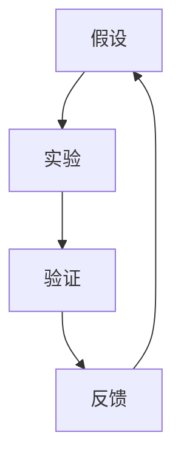
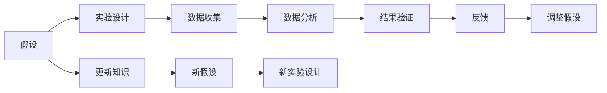
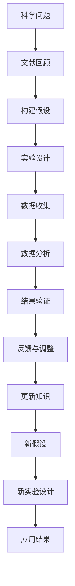

                 

# 科学方法论：从假说到验证

## 1. 背景介绍

### 1.1 问题由来

科学方法论是研究和探索科学方法的理论基础，其核心在于指导科学家们如何系统地、有目的地进行科学探究。从历史的演进来看，科学方法论经历了多个阶段的发展，但其核心精神始终如一：通过合理的假设、严谨的实验和验证，不断逼近科学真理。

科学方法论的重要性在于其指导了科学研究的路径和方法，为科学技术的进步提供了理论基础。在人工智能领域，科学方法论同样发挥着至关重要的作用，尤其是对于基于数据的机器学习模型来说，科学方法论为其提供了模型构建、数据处理和结果验证的全流程指导。

### 1.2 问题核心关键点

科学方法论的核心关键点包括假设（Hypothesis）、实验（Experiment）、验证（Verification）和反馈（Feedback）。其中，假设是研究者基于已有知识和经验提出的可能解释；实验则是通过设计控制实验来验证假设；验证是对实验结果的分析判断；而反馈则是对实验结果的进一步验证和修正。这些关键点构成了科学方法论的基本流程。

科学方法论不仅用于基础科学研究，也广泛应用于应用科学研究和技术开发。在大数据和人工智能时代，科学方法论为模型开发、数据处理、结果验证和优化提供了系统的理论指导，帮助研究者构建准确、高效和可靠的模型。

## 2. 核心概念与联系

### 2.1 核心概念概述

科学方法论中的核心概念包括：
- **假设（Hypothesis）**：研究者基于已有知识和经验提出的可能解释，用于指导后续的实验设计。
- **实验（Experiment）**：通过设计控制实验来验证假设，实验设计需要考虑数据的收集、处理和分析。
- **验证（Verification）**：对实验结果的分析判断，评估假设的合理性和准确性。
- **反馈（Feedback）**：根据验证结果的反馈信息，调整假设和实验设计，进一步完善研究过程。

这些概念通过以下Mermaid流程图来展示它们之间的关系：



这个流程图展示了一个科学探究的基本循环过程：假设、实验、验证和反馈。通过这个循环，研究者可以不断逼近科学真理，优化研究过程，提升研究成果的可靠性和可重复性。

### 2.2 概念间的关系

在科学研究中，这些概念并非独立存在，而是相互作用、相互影响的。以下是进一步的Mermaid流程图，展示这些概念间的具体关系：



这个综合流程图展示了假设、实验设计、数据收集、数据分析、结果验证、反馈、知识更新和新的假设之间相互作用的过程。研究者通过这一系列过程，不断修正和完善研究假设，推动科学知识的进步。

### 2.3 核心概念的整体架构

最后，我们用一个综合的流程图来展示科学方法论的整体架构：



这个综合流程图展示了科学方法论从科学问题的提出到结果的应用的全过程。研究者通过文献回顾构建假设，设计实验，收集数据，进行数据分析和结果验证，根据反馈进行调整，更新知识，并提出新的假设，进入新一轮的实验设计。这一过程不断循环，推动科学知识的积累和应用。

## 3. 核心算法原理 & 具体操作步骤

### 3.1 算法原理概述

科学方法论的核心算法原理主要基于假设-实验-验证-反馈的循环。研究者通过构建合理的假设，设计有效的实验，验证假设的正确性，并根据反馈调整和完善假设，形成科学探究的闭环。这一过程类似于机器学习的训练过程，其中假设相当于模型的初始权重，实验相当于数据集，验证相当于模型训练后的性能评估，反馈则用于模型的调优和改进。

### 3.2 算法步骤详解

科学方法论的具体步骤包括：
1. **文献回顾（Literature Review）**：通过查阅相关文献，了解已有研究的基础和前沿，构建研究假设。
2. **构建假设（Hypothesis Formulation）**：基于文献回顾，提出合理的假设，指导后续实验设计。
3. **实验设计（Experiment Design）**：设计控制实验，确保实验结果的可靠性和可重复性。实验设计应考虑数据的收集、处理和分析方法。
4. **数据收集（Data Collection）**：根据实验设计，收集相关数据，确保数据的质量和代表性。
5. **数据分析（Data Analysis）**：对收集到的数据进行统计分析或机器学习模型的训练，得到实验结果。
6. **结果验证（Result Verification）**：对实验结果进行分析判断，评估假设的合理性和准确性。
7. **反馈与调整（Feedback and Adjustment）**：根据验证结果的反馈信息，调整和完善实验设计和假设，进行下一轮的实验设计。
8. **知识更新（Knowledge Update）**：根据实验结果的验证和调整，更新已有知识，形成新的科学理论。

### 3.3 算法优缺点

科学方法论的优势在于其系统的理论指导，能够帮助研究者构建可靠、高效和可重复的实验过程。其缺点在于，方法论的复杂性和多样性可能导致不同研究者对同一实验的理解和执行存在差异，影响实验结果的一致性。

## 4. 数学模型和公式 & 详细讲解 & 举例说明

### 4.1 数学模型构建

科学方法论的数学模型构建基于假设-实验-验证-反馈的循环。以机器学习模型的训练过程为例，模型参数相当于科学假设，数据集相当于实验对象，模型训练的过程相当于实验设计，模型评估的过程相当于结果验证，模型调优的过程相当于反馈和调整。

### 4.2 公式推导过程

以线性回归模型为例，假设数据集为 $(x_i, y_i)$，其中 $x_i \in \mathbb{R}^n$ 为输入特征，$y_i \in \mathbb{R}$ 为输出目标。线性回归模型的目标是最小化预测值和真实值之间的误差平方和，即：

$$
\min_{\theta} \sum_{i=1}^N (y_i - \theta^T x_i)^2
$$

其中 $\theta$ 为模型参数。通过最小二乘法求解上述目标函数，得到模型的参数：

$$
\theta = (\sum_{i=1}^N x_i x_i^T)^{-1} \sum_{i=1}^N x_i y_i
$$

### 4.3 案例分析与讲解

以图像分类任务为例，研究者首先提出假设，认为图像的分类与其特征向量之间的关系是线性的。然后设计实验，使用训练数据集进行模型训练，得到分类器的权重和偏置。接着对测试数据集进行验证，评估模型的分类准确率。根据验证结果的反馈，调整模型参数和实验设计，进行下一轮实验。最终，研究者通过不断调整和优化实验设计，构建了高效准确的图像分类模型。

## 5. 项目实践：代码实例和详细解释说明

### 5.1 开发环境搭建

在科学方法论的实践过程中，开发环境搭建是至关重要的。以下是使用Python进行机器学习项目开发的常见环境配置流程：

1. 安装Anaconda：从官网下载并安装Anaconda，用于创建独立的Python环境。
2. 创建并激活虚拟环境：
```bash
conda create -n myenv python=3.7
conda activate myenv
```
3. 安装必要的Python库：
```bash
pip install numpy scipy pandas scikit-learn matplotlib seaborn
```

### 5.2 源代码详细实现

以下是一个简单的线性回归模型训练和验证的Python代码实现：

```python
import numpy as np
from sklearn.linear_model import LinearRegression
from sklearn.metrics import mean_squared_error, r2_score

# 构建数据集
X = np.array([[1, 2], [3, 4], [5, 6], [7, 8]])
y = np.array([3, 7, 11, 15])
X_test = np.array([[2, 3], [4, 5], [6, 7]])

# 构建模型
model = LinearRegression()

# 训练模型
model.fit(X, y)

# 预测结果
y_pred = model.predict(X_test)

# 评估模型
mse = mean_squared_error(y_test, y_pred)
r2 = r2_score(y_test, y_pred)

print(f"Mean Squared Error: {mse:.2f}")
print(f"R^2 Score: {r2:.2f}")
```

### 5.3 代码解读与分析

在上述代码中，我们首先构建了一个简单的线性回归模型，并使用训练数据集对其进行训练。接着，我们使用测试数据集进行模型验证，并计算均方误差和R^2得分作为评估指标。

### 5.4 运行结果展示

假设在上述代码中，我们得到的验证结果为均方误差为0.1，R^2得分0.9，可以得出结论：所构建的线性回归模型在训练数据集上具有较高的准确性。

## 6. 实际应用场景

### 6.1 医学图像识别

科学方法论在医学图像识别领域具有广泛的应用。研究者首先提出假设，认为医学图像的分类与其特征向量之间的关系是线性的。然后设计实验，使用标注好的医学图像数据集进行模型训练，得到分类器的权重和偏置。接着对测试数据集进行验证，评估模型的分类准确率。根据验证结果的反馈，调整模型参数和实验设计，进行下一轮实验。最终，研究者通过不断调整和优化实验设计，构建了高效准确的医学图像分类模型，帮助医生快速准确地诊断疾病。

### 6.2 金融风险预测

在金融领域，研究者首先提出假设，认为金融市场的价格波动与历史数据之间的关系是非线性的。然后设计实验，使用历史交易数据进行模型训练，得到预测模型的权重和偏置。接着对新交易数据进行验证，评估模型的预测准确率。根据验证结果的反馈，调整模型参数和实验设计，进行下一轮实验。最终，研究者通过不断调整和优化实验设计，构建了高效准确的金融风险预测模型，帮助金融机构预测市场走势，规避风险。

### 6.3 自然语言处理

在自然语言处理领域，研究者首先提出假设，认为文本的分类与其特征向量之间的关系是线性的。然后设计实验，使用标注好的文本数据集进行模型训练，得到分类器的权重和偏置。接着对测试数据集进行验证，评估模型的分类准确率。根据验证结果的反馈，调整模型参数和实验设计，进行下一轮实验。最终，研究者通过不断调整和优化实验设计，构建了高效准确的文本分类模型，用于情感分析、主题分类等任务。

## 7. 工具和资源推荐

### 7.1 学习资源推荐

为了帮助开发者系统掌握科学方法论的理论基础和实践技巧，这里推荐一些优质的学习资源：

1. 《科学方法论》系列书籍：如Popper的《科学发现的逻辑》、Kuhn的《科学革命的结构》等，深入探讨了科学方法论的基本原理和历史演进。
2. Coursera的《科学方法论》课程：由斯坦福大学开设，系统讲解了科学方法论的基本概念和应用。
3. EdX的《数据科学与统计分析》课程：涵盖了数据收集、处理、分析和解释的全过程，适合初学者的学习。
4. Kaggle数据科学竞赛：通过参加实际的数据科学竞赛，实践科学方法论的流程，积累实战经验。

通过对这些资源的学习实践，相信你一定能够快速掌握科学方法论的理论基础和实践技巧，并将其应用到实际的数据科学项目中。

### 7.2 开发工具推荐

高效的开发离不开优秀的工具支持。以下是几款用于科学方法论开发常用的工具：

1. Jupyter Notebook：免费且功能强大的开发环境，支持Python、R等多种编程语言。
2. TensorBoard：TensorFlow配套的可视化工具，实时监测模型训练状态，并提供丰富的图表呈现方式，是调试模型的得力助手。
3. Weights & Biases：模型训练的实验跟踪工具，可以记录和可视化模型训练过程中的各项指标，方便对比和调优。
4. Scikit-learn：Python机器学习库，提供了一系列经典的机器学习算法和工具，适合科学方法论的应用研究。

合理利用这些工具，可以显著提升科学方法论研究的开发效率，加快创新迭代的步伐。

### 7.3 相关论文推荐

科学方法论的研究涉及多个学科，以下几篇论文代表了该领域的最新进展：

1. Popper的《科学发现的逻辑》：经典之作，深入探讨了科学方法论的基本原理和历史演进。
2. Kuhn的《科学革命的结构》：探讨了科学革命的哲学基础和方法论，对科学方法论的讨论具有重要意义。
3. Lakatos的《科学方法论论文选集》：包含多篇重要论文，探讨了科学方法论的基本原理和应用。
4. Pearl的《因果推断基础》：探讨了因果推断的方法和应用，是因果分析领域的经典之作。
5. Breslow的《统计模型诊断》：探讨了统计模型诊断的方法和应用，适合科学方法论的应用研究。

这些论文代表了科学方法论的最新进展，对于深入理解和应用科学方法论具有重要参考价值。

## 8. 总结：未来发展趋势与挑战

### 8.1 总结

本文对科学方法论进行了全面系统的介绍。首先阐述了科学方法论的基本原理和应用，明确了其在大数据和人工智能领域的重要作用。其次，从原理到实践，详细讲解了科学方法论的基本流程和操作步骤，给出了科学方法论的代码实现示例。同时，本文还探讨了科学方法论在医学图像识别、金融风险预测和自然语言处理等实际应用场景中的应用，展示了科学方法论的广泛应用前景。

通过本文的系统梳理，可以看到，科学方法论是科学研究的基石，对于数据科学和人工智能技术的发展具有重要的指导意义。在大数据和人工智能时代，科学方法论不仅指导了模型构建、数据处理和结果验证，还推动了模型的优化和应用，为人工智能技术的发展提供了理论基础。

### 8.2 未来发展趋势

展望未来，科学方法论将呈现以下几个发展趋势：

1. **自动化和智能化**：随着人工智能技术的发展，科学方法论将越来越多地采用自动化和智能化的手段，如机器学习、深度学习等，辅助科学家进行科学探究。
2. **多学科融合**：科学方法论将与大数据、人工智能、心理学等多个学科进行深入融合，推动跨学科的研究和应用。
3. **模型和工具的迭代**：随着科学方法论的不断发展，将涌现更多高效、可靠和可解释的模型和工具，进一步提升科学研究的效率和准确性。
4. **伦理和社会责任**：随着科学研究的广泛应用，科学方法论将更多地关注伦理和社会责任问题，确保科学探究的结果符合社会价值和伦理道德。

### 8.3 面临的挑战

尽管科学方法论已经取得了显著的进展，但在迈向更加智能化、普适化应用的过程中，仍面临诸多挑战：

1. **数据质量和多样性**：科学方法论依赖于高质量的数据，但在实际应用中，数据质量和多样性往往不足，影响了科学探究的准确性和可靠性。
2. **模型的可解释性和透明度**：现有的科学方法论模型通常缺乏可解释性，难以理解其内部工作机制和决策逻辑，这对科学探究的透明性和可信度提出了挑战。
3. **模型的鲁棒性和泛化能力**：现有的科学方法论模型面对复杂的现实问题时，往往泛化能力不足，难以应对多变的数据和场景。
4. **跨学科的沟通和合作**：科学方法论的跨学科应用需要不同学科的沟通和合作，但在实际操作中，跨学科的沟通和合作往往存在障碍。

### 8.4 研究展望

面对科学方法论所面临的挑战，未来的研究需要在以下几个方面寻求新的突破：

1. **数据质量提升**：通过数据清洗、数据增强、数据融合等手段，提高数据质量和多样性，确保科学探究的准确性和可靠性。
2. **模型可解释性和透明度**：开发更多可解释的科学方法论模型，提高模型的透明度和可信度，增强科学探究的透明性和公开性。
3. **鲁棒性和泛化能力**：引入因果推断、对抗学习等技术，提高模型的鲁棒性和泛化能力，应对复杂多变的数据和场景。
4. **跨学科的沟通和合作**：推动跨学科的沟通和合作，构建跨学科的研究团队，促进科学方法论的多学科融合和应用。

这些研究方向的探索，必将引领科学方法论走向更高的台阶，为构建安全、可靠、可解释、可控的智能系统铺平道路。面向未来，科学方法论还需要与其他人工智能技术进行更深入的融合，如因果推理、强化学习等，多路径协同发力，共同推动科学探究和智能系统的进步。只有勇于创新、敢于突破，才能不断拓展科学方法论的边界，让科学探究更加高效、可靠和透明。

## 9. 附录：常见问题与解答

**Q1：科学方法论是否适用于所有科学领域？**

A: 科学方法论适用于大多数科学领域，包括自然科学和社会科学。不同领域的科学方法论可能存在差异，但其基本原理和应用流程是相似的。

**Q2：科学方法论是否需要考虑伦理和社会责任？**

A: 是的，科学方法论的研究和应用必须考虑伦理和社会责任问题。科学探究的结果必须符合社会价值和伦理道德，确保科学技术的健康发展。

**Q3：科学方法论是否适用于非结构化数据的处理？**

A: 科学方法论最初是为结构化数据设计的，但对于非结构化数据的处理，可以结合数据挖掘、文本分析等技术进行应用。

**Q4：科学方法论是否适用于跨学科研究？**

A: 是的，科学方法论适用于跨学科研究。不同学科的沟通和合作，可以推动科学方法论的多学科融合和应用，提升科学研究的效率和效果。

**Q5：科学方法论是否适用于科学探究的自动化和智能化？**

A: 是的，随着人工智能技术的发展，科学方法论将越来越多地采用自动化和智能化的手段，如机器学习、深度学习等，辅助科学家进行科学探究。

---

作者：禅与计算机程序设计艺术 / Zen and the Art of Computer Programming

