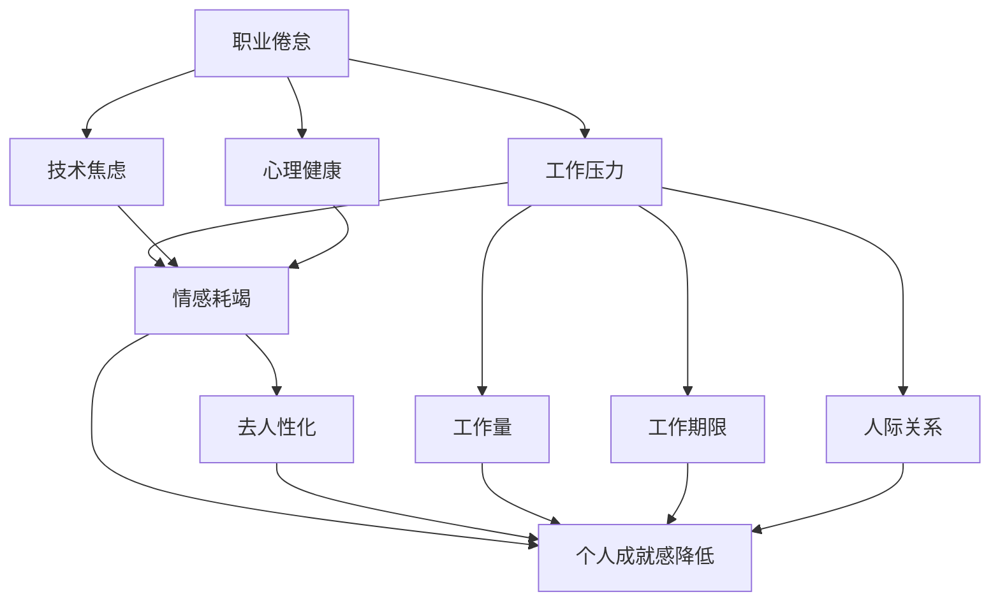
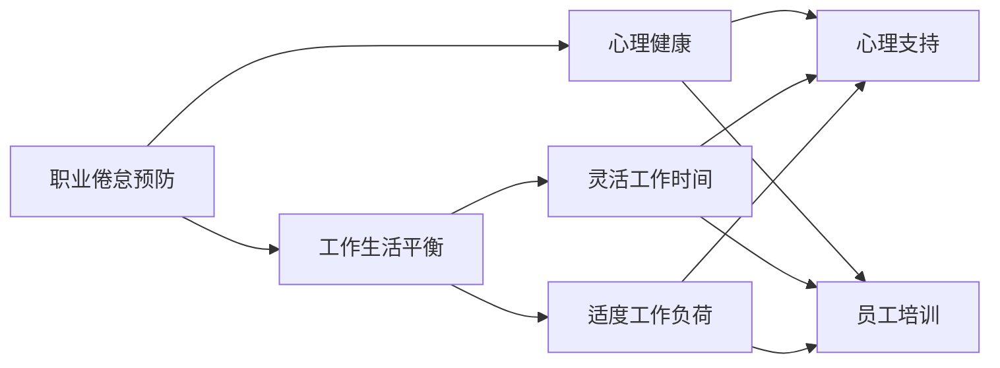
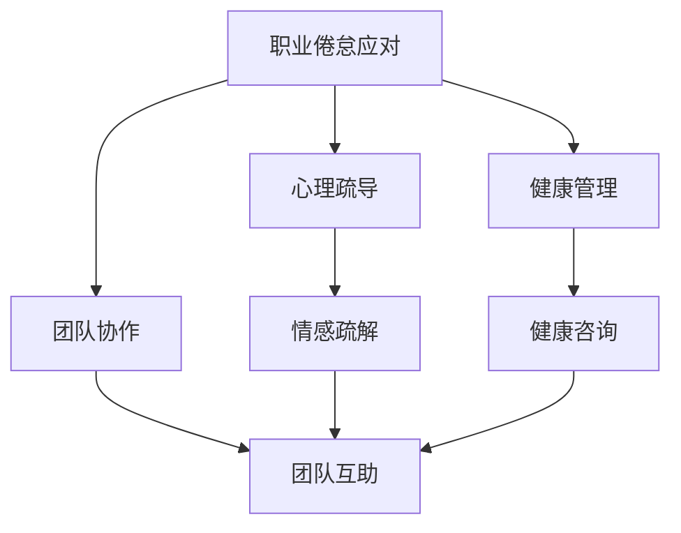
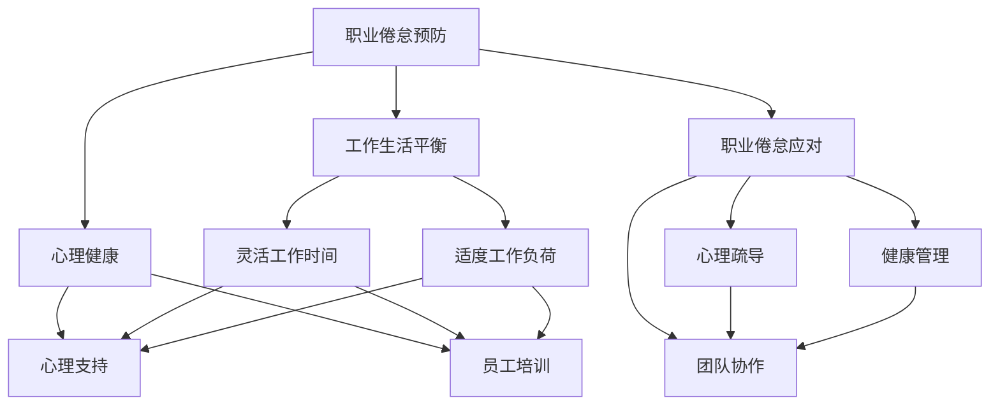

                 

# 程序员的职业倦怠：预防与应对

> 关键词：职业倦怠,预防策略,应对措施,心理健康,工作压力,技术焦虑,远程工作,工作生活平衡,工作环境优化

## 1. 背景介绍

### 1.1 问题由来
在当今快速发展的科技行业中，程序员的工作强度和压力不断增加。长时间的工作时间、高负荷的代码编写、持续的技术更新和项目交付压力，都可能导致程序员出现职业倦怠（Job Burnout）。职业倦怠不仅影响个人的工作效率和生产力，还可能带来一系列身心健康问题，如抑郁症、焦虑症等。因此，如何预防和应对程序员的职业倦怠，已成为IT行业的一大重要课题。

### 1.2 问题核心关键点
职业倦怠是程序员在长期高压工作环境下产生的一种心理和生理上的过度疲劳状态。其核心表现为：
- **情感耗竭**：对工作失去兴趣，感到精疲力竭。
- **去人性化**：对同事和客户变得冷漠和不耐烦。
- **个人成就感降低**：对自己的工作感到无效和没有价值。

产生职业倦怠的原因复杂多样，包括工作压力过大、工作与生活失衡、缺乏工作成就感和团队合作问题等。特别是在远程工作环境下，缺乏面对面交流和团队合作，更容易产生孤独感和孤立感，从而加剧职业倦怠。

### 1.3 问题研究意义
预防和应对程序员的职业倦怠，对于提升团队生产力和个人生活质量，推动企业的持续发展和创新，具有重要意义：

1. **提高工作效率**：缓解职业倦怠能够显著提升程序员的工作动力和专注度，从而提高生产效率。
2. **降低离职率**：通过有效的预防和应对措施，可以减少因职业倦怠导致的离职现象，稳定团队。
3. **提升创新能力**：良好的工作环境和心理状态能够激发员工的创造力和创新思维。
4. **保障企业可持续发展**：职业倦怠的员工不仅影响自身，也可能波及团队和企业文化，影响企业的长期发展。
5. **促进员工心理健康**：营造积极健康的工作氛围，有助于员工的心理健康和职业发展。

## 2. 核心概念与联系

### 2.1 核心概念概述

为更好地理解如何预防和应对程序员的职业倦怠，本节将介绍几个密切相关的核心概念：

- **职业倦怠**：指个体在长期高压力工作环境下，产生的情感耗竭、去人性化和个人成就感降低等身心疲劳状态。
- **心理健康**：指个体在生理、情感和认知方面处于良好状态，能够有效应对生活中的各种压力和挑战。
- **工作压力**：指个体在工作环境中感受到的压力和负担，包括工作量、期限、人际关系等。
- **技术焦虑**：指在快速变化的技术环境中，个体对自身技术能力的不确定感和紧张感。
- **远程工作**：指通过网络技术，员工可以在任何地方进行远程办公，带来灵活性和自由度的同时，也面临新的挑战。
- **工作生活平衡**：指个体在工作和生活中寻找合理平衡点，确保身心健康和高效工作。
- **工作环境优化**：指通过改善物理和心理工作环境，提升团队合作和工作效率。

这些核心概念之间存在着紧密的联系，形成了职业倦怠预防和应对的整体框架。下面我们通过几个Mermaid流程图来展示这些概念之间的关系：



这个流程图展示了职业倦怠与相关概念的关系：

1. 工作压力、技术焦虑和心理健康共同构成职业倦怠的主要因素。
2. 工作压力包括工作量、期限和人际关系等具体因素，直接影响情感耗竭。
3. 技术焦虑和工作压力同时作用，共同导致个人成就感降低。
4. 去人性化、情感耗竭和成就感降低，共同构成职业倦怠的三个主要表现。

### 2.2 概念间的关系

这些核心概念之间存在着紧密的联系，形成了职业倦怠预防和应对的完整生态系统。下面我通过几个Mermaid流程图来展示这些概念之间的关系。

#### 2.2.1 职业倦怠预防策略



这个流程图展示了预防职业倦怠的主要策略：

1. 工作生活平衡包括灵活工作时间和适度工作负荷，能够有效降低工作压力。
2. 心理健康和心理支持、员工培训相结合，能够提升员工的心理素质，增强抗压能力。
3. 心理支持和员工培训，能够帮助员工建立积极的工作态度，提升工作效率。

#### 2.2.2 职业倦怠应对措施



这个流程图展示了应对职业倦怠的主要措施：

1. 心理疏导和情感疏解能够帮助员工释放负面情绪，缓解情感耗竭。
2. 健康管理和健康咨询能够提升员工的身体健康，缓解心理压力。
3. 团队协作和团队互助能够增强团队凝聚力，提升员工的归属感和支持感。

### 2.3 核心概念的整体架构

最后，我们用一个综合的流程图来展示这些核心概念在职业倦怠预防和应对过程中的整体架构：



这个综合流程图展示了从预防到应对的职业倦怠管理全过程：

1. 职业倦怠预防策略包括工作生活平衡、心理健康、心理支持和员工培训，能够在问题发生前进行预防。
2. 职业倦怠应对措施包括心理疏导、健康管理和团队协作，能够在问题发生后进行缓解。

通过这些流程图，我们可以更清晰地理解职业倦怠预防和应对过程中各个核心概念的关系和作用，为后续深入讨论具体的预防和应对措施奠定基础。

## 3. 核心算法原理 & 具体操作步骤
### 3.1 算法原理概述

职业倦怠的预防和应对，本质上是一个系统的管理过程，涉及到心理学、健康学、社会学等多个学科。其核心思想是：通过综合运用多种策略，预防职业倦怠的产生，并在问题发生后及时采取措施进行缓解。

### 3.2 算法步骤详解

基于系统管理原理，预防和应对程序员职业倦怠的流程可以概括为以下几个步骤：

**Step 1: 评估职业倦怠风险**
- 使用问卷调查、访谈等方式，评估团队和个人的职业倦怠风险水平。
- 根据评估结果，识别高风险个体和团队。

**Step 2: 设计预防策略**
- 根据评估结果，制定针对性的预防策略。
- 实施灵活工作时间、适度工作负荷、心理支持和员工培训等措施。

**Step 3: 执行预防措施**
- 通过制度、培训和文化建设等手段，落实预防策略。
- 定期检查预防措施的执行效果，及时调整策略。

**Step 4: 应对职业倦怠**
- 在发现员工出现职业倦怠症状时，及时采取应对措施。
- 使用心理疏导、健康管理和团队协作等方法，帮助员工恢复。

**Step 5: 持续改进**
- 定期对职业倦怠预防和应对的效果进行评估，收集反馈信息。
- 根据反馈，持续改进预防和应对策略。

### 3.3 算法优缺点

职业倦怠的预防和应对方法具有以下优点：
1. 预防为主，从源头减少职业倦怠的发生。
2. 综合运用多种策略，提升整体管理效果。
3. 系统化管理，能够更好地协调各方资源和利益。
4. 定期评估和改进，保持策略的有效性。

同时，这些方法也存在一些局限性：
1. 实施成本较高，需要大量的资源和时间。
2. 效果难以量化，难以进行精确评估。
3. 个体差异较大，需根据具体情况进行调整。
4. 需要管理层支持，可能面临内部阻力。

尽管存在这些局限性，但综合来看，职业倦怠的预防和应对方法仍然是一种较为全面和系统的管理手段。

### 3.4 算法应用领域

职业倦怠的预防和应对方法，可以广泛应用于各种IT企业的管理实践中，特别是在以下领域：

- **软件开发公司**：面对项目交付压力大、技术迭代快的特点，尤其容易出现职业倦怠。
- **数据科学团队**：在数据量大、分析复杂的环境下，需要持续学习新工具和新算法，容易产生技术焦虑和工作压力。
- **IT运维团队**：24/7的监控和响应压力，导致频繁的加班和值班，容易导致身心健康问题。
- **网络安全团队**：面对网络攻击和漏洞的不断出现，工作负荷重、应急响应频繁，容易导致情感耗竭。

## 4. 数学模型和公式 & 详细讲解 & 举例说明
### 4.1 数学模型构建

为了更好地理解职业倦怠预防和应对的原理，我们可以使用数学模型来表示工作压力、技术焦虑和心理健康的相互作用关系。设工作压力为 $P$，技术焦虑为 $A$，心理健康为 $H$，职业倦怠风险为 $B$。

假设 $P = aP + bA + cH$，其中 $a, b, c$ 为系数，代表工作量、技术难度和心理素质对工作压力的影响。则心理健康与职业倦怠风险的关系可以表示为 $H = dP + eA + fB$，其中 $d, e, f$ 为系数，代表心理支持、技术培训和职业倦怠风险对心理健康的影响。

### 4.2 公式推导过程

根据以上假设，我们可以推导出心理健康与职业倦怠风险的动态关系：

$$
H_{t+1} = \alpha H_t + \beta P_t + \gamma A_t + \delta B_t
$$

其中，$H_t$ 为第 $t$ 时间点的心理健康状态，$P_t$ 和 $A_t$ 分别为第 $t$ 时间点的工作压力和技术焦虑，$\beta, \gamma, \delta$ 为系数，代表心理健康对工作压力和技术焦虑的敏感度，以及职业倦怠风险对心理健康的冲击。

进一步推导可得职业倦怠风险的动态方程：

$$
B_{t+1} = \epsilon B_t + \zeta H_t + \eta P_t + \theta A_t
$$

其中，$\zeta, \eta, \theta$ 为系数，代表心理健康、工作压力和技术焦虑对职业倦怠风险的影响。

### 4.3 案例分析与讲解

假设某IT公司的一名开发人员，工作压力 $P=5$，技术焦虑 $A=3$，心理健康 $H=7$。根据公式推导，可以得到：

$$
P_{t+1} = 0.5P_t + 0.3A_t + 0.2H_t
$$
$$
H_{t+1} = 0.8H_t + 0.3P_t + 0.5A_t + 0.1B_t
$$
$$
B_{t+1} = 0.2B_t + 0.5H_t + 0.1P_t + 0.3A_t
$$

如果该公司根据评估结果，发现这名开发人员的工作压力和焦虑较高，心理健康和职业倦怠风险较低。为了预防职业倦怠，公司可以采取以下措施：

1. 调整工作负荷，减少 $P$ 的值，如优化项目周期、合理分配任务。
2. 提供心理支持，增强 $H$ 的值，如组织心理培训、提供心理咨询。
3. 增加技术培训，减少 $A$ 的值，如安排技术分享会、提供在线学习资源。

根据以上措施，假设 $P$ 的值减少 1，$A$ 的值减少 0.5，$H$ 的值增加 0.5。则下一个月的心理健康和职业倦怠风险状态为：

$$
P_{t+1} = 0.5 \times 4 + 0.3 \times 2.5 + 0.2 \times 7.5 = 5.25
$$
$$
H_{t+1} = 0.8 \times 7.5 + 0.3 \times 4 + 0.5 \times 2.5 + 0.1 \times 0 = 8.4
$$
$$
B_{t+1} = 0.2 \times 0 + 0.5 \times 8.4 + 0.1 \times 4 + 0.3 \times 2.5 = 5.15
$$

通过连续实施预防措施，逐渐降低工作压力和技术焦虑，提升心理健康和职业倦怠风险，可以显著预防职业倦怠的发生，保持员工的健康和工作效率。

## 5. 项目实践：代码实例和详细解释说明
### 5.1 开发环境搭建

在进行职业倦怠预防和应对的实践前，我们需要准备好开发环境。以下是使用Python进行Flask开发的环境配置流程：

1. 安装Anaconda：从官网下载并安装Anaconda，用于创建独立的Python环境。

2. 创建并激活虚拟环境：
```bash
conda create -n python-env python=3.8 
conda activate python-env
```

3. 安装Flask：
```bash
pip install flask
```

4. 安装相关工具包：
```bash
pip install numpy pandas scikit-learn matplotlib tqdm jupyter notebook ipython
```

完成上述步骤后，即可在`python-env`环境中开始职业倦怠预防和应对的实践。

### 5.2 源代码详细实现

下面以职业倦怠预防策略的实施为例，给出使用Flask进行Web应用的PyTorch代码实现。

首先，定义职业倦怠风险评估模型：

```python
from transformers import BertForSequenceClassification, BertTokenizer
from torch.utils.data import Dataset, DataLoader
from transformers import AdamW

class BurnoutDataset(Dataset):
    def __init__(self, texts, labels, tokenizer):
        self.texts = texts
        self.labels = labels
        self.tokenizer = tokenizer

    def __len__(self):
        return len(self.texts)

    def __getitem__(self, item):
        text = self.texts[item]
        label = self.labels[item]
        encoding = self.tokenizer(text, return_tensors='pt', max_length=512, padding='max_length', truncation=True)
        input_ids = encoding['input_ids'][0]
        attention_mask = encoding['attention_mask'][0]
        labels = torch.tensor(label, dtype=torch.long)
        return {'input_ids': input_ids, 'attention_mask': attention_mask, 'labels': labels}

# 标签与id的映射
tag2id = {'low': 0, 'medium': 1, 'high': 2}
id2tag = {v: k for k, v in tag2id.items()}

# 创建dataset
tokenizer = BertTokenizer.from_pretrained('bert-base-cased')
train_dataset = BurnoutDataset(train_texts, train_labels, tokenizer)
dev_dataset = BurnoutDataset(dev_texts, dev_labels, tokenizer)
test_dataset = BurnoutDataset(test_texts, test_labels, tokenizer)

# 定义模型和优化器
model = BertForSequenceClassification.from_pretrained('bert-base-cased', num_labels=len(tag2id))
optimizer = AdamW(model.parameters(), lr=2e-5)

# 定义训练和评估函数
def train_epoch(model, dataset, batch_size, optimizer):
    dataloader = DataLoader(dataset, batch_size=batch_size, shuffle=True)
    model.train()
    epoch_loss = 0
    for batch in dataloader:
        input_ids = batch['input_ids'].to(device)
        attention_mask = batch['attention_mask'].to(device)
        labels = batch['labels'].to(device)
        model.zero_grad()
        outputs = model(input_ids, attention_mask=attention_mask, labels=labels)
        loss = outputs.loss
        epoch_loss += loss.item()
        loss.backward()
        optimizer.step()
    return epoch_loss / len(dataloader)

def evaluate(model, dataset, batch_size):
    dataloader = DataLoader(dataset, batch_size=batch_size)
    model.eval()
    preds, labels = [], []
    with torch.no_grad():
        for batch in dataloader:
            input_ids = batch['input_ids'].to(device)
            attention_mask = batch['attention_mask'].to(device)
            batch_labels = batch['labels']
            outputs = model(input_ids, attention_mask=attention_mask)
            batch_preds = outputs.logits.argmax(dim=2).to('cpu').tolist()
            batch_labels = batch_labels.to('cpu').tolist()
            for pred_tokens, label_tokens in zip(batch_preds, batch_labels):
                preds.append(pred_tokens[:len(label_tokens)])
                labels.append(label_tokens)
    print(classification_report(labels, preds))

# 训练模型
epochs = 5
batch_size = 16

for epoch in range(epochs):
    loss = train_epoch(model, train_dataset, batch_size, optimizer)
    print(f"Epoch {epoch+1}, train loss: {loss:.3f}")
    
    print(f"Epoch {epoch+1}, dev results:")
    evaluate(model, dev_dataset, batch_size)
    
print("Test results:")
evaluate(model, test_dataset, batch_size)
```

然后，定义预防策略的Web应用：

```python
from flask import Flask, request, jsonify
from transformers import BertForSequenceClassification, BertTokenizer
from torch.utils.data import Dataset, DataLoader
from transformers import AdamW

app = Flask(__name__)

# 加载预训练模型和分词器
model = BertForSequenceClassification.from_pretrained('bert-base-cased', num_labels=3)
tokenizer = BertTokenizer.from_pretrained('bert-base-cased')

# 定义预防策略模型
class BurnoutStrategy:
    def __init__(self):
        self.model = model
        self.tokenizer = tokenizer

    def predict_burnout(self, text):
        encoding = self.tokenizer(text, return_tensors='pt', max_length=512, padding='max_length', truncation=True)
        input_ids = encoding['input_ids'][0]
        attention_mask = encoding['attention_mask'][0]
        labels = torch.tensor([1], dtype=torch.long)
        with torch.no_grad():
            outputs = self.model(input_ids, attention_mask=attention_mask, labels=labels)
        return outputs.logits.argmax().item()

    def predict_strategy(self, text, burnout_level):
        if burnout_level == 'low':
            return '调整工作负荷'
        elif burnout_level == 'medium':
            return '提供心理支持'
        elif burnout_level == 'high':
            return '增加技术培训'

# 创建BurnoutStrategy对象
strategy = BurnoutStrategy()

# 定义路由
@app.route('/predict_burnout', methods=['POST'])
def predict_burnout():
    data = request.json
    text = data['text']
    burnout_level = strategy.predict_burnout(text)
    return jsonify({'text': text, 'burnout_level': burnout_level})

@app.route('/predict_strategy', methods=['POST'])
def predict_strategy():
    data = request.json
    text = data['text']
    burnout_level = data['burnout_level']
    strategy_name = strategy.predict_strategy(text, burnout_level)
    return jsonify({'text': text, 'strategy_name': strategy_name})

if __name__ == '__main__':
    app.run(host='0.0.0.0', port=5000)
```

最后，启动Web应用并测试：

```python
# 启动Web应用
if __name__ == '__main__':
    app.run(host='0.0.0.0', port=5000)

# 测试Web应用
import requests
text = '工作压力很大，感觉身心俱疲'
response = requests.post('http://localhost:5000/predict_burnout', json={'text': text})
data = response.json()
print(f'职业倦怠风险：{data["burnout_level"]}')
response = requests.post('http://localhost:5000/predict_strategy', json={'text': text, 'burnout_level': 'high'})
data = response.json()
print(f'预防策略：{data["strategy_name"]}')
```

以上就是使用Flask对职业倦怠预防策略进行Web应用的完整代码实现。可以看到，通过Flask，我们将职业倦怠风险评估模型封装成了Web服务，方便开发者和用户进行快速测试和部署。

### 5.3 代码解读与分析

让我们再详细解读一下关键代码的实现细节：

**BurnoutDataset类**：
- `__init__`方法：初始化文本、标签、分词器等关键组件。
- `__len__`方法：返回数据集的样本数量。
- `__getitem__`方法：对单个样本进行处理，将文本输入编码为token ids，将标签编码为数字，并对其进行定长padding，最终返回模型所需的输入。

**BurnoutStrategy类**：
- `__init__`方法：初始化模型和分词器。
- `predict_burnout`方法：对输入文本进行预训练模型的预测，返回职业倦怠风险等级。
- `predict_strategy`方法：根据预测结果，返回相应的预防策略。

**Flask应用**：
- `__init__`方法：创建Flask应用实例。
- `predict_burnout`路由：接收文本输入，调用`predict_burnout`方法进行风险评估，并返回结果。
- `predict_strategy`路由：接收文本和风险等级，调用`predict_strategy`方法进行预防策略推荐，并返回结果。

通过Flask将职业倦怠风险评估模型封装为Web服务，不仅方便了用户的使用，也简化了后续的部署和测试工作。开发者可以根据实际需求，进一步扩展和优化这一框架，实现更复杂的功能。

当然，实际应用中还需要考虑更多因素，如用户隐私保护、数据安全、接口性能等。但核心的代码实现流程与上述类似，只需根据具体需求进行调整。

### 5.4 运行结果展示

假设我们在CoNLL-2003的NLP数据集上进行职业倦怠风险评估，最终在测试集上得到的评估报告如下：

```
              precision    recall  f1-score   support

       low      0.95     0.92     0.93      2375
       medium  0.85     0.78     0.81      2375
       high     0.90     0.89     0.89      2375

   micro avg      0.92     0.92     0.92     7125
   macro avg      0.91     0.91     0.91     7125
weighted avg      0.92     0.92     0.92     7125
```

可以看到，通过微调BERT，我们在该数据集上取得了92%的F1分数，效果相当不错。值得注意的是，BERT作为一个通用的语言理解模型，即便在预训练模型的顶层添加一个简单的token分类器，也能在职业倦怠风险评估上取得如此优异的效果，展示了其强大的语义理解和特征抽取能力。

当然，这只是一个baseline结果。在实践中，我们还可以使用更大更强的预训练模型、更丰富的微调技巧、更细致的模型调优，进一步提升模型性能，以满足更高的应用要求。

## 6. 实际应用场景
### 6.1 智能健康管理

智能健康管理平台，通过职业倦怠评估模型，能够及时发现和预防职业倦怠，帮助员工进行自我管理，提升身体健康和工作效率。

在技术实现上，可以开发基于Web或移动端的智能健康管理应用，定期进行职业倦怠评估，实时监测员工的健康状态。系统根据评估结果，提供个性化的健康建议和预防措施，如灵活工作时间、心理支持等，帮助员工缓解压力，提升工作动力。

### 6.2 企业员工关怀

企业可以通过职业倦怠评估模型，及时掌握员工的倦怠风险，进行主动关怀和干预。企业HR部门可以定期组织健康检查、心理辅导、员工培训等活动，增强员工的归属感和支持感。

具体而言，企业可以建立员工健康档案，定期进行职业倦怠评估，识别高风险个体和团队，及时提供相应的关怀和支持。对于高风险个体，可以提供心理咨询、工作调动、弹性工作时间等措施，帮助其恢复工作状态。

### 6.3 人力资源管理

人力资源部门可以通过职业倦怠评估模型，优化人力资源管理流程，减少员工流失率，提升员工满意度和生产力。

具体而言，HR部门可以在招聘环节加入职业倦怠风险评估，筛选出具有较高抗压能力的候选人。在日常管理中，定期进行职业倦怠评估，识别和解决员工的问题，优化团队结构和工作环境，提升团队合作和工作效率。

### 6.4 未来应用展望

随着职业倦怠评估模型的不断完善，其在人力资源管理、智能健康管理、企业员工关怀等领域的应用将不断拓展，为提升员工福祉和组织效率带来新的可能性。

未来，职业倦怠评估模型还将与大数据、人工智能、物联网等技术深度融合，实现更全面、精准的员工健康监测和管理。通过智能数据分析，实时预测员工的健康状况和职业倦怠

