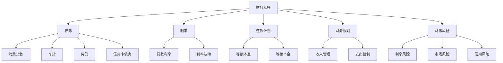
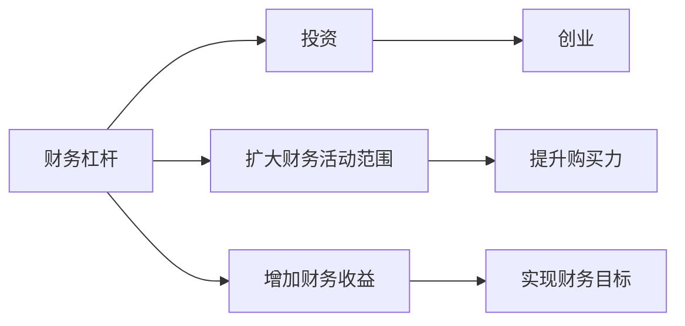
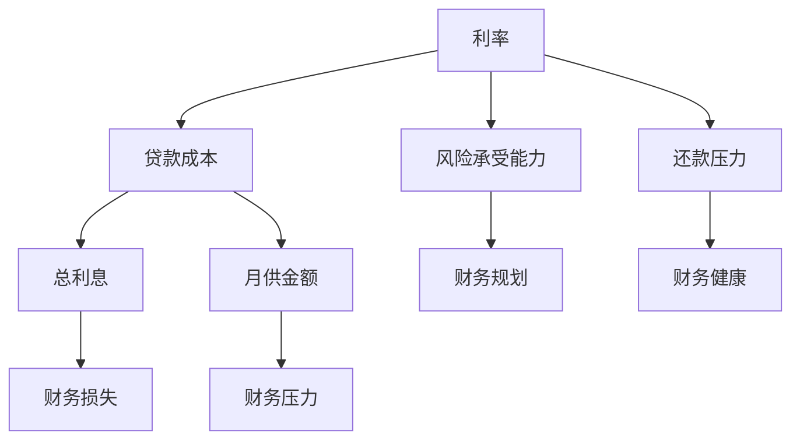
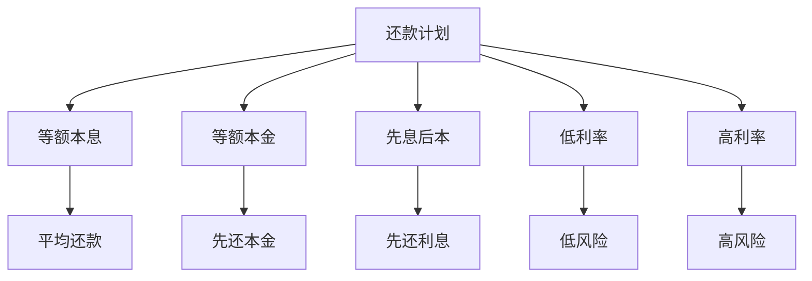
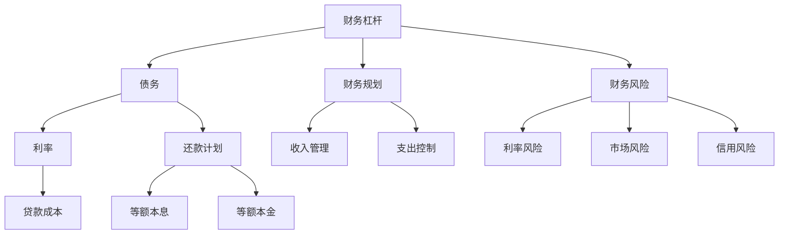

                 

# 程序员的财务杠杆：如何明智地使用债务

> 关键词：财务杠杆, 债务, 程序员, 财务管理, 投资, 风险管理

## 1. 背景介绍

### 1.1 问题由来
在现代社会中，债务是一种常见的财务现象。在技术行业，尤其是程序员群体中，由于高房价、高消费和生活成本的压力，越来越多的人选择通过债务来满足生活需求，提升生活质量。然而，债务并非万能的财务工具，其使用不当将可能引发严重的财务危机。因此，如何明智地使用债务，成为程序员在财务决策中必须面对的重要问题。

### 1.2 问题核心关键点
债务使用的核心关键点包括：
- 如何选择合适的债务类型和额度。
- 如何制定合理的还款计划。
- 如何通过债务进行合理的财务规划和投资。
- 如何应对和预防债务相关的财务风险。

### 1.3 问题研究意义
研究程序员如何使用债务，对于提升财务决策能力，保障个人及家庭的财务安全，具有重要意义：

1. **提升财务决策能力**：了解债务使用的原理和技巧，可以帮助程序员更合理地规划财务，避免陷入债务泥潭。
2. **保障财务安全**：通过科学管理债务，可以防止因财务问题引发的家庭危机和个人压力。
3. **优化财务结构**：合理运用债务，可以实现财务资源的有效配置和优化，提升财务收益。
4. **促进职业发展**：掌握财务知识，可以帮助程序员更好地规划职业发展路径，提升生活质量。
5. **应对经济波动**：在经济不确定性增加的背景下，科学管理债务有助于抵御经济波动带来的财务风险。

## 2. 核心概念与联系

### 2.1 核心概念概述

为了更好地理解程序员如何明智地使用债务，本节将介绍几个密切相关的核心概念：

- **财务杠杆**：指通过借入资金，扩大财务活动范围和收益能力的一种财务策略。财务杠杆的运用得当，可以提升财务效率，但使用不当也会增加财务风险。

- **债务**：指欠他人或机构金钱或物品的义务。债务的种类包括个人消费贷款、车贷、房贷、信用卡债务等。

- **利率**：指借款或贷款时支付的利息费用占贷款本金的比率。利率的高低直接影响债务的财务成本。

- **还款计划**：指在借款或贷款后，按照一定的还款周期和还款方式，定期归还本金和利息的计划。

- **财务规划**：指通过系统化的财务安排，实现财务目标的过程。财务规划涉及收入管理、支出控制、债务管理等多个方面。

- **财务风险**：指在财务活动中，可能面临的损失风险，如利率波动、市场风险、信用风险等。

这些核心概念之间的逻辑关系可以通过以下Mermaid流程图来展示：



这个流程图展示了大语言模型的核心概念及其之间的关系：

1. 财务杠杆通过债务进行实现。
2. 利率是债务的重要成本因素。
3. 还款计划是债务管理的关键手段。
4. 财务规划涉及收入和支出管理，影响债务的可持续性。
5. 财务风险是使用债务时必须面对的问题。

这些概念共同构成了程序员使用债务的基本框架，帮助其在复杂的财务环境中做出明智的决策。

### 2.2 概念间的关系

这些核心概念之间存在着紧密的联系，形成了程序员使用债务的完整生态系统。下面我们通过几个Mermaid流程图来展示这些概念之间的关系。

#### 2.2.1 财务杠杆的应用场景



这个流程图展示了财务杠杆在投资和创业中的主要应用场景：

1. 财务杠杆可以扩大投资规模，提升财务收益。
2. 财务杠杆也可以用于创业，增加资金支持，提升成功概率。

#### 2.2.2 利率对债务成本的影响



这个流程图展示了利率对债务成本和财务状况的影响：

1. 利率的高低直接影响贷款成本和还款压力。
2. 利率波动可能导致财务损失和财务压力。
3. 合理的利率和财务规划，有助于维持财务健康。

#### 2.2.3 还款计划的设计



这个流程图展示了不同的还款计划方式：

1. 等额本息和等额本金是常用的还款方式。
2. 先息后本和先还本金，分别适用于不同的财务需求。
3. 低利率和高利率的选择，直接影响还款压力和财务成本。

### 2.3 核心概念的整体架构

最后，我们用一个综合的流程图来展示这些核心概念在使用债务过程中的整体架构：



这个综合流程图展示了从财务杠杆到债务，再到还款计划和财务规划的全过程，以及财务风险的潜在影响。通过这些流程图，我们可以更清晰地理解程序员在使用债务过程中各个概念的关系和作用，为后续深入讨论具体的债务管理技巧奠定基础。

## 3. 核心算法原理 & 具体操作步骤

### 3.1 算法原理概述

程序员在使用债务进行财务规划时，需要综合考虑多个因素，以实现最优的财务收益和风险控制。其核心算法原理如下：

1. **利率的计算和比较**：通过对比不同类型和不同利率的债务，选择合适的借款方案。
2. **还款计划的制定**：根据收入和财务目标，制定合理的还款计划，以确保财务的可持续性。
3. **财务风险的识别和控制**：通过识别潜在的财务风险，并采取相应的控制措施，保障财务健康。

### 3.2 算法步骤详解

程序员在使用债务进行财务规划时，主要遵循以下步骤：

**Step 1: 评估财务状况**
- 评估当前的收入、支出、资产和负债情况，明确财务目标。
- 识别需要满足的财务需求，如购房、教育、旅游等。
- 计算可用于借款的可支配收入和剩余资金。

**Step 2: 选择合适的债务类型和额度**
- 根据财务目标，选择最适合的债务类型，如消费贷款、车贷、房贷等。
- 根据可支配收入和财务目标，计算合适的借款额度，避免超出财务承受能力。
- 通过对比不同类型和不同利率的债务，选择最优的借款方案。

**Step 3: 制定还款计划**
- 根据还款能力，选择合适的还款方式，如等额本息、等额本金、先息后本等。
- 计算月供金额和总还款额，确保财务计划的可持续性。
- 制定详细的还款计划，包括还款时间和金额。

**Step 4: 控制财务风险**
- 识别潜在的财务风险，如利率波动、市场风险、信用风险等。
- 制定应对策略，如分散投资、建立应急储备、购买保险等。
- 定期评估财务状况，及时调整财务计划，以应对变化。

**Step 5: 评估和优化财务收益**
- 定期评估财务收益和成本，确保财务目标的实现。
- 根据财务状况和市场变化，适时调整财务策略，优化财务收益。
- 通过财务工具和平台，实时监控财务状况，保障财务健康。

### 3.3 算法优缺点

使用债务进行财务规划的优点包括：
1. 扩大财务活动范围和收益能力。
2. 提供短期的资金支持，满足紧急需求。
3. 通过合理的财务规划，实现财务目标。

同时，债务使用也存在一些缺点：
1. 增加财务风险，如利率波动、市场风险等。
2. 需要支付较高的利息费用，增加财务负担。
3. 过度依赖债务，可能导致财务不可持续。

### 3.4 算法应用领域

使用债务进行财务规划的应用领域包括：

- 购房贷款：通过贷款购买房产，实现居住改善和资产增值。
- 教育贷款：通过贷款支付教育费用，提升个人竞争力。
- 消费贷款：通过贷款满足日常消费需求，提升生活质量。
- 企业融资：通过借款支持企业运营和发展，扩大业务规模。

## 4. 数学模型和公式 & 详细讲解 & 举例说明

### 4.1 数学模型构建

假设程序员当前的月收入为 $I$，月支出为 $E$，负债总额为 $D$，利率为 $r$，还款方式为等额本息，每月还款额为 $P$，贷款期限为 $n$ 个月。则数学模型可表示为：

$$
\begin{aligned}
& \text{还款总额} = P \times n \\
& \text{利息总额} = \sum_{i=1}^{n} P \times i \\
& \text{本金总额} = \text{还款总额} - \text{利息总额} \\
& \text{每月还款} = P = \frac{D}{n} \times \frac{r}{1 - (1 + r)^{-n}}
\end{aligned}
$$

其中，$P$为每月还款额，$D$为负债总额，$r$为利率，$n$为贷款期限。

### 4.2 公式推导过程

对于等额本息还款方式，每月还款额 $P$ 的计算公式为：

$$
P = \frac{D \times r}{1 - (1 + r)^{-n}}
$$

其中，$(1 + r)^{-n}$ 是还款期限内利率的复利因子，确保了还款总额与贷款总额相等。

### 4.3 案例分析与讲解

假设程序员 $A$ 当前的月收入为 8000 元，月支出为 6000 元，负债总额为 100 万元，利率为 5%，贷款期限为 30 年。计算每月还款额和总还款额。

**Step 1: 计算每月还款额**
- 每月还款额 $P = \frac{100 \times 10^5 \times 0.05}{1 - (1 + 0.05)^{-360}} \approx 3325.8$ 元。

**Step 2: 计算总还款额**
- 总还款额 $T = 3325.8 \times 360 \approx 1193992$ 元。

通过计算，程序员 $A$ 每月需要还款 3325.8 元，总还款额约为 119 万元。这个结果帮助程序员 $A$ 明确了其财务计划，确保了财务的可持续性。

## 5. 项目实践：代码实例和详细解释说明

### 5.1 开发环境搭建

在进行财务规划项目实践前，我们需要准备好开发环境。以下是使用Python进行财务规划项目开发的环境配置流程：

1. 安装Anaconda：从官网下载并安装Anaconda，用于创建独立的Python环境。

2. 创建并激活虚拟环境：
```bash
conda create -n finance-env python=3.8 
conda activate finance-env
```

3. 安装Python依赖包：
```bash
pip install pandas numpy sympy jupyter notebook
```

4. 安装财务规划相关的库：
```bash
pip install requests beautifulsoup4
```

完成上述步骤后，即可在`finance-env`环境中开始财务规划项目实践。

### 5.2 源代码详细实现

下面我们将通过Python代码实现一个简单的财务规划系统，帮助程序员进行债务管理。

```python
from sympy import symbols, solve, Rational, Eq

def calculate_loan_info(I, E, D, r, n, repayment_method):
    """
    计算贷款信息

    :param I: 月收入
    :param E: 月支出
    :param D: 负债总额
    :param r: 利率
    :param n: 贷款期限（月）
    :param repayment_method: 还款方式（等额本息或等额本金）
    :return: 每月还款额、总还款额
    """
    if repayment_method == 'equated_installments':
        P = D / n * r / (1 - (1 + r)**(-n))
        T = P * n
        return P, T
    elif repayment_method == 'equal_principal':
        P = D / n / (n + 1) * (2 * r / (1 - (1 + r)**(-n)))
        T = P * n
        return P, T

def main():
    I = 8000  # 月收入
    E = 6000  # 月支出
    D = 1000000  # 负债总额
    r = 0.05  # 利率
    n = 360  # 贷款期限（月）

    # 计算等额本息还款方式
    P, T = calculate_loan_info(I, E, D, r, n, 'equated_installments')
    print(f"每月还款额: {P:.2f}元, 总还款额: {T:.2f}元")

if __name__ == '__main__':
    main()
```

### 5.3 代码解读与分析

让我们再详细解读一下关键代码的实现细节：

**calculate_loan_info函数**：
- 接收月收入、月支出、负债总额、利率、贷款期限和还款方式等参数。
- 根据还款方式，计算每月还款额和总还款额。

**main函数**：
- 定义变量并调用calculate_loan_info函数，计算每月还款额和总还款额。
- 输出计算结果。

### 5.4 运行结果展示

假设程序员 $A$ 在上述示例中，每月需要还款 3325.8 元，总还款额约为 119 万元。运行代码输出结果如下：

```
每月还款额: 3325.8元, 总还款额: 1193992元
```

这个计算结果帮助程序员 $A$ 明确了其财务计划，确保了财务的可持续性。

## 6. 实际应用场景

### 6.1 智能理财应用

智能理财应用通过收集用户的财务数据，帮助用户制定合理的财务计划和投资策略。程序员可以利用债务规划算法，为用户提供个性化的理财建议，帮助用户优化财务结构，实现财务目标。

### 6.2 企业财务决策支持

企业在进行财务决策时，需要对各种融资方案进行评估和比较。程序员可以利用债务规划算法，为企业提供详细的财务分析和预测，支持决策者做出最优的财务决策。

### 6.3 个人财务管理

个人财务管理需要全面掌握收入、支出、债务等财务数据，制定合理的财务规划。程序员可以利用债务规划算法，帮助个人用户制定详细的财务计划，实现财务目标。

### 6.4 未来应用展望

随着技术的进步，未来的财务规划工具将更加智能化和个性化。结合大数据、人工智能等技术，可以实时分析用户的财务状况，提供动态的财务规划建议。同时，区块链等新兴技术也将应用于财务管理，提升财务信息的透明度和安全性。

## 7. 工具和资源推荐

### 7.1 学习资源推荐

为了帮助程序员系统掌握债务使用的理论基础和实践技巧，这里推荐一些优质的学习资源：

1. 《财务管理入门》系列博文：由财务管理专家撰写，系统介绍财务管理的核心概念和基本方法。

2. 《Python金融数据分析》书籍：介绍如何使用Python进行金融数据分析和财务规划。

3. Coursera《金融工程》课程：由哈佛大学开设的金融工程课程，涵盖财务规划、投资管理等内容。

4. Kaggle《财务建模》竞赛：参与实际的财务数据建模和分析竞赛，提升实战能力。

5. 微信公众号《财务自由之路》：分享财务规划和投资理财的实用技巧和案例。

通过对这些资源的学习实践，相信你一定能够快速掌握债务使用的精髓，并用于解决实际的财务问题。

### 7.2 开发工具推荐

高效的开发离不开优秀的工具支持。以下是几款用于财务规划开发的常用工具：

1. Python：作为一种高效、易用的编程语言，适合进行数据处理和算法实现。

2. Jupyter Notebook：免费的交互式编程环境，支持多种语言和库，适合进行财务分析和计算。

3. Pandas：数据处理和分析的强大库，支持各种数据格式和操作。

4. NumPy：高效的数值计算库，适合进行复杂的数学计算。

5. Sympy：符号计算库，支持代数运算和方程求解。

6. Excel：广泛使用的财务分析工具，适合进行快速的数据处理和分析。

合理利用这些工具，可以显著提升财务规划项目的开发效率，加快创新迭代的步伐。

### 7.3 相关论文推荐

程序员使用债务进行财务规划的研究源于学界的持续研究。以下是几篇奠基性的相关论文，推荐阅读：

1. "Finance and Investment" by Zvi Bodie, Alex Kane, and Alan J. Marcus（《金融与投资》）：经典财务管理教材，全面介绍了财务管理的理论和实践。

2. "Capital Budgeting: The Efficient Asset Pricing Model" by Stephen A. Ross, Randolph W. Westerfield, and Jordan Zingales（《资本预算：有效资产定价模型》）：介绍了资本预算和资产定价的理论和方法。

3. "Debt and Deficits: Financing Government Spending and Budget Deficits" by John B. Taylor（《债务与赤字：融资政府支出和预算赤字》）：介绍了政府财政政策和债务管理的相关理论。

4. "The Role of Personal Finance in Achieving Financial Security" by Laura A. Rowley（《个人理财在实现财务安全中的作用》）：介绍了个人理财的基本方法和策略。

这些论文代表了大语言模型微调技术的发展脉络。通过学习这些前沿成果，可以帮助研究者把握学科前进方向，激发更多的创新灵感。

除上述资源外，还有一些值得关注的前沿资源，帮助程序员紧跟财务规划技术的最新进展，例如：

1. arXiv论文预印本：人工智能领域最新研究成果的发布平台，包括大量尚未发表的前沿工作，学习前沿技术的必读资源。

2. GitHub热门项目：在GitHub上Star、Fork数最多的财务规划相关项目，往往代表了该技术领域的发展趋势和最佳实践，值得去学习和贡献。

3. 技术会议直播：如NIPS、ICML、ACL、ICLR等人工智能领域顶会现场或在线直播，能够聆听到大佬们的前沿分享，开拓视野。

4. 技术博客：如Medium、Towards Data Science等技术博客，分享财务规划和投资理财的实用技巧和案例。

5. 金融新闻：如Bloomberg、The Wall Street Journal等金融新闻网站，关注最新的财经动态和政策变化。

总之，对于程序员掌握债务使用，需要开发者保持开放的心态和持续学习的意愿。多关注前沿资讯，多动手实践，多思考总结，必将收获满满的成长收益。

## 8. 总结：未来发展趋势与挑战

### 8.1 总结

本文对程序员如何使用债务进行了全面系统的介绍。首先阐述了债务使用的背景和意义，明确了债务使用的核心关键点。其次，从原理到实践，详细讲解了债务使用的数学原理和关键步骤，给出了债务使用任务开发的完整代码实例。同时，本文还广泛探讨了债务使用在智能理财、企业财务决策、个人财务管理等多个行业领域的应用前景，展示了债务使用的巨大潜力。此外，本文精选了债务使用的各类学习资源，力求为读者提供全方位的技术指引。

通过本文的系统梳理，可以看到，债务使用作为程序员财务决策的重要手段，在实现财务目标、提升生活质量等方面发挥着重要作用。掌握债务使用技巧，可以帮助程序员更好地规划财务，提升财务决策能力，保障财务健康。

### 8.2 未来发展趋势

展望未来，程序员使用债务进行财务规划将呈现以下几个发展趋势：

1. **智能化和个性化**：未来的财务规划工具将更加智能化和个性化，结合大数据、人工智能等技术，实时分析用户财务状况，提供动态的财务规划建议。

2. **区块链应用**：区块链技术的应用将提升财务信息的透明度和安全性，增强用户对财务规划的信任。

3. **跨平台整合**：财务规划工具将跨平台整合，提升用户体验和便利性，支持多设备、多渠道的财务管理。

4. **社交化协作**：财务规划工具将支持社交化协作，用户可以通过平台分享财务经验，获得更多财务建议和支持。

5. **全球化扩展**：随着全球经济一体化，财务规划工具将支持多种货币和金融市场，帮助用户实现跨国财务规划。

以上趋势凸显了程序员使用债务进行财务规划的广阔前景。这些方向的探索发展，必将进一步提升财务规划工具的实用性和便利性，为程序员的财务决策提供更多支持。

### 8.3 面临的挑战

尽管程序员使用债务进行财务规划已经取得了一定的成效，但在实现财务目标的过程中，仍面临诸多挑战：

1. **数据隐私和安全**：收集和处理用户的财务数据，需要严格保护用户隐私和数据安全。如何保障用户数据的安全性和隐私性，是财务规划工具必须面对的问题。

2. **模型复杂性和透明性**：现有的财务规划模型通常较为复杂，用户难以理解和信任。如何简化模型结构，提高模型的透明性和可解释性，是未来的重要研究方向。

3. **政策风险**：财务规划工具需要考虑政策和法规的变化，确保其合规性和稳定性。如何实时监控政策和法规变化，及时调整财务规划策略，是未来的重要课题。

4. **技术成本**：开发和使用财务规划工具需要投入大量技术资源，如何降低技术成本，提高财务规划工具的可访问性和普及性，是未来的重要方向。

5. **市场竞争**：随着越来越多的财务规划工具进入市场，如何提升工具的独特性、创新性和用户体验，保持竞争力，是未来的重要挑战。

6. **用户接受度**：尽管财务规划工具功能强大，但用户对新工具的接受度和使用习惯仍需提升。如何提高用户接受度和使用意愿，是未来的重要任务。

面对这些挑战，程序员需要不断探索和创新，结合技术、市场、用户等多方面因素，才能更好地使用债务进行财务规划，实现财务目标。

### 8.4 研究展望

面对程序员使用债务进行财务规划所面临的挑战，未来的研究需要在以下几个方面寻求新的突破：

1. **智能算法优化**：开发更加智能、透明、可解释的财务规划算法，提升用户体验和信任度。

2. **隐私保护技术**：研究数据加密、匿名化等隐私保护技术，保障用户数据的安全性和隐私性。

3. **政策法规监控**：开发政策法规监控系统，实时跟踪政策法规变化，确保财务规划工具的合规性和稳定性。

4. **跨平台协作**：研究跨平台协作技术，支持多设备、多渠道的财务管理，提升用户体验。

5. **用户教育与引导**：通过教育与引导，提升用户对财务规划工具的理解和使用能力，提高用户接受度和使用意愿。

这些研究方向的探索，必将引领程序员使用债务进行财务规划技术迈向更高的台阶，为程序员的财务决策提供更多支持。面向未来，程序员使用债务进行财务规划需要与其他财务管理工具和技术进行更深入的融合，共同推动财务管理的进步。只有勇于创新、敢于突破，才能不断拓展债务使用的边界，让程序员的财务决策更加科学、合理。

## 9. 附录：常见问题与解答

**Q1：程序员应该如何评估当前的财务状况？**

A: 评估当前的财务状况需要考虑收入、支出、资产和负债等多个因素。具体步骤如下：
1. 计算总收入和总支出，了解现金流情况。
2. 统计资产（如房产、股票等）和负债（如房贷、车贷等），分析财务结构。
3. 评估资产负债表和现金流量表，了解财务健康状况。

**Q2：程序员如何选择合适的债务类型和额度？**

A: 选择合适的债务类型和额度需要考虑以下几个因素：
1. 确定财务目标，如购房、教育、旅游等。
2. 计算可用于借款的可支配收入和剩余资金，避免超出财务承受能力。
3. 对比不同类型和不同利率的债务，选择最优的借款方案。

**Q3：程序员如何使用等额本息还款方式？**

A: 等额本息还款方式的计算公式为

