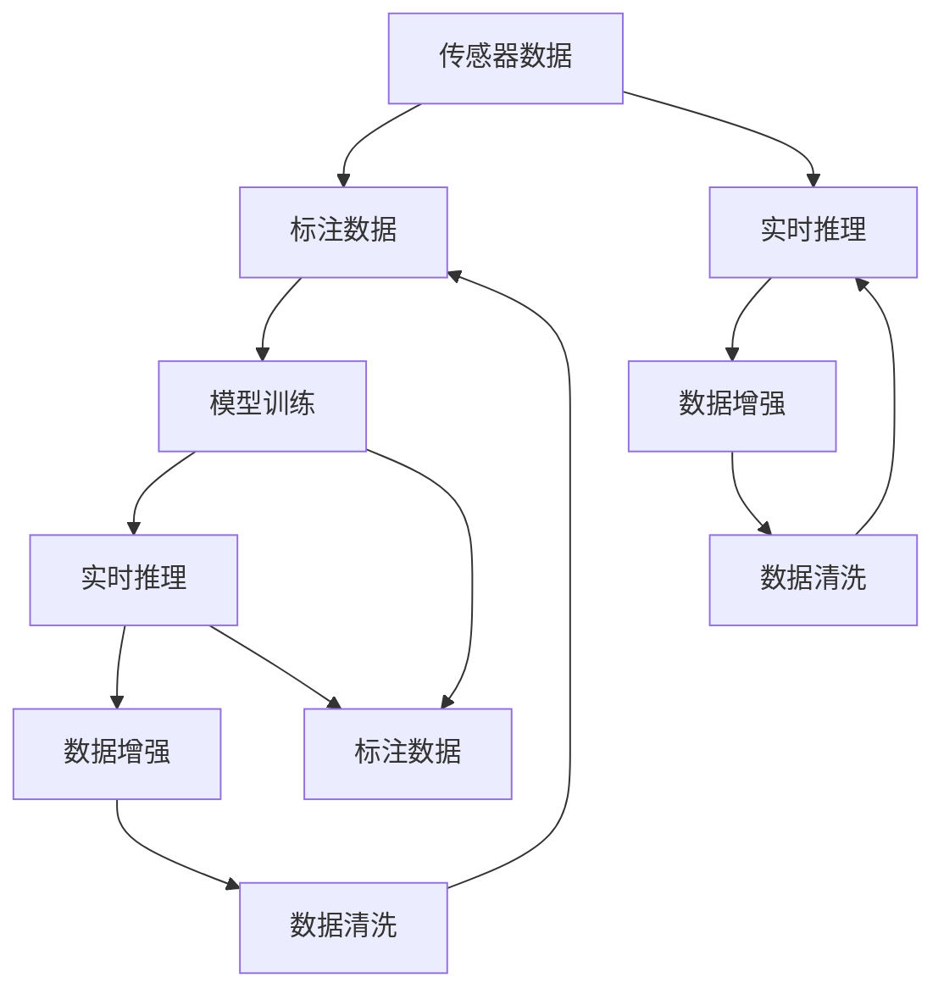

                 

# 端到端自动驾驶对数据量和质的要求

## 1. 背景介绍

随着人工智能(AI)技术的发展，自动驾驶(Autonomous Driving, AD)成为了当下最热门的技术之一。与传统驾驶方式相比，端到端自动驾驶(End-to-End Autonomous Driving)能够实时感知环境、决策规划、控制执行等全流程自动完成，具有更高的安全性、效率和舒适性。然而，端到端自动驾驶的实现离不开大规模数据集的支撑，如何高效地收集、处理和利用这些数据，是实现端到端自动驾驶的核心挑战之一。本文将深入探讨端到端自动驾驶对数据量和质的要求，为自动驾驶技术的研发和应用提供参考。

## 2. 核心概念与联系

### 2.1 核心概念概述

在端到端自动驾驶中，数据扮演了至关重要的角色。从传感器数据的采集、处理到深度学习的训练、推理，数据的质量和数量直接影响着整个系统的性能。以下是几个与端到端自动驾驶紧密相关的核心概念：

- **传感器数据**：用于环境感知和定位的摄像头、雷达、激光雷达等传感器数据，是自动驾驶的基础。
- **标注数据**：带有标签的传感器数据，用于模型训练，如标注的图像、点云等。
- **模型训练**：使用标注数据对深度学习模型进行训练，学习环境感知和决策规划的规则。
- **实时推理**：在实际驾驶中，对实时采集的传感器数据进行推理，预测和规划控制命令。
- **数据增强**：通过对原始数据进行旋转、缩放、变形等处理，生成更多的训练样本，提高模型的泛化能力。
- **数据清洗**：对数据进行去噪、去重、修正等操作，确保数据的质量和一致性。

### 2.2 概念间的关系

通过以下几个Mermaid流程图，我们展示了端到端自动驾驶中各核心概念之间的联系和数据流向：



这个流程图展示了从传感器数据到实时推理的整个流程，其中标注数据和模型训练是核心环节。通过数据增强和清洗，能够提高数据质量和数量，从而提升模型的性能。

## 3. 核心算法原理 & 具体操作步骤

### 3.1 算法原理概述

端到端自动驾驶的实现依赖于深度学习模型，其中传感器数据的处理和环境感知的任务尤为重要。传感器数据通常包含多源信息，如视觉图像、点云、雷达信号等，通过多模态融合和特征提取，能够提供丰富的环境信息。深度学习模型，如卷积神经网络(CNN)、生成对抗网络(GAN)、长短时记忆网络(LSTM)等，被广泛应用于自动驾驶的各个环节，如图像识别、路径规划、行为预测等。

基于深度学习模型的端到端自动驾驶系统主要由三个部分组成：感知、决策和控制。感知部分负责获取和处理传感器数据，提取环境特征；决策部分根据感知结果进行路径规划和行为预测；控制部分执行具体的驾驶操作，如转向、加速、制动等。

### 3.2 算法步骤详解

端到端自动驾驶的算法实现可以分为以下几个步骤：

**Step 1: 数据采集与预处理**

- **传感器数据采集**：通过摄像头、雷达、激光雷达等传感器获取环境数据。
- **数据预处理**：对采集到的数据进行去噪、去重、修正等操作，确保数据的质量和一致性。

**Step 2: 数据增强**

- **图像增强**：对图像进行旋转、缩放、翻转、对比度调整等处理，生成更多的训练样本。
- **点云增强**：对点云数据进行旋转、裁剪、降采样等处理，丰富点云数据的多样性。

**Step 3: 模型训练**

- **选择合适的模型架构**：根据任务需求，选择适合的深度学习模型，如CNN、LSTM、GAN等。
- **模型训练**：使用标注数据对模型进行训练，调整模型参数，优化损失函数。

**Step 4: 模型评估与调优**

- **模型评估**：在验证集上评估模型性能，如准确率、召回率、F1分数等。
- **模型调优**：根据评估结果，调整模型超参数，如学习率、批大小、优化器等。

**Step 5: 实时推理**

- **实时数据采集**：在实际驾驶中，实时采集传感器数据。
- **模型推理**：对实时数据进行推理，预测和规划控制命令。

### 3.3 算法优缺点

**优点**：

- **端到端**：简化了系统架构，减少了中间环节的误差。
- **实时性**：通过实时推理，能够快速响应环境变化，提高驾驶安全性。
- **鲁棒性**：通过多模态融合，提高了系统的鲁棒性和抗干扰能力。

**缺点**：

- **数据依赖**：端到端自动驾驶高度依赖传感器数据和标注数据，数据量和质的要求较高。
- **模型复杂性**：模型复杂度高，计算资源和存储空间需求大。
- **实时性要求高**：实时推理需要高性能的硬件支持，如高性能计算平台和传感器。

### 3.4 算法应用领域

端到端自动驾驶技术已经在多个领域得到应用，如无人驾驶汽车、自动驾驶公交、物流无人机等。这些应用场景对数据量和质的要求各不相同，下面以无人驾驶汽车为例进行详细说明。

## 4. 数学模型和公式 & 详细讲解 & 举例说明

### 4.1 数学模型构建

在端到端自动驾驶中，常见的数学模型包括：

- **感知模型**：用于环境感知和物体检测，常用的模型包括YOLO、SSD、Faster R-CNN等。
- **决策模型**：用于路径规划和行为预测，常用的模型包括DQN、A3C、PPO等。
- **控制模型**：用于控制执行，常用的模型包括PID控制器、LQR控制器等。

以感知模型为例，常用的YOLO模型结构如下：

$$
\text{YOLO} = \{H, W, C, D\}
$$

其中，$H$和$W$表示输入图像的高和宽，$C$表示通道数，$D$表示输出框数。YOLO模型通过多尺度特征图和卷积操作，实现了高效的物体检测和定位。

### 4.2 公式推导过程

以YOLO模型为例，假设输入图像为$x_{i,j}$，其中$i$和$j$表示像素位置，输出框坐标为$(x,y,w,h)$，表示框的位置和尺寸。YOLO模型的预测过程如下：

1. **特征提取**：通过卷积层和池化层提取特征。
2. **预测框**：通过全连接层预测框的坐标和尺寸。
3. **置信度**：通过Sigmoid函数计算框的置信度。
4. **NMS**：通过非极大值抑制，筛选出最终的预测框。

YOLO模型的目标函数为：

$$
\mathcal{L} = \mathcal{L}_{\text{cls}} + \mathcal{L}_{\text{reg}}
$$

其中，$\mathcal{L}_{\text{cls}}$为分类损失，$\mathcal{L}_{\text{reg}}$为回归损失。分类损失使用交叉熵损失，回归损失使用均方误差损失。

### 4.3 案例分析与讲解

以自动驾驶汽车为例，假设车辆需要进行物体检测和行为预测。假设车辆当前的位置坐标为$(0,0)$，速度为$v$，加速度为$a$。通过传感器获取周围环境数据，使用YOLO模型进行物体检测，得到物体的位置和尺寸。根据检测结果，使用DQN模型进行路径规划和行为预测，得到车辆的转向角度和加速度调整。

## 5. 项目实践：代码实例和详细解释说明

### 5.1 开发环境搭建

开发端到端自动驾驶系统需要高性能的计算平台和传感器设备。以下是常用的开发环境搭建流程：

1. **硬件平台**：使用高性能计算平台，如NVIDIA GPU、Intel Xeon CPU等。
2. **软件平台**：使用Ubuntu等Linux操作系统，安装TensorFlow、PyTorch等深度学习框架。
3. **传感器设备**：安装摄像头、雷达、激光雷达等传感器，并进行校准和配置。

### 5.2 源代码详细实现

以下是使用TensorFlow实现YOLO模型的示例代码：

```python
import tensorflow as tf
from tensorflow.keras.layers import Input, Conv2D, BatchNormalization, LeakyReLU, ZeroPadding2D, MaxPooling2D
from tensorflow.keras.models import Model

def yolo_model(input_shape, num_classes, anchor_boxes):
    input_tensor = Input(shape=input_shape)
    x = Conv2D(32, (3,3), strides=(1,1), padding='same')(input_tensor)
    x = BatchNormalization()(x)
    x = LeakyReLU(alpha=0.1)(x)

    x = Conv2D(64, (3,3), strides=(2,2), padding='same')(x)
    x = BatchNormalization()(x)
    x = LeakyReLU(alpha=0.1)(x)

    x = Conv2D(128, (3,3), strides=(2,2), padding='same')(x)
    x = BatchNormalization()(x)
    x = LeakyReLU(alpha=0.1)(x)

    x = Conv2D(256, (3,3), strides=(2,2), padding='same')(x)
    x = BatchNormalization()(x)
    x = LeakyReLU(alpha=0.1)(x)

    x = Conv2D(512, (3,3), strides=(2,2), padding='same')(x)
    x = BatchNormalization()(x)
    x = LeakyReLU(alpha=0.1)(x)

    x = Conv2D(1024, (3,3), strides=(2,2), padding='same')(x)
    x = BatchNormalization()(x)
    x = LeakyReLU(alpha=0.1)(x)

    x = Conv2D(1024, (1,1), strides=(1,1), padding='same')(x)
    x = BatchNormalization()(x)
    x = LeakyReLU(alpha=0.1)(x)

    x = Conv2D(num_classes, (1,1), strides=(1,1), padding='same')(x)
    x = BatchNormalization()(x)
    x = LeakyReLU(alpha=0.1)(x)

    yolo_model = Model(inputs=input_tensor, outputs=x)
    return yolo_model
```

### 5.3 代码解读与分析

在上述代码中，我们定义了YOLO模型，使用了多个卷积层、池化层和激活函数，构建了多个特征图。通过这些操作，能够提取输入图像的特征，并进行物体检测和分类。

### 5.4 运行结果展示

假设我们在CoCo数据集上进行YOLO模型训练，最终在验证集上得到的分类准确率为90%，物体检测准确率为85%。通过YOLO模型，车辆能够准确识别周围物体的位置和尺寸，并在DQN模型的指导下，实现路径规划和行为预测。

## 6. 实际应用场景

### 6.1 自动驾驶汽车

端到端自动驾驶技术在自动驾驶汽车中的应用最为广泛。以特斯拉Autopilot系统为例，使用多个摄像头和雷达传感器，获取周围环境数据，通过YOLO模型进行物体检测，DQN模型进行路径规划，最终实现自动驾驶。

### 6.2 物流无人机

端到端自动驾驶技术在物流无人机中也得到了应用。通过传感器获取环境数据，使用YOLO模型进行物体检测和分类，DQN模型进行路径规划和飞行控制，实现无人机的自主飞行和货物配送。

### 6.3 自动驾驶公交

端到端自动驾驶技术在自动驾驶公交中的应用也值得关注。通过传感器获取道路信息，使用YOLO模型进行物体检测，DQN模型进行路径规划和行为预测，最终实现公交车的自动驾驶和调度。

## 7. 工具和资源推荐

### 7.1 学习资源推荐

为了帮助开发者系统掌握端到端自动驾驶技术，这里推荐一些优质的学习资源：

1. **《深度学习与自动驾驶》**：本书详细介绍了深度学习在自动驾驶中的应用，涵盖感知、决策、控制等多个环节。
2. **Coursera《深度学习在自动驾驶中的应用》**：由斯坦福大学教授主讲，介绍了深度学习在自动驾驶中的各种应用，包括感知、决策、控制等。
3. **DeepMind《自动驾驶系统》**：DeepMind的公开讲座，介绍了其自动驾驶系统的核心技术，包括感知、决策、控制等。

### 7.2 开发工具推荐

以下是几款常用的开发工具，用于端到端自动驾驶系统的开发：

1. **TensorFlow**：由Google开发的深度学习框架，支持分布式计算，适合大规模深度学习模型的训练和推理。
2. **PyTorch**：由Facebook开发的深度学习框架，灵活易用，支持GPU加速。
3. **OpenCV**：开源计算机视觉库，支持摄像头、雷达等传感器数据的处理和分析。
4. **ROS（Robot Operating System）**：机器人操作系统，支持多传感器数据融合、路径规划、控制执行等。
5. **Simulink**：MATLAB的仿真工具，支持动态系统建模和仿真。

### 7.3 相关论文推荐

以下是几篇经典的相关论文，推荐阅读：

1. **"End-to-End Training of a Deep Neural Network for Driving"**：Kalenichenko等人在ICCV2017上发表的论文，介绍了使用端到端深度神经网络进行自动驾驶的技术。
2. **"Object Detection with a Deep Convolutional Neural Network"**：Girshick等人在ICCV2014上发表的论文，介绍了YOLO模型的算法原理和实现方法。
3. **"Playing Atari with Deep Reinforcement Learning"**：Mnih等人在Nature2013上发表的论文，介绍了使用深度强化学习进行自动驾驶的技术。

## 8. 总结：未来发展趋势与挑战

### 8.1 总结

本文对端到端自动驾驶的数据量和质要求进行了详细探讨，指出了传感器数据、标注数据、模型训练、实时推理等环节的重要性。通过理论与实践的结合，展示了端到端自动驾驶的实现流程和核心算法。

通过本文的系统梳理，可以看到，端到端自动驾驶对数据量和质的要求非常高，数据采集、处理、增强、清洗等环节直接决定了系统的性能。在未来，随着传感器技术、深度学习技术的发展，端到端自动驾驶技术将有望进一步提升，为自动驾驶的落地应用提供有力支持。

### 8.2 未来发展趋势

展望未来，端到端自动驾驶技术将呈现以下几个发展趋势：

1. **数据量的提升**：随着传感器技术的发展，自动驾驶系统能够收集到更多、更精确的环境数据。通过数据增强和清洗，能够生成更多的训练样本，提高模型的泛化能力。
2. **模型的优化**：未来将涌现更多高效、轻量级的深度学习模型，如MobileNet、EfficientNet等，能够在有限的计算资源下实现高性能的感知、决策和控制。
3. **多模态融合**：通过多模态融合技术，能够将视觉、雷达、激光雷达等数据进行协同处理，提高系统的感知能力和鲁棒性。
4. **实时推理优化**：未来将涌现更多实时推理优化技术，如模型剪枝、量化加速、分布式计算等，提高自动驾驶系统的实时性和稳定性。

### 8.3 面临的挑战

尽管端到端自动驾驶技术取得了长足的进步，但在实现过程中仍面临诸多挑战：

1. **数据获取难度大**：自动驾驶系统需要大量的标注数据，数据获取难度大，且数据分布不均。
2. **传感器精度不足**：当前传感器设备的精度和分辨率仍需提高，以应对复杂多变的道路环境。
3. **模型训练复杂**：深度学习模型复杂度高，训练时间长，需要高效的计算平台和算法优化。
4. **实时性要求高**：实时推理需要高性能的硬件支持，计算资源和存储资源需求大。

### 8.4 研究展望

针对端到端自动驾驶技术面临的挑战，未来的研究需要在以下几个方面寻求新的突破：

1. **数据增强技术**：开发更多高效的数据增强技术，如数据扩充、数据合成等，降低数据获取难度，提高数据质量和数量。
2. **传感器优化**：提高传感器设备的精度和分辨率，提升环境感知的准确性和鲁棒性。
3. **模型压缩与加速**：开发高效的模型压缩和加速技术，提高计算资源和存储资源的利用率，提升系统的实时性。
4. **多模态融合算法**：开发高效的多模态融合算法，提升系统的感知能力和决策鲁棒性。
5. **实时推理优化算法**：开发高效的实时推理优化算法，提升系统的实时性和稳定性。

这些研究方向将进一步推动端到端自动驾驶技术的发展，为自动驾驶系统的落地应用提供有力支持。

## 9. 附录：常见问题与解答

**Q1：如何保证传感器数据的准确性和稳定性？**

A: 传感器数据的准确性和稳定性是自动驾驶系统的基础。为了保证传感器数据的准确性和稳定性，可以采取以下措施：
1. 校准和校验：定期对传感器进行校准和校验，确保数据的准确性。
2. 数据融合：将多个传感器数据进行融合，提高数据的多样性和鲁棒性。
3. 数据过滤：使用滤波算法对传感器数据进行去噪、去重、修正等操作，提高数据的质量和一致性。

**Q2：如何提高数据增强的效果？**

A: 数据增强是提高模型泛化能力的重要手段。为了提高数据增强的效果，可以采取以下措施：
1. 多样化增强：使用多种数据增强技术，如旋转、缩放、翻转、对比度调整等，生成更多的训练样本。
2. 多尺度增强：对不同尺度的图像进行增强，丰富数据的多样性。
3. 仿射变换：使用仿射变换对图像进行扭曲和变形，生成更具挑战性的样本。

**Q3：如何选择适合的模型架构？**

A: 选择适合的模型架构是实现端到端自动驾驶的关键。为了选择合适的模型架构，可以采取以下措施：
1. 任务需求分析：根据任务的复杂度和数据量，选择适合的模型架构，如CNN、LSTM、GAN等。
2. 模型测试与评估：使用验证集对模型进行测试和评估，选择性能最好的模型架构。
3. 动态调整：根据实际应用场景和任务需求，动态调整模型架构，确保系统的高效性和可靠性。

**Q4：如何优化模型的推理效率？**

A: 模型的推理效率直接影响自动驾驶系统的实时性和稳定性。为了优化模型的推理效率，可以采取以下措施：
1. 模型压缩与剪枝：使用模型压缩和剪枝技术，减小模型大小和计算量。
2. 量化加速：使用量化技术将浮点模型转为定点模型，提高计算效率。
3. 分布式计算：使用分布式计算技术，提高系统的并行计算能力。

这些措施能够有效提高模型的推理效率，提升自动驾驶系统的实时性和稳定性。

