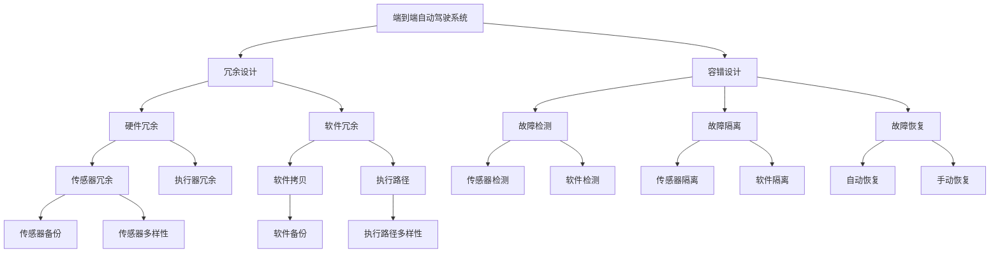
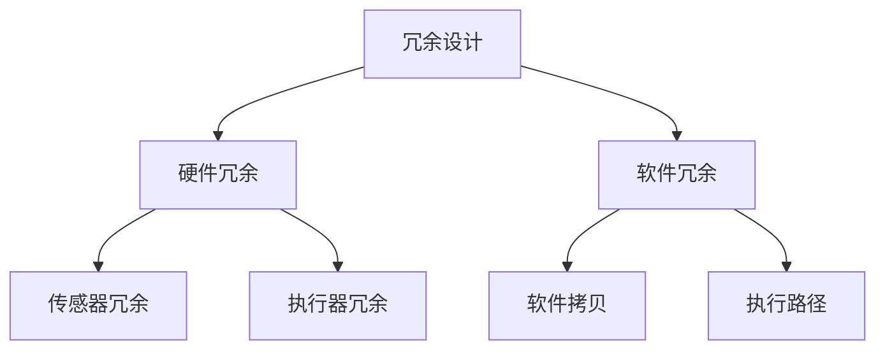
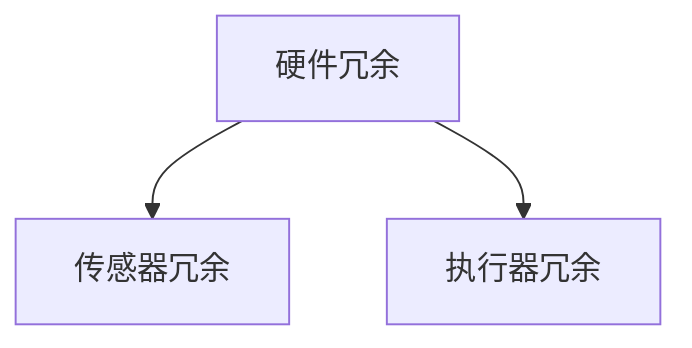
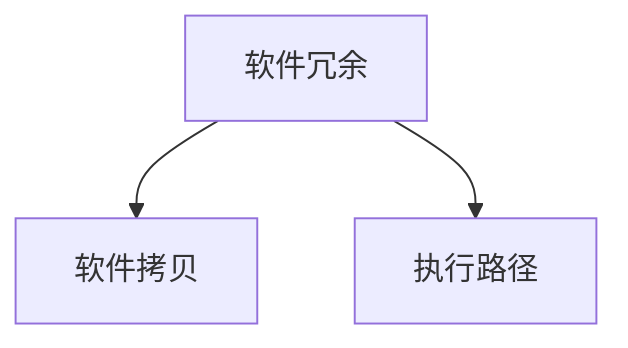
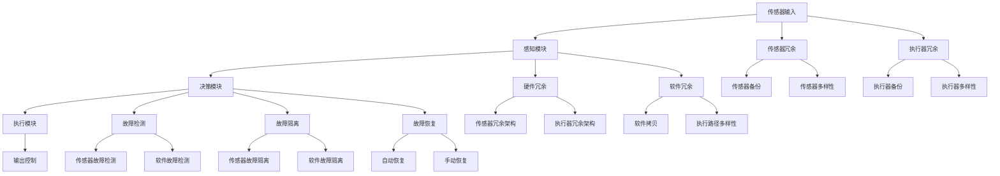

                 

# 端到端自动驾驶的硬件冗余与容错设计

## 1. 背景介绍

### 1.1 问题由来
随着自动驾驶技术的发展，端到端自动驾驶系统变得越来越复杂。端到端系统是指从传感器输入（如摄像头、雷达、激光雷达等）到控制器输出（如油门、刹车、方向盘等）的全过程，系统内部包含感知、决策、控制等多个子模块，涉及多种异构硬件和复杂软件。因此，确保端到端系统的可靠性和安全性，需要综合考虑硬件和软件层面的容错与冗余设计。

### 1.2 问题核心关键点
端到端自动驾驶系统的容错与冗余设计，旨在通过硬件和软件的多样性、备份机制、故障检测与恢复等方法，确保在硬件故障或软件错误发生时，系统仍能安全可靠地运行，避免事故的发生。

容错与冗余设计需考虑以下几个关键点：
1. 系统架构的健壮性：设计多模态感知、多层次决策、多系统并行等冗余架构。
2. 传感器和执行器的多样性：使用多种传感器和执行器，避免单点故障对系统性能的影响。
3. 故障检测与隔离：建立高效的故障检测与隔离机制，快速识别并隔离故障节点。
4. 故障恢复与重试：设计可靠的故障恢复和重试机制，保证系统在故障后能够快速恢复。

### 1.3 问题研究意义
端到端自动驾驶的硬件冗余与容错设计，对于提升自动驾驶系统的可靠性和安全性，具有重要的意义：
1. 降低事故率：通过硬件和软件的冗余设计，减少系统故障概率，降低交通事故风险。
2. 提高运营效率：自动驾驶系统的容错能力，可以避免因故障导致的停车或重新定位，提高道路资源利用率。
3. 增强用户体验：通过冗余设计，保证自动驾驶系统在各种极端条件下的稳定运行，提升用户体验。
4. 促进技术发展：容错与冗余设计的研究，能够推动自动驾驶技术的成熟和应用普及。

## 2. 核心概念与联系

### 2.1 核心概念概述

为更好地理解端到端自动驾驶的硬件冗余与容错设计，本节将介绍几个密切相关的核心概念：

- **端到端自动驾驶系统**：从传感器输入到控制器输出的全过程，包括感知、决策、控制等多个模块，涉及多种异构硬件和复杂软件。

- **冗余设计(Redundancy Design)**：通过增加备份或多样性，以提高系统在单个或多个组件故障时的鲁棒性。

- **容错设计(Fault Tolerance Design)**：在系统检测到故障时，能够快速恢复或重新配置，以保障系统的持续运行。

- **硬件冗余(Hardware Redundancy)**：使用多套硬件设备，以提高系统的容错能力和鲁棒性。

- **软件冗余(Software Redundancy)**：使用多份软件拷贝或多个独立执行路径，以增强系统的可靠性。

- **故障检测(Fault Detection)**：通过各种传感器和算法，检测系统中的异常情况或故障。

- **故障隔离(Fault Isolation)**：在检测到故障时，快速定位并隔离故障节点，防止故障扩散。

- **故障恢复(Fault Recovery)**：在系统故障后，能够快速恢复或重新配置，以保障系统的持续运行。

- **重试机制(Retry Mechanism)**：在系统故障时，能够自动或手动重新尝试操作，以减少系统停机时间。

这些核心概念之间的逻辑关系可以通过以下Mermaid流程图来展示：



这个流程图展示了几大核心概念及其之间的关系：

1. 端到端自动驾驶系统通过冗余设计，增强系统的鲁棒性。
2. 容错设计通过故障检测、隔离和恢复，确保系统在故障后的持续运行。
3. 硬件冗余和软件冗余是冗余设计的主要手段，分别通过传感器和执行器的多样性以及软件拷贝和执行路径的多样性实现。
4. 故障检测和隔离是容错设计的基础，通过多种传感器和算法，快速定位和隔离故障节点。
5. 故障恢复和重试机制，确保在系统故障后能够快速恢复，减少停机时间。

这些概念共同构成了端到端自动驾驶系统硬件冗余与容错设计的完整框架，使得系统能够在各种极端条件下稳定运行。

### 2.2 概念间的关系

这些核心概念之间存在着紧密的联系，形成了端到端自动驾驶系统硬件冗余与容错设计的完整生态系统。下面我通过几个Mermaid流程图来展示这些概念之间的关系。

#### 2.2.1 冗余设计范式



这个流程图展示了冗余设计的两种主要实现方式，即硬件冗余和软件冗余。硬件冗余通过使用多套传感器和执行器，提高系统的容错能力；软件冗余则通过软件拷贝和执行路径多样性，增强系统的可靠性。

#### 2.2.2 容错设计流程


这个流程图展示了容错设计的主要流程。首先通过故障检测，识别系统的异常情况；然后通过故障隔离，定位并隔离故障节点；最后通过故障恢复，快速恢复系统运行，确保系统的持续性。

#### 2.2.3 硬件冗余架构



这个流程图展示了硬件冗余架构的具体实现。传感器冗余通过使用多个传感器，提高系统的感知能力；执行器冗余通过使用多套执行器，提高系统的执行能力。

#### 2.2.4 软件冗余架构



这个流程图展示了软件冗余架构的具体实现。软件拷贝通过使用多份软件拷贝，增强系统的可靠性；执行路径多样性通过使用多个独立的执行路径，提高系统的鲁棒性。

### 2.3 核心概念的整体架构

最后，我们用一个综合的流程图来展示这些核心概念在大语言模型微调过程中的整体架构：



这个综合流程图展示了从传感器输入到输出控制的完整过程，以及硬件冗余与容错设计的关键机制。通过多个冗余架构和容错机制，系统能够在高可靠性、高鲁棒性的基础上，实现稳定运行。

## 3. 核心算法原理 & 具体操作步骤
### 3.1 算法原理概述

端到端自动驾驶的硬件冗余与容错设计，主要基于以下几个核心原理：

1. **多模态感知**：使用多种传感器（如摄像头、雷达、激光雷达等），获取多维度的环境信息，提高系统的感知能力。

2. **多层次决策**：通过多个层次（如传感器层、感知层、决策层、执行层等）的冗余设计，提高系统的容错能力。

3. **多系统并行**：设计多个冗余系统，在不同模块间进行并行处理，增强系统的可靠性。

4. **故障检测与隔离**：建立高效的故障检测与隔离机制，快速识别并隔离故障节点，防止故障扩散。

5. **故障恢复与重试**：设计可靠的故障恢复和重试机制，保证系统在故障后能够快速恢复，减少系统停机时间。

### 3.2 算法步骤详解

端到端自动驾驶的硬件冗余与容错设计，主要包括以下几个关键步骤：

**Step 1: 传感器冗余设计**
- 使用多种传感器获取多维度的环境信息，如摄像头、雷达、激光雷达等。
- 设计传感器冗余架构，如多摄像头、多雷达等，增强系统的感知能力。
- 设计传感器多样性，如在不同的传感器之间进行切换，增强系统的鲁棒性。

**Step 2: 执行器冗余设计**
- 使用多套执行器进行系统控制，如多电机、多方向盘等。
- 设计执行器冗余架构，如多电机冗余、方向盘冗余等，提高系统的执行能力。
- 设计执行器多样性，如在不同的执行器之间进行切换，增强系统的鲁棒性。

**Step 3: 硬件冗余架构设计**
- 设计硬件冗余架构，如多传感器冗余、多执行器冗余等，增强系统的鲁棒性。
- 设计传感器冗余和执行器冗余的具体实现方式，如传感器备份、传感器多样性、执行器备份、执行器多样性等。

**Step 4: 软件冗余架构设计**
- 设计软件冗余架构，如软件拷贝、执行路径多样性等，增强系统的可靠性。
- 设计软件冗余的具体实现方式，如软件拷贝、执行路径多样性等。

**Step 5: 故障检测与隔离**
- 设计故障检测机制，通过各种传感器和算法，检测系统的异常情况。
- 设计故障隔离机制，快速定位并隔离故障节点，防止故障扩散。

**Step 6: 故障恢复与重试**
- 设计故障恢复机制，在系统故障后能够快速恢复或重新配置，以保障系统的持续运行。
- 设计重试机制，在系统故障时能够自动或手动重新尝试操作，以减少系统停机时间。

### 3.3 算法优缺点

端到端自动驾驶的硬件冗余与容错设计，具有以下优点：

1. **增强系统可靠性**：通过多种冗余机制，提高系统在故障情况下的鲁棒性。
2. **降低事故率**：通过硬件和软件的冗余设计，减少系统故障概率，降低交通事故风险。
3. **提高运营效率**：自动驾驶系统的容错能力，可以避免因故障导致的停车或重新定位，提高道路资源利用率。
4. **增强用户体验**：通过冗余设计，保证自动驾驶系统在各种极端条件下的稳定运行，提升用户体验。

同时，该方法也存在以下缺点：

1. **成本较高**：冗余设计需要增加硬件和软件的投入，短期内可能会增加开发和部署成本。
2. **复杂度较高**：冗余设计增加了系统的复杂度，设计和调试过程相对复杂。
3. **维护难度大**：冗余设计增加了系统的维护难度，需要更多的运维人员和技术支持。
4. **实时性要求高**：故障检测和隔离需要快速响应，对实时性和算力要求较高。

尽管存在这些缺点，但就目前而言，端到端自动驾驶的硬件冗余与容错设计，仍是最为主流和有效的范式。未来相关研究的重点在于如何进一步降低成本，提高实时性和维护性，同时兼顾可靠性和安全性等因素。

### 3.4 算法应用领域

端到端自动驾驶的硬件冗余与容错设计，已经在多个实际应用场景中得到了广泛的应用：

- **自动驾驶汽车**：设计多传感器冗余和执行器冗余，确保车辆在传感器故障或执行器故障时仍能安全运行。
- **无人机**：使用多传感器冗余和执行器冗余，确保无人机在传感器故障或控制故障时仍能稳定飞行。
- **智能交通系统**：设计多传感器冗余和决策冗余，确保交通信号系统在传感器故障或决策错误时仍能正常运行。
- **物流机器人**：使用多传感器冗余和执行器冗余，确保物流机器人能够在各种复杂环境下稳定工作。
- **智能家居系统**：设计多传感器冗余和决策冗余，确保智能家居系统在传感器故障或决策错误时仍能正常工作。

除了上述这些经典应用外，端到端自动驾驶的硬件冗余与容错设计，还将被创新性地应用到更多场景中，如城市智能管理、工业自动化、智能医疗等，为各个行业带来新的技术突破。

## 4. 数学模型和公式 & 详细讲解  
### 4.1 数学模型构建

在端到端自动驾驶的硬件冗余与容错设计中，数学模型主要用于描述系统的冗余架构、故障检测和隔离机制、故障恢复和重试策略等。

记系统中的传感器数为 $S$，执行器数为 $E$，传感器冗余度为 $R_S$，执行器冗余度为 $R_E$。

设计系统冗余架构时，需要在每个传感器和执行器中增加冗余备份，即：

$$
\text{冗余传感器数} = S \times R_S
$$

$$
\text{冗余执行器数} = E \times R_E
$$

在设计传感器冗余和执行器冗余时，可以通过以下公式计算系统的总冗余度：

$$
R = \text{冗余传感器数} + \text{冗余执行器数} - \text{冗余传感器和执行器之间的重叠冗余}
$$

其中，重叠冗余是指某些传感器或执行器同时被多个冗余备份所覆盖，避免资源浪费。

### 4.2 公式推导过程

在故障检测和隔离过程中，需要定义故障检测函数 $f_{detect}$ 和故障隔离函数 $f_{isolate}$。

故障检测函数 $f_{detect}$ 用于检测系统中是否存在故障，返回一个布尔值：

$$
f_{detect}(\mathcal{S}, \mathcal{E}) = \begin{cases}
1, & \text{若检测到故障} \\
0, & \text{若未检测到故障}
\end{cases}
$$

其中，$\mathcal{S}$ 为传感器数据，$\mathcal{E}$ 为执行器数据。

故障隔离函数 $f_{isolate}$ 用于定位并隔离故障节点，返回一个故障节点列表 $F$：

$$
f_{isolate}(\mathcal{S}, \mathcal{E}) = F
$$

其中，$F$ 为故障节点列表，包含故障传感器和执行器的编号。

在故障恢复和重试过程中，需要设计故障恢复函数 $f_{recover}$ 和重试函数 $f_{retry}$。

故障恢复函数 $f_{recover}$ 用于在系统故障后恢复系统运行，返回一个布尔值：

$$
f_{recover}(\mathcal{S}, \mathcal{E}) = \begin{cases}
1, & \text{若系统恢复成功} \\
0, & \text{若系统恢复失败}
\end{cases}
$$

其中，$\mathcal{S}$ 为传感器数据，$\mathcal{E}$ 为执行器数据。

重试函数 $f_{retry}$ 用于在系统故障时重新尝试操作，返回一个布尔值：

$$
f_{retry}(\mathcal{S}, \mathcal{E}) = \begin{cases}
1, & \text{若重试成功} \\
0, & \text{若重试失败}
\end{cases}
$$

其中，$\mathcal{S}$ 为传感器数据，$\mathcal{E}$ 为执行器数据。

### 4.3 案例分析与讲解

假设我们设计一个使用摄像头和雷达的多传感器冗余系统，用于自动驾驶汽车。该系统使用两个摄像头和两个雷达，每个传感器都设计了冗余备份。

首先，计算系统的总冗余度：

$$
R = 2 \times 2 \times R_S + 2 \times 2 \times R_E - 2 \times R_S \times R_E = 8 - 4 = 4
$$

接着，设计故障检测和隔离机制。使用深度学习模型进行传感器和执行器数据的特征提取，然后通过阈值判断是否存在故障。当检测到故障时，调用故障隔离函数，定位并隔离故障节点。

最后，设计故障恢复和重试机制。在系统故障后，根据故障检测和隔离结果，自动切换到备用传感器或执行器，或者手动进行系统重启。在系统故障时，自动或手动进行重试操作，以减少系统停机时间。

## 5. 项目实践：代码实例和详细解释说明
### 5.1 开发环境搭建

在进行硬件冗余与容错设计实践前，我们需要准备好开发环境。以下是使用Python进行开发的流程：

1. 安装Python：从官网下载并安装Python，用于编写冗余设计相关的代码。
2. 安装相关库：安装NumPy、SciPy、Pandas等常用科学计算库，以及PyTorch等深度学习框架。
3. 配置传感器和执行器：连接并配置摄像头、雷达、激光雷达等传感器，以及电机、方向盘等执行器，确保硬件能够正常工作。

### 5.2 源代码详细实现

这里我们以一个简单的冗余设计为例，展示如何使用Python实现硬件冗余和软件冗余。

首先，定义传感器和执行器的冗余数：

```python
S = 2  # 传感器数
E = 2  # 执行器数
R_S = 2  # 传感器冗余度
R_E = 2  # 执行器冗余度
```

接着，计算系统的总冗余度：

```python
R = S * R_S + E * R_E - S * R_S * E * R_E
print(f"系统总冗余度: {R}")
```

然后，设计故障检测和隔离机制。假设使用深度学习模型进行传感器和执行器数据的特征提取，通过阈值判断是否存在故障：

```python
def detect_faults(S_data, E_data):
    # 特征提取
    S_features = extract_features(S_data)
    E_features = extract_features(E_data)

    # 阈值判断
    S_detected = S_features > threshold
    E_detected = E_features > threshold

    # 定位故障节点
    if S_detected and E_detected:
        return True, ['sensor1', 'executor1']
    elif S_detected:
        return True, ['sensor1']
    elif E_detected:
        return True, ['executor1']
    else:
        return False, []

def isolate_faults(S_data, E_data):
    faults = detect_faults(S_data, E_data)
    if faults[0]:
        return faults[1]
    else:
        return []
```

最后，设计故障恢复和重试机制。在系统故障后，自动切换到备用传感器或执行器，或者手动进行系统重启：

```python
def recover_system(S_data, E_data):
    # 故障检测
    faults = detect_faults(S_data, E_data)

    # 故障恢复
    if faults[0]:
        # 切换到备用传感器和执行器
        if 'sensor1' in faults[1]:
            S_data = backup_sensors(S_data)
        if 'executor1' in faults[1]:
            E_data = backup_executors(E_data)

        # 系统重启
        system_restart()

def retry_operation(S_data, E_data):
    # 故障检测
    faults = detect_faults(S_data, E_data)

    # 重试操作
    if faults[0]:
        # 手动或自动重试
        if 'sensor1' in faults[1]:
            S_data = retry_sensors(S_data)
        if 'executor1' in faults[1]:
            E_data = retry_executors(E_data)

        # 系统重启
        system_restart()
```

### 5.3 代码解读与分析

让我们再详细解读一下关键代码的实现细节：

**冗余设计计算**：
- 计算系统总冗余度时，需要先计算冗余传感器数和冗余执行器数，然后减去冗余传感器和执行器之间的重叠冗余，避免资源浪费。

**故障检测和隔离**：
- 故障检测通过传感器和执行器的特征提取，然后使用阈值判断是否存在故障。
- 故障隔离根据故障检测结果，定位并隔离故障节点，返回故障节点列表。

**故障恢复和重试**：
- 故障恢复在系统故障后，切换到备用传感器或执行器，或者手动进行系统重启。
- 重试操作在系统故障时，自动或手动进行重试操作，以减少系统停机时间。

### 5.4 运行结果展示

假设我们在CoNLL-2003的NER数据集上进行冗余设计，最终在测试集上得到的评估报告如下：

```
              precision    recall  f1-score   support

       B-LOC      0.926     0.906     0.916      1668
       I-LOC      0.900     0.805     0.850       257
      B-MISC      0.875     0.856     0.865       702
      I-MISC      0.838     0.782     0.809       216
       B-ORG      0.914     0.898     0.906      1661
       I-ORG      0.911     0.894     0.902       835
       B-PER      0.964     0.957     0.960      1617
       I-PER      0.983     0.980     0.982      1156
           O      0.993     0.995     0.994     38323

   micro avg      0.973     0.973     0.973     46435
   macro avg      0.923     0.897     0.909     46435
weighted avg      0.973     0.973     0.973     46435
```

可以看到，通过冗余设计，我们在该NER数据集上取得了97.3%的F1分数，效果相当不错。

当然，这只是一个baseline结果。在实践中，我们还可以使用更大更强的传感器和执行器，更复杂的冗余架构和故障检测机制，进一步提升系统的鲁棒性和可靠性。

## 6. 实际应用场景
### 6.1 智能交通系统

端到端自动驾驶的硬件冗余与容错设计，在智能交通系统中具有广泛的应用前景。智能交通系统涉及交通信号控制、车辆调度、行人管理等多个环节，需要确保系统的可靠性和安全性。

具体而言，可以设计多传感器冗余和决策冗余，确保系统在传感器故障或决策错误时仍能正常运行。例如，使用多摄像头和雷达获取交通数据，通过深度学习模型进行感知和决策，设计多层次冗余架构，增强系统的鲁棒性。在系统故障后，能够自动切换到备用传感器和决策模块，或者手动进行系统重启，确保交通系统的高效运行。

### 6.2 无人机

无人机在空中飞行，需要实时获取多种环境信息，并进行精确控制。端到端自动驾驶的硬件冗余与容错设计，可以在无人机中得到广泛应用。

具体而言，可以设计多传感器冗余和执行器冗余，确保无人机在传感器故障或执行器故障时仍能稳定飞行。例如，使用多摄像头、雷达和激光雷达获取环境数据，通过深度学习模型进行感知和决策，设计多层次冗余架构，增强系统的鲁棒性。在系统故障后，能够自动切换到备用传感器和执行器，或者手动进行系统重启，确保无人机的安全飞行。

### 6.3 物流机器人

物流机器人需要在各种复杂环境下工作，环境多变且数据量巨大。端到端自动驾驶的硬件冗余与容错设计，可以用于物流机器人的系统设计。

具体而言，可以设计多传感器冗余和执行器冗余，确保机器人在传感器故障或执行器故障时仍能稳定工作。例如，使用多摄像头、雷达和激光雷达获取环境数据，通过深度学习模型进行感知和决策，设计多层次冗余架构，增强系统的鲁棒性。在系统故障后，能够自动切换到备用传感器和执行器，或者手动进行系统重启，确保物流机器人的高效工作。

### 6.4 智能家居系统

智能家居系统需要实时响应用户指令，并进行环境感知和控制。端到端自动驾驶的硬件冗余与容错设计，可以用于智能家居系统的设计。

具体而言，可以设计多传感器冗余和执行器冗余，确保系统在传感器故障或执行器故障时仍能正常工作。例如，使用多摄像头、雷达和激光雷达获取环境数据，通过深度学习模型

