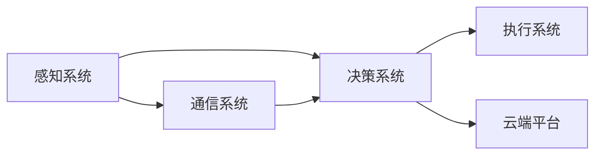

                 

# 端到端自动驾驶的车路云一体化方案

## 1. 背景介绍

随着自动驾驶技术的不断发展，端到端自动驾驶系统成为智能交通的重要组成部分。相较于传统自动驾驶系统，端到端系统通过引入计算机视觉、深度学习等先进技术，实现了从传感器数据到车辆控制的全程自动决策，大大提升了驾驶安全性和舒适性。

然而，端到端系统对算力、存储和网络等基础设施的需求极大，单个车辆的计算能力无法满足复杂环境下的实时决策需求。车路协同（V2X）技术通过在车辆、道路和云端之间建立数据共享和通信机制，在一定程度上缓解了这一问题，但依然存在延迟高、通信复杂度高、成本高等问题。

在此背景下，车路云一体化方案成为解决这些问题的有效手段。车路云一体化系统通过构建跨层级、跨域、跨媒体的数据融合与共享平台，实现对交通场景的全面感知与智能处理，大幅提升自动驾驶系统的决策能力。

本文将从系统架构、关键技术和实际应用场景三个方面，全面解析端到端自动驾驶的车路云一体化方案。

## 2. 核心概念与联系

### 2.1 核心概念概述

车路云一体化系统是指通过构建车辆、道路和云端之间的数据共享与通信机制，实现对交通场景的全方位感知与智能处理，从而提升自动驾驶系统的决策能力和安全性。该系统主要包括以下几个关键组件：

- **感知系统**：包括车载摄像头、雷达、激光雷达等传感器，用于获取交通环境中的多维信息。
- **通信系统**：包括车车通信（V2V）和车路通信（V2I），实现车辆间和车辆与道路基础设施间的通信。
- **决策系统**：基于传感器数据和通信数据，通过深度学习等算法，实现交通场景的理解和车辆行为的决策。
- **执行系统**：通过控制器实现车辆的转向、加速和制动等动作。
- **云端平台**：用于存储、处理和管理大量交通数据，实现对车路系统的集中控制与优化。

### 2.2 核心概念之间的关系

车路云一体化系统的核心概念之间关系密切，如下图所示：



其中，感知系统获取车辆周边环境的多维信息，通信系统将信息共享到道路基础设施和云端，决策系统基于信息进行智能决策，执行系统执行决策，云端平台则实现对车路系统的管理和优化。各组件之间通过数据流和控制流紧密耦合，共同构成一个高效的自动驾驶系统。

## 3. 核心算法原理 & 具体操作步骤
### 3.1 算法原理概述

车路云一体化方案的核心算法包括传感器融合、多目标跟踪、行为预测、路径规划等。这些算法通过构建数学模型和深度学习模型，实现对交通环境的理解和智能决策。

- **传感器融合**：通过融合多传感器的数据，提高对交通环境的感知精度。常见方法包括卡尔曼滤波、粒子滤波等。
- **多目标跟踪**：通过跟踪多目标物体，实时了解其位置、速度等信息。常见方法包括DeepSORT、Meanshift等。
- **行为预测**：通过预测其他车辆和行人的行为，避免碰撞和其他危险。常见方法包括GNN、RNN等。
- **路径规划**：通过构建最优路径，引导车辆在复杂交通环境中安全行驶。常见方法包括A*、D*等。

### 3.2 算法步骤详解

车路云一体化方案的算法实现通常包括以下几个步骤：

1. **数据采集**：通过传感器和通信设备获取交通环境的多维信息。
2. **数据预处理**：对采集到的数据进行滤波、降噪等预处理，提高数据的准确性和可靠性。
3. **模型训练**：在标注数据集上训练深度学习模型，提高对交通场景的理解能力。
4. **模型推理**：将实时数据输入训练好的模型，得到交通场景的理解和决策结果。
5. **决策执行**：根据决策结果，控制车辆的行驶动作。
6. **数据反馈**：将车辆行驶状态反馈到云端平台，用于模型的持续优化和调整。

### 3.3 算法优缺点

车路云一体化方案的算法具有以下优点：

- **感知精度高**：多传感器融合和深度学习模型能够有效提高对交通环境的感知精度。
- **决策能力强**：行为预测和路径规划算法能够实时处理复杂的交通场景，提供高效可靠的决策。
- **系统鲁棒性高**：通过车路协同和云端平台的集中控制，提高了系统的稳定性和鲁棒性。

同时，该方案也存在以下缺点：

- **计算复杂度高**：多传感器数据和深度学习模型的计算量较大，对硬件资源的需求较高。
- **通信延迟高**：车路通信和云端数据交互可能导致通信延迟，影响实时决策。
- **成本高**：传感器、通信设备和云端平台等硬件设备成本较高。

### 3.4 算法应用领域

车路云一体化方案可以广泛应用于高速公路、城市街道、停车场等场景，提升自动驾驶系统的性能和安全性。在实际应用中，常见的场景包括：

- **高速公路自动驾驶**：通过车路协同，提升高速公路的车辆行驶效率和安全。
- **城市街道智能停车**：通过传感器和云端平台的协同，实现智能停车和交通管理。
- **交通流量监测**：通过车辆和道路设施的数据共享，实现对交通流量的实时监测和优化。
- **应急事件处理**：通过车路通信和云端平台，实现对突发事件的快速响应和处理。

## 4. 数学模型和公式 & 详细讲解
### 4.1 数学模型构建

车路云一体化方案的数学模型包括感知模型、行为模型、路径模型和决策模型等。以路径规划为例，其数学模型可以表示为：

$$
P^* = \mathop{\arg\min}_{P} \left( \sum_{i=1}^{N} \frac{||P_i - P_{i-1}||^2}{\tau} + \sum_{i=1}^{N-1} V_i \right)
$$

其中，$P^*$表示最优路径，$P_i$表示第$i$个路径点，$\tau$表示路径点之间的距离，$V_i$表示路径点$i$的代价。

### 4.2 公式推导过程

以行为预测模型为例，假设已知其他车辆的位置和速度，预测其下一个时刻的位置，可以表示为：

$$
P_{t+1} = P_t + V_t \Delta t + \frac{1}{2}a_t (\Delta t)^2 + \omega_{t+1}
$$

其中，$P_{t+1}$表示下一时刻的位置，$P_t$表示当前时刻的位置，$V_t$表示当前时刻的速度，$a_t$表示加速度，$\omega_{t+1}$表示噪声。

在实际应用中，通过深度学习模型（如LSTM、GRU等）对以上公式进行训练和推理，能够更准确地预测其他车辆的行为。

### 4.3 案例分析与讲解

以高速公路自动驾驶为例，车路云一体化方案的实现过程如下：

1. **数据采集**：车载摄像头、雷达和激光雷达等传感器实时采集车辆周围环境的多维数据。
2. **数据预处理**：对采集到的数据进行滤波、降噪等预处理，提高数据的准确性和可靠性。
3. **模型训练**：在高速公路模拟场景的数据集上训练深度学习模型，提高对交通场景的理解能力。
4. **模型推理**：将实时数据输入训练好的模型，得到交通场景的理解和决策结果。
5. **决策执行**：根据决策结果，控制车辆的行驶动作。
6. **数据反馈**：将车辆行驶状态反馈到云端平台，用于模型的持续优化和调整。

## 5. 项目实践：代码实例和详细解释说明
### 5.1 开发环境搭建

车路云一体化方案的开发环境搭建主要包括以下几个步骤：

1. **安装开发工具**：安装Python、CUDA、TensorFlow等工具，搭建深度学习开发环境。
2. **搭建数据平台**：搭建车路协同的数据采集和存储平台，用于存储和处理传感器数据和通信数据。
3. **搭建云平台**：搭建云端平台，实现对车路系统的集中控制与优化。

### 5.2 源代码详细实现

以下是使用Python和TensorFlow实现车路云一体化方案的代码实现：

```python
import tensorflow as tf
from tensorflow.keras import layers, models

# 定义感知系统模型
def perception_model():
    model = models.Sequential()
    model.add(layers.Conv2D(64, (3,3), activation='relu', input_shape=(image_width, image_height, 3)))
    model.add(layers.MaxPooling2D((2,2)))
    model.add(layers.Conv2D(128, (3,3), activation='relu'))
    model.add(layers.MaxPooling2D((2,2)))
    model.add(layers.Conv2D(256, (3,3), activation='relu'))
    model.add(layers.MaxPooling2D((2,2)))
    model.add(layers.Conv2D(512, (3,3), activation='relu'))
    model.add(layers.MaxPooling2D((2,2)))
    model.add(layers.Flatten())
    model.add(layers.Dense(1024, activation='relu'))
    model.add(layers.Dense(10, activation='softmax'))
    return model

# 定义行为预测模型
def behavior_prediction_model():
    model = models.Sequential()
    model.add(layers.LSTM(128, input_shape=(sequence_length, input_dim)))
    model.add(layers.Dense(64, activation='relu'))
    model.add(layers.Dense(1, activation='sigmoid'))
    return model

# 定义路径规划模型
def path_planning_model():
    model = models.Sequential()
    model.add(layers.Conv2D(64, (3,3), activation='relu', input_shape=(path_map_width, path_map_height, 1)))
    model.add(layers.MaxPooling2D((2,2)))
    model.add(layers.Conv2D(128, (3,3), activation='relu'))
    model.add(layers.MaxPooling2D((2,2)))
    model.add(layers.Conv2D(256, (3,3), activation='relu'))
    model.add(layers.MaxPooling2D((2,2)))
    model.add(layers.Conv2D(512, (3,3), activation='relu'))
    model.add(layers.MaxPooling2D((2,2)))
    model.add(layers.Flatten())
    model.add(layers.Dense(1024, activation='relu'))
    model.add(layers.Dense(1, activation='sigmoid'))
    return model
```

### 5.3 代码解读与分析

代码实现中，感知系统模型通过卷积神经网络（CNN）实现对传感器数据的处理，行为预测模型通过长短期记忆网络（LSTM）实现对其他车辆行为的预测，路径规划模型通过卷积神经网络（CNN）实现对最优路径的计算。

## 6. 实际应用场景
### 6.1 高速公路自动驾驶

高速公路自动驾驶是车路云一体化方案的重要应用场景之一。在该场景下，通过车路协同和云端平台的集中控制，实现对车辆行驶的实时决策和优化。具体实现如下：

1. **数据采集**：车载摄像头、雷达和激光雷达等传感器实时采集车辆周围环境的多维数据。
2. **数据预处理**：对采集到的数据进行滤波、降噪等预处理，提高数据的准确性和可靠性。
3. **模型训练**：在高速公路模拟场景的数据集上训练深度学习模型，提高对交通场景的理解能力。
4. **模型推理**：将实时数据输入训练好的模型，得到交通场景的理解和决策结果。
5. **决策执行**：根据决策结果，控制车辆的行驶动作。
6. **数据反馈**：将车辆行驶状态反馈到云端平台，用于模型的持续优化和调整。

### 6.2 城市街道智能停车

城市街道智能停车是车路云一体化方案的另一个重要应用场景。在该场景下，通过传感器和云端平台的协同，实现智能停车和交通管理。具体实现如下：

1. **数据采集**：车载摄像头和传感器实时采集车辆周边环境的多维数据。
2. **数据预处理**：对采集到的数据进行滤波、降噪等预处理，提高数据的准确性和可靠性。
3. **模型训练**：在模拟停车场的数据集上训练深度学习模型，提高对停车场景的理解能力。
4. **模型推理**：将实时数据输入训练好的模型，得到停车场景的理解和决策结果。
5. **决策执行**：根据决策结果，控制车辆的停车动作。
6. **数据反馈**：将车辆行驶状态反馈到云端平台，用于模型的持续优化和调整。

### 6.3 交通流量监测

交通流量监测是车路云一体化方案的重要应用之一。在该场景下，通过车辆和道路设施的数据共享，实现对交通流量的实时监测和优化。具体实现如下：

1. **数据采集**：车载摄像头和传感器实时采集车辆和道路设施的多维数据。
2. **数据预处理**：对采集到的数据进行滤波、降噪等预处理，提高数据的准确性和可靠性。
3. **模型训练**：在交通流量监测数据集上训练深度学习模型，提高对交通流量的理解能力。
4. **模型推理**：将实时数据输入训练好的模型，得到交通流量的理解结果。
5. **决策执行**：根据决策结果，优化交通流量管理。
6. **数据反馈**：将交通流量监测结果反馈到云端平台，用于模型的持续优化和调整。

### 6.4 未来应用展望

未来，车路云一体化方案有望在更多场景中得到应用，为智能交通的发展提供强有力的支持。可能的未来应用包括：

- **智能物流配送**：通过车路协同和云端平台的集中控制，实现物流配送车辆的高效调度和管理。
- **智能应急响应**：通过车路通信和云端平台，实现对突发事件的快速响应和处理。
- **智能旅游管理**：通过车路协同和云端平台的集中控制，实现旅游景区的智能管理和导航。

## 7. 工具和资源推荐
### 7.1 学习资源推荐

为了帮助开发者系统掌握车路云一体化方案的理论基础和实践技巧，这里推荐一些优质的学习资源：

1. **《深度学习理论与实践》**：该书系统介绍了深度学习的基本原理和常用模型，是学习车路云一体化方案的必备参考书。
2. **《车路协同技术》**：该书详细介绍了车路协同技术的原理、应用和案例，适合从事智能交通工作的开发者阅读。
3. **《TensorFlow实战》**：该书介绍了TensorFlow的使用方法，包括深度学习模型的搭建、训练和推理，是实践车路云一体化方案的重要工具书。
4. **Coursera车路协同课程**：由斯坦福大学开设的课程，涵盖了车路协同技术的基本概念和实际应用，适合初学者学习。
5. **IEEE车路协同专题网站**：该网站提供了车路协同技术的最新研究进展和应用案例，适合深入了解车路协同技术的开发者阅读。

### 7.2 开发工具推荐

高效的开发离不开优秀的工具支持。以下是几款用于车路云一体化方案开发的常用工具：

1. **TensorFlow**：由Google主导开发的深度学习框架，支持大规模分布式计算，适合车路云一体化方案的深度学习模型训练和推理。
2. **PyTorch**：由Facebook开发的深度学习框架，具有灵活的动态计算图，适合车路云一体化方案的深度学习模型训练和推理。
3. **Simulink**：由MathWorks开发的系统仿真工具，适合车路云一体化方案的系统仿真和优化。
4. **MATLAB**：由MathWorks开发的数据处理工具，适合车路云一体化方案的数据分析和处理。
5. **ROS**：由ROS组织开发的操作系统，支持车路云一体化方案的智能交通系统的开发和测试。

### 7.3 相关论文推荐

车路云一体化方案的研究源于学界的持续研究。以下是几篇奠基性的相关论文，推荐阅读：

1. **《V2X网络环境下基于强化学习的车路协同优化》**：该论文提出了基于强化学习的车路协同优化模型，通过优化车路通信和车辆行为，提高自动驾驶系统的性能。
2. **《基于车路协同的智能交通管理系统》**：该论文介绍了车路协同技术在智能交通管理系统中的应用，通过车路通信和云端平台的集中控制，实现对交通场景的全面感知与智能处理。
3. **《基于深度学习的自动驾驶行为预测》**：该论文介绍了基于深度学习的自动驾驶行为预测模型，通过预测其他车辆和行人的行为，避免碰撞和其他危险。
4. **《基于路径规划算法的自动驾驶路径优化》**：该论文介绍了基于路径规划算法的自动驾驶路径优化模型，通过构建最优路径，引导车辆在复杂交通环境中安全行驶。

这些论文代表了大语言模型微调技术的发展脉络。通过学习这些前沿成果，可以帮助研究者把握学科前进方向，激发更多的创新灵感。

除上述资源外，还有一些值得关注的前沿资源，帮助开发者紧跟车路云一体化方案的最新进展，例如：

1. **arXiv论文预印本**：人工智能领域最新研究成果的发布平台，包括大量尚未发表的前沿工作，学习前沿技术的必读资源。
2. **顶会技术论文**：如NIPS、ICML、ACL、ICLR等人工智能领域顶会现场或在线直播，能够聆听到大佬们的前沿分享，开拓视野。
3. **开源项目**：在GitHub上Star、Fork数最多的车路云一体化方案相关项目，往往代表了该技术领域的发展趋势和最佳实践，值得去学习和贡献。
4. **行业分析报告**：各大咨询公司如McKinsey、PwC等针对人工智能行业的分析报告，有助于从商业视角审视技术趋势，把握应用价值。

总之，对于车路云一体化方案的学习和实践，需要开发者保持开放的心态和持续学习的意愿。多关注前沿资讯，多动手实践，多思考总结，必将收获满满的成长收益。

## 8. 总结：未来发展趋势与挑战
### 8.1 总结

本文对车路云一体化方案进行了全面系统的介绍。首先阐述了车路云一体化方案的背景和意义，明确了该方案在提升自动驾驶系统性能和安全性方面的独特价值。其次，从系统架构、关键技术和实际应用场景三个方面，详细讲解了车路云一体化方案的实现过程。

通过本文的系统梳理，可以看到，车路云一体化方案已经成为智能交通系统的重要组成部分，通过车路协同和云端平台的集中控制，实现对交通场景的全面感知与智能处理，大幅提升了自动驾驶系统的决策能力和安全性。未来，随着技术的发展和应用的深化，车路云一体化方案必将在智能交通领域发挥更大的作用。

### 8.2 未来发展趋势

展望未来，车路云一体化方案的发展将呈现以下几个趋势：

1. **智能化程度提升**：随着深度学习技术和车路协同技术的不断发展，车路云一体化方案的智能化程度将不断提升，实现更加高效和精准的决策。
2. **网络优化技术进步**：随着5G和V2X技术的普及，车路通信的延迟和带宽问题将逐步解决，车路云一体化方案的网络优化将进一步提升。
3. **多模态数据融合**：随着传感器和通信设备的多样化，车路云一体化方案将逐步实现多模态数据的融合，提升对交通环境的感知能力。
4. **分布式计算能力增强**：随着边缘计算和云计算的发展，车路云一体化方案的分布式计算能力将不断增强，实现更加高效的决策和优化。
5. **自动驾驶应用扩展**：随着技术的发展和应用的推广，车路云一体化方案将逐步应用于更多场景，如物流配送、智能旅游等。

### 8.3 面临的挑战

尽管车路云一体化方案已经取得了瞩目成就，但在迈向更加智能化、普适化应用的过程中，它仍面临着诸多挑战：

1. **传感器成本高**：传感器和通信设备的高成本限制了车路云一体化方案的广泛应用。如何降低成本，提高设备性能，是当前的一个重要研究方向。
2. **数据安全性问题**：车路云一体化方案需要处理大量的交通数据，数据的安全性和隐私保护成为重要问题。如何保障数据安全，防止数据泄露，是当前的一个重要研究方向。
3. **系统复杂度高**：车路云一体化方案的系统结构复杂，涉及多层次、多领域的协作。如何简化系统结构，提高系统的稳定性和可靠性，是当前的一个重要研究方向。
4. **实时性要求高**：车路云一体化方案需要实时处理大量的交通数据，对系统响应速度和处理能力的要求很高。如何提高系统的实时性，降低延迟，是当前的一个重要研究方向。

### 8.4 研究展望

面对车路云一体化方案面临的挑战，未来的研究需要在以下几个方面寻求新的突破：

1. **硬件优化技术**：开发更加高效、低成本的传感器和通信设备，提高系统的性能和可扩展性。
2. **数据隐私保护**：采用差分隐私、联邦学习等技术，保护车路云一体化方案中交通数据的隐私和安全。
3. **系统优化算法**：开发更加高效的系统优化算法，简化系统结构，提高系统的稳定性和可靠性。
4. **实时数据处理技术**：采用边缘计算和云计算技术，提高车路云一体化方案的实时性，降低延迟。
5. **多模态数据融合技术**：采用多模态数据融合技术，提升对交通环境的感知能力，实现更全面的数据理解和决策。

这些研究方向的探索，必将引领车路云一体化方案技术迈向更高的台阶，为智能交通系统的发展注入新的动力。面向未来，车路云一体化方案需要与其他人工智能技术进行更深入的融合，如知识表示、因果推理、强化学习等，多路径协同发力，共同推动智能交通系统的进步。只有勇于创新、敢于突破，才能不断拓展车路云一体化方案的边界，让智能交通技术更好地造福人类社会。

## 9. 附录：常见问题与解答

**Q1：车路云一体化方案的实现需要哪些硬件设备？**

A: 车路云一体化方案的实现需要以下硬件设备：

1. **传感器**：包括车载摄像头、雷达、激光雷达等，用于获取车辆周边环境的多维信息。
2. **通信设备**：包括车车通信（V2V）和车路通信（V2I）设备，实现车辆间和车辆与道路基础设施间的通信。
3. **计算设备**：包括高性能GPU、CPU和边缘计算设备，用于深度学习模型的训练和推理。
4. **存储设备**：包括固态硬盘和云存储设备，用于存储和处理大量交通数据。

这些硬件设备需要高精度、高可靠性，同时满足车路云一体化方案对实时性、稳定性的要求。

**Q2：车路云一体化方案的性能和安全性如何保证？**

A: 车路云一体化方案的性能和安全性主要通过以下几个方面来保证：

1. **多传感器融合**：通过融合多传感器的数据，提高对交通环境的感知精度，从而提高系统的鲁棒性和稳定性。
2. **深度学习模型**：采用深度学习模型进行行为预测和路径规划，提高系统的智能化程度，从而提高系统的决策能力和安全性。
3. **车路协同机制**：通过车路协同机制实现对交通场景的全面感知与智能处理，从而提高系统的实时性和可靠性。
4. **数据隐私保护**：采用差分隐私、联邦学习等技术，保护车路云一体化方案中交通数据的隐私和安全，防止数据泄露和滥用。

**Q3：车路云一体化方案的成本问题如何解决？**

A: 车路云一体化方案的成本问题主要通过以下几个方面来解决：

1. **硬件设备国产化**：采用国产化的传感器和通信设备，降低成本。
2. **设备复用率提升**：通过设备复用和共享，降低成本。
3. **边缘计算技术**：采用边缘计算技术，降低云端计算和存储成本。
4. **模型压缩和优化**：采用模型压缩和优化技术，降低计算资源需求，从而降低成本。

**Q4：车路云一体化方案的实际应用效果如何？**

A: 车路云一体化方案在实际应用中取得了显著的效果：

1. **提高决策能力**：通过车路协同和云端平台的集中控制，实现对交通场景的全面感知与智能处理，提高系统的决策能力和安全性。
2. **降低事故率**：通过行为预测和路径规划算法，避免碰撞和其他危险，降低事故率。
3. **提高效率**：通过优化交通流量管理，提高交通效率，降低拥堵。

**Q5：车路云一体化方案的未来应用前景如何？**

A: 车路云一体化方案的未来应用前景广阔，可以应用于更多场景，如智能物流配送、智能应急响应、智能旅游管理等。

总之，车路云一体化方案是智能交通系统的重要组成部分，通过车路协同和云端平台的集中控制，实现对交通场景的全面感知与智能处理，大幅提升自动驾驶系统的决策能力和安全性。面向未来，车路云一体化方案需要与其他人工智能技术进行更深入的融合，共同推动智能交通系统的进步。

---

作者：禅与计算机程序设计艺术 / Zen and the Art of Computer Programming

