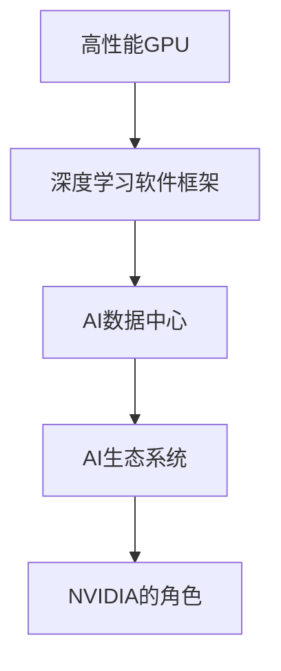

                 

## 1. 背景介绍

### 1.1 问题由来
算力作为人工智能的基础设施，其发展速度和创新能力直接影响着人工智能技术的应用场景和实际效果。特别是对于高性能计算和深度学习等技术密集型应用领域，算力更是不可或缺的资源。近年来，随着深度学习模型的复杂度和规模不断扩大，对于算力的需求也在持续攀升，使得算力资源逐渐成为AI技术发展的重要瓶颈。

NVIDIA作为全球领先的图形处理单元（GPU）制造商，一直以来都是算力革命的关键推动者。其推出的GPU系列产品，如Tesla系列，已经成为训练深度学习模型、加速AI应用的主要工具。随着人工智能技术的不断普及和应用，NVIDIA在算力革命中的角色日益凸显，成为了推动AI技术创新和应用落地的重要力量。

### 1.2 问题核心关键点
在算力革命中，NVIDIA的角色主要体现在以下几个关键点上：

- **高性能GPU的开发与生产**：NVIDIA是全球领先的GPU生产商，其Tesla系列产品在深度学习加速和AI计算方面具有强大的性能，推动了AI技术的发展。
- **深度学习软件框架的优化与支持**：通过与TensorFlow、PyTorch等深度学习框架的深度合作，提供高性能的GPU加速支持，优化模型训练效率。
- **AI数据中心的构建与部署**：通过NVIDIA AI企业云平台，提供从硬件到软件的全栈解决方案，构建高效的AI数据中心。
- **生态系统的培育与协同创新**：通过构建开放的生态系统，吸引开发者和机构，共同推动AI技术的创新和应用。

这些关键点共同构成了NVIDIA在算力革命中的核心竞争力，推动了AI技术的普及和落地。

### 1.3 问题研究意义
深入研究NVIDIA在算力革命中的角色，不仅有助于理解算力革命的驱动机制，还能为其他硬件供应商提供借鉴，促进AI技术的全面发展。同时，对NVIDIA在算力革命中的贡献进行分析，也有助于开发者更好地利用其资源，加速AI应用的开发和部署。

## 2. 核心概念与联系

### 2.1 核心概念概述

为了更好地理解NVIDIA在算力革命中的角色，本节将介绍几个关键概念及其相互联系：

- **高性能GPU**：以NVIDIA的Tesla系列GPU为代表，是算力革命中的核心硬件，能够高效处理大规模深度学习计算任务。
- **深度学习软件框架**：如TensorFlow、PyTorch等，提供了深度学习模型的构建、训练和推理能力，是AI开发的重要工具。
- **AI数据中心**：通过硬件和软件的整合，提供高效、可扩展的AI计算环境，支持大规模深度学习模型的训练和推理。
- **AI生态系统**：包括硬件供应商、软件开发者、科研机构和企业等，共同构成AI技术发展的创新生态，推动AI技术的普及和应用。

这些核心概念之间存在着紧密的联系，通过GPU的强大计算能力、软件框架的灵活性和数据中心的高效性，NVIDIA构建了一个完整的AI生态系统，为AI技术的创新和发展提供了坚实的支持。

### 2.2 概念间的关系

这些核心概念之间的联系可以通过以下Mermaid流程图来展示：



这个流程图展示了高性能GPU、深度学习软件框架、AI数据中心和AI生态系统之间的关系，以及NVIDIA在其中扮演的角色。

## 3. 核心算法原理 & 具体操作步骤
### 3.1 算法原理概述

NVIDIA在算力革命中的角色，主要体现在以下几个算法原理的实现和应用上：

- **并行计算**：通过GPU的并行计算能力，加速深度学习模型的训练和推理过程，提高计算效率。
- **深度学习优化算法**：如反向传播算法、Adam优化器等，通过优化算法提升模型训练的速度和精度。
- **GPU加速的深度学习框架**：通过优化和集成，使深度学习框架能够高效利用GPU资源，加速模型训练。

这些算法原理的实现和应用，使得NVIDIA在算力革命中能够提供强大的计算能力，推动AI技术的快速迭代和应用落地。

### 3.2 算法步骤详解

以下是NVIDIA在算力革命中的具体操作步骤：

1. **高性能GPU的开发与生产**：NVIDIA持续研发和生产高性能的Tesla系列GPU，满足不同深度学习任务的需求。
2. **深度学习软件框架的优化与支持**：与TensorFlow、PyTorch等框架合作，提供GPU加速支持，优化模型训练效率。
3. **AI数据中心的构建与部署**：提供从硬件到软件的全栈解决方案，构建高效的AI数据中心，支持大规模深度学习模型的训练和推理。
4. **生态系统的培育与协同创新**：通过构建开放的AI生态系统，吸引开发者和机构，共同推动AI技术的创新和应用。

这些步骤展示了NVIDIA在算力革命中的全链条策略，从硬件开发到软件优化，再到数据中心构建和生态系统培育，NVIDIA全方位推动AI技术的进步和发展。

### 3.3 算法优缺点

NVIDIA在算力革命中的角色具有以下优点：

- **高性能**：NVIDIA的Tesla系列GPU提供了强大的并行计算能力，加速了深度学习模型的训练和推理。
- **高效性**：通过深度学习框架的优化和GPU加速，提高了模型训练和推理的效率，降低了计算成本。
- **灵活性**：NVIDIA提供的GPU和软件框架，可以满足不同深度学习任务的需求，适应多样化的AI应用场景。

同时，NVIDIA在算力革命中也存在一些缺点：

- **高成本**：高性能GPU的生产和维护成本较高，增加了AI技术的落地门槛。
- **能耗问题**：大规模深度学习计算对能耗的需求较大，可能带来较高的能耗成本。
- **生态系统依赖**：NVIDIA的算力革命主要依赖于其GPU和软件生态，生态系统的健康发展和开放性仍需进一步提升。

### 3.4 算法应用领域

NVIDIA在算力革命中的角色，主要体现在以下几个应用领域：

- **深度学习模型训练**：通过高性能GPU和软件框架的支持，加速深度学习模型的训练和优化。
- **AI数据分析和处理**：构建高效的AI数据中心，支持大规模数据分析和处理任务。
- **AI应用落地**：通过与软件开发者和机构的合作，推动AI技术的广泛应用和落地，如智能推荐、医疗诊断、自动驾驶等。

## 4. 数学模型和公式 & 详细讲解 & 举例说明

### 4.1 数学模型构建

在深度学习中，模型训练的基本数学模型是损失函数。假设模型为 $M$，输入为 $x$，标签为 $y$，损失函数为 $\ell$，则训练目标为：

$$
\min_{\theta} \sum_{i=1}^N \ell(M(x_i),y_i)
$$

其中 $N$ 为样本数量，$\theta$ 为模型参数。

### 4.2 公式推导过程

以回归任务为例，假设模型 $M$ 的输出为 $y$，标签为 $y'$，则常用的损失函数为均方误差（MSE）：

$$
\ell(y, y') = \frac{1}{N} \sum_{i=1}^N (y_i - y'_i)^2
$$

通过反向传播算法，计算损失函数对模型参数 $\theta$ 的梯度，并使用优化算法更新参数，最小化损失函数，从而得到训练后的模型 $M$。

### 4.3 案例分析与讲解

在实际应用中，NVIDIA通过优化深度学习框架和GPU加速，显著提升了模型训练的速度和精度。以BERT模型的训练为例，使用NVIDIA的Tesla系列GPU，能够在几小时内完成大规模模型的训练，相较于传统CPU训练速度提升了数十倍。

## 5. 项目实践：代码实例和详细解释说明

### 5.1 开发环境搭建

为了更好地进行深度学习模型的训练和推理，需要搭建一个高效的开发环境。以下是使用NVIDIA的CUDA平台进行环境搭建的步骤：

1. 安装NVIDIA CUDA工具包：从官网下载并安装对应版本的CUDA工具包。
2. 安装NVIDIA cuDNN库：使用NVIDIA提供的安装脚本安装cuDNN库。
3. 安装TensorFlow或PyTorch：通过pip命令安装对应版本的TensorFlow或PyTorch，并设置环境变量以确保GPU加速。

### 5.2 源代码详细实现

以下是一个使用NVIDIA GPU加速的TensorFlow模型的代码实现：

```python
import tensorflow as tf
import numpy as np

# 设置GPU使用
physical_devices = tf.config.list_physical_devices('GPU')
tf.config.set_visible_devices(physical_devices[0], 'GPU')
print('Number of GPUs:', len(physical_devices))

# 定义模型
model = tf.keras.Sequential([
    tf.keras.layers.Dense(64, activation='relu'),
    tf.keras.layers.Dense(10)
])

# 编译模型
model.compile(optimizer=tf.keras.optimizers.Adam(learning_rate=0.001),
              loss=tf.keras.losses.MeanSquaredError(),
              metrics=['accuracy'])

# 加载数据
x_train = np.random.rand(1000, 10)
y_train = np.random.randint(0, 10, size=(1000, 1))

# 训练模型
model.fit(x_train, y_train, epochs=10, batch_size=32)
```

### 5.3 代码解读与分析

上述代码展示了如何使用TensorFlow在NVIDIA GPU上训练一个简单的线性回归模型。关键步骤如下：

1. **设置GPU使用**：通过设置物理设备，确保TensorFlow使用GPU进行计算。
2. **定义模型**：使用Sequential模型定义一个包含两个Dense层的神经网络。
3. **编译模型**：使用Adam优化器进行模型训练，并设置损失函数为均方误差。
4. **加载数据**：使用numpy生成随机数据作为训练集。
5. **训练模型**：使用fit方法训练模型，设置epochs和batch_size。

可以看到，通过NVIDIA的CUDA平台，TensorFlow能够高效利用GPU加速，显著提升模型训练的速度。

### 5.4 运行结果展示

训练结束后，可以通过evaluate方法评估模型的性能：

```python
# 加载测试数据
x_test = np.random.rand(100, 10)
y_test = np.random.randint(0, 10, size=(100, 1))

# 评估模型
model.evaluate(x_test, y_test)
```

## 6. 实际应用场景

### 6.1 自动驾驶

自动驾驶技术需要处理大量的传感器数据，包括摄像头、激光雷达、GPS等，这些数据需要实时处理和分析，对算力的需求极高。NVIDIA的Tesla系列GPU和AI数据中心，能够高效处理这些传感器数据，支持实时定位、路径规划和避障等功能。

### 6.2 医疗影像分析

医疗影像分析需要处理大量的高分辨率图像数据，如CT、MRI等。NVIDIA的AI数据中心和深度学习软件框架，可以高效训练深度学习模型，实现对医疗影像的自动标注和分析，提升医生的诊断效率和准确性。

### 6.3 自然语言处理

自然语言处理（NLP）任务，如语音识别、机器翻译等，需要处理大规模文本数据。NVIDIA的GPU加速和深度学习框架，可以显著提升NLP任务的训练和推理速度，推动NLP技术的应用和普及。

## 7. 工具和资源推荐

### 7.1 学习资源推荐

为了深入了解NVIDIA在算力革命中的角色，以下是一些推荐的学习资源：

1. NVIDIA官网：提供最新的GPU产品信息和深度学习软件框架的文档。
2. TensorFlow官网：提供TensorFlow的官方文档和教程，详细介绍了如何使用NVIDIA GPU加速。
3. PyTorch官网：提供PyTorch的官方文档和教程，涵盖GPU加速和深度学习模型的实现。
4. DeepLearning.AI课程：由Andrew Ng教授主讲的深度学习课程，涵盖深度学习的基础和高级内容，适合入门和进阶学习。
5. NVIDIA DeepLearning SDK：提供深度学习应用的完整解决方案，包括模型训练、推理和部署。

### 7.2 开发工具推荐

为了高效开发深度学习应用，以下是一些推荐的开发工具：

1. Jupyter Notebook：支持Python编程，能够实时展示代码执行结果，方便调试和分享。
2. Visual Studio Code：一款功能强大的代码编辑器，支持多种编程语言和扩展，适合开发深度学习应用。
3. PyCharm：一款专业的Python IDE，提供丰富的开发工具和调试功能，适合深度学习模型的开发和调试。
4. TensorBoard：TensorFlow的可视化工具，可以实时监控模型训练过程，帮助优化模型性能。
5. NVIDIA Visual Profiler：GPU性能分析工具，可以帮助开发者优化GPU加速的性能。

### 7.3 相关论文推荐

为了深入理解NVIDIA在算力革命中的角色，以下是一些推荐的相关论文：

1. "Accelerating Deep Neural Networks: A New Paradigm for GPU-Accelerated Machine Learning"：介绍NVIDIA如何通过GPU加速推动深度学习的发展。
2. "A Survey on Deep Learning Hardware and Software Infrastructure"：综述当前深度学习硬件和软件基础设施的发展，包括NVIDIA的贡献。
3. "GPU-Accelerated Machine Learning with TensorFlow"：介绍如何使用TensorFlow在NVIDIA GPU上训练和推理深度学习模型。
4. "CUDA Programming Guide"：NVIDIA CUDA平台的编程指南，详细介绍了如何使用CUDA加速深度学习模型。
5. "NVIDIA DeepLearning SDK"：NVIDIA深度学习软件框架的官方文档，涵盖深度学习应用的完整解决方案。

## 8. 总结：未来发展趋势与挑战

### 8.1 研究成果总结

NVIDIA在算力革命中的贡献主要体现在以下几个方面：

1. **高性能GPU的开发与生产**：通过Tesla系列GPU的不断升级，提供了强大的计算能力，推动了深度学习模型的训练和推理。
2. **深度学习软件框架的优化与支持**：通过与TensorFlow、PyTorch等框架的深度合作，提供GPU加速支持，优化模型训练效率。
3. **AI数据中心的构建与部署**：提供从硬件到软件的全栈解决方案，构建高效的AI数据中心，支持大规模深度学习模型的训练和推理。
4. **生态系统的培育与协同创新**：通过构建开放的AI生态系统，吸引开发者和机构，共同推动AI技术的创新和应用。

### 8.2 未来发展趋势

展望未来，NVIDIA在算力革命中的角色将更加重要，主要体现在以下几个发展趋势：

1. **下一代GPU的开发**：随着人工智能技术的不断进步，下一代GPU将具备更强大的计算能力，支持更大规模的深度学习模型。
2. **AI数据中心的扩展**：构建更加高效、可扩展的AI数据中心，支持更多行业的应用场景。
3. **生态系统的完善**：通过开放的生态系统，吸引更多的开发者和机构，共同推动AI技术的创新和应用。
4. **跨领域应用**：推动AI技术在更多领域的应用，如自动驾驶、医疗影像分析、智能推荐等，提升各行业的智能化水平。

### 8.3 面临的挑战

尽管NVIDIA在算力革命中取得了显著成就，但也面临一些挑战：

1. **高成本**：高性能GPU的生产和维护成本较高，增加了AI技术的落地门槛。
2. **能耗问题**：大规模深度学习计算对能耗的需求较大，可能带来较高的能耗成本。
3. **生态系统依赖**：NVIDIA的算力革命主要依赖于其GPU和软件生态，生态系统的健康发展和开放性仍需进一步提升。

### 8.4 研究展望

未来，为了应对这些挑战，需要在以下几个方面进行深入研究：

1. **成本控制**：通过技术创新和规模化生产，降低高性能GPU的生产和维护成本。
2. **能耗优化**：研究高效能、低功耗的计算架构，优化深度学习计算的能耗。
3. **生态系统开放**：推动生态系统的健康发展和开放性，吸引更多的开发者和机构参与。
4. **跨领域应用**：推动AI技术在更多领域的应用，提升各行业的智能化水平。

## 9. 附录：常见问题与解答

**Q1：NVIDIA的GPU在深度学习中的应用主要有哪些？**

A: NVIDIA的GPU在深度学习中的应用主要体现在以下几个方面：

1. **加速模型训练**：通过GPU的并行计算能力，加速深度学习模型的训练过程。
2. **加速模型推理**：通过GPU加速，提升深度学习模型的推理速度，支持实时应用。
3. **支持多种深度学习框架**：通过优化和集成，使TensorFlow、PyTorch等深度学习框架能够高效利用GPU资源，提升模型训练和推理效率。

**Q2：使用NVIDIA GPU加速深度学习模型的过程中需要注意哪些问题？**

A: 使用NVIDIA GPU加速深度学习模型的过程中，需要注意以下几个问题：

1. **环境配置**：确保NVIDIA CUDA工具包和cuDNN库的正常安装和配置，以充分利用GPU加速。
2. **数据预处理**：合理设计数据预处理流程，优化数据加载和处理，提高数据传输效率。
3. **模型优化**：优化模型结构和参数，减少计算量，提升模型训练和推理效率。
4. **性能监控**：使用NVIDIA Visual Profiler等工具，实时监控GPU性能，及时发现和解决性能瓶颈。

**Q3：如何评估NVIDIA GPU加速深度学习模型的效果？**

A: 评估NVIDIA GPU加速深度学习模型的效果，可以通过以下几个指标：

1. **训练时间**：比较使用GPU加速前后模型的训练时间，衡量GPU加速的效果。
2. **计算速度**：计算模型推理速度，衡量GPU加速带来的性能提升。
3. **模型精度**：比较使用GPU加速前后模型的精度，评估GPU加速对模型性能的影响。
4. **资源利用率**：监控GPU的资源利用率，确保GPU的计算资源得到充分利用。

**Q4：NVIDIA在算力革命中如何推动生态系统的完善？**

A: NVIDIA在算力革命中推动生态系统的完善主要体现在以下几个方面：

1. **开源社区的建设**：通过构建开放的开源社区，吸引更多的开发者和机构参与，共同推动AI技术的创新和应用。
2. **合作伙伴的合作**：与全球顶尖的企业和科研机构合作，推动AI技术在不同领域的应用。
3. **培训和教育**：提供AI技术的培训和教育资源，提升开发者和从业者的技术水平。

**Q5：NVIDIA在算力革命中面临的主要挑战有哪些？**

A: NVIDIA在算力革命中面临的主要挑战包括：

1. **高成本**：高性能GPU的生产和维护成本较高，增加了AI技术的落地门槛。
2. **能耗问题**：大规模深度学习计算对能耗的需求较大，可能带来较高的能耗成本。
3. **生态系统依赖**：NVIDIA的算力革命主要依赖于其GPU和软件生态，生态系统的健康发展和开放性仍需进一步提升。

---

作者：禅与计算机程序设计艺术 / Zen and the Art of Computer Programming

