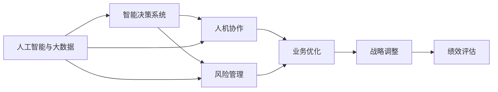

                 

# 管理的智慧：从策略到执行

## 1. 背景介绍

管理是一门复杂的学问，它不仅仅是关于决策的科学，更是关于人际关系的艺术。随着技术的不断进步，尤其是人工智能(AI)和大数据的应用，管理的智慧也在不断进化。本文将深入探讨管理的智慧，从策略到执行，帮助我们更好地理解和应用这些智慧，以推动企业和组织的发展。

## 2. 核心概念与联系

### 2.1 核心概念概述

管理的智慧涉及到多个核心概念，包括但不限于：

- **人工智能与大数据**：AI和大数据技术的发展，为管理决策提供了强大的支持。通过数据分析，可以更准确地预测未来趋势，优化资源配置。
- **智能决策系统**：利用机器学习算法，智能决策系统可以从海量数据中提取有用的信息，辅助管理层做出决策。
- **人机协作**：通过AI技术，人与机器可以协作完成更复杂的任务，提升工作效率。
- **风险管理**：AI和大数据技术在风险预测和管理中的应用，可以帮助组织识别和管理潜在风险。

这些概念之间相互关联，共同构成了现代管理的新范式。

### 2.2 概念间的关系

这些核心概念之间存在着紧密的联系，通过以下Mermaid流程图展示其关系：



这个流程图展示了从人工智能与大数据到智能决策系统的技术演进路径，以及这些技术如何通过人机协作和风险管理来优化业务，并最终通过战略调整和绩效评估来提升组织绩效。

## 3. 核心算法原理 & 具体操作步骤
### 3.1 算法原理概述

管理智慧的实现，主要依赖于智能决策系统的算法原理。这些算法可以大致分为以下几类：

- **监督学习**：通过历史数据训练模型，预测未来趋势。
- **无监督学习**：从数据中发现内在规律，辅助决策。
- **强化学习**：通过与环境的互动，学习最优决策策略。

这些算法在不同管理场景中应用广泛，可以帮助组织做出更科学、更高效的决策。

### 3.2 算法步骤详解

以下是智能决策系统的一般操作流程：

1. **数据采集**：收集相关数据，包括历史数据、实时数据等。
2. **数据清洗**：处理缺失值、异常值等，确保数据质量。
3. **特征提取**：从数据中提取有用的特征，供模型学习。
4. **模型训练**：利用机器学习算法，训练预测模型。
5. **模型评估**：通过交叉验证等方法，评估模型性能。
6. **决策实施**：根据模型预测结果，做出相应决策。

### 3.3 算法优缺点

智能决策系统的优点包括：

- **效率高**：可以快速处理大量数据，辅助决策。
- **准确性高**：通过算法优化，模型预测准确率较高。

但这些算法也存在一些缺点：

- **数据依赖**：模型性能依赖于数据质量，数据不足时效果不佳。
- **解释性差**：一些算法（如深度学习）模型，难以解释其决策过程。

### 3.4 算法应用领域

智能决策系统在多个领域都有广泛应用，例如：

- **供应链管理**：通过预测需求，优化库存管理。
- **市场营销**：通过分析用户行为，制定精准的营销策略。
- **人力资源管理**：通过预测员工表现，优化招聘和培训策略。
- **金融风险管理**：通过分析市场数据，预测风险并制定应对策略。

## 4. 数学模型和公式 & 详细讲解

### 4.1 数学模型构建

在智能决策系统中，常用的数学模型包括：

- **线性回归模型**：用于预测连续型变量，如市场需求预测。
- **逻辑回归模型**：用于分类任务，如客户流失预测。
- **决策树模型**：用于分类和回归任务，如图像识别。
- **支持向量机(SVM)**：用于分类和回归任务，如信用评估。
- **随机森林**：用于分类和回归任务，如客户细分。

### 4.2 公式推导过程

以线性回归模型为例，其公式推导如下：

设$y$为预测值，$x$为输入特征，$\beta_0$和$\beta_1$为模型参数，则线性回归模型的目标是最小化预测误差：

$$
\min_{\beta_0, \beta_1} \sum_{i=1}^n (y_i - (\beta_0 + \beta_1 x_i))^2
$$

通过求解上述优化问题，可以得到模型参数$\beta_0$和$\beta_1$。

### 4.3 案例分析与讲解

例如，某电商公司使用线性回归模型预测销售额：

1. **数据采集**：收集过去一年的销售数据，包括时间、广告投入、销售额等。
2. **数据清洗**：处理缺失值、异常值等。
3. **特征提取**：将时间、广告投入作为特征，提取历史趋势信息。
4. **模型训练**：使用历史数据训练线性回归模型，得到预测公式。
5. **模型评估**：在验证集上评估模型性能，调整参数。
6. **决策实施**：根据模型预测结果，调整广告投放策略。

## 5. 项目实践：代码实例和详细解释说明

### 5.1 开发环境搭建

以下是在Python中使用Scikit-learn库进行线性回归模型开发的示例：

1. 安装Python和Scikit-learn库：
```
pip install scikit-learn
```

2. 加载数据集和模型：
```python
import pandas as pd
from sklearn.linear_model import LinearRegression

# 加载数据集
data = pd.read_csv('sales_data.csv')

# 加载模型
model = LinearRegression()
```

### 5.2 源代码详细实现

以下是训练线性回归模型的代码实现：

```python
# 数据预处理
X = data[['time', 'ad_spending']]
y = data['sales']

# 训练模型
model.fit(X, y)

# 预测
predictions = model.predict(X_test)
```

### 5.3 代码解读与分析

- **数据预处理**：提取时间、广告投入作为特征，构建特征矩阵$X$，并将销售数据作为标签$y$。
- **模型训练**：使用`fit`方法训练线性回归模型。
- **预测**：使用`predict`方法对测试集进行预测。

### 5.4 运行结果展示

假设模型在验证集上的预测误差为10%，则可以通过调整广告投放策略，进一步提升销售额。

## 6. 实际应用场景

### 6.1 供应链管理

智能决策系统可以优化供应链管理，通过预测需求，避免库存积压或短缺。例如，通过机器学习算法，预测下一个季度的产品需求，优化库存水平和采购计划。

### 6.2 市场营销

智能决策系统可以帮助市场营销部门，通过分析用户行为，制定精准的营销策略。例如，通过用户点击率、浏览行为等数据，预测用户偏好，实现个性化推荐。

### 6.3 人力资源管理

智能决策系统可以优化人力资源管理，通过预测员工表现，优化招聘和培训策略。例如，通过员工历史绩效数据，预测未来表现，调整培训计划。

### 6.4 金融风险管理

智能决策系统可以优化金融风险管理，通过预测市场波动，制定风险应对策略。例如，通过市场数据，预测股票价格波动，调整投资组合。

## 7. 工具和资源推荐

### 7.1 学习资源推荐

- **Coursera《机器学习》课程**：由斯坦福大学教授Andrew Ng主讲，系统讲解机器学习算法和应用。
- **Kaggle竞赛平台**：通过实际项目，提升数据处理和算法实现能力。
- **Google AI博客**：分享AI领域的最新研究进展和应用案例。
- **Towards Data Science博客**：深入探讨数据科学和机器学习的技术细节和应用场景。

### 7.2 开发工具推荐

- **Jupyter Notebook**：交互式数据科学和机器学习平台，支持代码编写和可视化。
- **TensorBoard**：TensorFlow配套的可视化工具，实时展示模型训练过程和结果。
- **Pandas**：数据分析和处理库，支持多种数据格式处理。
- **Matplotlib**：数据可视化库，支持图表绘制。

### 7.3 相关论文推荐

- **《深度学习》论文**：Ian Goodfellow等著，系统讲解深度学习算法和应用。
- **《强化学习》论文**：Richard S. Sutton和Andrew G. Barto著，深度讲解强化学习算法和应用。
- **《统计学习方法》书籍**：李航著，系统讲解统计学习方法及其应用。

## 8. 总结：未来发展趋势与挑战

### 8.1 研究成果总结

随着AI和大数据技术的发展，管理智慧也逐步从传统的经验管理走向数据驱动的智能决策。智能决策系统在供应链管理、市场营销、人力资源管理、金融风险管理等领域得到了广泛应用，取得了显著效果。

### 8.2 未来发展趋势

未来，管理智慧将呈现出以下几个趋势：

- **深度学习和大数据融合**：通过深度学习算法和大数据技术，优化决策过程，提高决策效率和准确性。
- **人机协作**：通过AI技术，实现更高效的人机协作，提升工作效率和决策质量。
- **多模态数据融合**：结合多种数据源，实现更全面、更准确的信息获取和决策支持。
- **实时决策**：通过实时数据分析，实现更及时、更动态的决策支持。
- **伦理道德**：在决策过程中，考虑伦理道德因素，确保决策的公正性和合理性。

### 8.3 面临的挑战

尽管管理智慧已经取得了显著进展，但未来仍面临诸多挑战：

- **数据隐私**：在数据采集和处理过程中，需要确保数据隐私和安全。
- **算法透明性**：需要提升算法的透明性和可解释性，确保决策过程的公平性和公正性。
- **模型泛化能力**：需要在各种环境下保证模型的泛化能力，避免模型过拟合。
- **计算资源**：需要提升计算资源利用效率，确保系统的实时性。

### 8.4 研究展望

未来的研究需要在以下几个方面寻求新的突破：

- **数据隐私保护**：开发隐私保护算法，确保数据安全。
- **模型透明性**：研究模型透明性技术，提升模型解释性。
- **模型泛化能力**：开发更加鲁棒的算法，提升模型泛化能力。
- **计算资源优化**：提升计算资源利用效率，实现实时决策。

## 9. 附录：常见问题与解答

**Q1: 如何选择合适的智能决策系统算法？**

A: 选择算法应根据具体应用场景和数据类型来定。一般来说，连续型变量适合使用线性回归、决策树等算法；分类问题适合使用逻辑回归、支持向量机、随机森林等算法。

**Q2: 数据预处理有哪些常见方法？**

A: 数据预处理包括缺失值处理、异常值处理、特征提取等。常见方法包括：
- 缺失值处理：使用均值、中位数、众数等方法填补缺失值。
- 异常值处理：使用统计方法或基于模型的算法处理异常值。
- 特征提取：通过特征工程方法，提取有用特征。

**Q3: 如何提升模型泛化能力？**

A: 提升模型泛化能力的方法包括：
- 增加训练数据量。
- 使用正则化技术，如L2正则、Dropout等。
- 采用集成学习方法，如随机森林、Boosting等。
- 使用交叉验证等方法，评估模型性能。

**Q4: 如何确保数据隐私和安全？**

A: 确保数据隐私和安全的方法包括：
- 数据匿名化处理。
- 使用加密算法保护数据。
- 访问控制和权限管理。
- 安全审计和监控。

---

作者：禅与计算机程序设计艺术 / Zen and the Art of Computer Programming

