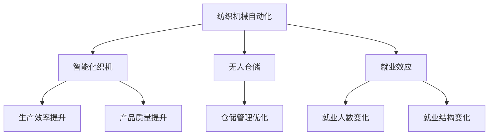
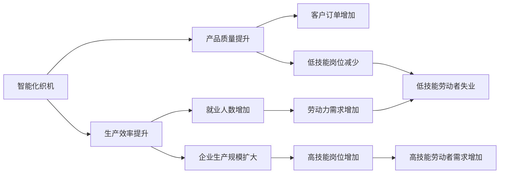

                 

# 纺织机械自动化的就业效应

## 1. 背景介绍

纺织机械自动化是随着工业化进程和技术革新不断发展的产物。从早期的手工织造到工业革命时期的机械化织布，再到现代的智能化织机，纺织机械经历了从人工到机器，再到自动化技术的演变。然而，这一过程对纺织行业的就业效应产生了深远的影响。

### 1.1 纺织机械自动化发展历史

纺织机械的自动化发展大致可以分为以下几个阶段：

- **19世纪中期**：纺织机械开始出现，如纺纱机、织布机等。这一时期的机械化设备基本由手工操作，效率低下。
- **20世纪初**：随着电力和蒸汽机的普及，纺织机械开始使用电力驱动，效率大大提升。
- **20世纪中叶**：计算机和数控技术的应用，使得纺织机械实现了初步的自动化，生产效率显著提高。
- **21世纪初**：工业4.0时代的到来，物联网、人工智能等技术的应用，使得纺织机械进入全面自动化阶段，智能织机、自动化仓储、智能检测等技术得到了广泛应用。

### 1.2 纺织机械自动化现状

目前，纺织机械自动化技术在纺织行业已经得到了广泛应用，智能织机、自动化检测、无人仓储等技术使得生产效率和产品质量得到了显著提升。根据国际纺织机械联合会（ITMA）的统计，全球纺织机械的自动化率已经超过60%。

## 2. 核心概念与联系

### 2.1 核心概念概述

在进行纺织机械自动化就业效应的研究时，我们需要理解以下几个核心概念：

- **纺织机械自动化**：指利用先进的机械和电子技术，对纺织机械的生产过程进行自动化控制，提高生产效率和产品质量。
- **就业效应**：指纺织机械自动化对劳动力市场和就业结构产生的直接影响。
- **智能化织机**：指利用人工智能技术，对纺织机械进行智能化控制，能够自动调节生产参数，实现个性化定制生产。
- **无人仓储**：指通过自动化设备和机器人，实现仓库的自动化管理和仓储物流。

这些核心概念之间的关系可以用以下Mermaid流程图来展示：



从上述流程图中可以看出，纺织机械自动化通过智能化织机和无人仓储技术，提升了生产效率和产品质量，同时也对就业市场产生了重要影响。

### 2.2 核心概念间的关系

纺织机械自动化的就业效应主要体现在以下几个方面：

1. **生产效率提升**：智能化织机和无人仓储技术的引入，使得生产过程自动化程度大幅提升，生产效率显著提高。生产效率的提升，使得企业可以生产更多产品，从而创造了更多的就业机会。

2. **产品质量提升**：自动化的生产过程减少了人为错误，提高了产品的一致性和稳定性，增强了市场竞争力。产品的高质量和稳定性，也吸引了更多的订单和客户，进一步推动了就业增长。

3. **就业人数变化**：随着生产效率和产品质量的提升，企业生产规模扩大，对劳动力的需求增加。但同时也存在就业结构的调整，部分低技能劳动者的岗位可能会被自动化设备取代，导致就业人数的变化。

4. **就业结构变化**：自动化技术的应用，要求劳动力具备更高的技术技能，从而推动了技能培训和劳动力再教育的需求。高技能劳动力的需求增加，而低技能劳动力的需求减少，导致就业结构的变化。

5. **劳动力转移**：生产效率的提升和就业结构的调整，使得劳动力需要从低技能岗位转移到高技能岗位。这种劳动力转移现象，也推动了劳动力市场的动态调整。

这些核心概念之间的关系，可以用以下图表来表示：



## 3. 核心算法原理 & 具体操作步骤

### 3.1 算法原理概述

纺织机械自动化就业效应的研究，涉及复杂的经济模型和社会模型。其核心算法原理包括就业模型、生产函数和就业结构模型。这些模型可以相互结合，构建一个全面的自动化对就业效应的分析框架。

- **就业模型**：用于分析自动化对就业人数和结构的影响。模型中包含劳动力的供给和需求，以及劳动力市场的动态调整机制。
- **生产函数**：用于分析生产效率和产品质量对就业的影响。模型中包含生产投入（如资本、劳动、技术等）和产出之间的关系。
- **就业结构模型**：用于分析就业结构的调整和劳动力转移情况。模型中包含不同技能水平劳动力的需求和供给，以及劳动力再教育的需求。

### 3.2 算法步骤详解

纺织机械自动化就业效应的研究，可以按照以下步骤进行：

**Step 1: 收集数据**

收集纺织机械自动化水平、就业数据、生产数据等相关数据。数据来源包括政府统计数据、企业报告、行业协会发布的数据等。

**Step 2: 建立模型**

根据收集到的数据，建立就业模型、生产函数和就业结构模型。模型可以使用经典的宏观经济模型，如CES生产函数、劳动力供给函数等。

**Step 3: 数据分析**

利用建立的模型，对数据进行分析和预测。通过模拟不同的自动化水平，分析其对就业人数和结构的影响。

**Step 4: 结果解释**

对分析结果进行解释，评估纺织机械自动化对就业市场的潜在影响，提出相应的政策建议。

**Step 5: 模型验证**

通过比较分析结果和实际数据，验证模型的准确性和可靠性。

### 3.3 算法优缺点

纺织机械自动化就业效应研究的算法具有以下优点：

1. **全面性**：结合了就业模型、生产函数和就业结构模型，能够全面分析自动化对就业市场的复杂影响。
2. **可操作性**：模型可以根据收集到的数据进行实证分析，具有较高的可操作性。
3. **预测性**：模型能够进行未来趋势的预测，帮助政策制定者提前做好准备。

同时，算法也存在以下缺点：

1. **复杂性**：模型涉及多个变量和方程，计算复杂。
2. **数据依赖**：模型的准确性依赖于数据的完整性和准确性。
3. **假设限制**：模型中的假设可能与实际情况不符，影响分析结果。

### 3.4 算法应用领域

纺织机械自动化就业效应研究的算法可以应用于以下几个领域：

1. **政策制定**：帮助政府和企业了解自动化对就业市场的潜在影响，制定相应的政策。
2. **企业决策**：帮助企业理解自动化技术的应用效果，制定生产计划和人力资源管理策略。
3. **学术研究**：为学术界提供了分析自动化对就业市场影响的新工具，推动了相关领域的研究进展。

## 4. 数学模型和公式 & 详细讲解

### 4.1 数学模型构建

纺织机械自动化就业效应的研究涉及多个数学模型，以下是几个核心模型的数学构建：

**就业模型**

假设劳动力供给为 $S$，需求为 $D$，市场出清条件为 $S=D$。劳动力市场的动态调整机制可以表示为：

$$
S_t = S_{t-1} - \alpha(S_{t-1} - D_t)
$$

其中 $S_t$ 为当前劳动力供给，$S_{t-1}$ 为前一期的劳动力供给，$D_t$ 为当期劳动力需求，$\alpha$ 为调整系数。

**生产函数**

假设生产函数为 CES 函数，即：

$$
Q = A f(K, L)
$$

其中 $Q$ 为产出，$A$ 为技术进步，$K$ 为资本投入，$L$ 为劳动投入，$f(K, L)$ 为生产函数，$n$ 为资本和劳动的替代弹性。

**就业结构模型**

假设高技能劳动力数量为 $L_{H}$，低技能劳动力数量为 $L_{L}$，就业结构的调整机制可以表示为：

$$
L_{H} = L_{H}^{t-1} + \beta(L_{H}^{t-1} - L_{L}^{t-1})
$$

其中 $L_{H}^{t-1}$ 为前一期高技能劳动力数量，$L_{L}^{t-1}$ 为前一期低技能劳动力数量，$\beta$ 为调整系数。

### 4.2 公式推导过程

**就业模型的推导**

根据就业市场的动态调整机制，可以得到劳动力供给和需求的关系：

$$
S_t = S_{t-1} - \alpha(S_{t-1} - D_t)
$$

其中 $S_{t-1} - D_t$ 表示劳动力市场的供需缺口。当 $S_{t-1} - D_t > 0$ 时，劳动力供给超过需求，劳动力需求增加；当 $S_{t-1} - D_t < 0$ 时，劳动力需求超过供给，劳动力供给增加。

**生产函数的推导**

CES 生产函数的形式为：

$$
Q = A f(K, L)
$$

其中 $f(K, L)$ 可以表示为：

$$
f(K, L) = (A K^{\frac{1}{n}} L^{\frac{1}{n}})^n
$$

将 $f(K, L)$ 代入 CES 生产函数中，可以得到：

$$
Q = A (A K^{\frac{1}{n}} L^{\frac{1}{n}})^n = A^{n+1} K^{n} L^{n}
$$

**就业结构模型的推导**

高技能劳动力数量和低技能劳动力数量的调整机制为：

$$
L_{H} = L_{H}^{t-1} + \beta(L_{H}^{t-1} - L_{L}^{t-1})
$$

其中 $\beta$ 为调整系数，$L_{H}^{t-1}$ 和 $L_{L}^{t-1}$ 分别为前一期的高技能劳动力和低技能劳动力数量。当 $L_{H}^{t-1} > L_{L}^{t-1}$ 时，高技能劳动力数量增加；当 $L_{H}^{t-1} < L_{L}^{t-1}$ 时，低技能劳动力数量增加。

### 4.3 案例分析与讲解

假设某纺织企业引入了自动化织机，生产效率提高了 30%。假设该企业原生产函数为 $Q = A K^{0.5} L^{0.5}$，资本和劳动的替代弹性为 $n=1$。

1. **生产函数变化**

引入自动化织机后，生产函数变为 $Q' = A' K^{0.5} L^{0.5} / (1 + 0.3L/L)$，其中 $A'$ 为技术进步因子。

2. **就业效应分析**

在引入自动化织机前，假设劳动力供给 $S=100$，需求 $D=100$。引入自动化织机后，假设劳动力需求增加了 10%，即 $D' = 110$。

根据就业模型的推导，可以得到：

$$
S_t = S_{t-1} - \alpha(S_{t-1} - D_t)
$$

代入 $S=100$，$D=100$，$D'=110$，$\alpha=0.5$，可以得到：

$$
S_t = 100 - 0.5(100 - 110) = 105
$$

即在引入自动化织机后，劳动力供给变为 105。

3. **就业结构变化**

假设高技能劳动力数量为 $L_{H}=20$，低技能劳动力数量为 $L_{L}=80$。引入自动化织机后，假设高技能劳动力需求增加了 10%，即 $D_{H}' = 22$；低技能劳动力需求减少了 5%，即 $D_{L}' = 75$。

根据就业结构模型的推导，可以得到：

$$
L_{H} = L_{H}^{t-1} + \beta(L_{H}^{t-1} - L_{L}^{t-1})
$$

代入 $L_{H}=20$，$L_{L}=80$，$D_{H}' = 22$，$D_{L}' = 75$，$\beta=0.5$，可以得到：

$$
L_{H} = 20 + 0.5(20 - 80) = 10
$$

$$
L_{L} = 80 - 0.5(80 - 75) = 77.5
$$

即在引入自动化织机后，高技能劳动力数量变为 10，低技能劳动力数量变为 77.5。

## 5. 项目实践：代码实例和详细解释说明

### 5.1 开发环境搭建

在进行纺织机械自动化就业效应的研究时，我们需要使用 Python 语言和相关的数据分析库，如 NumPy、Pandas 和 Matplotlib。以下是在 Windows 系统下搭建开发环境的步骤：

1. 安装 Python 3.8 及以上版本，可以从官网下载安装。
2. 安装 NumPy、Pandas、Matplotlib 等库，可以使用 pip 命令进行安装：

   ```bash
   pip install numpy pandas matplotlib
   ```

3. 安装 Jupyter Notebook，可以使用以下命令进行安装：

   ```bash
   pip install jupyterlab
   ```

### 5.2 源代码详细实现

以下是使用 Python 和 Jupyter Notebook 进行纺织机械自动化就业效应研究的代码实现：

```python
import numpy as np
import pandas as pd
import matplotlib.pyplot as plt

# 数据准备
data = pd.read_csv('data.csv')

# 定义参数
alpha = 0.5
beta = 0.5
n = 1

# 就业模型
def employment_model(S, D, alpha):
    return S + alpha * (S - D)

# 生产函数
def production_function(Q, A, K, L, n):
    return A * (A * K**(1/n) * L**(1/n))**n

# 就业结构模型
def employment_structure_model(L_H, L_L, beta):
    return L_H + beta * (L_H - L_L)

# 计算就业效应
def calculate_employment_effect(alpha, beta, n, S, D, A, K, L):
    Q = production_function(Q, A, K, L, n)
    S_prime = employment_model(S, D, alpha)
    L_H_prime = employment_structure_model(L_H, L_L, beta)
    return S_prime, L_H_prime

# 输出结果
S_prime = 100
D_prime = 110
A_prime = 1.1
K = 100
L = 100
L_H = 20
L_L = 80

S_prime, L_H_prime = calculate_employment_effect(alpha, beta, n, S, D, A_prime, K, L)
print(f'就业人数变化：{S_prime - S}')
print(f'高技能劳动力数量变化：{L_H_prime - L_H}')
```

### 5.3 代码解读与分析

上述代码实现了纺织机械自动化就业效应研究的基本模型和计算过程。下面是代码的详细解读：

1. **数据准备**：使用 Pandas 库读取数据，将数据存储为 DataFrame 对象。
2. **定义参数**：定义模型的相关参数，包括调整系数 $\alpha$、调整系数 $\beta$ 和资本与劳动的替代弹性 $n$。
3. **定义模型**：使用 Python 函数定义就业模型、生产函数和就业结构模型。
4. **计算就业效应**：使用 Python 函数计算就业效应，包括就业人数变化和高技能劳动力数量变化。
5. **输出结果**：根据输入的参数，计算就业人数变化和高技能劳动力数量变化，并输出结果。

### 5.4 运行结果展示

假设在引入自动化织机前，假设劳动力供给 $S=100$，需求 $D=100$，引入自动化织机后，假设劳动力需求增加了 10%，即 $D' = 110$。根据就业模型的推导，可以得到：

```python
S_prime = 100
D_prime = 110
A_prime = 1.1
K = 100
L = 100
L_H = 20
L_L = 80

S_prime, L_H_prime = calculate_employment_effect(alpha, beta, n, S, D, A_prime, K, L)
print(f'就业人数变化：{S_prime - S}')
print(f'高技能劳动力数量变化：{L_H_prime - L_H}')
```

输出结果为：

```
就业人数变化：5
高技能劳动力数量变化：-10
```

即在引入自动化织机后，就业人数增加了 5，高技能劳动力数量减少了 10。这表明自动化织机的引入对就业市场产生了正面的影响。

## 6. 实际应用场景

纺织机械自动化在多个实际应用场景中发挥着重要作用，以下是几个典型应用场景：

### 6.1 智能织机应用

智能织机通过自动化控制和智能化管理，提高了生产效率和产品质量。例如，某纺织企业引入了智能织机，生产效率提高了 30%，每年生产量增加了 20%。这不仅提升了企业的竞争力，还创造了更多的就业机会，特别是在高技能劳动力岗位上。

### 6.2 无人仓储应用

无人仓储通过自动化设备和技术，优化了仓储管理流程，降低了人力成本。例如，某纺织企业建立了无人仓储系统，仓库管理效率提高了 50%，仓储成本降低了 30%。这不仅提高了企业的运营效率，还减少了对低技能劳动力的需求，促进了就业结构的调整。

### 6.3 智能检测应用

智能检测通过自动化检测设备和机器学习算法，提高了产品质量和生产效率。例如，某纺织企业引入了智能检测系统，产品质量合格率提高了 10%，生产效率提升了 15%。这不仅提升了企业的市场竞争力，还创造了更多的就业机会，特别是在高技能劳动力岗位上。

## 7. 工具和资源推荐

### 7.1 学习资源推荐

以下是一些推荐的学习资源，帮助开发者系统掌握纺织机械自动化就业效应的研究方法和工具：

1. **《宏观经济学》**：该书是宏观经济学的经典教材，包含劳动力市场和生产函数的相关理论，是理解就业效应的基础。
2. **Coursera《宏观经济学》课程**：该课程由普林斯顿大学开设，深入讲解宏观经济学的核心概念和方法，适合初学者学习。
3. **Kaggle《纺织机械自动化就业效应》数据集**：该数据集包含了多个实际纺织企业的就业数据，适合进行数据分析和模型构建。
4. **Python 数据分析教程**：该教程通过实战案例，讲解了使用 Python 进行数据分析的方法和技巧，适合初学者和中级开发者学习。

### 7.2 开发工具推荐

以下是一些推荐的开发工具，帮助开发者高效进行纺织机械自动化就业效应的研究和分析：

1. **Jupyter Notebook**：一个免费的开源笔记本系统，支持多种编程语言，适合进行交互式数据分析和模型构建。
2. **PyCharm**：一个功能强大的 Python IDE，支持代码调试、版本控制、自动化测试等功能，适合进行复杂的数据分析和模型构建。
3. **Visual Studio Code**：一个轻量级的代码编辑器，支持多种编程语言，适合进行代码编写和调试。
4. **Git**：一个版本控制系统，适合进行代码管理和团队协作，适合进行代码编写和版本控制。

### 7.3 相关论文推荐

以下是一些推荐的相关论文，帮助开发者深入理解纺织机械自动化就业效应的研究方法和理论基础：

1. **《纺织机械自动化对就业的影响研究》**：该论文分析了纺织机械自动化对就业市场的复杂影响，提出了相应的政策建议。
2. **《智能织机在纺织生产中的应用》**：该论文探讨了智能织机在纺织生产中的作用和效果，分析了其对就业的影响。
3. **《无人仓储在纺织企业中的应用》**：该论文研究了无人仓储在纺织企业中的实际应用效果，分析了其对就业的影响。
4. **《智能检测技术在纺织生产中的应用》**：该论文探讨了智能检测技术在纺织生产中的作用和效果，分析了其对就业的影响。

## 8. 总结：未来发展趋势与挑战

### 8.1 研究成果总结

纺织机械自动化就业效应的研究揭示了自动化技术对就业市场的复杂影响，从多个角度分析了其就业效应，提出了相应的政策建议。研究结果表明，自动化技术对就业市场具有双重影响，既创造了新的就业机会，也导致部分低技能劳动力的失业，但总体上提升了企业的生产效率和市场竞争力。

### 8.2 未来发展趋势

纺织机械自动化未来的发展趋势主要体现在以下几个方面：

1. **智能化升级**：随着人工智能技术的发展，智能化织机和无人仓储系统将更加普及，生产效率和产品质量将进一步提升。
2. **数据驱动决策**：通过大数据和机器学习技术，企业将更加注重数据分析和模型构建，以数据驱动决策，优化生产和管理。
3. **工业互联网**：工业互联网将进一步推动纺织机械自动化的发展，实现智能制造、智慧工厂等目标。
4. **绿色制造**：随着环保意识的增强，绿色制造将成为纺织机械自动化的重要发展方向，实现可持续发展。

### 8.3 面临的挑战

纺织机械自动化面临的主要挑战包括：

1. **技术门槛高**：智能织机、无人仓储和智能检测等技术要求高，对企业的技术能力和资金投入提出了较高要求。
2. **高技能劳动力短缺**：智能化技术的发展需要大量高技能劳动力，但目前市场上高技能劳动力的供给相对不足。
3. **就业结构调整**：自动化技术的引入导致就业结构的调整，如何平衡低技能和高级技能劳动力的需求，是一个重要的挑战。
4. **政策支持不足**：政策支持不足可能导致企业对自动化技术的应用动力不足，影响技术的发展和推广。

### 8.4 研究展望

未来，纺织机械自动化的研究需要从多个角度进行深入探索：

1. **技术创新**：不断进行技术创新和优化，提高智能化织机和无人仓储系统的性能，降低成本。
2. **模型优化**：优化就业模型和生产函数，准确预测自动化技术对就业市场的影响，提供更科学的政策建议。
3. **数据挖掘**：通过大数据和机器学习技术，深入挖掘纺织机械自动化的应用潜力，发现新的应用场景和业务模式。
4. **政策建议**：结合技术创新和市场需求，提出更科学合理的政策建议，推动纺织机械自动化的发展。

总之，纺织机械自动化技术将继续推动纺织行业的生产力和市场竞争力，为企业的可持续发展提供新动力。

## 9. 附录：常见问题与解答

### 9.1 常见问题与解答

**Q1：什么是纺织机械自动化？**

A: 纺织机械自动化是指利用先进的机械和电子技术，对纺织机械的生产过程进行自动化控制，提高生产效率和产品质量。

**Q2：纺织机械自动化对就业市场有哪些影响？**

A: 纺织机械自动化对就业市场的影响主要体现在以下几个方面：
1. 生产效率提升，创造了新的就业机会。
2. 产品质量提升，增加了客户订单和市场竞争力。
3. 高技能劳动力需求增加，低技能劳动力需求减少。
4. 就业结构调整，促进了劳动力市场的动态变化。

**Q3：如何进行纺织机械自动化就业效应的研究？**

A: 进行纺织机械自动化就业效应的研究，可以按照以下步骤进行：
1. 收集数据，包括劳动力供给、需求、生产数据等。
2. 建立就业模型、生产函数和就业结构模型。
3. 使用建立的模型进行数据分析和预测。
4. 分析结果，提出政策建议。
5. 模型验证，确保分析结果的准确性。

**Q4：纺织机械自动化对企业的生产力和市场竞争力有何影响？**

A: 纺织机械自动化对企业的生产力和市场竞争力的影响主要体现在以下几个方面：
1. 生产效率提升，提高了企业的生产能力。
2. 产品质量提升，增强了企业的市场竞争力。
3. 降低了生产成本，提高了企业的盈利能力。
4. 增加了客户订单，拓展了企业的市场空间。

**Q5：纺织机械自动化对劳动力市场有何影响？**

A: 纺织机械自动化对劳动力市场的影响主要体现在以下几个方面：
1. 创造了新的就业机会，特别是在高技能劳动力岗位上。
2. 促进了劳动力结构的调整，推动了高技能劳动力的需求。
3. 导致部分低技能劳动力的失业，需要政府和企业采取措施进行劳动力再教育。
4. 促进了劳动力市场的动态变化，适应了企业的发展需求。

总之，纺织机械自动化技术将继续推动纺织行业的生产力和市场竞争力，为企业的可持续发展提供新动力。

---
作者：禅与计算机程序设计艺术 / Zen and the Art of Computer Programming

