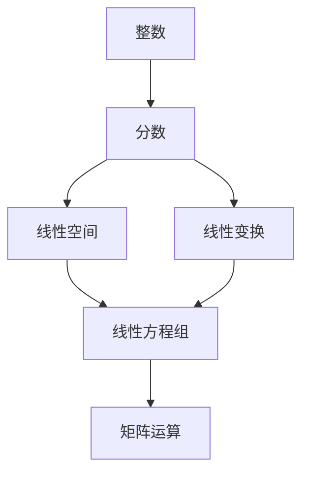

                 

# 线性代数导引：整数与分数

## 1. 背景介绍

在计算机科学和数学领域中，线性代数是一个基础而强大的工具，它不仅用于解决复杂的工程问题，也广泛应用于人工智能、数据科学、机器学习等领域。理解线性代数的核心概念——整数和分数，对于掌握这些高级应用至关重要。

本博文将深入探讨线性代数中的整数和分数，解释它们的重要性以及它们如何应用在实际问题中。我们将从定义、性质、到实际应用场景，逐步深入，让你在理解整数和分数的同时，也能掌握如何运用它们解决实际问题。

## 2. 核心概念与联系

### 2.1 核心概念概述

在数学中，整数和分数是线性代数的两个基础概念，它们不仅定义了线性空间的基本结构，还在矩阵运算、线性变换等高级概念中扮演关键角色。

- **整数**：任何没有分数或小数部分的数字。整数集合通常表示为 $\mathbb{Z}$，包括正整数、负整数和零。
- **分数**：表示两个整数之比的数。分数集合通常表示为 $\mathbb{Q}$，包括所有可以表示为两个整数之比的数。

这些基本概念虽然看似简单，但它们是线性代数的基石，是理解和解决许多高级问题的关键。

### 2.2 核心概念的联系

整数和分数之间的联系主要体现在以下几个方面：

1. **转换关系**：整数可以看作是分母为1的分数。即，任何整数 $n$ 都可以表示为分数 $\frac{n}{1}$。
2. **矩阵运算**：在矩阵运算中，整数和分数常作为矩阵的元素。例如，矩阵乘法、逆矩阵等运算都依赖于这些数值。
3. **线性方程组**：整数和分数在解决线性方程组中起着重要作用。线性方程组的系数和常数项通常使用整数表示，而解则可以表示为分数或整数。
4. **线性变换**：在矩阵表示的线性变换中，整数和分数可以表示向量的坐标和变换后的结果。

这些联系展示了整数和分数在线性代数中的广泛应用，它们是理解线性空间和线性变换的基础。

### 2.3 核心概念的整体架构

通过以下Mermaid流程图，可以更清晰地理解整数和分数在线性代数中的作用和关系：



这个流程图展示了整数和分数在线性代数中的主要应用场景，包括线性空间、线性变换、线性方程组和矩阵运算。

## 3. 核心算法原理 & 具体操作步骤

### 3.1 算法原理概述

整数和分数在线性代数中的应用广泛，其主要原理可以概括为以下几点：

1. **整数运算**：整数运算是线性代数中的基础，包括加、减、乘、除等基本运算。这些运算定义了整数集的基本结构，是理解更高级运算的基础。
2. **分数运算**：分数运算包括加、减、乘、除和乘方等。分数运算的规律可以推广到更一般的线性代数运算中。
3. **线性方程组**：线性方程组是线性代数中的核心问题之一。通过整数和分数表示系数和常数项，可以求解线性方程组。
4. **矩阵运算**：矩阵运算中的元素通常由整数和分数表示，矩阵乘法、逆矩阵等运算都依赖于这些数值。
5. **线性变换**：在矩阵表示的线性变换中，整数和分数可以表示向量的坐标和变换后的结果。

### 3.2 算法步骤详解

#### 3.2.1 整数运算

整数运算是线性代数中的基础，包括以下基本运算：

1. **加法**：整数加法定义在整数集中，满足交换律和结合律，即 $a+b=b+a$ 和 $a+(b+c)=(a+b)+c$。
2. **减法**：整数减法定义在整数集中，满足交换律和结合律，即 $a-b=-a+(-1)^b$。
3. **乘法**：整数乘法定义在整数集中，满足交换律和结合律，即 $a \cdot b = b \cdot a$ 和 $(a \cdot b) \cdot c = a \cdot (b \cdot c)$。
4. **除法**：整数除法定义在整数集中，满足交换律和结合律，即 $a \div b = a \cdot \frac{1}{b}$。

#### 3.2.2 分数运算

分数运算包括加、减、乘、除和乘方等，其基本运算规则如下：

1. **加法**：分数加法满足交换律和结合律，即 $\frac{a}{b} + \frac{c}{d} = \frac{ad+bc}{bd}$。
2. **减法**：分数减法满足交换律和结合律，即 $\frac{a}{b} - \frac{c}{d} = \frac{ad-bc}{bd}$。
3. **乘法**：分数乘法满足交换律和结合律，即 $\frac{a}{b} \cdot \frac{c}{d} = \frac{ac}{bd}$。
4. **除法**：分数除法定义为分数乘法的逆运算，即 $\frac{a}{b} \div \frac{c}{d} = \frac{ad}{bc}$。
5. **乘方**：分数乘方定义为分子和分母分别乘方，即 $\left(\frac{a}{b}\right)^n = \frac{a^n}{b^n}$。

#### 3.2.3 线性方程组求解

线性方程组的求解是线性代数中的一个重要问题，通常使用矩阵的列向量和解向量来表示。例如，以下线性方程组：

$$
\begin{cases}
a_1x_1 + a_2x_2 + a_3x_3 = b_1 \\
a_4x_1 + a_5x_2 + a_6x_3 = b_2
\end{cases}
$$

可以表示为矩阵形式：

$$
\begin{bmatrix}
a_1 & a_2 & a_3 \\
a_4 & a_5 & a_6
\end{bmatrix}
\begin{bmatrix}
x_1 \\
x_2 \\
x_3
\end{bmatrix}
=
\begin{bmatrix}
b_1 \\
b_2
\end{bmatrix}
$$

#### 3.2.4 矩阵运算

矩阵运算包括矩阵加、减、乘、逆等，其基本规则如下：

1. **矩阵加法**：满足交换律和结合律，即 $A+B=B+A$ 和 $(A+B)+C=A+(B+C)$。
2. **矩阵减法**：满足交换律和结合律，即 $A-B=B-A$ 和 $(A-B)-C=A-(B-C)$。
3. **矩阵乘法**：满足交换律和结合律，即 $AB=BA$ 和 $(AB)C=A(BC)$。
4. **矩阵逆**：对于可逆矩阵 $A$，其逆矩阵 $A^{-1}$ 满足 $AA^{-1}=A^{-1}A=I$，其中 $I$ 为单位矩阵。

### 3.3 算法优缺点

#### 3.3.1 整数运算的优点

整数运算的优点包括：

1. **计算简单**：整数运算的定义清晰，计算简单，易于理解和实现。
2. **结果明确**：整数运算的结果总是整数，不会产生小数或分数。
3. **适用性广**：整数运算适用于各种实际问题，如计数、统计等。

#### 3.3.2 整数运算的缺点

整数运算的缺点包括：

1. **精度限制**：整数运算的结果没有小数或分数的精度，无法表示分数和小数的细微差异。
2. **适用范围有限**：整数运算只适用于需要整数结果的问题，不适用于需要分数结果的问题。

#### 3.3.3 分数运算的优点

分数运算的优点包括：

1. **精度高**：分数运算可以表示小数和分数，结果精度高，适用于需要精确表示的问题。
2. **适用范围广**：分数运算适用于各种实际问题，包括分数和小数的问题。

#### 3.3.4 分数运算的缺点

分数运算的缺点包括：

1. **计算复杂**：分数运算的定义和计算相对复杂，理解和实现难度较大。
2. **结果不明确**：分数运算的结果通常是分数，不易理解其具体含义。

### 3.4 算法应用领域

整数和分数在数学和计算机科学中有着广泛的应用，以下是一些主要领域：

1. **数学**：整数和分数是数学中的基础概念，用于定义基本运算、线性方程组、矩阵运算等。
2. **计算机科学**：整数和分数在计算机科学中用于表示数据类型、存储数据、实现算法等。
3. **数据科学**：整数和分数用于数据处理、数据分析、机器学习等领域。
4. **人工智能**：整数和分数在人工智能中用于表示神经网络的权重、梯度、损失函数等。
5. **系统设计**：整数和分数在系统设计中用于表示资源、流量、时间等。

## 4. 数学模型和公式 & 详细讲解 & 举例说明

### 4.1 数学模型构建

整数和分数的数学模型可以表示为：

$$
x = \frac{a}{b}
$$

其中 $x$ 为分数，$a$ 和 $b$ 为整数，$b \neq 0$。整数和分数的运算规则如下：

1. **加法**：$\frac{a}{b} + \frac{c}{d} = \frac{ad+bc}{bd}$
2. **减法**：$\frac{a}{b} - \frac{c}{d} = \frac{ad-bc}{bd}$
3. **乘法**：$\frac{a}{b} \cdot \frac{c}{d} = \frac{ac}{bd}$
4. **除法**：$\frac{a}{b} \div \frac{c}{d} = \frac{ad}{bc}$
5. **乘方**：$\left(\frac{a}{b}\right)^n = \frac{a^n}{b^n}$

### 4.2 公式推导过程

以分数除法为例，推导其公式：

$$
\frac{a}{b} \div \frac{c}{d} = \frac{a}{b} \cdot \frac{d}{c} = \frac{ad}{bc}
$$

### 4.3 案例分析与讲解

#### 4.3.1 分数加法案例

给定两个分数 $\frac{1}{2}$ 和 $\frac{3}{4}$，计算它们的和：

$$
\frac{1}{2} + \frac{3}{4} = \frac{2}{4} + \frac{3}{4} = \frac{5}{4}
$$

#### 4.3.2 矩阵乘法案例

给定两个矩阵 $A=\begin{bmatrix}1 & 2 \\ 3 & 4\end{bmatrix}$ 和 $B=\begin{bmatrix}5 & 6 \\ 7 & 8\end{bmatrix}$，计算它们的乘积：

$$
AB = \begin{bmatrix}1 & 2 \\ 3 & 4\end{bmatrix} \cdot \begin{bmatrix}5 & 6 \\ 7 & 8\end{bmatrix} = \begin{bmatrix}19 & 22 \\ 43 & 50\end{bmatrix}
$$

## 5. 项目实践：代码实例和详细解释说明

### 5.1 开发环境搭建

在Python中使用Sympy库进行整数和分数的运算，需要安装Sympy库。

```bash
pip install sympy
```

### 5.2 源代码详细实现

下面是一个使用Sympy库计算分数加法的示例代码：

```python
from sympy import Rational

# 定义两个分数
fraction1 = Rational(1, 2)
fraction2 = Rational(3, 4)

# 计算分数加法
result = fraction1 + fraction2
print(result)  # 输出 5/4
```

### 5.3 代码解读与分析

该代码首先使用Sympy库中的`Rational`函数定义了两个分数 $\frac{1}{2}$ 和 $\frac{3}{4}$，然后计算它们的和，并输出结果 $\frac{5}{4}$。

### 5.4 运行结果展示

运行上述代码，输出结果为：

```
5/4
```

## 6. 实际应用场景

### 6.1 在计算机科学中的应用

整数和分数在计算机科学中有着广泛的应用，例如：

1. **数据类型**：整数和分数是Python等编程语言中的基本数据类型，用于表示数值。
2. **算法实现**：整数和分数在各种算法中都有重要应用，如排序、搜索、图论等。
3. **网络协议**：整数和分数用于表示IP地址、MAC地址等网络协议中的数值。

### 6.2 在数学中的应用

整数和分数在数学中有着重要地位，例如：

1. **基本运算**：整数和分数定义了数学中的基本运算，如加、减、乘、除、乘方等。
2. **代数表达式**：整数和分数用于表示代数表达式和方程，如 $x^2+2x+1=0$。
3. **几何问题**：整数和分数在几何问题中用于表示长度、面积、体积等。

### 6.3 在金融中的应用

整数和分数在金融领域有着重要应用，例如：

1. **货币单位**：整数和分数用于表示货币单位的数值，如$1.50$表示一美元五十美分。
2. **利率计算**：整数和分数用于计算利率和利息，如年利率$5\%$可以表示为$\frac{5}{100}$。
3. **财务报表**：整数和分数用于表示财务报表中的数值，如净利润$100,000$可以表示为$100,000/1$。

## 7. 工具和资源推荐

### 7.1 学习资源推荐

1. **《Linear Algebra and Its Applications》**：这是一本经典的线性代数教材，详细介绍了线性代数的核心概念和方法。
2. **《Introduction to Linear Algebra》**：这是一门由Khan Academy提供的线性代数课程，适合初学者学习。
3. **《Linear Algebra Done Right》**：这是一本深入浅出的线性代数教材，适合进一步深入学习。
4. **《Grokking Linear Algebra》**：这是一本面向初学者的线性代数教材，通过实际例子解释复杂的概念。

### 7.2 开发工具推荐

1. **Python**：Python是计算科学和数据分析的主流语言，Sympy库提供了强大的符号计算功能。
2. **R**：R是一种统计分析语言，提供了丰富的数学和统计函数。
3. **MATLAB**：MATLAB是一种科学计算工具，适用于各种数学和工程问题。

### 7.3 相关论文推荐

1. **《The Art of Computer Programming》**：这是一本经典的计算机科学教材，涵盖了算法、数据结构、编程技巧等多个方面。
2. **《Discrete Mathematics and Its Applications》**：这是一本介绍离散数学的教材，涵盖了图论、集合论、离散数学等多个领域。
3. **《Computational Linear Algebra》**：这是一本关于线性代数计算的教材，介绍了各种高效的计算方法。

## 8. 总结：未来发展趋势与挑战

### 8.1 研究成果总结

本文介绍了整数和分数在计算机科学和数学中的重要应用，探讨了它们的运算规则和数学模型。通过实际案例和代码实现，展示了整数和分数的实际应用。

### 8.2 未来发展趋势

1. **自动化**：未来，自动化技术将进一步发展，使整数和分数的运算更加智能化和自动化。
2. **融合AI**：人工智能技术将进一步融入整数和分数的计算中，提升计算效率和精度。
3. **大数据应用**：大数据技术的发展将推动整数和分数在更广泛领域中的应用，如金融、医疗、物流等。

### 8.3 面临的挑战

1. **精度问题**：在大数据和复杂系统中，整数和分数的精度问题需要进一步解决。
2. **计算效率**：在大规模数据处理中，整数和分数的计算效率需要进一步提高。
3. **算法复杂性**：复杂的整数和分数运算算法需要进一步优化和简化。

### 8.4 研究展望

未来，整数和分数的计算将与人工智能、大数据、自动化技术等相结合，推动其进一步发展。通过算法优化、自动化计算、多学科融合等方法，整数和分数的计算将更加高效、智能和广泛应用。

## 9. 附录：常见问题与解答

**Q1：整数和分数的区别是什么？**

A: 整数是没有分数或小数部分的数字，而分数是表示两个整数之比的数。整数可以看作是分母为1的分数。

**Q2：如何在Python中使用Sympy库进行整数和分数的运算？**

A: 使用Sympy库中的`Rational`函数定义分数，使用基本的数学运算符进行计算。例如，计算两个分数的和可以使用`+`运算符。

**Q3：整数和分数在计算机科学中有什么应用？**

A: 整数和分数在计算机科学中用于表示数据类型、实现算法、表示网络协议中的数值等。

**Q4：分数的乘法运算规则是什么？**

A: 分数乘法满足交换律和结合律，即 $\frac{a}{b} \cdot \frac{c}{d} = \frac{ac}{bd}$。

**Q5：线性方程组求解的步骤是什么？**

A: 线性方程组求解的步骤包括：
1. 将方程组表示为矩阵形式。
2. 计算矩阵的逆矩阵。
3. 将逆矩阵乘以常数向量得到解向量。

---

作者：禅与计算机程序设计艺术 / Zen and the Art of Computer Programming

