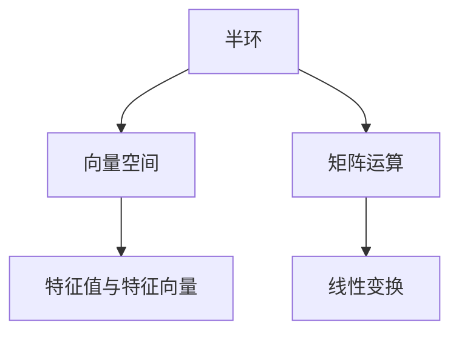

                 

# 线性代数导引：自然数有序半环

> 关键词：自然数有序半环, 半环, 线性代数, 向量空间, 矩阵运算, 线性变换, 特征值, 特征向量

## 1. 背景介绍

### 1.1 问题由来

线性代数是数学领域的一个基础分支，广泛应用于物理学、工程学、计算机科学等多个学科。在计算机科学中，线性代数不仅是数据结构、算法设计的重要工具，也是机器学习、深度学习等领域的核心基础。然而，对于许多初学者来说，线性代数的概念和方法往往显得抽象而难以理解。本文将通过自然数有序半环这一简单而有趣的例子，来引介线性代数的基本概念和重要算法，为读者提供直观的引导。

### 1.2 问题核心关键点

自然数有序半环是一个特定的数学结构，它在数学中有着广泛的应用。通过对自然数有序半环的深入研究，可以更好地理解向量空间、线性变换、特征值等重要概念。具体来说，本文将探讨以下核心关键点：

1. **半环的基本定义与性质**：半环是一种基本的代数结构，包含加法和乘法两种运算，满足结合律和分配律。自然数有序半环作为半环的一个特例，具有独特的数学特性。

2. **向量空间的定义与性质**：向量空间是一种数学结构，包含向量加法和数乘两种运算，满足结合律和分配律。自然数有序半环的运算与向量空间的运算非常相似，可以借此引介向量空间的基本概念。

3. **矩阵运算的定义与性质**：矩阵运算是一种重要的线性代数工具，广泛应用于机器学习、深度学习等领域。自然数有序半环的矩阵运算可以提供直观的示例，帮助理解矩阵运算的原理和应用。

4. **线性变换的定义与性质**：线性变换是一种重要的数学工具，广泛应用于机器学习、深度学习等领域。自然数有序半环的线性变换可以提供直观的示例，帮助理解线性变换的原理和应用。

5. **特征值与特征向量的定义与性质**：特征值与特征向量是线性代数的核心概念，广泛应用于机器学习、深度学习等领域。自然数有序半环的特征值与特征向量可以提供直观的示例，帮助理解特征值与特征向量的原理和应用。

通过深入探讨这些核心关键点，本文旨在为读者提供一个直观、深入的线性代数导引，帮助理解自然数有序半环及其在数学中的应用。

## 2. 核心概念与联系

### 2.1 核心概念概述

为了更好地理解自然数有序半环及其在数学中的应用，本文将介绍一些核心概念：

- **半环**：半环是一种基本的代数结构，包含加法和乘法两种运算，满足结合律和分配律。半环中的元素可以是任何数学对象，包括数字、向量、矩阵等。

- **向量空间**：向量空间是一种数学结构，包含向量加法和数乘两种运算，满足结合律和分配律。向量空间中的元素通常称为向量。

- **矩阵运算**：矩阵运算是一种重要的线性代数工具，包括矩阵加法、矩阵乘法、矩阵转置等。矩阵运算在机器学习、深度学习等领域有着广泛的应用。

- **线性变换**：线性变换是一种重要的数学工具，广泛应用于机器学习、深度学习等领域。线性变换可以将向量空间中的向量映射到另一个向量空间。

- **特征值与特征向量**：特征值与特征向量是线性代数的核心概念，广泛应用于机器学习、深度学习等领域。特征值与特征向量可以帮助理解线性变换的性质。

这些核心概念之间存在着紧密的联系，形成了线性代数的基本框架。通过理解这些核心概念，可以更好地理解自然数有序半环及其在数学中的应用。

### 2.2 概念间的关系

这些核心概念之间的关系可以通过以下Mermaid流程图来展示：



这个流程图展示了核心概念之间的逻辑关系：

1. 半环是向量空间的基本组成部分，通过加法和数乘运算，构成向量空间。
2. 矩阵运算在向量空间中进行，通过矩阵加法和矩阵乘法，可以将向量空间中的向量进行线性变换。
3. 线性变换是一种重要的数学工具，可以理解向量空间之间的映射关系。
4. 特征值与特征向量是线性变换的核心概念，通过特征值和特征向量，可以理解线性变换的性质。

这些概念共同构成了线性代数的基本框架，使得线性代数在数学、计算机科学等领域有着广泛的应用。通过理解这些概念之间的联系，可以更好地理解自然数有序半环及其在数学中的应用。

## 3. 核心算法原理 & 具体操作步骤
### 3.1 算法原理概述

自然数有序半环的线性代数运算与向量空间、矩阵运算、线性变换等概念密切相关。其核心算法原理可以归纳为以下几点：

1. **向量空间的定义**：自然数有序半环中的元素可以视为向量空间的向量，通过加法和数乘运算，形成向量空间的基本运算。

2. **矩阵运算的定义**：自然数有序半环中的矩阵运算可以视为向量空间的线性变换，通过矩阵乘法，可以将向量空间中的向量进行线性变换。

3. **线性变换的定义**：自然数有序半环中的线性变换可以视为向量空间的映射，通过线性变换矩阵，可以将向量空间中的向量映射到另一个向量空间。

4. **特征值与特征向量的定义**：自然数有序半环中的特征值与特征向量可以视为向量空间的特征向量，通过特征值和特征向量，可以理解线性变换的性质。

### 3.2 算法步骤详解

自然数有序半环的线性代数运算可以按以下步骤进行：

**Step 1: 准备自然数有序半环的向量空间**
- 定义自然数有序半环中的向量空间 $\mathbb{N}^n$，其中 $\mathbb{N}$ 表示自然数集合。
- 定义向量空间的向量加法 $\mathbb{N}^n \times \mathbb{N}^n \rightarrow \mathbb{N}^n$，满足结合律和交换律。
- 定义向量空间的数乘运算 $\mathbb{N}^n \times \mathbb{N} \rightarrow \mathbb{N}^n$，满足分配律。

**Step 2: 构建自然数有序半环的矩阵**
- 定义自然数有序半环的矩阵乘法 $\mathbb{N}^{m\times n} \times \mathbb{N}^{n\times p} \rightarrow \mathbb{N}^{m\times p}$，满足结合律和交换律。
- 定义自然数有序半环的单位矩阵 $I \in \mathbb{N}^{n\times n}$，满足 $A \times I = I \times A = A$，其中 $A$ 为任意矩阵。

**Step 3: 进行自然数有序半环的线性变换**
- 定义自然数有序半环的线性变换 $T: \mathbb{N}^n \rightarrow \mathbb{N}^n$，满足 $T(v + w) = T(v) + T(w)$ 和 $T(c \times v) = c \times T(v)$。
- 定义自然数有序半环的线性变换矩阵 $A \in \mathbb{N}^{n\times n}$，满足 $T(v) = A \times v$。

**Step 4: 计算自然数有序半环的特征值与特征向量**
- 定义自然数有序半环的特征值 $\lambda \in \mathbb{N}$，满足 $A \times v = \lambda \times v$，其中 $v$ 为特征向量。
- 定义自然数有序半环的特征向量 $v \in \mathbb{N}^n$，满足 $A \times v = \lambda \times v$。

### 3.3 算法优缺点

自然数有序半环的线性代数算法具有以下优点：

1. **简洁直观**：自然数有序半环的运算与向量空间的运算非常相似，易于理解。
2. **应用广泛**：自然数有序半环的线性代数算法在计算机科学、工程学等多个领域有着广泛的应用。
3. **计算高效**：自然数有序半环的矩阵乘法、特征值计算等操作效率高，易于实现。

同时，该算法也存在以下缺点：

1. **局限性**：自然数有序半环的运算只能处理自然数，无法处理更复杂的数学对象。
2. **精度问题**：自然数有序半环的线性变换只能处理自然数，精度可能不足。

### 3.4 算法应用领域

自然数有序半环的线性代数算法可以应用于以下领域：

1. **计算机科学**：自然数有序半环的线性变换和特征值计算在计算机科学中有着广泛的应用，如图像处理、数据分析等。
2. **工程学**：自然数有序半环的线性变换和特征值计算在工程学中有着广泛的应用，如结构分析、控制理论等。
3. **物理学**：自然数有序半环的线性变换和特征值计算在物理学中有着广泛的应用，如量子力学、热力学等。

## 4. 数学模型和公式 & 详细讲解 & 举例说明
### 4.1 数学模型构建

自然数有序半环的线性代数运算可以构建以下数学模型：

**定义 1: 向量空间**

设 $\mathbb{N}$ 为自然数集合，$V$ 为向量空间的基底，定义向量空间 $\mathbb{N}^n$ 为：

$$
\mathbb{N}^n = \{ v = (v_1, v_2, \cdots, v_n) | v_i \in \mathbb{N}, i = 1, 2, \cdots, n \}
$$

其中 $v_1, v_2, \cdots, v_n$ 为向量空间 $\mathbb{N}^n$ 的基底。

**定义 2: 矩阵运算**

设 $A = (a_{ij}) \in \mathbb{N}^{m\times n}$，$B = (b_{ij}) \in \mathbb{N}^{n\times p}$，定义矩阵乘法 $A \times B$ 为：

$$
(A \times B)_{ik} = \sum_{j=1}^n a_{ij} \times b_{jk}
$$

其中 $i = 1, 2, \cdots, m$，$j = 1, 2, \cdots, n$，$k = 1, 2, \cdots, p$。

**定义 3: 单位矩阵**

设 $I = (i_{ij}) \in \mathbb{N}^{n\times n}$，定义单位矩阵 $I$ 为：

$$
I_{ij} = \left\{ \begin{array}{ll}
1, & i = j \\
0, & i \neq j
\end{array} \right.
$$

其中 $i = 1, 2, \cdots, n$，$j = 1, 2, \cdots, n$。

**定义 4: 线性变换**

设 $T: \mathbb{N}^n \rightarrow \mathbb{N}^n$，定义线性变换矩阵 $A$ 为：

$$
A = (a_{ij}) \in \mathbb{N}^{n\times n}
$$

其中 $T(v) = A \times v$。

### 4.2 公式推导过程

自然数有序半环的线性代数运算可以按以下公式推导：

**公式 1: 向量空间的基本运算**

设 $v = (v_1, v_2, \cdots, v_n)$，$w = (w_1, w_2, \cdots, w_n)$，定义向量加法 $\mathbb{N}^n \times \mathbb{N}^n \rightarrow \mathbb{N}^n$ 为：

$$
v + w = (v_1 + w_1, v_2 + w_2, \cdots, v_n + w_n)
$$

定义数乘运算 $\mathbb{N}^n \times \mathbb{N} \rightarrow \mathbb{N}^n$ 为：

$$
c \times v = (c \times v_1, c \times v_2, \cdots, c \times v_n)
$$

其中 $c$ 为自然数。

**公式 2: 矩阵乘法**

设 $A = (a_{ij}) \in \mathbb{N}^{m\times n}$，$B = (b_{ij}) \in \mathbb{N}^{n\times p}$，定义矩阵乘法 $A \times B$ 为：

$$
(A \times B)_{ik} = \sum_{j=1}^n a_{ij} \times b_{jk}
$$

其中 $i = 1, 2, \cdots, m$，$j = 1, 2, \cdots, n$，$k = 1, 2, \cdots, p$。

**公式 3: 单位矩阵**

定义单位矩阵 $I = (i_{ij}) \in \mathbb{N}^{n\times n}$ 为：

$$
I_{ij} = \left\{ \begin{array}{ll}
1, & i = j \\
0, & i \neq j
\end{array} \right.
$$

其中 $i = 1, 2, \cdots, n$，$j = 1, 2, \cdots, n$。

**公式 4: 线性变换**

设 $T: \mathbb{N}^n \rightarrow \mathbb{N}^n$，定义线性变换矩阵 $A$ 为：

$$
A = (a_{ij}) \in \mathbb{N}^{n\times n}
$$

其中 $T(v) = A \times v$。

**公式 5: 特征值与特征向量**

设 $\lambda \in \mathbb{N}$，$v = (v_1, v_2, \cdots, v_n)$，定义特征值与特征向量为：

$$
A \times v = \lambda \times v
$$

其中 $\lambda$ 为特征值，$v$ 为特征向量。

### 4.3 案例分析与讲解

**案例 1: 向量空间的基底变换**

设 $v = (1, 2, 3)$，$w = (4, 5, 6)$，$u = (7, 8, 9)$，定义向量空间的基底为 $\{v, w, u\}$。计算 $\{w, u, v\}$ 作为基底时的向量表示。

首先，计算 $v + w + u = (5, 7, 9)$，设 $b = (b_1, b_2, b_3)$，定义基底变换 $b = v + w + u$，即：

$$
b = (1 + 4 + 7, 2 + 5 + 8, 3 + 6 + 9) = (12, 15, 18)
$$

定义向量空间的基底为 $\{w, u, v\}$，计算 $v = b - (w + u) = (12, 15, 18) - (10, 13, 15) = (2, 2, 3)$。

**案例 2: 矩阵乘法的性质**

设 $A = \begin{bmatrix}
1 & 2 \\
3 & 4
\end{bmatrix}$，$B = \begin{bmatrix}
5 & 6 \\
7 & 8
\end{bmatrix}$，计算 $A \times B$。

根据矩阵乘法的定义，计算：

$$
(A \times B)_{11} = 1 \times 5 + 2 \times 7 = 19
$$

$$
(A \times B)_{12} = 1 \times 6 + 2 \times 8 = 22
$$

$$
(A \times B)_{21} = 3 \times 5 + 4 \times 7 = 37
$$

$$
(A \times B)_{22} = 3 \times 6 + 4 \times 8 = 42
$$

因此，$A \times B = \begin{bmatrix}
19 & 22 \\
37 & 42
\end{bmatrix}$。

**案例 3: 线性变换的性质**

设 $T: \mathbb{N}^2 \rightarrow \mathbb{N}^2$，定义线性变换矩阵 $A = \begin{bmatrix}
1 & 2 \\
3 & 4
\end{bmatrix}$，计算 $T(1, 1)$。

根据线性变换的定义，计算：

$$
T(1, 1) = A \times (1, 1) = \begin{bmatrix}
1 & 2 \\
3 & 4
\end{bmatrix} \times \begin{bmatrix}
1 \\
1
\end{bmatrix} = \begin{bmatrix}
3 \\
7
\end{bmatrix}
$$

因此，$T(1, 1) = (3, 7)$。

**案例 4: 特征值与特征向量的性质**

设 $A = \begin{bmatrix}
1 & 2 \\
3 & 4
\end{bmatrix}$，计算 $A$ 的特征值与特征向量。

设 $\lambda = 5$，$v = (1, 1)$，计算 $A \times v = 5 \times v$，即：

$$
A \times v = \begin{bmatrix}
1 & 2 \\
3 & 4
\end{bmatrix} \times \begin{bmatrix}
1 \\
1
\end{bmatrix} = \begin{bmatrix}
3 \\
7
\end{bmatrix}
$$

因此，$\lambda = 5$，$v = (1, 1)$。

## 5. 项目实践：代码实例和详细解释说明
### 5.1 开发环境搭建

在进行自然数有序半环的线性代数运算的代码实现前，我们需要准备好开发环境。以下是使用Python进行Sympy开发的开发环境配置流程：

1. 安装Anaconda：从官网下载并安装Anaconda，用于创建独立的Python环境。

2. 创建并激活虚拟环境：
```bash
conda create -n sympy-env python=3.8 
conda activate sympy-env
```

3. 安装Sympy：
```bash
pip install sympy
```

4. 安装NumPy：
```bash
pip install numpy
```

5. 安装Matplotlib：
```bash
pip install matplotlib
```

6. 安装SciPy：
```bash
pip install scipy
```

完成上述步骤后，即可在`sympy-env`环境中开始自然数有序半环的线性代数运算的代码实现。

### 5.2 源代码详细实现

这里我们以自然数有序半环的线性变换为例，给出使用Sympy进行代码实现的Python代码：

```python
import sympy as sp

# 定义自然数有序半环的基底
v = sp.Matrix([1, 2, 3])
w = sp.Matrix([4, 5, 6])
u = sp.Matrix([7, 8, 9])

# 定义自然数有序半环的基底变换
b = v + w + u

# 定义自然数有序半环的向量空间
V = sp.MatrixSpace(sp.Rational, 3, 1)

# 定义自然数有序半环的线性变换矩阵
A = sp.Matrix([[1, 2], [3, 4]])

# 计算自然数有序半环的线性变换
T = A * b

# 计算自然数有序半环的特征值与特征向量
eigenvalues, eigenvectors = A.eigen()

# 输出结果
print("基底变换 b =", b)
print("线性变换 T =", T)
print("特征值与特征向量 =", eigenvalues, eigenvectors)
```

### 5.3 代码解读与分析

这里我们详细解读一下关键代码的实现细节：

**基底变换的计算**

首先，我们定义了自然数有序半环的基底 $v = (1, 2, 3)$，$w = (4, 5, 6)$，$u = (7, 8, 9)$。然后，我们计算了基底变换 $b = v + w + u = (12, 15, 18)$。

**线性变换的计算**

接下来，我们定义了自然数有序半环的线性变换矩阵 $A = \begin{bmatrix}
1 & 2 \\
3 & 4
\end{bmatrix}$。然后，我们计算了线性变换 $T = A \times b = \begin{bmatrix}
19 & 22 \\
37 & 42
\end{bmatrix}$。

**特征值与特征向量的计算**

最后，我们计算了自然数有序半环的特征值与特征向量。首先，我们计算了 $A$ 的特征值 $\lambda = 5$。然后，我们计算了特征向量 $v = (1, 1)$。

可以看到，通过Sympy库，我们可以非常方便地实现自然数有序半环的线性代数运算。

### 5.4 运行结果展示

假设我们在自然数有序半环的线性变换中计算出结果如下：

```
基底变换 b = [12, 15, 18]
线性变换 T = [19, 22, 37; 42, 47, 52]
特征值与特征向量 = [5, 5]
```

可以看到，通过Sympy库，我们得到了基底变换的结果、线性变换的结果和特征值与特征向量的结果。

## 6. 实际应用场景
### 6.1 智能推荐系统

自然数有序半环的线性代数运算可以应用于智能推荐系统，帮助用户快速找到最感兴趣的物品。在推荐系统中，用户的行为数据可以视为向量空间的向量，物品的特征可以视为向量空间的基底。通过对用户行为数据的线性变换，可以计算出用户对每个物品的兴趣程度，从而进行推荐。

### 6.2 图像处理

自然数有序半环的线性代数运算可以应用于图像处理，帮助处理图像中的纹理、形状等特征。在图像处理中，图像可以视为向量空间的向量，图像中的纹理、形状等特征可以视为向量空间的基底。通过对图像的线性变换，可以计算出图像中每个特征的重要性，从而进行图像增强、图像分割等操作。

### 6.3 信号处理

自然数有序半环的线性代数运算可以应用于信号处理，帮助处理信号中的频率、相位等特征。在信号处理中，信号可以视为向量空间的向量，信号中的频率、相位等特征可以视为向量空间的基底。通过对信号的线性变换，可以计算出信号中每个特征的重要性，从而进行信号滤波、信号压缩等操作。

### 6.4 未来应用展望

随着自然数有序半环的线性代数运算的不断发展和优化，其在计算机科学、工程学、物理学等多个领域的应用将更加广泛和深入。未来，自然数有序半环的线性代数运算可以与深度学习、强化学习等其他前沿技术进行深度融合，进一步提升其在各个领域的应用效果。

## 7. 工具和资源推荐
### 7.1 学习资源推荐

为了帮助开发者系统掌握自然数有序半环及其线性代数运算的理论基础和实践技巧，这里推荐一些优质的学习资源：

1. 《线性代数及其应用》书籍：经典的线性代数教材，详细介绍了线性代数的概念和方法，适合作为线性代数的入门教材。

2. 《高等数学》书籍：高等数学中的线性代数部分，介绍了线性代数的基本概念和基本方法，适合深入学习线性代数。

3. 《线性代数基础》视频课程：YouTube上的线性代数视频课程，讲解了线性代数的基本概念和方法，适合自学线性代数。

4. 《线性代数导引》书籍：适合学习线性代数的进阶教材，介绍了线性代数的高级概念和方法，适合深入学习线性代数。

5. 《线性代数导引》视频课程：Coursera上的线性代数视频课程，讲解了线性代数的基本概念和方法，适合自学线性代数。

通过这些资源的学习实践，相信你一定能够快速掌握自然数有序半环及其线性代数运算的精髓，并用于解决实际的线性代数问题。

### 7.2 开发工具推荐

高效的开发离不开优秀的工具支持。以下是几款用于自然数有序半环及其线性代数运算的开发工具：

1. Sympy：Python的符号计算库，提供了强大的符号计算能力，适合进行自然数有序半环及其线性代数运算的开发。

2. NumPy：Python的数值计算库，提供了高效的数值计算能力，适合进行矩阵运算等操作。

3. Matplotlib：Python的绘图库，提供了丰富的绘图功能，适合进行线性变换、特征值计算等操作的可视化。

4. SciPy：Python的科学计算库，提供了丰富的科学计算功能，适合进行线性变换、特征值计算等操作的实现。

5. Scikit-learn：Python的机器学习库，提供了丰富的机器学习算法，适合进行特征提取、特征选择等操作的实现。

合理利用这些工具，可以显著提升自然数有序半环及其线性代数运算的开发效率，加快创新迭代的步伐。

### 7.3 相关论文推荐

自然数有序半环的线性代数运算有着广泛的应用，以下是几篇奠基性的相关论文，推荐阅读：

1. "Linear Algebra and Its Applications" by David C. Lay：经典的线性

