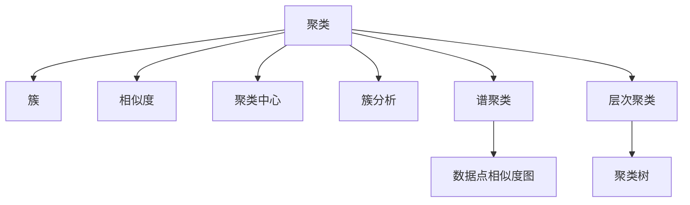
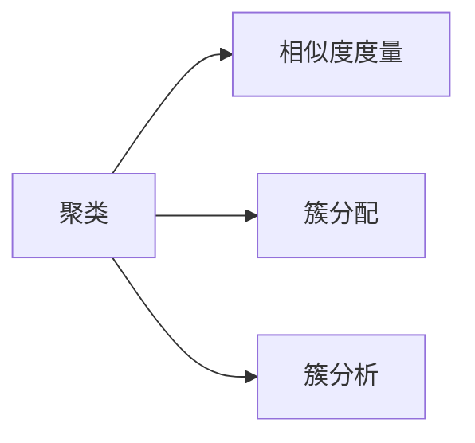
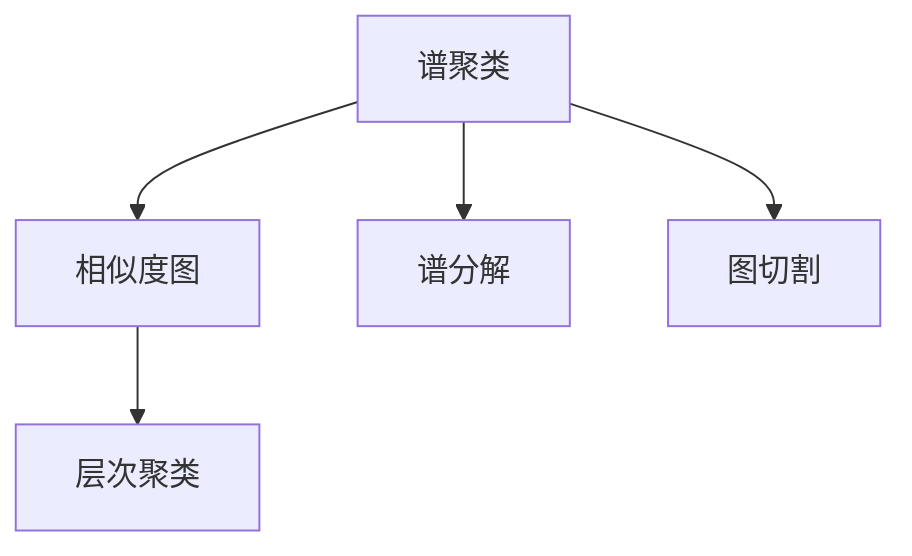
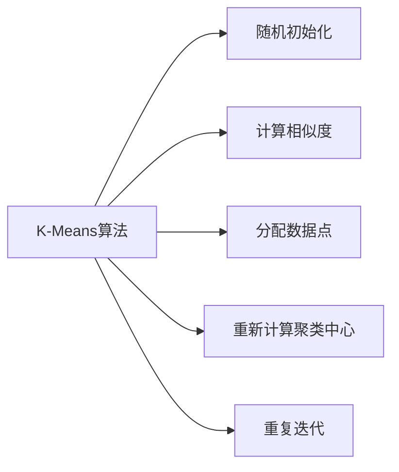
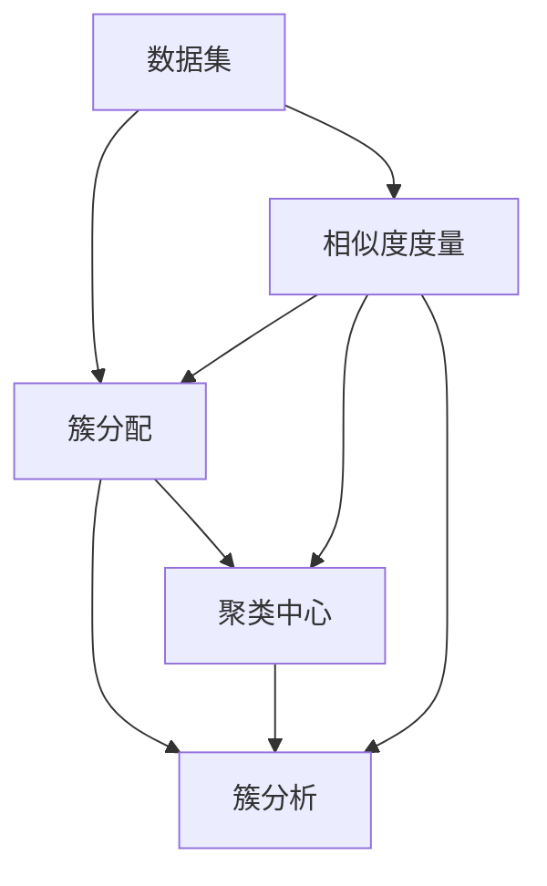

                 

# 聚类算法(Clustering Algorithms) - 原理与代码实例讲解

> 关键词：聚类算法,无监督学习,机器学习,相似度度量,簇分析,谱聚类,层次聚类,K-Means算法

## 1. 背景介绍

聚类分析是一种无监督学习方法，其目标是从未标记的数据中发现数据集的内在结构和模式。聚类算法广泛应用于数据挖掘、图像处理、模式识别、推荐系统等领域，能够揭示数据集的群集特征，发现数据集中的内在结构。

### 1.1 问题由来
聚类问题通常被描述为一个数据点集合，每个点表示为 $d$ 维向量。聚类算法的目标是将数据集分成若干个不相交的组，每个组内的数据点相似度较高，组间的数据点相似度较低。聚类问题需要解决如下三个关键问题：

- 如何度量数据点之间的相似度？
- 如何将数据点分配到不同的组中？
- 如何评估聚类效果？

### 1.2 问题核心关键点
聚类算法是一种无监督学习方法，能够自动发现数据集中的内在结构。与监督学习方法不同，聚类算法不需要人工标注数据。其核心思想是通过度量数据点之间的相似度，将数据点分成不同的组，使得同一组内的数据点相似度较高，不同组之间的数据点相似度较低。

聚类算法的关键在于选择合适的相似度度量方法，设计合适的簇分配策略，以及评估聚类效果的指标。常用的聚类算法包括K-Means、层次聚类、谱聚类、DBSCAN等。

聚类算法广泛应用于各种领域，如市场细分、图像分割、客户分类、基因分析等。在工业界，聚类算法被广泛用于推荐系统、广告投放、客户关系管理等领域，能够发现用户的兴趣偏好、提升广告投放效果、优化客户细分策略等。

## 2. 核心概念与联系

### 2.1 核心概念概述

为了更好地理解聚类算法，本节将介绍几个密切相关的核心概念：

- **聚类**：指将数据点分成不同的组，使得同一组内的数据点相似度较高，不同组之间的数据点相似度较低。
- **簇**：指一组数据点，其内部数据点相似度较高，而与外部数据点相似度较低。
- **相似度**：指两个数据点之间的距离或相似性，常用余弦相似度、欧式距离、曼哈顿距离等。
- **聚类中心**：指簇的代表点，通常为簇内所有数据点的均值、中位数或众数。
- **簇分析**：指对聚类结果进行解释和分析，包括簇的个数、簇的特征、簇之间的关系等。
- **谱聚类**：一种基于图论的聚类算法，通过构建数据点之间的相似度图，进行谱分解和图切割，得到聚类结果。
- **层次聚类**：通过自下而上的方式，将数据点逐步合并成簇，形成一棵聚类树。

这些核心概念之间的逻辑关系可以通过以下Mermaid流程图来展示：



这个流程图展示了几何聚类、基于相似度的聚类方法、基于图论的聚类方法、基于层次的聚类方法之间的关系：

1. 聚类是从数据集中识别出不同的簇。
2. 簇是聚类算法的基本单位，每个簇内数据点相似度较高。
3. 相似度是聚类算法中衡量数据点之间距离或相似性的指标。
4. 聚类中心是簇的代表点，通常通过计算簇内所有数据点的均值、中位数或众数得到。
5. 簇分析是对聚类结果的解释和分析，包括簇的个数、特征和关系等。
6. 谱聚类通过构建数据点之间的相似度图，进行谱分解和图切割，得到聚类结果。
7. 层次聚类通过自下而上的方式，将数据点逐步合并成簇，形成一棵聚类树。

这些核心概念共同构成了聚类算法的完整生态系统，使其能够广泛应用于各种数据集和场景中。

### 2.2 概念间的关系

这些核心概念之间存在着紧密的联系，形成了聚类算法的完整生态系统。下面我通过几个Mermaid流程图来展示这些概念之间的关系。

#### 2.2.1 聚类算法的学习范式



这个流程图展示了聚类算法的基本流程，包括相似度度量、簇分配和簇分析三个关键步骤。

#### 2.2.2 谱聚类与层次聚类的关系



这个流程图展示了谱聚类和层次聚类之间的关系。谱聚类通过构建数据点之间的相似度图，进行谱分解和图切割，得到聚类结果。层次聚类通过自下而上的方式，将数据点逐步合并成簇，形成一棵聚类树。

#### 2.2.3 K-Means算法的执行步骤



这个流程图展示了K-Means算法的执行步骤，包括随机初始化、计算相似度、分配数据点、重新计算聚类中心和重复迭代等关键步骤。

### 2.3 核心概念的整体架构

最后，我们用一个综合的流程图来展示这些核心概念在聚类算法中的整体架构：



这个综合流程图展示了从数据集到聚类中心的整个过程，包括了相似度度量、簇分配和簇分析三个关键步骤。通过这些步骤，最终得到了聚类结果，并对结果进行了分析。

## 3. 核心算法原理 & 具体操作步骤
### 3.1 算法原理概述

聚类算法是一种无监督学习方法，其目标是通过度量数据点之间的相似度，将数据点分成不同的组。聚类算法通常包括以下几个关键步骤：

1. 选择相似度度量方法：常用的相似度度量方法包括欧式距离、曼哈顿距离、余弦相似度等。
2. 选择簇分配策略：常用的簇分配策略包括K-Means、层次聚类、谱聚类等。
3. 计算相似度：根据相似度度量方法计算数据点之间的相似度。
4. 分配数据点：将数据点分配到不同的簇中。
5. 更新聚类中心：根据分配结果重新计算聚类中心的坐标。
6. 重复迭代：重复执行分配和更新聚类中心的步骤，直到收敛。

### 3.2 算法步骤详解

下面以K-Means算法为例，详细介绍其具体执行步骤：

1. **随机初始化聚类中心**：随机选择 $k$ 个数据点作为初始聚类中心，其中 $k$ 表示簇的个数。
2. **计算相似度**：计算每个数据点与每个聚类中心的相似度，通常使用欧式距离或余弦相似度。
3. **分配数据点**：将每个数据点分配到与其最相似的那个聚类中心所代表的簇中。
4. **重新计算聚类中心**：根据当前分配结果，重新计算每个簇的聚类中心坐标。
5. **重复迭代**：重复执行第2-4步，直到收敛或达到预设迭代次数。

K-Means算法的基本流程可以用以下伪代码表示：

```
初始化 k 个聚类中心
重复以下步骤 until 收敛或迭代次数达到预设值：
    for 每个数据点 p do
        计算 p 到每个聚类中心的距离
        将 p 分配到距离最近的聚类中心所在的簇
    for 每个簇 C do
        计算 C 内所有数据点的均值或中位数，作为新的聚类中心
return 聚类结果
```

### 3.3 算法优缺点

聚类算法具有以下优点：

- **无需标注数据**：聚类算法是一种无监督学习方法，不需要人工标注数据，适用于大数据集。
- **易于实现**：聚类算法通常具有简单的执行步骤，易于实现和调试。
- **灵活性高**：聚类算法可以根据具体问题选择合适的相似度度量方法和簇分配策略，适应各种数据集。

聚类算法也存在一些缺点：

- **需要预先指定簇的个数**：聚类算法的性能依赖于簇的个数，需要人工指定，可能导致结果不稳定。
- **计算复杂度高**：聚类算法的计算复杂度与数据集大小和簇的个数有关，需要消耗大量计算资源。
- **对噪声敏感**：聚类算法对噪声数据和异常点敏感，可能导致簇的个数和形状不准确。

### 3.4 算法应用领域

聚类算法广泛应用于各种领域，如市场细分、图像处理、模式识别、推荐系统等。以下是几个常见的应用场景：

- **市场细分**：通过聚类分析，将客户分成不同的细分市场，根据不同市场的需求进行个性化营销。
- **图像分割**：将图像分成不同的区域，每个区域具有相似的颜色或纹理特征，应用于医学图像分析、物体检测等领域。
- **模式识别**：通过聚类算法识别出数据集中的模式，应用于语音识别、文本分类等领域。
- **推荐系统**：通过聚类分析用户兴趣，推荐个性化的商品或服务，提升用户体验。
- **客户分类**：通过聚类算法对客户进行分类，识别出高价值客户和潜在客户，制定精准的营销策略。

除了这些场景外，聚类算法还被应用于社交网络分析、基因分析、网络安全等领域，为各种实际应用提供了有力的支持。

## 4. 数学模型和公式 & 详细讲解 & 举例说明
### 4.1 数学模型构建

假设有一个数据集 $X$，其中 $n$ 个数据点 $x_i \in \mathbb{R}^d$。聚类算法的目标是将其分成 $k$ 个簇 $C_1, C_2, ..., C_k$，使得同一簇内的数据点相似度较高，不同簇之间的数据点相似度较低。

聚类算法的数学模型通常可以表示为：

$$
\min_{C_1, C_2, ..., C_k} \sum_{i=1}^n \min_{j=1}^k d(x_i, c_j)
$$

其中 $d$ 为相似度度量方法，$x_i$ 为数据点，$c_j$ 为聚类中心，目标是最小化每个数据点到最近的聚类中心的距离。

### 4.2 公式推导过程

以K-Means算法为例，推导其数学模型和计算公式。

K-Means算法的基本思想是通过最小化每个数据点到最近的聚类中心的距离，将数据集分成 $k$ 个簇。设每个聚类中心的坐标为 $c_j$，数据点 $x_i$ 到聚类中心 $c_j$ 的距离为 $d(x_i, c_j)$，则K-Means算法的目标函数可以表示为：

$$
\min_{C_1, C_2, ..., C_k} \sum_{i=1}^n \min_{j=1}^k d(x_i, c_j)
$$

根据K-Means算法的执行步骤，可以将其目标函数拆分为两个部分：

1. **簇分配**：最小化每个数据点到最近的聚类中心的距离，即：

$$
\sum_{i=1}^n \min_{j=1}^k d(x_i, c_j)
$$

2. **簇中心更新**：最小化簇内所有数据点的距离，即：

$$
\sum_{j=1}^k \sum_{i=1}^n d(x_i, c_j)
$$

因此，K-Means算法的目标函数可以表示为：

$$
\min_{C_1, C_2, ..., C_k} \sum_{i=1}^n \min_{j=1}^k d(x_i, c_j) + \sum_{j=1}^k \sum_{i=1}^n d(x_i, c_j)
$$

### 4.3 案例分析与讲解

下面以一个具体的例子来说明K-Means算法的执行过程。

假设有一个包含3个簇的数据集，数据集中的数据点如下图所示：

```
  +---+---+---+---+---+
  |   |   |   |   |   |
  |   |   |   |   |   |
  |   |   |   |   |   |
  |   |   |   |   |   |
  +---+---+---+---+---+
  |   |   |   |   |   |
  |   |   |   |   |   |
  |   |   |   |   |   |
  |   |   |   |   |   |
  +---+---+---+---+---+
  |   |   |   |   |   |
  |   |   |   |   |   |
  |   |   |   |   |   |
  |   |   |   |   |   |
  +---+---+---+---+---+
```

初始时，随机选择3个聚类中心 $c_1, c_2, c_3$，假设它们的坐标为：

```
c_1 = (2, 2)
c_2 = (5, 2)
c_3 = (2, 5)
```

每个数据点 $x_i$ 到每个聚类中心的距离如下图所示：

```
  +---+---+---+---+---+
  |   |   |   |   |   |
  |   |   |   |   |   |
  |   |   |   |   |   |
  |   |   |   |   |   |
  +---+---+---+---+---+
  |   |   |   |   |   |
  |   |   |   |   |   |
  |   |   |   |   |   |
  |   |   |   |   |   |
  +---+---+---+---+---+
  |   |   |   |   |   |
  |   |   |   |   |   |
  |   |   |   |   |   |
  |   |   |   |   |   |
  +---+---+---+---+---+
```

根据上述距离，将数据点分配到最近的聚类中心所在的簇中，结果如下图所示：

```
  +---+---+---+---+---+
  |   |   |   |   |   |
  |   |   |   |   |   |
  |   |   |   |   |   |
  |   |   |   |   |   |
  +---+---+---+---+---+
  |   |   |   |   |   |
  |   |   |   |   |   |
  |   |   |   |   |   |
  |   |   |   |   |   |
  +---+---+---+---+---+
  |   |   |   |   |   |
  |   |   |   |   |   |
  |   |   |   |   |   |
  |   |   |   |   |   |
  +---+---+---+---+---+
```

根据当前分配结果，重新计算每个簇的聚类中心坐标，结果如下图所示：

```
c_1 = (3, 2.5)
c_2 = (4.5, 2)
c_3 = (2, 4)
```

重复执行簇分配和聚类中心更新步骤，直到收敛或达到预设迭代次数。最终得到的聚类结果如下图所示：

```
  +---+---+---+---+---+
  |   |   |   |   |   |
  |   |   |   |   |   |
  |   |   |   |   |   |
  |   |   |   |   |   |
  +---+---+---+---+---+
  |   |   |   |   |   |
  |   |   |   |   |   |
  |   |   |   |   |   |
  |   |   |   |   |   |
  +---+---+---+---+---+
  |   |   |   |   |   |
  |   |   |   |   |   |
  |   |   |   |   |   |
  |   |   |   |   |   |
  +---+---+---+---+---+
```

## 5. 项目实践：代码实例和详细解释说明
### 5.1 开发环境搭建

在进行聚类算法实践前，我们需要准备好开发环境。以下是使用Python进行Scikit-learn开发的环境配置流程：

1. 安装Anaconda：从官网下载并安装Anaconda，用于创建独立的Python环境。

2. 创建并激活虚拟环境：
```bash
conda create -n sklearn-env python=3.8 
conda activate sklearn-env
```

3. 安装Scikit-learn：
```bash
pip install scikit-learn
```

4. 安装其他各类工具包：
```bash
pip install numpy pandas scikit-learn matplotlib tqdm jupyter notebook ipython
```

完成上述步骤后，即可在`sklearn-env`环境中开始聚类算法实践。

### 5.2 源代码详细实现

下面我们以K-Means算法为例，给出使用Scikit-learn进行聚类算法的PyTorch代码实现。

```python
from sklearn.cluster import KMeans
import numpy as np
import matplotlib.pyplot as plt

# 生成随机数据集
np.random.seed(42)
X = np.random.randn(100, 2)

# 初始化K-Means模型
kmeans = KMeans(n_clusters=3)

# 训练模型
kmeans.fit(X)

# 可视化聚类结果
plt.scatter(X[:, 0], X[:, 1], c=kmeans.labels_)
plt.scatter(kmeans.cluster_centers_[:, 0], kmeans.cluster_centers_[:, 1], s=200, c='red')
plt.show()
```

### 5.3 代码解读与分析

让我们再详细解读一下关键代码的实现细节：

**KMeans类**：
- `KMeans`类是Scikit-learn库中的K-Means算法实现。
- `n_clusters`参数指定簇的个数。

**训练模型**：
- `fit`方法训练模型，输入数据集X。

**可视化聚类结果**：
- `scatter`方法将数据集可视化，其中`c`参数指定数据点的颜色。
- `cluster_centers_`属性获取簇的中心坐标。

**运行结果展示**：
- 可视化结果展示了聚类后数据点的分布和簇的中心坐标。

可以看到，Scikit-learn库提供了简单易用的接口，使得K-Means算法的实现变得非常直观。开发者可以进一步扩展代码，进行参数调整、模型评估等操作，以满足实际需求。

## 6. 实际应用场景
### 6.1 客户细分

聚类算法在客户细分领域具有广泛的应用。通过聚类分析，可以将客户分成不同的细分市场，根据不同市场的需求进行个性化营销。

具体而言，可以收集客户的交易记录、浏览记录、社交媒体数据等，构建客户特征向量。将客户特征向量作为数据集输入聚类算法，得到客户的聚类结果。根据聚类结果，制定针对性的营销策略，提升客户满意度和忠诚度。

### 6.2 图像分割

聚类算法在图像分割领域也具有重要应用。通过聚类分析，可以将图像分成不同的区域，每个区域具有相似的颜色或纹理特征。

具体而言，可以采集医学影像、卫星图像等高分辨率图像，将图像像素作为数据集输入聚类算法。得到图像的聚类结果后，可以对不同区域进行标注和分析，应用于医学图像分析、物体检测等领域。

### 6.3 市场分析

聚类算法在市场分析领域也有广泛的应用。通过聚类分析，可以识别出不同市场细分，发现市场中的潜在机会和风险。

具体而言，可以收集市场销售数据、消费者数据、竞争对手数据等，构建市场特征向量。将市场特征向量作为数据集输入聚类算法，得到市场的聚类结果。根据聚类结果，制定市场进入策略、优化产品定价等，提升市场竞争力。

### 6.4 未来应用展望

随着聚类算法的不断发展，其在更多领域将得到应用，为各种实际应用提供支持。

在智慧医疗领域，聚类算法可以应用于疾病分类、基因分析等领域，辅助医生诊断和治疗。

在智能城市治理中，聚类算法可以应用于交通流量分析、环境监测等领域，提高城市管理的自动化和智能化水平。

在金融风控中，聚类算法可以应用于信用评估、欺诈检测等领域，提升风险控制能力。

此外，在智能制造、物流配送、电商推荐等领域，聚类算法也有广泛的应用前景，为各行各业带来智能化升级。

## 7. 工具和资源推荐
### 7.1 学习资源推荐

为了帮助开发者系统掌握聚类算法的理论基础和实践技巧，这里推荐一些优质的学习资源：

1. 《机器学习实战》：通过实际案例，深入浅出地介绍了聚类算法的基本原理和实现方法。

2. Coursera《机器学习》课程：由斯坦福大学Andrew Ng教授主讲的经典课程，涵盖聚类算法等机器学习基本概念和算法。

3. 《Python数据科学手册》：详细介绍了聚类算法在实际数据科学项目中的应用，包括K-Means、谱聚类等。

4. Kaggle：机器学习竞赛平台，提供丰富的聚类算法竞赛和数据集，供开发者学习和实践。

5. GitHub开源项目：在GitHub上Star、Fork数最多的聚类算法相关项目，往往代表了该技术领域的发展趋势和最佳实践，值得去学习和贡献。

通过对这些资源的学习实践，相信你一定能够快速掌握聚类算法的精髓，并用于解决实际的NLP问题。

### 7.2 开发工具推荐

高效的开发离不开优秀的工具支持。以下是几款用于聚类算法开发的常用工具：

1. Scikit-learn：Python中的经典机器学习库，提供了丰富的聚类算法实现，如K-Means、DBSCAN等。

2. TensorFlow：由Google主导开发的开源深度学习框架，生产部署方便，适合大规模工程应用。

3. PyTorch：基于Python的开源深度学习框架，灵活动态的计算图，适合快速迭代研究。

4. Weights & Biases：模型训练的实验跟踪工具，可以记录和可视化模型训练过程中的各项指标，方便对比和调优。

5. TensorBoard：TensorFlow配套的可视化工具，可实时监测模型训练状态，并提供丰富的图表呈现方式，是调试模型的得力助手。

6. Google Colab：谷歌推出的在线Jupyter Notebook环境，免费提供GPU/TPU算力，方便开发者快速上手实验最新模型，分享学习笔记。

合理利用这些工具，可以显著提升聚类算法的开发效率，加快创新迭代的步伐。

### 7.3 相关论文推荐

聚类算法的研究源于学界的持续研究。以下是几篇奠基性的相关论文，推荐阅读：

1. J. MacQueen：《A method for clustering and the analysis of individual differences in multivariate data》：提出了K-Means算法的经典形式。

2. T. Kanungo等：《An algorithm for approximate cluster analysis》：提出了DBSCAN算法的思想，适用于任意形状的簇。

3. P. Broker等：《Clustering by passing messages between data points》：提出了谱聚类算法的基本思想。

4. D. Forsyth等：《Improved iterative algorithm for weighted assignment problems》：提出了谱聚类算法的改进方法。

5. M. Ng等：《On spectral clustering: Analysis and an algorithm》：进一步优化了谱聚类算法，适用于大规模数据集。

这些论文代表了大数据集和聚类算法的进展，有助于读者深入理解聚类算法的基本原理和实现方法。

除上述资源外，还有一些值得关注的前沿资源，帮助开发者紧跟聚类算法的最新进展，例如：

1. arXiv论文预印本：人工智能领域最新研究成果的发布平台，包括大量尚未发表的前沿工作，学习前沿技术的必读资源。

2. 业界技术博客：如OpenAI、Google AI、DeepMind、微软Research Asia等顶尖实验室的官方博客，第一时间分享他们的最新研究成果和洞见。

3. 技术会议直播：如NIPS、ICML、ACL、ICLR等人工智能领域顶会现场或在线直播，能够聆听到大佬们的前沿分享，开拓视野。

4. GitHub热门项目：在GitHub上Star、Fork数最多的聚类算法相关项目，往往代表了该技术领域的发展趋势和

