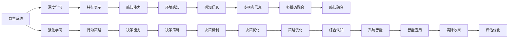
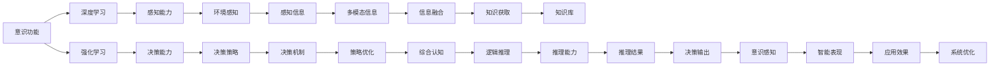
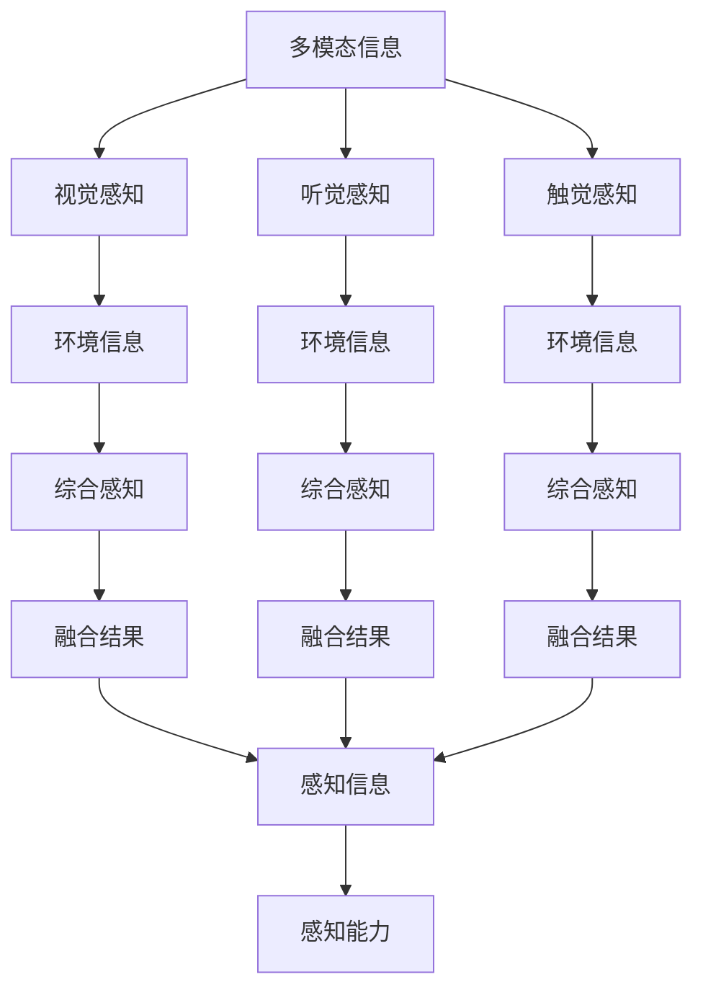
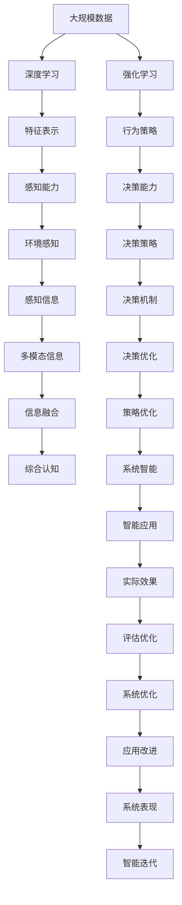

                 

# 自主系统与意识功能的互动

> 关键词：自主系统,意识功能,神经网络,深度学习,强化学习,模型集成,多模态融合

## 1. 背景介绍

### 1.1 问题由来

随着人工智能技术的不断进步，自主系统（Autonomous Systems）已经广泛应用于各个领域，如自动驾驶、机器人、智能推荐系统等。然而，这些系统在复杂环境中表现出的鲁棒性、适应性和安全性等问题，仍然面临挑战。意识功能（Consciousness Functionality）作为自主系统的一个重要组成部分，旨在使系统具备类似人类的感知、理解和决策能力，提升其自主性和智能水平。

### 1.2 问题核心关键点

意识功能的核心在于实现自主系统的高级智能，使得系统能够理解环境、规划行动并做出合理的决策。这包括对环境感知、知识获取、逻辑推理、情感识别、意识感知等多维度的认知功能。目前，主要采用以下技术来实现这些功能：

- 深度学习：通过大规模神经网络，学习特征表示和模式识别，以提升系统的感知能力。
- 强化学习：通过与环境的互动，不断优化系统的行为策略，以提升系统的适应性和决策能力。
- 模型集成：将多种模型融合，实现知识的互补和增强，提升系统的综合认知能力。
- 多模态融合：结合视觉、听觉、触觉等多种感知信息，实现对环境的全面感知，提升系统的鲁棒性和智能水平。

这些技术的应用，使得自主系统在多个领域实现了显著的突破。然而，在追求高水平智能的同时，也带来了新的挑战，如系统的安全性、可解释性、伦理道德等问题。

### 1.3 问题研究意义

研究自主系统与意识功能的互动，对于提升系统的自主性和智能水平，解决其在复杂环境中的挑战，具有重要意义：

1. 提高系统鲁棒性：通过深度学习和强化学习，提升系统对环境的感知和适应能力，增强系统在不同条件下的鲁棒性。
2. 增强决策能力：通过多模态融合和模型集成，提升系统决策的准确性和鲁棒性，使其在复杂环境中能够做出合理的决策。
3. 提升系统可解释性：通过意识感知和知识获取，使系统具备一定的可解释性，帮助人类理解系统的决策过程和结果。
4. 保证系统安全性：通过伦理道德约束和规范，确保系统的行为符合社会价值和道德规范，避免可能带来的风险。
5. 推动技术创新：意识功能的实现，需要跨学科的合作和技术融合，推动人工智能领域的新一轮技术创新。

## 2. 核心概念与联系

### 2.1 核心概念概述

为更好地理解自主系统与意识功能的互动，本节将介绍几个密切相关的核心概念：

- 自主系统（Autonomous Systems）：通过感知、学习、决策等机制，能够自主完成特定任务的系统。如自动驾驶汽车、智能机器人等。
- 意识功能（Consciousness Functionality）：使自主系统具备类似人类的感知、理解、推理、情感等高级认知能力，提升其自主性和智能水平。
- 深度学习（Deep Learning）：通过多层神经网络结构，学习输入与输出之间的复杂映射关系，实现特征表示和模式识别。
- 强化学习（Reinforcement Learning）：通过与环境的互动，不断优化行为策略，以提升系统的适应性和决策能力。
- 模型集成（Model Integration）：将多种模型融合，实现知识的互补和增强，提升系统的综合认知能力。
- 多模态融合（Multi-modal Fusion）：结合视觉、听觉、触觉等多种感知信息，实现对环境的全面感知，提升系统的鲁棒性和智能水平。

这些核心概念之间的逻辑关系可以通过以下Mermaid流程图来展示：

```mermaid
graph TB
    A[自主系统] --> B[深度学习]
    A --> C[强化学习]
    A --> D[模型集成]
    A --> E[多模态融合]
    B --> F[特征表示]
    C --> G[行为策略]
    D --> H[综合认知]
    E --> I[全面感知]
    F --> J[感知能力]
    G --> K[决策能力]
    H --> L[高级智能]
    I --> M[鲁棒性]
    J --> N[环境感知]
    K --> O[行为策略]
    L --> P[智能水平]
    M --> Q[适应性]
    N --> R[感知信息]
    O --> S[决策策略]
    P --> T[智能表现]
    Q --> U[鲁棒性]
    R --> V[多模态信息]
    S --> W[决策机制]
    T --> X[智能应用]
    U --> Y[环境适应]
    V --> Z[感知融合]
    W --> $[决策优化]
    X --> [实际应用]
    Y --> [环境变化]
    Z --> [信息融合]
    $ --> [策略优化]
```

这个流程图展示了大语言模型微调过程中各个核心概念的关系和作用：

1. 自主系统通过深度学习和强化学习，提升感知和决策能力。
2. 模型集成和多模态融合，增强系统的综合认知能力和鲁棒性。
3. 意识功能的实现，使得系统具备高级智能和可解释性。
4. 系统通过与环境的互动，不断优化行为策略，提升适应性和安全性。
5. 系统的智能表现，可以通过实际应用场景得到验证和优化。

### 2.2 概念间的关系

这些核心概念之间存在着紧密的联系，形成了自主系统与意识功能的完整生态系统。下面我们通过几个Mermaid流程图来展示这些概念之间的关系。

#### 2.2.1 自主系统的学习范式



这个流程图展示了自主系统的学习过程：

1. 通过深度学习和强化学习，提升系统的感知和决策能力。
2. 模型集成和感知融合，增强系统的综合认知能力。
3. 通过多模态融合和决策优化，提升系统的智能应用效果。

#### 2.2.2 意识功能的实现路径



这个流程图展示了意识功能的实现过程：

1. 通过深度学习和强化学习，提升系统的感知和决策能力。
2. 模型集成和多模态融合，增强系统的感知和决策能力。
3. 通过逻辑推理和知识获取，提升系统的高级智能和可解释性。
4. 通过决策输出和智能表现，验证和优化系统的智能效果。

#### 2.2.3 多模态融合与感知能力的提升



这个流程图展示了多模态融合的实现过程：

1. 通过视觉、听觉、触觉等感知信息的融合，提升系统的全面感知能力。
2. 综合感知信息，生成更全面的环境信息。
3. 感知能力提升，使得系统具备更强的环境适应能力。

### 2.3 核心概念的整体架构

最后，我们用一个综合的流程图来展示这些核心概念在大语言模型微调过程中的整体架构：



这个综合流程图展示了从深度学习到系统智能，再到应用改进的完整过程。自主系统通过深度学习和强化学习，提升感知和决策能力。模型集成和多模态融合，增强系统的综合认知能力。意识功能的实现，使得系统具备高级智能和可解释性。系统通过与环境的互动，不断优化行为策略，提升适应性和安全性。系统的智能表现，可以通过实际应用场景得到验证和优化。

## 3. 核心算法原理 & 具体操作步骤
### 3.1 算法原理概述

自主系统与意识功能的互动，本质上是一个多模态学习、感知、推理、决策的过程。其核心思想是通过深度学习、强化学习等技术，使系统具备类似人类的感知、理解和决策能力，从而实现自主系统的高级智能。

形式化地，假设自主系统 $S$ 包含多个感知模块 $F_1, F_2, \cdots, F_n$ 和决策模块 $D$。给定环境 $E$ 和任务 $T$，系统通过感知模块 $F$ 获取环境信息 $I_F = (I_{F_1}, I_{F_2}, \cdots, I_{F_n})$，并通过决策模块 $D$ 进行决策 $A = D(I_F, T)$。系统通过不断优化感知模块和决策模块，提升系统的感知能力和决策效果，实现系统的高级智能。

### 3.2 算法步骤详解

自主系统与意识功能的互动，一般包括以下几个关键步骤：

**Step 1: 准备感知模块和决策模块**

- 选择合适的感知模块 $F$，如视觉感知、听觉感知、触觉感知等。
- 选择适合的决策模块 $D$，如决策树、神经网络、强化学习策略等。
- 确定各个模块之间的交互方式，如共享数据、级联处理等。

**Step 2: 收集训练数据**

- 准备环境数据集 $D_E$，用于训练感知模块 $F$。
- 准备任务数据集 $D_T$，用于训练决策模块 $D$。
- 准备多模态数据集 $D_M$，用于训练多模态融合模块。

**Step 3: 设计损失函数**

- 选择合适的损失函数 $L$，如均方误差、交叉熵等，衡量模型的预测输出与真实标签之间的差异。
- 设计综合损失函数 $L_{total} = \sum_{i=1}^n \lambda_i L_i + \alpha L_D$，其中 $\lambda_i$ 为感知模块 $F_i$ 的权重，$L_D$ 为决策模块 $D$ 的损失函数。

**Step 4: 训练感知模块**

- 使用环境数据集 $D_E$ 训练感知模块 $F$，最小化感知模块的损失函数 $L_F$。
- 使用多模态数据集 $D_M$ 进行感知融合，提升系统的全面感知能力。

**Step 5: 训练决策模块**

- 使用任务数据集 $D_T$ 训练决策模块 $D$，最小化决策模块的损失函数 $L_D$。
- 使用决策模块 $D$ 的输出作为反馈，优化感知模块 $F$ 的训练过程。

**Step 6: 集成感知和决策模块**

- 将训练好的感知模块 $F$ 和决策模块 $D$ 进行集成，形成完整的自主系统 $S$。
- 通过多模态融合模块，将视觉、听觉、触觉等多种感知信息融合，提升系统的感知能力。
- 通过逻辑推理模块，将感知信息与知识库相结合，进行高级推理和决策。

**Step 7: 系统优化与部署**

- 通过实际应用场景，验证和优化系统的智能表现。
- 根据实际需求，不断调整感知模块和决策模块的参数，提升系统性能。
- 将系统部署到实际应用场景中，进行实时决策和反馈优化。

以上是自主系统与意识功能的互动的一般流程。在实际应用中，还需要针对具体任务的特点，对各环节进行优化设计，如改进训练目标函数，引入更多的正则化技术，搜索最优的超参数组合等，以进一步提升系统性能。

### 3.3 算法优缺点

自主系统与意识功能的互动，具有以下优点：

1. 高效感知：通过多模态融合，使系统具备更强的感知能力，能够更好地适应复杂环境。
2. 灵活决策：通过逻辑推理和决策模块的优化，提升系统的决策效果，使其在复杂环境中能够做出合理的决策。
3. 鲁棒性高：通过深度学习和强化学习，提升系统的鲁棒性，使其在多种条件下的表现更加稳定。
4. 可解释性强：通过意识感知和知识获取，使系统具备一定的可解释性，帮助人类理解系统的决策过程和结果。

同时，该方法也存在一定的局限性：

1. 数据需求大：需要大量的环境数据和任务数据进行训练，数据获取成本较高。
2. 模型复杂：涉及多个感知模块和决策模块，模型结构复杂，训练和推理效率较低。
3. 优化难度高：感知模块和决策模块的优化需要跨学科的知识和技能，难度较大。
4. 伦理道德问题：系统行为可能涉及伦理道德问题，如隐私保护、决策透明度等，需要严格规范。

尽管存在这些局限性，但就目前而言，自主系统与意识功能的互动方法仍是大语言模型微调应用的主流范式。未来相关研究的重点在于如何进一步降低数据需求，提高模型的推理效率，同时兼顾可解释性和伦理安全性等因素。

### 3.4 算法应用领域

自主系统与意识功能的互动技术，在多个领域得到了广泛应用，例如：

- 自动驾驶：通过感知视觉、激光雷达等信息，结合强化学习策略，实现车辆自主导航。
- 智能机器人：通过视觉、听觉、触觉等多种感知信息的融合，使机器人具备自主导航、交互感知、任务执行等功能。
- 智能推荐系统：通过分析用户行为数据，结合多模态信息，实现个性化推荐。
- 医疗诊断：通过图像、文本等多模态信息的融合，辅助医生进行疾病诊断和治疗决策。
- 金融分析：通过分析市场数据，结合逻辑推理，进行股票预测和风险评估。
- 安全监控：通过视频、音频等多模态信息的融合，实现实时异常检测和行为分析。

除了上述这些经典应用外，自主系统与意识功能的互动技术还创新性地应用于更多场景中，如可控文本生成、智能客服、智能家居等，为人工智能技术带来了全新的突破。随着技术的发展和应用的深化，相信自主系统与意识功能的互动技术将在更多领域得到应用，为社会生产和生活带来深刻的变革。

## 4. 数学模型和公式 & 详细讲解 & 举例说明
### 4.1 数学模型构建

本节将使用数学语言对自主系统与意识功能的互动过程进行更加严格的刻画。

假设自主系统 $S$ 包含感知模块 $F$ 和决策模块 $D$，环境 $E$ 包含多种感知信息 $I_E = (I_{E_1}, I_{E_2}, \cdots, I_{E_n})$，任务 $T$ 包含多个目标 $T = (T_1, T_2, \cdots, T_n)$。设感知模块 $F$ 和决策模块 $D$ 的输出分别为 $\hat{I}_F = F(I_E)$ 和 $\hat{A}_D = D(\hat{I}_F, T)$，系统的最终输出为 $A = \hat{A}_D$。

定义系统 $S$ 在环境 $E$ 和任务 $T$ 上的损失函数为 $L(S, E, T) = \mathbb{E}_{(I_E, T)}[L(D(\hat{I}_F, T))]$，其中 $\mathbb{E}_{(I_E, T)}$ 表示对环境 $E$ 和任务 $T$ 的期望。

系统 $S$ 的目标是最小化上述损失函数，即找到最优参数 $\theta$：

$$
\theta^* = \mathop{\arg\min}_{\theta} L(S, E, T)
$$

在实践中，我们通常使用基于梯度的优化算法（如SGD、Adam等）来近似求解上述最优化问题。设 $\eta$ 为学习率，$\lambda$ 为正则化系数，则参数的更新公式为：

$$
\theta \leftarrow \theta - \eta \nabla_{\theta}L(S, E, T) - \eta\lambda\theta
$$

其中 $\nabla_{\theta}L(S, E, T)$ 为损失函数对参数 $\theta$ 的梯度，可通过反向传播算法高效计算。

### 4.2 公式推导过程

以下我们以自动驾驶为例，推导感知模块和决策模块的损失函数及其梯度的计算公式。

假设系统 $S$ 通过感知模块 $F$ 获取视觉信息 $I_{E_1}$，并通过决策模块 $D$ 进行路径规划和导航，最终的输出为导航方向 $A = D(\hat{I}_F, T)$。设定损失函数 $L_D$ 为决策模块 $D$ 的损失函数，定义为：

$$
L_D = \sum_{i=1}^N \lambda_i \mathbb{E}_{(I_{E_1})}[\ell(D(\hat{I}_F, T_i), y_i)]
$$

其中 $\ell$ 为损失函数，$T_i$ 为第 $i$ 个任务的标签，$y_i$ 为真实标签。$N$ 为任务的总数，$\lambda_i$ 为第 $i$ 个任务的权重。

根据链式法则，损失函数对感知模块 $F$ 的梯度为：

$$
\frac{\partial L_D}{\partial \theta_F} = -\eta \sum_{i=1}^N \frac{\partial L_D}{\partial \hat{A}_D} \frac{\partial \hat{A}_D}{\partial \hat{I}_F} \frac{\partial \hat{I}_F}{\partial \theta_F}
$$

其中 $\hat{A}_D = D(\hat{I}_F, T)$，$\hat{I}_F = F(I_{E_1})$。通过反向传播算法，可以得到 $\frac{\partial L_D}{\partial \hat{A}_D}$ 和 $\frac{\partial \hat{A}_D}{\partial \hat{I}_F}$。

通过反向传播算法，也可以计算 $\frac{\partial L_D}{\partial \hat{I}_F}$。根据感知模块 $F$ 的参数 $\theta_F$，可以通过自动微分技术计算 $\frac{\partial \hat{I}_F}{\partial \theta_F}$。

在得到感知模块和决策模块的梯度后，即可带入参数更新公式，完成系统的训练过程。重复上述过程直至收敛，最终得到适应环境任务的最优系统参数 $\theta^*$。

### 4.3 案例分析与讲解

**案例：自动驾驶路径规划**

假设自动驾驶车辆通过视觉传感器获取道路信息 $I_{E_1}$，并通过决策模块 $D$ 进行路径规划和导航，最终的输出为导航方向 $A = D(\hat{I}_F, T)$。设环境 $E$ 为实际道路环境，任务 $T$ 为路径规划和导航。

**数据准备**：
- 准备包含道路信息 $I_{E_1}$ 和导航方向 $A$ 的标注数据集 $D = \{(x_i, y_i)\}_{i=1}^N$，其中 $x_i$ 为视觉信息，$y_i$ 为导航方向标签。
- 准备包含各种道路环境 $E$ 的任务数据集 $D_T$，用于训练决策模块 $D$。

**模型设计**：
- 选择适当的感知模块 $F$，如卷积神经网络（CNN）或视觉注意力模型。
- 选择适当的决策模块 $D$，如深度强化学习（Deep RL）或规则推理（Rule-based Reasoning）。

**训练过程**：
- 使用标注数据集 $D$ 训练感知模块 $F$，最小化感知模块的损失函数 $L_F$。
- 使用任务数据集 $D_T$ 训练决策模块 $D$，最小化决策模块的损失函数 $L_D$。
- 将训练好的感知模块 $F$ 和决策模块 $D$ 进行集成，形成完整的自主系统 $S$。
- 通过多模态融合模块，将视觉、激光雷达等多种感知信息融合，提升系统的感知能力。
- 通过逻辑推理模块，将感知信息与知识库相结合，进行高级推理和决策。

**系统优化**：
- 通过实际道路环境 $E$，验证和优化系统的智能表现。
- 根据实际需求，不断调整感知模块和决策模块的参数，提升系统性能。
- 将系统部署到实际道路环境中，进行实时路径规划和导航。

## 5. 项目实践：代码实例和详细解释说明
### 5.1 开发环境搭建

在进行自动驾驶路径规划项目实践前，我们需要准备好开发环境。以下是使用Python进行TensorFlow开发的环境配置流程：

1. 安装Anaconda：从官网下载并安装Anaconda，用于创建独立的Python环境。

2. 创建并激活虚拟环境：
```bash
conda create -n tf-env python=3.8 
conda activate tf-env
```

3. 安装TensorFlow：从官网获取对应的安装命令。例如：
```bash
pip install tensorflow tensorflow-hub tensorflow-addons
```

4. 安装各类工具包：
```bash
pip install numpy pandas scikit-learn matplotlib tqdm jupyter notebook ipython
```

完成上述步骤后，即可在`tf-env`环境中开始自动驾驶路径规划的实践。

### 5.2 源代码详细实现

下面我们以自动驾驶路径规划为例，给出使用TensorFlow对感知模块和决策模块进行微调的PyTorch代码实现。

首先，定义感知模块和决策模块的输入输出：

```python
import tensorflow as tf
import tensorflow_hub as hub
import tensorflow_addons as addons

class PerceptionModule(tf.keras.Model):
    def __init__(self):
        super(PerceptionModule, self).__init__()
        self.conv1 = tf.keras.layers.Conv2D(32, (3, 3), activation='relu')
        self.conv2 = tf.keras.layers.Conv2D(64, (3, 3), activation='relu')
        self.flatten = tf.keras.layers.Flatten()
        self.fc1 = tf.keras.layers.Dense(64, activation='relu')
        self.fc2 = tf.keras.layers.Dense(10, activation='softmax')

    def call(self, inputs):
        x = self.conv1(inputs)
        x = self.conv2(x)
        x = self.flatten(x)
        x = self.fc1(x)
        x = self.fc2(x)
        return x

class DecisionModule(tf.keras.Model):
    def __init__(self):
        super(DecisionModule, self).__init__()
        self.fc1 = tf.keras.layers.Dense(32, activation='relu')
        self.fc2 = tf.keras.layers.Dense(1, activation='sigmoid')

    def call(self, inputs):
        x = self.fc1(inputs)
        x = self.fc2(x)
        return x

# 定义损失函数和优化器
def loss_function(y_true, y_pred):
    return tf.keras.losses.binary_crossentropy(y_true, y_pred)

optimizer = tf.keras.optimizers.Adam(learning_rate=0.001)

# 定义感知模块和决策模块
perception_module = PerceptionModule()
decision_module = DecisionModule()

# 定义训练数据
train_dataset = tf.data.Dataset.from_tensor_slices((train_images, train_labels))
train_dataset = train_dataset.batch(32)

# 定义训练过程
def train_step(images, labels):
    with tf.GradientTape() as tape:
        perception_outputs = perception_module(images)
        decision_outputs = decision_module(perception_outputs)
        loss = loss_function(labels, decision_outputs)
    gradients = tape.gradient(loss, [perception_module.trainable_variables, decision_module.trainable_variables])
    optimizer.apply_gradients(zip(gradients, [perception_module.trainable_variables, decision_module.trainable_variables]))

# 开始训练
for epoch in range

