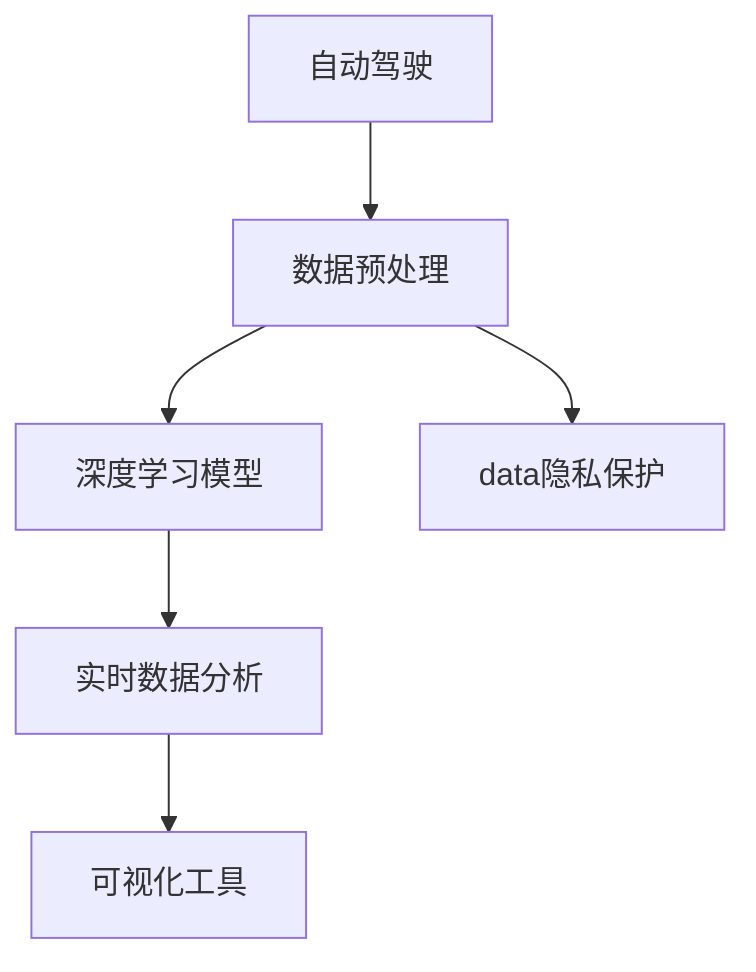
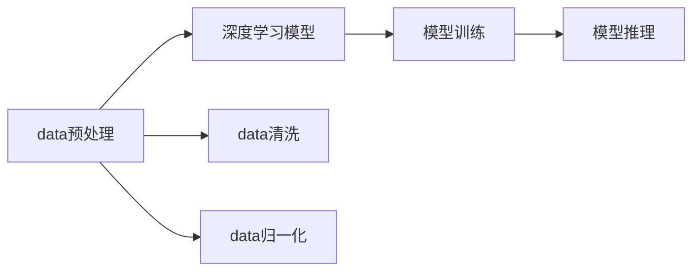
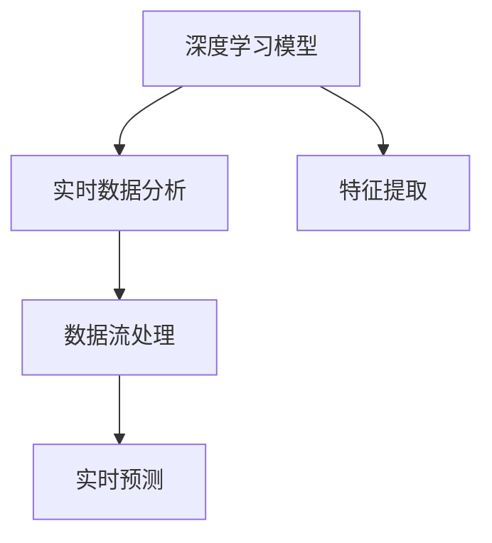
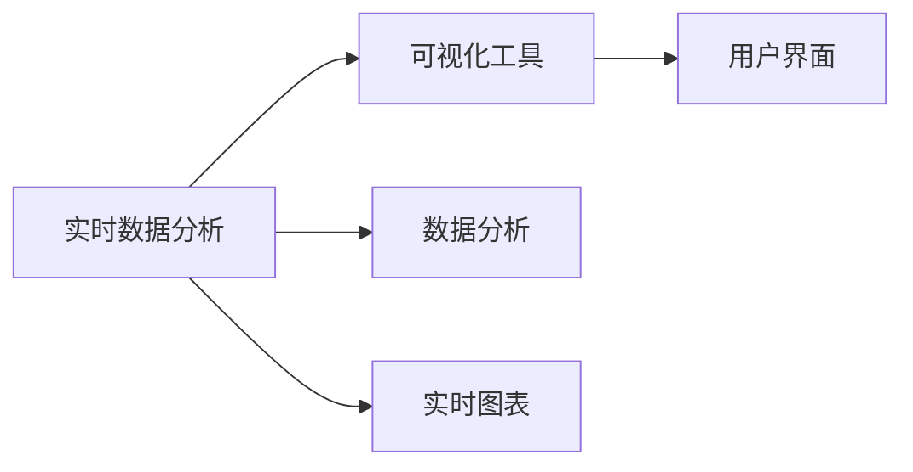
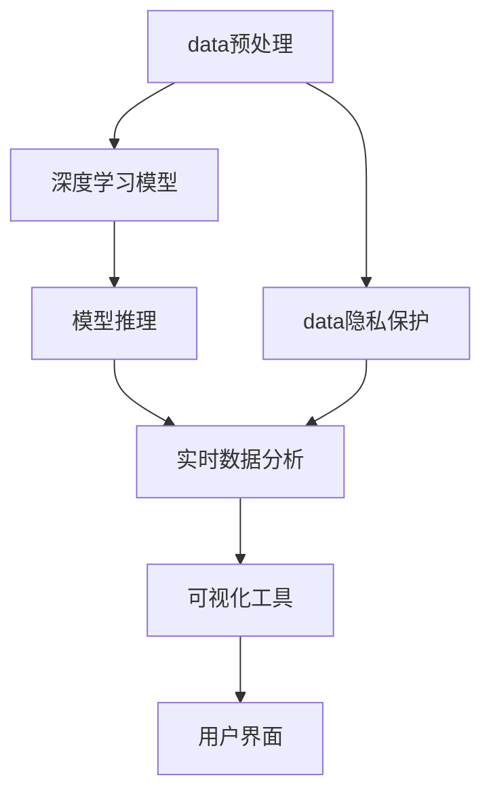
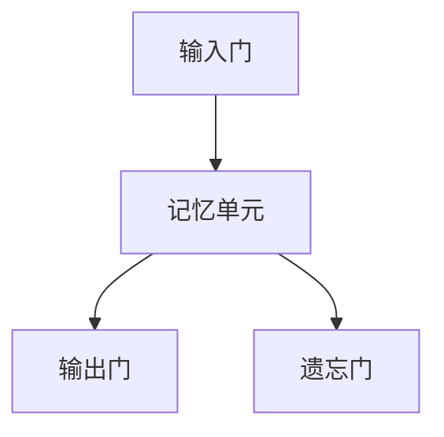

                 

# 自动驾驶公司的数据挖掘与分析平台

> 关键词：
- 自动驾驶
- 数据挖掘
- 数据预处理
- 深度学习模型
- 实时数据分析
- 可视化工具
- 安全监控系统
- 数据隐私保护

## 1. 背景介绍

### 1.1 问题由来
随着自动驾驶技术的发展，越来越多的公司开始布局自动驾驶业务。然而，自动驾驶系统需要大量的数据支持，这些数据包括但不限于传感器数据、地理位置数据、交通规则数据等。对这些数据进行高效、准确地挖掘与分析，是实现自动驾驶的关键。因此，建立一个高效的数据挖掘与分析平台，成为了各大自动驾驶公司的一个重要课题。

### 1.2 问题核心关键点
自动驾驶公司数据挖掘与分析平台的核心关键点包括：

- 数据收集与预处理：从多种传感器和数据源中收集数据，并进行清洗、去重、归一化等预处理操作。
- 深度学习模型训练：利用大规模数据集训练深度学习模型，如卷积神经网络（CNN）、循环神经网络（RNN）等。
- 实时数据分析：对车辆传感器数据进行实时分析，如交通流量预测、车辆行为分析等。
- 可视化工具：使用可视化工具将分析结果直观呈现给用户，如地图、仪表盘等。
- 数据隐私保护：确保数据挖掘过程中涉及的个人隐私数据得到保护。

### 1.3 问题研究意义
建立一个高效的数据挖掘与分析平台，对于自动驾驶公司而言，具有重要意义：

- 提高自动驾驶系统的安全性：通过对传感器数据的深度学习模型训练，实现对环境变化的精准预测和实时响应。
- 降低人工干预成本：自动化数据挖掘与分析，减少了人工干预的需求，提高了效率。
- 增强系统决策的透明度：利用可视化工具，帮助决策者直观理解数据挖掘结果，提高决策的透明度和可靠性。
- 保护数据隐私：在数据挖掘过程中，确保涉及的个人隐私数据得到充分保护，避免数据泄露风险。

## 2. 核心概念与联系

### 2.1 核心概念概述

为了更好地理解自动驾驶公司数据挖掘与分析平台的构建，我们首先需要了解以下几个核心概念：

- **自动驾驶**：通过人工智能技术实现对车辆的自动控制和导航。
- **数据挖掘**：从大量数据中提取有用信息和知识的过程。
- **数据预处理**：对原始数据进行清洗、去重、归一化等操作，以便于模型训练和分析。
- **深度学习模型**：基于多层神经网络的模型，常用于图像、语音、文本等数据的处理和分析。
- **实时数据分析**：对传感器数据进行实时处理和分析，以便快速做出决策。
- **可视化工具**：用于将数据分析结果以图形、图表等形式呈现的工具。
- **数据隐私保护**：在数据挖掘过程中，保护涉及个人隐私的数据，避免数据泄露风险。

这些核心概念之间的联系可以通过以下Mermaid流程图来展示：



这个流程图展示了自动驾驶公司数据挖掘与分析平台的主要流程：

1. 自动驾驶系统收集传感器数据和其他相关数据，进行预处理。
2. 利用深度学习模型对预处理后的数据进行训练和分析。
3. 对传感器数据进行实时分析，生成分析结果。
4. 使用可视化工具将分析结果呈现给用户。
5. 数据预处理过程中，还需要关注数据隐私保护问题。

### 2.2 概念间的关系

这些核心概念之间存在着紧密的联系，形成了自动驾驶公司数据挖掘与分析平台的主要生态系统。下面我们通过几个Mermaid流程图来展示这些概念之间的关系。

#### 2.2.1 数据预处理与深度学习模型



这个流程图展示了数据预处理和深度学习模型之间的关系。预处理后的数据直接输入到深度学习模型中，进行模型训练和推理。

#### 2.2.2 深度学习模型与实时数据分析



这个流程图展示了深度学习模型与实时数据分析之间的关系。深度学习模型提取出数据的特征，通过实时数据分析系统进行处理和预测。

#### 2.2.3 可视化工具与实时数据分析



这个流程图展示了可视化工具与实时数据分析之间的关系。实时数据分析系统生成的数据被可视化工具呈现为图表和仪表盘，方便用户进行直观理解。

### 2.3 核心概念的整体架构

最后，我们用一个综合的流程图来展示这些核心概念在大数据挖掘与分析平台上的整体架构：



这个综合流程图展示了从数据预处理到最终用户界面的全过程。数据预处理过程中，同时需要注意数据隐私保护。数据隐私保护系统确保数据挖掘过程中涉及的个人隐私数据得到充分保护。

## 3. 核心算法原理 & 具体操作步骤
### 3.1 算法原理概述

自动驾驶公司数据挖掘与分析平台的核心算法原理基于深度学习模型。深度学习模型通过多层神经网络结构，从原始数据中提取高层次的特征，实现对数据的高级分析和处理。具体流程如下：

1. **数据预处理**：对传感器数据进行清洗、去重、归一化等操作，以便于模型训练和分析。
2. **模型训练**：利用大规模数据集训练深度学习模型，如卷积神经网络（CNN）、循环神经网络（RNN）等。
3. **模型推理**：将训练好的模型应用到实时数据中进行推理，生成预测结果。
4. **实时数据分析**：对传感器数据进行实时处理和分析，如交通流量预测、车辆行为分析等。
5. **可视化工具**：使用可视化工具将分析结果以图形、图表等形式呈现给用户，如地图、仪表盘等。

### 3.2 算法步骤详解

下面以自动驾驶中的交通流量预测为例，详细说明深度学习模型在大数据挖掘与分析平台中的具体应用步骤：

1. **数据收集**：从传感器和相关数据源中收集交通流量数据，包括车速、车流量、道路信息等。
2. **数据清洗**：对数据进行去重、去噪、填补缺失值等操作，确保数据的质量和完整性。
3. **特征工程**：提取数据中的关键特征，如车速、车流量、时间、天气等。
4. **模型训练**：利用历史交通流量数据，训练深度学习模型，如LSTM网络。
5. **模型推理**：将训练好的模型应用到实时传感器数据中，生成预测结果。
6. **实时数据分析**：对传感器数据进行实时处理和分析，计算交通流量预测值。
7. **可视化呈现**：使用可视化工具将交通流量预测结果呈现为地图和仪表盘，直观展示给用户。

### 3.3 算法优缺点

深度学习模型在自动驾驶公司数据挖掘与分析平台中，具有以下优点：

- **高精度**：深度学习模型具有较高的精度，可以准确预测交通流量变化。
- **自适应性**：深度学习模型能够自动学习数据中的模式和规律，适应不同环境和条件。
- **可解释性**：通过可视化工具，可以直观展示模型的推理过程，增强决策的透明度。

同时，深度学习模型也存在一些缺点：

- **计算复杂度高**：深度学习模型需要大量的计算资源和时间进行训练和推理。
- **模型复杂度高**：深度学习模型通常具有较多的参数，难以解释其内部工作机制。
- **数据需求高**：深度学习模型需要大量的标注数据进行训练，数据获取成本较高。

### 3.4 算法应用领域

深度学习模型在自动驾驶公司数据挖掘与分析平台中，主要应用于以下几个领域：

- **交通流量预测**：利用历史交通流量数据，训练深度学习模型，对未来的交通流量进行预测。
- **车辆行为分析**：通过对传感器数据的实时分析，了解车辆的行为和状态，如车道保持、变道等。
- **安全监控系统**：实时监控车辆周围环境，识别潜在的危险，如车辆入侵、行人穿越等。
- **决策支持系统**：基于实时数据分析，提供决策支持，如避障、路径规划等。

## 4. 数学模型和公式 & 详细讲解 & 举例说明

### 4.1 数学模型构建

深度学习模型通常使用多层神经网络结构，如卷积神经网络（CNN）、循环神经网络（RNN）等。这里以LSTM网络为例，介绍深度学习模型在大数据挖掘与分析平台中的数学模型构建。

LSTM网络由多个LSTM单元组成，每个单元包含一个输入门（input gate）、一个遗忘门（forget gate）、一个输出门（output gate）和一个记忆单元（memory cell）。LSTM网络的结构如图1所示：



图1：LSTM网络结构图

### 4.2 公式推导过程

以LSTM网络为例，其公式推导过程如下：

- **输入门公式**：
  $$
  i_t = \sigma(W_{xi}x_t + b_{xi} + W_{hi}h_{t-1} + b_{hi}) 
  $$
  其中，$i_t$表示输入门，$\sigma$表示sigmoid激活函数，$W_{xi}, b_{xi}, W_{hi}, b_{hi}$表示网络中的权重和偏置项。

- **遗忘门公式**：
  $$
  f_t = \sigma(W_{xf}x_t + b_{xf} + W_{hf}h_{t-1} + b_{hf})
  $$

- **输出门公式**：
  $$
  o_t = \sigma(W_{xo}x_t + b_{xo} + W_{ho}h_{t-1} + b_{ho})
  $$

- **记忆单元公式**：
  $$
  c_t = f_t * c_{t-1} + i_t * \tanh(W_{xc}x_t + b_{xc} + W_{hc}h_{t-1} + b_{hc})
  $$

- **LSTM网络的总输出公式**：
  $$
  h_t = o_t * \tanh(c_t)
  $$

通过以上公式，可以对LSTM网络进行训练和推理，预测未来的交通流量数据。

### 4.3 案例分析与讲解

假设我们要预测未来的交通流量数据。首先，收集历史交通流量数据，并对其进行清洗和特征工程。然后，利用LSTM网络进行模型训练。最后，将训练好的LSTM模型应用到实时传感器数据中，进行流量预测。

以图2为例，展示LSTM网络在交通流量预测中的应用：


图2：LSTM网络在交通流量预测中的应用

## 5. 项目实践：代码实例和详细解释说明

### 5.1 开发环境搭建

为了搭建自动驾驶公司数据挖掘与分析平台，我们需要安装一些必要的软件工具。以下是具体的开发环境搭建步骤：

1. **安装Python和相关库**：
   ```bash
   sudo apt-get update
   sudo apt-get install python3 python3-pip python3-numpy python3-scipy python3-matplotlib python3-pandas
   ```

2. **安装TensorFlow和Keras**：
   ```bash
   pip install tensorflow keras
   ```

3. **安装OpenCV和PySerial**：
   ```bash
   pip install opencv-python pyserial
   ```

4. **安装PyQT和Matplotlib**：
   ```bash
   pip install pyqt5 matplotlib
   ```

5. **安装Git和GitHub**：
   ```bash
   sudo apt-get install git
   ```

完成以上步骤后，即可在Python环境中进行深度学习模型的开发和部署。

### 5.2 源代码详细实现

以下是一个简单的深度学习模型代码示例，用于交通流量预测：

```python
import tensorflow as tf
from tensorflow.keras.models import Sequential
from tensorflow.keras.layers import Dense, LSTM
from tensorflow.keras.optimizers import Adam
from sklearn.model_selection import train_test_split
import numpy as np
import pandas as pd

# 读取历史交通流量数据
data = pd.read_csv('traffic_data.csv')

# 数据预处理
data = data.dropna()
data['time'] = pd.to_datetime(data['time'])
data = data.groupby('time')['flow'].sum()
data = data.reset_index()

# 特征工程
data['time'] = data['time'].dt.hour
data['weekday'] = data['time'].dt.dayofweek
data['month'] = data['time'].dt.month

# 将数据转换为序列
X = []
y = []
for i in range(len(data) - 20):
    X.append(data.iloc[i:i+20]['time'].values)
    y.append(data.iloc[i+20]['flow'].values)
X = np.array(X)
y = np.array(y)

# 数据分割
X_train, X_test, y_train, y_test = train_test_split(X, y, test_size=0.2)

# 构建LSTM模型
model = Sequential()
model.add(LSTM(128, input_shape=(20, 1)))
model.add(Dense(1))

# 编译模型
model.compile(optimizer=Adam(0.001), loss='mean_squared_error')

# 训练模型
model.fit(X_train, y_train, epochs=100, batch_size=32)

# 模型推理
def predict_flow(time):
    # 将时间转换为特征向量
    time = time.weekday
    time = time.month
    time = time.hour

    # 将时间特征与模型输入对齐
    input_data = [time]
    for i in range(20):
        input_data.append(input_data[-1])
        input_data.pop(0)
    
    # 将特征向量转化为矩阵
    input_data = np.array(input_data)
    input_data = np.expand_dims(input_data, axis=0)
    
    # 进行模型预测
    predictions = model.predict(input_data)
    return predictions[0][0]

# 测试模型
time = pd.to_datetime('2022-01-01 08:00')
flow = predict_flow(time)
print(f'预测流量为：{flow}')

# 可视化结果
import matplotlib.pyplot as plt
plt.plot(data['time'], data['flow'])
plt.xlabel('时间')
plt.ylabel('流量')
plt.show()
```

以上代码实现了LSTM模型在交通流量预测中的应用。代码中包含了数据预处理、特征工程、模型训练、模型推理和可视化等步骤。

### 5.3 代码解读与分析

让我们再详细解读一下关键代码的实现细节：

**数据预处理**：
- 使用Pandas读取历史交通流量数据。
- 使用`dropna`方法删除缺失值。
- 将时间数据转换为datetime格式。
- 对时间数据进行分组，计算每个时间段的总流量。

**特征工程**：
- 提取时间、周几、月份等特征。
- 将时间特征转换为模型的输入形式。

**模型训练**：
- 构建LSTM模型，设置输入形状和输出层。
- 使用Adam优化器和均方误差损失函数编译模型。
- 使用`fit`方法训练模型，设置训练轮数和批大小。

**模型推理**：
- 定义`predict_flow`函数，用于预测未来的流量数据。
- 将时间数据转换为模型所需的特征向量。
- 将特征向量输入到模型中进行预测，返回预测流量。

**可视化结果**：
- 使用Matplotlib绘制时间-流量图，直观展示模型预测结果。

## 6. 实际应用场景

### 6.1 智能交通系统

自动驾驶公司数据挖掘与分析平台在智能交通系统中有着广泛的应用。通过实时分析交通流量数据，智能交通系统可以优化交通信号灯控制、调整交通流量、减少拥堵等。例如，利用LSTM网络对交通流量进行预测，可以在高峰时段提前调节信号灯，避免交通拥堵。

### 6.2 自动驾驶安全系统

自动驾驶公司数据挖掘与分析平台可以应用于自动驾驶安全系统中，实现实时环境感知和决策支持。例如，利用传感器数据和历史交通数据，训练深度学习模型，实时检测车辆周围的行人、车辆等，防止碰撞事故的发生。

### 6.3 地图导航系统

自动驾驶公司数据挖掘与分析平台可以应用于地图导航系统中，提供实时交通路况信息。例如，利用实时数据分析，生成交通流量预测图，帮助用户选择最优路径，减少出行时间。

### 6.4 未来应用展望

随着技术的不断发展，自动驾驶公司数据挖掘与分析平台将进一步拓展其应用场景，提升自动驾驶系统的性能和可靠性。例如：

- **多源数据融合**：结合卫星数据、气象数据等多源数据，提高交通流量预测的准确性。
- **实时决策优化**：利用深度强化学习，优化自动驾驶系统在复杂环境下的决策过程。
- **个性化服务**：根据用户的历史行为数据，提供个性化的出行建议和服务。

## 7. 工具和资源推荐

### 7.1 学习资源推荐

为了帮助开发者系统掌握深度学习模型和自动驾驶技术，以下是一些优质的学习资源：

1. **《深度学习》课程**：斯坦福大学开设的深度学习课程，涵盖深度学习基础和经典模型。
2. **《自动驾驶技术》课程**：北京大学的自动驾驶课程，涵盖自动驾驶基础和前沿技术。
3. **《TensorFlow官方文档》**：TensorFlow的官方文档，提供了丰富的学习资源和示例代码。
4. **《Keras官方文档》**：Keras的官方文档，提供了简单易用的深度学习模型开发接口。
5. **《OpenCV官方文档》**：OpenCV的官方文档，提供了计算机视觉和图像处理技术。

### 7.2 开发工具推荐

以下是一些用于自动驾驶公司数据挖掘与分析平台开发的常用工具：

1. **TensorFlow**：谷歌开源的深度学习框架，提供了丰富的模型和工具。
2. **Keras**：基于TensorFlow的高级深度学习库，提供了简单易用的API接口。
3. **OpenCV**：计算机视觉和图像处理库，提供了高效的图像处理和分析功能。
4. **PySerial**：Python的串口通信库，用于与车辆传感器通信。
5. **Matplotlib**：Python的数据可视化库，用于绘制图表和仪表盘。

### 7.3 相关论文推荐

深度学习模型和自动驾驶技术的发展离不开学界的持续研究。以下是几篇奠基性的相关论文，推荐阅读：

1. **《Deep Learning》**：Yoshua Bengio、Ian Goodfellow和Aaron Courville合著的深度学习经典教材。
2. **《Convolutional Neural Networks for Visual Recognition》**：Alec Veit、Matthew Kanter and Jeffrey Donahue撰写的卷积神经网络论文。
3. **《Long Short-Term Memory》**：Sepp Hochreiter和Jurgen Schmidhuber撰写的循环神经网络论文。

除上述资源外，还有一些值得关注的前沿资源，帮助开发者紧跟深度学习和自动驾驶技术的最新进展，例如：

1. **arXiv论文预印本**：人工智能领域最新研究成果的发布平台，包括大量尚未发表的前沿工作，学习前沿技术的必读资源。
2. **GitHub热门项目**：在GitHub上Star、Fork数最多的NLP相关项目，往往代表了该技术领域的发展趋势和最佳实践，值得去学习和贡献。
3. **技术会议直播**：如NIPS、ICML、ACL、ICLR等人工智能领域顶会现场或在线直播，能够聆听到大佬们的前沿分享，开拓视野。
4. **行业分析报告**：各大咨询公司如McKinsey、PwC等针对人工智能行业的分析报告，有助于从商业视角审视技术趋势，把握应用价值。

## 8. 总结：未来发展趋势与挑战

### 8.1 总结

本文对自动驾驶公司数据挖掘与分析平台进行了全面系统的介绍。首先阐述了平台的核心关键点，包括数据预处理、深度学习模型、实时数据分析和可视化工具等。其次，从原理到实践，详细讲解了深度学习模型在大数据挖掘与分析平台中的具体应用步骤。同时，本文还探讨了平台在智能交通、自动驾驶安全、地图导航等领域的应用前景，展示了其广阔的发展潜力。

通过本文的系统梳理，可以看到，自动驾驶公司数据挖掘与分析平台在提高自动驾驶系统的安全性和效率方面具有重要意义。该平台利用深度学习模型和可视化工具，实现了对传感器数据的深度挖掘和分析，提升了自动驾驶系统的性能和可靠性。未来，随着技术的不断发展，平台将会在更多领域得到应用，为自动驾驶技术的发展注入新的动力。

### 8.2 未来发展趋势

展望未来，自动驾驶公司数据挖掘与分析平台将呈现以下几个发展趋势：

1. **多源数据融合**：结合卫星数据、气象数据等多源数据，提高交通流量预测的准确性。
2. **实时决策优化**：利用深度强化学习，优化自动驾驶系统在复杂环境下的决策过程。
3. **个性化服务**：根据用户的历史行为数据，提供个性化的出行建议和服务。
4. **跨模态融合**：结合计算机视觉、传感器数据等多模态信息，提升自动驾驶系统的感知能力和决策效果。

### 8.3 面临的挑战

尽管自动驾驶公司数据挖掘与分析平台已经取得了一定的进展，但在迈向更加智能化、普适化应用的过程中，仍面临以下挑战：

1. **计算资源消耗高**：深度学习模型需要大量的计算资源和时间进行训练和推理，高性能硬件设备成本较高。
2. **模型可解释性差**：深度学习模型通常具有较多的参数，难以解释其内部工作机制和决策过程。
3. **数据隐私保护困难**：在数据挖掘过程中，涉及的个人隐私数据保护难度较大，数据泄露风险较高。

### 8.4 研究展望

面对平台面临的挑战，未来的研究需要在以下几个方面寻求新的突破：

1. **计算资源优化**：研究高效的计算资源优化技术，如分布式计算、硬件加速等，降低计算资源消耗。
2. **模型可解释性增强**：利用可解释性技术，如梯度敏感度、模型可视化等，增强深度学习模型的可解释性。
3. **数据隐私保护措施**：研究数据隐私保护技术，如差分隐私、联邦学习等，保护个人隐私数据。

总之，自动驾驶公司数据挖掘与分析平台的研究与开发，需要跨学科的协同合作，多路径的协同发力，共同推动深度学习模型在自动驾驶系统中的应用。相信随着技术的不断进步，平台将会在自动驾驶领域发挥更大的作用，推动自动驾驶技术的普及和应用。

## 9. 附录：常见问题与解答

**Q1：自动驾驶公司数据挖掘与分析平台需要哪些硬件设备？**

A: 自动驾驶公司数据挖掘与分析平台需要高性能的计算资源，包括GPU、TPU等。同时，还需要传感器设备，如摄像头、激光雷达等，用于采集车辆周围环境信息。此外，还需要高速通信设备，如4G/5G等，用于与云端服务进行数据传输和计算。

**Q2：深度学习模型在自动驾驶系统中有什么作用？**

A: 深度学习模型在自动驾驶系统中主要应用于以下几个方面：

- **交通流量预测**：利用历史交通流量数据，训练深度学习模型，对未来的交通流量进行预测。
- **车辆行为分析**：通过对传感器数据的实时分析，了解车辆的行为和状态，如车道保持、变道等。
- **安全监控系统**：实时监控车辆周围环境，识别潜在的危险，如车辆入侵、行人穿越等。
- **决策支持系统**：基于实时数据分析，提供决策支持，如避障、路径规划等。

**Q3：深度学习模型在大数据挖掘与分析平台中如何训练和优化？**

A: 深度学习模型在大数据挖掘与分析平台中的训练和优化过程如下：

- **数据预处理**：对传感器数据进行清洗、去重、归一化等操作，以便于模型训练和分析。
- **模型训练**：利用历史数据训练深度学习模型，设置适当的超参数，如学习率、批大小等。
- **模型优化**：使用梯度下降等优化算法，对模型进行迭代优化，减小损失函数。
- **模型评估**：在测试集上评估模型性能，选择最优的模型进行部署。

**Q4：如何保护数据隐私？**

A: 数据隐私保护是自动驾驶公司数据挖掘与分析平台的一个重要问题，以下是一些常见的数据隐私保护措施：

- **差分隐私**：在数据处理过程中加入噪声，使得攻击者难以还原原始数据。
- **联邦学习**：将模型训练任务分布到多个设备上进行，减少数据集中存储的风险。
- **加密技术**：对数据进行加密处理，确保数据在传输和存储过程中的安全性。

**Q5：自动驾驶公司数据挖掘与分析平台的开发流程是怎样的？**

A: 自动驾驶公司数据挖掘与分析平台的开发流程如下：

1. **需求分析**：根据实际需求，确定数据挖掘

