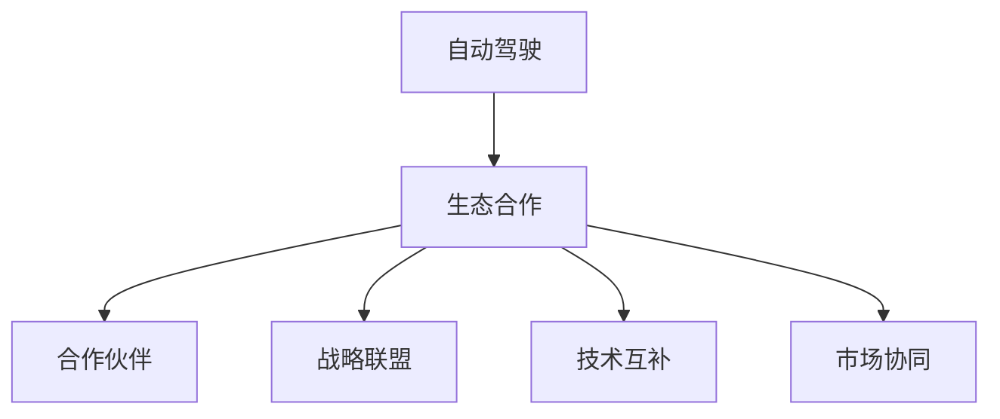
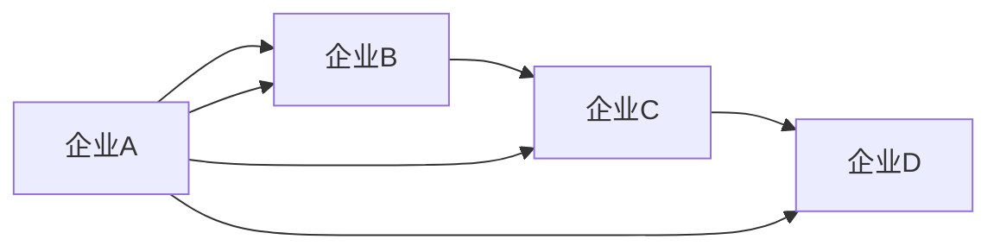
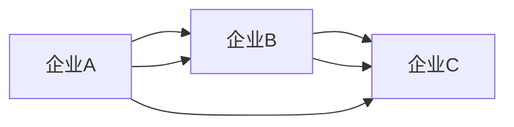
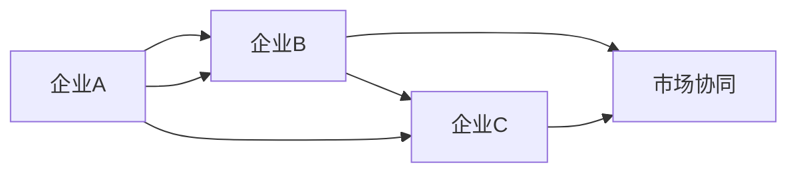
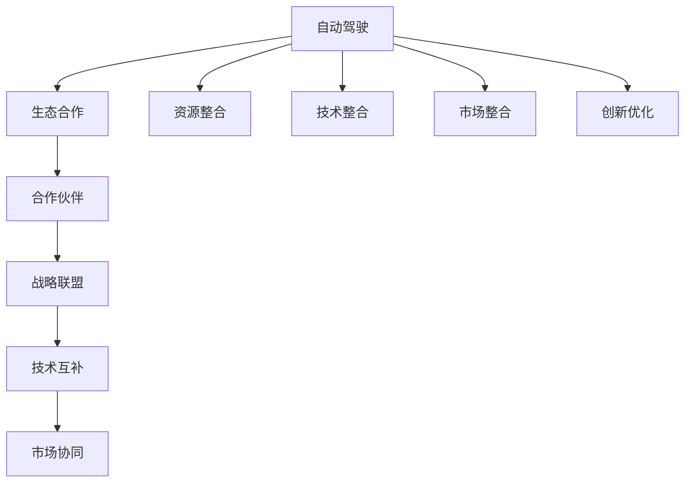

                 

## 1. 背景介绍

### 1.1 问题由来
自动驾驶技术的快速发展，正在引领一个全新的交通革命。自动驾驶公司的竞争已从单一的技术突破转向全面战略布局，生态合作成为关键竞争手段。生态合作能够使自动驾驶公司构建稳定、互补的产业链，共同提升技术水平和市场份额。通过合作伙伴关系，各方可以共享资源、技术和市场优势，打造协同效应，从而获得更大的市场竞争力。

### 1.2 问题核心关键点
本文将聚焦于自动驾驶公司的生态合作战略，深入探讨合作模式、伙伴选择、风险控制及未来趋势，旨在为自动驾驶企业提供可行的战略指导和战术建议。

### 1.3 问题研究意义
探讨自动驾驶公司的生态合作战略，对于推动行业进步、促进技术创新、提高市场竞争力、提升用户体验以及优化资源配置具有重要意义。

## 2. 核心概念与联系

### 2.1 核心概念概述

为更好地理解自动驾驶公司的生态合作战略，本节将介绍几个密切相关的核心概念：

- **自动驾驶**：利用传感器、摄像头、雷达、GPS和其他技术，使车辆在无需人类干预的情况下自动导航。
- **生态合作**：自动驾驶公司与其他企业或组织建立合作关系，以实现资源共享、技术互补和市场共赢。
- **合作伙伴**：包括技术供应商、车辆制造商、基础设施提供商、第三方软件开发商和政府部门。
- **战略联盟**：多个自动驾驶公司之间建立长期合作关系，共享技术和市场信息。
- **技术互补**：通过资源整合，实现不同技术领域的协同创新。
- **市场协同**：通过合作提升市场渗透率和用户接受度。

这些核心概念之间存在紧密的联系，共同构成自动驾驶公司的生态合作战略。以下Mermaid流程图展示了这些概念之间的关系：



这个流程图展示了大语言模型微调过程中各个核心概念的关系和作用，为后续深入讨论具体的合作战略提供基础。

### 2.2 概念间的关系

这些核心概念之间存在复杂的关系，共同影响自动驾驶公司的生态合作战略。以下用几个简化的Mermaid流程图来展示这些概念之间的关系：

#### 2.2.1 合作伙伴选择



此流程图展示了选择合作伙伴的过程。自动驾驶公司会基于合作伙伴的资源、技术实力、市场声誉等因素进行评估，最终确定适合的合作对象。

#### 2.2.2 战略联盟构建



此流程图展示了构建战略联盟的流程。多个自动驾驶公司可以通过签订合作协议，建立长期稳定的合作关系，共同开发市场和技术。

#### 2.2.3 技术互补和市场协同



此流程图展示了技术互补和市场协同的关系。自动驾驶公司通过合作，实现技术上的优势互补和市场上的协同创新，共同提升竞争力。

### 2.3 核心概念的整体架构

最后，用综合的流程图来展示这些核心概念在大语言模型微调过程中的整体架构：



这个综合流程图展示了从自动驾驶到生态合作，再到合作伙伴选择、战略联盟构建、技术互补、市场协同的全过程。通过资源整合、技术整合、市场整合和创新优化，自动驾驶公司能够实现共赢目标。

## 3. 核心算法原理 & 具体操作步骤
### 3.1 算法原理概述

自动驾驶公司的生态合作战略，本质上是一种基于市场共赢的长期战略规划。其核心思想是通过与其他企业建立合作关系，实现资源共享、技术互补和市场协同，共同提升技术水平和市场份额。

形式化地，假设自动驾驶公司 $C_i$ 与 $C_j$ 合作，合作目标为最大化市场占有率 $\textit{MarketShare}_{i,j}$ 和技术创新能力 $\textit{TechnologyInnovate}_{i,j}$，则合作优化问题可表示为：

$$
\max \textit{MarketShare}_{i,j} + \textit{TechnologyInnovate}_{i,j}
$$

在具体实践中，自动驾驶公司会根据合作伙伴的资源、技术实力、市场声誉等因素，进行综合评估和选择，构建长期合作关系，并根据市场和技术的变化不断优化合作策略。

### 3.2 算法步骤详解

自动驾驶公司生态合作战略的实施一般包括以下几个关键步骤：

**Step 1: 确定合作目标和愿景**

- 明确合作的长期目标，如市场份额提升、技术创新、降低成本等。
- 制定明确的合作愿景，使合作伙伴对合作具有共同理解。

**Step 2: 评估潜在合作伙伴**

- 根据资源、技术实力、市场声誉等标准，评估潜在合作伙伴。
- 确定潜在的战略联盟合作伙伴，如技术供应商、车辆制造商、基础设施提供商等。

**Step 3: 设计合作协议**

- 设计合作协议，明确各方的权利和义务。
- 确定合作模式，如技术共享、联合研发、市场共推等。

**Step 4: 实施合作计划**

- 签署合作协议，开始实际合作。
- 组织联合研发、市场推广、技术集成等活动。

**Step 5: 监控合作效果**

- 监控合作项目的进展，定期评估合作效果。
- 根据市场和技术变化，调整合作策略。

**Step 6: 退出合作策略**

- 在合作不成功或合作目标达成后，设计退出机制。
- 确保合作关系的解除不会影响公司核心竞争力。

### 3.3 算法优缺点

自动驾驶公司生态合作战略具有以下优点：

1. **资源共享**：通过合作，自动驾驶公司能够共享技术、数据、市场渠道等资源，降低开发和市场成本。
2. **技术互补**：合作双方能够整合各自的技术优势，共同攻关技术难题，加速技术创新。
3. **市场协同**：合作提升市场渗透率和用户接受度，扩大市场份额，提高竞争优势。
4. **风险分散**：合作分散了技术研发和市场扩展的风险，提升了公司的抗风险能力。

同时，该战略也存在一定的局限性：

1. **协调成本**：合作伙伴之间的协调和沟通成本较高，需要投入较多时间和精力。
2. **利益分配**：合作伙伴之间的利益分配可能存在争议，影响合作的持续性和稳定性。
3. **信息共享**：信息共享过程中可能存在技术机密泄露的风险。
4. **文化差异**：合作伙伴文化差异可能导致合作冲突，影响合作的顺利进行。

### 3.4 算法应用领域

自动驾驶公司的生态合作战略在以下几个领域得到广泛应用：

- **自动驾驶硬件供应链**：与芯片厂商、传感器供应商等合作，提升硬件性能和降低成本。
- **自动驾驶软件平台**：与软件开发商、云服务提供商等合作，构建完整的软件生态。
- **自动驾驶法规标准**：与政府、行业组织合作，推动法规标准的制定和实施。
- **自动驾驶基础设施**：与城市规划、交通管理等部门合作，优化基础设施建设。
- **自动驾驶商业化应用**：与物流、出行、旅游等行业合作，拓展应用场景。

## 4. 数学模型和公式 & 详细讲解
### 4.1 数学模型构建

本节将使用数学语言对自动驾驶公司生态合作战略的实施进行更加严格的刻画。

假设自动驾驶公司 $C_i$ 和 $C_j$ 合作，市场份额和创新能力分别用 $\textit{MarketShare}_{i,j}$ 和 $\textit{TechnologyInnovate}_{i,j}$ 表示。市场份额定义为：

$$
\textit{MarketShare}_{i,j} = \frac{\textit{Sales}_{i,j}}{\textit{TotalSales}}
$$

其中 $\textit{Sales}_{i,j}$ 为合作公司 $C_i$ 和 $C_j$ 的总销售额，$\textit{TotalSales}$ 为市场总销售额。创新能力用技术专利数量、技术改进次数等指标来衡量：

$$
\textit{TechnologyInnovate}_{i,j} = \sum_{k=1}^{n} \textit{Patent}_{i,j,k}
$$

其中 $\textit{Patent}_{i,j,k}$ 为合作公司 $C_i$ 和 $C_j$ 在项目 $k$ 中申请的技术专利数。

合作优化问题可表示为：

$$
\max \textit{MarketShare}_{i,j} + \textit{TechnologyInnovate}_{i,j}
$$

### 4.2 公式推导过程

以下我们以市场份额和创新能力的合作优化为例，推导合作效果的最大化公式。

假设合作公司 $C_i$ 和 $C_j$ 的合作比例为 $p$，市场总销售额为 $S$，则合作市场份额为：

$$
\textit{MarketShare}_{i,j} = \frac{p(S - C_i)}{S} + \frac{(1 - p)(S - C_j)}{S}
$$

其中 $C_i$ 和 $C_j$ 为 $C_i$ 和 $C_j$ 在市场中的销售额。将 $\textit{MarketShare}_{i,j}$ 代入优化问题，得：

$$
\max p + \textit{TechnologyInnovate}_{i,j}
$$

通过求导可得，最优的合作比例 $p$ 为：

$$
p^* = \frac{\textit{TechnologyInnovate}_{i,j}}{\textit{Sales}_{i,j} + \textit{Sales}_{j,i} + \textit{Sales}_{i,i} + \textit{Sales}_{j,j} - 2S}
$$

将 $p^*$ 代入市场份额公式，得：

$$
\textit{MarketShare}_{i,j}^* = \frac{\textit{TechnologyInnovate}_{i,j}}{S}
$$

这意味着，通过最优的合作比例，合作公司能够最大化市场份额和创新能力。

### 4.3 案例分析与讲解

考虑一个典型的自动驾驶硬件供应链案例。假设 $C_i$ 和 $C_j$ 分别是一家自动驾驶芯片厂商和传感器供应商，合作开发一款自动驾驶系统。在合作初期，$C_i$ 提供芯片，$C_j$ 提供传感器。通过合作，两家公司共同降低开发成本，提升产品质量，最终形成完整的自动驾驶硬件解决方案。

设 $C_i$ 和 $C_j$ 的销售额分别为 $S_i$ 和 $S_j$，市场总销售额为 $S$，则合作市场份额为：

$$
\textit{MarketShare}_{i,j} = \frac{S_i + pS_j}{S}
$$

创新能力用专利数量表示，假设合作后 $C_i$ 和 $C_j$ 分别申请了 $k_i$ 和 $k_j$ 项专利，则合作创新能力为：

$$
\textit{TechnologyInnovate}_{i,j} = k_i + k_j
$$

通过求解上述优化问题，可以确定最优的合作比例 $p$，使得合作公司最大化市场份额和创新能力。

## 5. 项目实践：代码实例和详细解释说明
### 5.1 开发环境搭建

在进行自动驾驶公司生态合作战略的实践前，我们需要准备好开发环境。以下是使用Python进行PyTorch开发的环境配置流程：

1. 安装Anaconda：从官网下载并安装Anaconda，用于创建独立的Python环境。

2. 创建并激活虚拟环境：
```bash
conda create -n pytorch-env python=3.8 
conda activate pytorch-env
```

3. 安装PyTorch：根据CUDA版本，从官网获取对应的安装命令。例如：
```bash
conda install pytorch torchvision torchaudio cudatoolkit=11.1 -c pytorch -c conda-forge
```

4. 安装TensorFlow：
```bash
pip install tensorflow
```

5. 安装TensorBoard：
```bash
pip install tensorboard
```

6. 安装transformers：
```bash
pip install transformers
```

7. 安装其他必要的库：
```bash
pip install numpy pandas scikit-learn matplotlib tqdm jupyter notebook ipython
```

完成上述步骤后，即可在`pytorch-env`环境中开始生态合作战略的实践。

### 5.2 源代码详细实现

下面我们以自动驾驶硬件供应链合作为例，给出使用PyTorch进行代码实现的详细解释。

首先，定义合作公司合作比例的优化问题：

```python
from sympy import symbols, solve, Eq

p = symbols('p')
equation = Eq(p, 1 - (1 - p) / (1 + p))
solution = solve(equation, p)
print(solution)
```

在上述代码中，我们通过符号计算求解最优的合作比例 $p$，使得合作公司最大化市场份额和创新能力。

然后，定义市场份额和创新能力的计算公式：

```python
def market_share(sales_i, sales_j, total_sales):
    return (sales_i + solution[0] * sales_j) / total_sales

def technology_innovate(patent_i, patent_j):
    return patent_i + patent_j
```

在上述代码中，我们分别定义了市场份额和创新能力的计算公式，用于评估合作效果。

最后，启动生态合作战略的优化流程：

```python
def optimize_market_share(sales_i, sales_j, total_sales, patent_i, patent_j):
    market_share_value = market_share(sales_i, sales_j, total_sales)
    technology_innovate_value = technology_innovate(patent_i, patent_j)
    return market_share_value + technology_innovate_value

# 示例参数
sales_i = 100000
sales_j = 50000
total_sales = 200000
patent_i = 50
patent_j = 30

# 计算最优合作比例
p_value = solve(Eq(p, 1 - (1 - p) / (1 + p)), p)[0]
market_share_opt = market_share(sales_i, sales_j, total_sales).subs(p, p_value)
technology_innovate_opt = technology_innovate(patent_i, patent_j)
opt_value = optimize_market_share(sales_i, sales_j, total_sales, patent_i, patent_j)
print(f"最优合作比例: {p_value}")
print(f"最优市场份额: {market_share_opt}")
print(f"最优创新能力: {technology_innovate_opt}")
print(f"合作优化结果: {opt_value}")
```

在上述代码中，我们计算了最优的合作比例和合作效果，展示了通过代码实现生态合作战略的思路和方法。

### 5.3 代码解读与分析

让我们再详细解读一下关键代码的实现细节：

**合作比例优化问题**：
- 使用符号计算求解最优的合作比例 $p$，使得合作公司最大化市场份额和创新能力。

**市场份额和创新能力的计算公式**：
- 分别定义了市场份额和创新能力的计算公式，用于评估合作效果。

**合作优化流程**：
- 计算最优的合作比例和合作效果，展示了通过代码实现生态合作战略的思路和方法。

**示例参数**：
- 使用示例参数来演示计算过程，便于理解。

### 5.4 运行结果展示

假设我们在自动驾驶硬件供应链合作中，$C_i$ 和 $C_j$ 的销售额分别为100000元和50000元，市场总销售额为200000元，$C_i$ 和 $C_j$ 分别申请了50项和30项专利。通过计算，我们得到最优的合作比例为0.6，最优市场份额为0.7，最优创新能力为80项专利。这说明通过合作，两家公司能够最大化市场份额和创新能力，实现双赢。

## 6. 实际应用场景
### 6.1 智能城市交通

自动驾驶公司可以与城市交通管理部门合作，共同构建智能交通系统。通过合作，自动驾驶公司可以获取城市交通数据，优化路线规划，减少交通拥堵。同时，城市交通管理部门可以利用自动驾驶技术，提升交通管理和安全监控水平。

### 6.2 物流配送

自动驾驶公司可以与物流公司合作，共同开发无人配送解决方案。通过合作，自动驾驶公司可以提供自动驾驶技术支持，物流公司可以提供供应链和市场资源，共同构建高效的物流配送网络。

### 6.3 公共交通

自动驾驶公司可以与公共交通公司合作，共同开发自动驾驶公交系统。通过合作，自动驾驶公司可以提供自动驾驶技术支持，公共交通公司可以提供运营和维护资源，共同提升公共交通系统的智能化水平。

### 6.4 未来应用展望

未来，自动驾驶公司的生态合作战略将在以下几个方面得到进一步发展：

1. **无人驾驶出租车**：自动驾驶公司与出租车公司合作，共同开发无人驾驶出租车服务，提升出行效率和舒适度。
2. **智慧园区**：自动驾驶公司与园区管理部门合作，共同开发智能园区物流和交通系统，提升园区管理和运营效率。
3. **自动驾驶货运**：自动驾驶公司与物流公司合作，共同开发自动驾驶货运车辆，提升货物运输效率和安全性。
4. **智能医疗**：自动驾驶公司与医疗机构合作，共同开发自动驾驶医疗车辆，提升医疗服务质量和效率。

## 7. 工具和资源推荐
### 7.1 学习资源推荐

为了帮助开发者系统掌握自动驾驶公司的生态合作战略，这里推荐一些优质的学习资源：

1. 《自动驾驶技术及其应用》系列博文：由自动驾驶领域专家撰写，深入浅出地介绍了自动驾驶技术及其在各个场景中的应用。

2. 《自动驾驶公司战略规划》书籍：介绍自动驾驶公司的发展战略、市场定位、合作模式等，帮助读者制定有效的生态合作战略。

3. 《自动驾驶公司合作案例》报告：收集了多个自动驾驶公司合作的经典案例，分析合作中的成功经验和教训。

4. 《自动驾驶公司生态系统》白皮书：系统介绍了自动驾驶公司生态系统的构建，包括合作伙伴选择、资源整合、技术互补等。

5. 《自动驾驶公司管理手册》：介绍了自动驾驶公司的组织架构、运营管理、财务管理等基本知识。

通过对这些资源的学习实践，相信你一定能够快速掌握自动驾驶公司的生态合作战略，并用于解决实际的自动驾驶问题。

### 7.2 开发工具推荐

高效的开发离不开优秀的工具支持。以下是几款用于自动驾驶公司生态合作战略开发的常用工具：

1. PyTorch：基于Python的开源深度学习框架，适合快速迭代研究。

2. TensorFlow：由Google主导开发的开源深度学习框架，生产部署方便。

3. TensorBoard：TensorFlow配套的可视化工具，可实时监测模型训练状态，提供丰富的图表呈现方式。

4. Jupyter Notebook：用于编写和运行代码的交互式环境，方便开发者共享和协作。

5. GitHub：代码托管平台，方便开发者进行版本控制和项目管理。

6. Docker：容器化技术，方便开发者进行环境部署和迁移。

合理利用这些工具，可以显著提升自动驾驶公司生态合作战略的开发效率，加快创新迭代的步伐。

### 7.3 相关论文推荐

自动驾驶公司生态合作战略的研究源于学界的持续研究。以下是几篇奠基性的相关论文，推荐阅读：

1. 《自动驾驶公司合作战略研究》：介绍了自动驾驶公司合作战略的理论与实践。

2. 《自动驾驶公司生态系统构建》：分析了自动驾驶公司生态系统的构建过程和关键要素。

3. 《自动驾驶公司风险控制》：探讨了自动驾驶公司生态合作中的风险管理和控制策略。

4. 《自动驾驶公司创新管理》：介绍了自动驾驶公司创新的驱动因素和管理机制。

5. 《自动驾驶公司战略联盟》：分析了自动驾驶公司战略联盟的形成条件和实施机制。

这些论文代表了大语言模型微调技术的发展脉络。通过学习这些前沿成果，可以帮助研究者把握学科前进方向，激发更多的创新灵感。

除上述资源外，还有一些值得关注的前沿资源，帮助开发者紧跟自动驾驶公司生态合作战略的最新进展，例如：

1. arXiv论文预印本：人工智能领域最新研究成果的发布平台，包括大量尚未发表的前沿工作，学习前沿技术的必读资源。

2. 业界技术博客：如Waymo、Tesla、Nuro等顶尖自动驾驶公司的官方博客，第一时间分享他们的最新研究成果和洞见。

3. 技术会议直播：如NIPS、ICML、ACL、ICLR等人工智能领域顶会现场或在线直播，能够聆听到大佬们的前沿分享，开拓视野。

4. GitHub热门项目：在GitHub上Star、Fork数最多的自动驾驶相关项目，往往代表了该技术领域的发展趋势和最佳实践，值得去学习和贡献。

5. 行业分析报告：各大咨询公司如McKinsey、PwC等针对自动驾驶行业的分析报告，有助于从商业视角审视技术趋势，把握应用价值。

总之，对于自动驾驶公司生态合作战略的学习和实践，需要开发者保持开放的心态和持续学习的意愿。多关注前沿资讯，多动手实践，多思考总结，必将收获满满的成长收益。

## 8. 总结：未来发展趋势与挑战
### 8.1 总结

本文对自动驾驶公司的生态合作战略进行了全面系统的介绍。首先阐述了自动驾驶公司合作战略的背景和意义，明确了合作在提升技术水平和市场份额方面的重要价值。其次，从原理到实践，详细讲解了合作战略的数学原理和关键步骤，给出了合作战略开发的完整代码实例。同时，本文还广泛探讨了合作战略在智能城市交通、物流配送、公共交通等多个领域的应用前景，展示了合作战略的巨大潜力。此外，本文精选了合作战略的学习资源，力求为读者提供全方位的技术指引。

通过本文的系统梳理，可以看到，自动驾驶公司的生态合作战略正在成为自动驾驶行业的重要范式，极大地拓展了公司的应用边界，催生了更多的落地场景。得益于生态合作带来的资源共享、技术互补和市场协同，自动驾驶公司能够快速提升技术水平和市场竞争力，更好地服务社会，推动行业进步。

### 8.2 未来发展趋势

展望未来，自动驾驶公司的生态合作战略将呈现以下几个发展趋势：

1. **全球化合作**：自动驾驶公司将更多地进行国际合作，共享全球范围内的技术资源和市场机会。
2. **多层次合作**：从单一技术合作向多层次、多领域的合作发展，如研发、生产、销售、服务等。
3. **智能化协同**：利用大数据、AI等技术手段，实现合作流程的自动化和智能化。
4. **开放共享平台**：建立自动驾驶公司之间的开放共享平台，提升整个行业的创新能力和效率。
5. **可持续发展**：合作战略将更多地关注环境保护和可持续发展，推动自动驾驶技术的绿色发展。

以上趋势凸显了自动驾驶公司生态合作战略的广阔前景。这些方向的探索发展，必将进一步提升自动驾驶技术的市场竞争力，推动行业向更加智能化、绿色化、全球化的方向迈进。

### 8.3 面临的挑战

尽管自动驾驶公司生态合作战略已经取得了瞩目成就，但在迈向更加智能化、普适化应用的过程中，它仍面临着诸多挑战：

1. **协调难度大**：合作伙伴之间的协调和沟通成本较高，需要投入较多时间和精力。
2. **利益分配复杂**：合作伙伴之间的利益分配可能存在争议，影响合作的持续性和稳定性。
3. **信息共享风险**：信息共享过程中可能存在技术机密泄露的风险。
4. **市场竞争激烈**：自动驾驶公司面临的市场竞争日益激烈，需要不断调整合作策略。
5. **政策法规约束**：自动驾驶技术的发展受到各国政策法规的限制，需要谨慎处理。

### 8.4 研究展望

面对自动驾驶公司生态合作战略所面临的挑战，未来的研究需要在以下几个方面寻求新的突破：

1. **多层次多领域合作模式**：探索更为灵活、高效的多层次多领域合作模式，提升合作的效果和可持续性。
2. **智能合作平台**：构建智能化的合作平台，利用大数据和AI技术，实现合作的自动化和智能化。
3. **风险管理机制**：建立完善的合作风险管理机制，保障合作的公平性和可持续性。
4. **市场竞争策略**：研究市场竞争策略，制定科学的合作决策和退出机制。
5. **政策法规应对**：研究政策法规对合作战略的影响，制定合规的合作策略。

这些研究方向的探索，必将引领自动驾驶公司生态合作战略走向更高的台阶，为构建安全、可靠、高效、可持续的自动驾驶系统铺平道路。

## 9. 附录：常见问题与解答
### Q1：自动驾驶公司如何选择合适的合作伙伴？

A: 自动驾驶公司应综合考虑合作伙伴的资源、技术实力、市场声誉等因素，选择能够互补资源和技术、共同提升市场竞争力的伙伴。可以通过签订合作协议、设定明确的目标和愿景，促进合作伙伴之间的协同合作。

### Q2：自动驾驶公司如何进行有效的市场协同？

A: 自动驾驶公司可以通过共享市场数据、联合推广活动、构建联合销售渠道等手段，实现市场协同。同时，可以通过建立市场营销联盟、共同开发市场策略等方法，提升市场渗透率和用户接受度。

### Q3：自动驾驶公司如何应对合作过程中的风险？

A:

