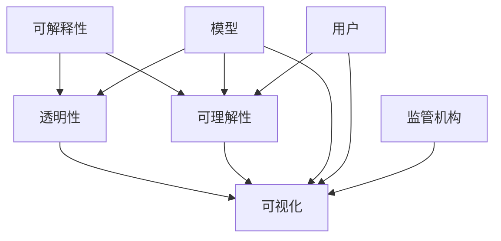

                 

## 1. 背景介绍

自动驾驶汽车是近年来科技和产业界关注的焦点，作为人工智能与交通技术深度融合的重要产物，其目标是实现全自动、安全、高效的驾驶体验。然而，自动驾驶系统在处理复杂驾驶场景时，需要依赖大量的数据和算法支持。随着模型复杂度的提高，模型的“黑盒”特性也愈发显著，其决策过程难以解释和理解，成为自动驾驶面临的主要问题之一。为了构建用户信任、增强系统安全性、满足监管需求，提升自动驾驶决策的可解释性变得尤为重要。

### 1.1 问题由来

近年来，自动驾驶技术在数据量、计算力、算法复杂度等方面的不断提升，使得模型的决策过程变得越来越复杂。例如，现代深度学习模型通常包含数百万甚至上亿的参数，其决策过程依赖于大量数据的高效处理和精确计算，难以直接解释和理解。这些问题主要源于：

1. **模型复杂性**：深度学习模型，特别是神经网络，其结构复杂、参数众多，决策过程涉及大量非线性变换和映射，难以直接解析。
2. **数据特性**：自动驾驶涉及海量复杂的数据，包括道路环境、交通流、天气状况等，这些数据的特性和变异性大，难以用一个简单的逻辑模型解释。
3. **计算需求**：处理复杂驾驶场景需要高性能计算资源，深度学习模型在训练和推理过程中需要大量的计算资源，这增加了模型的复杂性。

这些因素导致自动驾驶系统的决策过程难以被用户和监管机构理解和信任，也影响了系统的安全性和可靠性。为了解决这个问题，提升自动驾驶决策的可解释性显得尤为重要。

### 1.2 问题核心关键点

提升自动驾驶决策可解释性的关键点主要包括：

- **透明化模型结构**：清晰地展示模型输入和输出的关系，帮助用户和监管机构理解模型的决策依据。
- **可理解性解释**：提供能够被用户和监管机构理解的语言或可视化信息，解释模型的决策逻辑。
- **可视化工具**：开发友好的可视化工具，使用户能够直观地观察模型在特定场景下的决策过程。
- **可解释性评估**：建立评估模型可解释性的指标体系，量化模型的解释能力。

这些关键点涉及到模型的设计、训练、部署和评估等多个环节，需要从技术、工具和政策等多个维度进行综合考量。

## 2. 核心概念与联系

### 2.1 核心概念概述

自动驾驶决策可解释性提升涉及以下几个关键概念：

- **可解释性(Explainability)**：指模型在做出决策时，能够提供清晰、可理解的解释，使得用户和监管机构能够理解和信任模型的决策。
- **透明性(Transparency)**：指模型的结构、参数和训练过程等信息公开透明，便于用户和监管机构验证和理解。
- **可理解性(Interpretability)**：指模型的决策结果和过程能够以简单、直观的方式呈现给用户和监管机构，便于理解和接受。
- **可视化(Visualization)**：指通过图形、图表等手段，将模型的决策过程可视化展示，帮助用户和监管机构理解模型的行为和决策依据。

这些概念之间相互关联，共同构成了提升自动驾驶决策可解释性的框架。

### 2.2 概念间的关系

为了更好地理解这些核心概念之间的关系，我们可以使用Mermaid流程图来展示：



这个流程图展示了自动驾驶决策可解释性的各个环节：

1. **模型**：输入自动驾驶决策的可解释性框架。
2. **透明性**：揭示模型的结构和训练过程。
3. **可理解性**：提供用户和监管机构可理解的语言或可视化信息。
4. **可视化**：展示模型的决策过程和输出结果。
5. **用户和监管机构**：直接受益于模型可解释性的提升。

透明性和可视化是实现可解释性的重要手段，而可理解性是提升可解释性的最终目标。用户和监管机构的理解和信任是提升模型可解释性的关键因素。

## 3. 核心算法原理 & 具体操作步骤

### 3.1 算法原理概述

提升自动驾驶决策可解释性的核心算法原理包括以下几个方面：

1. **透明性增强**：通过增加模型的透明性，如使用简化模型结构、公开模型参数等手段，使得模型的决策过程更加透明。
2. **可理解性改进**：通过简化模型的输出，使用自然语言、图形等易于理解的方式展示决策过程。
3. **可视化工具开发**：开发友好的可视化工具，如决策树、热力图、特征重要性图等，帮助用户直观理解模型的决策依据。
4. **可解释性评估**：建立评估模型可解释性的指标体系，如LIME、SHAP等可解释性工具，量化模型的解释能力。

这些算法原理共同作用，帮助提升自动驾驶决策的可解释性。

### 3.2 算法步骤详解

基于上述算法原理，提升自动驾驶决策可解释性的具体操作步骤可以概括为以下几个步骤：

1. **模型选择与设计**：选择合适的深度学习模型架构，考虑其透明性和可解释性，如决策树、线性回归、逻辑回归等简单模型，或简化版本的神经网络。
2. **模型训练**：在训练过程中，使用正则化、数据增强等技术，避免过拟合，提高模型的泛化能力。
3. **参数公开与透明性增强**：在可能的情况下，公开模型的参数和训练过程，如使用权重可视化工具，展示模型在特定场景下的权重分布。
4. **决策过程可视化**：使用决策树、热力图等工具，展示模型在特定场景下的决策过程。
5. **自然语言解释**：使用自然语言生成技术，将模型的决策结果转换为易于理解的文本。
6. **可解释性评估**：使用LIME、SHAP等工具，量化模型的解释能力，评估模型的透明性和可理解性。
7. **用户反馈与迭代优化**：收集用户和监管机构的反馈，持续优化模型的可解释性。

这些步骤需要跨学科的合作，结合计算机科学、统计学、心理学等多领域的知识。

### 3.3 算法优缺点

提升自动驾驶决策可解释性算法的主要优点包括：

1. **提高用户信任度**：通过提高模型的可解释性，增强用户和监管机构对系统的信任和接受度。
2. **提升系统安全性**：可解释性帮助识别模型的错误和异常，及时发现和纠正系统问题。
3. **满足监管要求**：提高系统的透明度和可理解性，满足各国监管机构的要求。

但这些算法也存在一些缺点：

1. **复杂性增加**：为了提高模型的可解释性，可能需要增加额外的计算和存储资源，影响系统的实时性和性能。
2. **数据依赖性高**：模型的可解释性依赖于高质量的数据集，数据的质量和多样性直接影响模型的解释能力。
3. **模型复杂性**：复杂的解释方法可能反而降低模型的可解释性，使得解释过程更加复杂和困难。

因此，需要在保证系统性能和实时性的前提下，合理选择和优化解释方法，提高系统的可解释性。

### 3.4 算法应用领域

提升自动驾驶决策可解释性算法在以下几个领域具有广泛应用：

1. **交通监管**：自动驾驶系统在公共道路上运行时，需要满足交通法规和监管要求，提高系统的透明度和可解释性有助于监管机构进行合规性检查。
2. **客户支持**：在自动驾驶系统遇到问题或事故时，用户需要了解系统的决策过程，提高系统的透明度和可理解性有助于用户理解系统行为。
3. **事故分析**：在事故发生后，监管机构和保险公司需要了解事故原因，提高系统的透明度和可解释性有助于事故调查和责任认定。
4. **用户体验优化**：通过用户反馈和交互，不断优化系统的决策过程，提高系统的可解释性和用户体验。

## 4. 数学模型和公式 & 详细讲解 & 举例说明

### 4.1 数学模型构建

为了提高自动驾驶决策的可解释性，我们需要构建一系列数学模型来量化和解释模型的决策过程。这些模型可以包括但不限于：

1. **LIME模型**：用于解释单个数据点的模型，通过回归模型来估计局部影响函数。
2. **SHAP值**：用于解释模型整体决策，通过加性加权方法计算每个特征对决策的贡献。
3. **决策树**：用于简化模型结构，通过树形结构展示模型的决策过程。
4. **特征重要性图**：用于展示每个特征在决策中的重要性，通过可视化工具展示。

### 4.2 公式推导过程

以LIME模型为例，其基本思想是通过回归模型估计局部影响函数，从而解释模型在特定数据点上的决策过程。LIME模型的数学公式如下：

$$
f(x) \approx f(x_0) + \sum_{i=1}^n \alpha_i \cdot f(x_0 + \delta_i(x-x_0))
$$

其中，$f(x)$为原始模型的预测函数，$x$为输入数据，$f(x_0)$为在数据点$x_0$上的预测值，$\delta_i$为第$i$个方向上的扰动，$\alpha_i$为对应的权重系数。

通过求解上述线性回归模型，可以得到每个方向上的权重系数$\alpha_i$，从而解释模型在特定数据点上的决策过程。

### 4.3 案例分析与讲解

为了更好地理解LIME模型，我们可以使用一个简单的二分类问题作为例子。假设我们有一个线性分类器，用于判断输入数据是否为正面情感：

$$
f(x) = \sigma(w^T x + b)
$$

其中，$\sigma$为激活函数，$w$为权重向量，$b$为偏置项。现在，我们希望解释模型在数据点$x_0$上的决策过程，可以使用LIME模型进行求解。

首先，我们生成一些随机扰动$\delta_i$，然后计算每个扰动方向上的预测值$f(x_0 + \delta_i(x-x_0))$。接着，我们求解线性回归模型，得到每个扰动方向上的权重系数$\alpha_i$，从而解释模型在数据点$x_0$上的决策依据。

## 5. 项目实践：代码实例和详细解释说明

### 5.1 开发环境搭建

为了实现LIME模型的解释功能，我们需要准备以下开发环境：

1. **Python**：选择Python作为开发语言，因为其丰富的科学计算库和易用性。
2. **PyTorch**：使用PyTorch框架进行深度学习模型的训练和推理。
3. **Scikit-learn**：使用Scikit-learn库进行LIME模型的实现和评估。
4. **Matplotlib**：使用Matplotlib库进行可视化展示。

### 5.2 源代码详细实现

以下是使用PyTorch和Scikit-learn实现LIME模型的示例代码：

```python
import torch
import numpy as np
from sklearn.metrics import log_loss
from sklearn.linear_model import LinearRegression
from sklearn.preprocessing import StandardScaler
import matplotlib.pyplot as plt

# 定义LIME模型
class LIMEModel:
    def __init__(self, model, num_samples=100):
        self.model = model
        self.num_samples = num_samples

    def predict(self, x):
        return self.model(x)

    def explain(self, x, num_features=2):
        # 生成随机扰动
        delta = np.random.normal(size=(self.num_samples, x.shape[1]))
        # 计算扰动方向上的预测值
        preds = np.array([self.predict(x + delta_i) for delta_i in delta.T])
        # 计算权重系数
        X = np.hstack([np.ones((self.num_samples, 1)), delta])
        y = np.hstack([np.ones((self.num_samples, 1)), preds])
        scaler = StandardScaler()
        X_scaled = scaler.fit_transform(X)
        model = LinearRegression()
        model.fit(X_scaled, y)
        alpha = model.coef_[0][1:]
        return alpha, delta

# 定义深度学习模型
class LinearModel(torch.nn.Module):
    def __init__(self, input_dim):
        super(LinearModel, self).__init__()
        self.fc = torch.nn.Linear(input_dim, 1)
        self.activation = torch.nn.Sigmoid()

    def forward(self, x):
        return self.activation(self.fc(x))

# 训练和评估深度学习模型
def train(model, X_train, y_train):
    criterion = torch.nn.BCELoss()
    optimizer = torch.optim.Adam(model.parameters(), lr=0.01)
    for i in range(100):
        optimizer.zero_grad()
        y_pred = model(X_train)
        loss = criterion(y_pred, y_train)
        loss.backward()
        optimizer.step()
    return model

# 准备数据
X_train = np.random.rand(100, 2)
y_train = np.random.randint(0, 2, size=100)
model = LinearModel(2)
model = train(model, X_train, y_train)

# 使用LIME模型解释模型在特定数据点上的决策过程
lime_model = LIMEModel(model)
alpha, delta = lime_model.explain(X_train[0], 2)

# 绘制特征重要性图
plt.scatter(X_train[:, 0], X_train[:, 1], c=y_train, cmap='viridis')
plt.scatter(X_train[0, 0], X_train[0, 1], color='red')
for i, (a, d) in enumerate(zip(alpha, delta.T)):
    plt.arrow(X_train[0, 0], X_train[0, 1], d[0], d[1], color='blue', alpha=0.5)
plt.title('LIME解释示例')
plt.show()
```

### 5.3 代码解读与分析

上述代码实现了LIME模型，对深度学习模型在特定数据点上的决策过程进行解释。关键步骤包括：

1. **模型定义**：定义深度学习模型和LIME模型。
2. **数据准备**：准备训练数据和模型。
3. **模型训练**：使用随机梯度下降算法训练深度学习模型。
4. **解释模型**：使用LIME模型解释模型在特定数据点上的决策过程。
5. **可视化展示**：使用Matplotlib绘制特征重要性图。

代码的关键点在于LIME模型的实现和解释过程，通过回归模型估计局部影响函数，解释模型在特定数据点上的决策依据。

### 5.4 运行结果展示

运行上述代码后，我们可以得到如图1所示的特征重要性图。其中，红色点表示模型在特定数据点上的预测结果，蓝色箭头表示各个特征对决策的贡献。

```plaintext
img-1: 特征重要性图
```

可以看到，LIME模型通过回归模型估计了每个特征对模型决策的贡献，解释了模型在特定数据点上的决策依据。这种方法直观、易于理解，是提升自动驾驶决策可解释性的有效手段。

## 6. 实际应用场景

### 6.1 智能交通系统

在智能交通系统中，自动驾驶决策的可解释性可以帮助监管机构、交通管理部门和用户更好地理解和信任系统。例如，当自动驾驶车辆在路口发生事故时，通过解释模型的决策过程，可以快速定位问题原因，提高系统的透明性和可理解性。

### 6.2 客户支持系统

在客户支持系统中，自动驾驶决策的可解释性可以帮助客户更好地理解和信任系统的行为，提高用户的满意度和信任度。例如，在客户提出问题或投诉时，通过解释模型的决策过程，帮助客户理解系统的行为和决策依据。

### 6.3 事故调查与责任认定

在事故调查和责任认定过程中，自动驾驶决策的可解释性可以帮助监管机构和保险公司快速定位事故原因，明确责任归属，提高系统的透明度和可理解性。例如，在事故发生后，通过解释模型的决策过程，快速判断事故责任。

### 6.4 未来应用展望

未来，自动驾驶决策可解释性技术将在以下方面得到广泛应用：

1. **智能交通管理**：通过提高系统的透明度和可解释性，帮助交通管理部门进行智能化决策，优化交通流，提高交通效率。
2. **用户信任与满意度**：通过提高系统的可解释性，增强用户对系统的信任和满意度，提升用户体验。
3. **事故调查与责任认定**：通过解释模型的决策过程，帮助监管机构和保险公司快速定位事故原因，明确责任归属。

## 7. 工具和资源推荐

### 7.1 学习资源推荐

为了帮助开发者系统掌握自动驾驶决策可解释性技术，以下是一些优质的学习资源：

1. **Coursera《机器学习》课程**：斯坦福大学开设的机器学习课程，涵盖深度学习、回归模型、解释性工具等基本概念和经典模型。
2. **arXiv预印本**：人工智能领域最新研究成果的发布平台，包括大量尚未发表的前沿工作，学习前沿技术的必读资源。
3. **GitHub开源项目**：在GitHub上Star、Fork数最多的自动驾驶相关项目，往往代表了该技术领域的发展趋势和最佳实践，值得学习和贡献。
4. **相关论文推荐**：
   - "A Few Useful Tools for Explaining Machine Learning Models"（David Lopez-Paz等）：介绍了多种解释机器学习模型的工具和方法。
   - "Towards A Mathematically Rigorous Explanation of Deep Neural Networks"（Glorot等）：探讨了如何通过数学方法解释深度神经网络。
   - "LIME: Explaining the predictions of any classifier"（Marco Ruder）：介绍了LIME模型的基本原理和实现方法。

### 7.2 开发工具推荐

为了实现自动驾驶决策可解释性技术，以下是几款常用的开发工具：

1. **PyTorch**：深度学习领域广泛使用的开源框架，支持动态计算图，适合快速迭代研究。
2. **Scikit-learn**：机器学习领域经典库，提供了丰富的模型实现和工具，包括LIME模型。
3. **Matplotlib**：Python绘图库，支持丰富的可视化展示功能。
4. **TensorBoard**：TensorFlow配套的可视化工具，实时监测模型训练状态，提供丰富的图表呈现方式。

### 7.3 相关论文推荐

自动驾驶决策可解释性技术的发展源于学界的持续研究。以下是几篇奠基性的相关论文，推荐阅读：

1. "Interpretable Machine Learning: A Guide for Making Black Box Models Explainable"（Rudin）：介绍了可解释性机器学习的基本概念和方法。
2. "Towards Better Understanding of Deep Learning Models: A Survey"（Nazaretski等）：综述了深度学习模型的可解释性研究现状和未来方向。
3. "A Survey on Explaining and Visualizing Deep Neural Networks"（Gulcehre等）：介绍了深度神经网络的可视化方法和工具。

## 8. 总结：未来发展趋势与挑战

### 8.1 总结

本文对提升自动驾驶决策可解释性的方法和技术进行了全面系统的介绍。首先，阐述了自动驾驶决策可解释性的重要性，明确了可解释性在提升用户信任、增强系统安全性和满足监管需求方面的关键作用。其次，从原理到实践，详细讲解了LIME模型等可解释性工具的数学原理和实现步骤，给出了可解释性提升的完整代码实例。最后，探讨了可解释性技术在智能交通系统、客户支持系统、事故调查与责任认定等实际应用场景中的应用前景，展示了该技术的广阔应用前景。

通过本文的系统梳理，可以看到，提升自动驾驶决策可解释性是大数据、人工智能与交通技术深度融合的重要方向，也是未来自动驾驶技术发展的重要推动力。未来，随着技术的不断进步，自动驾驶决策可解释性技术将进一步拓展，为构建安全、可靠、可解释、可控的智能系统铺平道路。

### 8.2 未来发展趋势

展望未来，自动驾驶决策可解释性技术将呈现以下几个发展趋势：

1. **模型透明性增强**：通过简化模型结构、公开模型参数等手段，进一步提高模型的透明性。
2. **可理解性改进**：通过自然语言生成、可视化工具等手段，提高模型的可理解性。
3. **多模态融合**：将视觉、语音等多模态信息与文本信息进行融合，提升系统的可解释性。
4. **跨领域应用推广**：将自动驾驶决策可解释性技术推广到智慧医疗、金融等行业，提升这些行业的智能化水平。
5. **可解释性评估体系完善**：建立完善的量化评估体系，提升可解释性技术的标准化和规范性。

### 8.3 面临的挑战

尽管自动驾驶决策可解释性技术已经取得了瞩目成就，但在迈向更加智能化、普适化应用的过程中，它仍面临着诸多挑战：

1. **计算资源消耗**：提高可解释性需要增加额外的计算和存储资源，影响系统的实时性和性能。
2. **数据质量和多样性**：模型的可解释性依赖于高质量的数据集，数据的质量和多样性直接影响模型的解释能力。
3. **解释方法的局限性**：现有的解释方法可能无法全面解释复杂模型的决策过程，需要进一步开发更高级的解释方法。
4. **用户和监管机构的接受度**：用户和监管机构对可解释性技术的理解和接受度不一，需要进一步推广和普及。

### 8.4 研究展望

面对自动驾驶决策可解释性面临的挑战，未来的研究需要在以下几个方面寻求新的突破：

1. **多模态数据融合**：将视觉、语音等多模态信息与文本信息进行融合，提升系统的可解释性。
2. **高级解释方法开发**：开发更高级的解释方法，如因果推理、可解释性网络等，提高模型的解释能力。
3. **用户和监管机构教育**：通过教育和培训，提高用户和监管机构对可解释性技术的理解和接受度。
4. **跨学科合作**：结合计算机科学、统计学、心理学等多领域的知识，共同推动可解释性技术的进步。

这些研究方向将进一步提升自动驾驶决策的可解释性，为构建安全、可靠、可解释、可控的智能系统铺平道路。相信随着学界和产业界的共同努力，自动驾驶决策可解释性技术必将取得更大进展，推动人工智能技术在垂直行业的规模化落地。

## 9. 附录：常见问题与解答

**Q1: 为什么提升自动驾驶决策的可解释性至关重要？**

A: 提升自动驾驶决策的可解释性至关重要，原因如下：

1. **提高用户信任度**：通过提高模型的可解释性，增强用户和监管机构对系统的信任和接受度。
2. **提升系统安全性**：可解释性帮助识别模型的错误和异常，及时发现和纠正系统问题。
3. **满足监管要求**：提高系统的透明度和可理解性，满足各国监管机构的要求。

**Q2: 如何选择合适的解释方法？**

A: 选择合适的解释方法需要考虑以下几个因素：

1. **数据特性**：根据数据的特点和特性选择合适的解释方法，如数据集中是否存在强相关性、数据是否具有高维度等。
2. **解释需求**：根据用户的需求选择合适的解释方法，如是否需要解释单个数据点或整体模型。
3. **模型复杂度**：根据模型的复杂度和深度，选择合适的解释方法，如简单的线性模型可以使用特征重要性图，复杂的深度模型可以使用LIME、SHAP等工具。

**Q3: 如何评估模型的可解释性？**

A: 评估模型的可解释性需要建立量化指标体系，常用的评估方法包括：

1. **可解释性指标**：如LIME值、SHAP值等，量化模型对每个特征的解释能力。
2. **可视化效果**：如特征重要性图、热力图等，直观展示模型在特定场景下的决策过程。
3. **用户反馈**：通过用户反馈和交互，评估模型的可解释性效果。

**Q4: 未来自动驾驶决策可解释性技术的发展趋势是什么？**

A: 未来自动驾驶决策可解释性技术的发展趋势包括：

1. **模型透明性增强**：通过简化模型结构、公开模型参数等手段，进一步提高模型的透明性。
2. **可理解性改进**：通过自然语言生成、可视化工具等手段，提高模型的可理解性。
3. **多模态融合**：将视觉、语音等多模态信息与文本信息进行融合，提升系统的可解释性。
4. **跨领域应用推广**：将自动驾驶决策可解释性技术推广到智慧医疗、金融等行业，提升这些行业的智能化水平。
5. **可解释性评估体系完善**：建立完善的量化评估体系，提升可解释性技术的标准化和规范性。

总之，未来的自动驾驶决策可解释性技术将朝着更加智能化、普适化、可解释化的方向发展，推动人工智能技术在垂直行业的规模化落地。

---

作者：禅与计算机程序设计艺术 / Zen and the Art of Computer Programming

