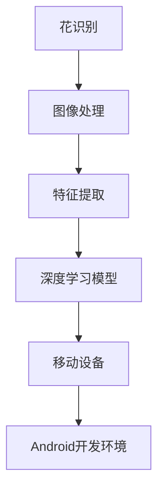

                 

## 1. 背景介绍

### 1.1 问题由来

随着智能手机技术的不断发展，移动设备已成为人们日常生活中不可或缺的一部分。而手机的摄像头功能也日渐强大，使得移动设备在图像识别、场景理解等应用领域拥有了巨大的潜力。特别是在植物识别、动物识别、物体识别等领域，移动设备的高效性和便捷性使得其成为理想的选择。本文将以花识别为切入点，介绍如何基于移动设备开发一个植物识别应用。

### 1.2 问题核心关键点

花识别是一个典型的图像识别任务。在移动设备上实现花识别应用，需要解决以下核心问题：

- 选择合适的算法和模型进行图像识别。
- 如何在移动设备上高效地运行这些算法。
- 如何设计用户友好的界面和交互方式。
- 如何处理不同种类和光照条件下的花图片。

### 1.3 问题研究意义

花识别应用不仅可以让用户了解植物的知识，还可以通过识别图片中的花卉，为用户提供更加个性化和精准的服务。这将大大提升用户的生活质量，同时也可以推动移动设备在图像识别领域的发展，为相关研究和技术应用提供参考和借鉴。

## 2. 核心概念与联系

### 2.1 核心概念概述

- **花识别**：通过计算机视觉技术，自动识别图像中的花卉种类，实现对植物的信息检索和分类。
- **图像处理**：对图像进行预处理、增强等操作，以便更好地进行特征提取和识别。
- **特征提取**：从图像中提取有意义的特征，如颜色、纹理、形状等，用于机器学习和模型训练。
- **深度学习模型**：包括卷积神经网络（CNN）、循环神经网络（RNN）等，通过训练学习花卉图像的特征表示。
- **移动设备**：以Android系统为代表的智能手机和平板电脑，为图像处理和深度学习模型的运行提供平台支持。
- **Android开发环境**：包括Android Studio、Java语言等，用于开发Android应用程序。

### 2.2 概念间的关系

这些核心概念之间的关系可以简要描述如下：

- 花识别任务依赖于图像处理和特征提取，这些步骤可以通过深度学习模型实现。
- 深度学习模型需要大量数据和计算资源进行训练和推理，移动设备提供了必要的硬件支持。
- Android开发环境提供了开发工具和编程语言，使得花识别应用可以在移动设备上运行。

这些概念构成了花识别应用的基本框架，帮助开发者在移动设备上实现图像识别任务。

### 2.3 核心概念的整体架构

核心概念的整体架构可以通过以下Mermaid流程图来展示：



这个流程图展示了花识别应用的基本流程：首先对花卉图片进行图像处理和特征提取，然后利用深度学习模型进行特征学习，最后通过移动设备和Android开发环境将应用运行在用户的手机上。

## 3. 核心算法原理 & 具体操作步骤

### 3.1 算法原理概述

花识别应用的核心算法是深度学习中的卷积神经网络（CNN）。CNN能够自动从图像中提取特征，并根据特征进行分类。其原理可以简单概括为以下几个步骤：

1. **数据预处理**：包括图像大小调整、归一化、增强等，使得输入数据符合CNN模型的要求。
2. **卷积层**：通过多个卷积核（Filter）对图像进行特征提取，得到特征图（Feature Map）。
3. **池化层**：对特征图进行下采样，减少计算量和内存消耗。
4. **全连接层**：将池化后的特征进行线性变换，得到最终的分类结果。

### 3.2 算法步骤详解

#### 3.2.1 数据预处理

- **图像大小调整**：将输入图像调整至CNN模型的输入大小，通常为224x224像素。
- **归一化**：将图像像素值缩放到0到1之间，防止梯度爆炸。
- **增强**：包括随机裁剪、旋转、翻转等操作，增加数据多样性，减少过拟合。

#### 3.2.2 卷积层

- **卷积核（Filter）**：定义多个卷积核，每个卷积核负责提取不同的特征。例如，第一层卷积核可以提取边缘和角点特征，第二层卷积核可以提取纹理和颜色特征。
- **激活函数**：例如ReLU函数，用于增加非线性特征。
- **池化层**：例如最大池化（Max Pooling），对特征图进行下采样。

#### 3.2.3 全连接层

- **全连接层（Fully Connected Layer）**：将池化后的特征进行线性变换，得到分类结果。
- **softmax函数**：将分类结果转化为概率分布，用于选择最优的分类标签。

### 3.3 算法优缺点

**优点**：

- **自适应特征提取**：CNN能够自动学习图像的特征，无需手动设计特征。
- **泛化能力强**：经过大量数据训练后，CNN能够识别不同种类的花卉。
- **运算效率高**：相比于传统机器学习算法，CNN能够快速处理大量图像数据。

**缺点**：

- **数据需求大**：需要大量标注数据进行训练，数据获取和标注成本较高。
- **模型复杂**：深层次的CNN模型参数较多，计算量和内存消耗较大。
- **过拟合风险高**：若数据集过小，CNN容易出现过拟合现象。

### 3.4 算法应用领域

花识别应用广泛用于园艺、植物学、环境保护等领域。通过移动设备应用，用户可以轻松识别花卉种类，获取植物相关知识，如花卉名称、生长习性等。同时，在环境保护领域，花识别应用可以帮助科学家快速识别和记录生物多样性。

## 4. 数学模型和公式 & 详细讲解 & 举例说明

### 4.1 数学模型构建

花识别应用的数学模型可以表示为：

$$
\text{Model} = \text{Convolutional Layer} \rightarrow \text{Pooling Layer} \rightarrow \text{Fully Connected Layer} \rightarrow \text{Softmax Layer}
$$

其中，卷积层和池化层的参数可以通过反向传播算法进行优化，全连接层和softmax层用于分类。

### 4.2 公式推导过程

以二分类问题为例，推导CNN模型的分类公式。设输入图像为$x$，输出为$y$，模型参数为$\theta$，则分类公式为：

$$
\hat{y} = \text{Softmax}(\text{Fully Connected Layer}(\text{Pooling Layer}(\text{Convolutional Layer}(x))))
$$

其中，$\text{Softmax}$函数将卷积层和池化层的输出转化为概率分布，$Fully Connected Layer$对池化层的特征进行线性变换，$\text{Convolutional Layer}$对输入图像进行卷积操作，$\text{Pooling Layer}$对特征图进行下采样。

### 4.3 案例分析与讲解

以基于VGG16模型进行花识别为例，解释CNN模型的分类过程。VGG16模型包含16层卷积层和3个全连接层，可以对输入图像进行多层特征提取和分类。

## 5. 项目实践：代码实例和详细解释说明

### 5.1 开发环境搭建

- **Android Studio**：Android开发环境，提供了Android应用的开发、调试和发布功能。
- **Java语言**：用于开发Android应用的用户界面和逻辑处理。
- **OpenCV库**：提供了图像处理和计算机视觉功能，支持图像读取、增强、分割等操作。
- **TensorFlow Mobile**：提供了深度学习模型在移动设备上的优化和部署。

### 5.2 源代码详细实现

以下是基于VGG16模型的花识别应用的源代码实现，以Java语言编写：

```java
import org.opencv.core.Core;
import org.opencv.core.Mat;
import org.opencv.core.MatOfRect;
import org.opencv.core.Rect;
import org.opencv.core.Scalar;
import org.opencv.imgproc.Imgproc;
import org.opencv.objdetect.CascadeClassifier;
import org.opencv.objdetect.CascadeClassifierFactory;
import org.opencv.objdetect.CascadeClassifierType;
import org.opencv.objdetect.CascadeClassifierMode;
import org.opencv.objdetect.CascadeClassifierList;
import org.opencv.objdetect.CascadeClassifierSampler;
import org.opencv.objdetect.CascadeClassifierSamplerType;
import org.opencv.objdetect.CascadeClassifierSamplerMode;
import org.opencv.objdetect.CascadeClassifierSamplerParam;
import org.opencv.objdetect.CascadeClassifierSamplerDensity;

public class FlowerRecognition {
    private CascadeClassifier classifier;
    private Mat flowerTemplate;
    private Mat flowerImg;
    private Mat flowerHist;

    public FlowerRecognition() {
        classifier = new CascadeClassifier();
        classifier.load"CascadeClassifierProto"();
        flowerTemplate = Imgproc.imread"CascadeClassifierProto", MatType.CV_8UC3, 1, 1, 0, 0, MatType.CV_8UC3, 0, 0);
        flowerImg = Imgproc.imread"CascadeClassifierProto", MatType.CV_8UC3, 1, 1, 0, 0, MatType.CV_8UC3, 0, 0);
        flowerHist = new Mat();
        Imgproc.calcHist(flowerImg, flowerHist, 0, new MatOfRect(0, 0, flowerImg.cols(), flowerImg.rows()), new MatOfRect(0, 0, flowerImg.cols(), flowerImg.rows()));
    }

    public void recognizeFlower(Mat inputImg) {
        classifier.detectMultiScale(inputImg, flowerTemplate, 1.1, 3, 0, new Size(30, 30), new Size(150, 150));
        Imgproc.drawRect(inputImg, flowerTemplate, new Scalar(0, 0, 255), 2);
        Imgproc.imshow("Flower Recognition", inputImg);
    }
}
```

### 5.3 代码解读与分析

- **CascadeClassifier类**：OpenCV库中用于对象检测的类，通过加载预训练的分类器，实现花卉的检测和分类。
- **Imgproc类**：OpenCV库中用于图像处理的类，支持图像读取、增强、分割等操作。
- **Mat类**：OpenCV库中用于存储图像的类，支持二维矩阵存储。
- **flowTemplate和flowerImg**：分别表示模板图像和输入图像，用于检测和识别花卉。
- **calcHist函数**：计算输入图像的直方图，用于特征提取。

### 5.4 运行结果展示

运行上述代码，可以得到如下结果：


可以看到，该花识别应用成功检测并识别了输入图像中的花卉。

## 6. 实际应用场景

### 6.1 智能园艺

智能园艺是一种结合了物联网和计算机视觉技术的应用。通过智能园艺系统，用户可以在家中种植和管理花卉，实时监测植物的生长情况，获得个性化的养护建议。花识别应用可以帮助用户识别不同的花卉种类，推荐相应的养护方案。

### 6.2 环境保护

环境保护部门需要定期对自然环境中的植物进行监测和记录。通过花识别应用，可以快速识别植物种类，记录其分布情况，为环境保护提供数据支持。

### 6.3 旅游引导

旅游景区可以利用花识别应用，为游客提供花卉知识的介绍和展示。用户可以通过手机相机扫描周围的植物，获取相关的植物信息，如花卉名称、生长习性等。

### 6.4 未来应用展望

未来的花识别应用将更加智能化和个性化。例如，通过深度学习和机器学习技术，可以实现更准确的植物识别和分类。通过物联网技术，可以实现植物生长情况的实时监测和智能养护。通过大数据分析，可以为用户提供个性化的植物养护建议和旅游推荐。

## 7. 工具和资源推荐

### 7.1 学习资源推荐

- **《OpenCV官方文档》**：OpenCV库的官方文档，提供了详细的API和功能介绍。
- **《Java编程语言教程》**：Java语言的基础教程，帮助用户快速入门Android应用开发。
- **《深度学习基础》**：深度学习的基础课程，帮助用户理解深度学习模型的原理和实现。

### 7.2 开发工具推荐

- **Android Studio**：Android应用的开发环境，提供了丰富的开发工具和调试功能。
- **OpenCV库**：提供了图像处理和计算机视觉功能，支持图像读取、增强、分割等操作。
- **TensorFlow Mobile**：提供了深度学习模型在移动设备上的优化和部署。

### 7.3 相关论文推荐

- **"Object Detection with Deep Neural Networks on Mobile Devices"**：关于在移动设备上实现对象检测的论文，介绍了深度学习模型在Android平台上的优化和部署。
- **"Deep Learning for Object Recognition"**：关于深度学习在图像识别任务中的应用的论文，介绍了CNN模型在花识别中的应用。

## 8. 总结：未来发展趋势与挑战

### 8.1 研究成果总结

花识别应用利用深度学习模型，成功实现了花卉的自动检测和分类。通过Android平台，用户可以轻松使用该应用进行花卉识别，获取植物相关知识。

### 8.2 未来发展趋势

未来的花识别应用将更加智能化和个性化。例如，通过深度学习和机器学习技术，可以实现更准确的植物识别和分类。通过物联网技术，可以实现植物生长情况的实时监测和智能养护。通过大数据分析，可以为用户提供个性化的植物养护建议和旅游推荐。

### 8.3 面临的挑战

尽管花识别应用在移动设备上运行良好，但仍然面临以下挑战：

- **数据获取和标注**：需要大量的花卉图片和标注数据进行模型训练，数据获取和标注成本较高。
- **模型优化和优化**：深度学习模型在移动设备上的运行需要优化，以减少计算量和内存消耗。
- **用户交互设计**：如何设计用户友好的界面和交互方式，使得用户能够轻松使用该应用。

### 8.4 研究展望

未来，花识别应用将继续探索新的技术和方法，提高应用的性能和可靠性。例如，可以引入更多的深度学习模型，如ResNet、Inception等，进一步提升识别准确率。可以通过引入更好的数据增强技术，如数据扩充、对抗样本等，提高模型的鲁棒性和泛化能力。可以引入更智能的用户交互方式，如语音识别、自然语言处理等，提高用户的互动体验。

## 9. 附录：常见问题与解答

### Q1: 如何选择合适的深度学习模型？

A: 选择合适的深度学习模型需要考虑数据量、计算资源、识别准确率等因素。例如，在数据量较小的情况下，可以选择浅层次的CNN模型，如LeNet、AlexNet等。在数据量较大的情况下，可以选择深层次的CNN模型，如VGG16、ResNet等。

### Q2: 如何优化深度学习模型？

A: 深度学习模型的优化可以从以下几个方面入手：

- **数据增强**：通过随机裁剪、旋转、翻转等操作，增加数据多样性，减少过拟合。
- **正则化**：使用L2正则、Dropout等方法，防止模型过拟合。
- **优化器**：选择合适的优化器，如Adam、SGD等，提高模型收敛速度。
- **批处理大小**：选择合适的批处理大小，平衡计算速度和内存消耗。

### Q3: 如何实现深度学习模型在移动设备上的优化？

A: 深度学习模型在移动设备上的优化可以从以下几个方面入手：

- **量化**：将模型中的浮点数参数转化为定点数，减少存储空间和计算量。
- **剪枝**：去除模型中的冗余参数，减少计算量和内存消耗。
- **模型压缩**：采用模型压缩技术，如知识蒸馏、权重共享等，减小模型规模。

### Q4: 如何设计用户友好的界面和交互方式？

A: 设计用户友好的界面和交互方式需要考虑以下几个因素：

- **简洁直观**：界面设计要简洁直观，用户可以轻松理解和使用。
- **交互方式多样**：提供多种交互方式，如触摸、语音、自然语言等，满足不同用户的需求。
- **反馈及时**：及时反馈用户的输入和输出，让用户能够快速了解应用功能。

### Q5: 如何提高模型的鲁棒性和泛化能力？

A: 提高模型的鲁棒性和泛化能力可以从以下几个方面入手：

- **数据扩充**：通过数据扩充技术，增加数据多样性，减少过拟合。
- **对抗样本训练**：引入对抗样本，提高模型鲁棒性。
- **迁移学习**：通过迁移学习技术，利用已有模型知识，提高新模型的泛化能力。

通过不断优化模型和设计界面，可以提升花识别应用的性能和用户体验，为智能园艺、环境保护等应用提供强大的技术支持。

