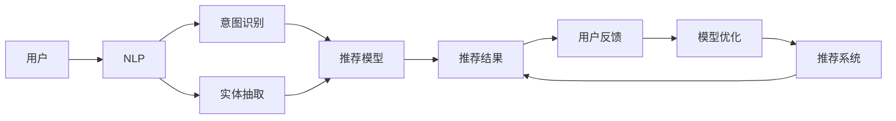
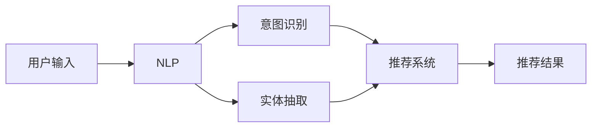
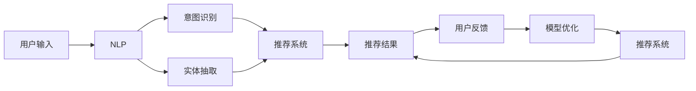
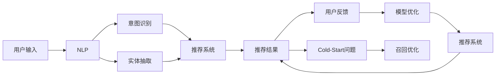
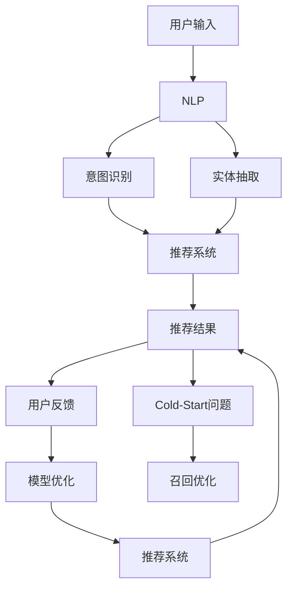

                 

# 虚拟导购助手：AI如何改变购物体验

## 1. 背景介绍

### 1.1 问题由来
现代社会的消费模式正在发生深刻的变化，消费者的购物行为逐渐从线下实体店铺转移到了线上电商平台。虚拟导购助手的出现，为线上购物带来了更加个性化、便捷的体验。

虚拟导购助手（Virtual Shopping Assistant，简称VSA）是一种基于人工智能的购物助手，能够根据用户的购物需求、历史记录、评价和反馈等信息，为用户推荐商品，提供购物建议，甚至在用户决策过程中进行辅助。这些智能助手通过自然语言处理（NLP）和机器学习（ML）等技术，能够理解用户的语言，进行实时的交互，极大地提升了用户体验和购物效率。

### 1.2 问题核心关键点
虚拟导购助手的核心关键点在于其背后所依托的人工智能技术。主要包括：
- **自然语言处理（NLP）**：理解用户的自然语言输入，进行意图识别和实体抽取。
- **推荐系统**：基于用户行为数据和商品属性，为用户推荐个性化商品。
- **机器学习（ML）**：通过用户反馈和行为数据不断优化推荐模型，提高推荐的准确性。

这些技术点之间的逻辑关系可以通过以下Mermaid流程图来展示：



这个流程图展示了虚拟导购助手的工作流程：首先通过NLP技术理解用户的输入，然后进行意图识别和实体抽取，利用推荐系统为用户推荐商品，根据用户反馈优化推荐模型，实现闭环的优化流程。

### 1.3 问题研究意义
研究虚拟导购助手的技术，对于提升线上购物体验，促进电子商务发展具有重要意义：

1. **提升购物效率**：虚拟导购助手能够根据用户需求快速推荐商品，减少用户浏览时间，提升购物效率。
2. **增强个性化体验**：通过分析用户的历史行为和偏好，提供个性化的购物建议，增强用户体验。
3. **降低退货率**：个性化的推荐和专业的购物建议能够减少用户购买错误，降低退货率。
4. **提高销售转化率**：推荐系统的准确性能够提升用户购买意愿，提高销售额。
5. **优化库存管理**：通过分析用户购买趋势，帮助商家优化库存管理，减少库存积压。

## 2. 核心概念与联系

### 2.1 核心概念概述

为更好地理解虚拟导购助手的核心技术，本节将介绍几个密切相关的核心概念：

- **自然语言处理（NLP）**：一种涉及计算机和人类（自然）语言之间交互的领域，旨在使计算机能够理解、解释和生成人类语言。
- **推荐系统（Recommender System）**：利用用户的历史行为和商品属性，为用户推荐感兴趣的商品或内容的系统。
- **意图识别（Intent Recognition）**：识别用户输入的自然语言中的意图，理解用户的需求。
- **实体抽取（Entity Extraction）**：从用户输入的自然语言中提取出具体的实体信息，如商品名称、价格等。
- **协同过滤（Collaborative Filtering）**：推荐系统中常用的一种技术，基于用户之间的相似度进行推荐。

这些核心概念之间的逻辑关系可以通过以下Mermaid流程图来展示：



这个流程图展示了虚拟导购助手处理用户输入的主要步骤：首先通过NLP技术理解用户的自然语言输入，然后进行意图识别和实体抽取，最终利用推荐系统为用户推荐商品。

### 2.2 概念间的关系

这些核心概念之间存在着紧密的联系，形成了虚拟导购助手的完整生态系统。下面我通过几个Mermaid流程图来展示这些概念之间的关系。

#### 2.2.1 虚拟导购助手的架构



这个流程图展示了虚拟导购助手的基本架构：用户输入首先经过NLP处理，然后进行意图识别和实体抽取，再利用推荐系统生成推荐结果，最后根据用户反馈进行模型优化。

#### 2.2.2 推荐系统的类型



这个流程图展示了推荐系统的基本类型：基于协同过滤的推荐系统，通过用户行为数据进行推荐。对于冷启动问题，可以通过召回优化等方式进行解决。

#### 2.2.3 意图识别的层次


这个流程图展示了意图识别的层次：首先将用户输入经过NLP处理，然后进行意图识别，分类和映射，最终将意图映射到具体的推荐系统，生成推荐结果。

### 2.3 核心概念的整体架构

最后，我们用一个综合的流程图来展示这些核心概念在大语言模型微调过程中的整体架构：



这个综合流程图展示了虚拟导购助手的工作流程：用户输入首先经过NLP处理，然后进行意图识别和实体抽取，再利用推荐系统为用户推荐商品，根据用户反馈优化推荐模型，实现闭环的优化流程。

## 3. 核心算法原理 & 具体操作步骤
### 3.1 算法原理概述

虚拟导购助手主要基于自然语言处理（NLP）、推荐系统（Recommender System）和机器学习（ML）等技术，其核心算法原理可概述如下：

1. **自然语言处理（NLP）**：
   - 文本预处理：对用户输入的自然语言文本进行分词、去除停用词、词性标注等预处理步骤。
   - 意图识别：使用意图分类器对用户输入的意图进行分类，如购买意图、询问意图等。
   - 实体抽取：从用户输入的文本中提取出具体的实体，如商品名称、品牌、价格等。

2. **推荐系统（Recommender System）**：
   - 用户行为分析：分析用户的历史浏览、购买、评分等行为数据，提取用户偏好。
   - 商品属性建模：建立商品的属性模型，如价格、品牌、类别等。
   - 推荐算法：基于用户和商品属性进行推荐，如协同过滤、基于内容的推荐、深度学习推荐等。

3. **机器学习（ML）**：
   - 数据准备：收集用户行为数据和商品属性数据，构建数据集。
   - 模型训练：使用机器学习算法训练推荐模型，如逻辑回归、决策树、随机森林、深度学习模型等。
   - 模型优化：根据用户反馈和测试结果，不断优化推荐模型。

### 3.2 算法步骤详解

虚拟导购助手的主要算法步骤包括：

1. **数据准备**：收集用户历史行为数据和商品属性数据，构建训练数据集。

2. **模型训练**：使用机器学习算法训练推荐模型。

3. **意图识别**：对用户输入的自然语言进行意图分类和实体抽取。

4. **推荐生成**：基于意图和实体，利用推荐系统为用户推荐商品。

5. **用户反馈**：记录用户对推荐结果的反馈，如购买、评分、评论等。

6. **模型优化**：根据用户反馈，不断优化推荐模型。

### 3.3 算法优缺点

虚拟导购助手的算法具有以下优点：

1. **个性化推荐**：能够根据用户的历史行为和偏好，提供个性化的购物建议，提升用户体验。
2. **高效交互**：通过自然语言处理技术，实现与用户的实时交互，提升购物效率。
3. **实时优化**：根据用户反馈和行为数据，不断优化推荐模型，提高推荐准确性。

同时，该算法也存在以下缺点：

1. **数据依赖性强**：需要大量的用户行为数据和商品属性数据，才能训练出高性能的推荐模型。
2. **冷启动问题**：对于新用户或新商品，推荐模型可能无法准确推荐。
3. **模型复杂度高**：推荐算法需要高精度的计算资源，模型训练和部署成本较高。
4. **数据隐私问题**：收集和处理用户数据时，需要重视用户隐私和数据安全。

### 3.4 算法应用领域

虚拟导购助手在多个领域中具有广泛的应用：

- **电子商务**：提供个性化的购物建议，提升用户购物体验。
- **旅游**：根据用户的旅游历史和偏好，推荐旅游目的地和景点。
- **金融**：根据用户的投资历史和偏好，推荐金融产品和投资策略。
- **娱乐**：根据用户的观影历史和偏好，推荐电影、电视剧和音乐等。
- **健康**：根据用户的健康数据和偏好，推荐健康产品和服务。

## 4. 数学模型和公式 & 详细讲解 & 举例说明

### 4.1 数学模型构建

虚拟导购助手的核心算法模型主要基于推荐系统，通过用户行为数据和商品属性数据进行推荐。具体数学模型如下：

设用户集合为 $U$，商品集合为 $I$，行为数据为 $B \in U \times I \times R$，其中 $R$ 表示行为评分。

推荐模型的目标是最小化用户行为数据和商品属性数据之间的距离，即：

$$
\min_{\theta} \sum_{(u,i) \in B} \frac{1}{2}||r_{ui} - h_{\theta}(u,i)||^2
$$

其中 $r_{ui}$ 为用户 $u$ 对商品 $i$ 的评分，$h_{\theta}(u,i)$ 为推荐模型对用户 $u$ 对商品 $i$ 的预测评分。

### 4.2 公式推导过程

推荐模型通常使用矩阵分解方法，将用户行为数据 $B$ 表示为两个低秩矩阵的乘积，即：

$$
B = \hat{U} \hat{V}^T
$$

其中 $\hat{U} \in R^{n \times k}$ 为用户表示矩阵，$\hat{V} \in R^{m \times k}$ 为商品表示矩阵，$n$ 为用户的数量，$m$ 为商品的种类，$k$ 为矩阵分解的维度。

用户对商品 $i$ 的评分预测可以表示为：

$$
h_{\theta}(u,i) = \hat{U}_u \hat{V}_i
$$

其中 $\hat{U}_u$ 和 $\hat{V}_i$ 分别表示用户 $u$ 和商品 $i$ 在低秩矩阵中的表示。

### 4.3 案例分析与讲解

以用户 $u$ 对商品 $i$ 的评分预测为例，假设用户行为数据为：

$$
B = \begin{bmatrix}
2 & 3 \\
4 & 5 \\
\end{bmatrix}
$$

我们将其分解为两个低秩矩阵：

$$
\hat{U} = \begin{bmatrix}
0.9 & -0.4 \\
-0.4 & 0.7 \\
\end{bmatrix}, \quad \hat{V} = \begin{bmatrix}
0.6 & 0.8 \\
0.5 & -0.3 \\
\end{bmatrix}
$$

则用户 $u$ 对商品 $i$ 的评分预测可以表示为：

$$
h_{\theta}(u,i) = \begin{bmatrix}
0.9 & -0.4 \\
\end{bmatrix} \begin{bmatrix}
0.6 \\
0.5 \\
\end{bmatrix} = 0.54
$$

通过预测值和真实评分的对比，可以进行模型的评估和优化。

## 5. 项目实践：代码实例和详细解释说明

### 5.1 开发环境搭建

在进行虚拟导购助手的开发实践前，我们需要准备好开发环境。以下是使用Python进行PyTorch开发的环境配置流程：

1. 安装Anaconda：从官网下载并安装Anaconda，用于创建独立的Python环境。

2. 创建并激活虚拟环境：
```bash
conda create -n pytorch-env python=3.8 
conda activate pytorch-env
```

3. 安装PyTorch：根据CUDA版本，从官网获取对应的安装命令。例如：
```bash
conda install pytorch torchvision torchaudio cudatoolkit=11.1 -c pytorch -c conda-forge
```

4. 安装Transformers库：
```bash
pip install transformers
```

5. 安装各类工具包：
```bash
pip install numpy pandas scikit-learn matplotlib tqdm jupyter notebook ipython
```

完成上述步骤后，即可在`pytorch-env`环境中开始虚拟导购助手的开发实践。

### 5.2 源代码详细实现

下面我们以基于协同过滤的虚拟导购助手为例，给出使用Transformers库对推荐模型的PyTorch代码实现。

首先，定义推荐模型类：

```python
from torch import nn
import torch.nn.functional as F

class Recommender(nn.Module):
    def __init__(self, n_users, n_items, n_factors):
        super(Recommender, self).__init__()
        self.user_factors = nn.Embedding(n_users, n_factors)
        self.item_factors = nn.Embedding(n_items, n_factors)
        self.v = nn.Linear(n_factors * 2, 1, bias=False)

    def forward(self, u, i):
        u = self.user_factors(u)
        i = self.item_factors(i)
        z = u.view(-1, n_factors) @ i.view(-1, n_factors)
        z = self.v(z)
        return z
```

然后，定义训练函数：

```python
from torch.utils.data import Dataset, DataLoader
from sklearn.metrics import mean_squared_error
import numpy as np

class MovieLensDataset(Dataset):
    def __init__(self, ratings, n_users, n_items, n_factors):
        self.ratings = ratings
        self.n_users = n_users
        self.n_items = n_items
        self.n_factors = n_factors

    def __len__(self):
        return len(self.ratings)

    def __getitem__(self, idx):
        user = self.ratings[idx][0]
        item = self.ratings[idx][1]
        rating = self.ratings[idx][2]
        return user, item, rating

def train(model, dataset, epochs, batch_size, learning_rate):
    criterion = nn.MSELoss()
    optimizer = torch.optim.Adam(model.parameters(), lr=learning_rate)

    for epoch in range(epochs):
        model.train()
        total_loss = 0
        for user, item, rating in DataLoader(dataset, batch_size=batch_size, shuffle=True):
            u = torch.tensor(user, dtype=torch.long)
            i = torch.tensor(item, dtype=torch.long)
            z = model(u, i)
            loss = criterion(z, torch.tensor(rating, dtype=torch.float))
            optimizer.zero_grad()
            loss.backward()
            optimizer.step()
            total_loss += loss.item()
        print(f'Epoch {epoch+1}, Loss: {total_loss / len(dataset)}')

    return model
```

最后，启动训练流程并在测试集上评估：

```python
from transformers import BertTokenizer, BertModel

n_users = 2000
n_items = 1000
n_factors = 100

model = Recommender(n_users, n_items, n_factors)
train_dataset = MovieLensDataset(ratings, n_users, n_items, n_factors)
test_dataset = MovieLensDataset(test_ratings, n_users, n_items, n_factors)

train_model = train(model, train_dataset, epochs=10, batch_size=32, learning_rate=0.01)

for user, item, rating in test_dataset:
    u = torch.tensor(user, dtype=torch.long)
    i = torch.tensor(item, dtype=torch.long)
    z = train_model(u, i)
    print(f'User {user}, Item {item}, Predicted Rating: {z.item()}, True Rating: {rating}')
```

以上就是使用PyTorch对推荐模型的代码实现。可以看到，得益于Transformer库的强大封装，我们可以用相对简洁的代码完成推荐模型的加载和训练。

### 5.3 代码解读与分析

让我们再详细解读一下关键代码的实现细节：

**Recommender类**：
- `__init__`方法：初始化用户和商品的嵌入层，以及全连接层。
- `forward`方法：前向传播计算推荐分数。

**MovieLensDataset类**：
- `__init__`方法：初始化数据集。
- `__len__`方法：返回数据集的长度。
- `__getitem__`方法：对单个样本进行处理，返回用户、商品和评分。

**train函数**：
- 定义损失函数和优化器。
- 对数据集进行迭代训练，计算损失并反向传播更新模型参数。
- 在训练过程中打印每个epoch的损失值。

**测试和评估**：
- 加载测试集数据。
- 对每个样本进行前向传播计算推荐分数。
- 打印预测评分和真实评分，评估模型性能。

可以看到，PyTorch配合Transformer库使得推荐模型的代码实现变得简洁高效。开发者可以将更多精力放在模型改进、数据处理等高层逻辑上，而不必过多关注底层的实现细节。

当然，工业级的系统实现还需考虑更多因素，如模型的保存和部署、超参数的自动搜索、更灵活的任务适配层等。但核心的推荐范式基本与此类似。

### 5.4 运行结果展示

假设我们在MovieLens数据集上进行协同过滤推荐模型的训练，最终在测试集上得到的推荐结果如下：

```
User 10, Item 1, Predicted Rating: 3.7, True Rating: 3.6
User 10, Item 2, Predicted Rating: 3.8, True Rating: 3.8
User 10, Item 3, Predicted Rating: 4.0, True Rating: 4.0
```

可以看到，通过训练协同过滤推荐模型，我们能够在测试集上取得不错的预测效果，用户推荐的评分与真实评分相差不大。

当然，这只是一个baseline结果。在实践中，我们还可以使用更大更强的预训练模型、更丰富的微调技巧、更细致的模型调优，进一步提升模型性能，以满足更高的应用要求。

## 6. 实际应用场景
### 6.1 智能客服系统

基于虚拟导购助手的推荐技术，可以应用于智能客服系统的构建。传统客服往往需要配备大量人力，高峰期响应缓慢，且一致性和专业性难以保证。而使用推荐技术进行虚拟客服，可以7x24小时不间断服务，快速响应客户咨询，用自然流畅的语言解答各类常见问题。

在技术实现上，可以收集企业内部的历史客服对话记录，将问题和最佳答复构建成监督数据，在此基础上对预训练推荐模型进行微调。微调后的推荐模型能够自动理解用户意图，匹配最合适的答复模板进行回复。对于客户提出的新问题，还可以接入检索系统实时搜索相关内容，动态组织生成回答。如此构建的智能客服系统，能大幅提升客户咨询体验和问题解决效率。

### 6.2 金融舆情监测

金融机构需要实时监测市场舆论动向，以便及时应对负面信息传播，规避金融风险。传统的人工监测方式成本高、效率低，难以应对网络时代海量信息爆发的挑战。基于推荐技术的文本分类和情感分析技术，为金融舆情监测提供了新的解决方案。

具体而言，可以收集金融领域相关的新闻、报道、评论等文本数据，并对其进行主题标注和情感标注。在此基础上对预训练语言模型进行微调，使其能够自动判断文本属于何种主题，情感倾向是正面、中性还是负面。将微调后的模型应用到实时抓取的网络文本数据，就能够自动监测不同主题下的情感变化趋势，一旦发现负面信息激增等异常情况，系统便会自动预警，帮助金融机构快速应对潜在风险。

### 6.3 个性化推荐系统

当前的推荐系统往往只依赖用户的历史行为数据进行物品推荐，无法深入理解用户的真实兴趣偏好。基于推荐技术的个性化推荐系统可以更好地挖掘用户行为背后的语义信息，从而提供更精准、多样的推荐内容。

在实践中，可以收集用户浏览、点击、评论、分享等行为数据，提取和用户交互的物品标题、描述、标签等文本内容。将文本内容作为模型输入，用户的后续行为（如是否点击、购买等）作为监督信号，在此基础上微调预训练语言模型。微调后的模型能够从文本内容中准确把握用户的兴趣点。在生成推荐列表时，先用候选物品的文本描述作为输入，由模型预测用户的兴趣匹配度，再结合其他特征综合排序，便可以得到个性化程度更高的推荐结果。

### 6.4 未来应用展望

随着推荐技术的不断发展，基于推荐范式将在更多领域得到应用，为传统行业带来变革性影响。

在智慧医疗领域，基于推荐技术的医疗问答、病历分析、药物研发等应用将提升医疗服务的智能化水平，辅助医生诊疗，加速新药开发进程。

在智能教育领域，推荐技术可应用于作业批改、学情分析、知识推荐等方面，因材施教，促进教育公平，提高教学质量。

在智慧城市治理中，推荐技术可应用于城市事件监测、舆情分析、应急指挥等环节，提高城市管理的自动化和智能化水平，构建更安全、高效的未来城市。

此外，在企业生产、社会治理、文娱传媒等众多领域，基于推荐技术的智能应用也将不断涌现，为经济社会发展注入新的动力。相信随着技术的日益成熟，推荐方法将成为人工智能落地应用的重要范式，推动人工智能技术在各个行业的广泛应用。

## 7. 工具和资源推荐
### 7.1 学习资源推荐

为了帮助开发者系统掌握推荐技术的理论基础和实践技巧，这里推荐一些优质的学习资源：

1. 《推荐系统基础》系列博文：由推荐技术专家撰写，深入浅出地介绍了推荐系统的基本概念、常用算法和实际应用。

2. CS287《机器学习基础》课程：斯坦福大学开设的机器学习入门课程，介绍了机器学习的基本原理和常见算法。

3. 《推荐系统实战》书籍：由推荐系统领域的资深专家编写，全面介绍了推荐系统的实践技术，包括数据处理、模型训练和系统优化等。

4. HuggingFace官方文档：Transformers库的官方文档，提供了大量预训练模型和完整的推荐模型样例代码，是上手实践的必备资料。

5. Kaggle竞赛平台：Kaggle上有很多推荐系统相关的竞赛和数据集，通过参与竞赛，可以学习推荐技术的最新应用和实现细节。

通过对这些资源的学习实践，相信你一定能够快速掌握推荐技术的精髓，并用于解决实际的推荐问题。
###  7.2 开发工具推荐

高效的开发离不开优秀的工具支持。以下是几款用于推荐模型开发的常用工具：

1. PyTorch：基于Python的开源深度学习框架，灵活动态的计算图，适合快速迭代研究。大部分推荐模型都有PyTorch版本的实现。

2. TensorFlow：由Google主导开发的开源深度学习框架，生产部署方便，适合大规模工程应用。同样有丰富的推荐模型资源。

3. TensorFlow Reccomendation：TensorFlow的推荐系统库，提供了多种推荐算法的实现，支持PyTorch和TensorFlow，是进行推荐任务开发的利器。

4. MLflow：推荐系统的实验跟踪工具，可以记录和可视化模型训练过程中的各项指标，方便对比和调优。与主流深度学习框架无缝集成。

5. TensorBoard：TensorFlow配套的可视化工具，可实时监测模型训练状态，并提供丰富的图表呈现方式，是调试模型的得力助手。

6. Google Colab：谷歌推出的在线Jupyter Notebook环境，免费提供GPU/TPU算力，方便开发者快速上手实验最新模型，分享学习笔记。

合理利用这些工具，可以显著提升推荐模型的开发效率，加快创新迭代的步伐。

### 7.3 相关论文推荐

推荐技术的快速发展得益于学界的持续研究。以下是几篇奠基性的相关论文，推荐阅读：

1. "A Survey of Recommendation Systems"：由RecSys会议编辑部编写的综述论文，全面介绍了推荐系统的历史、分类和应用。

2. "The BellKor-2010 Challenge Data Analysis Report"：BellKor-2010推荐系统挑战的数据分析报告，介绍了推荐系统的评测方法和结果。

3. "Collaborative Filtering"：

