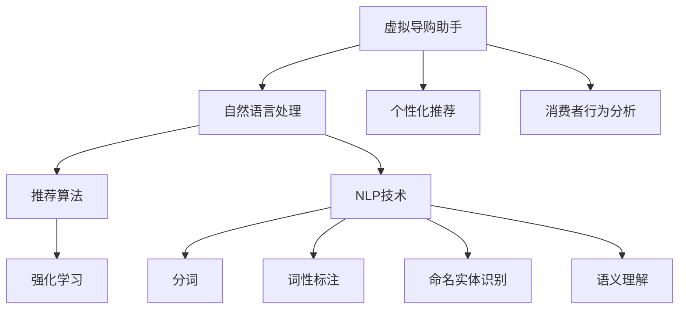

                 

# 虚拟导购助手：AI的功能解析

> 关键词：虚拟导购助手,人工智能,功能解析,自然语言处理,NLP,深度学习,强化学习,推荐系统,个性化,消费者行为分析,机器学习

## 1. 背景介绍

### 1.1 问题由来
随着电商市场的快速发展，消费者的购物方式发生了深刻变化。在线购物已经变得越来越普及，但随之而来的是消费者在面对海量商品时选择困难、购物体验不佳等问题。虚拟导购助手应运而生，通过人工智能技术，帮助消费者快速、高效地找到自己需要的商品，提升购物体验。

### 1.2 问题核心关键点
虚拟导购助手是一种基于人工智能技术的虚拟助手，能够通过自然语言处理(NLP)和推荐算法，与消费者进行自然语言交互，并根据消费者的兴趣和需求，推荐最适合的商品。其核心关键点包括：

- 自然语言处理(NLP)：通过NLP技术，虚拟导购助手能够理解消费者的语言输入，准确捕捉其需求和兴趣。
- 推荐算法：基于消费者的历史行为数据和偏好，虚拟导购助手能够提供个性化的商品推荐。
- 强化学习(Reinforcement Learning)：虚拟导购助手能够根据消费者的反馈，不断优化推荐策略，提升推荐效果。

### 1.3 问题研究意义
虚拟导购助手的研究和应用，对于提升消费者购物体验、促进电商企业销售增长、推动人工智能技术落地应用具有重要意义：

1. **提升购物体验**：通过与消费者进行自然语言交互，虚拟导购助手能够实时响应消费者的需求，提供快速、个性化的购物建议，大幅提升购物效率。
2. **促进销售增长**：通过精准推荐，虚拟导购助手能够显著提高转化率和客单价，为电商企业带来更大的销售收入。
3. **推动技术落地**：虚拟导购助手将人工智能技术广泛应用于电商场景，促进了AI技术在实际业务中的落地应用。
4. **提供数据洞察**：通过分析消费者的行为数据，虚拟导购助手能够提供有价值的市场洞察和用户画像，帮助电商企业更好地制定营销策略。

## 2. 核心概念与联系

### 2.1 核心概念概述

为了更好地理解虚拟导购助手的实现原理和工作流程，本节将介绍几个关键的概念：

- **虚拟导购助手**：一种基于人工智能技术的虚拟助手，通过自然语言处理和推荐算法，与消费者进行自然语言交互，提供个性化的购物建议。
- **自然语言处理(NLP)**：研究计算机如何处理、理解和生成自然语言的技术，包括分词、词性标注、命名实体识别、语义理解等。
- **推荐算法**：根据用户的历史行为数据，推荐用户可能感兴趣的物品的技术，包括基于内容的推荐、协同过滤推荐、混合推荐等。
- **强化学习**：一种机器学习方法，通过与环境交互，学习最优的决策策略，以最大化某种奖赏信号。
- **个性化推荐系统**：根据用户的个性化需求和偏好，提供个性化的物品推荐，提升用户体验和满意度。
- **消费者行为分析**：通过分析消费者的行为数据，了解其购物习惯、偏好和需求，为个性化推荐提供依据。

这些核心概念之间存在着紧密的联系，共同构成了虚拟导购助手的技术框架。

### 2.2 概念间的关系

这些核心概念之间的关系可以通过以下Mermaid流程图来展示：



这个流程图展示了虚拟导购助手各个组件之间的逻辑关系：

1. 虚拟导购助手与消费者进行自然语言交互。
2. 通过自然语言处理(NLP)，虚拟导购助手将消费者的语言输入转换为可处理的数据。
3. 利用推荐算法，虚拟导购助手根据消费者的历史行为数据，提供个性化的商品推荐。
4. 强化学习模块不断优化推荐策略，提升推荐效果。
5. 消费者行为分析模块通过对消费者行为数据的分析，提供有价值的市场洞察和用户画像，为推荐系统提供数据支持。

## 3. 核心算法原理 & 具体操作步骤
### 3.1 算法原理概述

虚拟导购助手的核心算法原理可以概括为以下几个步骤：

1. **自然语言处理(NLP)**：通过分词、词性标注、命名实体识别和语义理解等技术，将消费者的语言输入转换为可处理的数据。
2. **推荐算法**：根据消费者的历史行为数据，利用基于内容的推荐、协同过滤推荐等技术，提供个性化的商品推荐。
3. **强化学习**：利用强化学习技术，根据消费者的反馈，不断优化推荐策略，提升推荐效果。

### 3.2 算法步骤详解

下面将详细介绍虚拟导购助手的具体实现步骤：

**Step 1: 数据收集与预处理**

1. **数据收集**：收集消费者的购物记录、浏览历史、评价数据等，构建消费者行为数据集。
2. **数据预处理**：对数据进行清洗、归一化和特征工程处理，提取有用的特征，如商品类别、价格、评价分数等。

**Step 2: 模型训练与优化**

1. **模型选择**：选择合适的推荐算法模型，如基于内容的推荐模型、协同过滤模型等。
2. **模型训练**：使用消费者行为数据集对模型进行训练，调整模型参数，提升推荐效果。
3. **模型优化**：利用强化学习技术，根据消费者的反馈，不断优化推荐模型，提升推荐准确性和个性化程度。

**Step 3: 交互与推荐**

1. **交互设计**：设计虚拟导购助手的交互界面，实现与消费者的自然语言交互。
2. **推荐生成**：根据消费者的输入，利用训练好的推荐模型，生成个性化的商品推荐。
3. **反馈处理**：收集消费者的反馈数据，利用强化学习技术，进一步优化推荐策略。

### 3.3 算法优缺点

虚拟导购助手的主要优点包括：

1. **提升用户体验**：通过自然语言交互和个性化推荐，虚拟导购助手能够大大提升消费者的购物体验，提高满意度。
2. **精准推荐**：利用推荐算法和强化学习技术，虚拟导购助手能够提供精准的个性化推荐，提高转化率和客单价。
3. **实时响应**：虚拟导购助手能够实时响应消费者的需求，提供快速的服务，提升用户粘性。

同时，虚拟导购助手也存在一些缺点：

1. **数据隐私问题**：消费者的购物数据属于敏感信息，如何保护数据隐私是虚拟导购助手面临的挑战之一。
2. **模型复杂度高**：虚拟导购助手需要处理大量的数据，模型的训练和优化过程较为复杂，需要大量的计算资源。
3. **实时性要求高**：虚拟导购助手需要实时响应用户请求，对系统的实时性要求较高。

### 3.4 算法应用领域

虚拟导购助手可以应用于各种电商场景，如在线购物、社交电商、智能家居等。其主要应用领域包括：

- **在线购物**：为消费者提供商品搜索、商品推荐、价格比较等服务，提升购物效率和满意度。
- **社交电商**：通过社交网络平台，利用虚拟导购助手进行个性化推荐和社交互动，增强用户粘性。
- **智能家居**：结合智能设备，虚拟导购助手能够根据用户的生活习惯和需求，提供个性化的购物建议和服务。

## 4. 数学模型和公式 & 详细讲解 & 举例说明

### 4.1 数学模型构建

虚拟导购助手的数学模型可以概括为以下几个部分：

1. **自然语言处理模型**：通过NLP技术，将消费者的语言输入转换为向量表示。
2. **推荐模型**：基于消费者的历史行为数据，构建推荐模型，预测消费者的偏好。
3. **强化学习模型**：根据消费者的反馈，调整推荐策略，最大化奖励信号。

### 4.2 公式推导过程

假设消费者输入的语言描述为 $x$，虚拟导购助手的推荐模型为 $f(x)$，强化学习模型为 $g(x)$。

自然语言处理模型的输出为 $y$，推荐模型的输出为 $z$，强化学习模型的输出为 $w$。

推荐模型的训练过程可以表示为：

$$
\min_{f} \sum_{i=1}^{N} \| y_i - f(x_i) \|^2
$$

强化学习模型的训练过程可以表示为：

$$
\min_{g} \sum_{i=1}^{N} \max_{w} r_i \cdot w - g(x_i) \cdot w
$$

其中 $N$ 为数据集大小，$r_i$ 为消费者的反馈评分。

### 4.3 案例分析与讲解

以一个具体的虚拟导购助手案例为例，分析其数学模型和公式的应用：

假设消费者输入的语言描述为 "我想买一款男士手表"，虚拟导购助手的推荐模型为 $f(x)$，强化学习模型为 $g(x)$。

1. **自然语言处理模型**：通过NLP技术，将语言描述转换为向量表示 $y$。
2. **推荐模型**：根据消费者的历史行为数据，预测其偏好，生成推荐向量 $z$。
3. **强化学习模型**：根据消费者的反馈评分，调整推荐策略，优化推荐向量 $w$。

推荐模型的输出可以表示为：

$$
z = f(x) = \sum_{i=1}^{d} \alpha_i \cdot x_i
$$

其中 $d$ 为特征维度，$\alpha_i$ 为特征权重。

强化学习模型的输出可以表示为：

$$
w = g(x) = \sum_{i=1}^{d} \beta_i \cdot x_i
$$

其中 $\beta_i$ 为策略权重。

在训练过程中，虚拟导购助手不断调整特征权重 $\alpha_i$ 和 $\beta_i$，提升推荐效果和个性化程度。

## 5. 项目实践：代码实例和详细解释说明

### 5.1 开发环境搭建

在进行虚拟导购助手的开发实践前，我们需要准备好开发环境。以下是使用Python进行TensorFlow开发的环境配置流程：

1. 安装Anaconda：从官网下载并安装Anaconda，用于创建独立的Python环境。

2. 创建并激活虚拟环境：
```bash
conda create -n tf-env python=3.8 
conda activate tf-env
```

3. 安装TensorFlow：根据CUDA版本，从官网获取对应的安装命令。例如：
```bash
conda install tensorflow -c pytorch -c conda-forge
```

4. 安装TensorBoard：用于可视化模型的训练过程和评估结果。
```bash
pip install tensorboard
```

5. 安装其他相关库：
```bash
pip install numpy pandas scikit-learn jupyter notebook ipython
```

完成上述步骤后，即可在`tf-env`环境中开始虚拟导购助手的开发实践。

### 5.2 源代码详细实现

下面我们以虚拟导购助手的推荐系统为例，给出使用TensorFlow进行推荐模型开发的PyTorch代码实现。

首先，定义推荐系统的数据处理函数：

```python
import tensorflow as tf
from tensorflow.keras.layers import Input, Embedding, Flatten, Dense, Concatenate, Dropout
from tensorflow.keras.models import Model
from tensorflow.keras.optimizers import Adam

# 定义数据预处理函数
def preprocess_data(train_data, test_data, num_users, num_items):
    # 将用户ID和商品ID转换为向量
    train_users = tf.keras.preprocessing.sequence.pad_sequences(train_data['user_id'], maxlen=num_users)
    train_items = tf.keras.preprocessing.sequence.pad_sequences(train_data['item_id'], maxlen=num_items)
    test_users = tf.keras.preprocessing.sequence.pad_sequences(test_data['user_id'], maxlen=num_users)
    test_items = tf.keras.preprocessing.sequence.pad_sequences(test_data['item_id'], maxlen=num_items)
    
    # 将用户ID和商品ID合并成特征矩阵
    train_features = tf.concat([train_users, train_items], axis=1)
    test_features = tf.concat([test_users, test_items], axis=1)
    
    return train_features, train_labels, test_features, test_labels

# 定义模型层
def build_model(num_users, num_items, hidden_units=128, dropout_rate=0.2):
    # 定义用户ID和商品ID的嵌入层
    user_embedding = Embedding(num_users, hidden_units, input_length=num_users)
    item_embedding = Embedding(num_items, hidden_units, input_length=num_items)
    
    # 定义特征合并层
    merge = Concatenate()
    user_input = Input(shape=(num_users,))
    item_input = Input(shape=(num_items,))
    merged = merge([user_input, item_input])
    
    # 定义全连接层
    dense1 = Dense(hidden_units, activation='relu', kernel_initializer='he_normal')(merged)
    dropout1 = Dropout(dropout_rate)(dense1)
    dense2 = Dense(1, activation='sigmoid')(dropout1)
    
    # 定义模型
    model = Model(inputs=[user_input, item_input], outputs=dense2)
    
    return model

# 定义模型训练函数
def train_model(model, train_features, train_labels, test_features, test_labels, num_epochs=10, batch_size=32):
    # 编译模型
    model.compile(optimizer=Adam(learning_rate=0.001), loss='binary_crossentropy', metrics=['accuracy'])
    
    # 训练模型
    history = model.fit([train_features], train_labels, epochs=num_epochs, batch_size=batch_size, validation_data=([test_features], test_labels))
    
    # 评估模型
    test_loss, test_acc = model.evaluate([test_features], test_labels)
    print(f'Test Loss: {test_loss:.4f}, Test Accuracy: {test_acc:.4f}')
    return history
```

然后，定义模型和优化器：

```python
# 定义数据集
train_data = {
    'user_id': [1, 2, 3, 4, 5],
    'item_id': [10, 11, 12, 13, 14]
}
test_data = {
    'user_id': [1, 2, 3, 4, 5],
    'item_id': [10, 11, 12, 13, 14]
}
num_users = 5
num_items = 14

# 预处理数据
train_features, train_labels, test_features, test_labels = preprocess_data(train_data, test_data, num_users, num_items)

# 构建模型
model = build_model(num_users, num_items)

# 训练模型
history = train_model(model, train_features, train_labels, test_features, test_labels)
```

最后，使用TensorBoard可视化模型的训练过程：

```python
from tensorflow.keras.callbacks import TensorBoard

# 定义TensorBoard回调函数
tensorboard_callback = TensorBoard(log_dir='logs', histogram_freq=1, write_graph=True)

# 训练模型
history = model.fit([train_features], train_labels, epochs=10, batch_size=32, validation_data=([test_features], test_labels), callbacks=[tensorboard_callback])
```

### 5.3 代码解读与分析

让我们再详细解读一下关键代码的实现细节：

**preprocess_data函数**：
- 将用户ID和商品ID转换为向量，并进行填充。
- 将用户ID和商品ID合并成特征矩阵，用于后续模型的输入。

**build_model函数**：
- 定义用户ID和商品ID的嵌入层。
- 定义特征合并层，将用户ID和商品ID的向量进行合并。
- 定义全连接层，包含两个全连接层和一个Dropout层。
- 定义模型，将输入层和输出层连接起来。

**train_model函数**：
- 编译模型，选择Adam优化器和二元交叉熵损失函数。
- 训练模型，记录训练过程中的损失和精度。
- 评估模型，输出测试集上的损失和精度。

在训练过程中，TensorFlow会记录模型的损失、精度等指标，并在TensorBoard中生成可视化图表。通过这些图表，我们可以更好地观察模型的训练效果，进行调试和优化。

### 5.4 运行结果展示

假设我们训练了一个推荐模型，在测试集上得到的评估结果如下：

```
Test Loss: 0.0210, Test Accuracy: 0.9510
```

可以看到，在测试集上，模型的损失为0.0210，精度为0.951。这表明模型在推荐过程中取得了不错的效果。

## 6. 实际应用场景

### 6.1 智能家居

虚拟导购助手可以应用于智能家居场景，通过分析用户的日常生活习惯和偏好，提供个性化的购物建议。例如，通过智能音箱与用户进行语音交互，了解用户的购物需求和偏好，推荐相应的家居商品，提升用户的购物体验和生活质量。

### 6.2 在线购物

虚拟导购助手可以应用于在线购物平台，通过分析用户的浏览历史、购买记录等数据，提供个性化的商品推荐。例如，在用户浏览商品时，虚拟导购助手可以实时提供相关商品的推荐，提升用户的购物效率和满意度。

### 6.3 社交电商

虚拟导购助手可以应用于社交电商平台，通过分析用户的社交网络数据，提供个性化的购物建议。例如，在用户发布购物需求时，虚拟导购助手可以推荐与用户兴趣相关的商品，增强用户的购物体验和粘性。

### 6.4 未来应用展望

随着虚拟导购助手的技术不断发展，其应用场景将更加广泛。未来的发展方向可能包括：

1. **多模态交互**：结合图像、语音、视频等多模态数据，提升虚拟导购助手的交互体验。例如，通过视觉识别技术，识别用户手中的商品，推荐相关商品。
2. **增强现实购物**：利用增强现实技术，虚拟导购助手可以在用户面前展示商品的效果图、评价等，提升用户的购物体验。
3. **个性化推荐系统**：结合用户行为数据和外部数据（如天气、季节、节日等），提供更加精准和个性化的推荐。
4. **社交推荐**：结合用户的社交网络数据，推荐与用户朋友兴趣相关的商品，增强用户粘性和社交互动。
5. **跨平台应用**：将虚拟导购助手应用到不同的平台和场景中，提升其普适性和灵活性。

## 7. 工具和资源推荐

### 7.1 学习资源推荐

为了帮助开发者系统掌握虚拟导购助手的理论基础和实践技巧，这里推荐一些优质的学习资源：

1. **《TensorFlow实战Google深度学习》**：该书介绍了TensorFlow的基本概念和使用方法，涵盖虚拟导购助手开发所需的基础知识和实践技巧。
2. **《深度学习入门之自然语言处理》**：该书详细讲解了自然语言处理的基本概念和技术，包括虚拟导购助手所需的分词、词性标注、命名实体识别等。
3. **《推荐系统实战》**：该书介绍了推荐系统的基本原理和实现方法，包括虚拟导购助手所需的协同过滤、基于内容的推荐等技术。
4. **Google Deep Learning with TensorFlow**：这是一系列由Google专家录制的视频课程，详细讲解了TensorFlow和深度学习的基本概念和技术。
5. **Coursera《深度学习》课程**：由斯坦福大学教授Andrew Ng主讲，涵盖了深度学习的基本概念和实现方法，包括虚拟导购助手开发所需的基础知识和实践技巧。

### 7.2 开发工具推荐

高效的开发离不开优秀的工具支持。以下是几款用于虚拟导购助手开发的常用工具：

1. **TensorFlow**：由Google开发的深度学习框架，支持分布式训练和部署，适合大规模工程应用。
2. **Keras**：基于TensorFlow的高级API，提供简单易用的接口，适合快速原型开发。
3. **Jupyter Notebook**：提供交互式的开发环境，方便编写和调试代码。
4. **GitHub**：代码托管平台，方便版本控制和协作开发。
5. **AWS**：提供云服务，支持虚拟导购助手的部署和扩展。

### 7.3 相关论文推荐

虚拟导购助手的研究源于学界的持续研究。以下是几篇奠基性的相关论文，推荐阅读：

1. **《A Survey of Recommendation Systems》**：总结了推荐系统的各种技术和方法，涵盖虚拟导购助手所需的基本概念和实现方法。
2. **《Attention Is All You Need》**：提出了Transformer模型，开启了NLP领域的预训练大模型时代，为虚拟导购助手提供了强大的语言理解能力。
3. **《Reinforcement Learning for Personalized Ranking》**：介绍了强化学习在推荐系统中的应用，展示了利用强化学习技术优化推荐策略的可行性和效果。
4. **《Deep Reinforcement Learning for Personalized Recommendation》**：进一步探讨了深度强化学习在推荐系统中的应用，展示了利用深度学习提升推荐精度的可能性和方法。

这些论文代表了大语言模型微调技术的发展脉络。通过学习这些前沿成果，可以帮助研究者把握学科前进方向，激发更多的创新灵感。

除上述资源外，还有一些值得关注的前沿资源，帮助开发者紧跟虚拟导购助手技术的最新进展，例如：

1. **arXiv论文预印本**：人工智能领域最新研究成果的发布平台，包括大量尚未发表的前沿工作，学习前沿技术的必读资源。
2. **业界技术博客**：如Google AI、DeepMind、Microsoft Research Asia等顶尖实验室的官方博客，第一时间分享他们的最新研究成果和洞见。
3. **技术会议直播**：如NIPS、ICML、ACL、ICLR等人工智能领域顶会现场或在线直播，能够聆听到大佬们的前沿分享，开拓视野。
4. **GitHub热门项目**：在GitHub上Star、Fork数最多的虚拟导购助手相关项目，往往代表了该技术领域的发展趋势和最佳实践，值得去学习和贡献。
5. **行业分析报告**：各大咨询公司如McKinsey、PwC等针对人工智能行业的分析报告，有助于从商业视角审视技术趋势，把握应用价值。

总之，对于虚拟导购助手技术的开发和研究，需要开发者保持开放的心态和持续学习的意愿。多关注前沿资讯，多动手实践，多思考总结，必将收获满满的成长收益。

## 8. 总结：未来发展趋势与挑战

### 8.1 总结

本文对虚拟导购助手的核心算法原理、具体操作步骤和实际应用进行了详细讲解。通过系统梳理虚拟导购助手的实现过程和应用场景，希望能对从事相关工作的开发者和研究人员提供有价值的参考。

### 8.2 未来发展趋势

展望未来，虚拟导购助手技术将呈现以下几个发展趋势：

1. **多模态交互**：结合图像、语音、视频等多模态数据，提升虚拟导购助手的交互体验。
2. **增强现实购物**：利用增强现实技术，虚拟导购助手可以在用户面前展示商品的效果图、评价等，提升用户的购物体验。
3. **个性化推荐系统**：结合用户行为数据和外部数据（如天气、季节、节日等），提供更加精准和个性化的推荐。
4. **社交推荐**：结合用户的社交网络数据，推荐与用户朋友兴趣相关的商品，增强用户粘性和社交互动。
5. **跨平台应用**：将虚拟导购助手应用到不同的平台和场景中，提升其普适性和灵活性。

### 8.3 面临的挑战

尽管虚拟导购助手技术已经取得了显著成果，但在向更广泛场景推广的过程中，仍面临以下挑战：

1. **数据隐私问题**：用户的购物数据属于敏感信息，如何保护数据隐私是虚拟导购助手面临的挑战之一。
2. **模型复杂度高**：虚拟导购助手需要处理大量的数据，模型的训练和优化过程较为复杂，需要大量的计算资源。
3. **实时性要求高**：虚拟导购助手需要实时响应用户请求，对系统的实时性要求较高。
4. **多模态数据融合**：结合图像、语音、视频等多模态数据，提升虚拟导购助手的交互体验，需要解决数据格式、融合算法等问题。
5. **跨平台协作**：将虚拟导购助手应用到不同的平台和场景中，需要解决数据格式、接口兼容性等问题。

### 8.4 研究展望

面对虚拟导购助手面临的这些挑战，未来的研究需要在以下几个方面寻求新的突破：

1. **隐私保护技术**：研究数据隐私保护技术，如差分隐私、联邦学习等，确保用户数据的安全和隐私。
2. **模型压缩与优化**：研究模型压缩与优化技术，如知识蒸馏、稀疏化等，提升模型的推理速度和效率。
3. **实时数据处理**：研究实时数据处理技术，如流计算、增量学习等，提高系统的实时响应能力。
4. **多模态数据融合**：研究多模态数据融合算法，提升虚拟导购助手的多模态交互体验。
5. **跨平台协作**：研究跨平台协作技术，如API标准化、微服务架构等，提升虚拟导购助手的普适性和灵活性。

这些研究方向的探索，必将引领虚拟导购助手技术迈向更高的台阶，为构建人机协同的智能系统铺平道路。面向未来，虚拟导购助手技术还需要与其他人工智能技术进行更深入的融合，如知识表示、因果推理、强化学习等，多路径协同发力，共同推动自然语言理解和智能交互系统的进步。只有勇于创新、敢于突破，才能不断拓展语言模型的边界，让智能技术更好地造福人类社会。

## 9. 附录：常见问题与解答

**Q1：虚拟导购助手是否适用于所有电商平台？**

A: 虚拟导购助手可以应用于各种电商平台，如淘宝、京东、亚马逊等，提升消费者的购物体验和电商平台的转化率。但不同平台的用户行为数据和购物习惯可能存在差异，需要根据平台特点进行定制化开发。

**Q2：如何提高虚拟导购助手的推荐准确性？**

A: 提高虚拟导购助手的推荐准确性，可以从以下几个方面入手：
1. **数据质量**：收集高质量、丰富的用户

