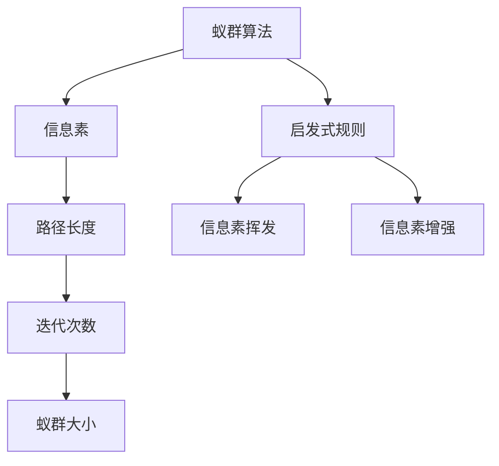
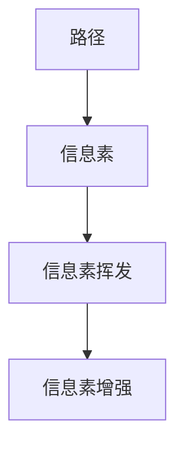
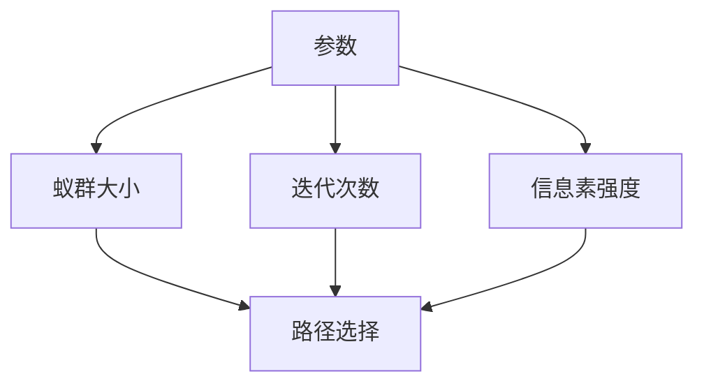
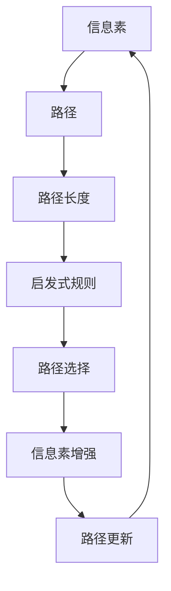

                 

## 1. 背景介绍

### 1.1 问题由来
蚁群算法（Ant Colony Optimization, ACO）是一种启发式算法，模拟蚂蚁寻找食物的行为，旨在解决优化问题。蚂蚁在寻找食物时，会释放一种叫做信息素的物质，信息素会随着时间的推移而逐渐挥发，同时也会因蚂蚁的数量和行为而增强。蚂蚁通过感知信息素强度，优先选择信息素浓度较高的路径，从而更高效地找到食物。蚁群算法将这一过程抽象化，用于解决复杂的优化问题。

蚁群算法最初由意大利学者M. Dorigo和G. Di Caro在1992年提出，后来经过不断改进，广泛应用于路径规划、任务调度、信号分配等领域。它是一种元启发式算法，通常用于求解复杂的优化问题，特别是当问题空间巨大且常规搜索方法效率低下时。

### 1.2 问题核心关键点
蚁群算法是一种基于概率的选择过程，通过信息素更新和启发式策略，迭代搜索最优解。其核心思想是通过模拟蚂蚁的群体行为，探索解空间，逐步逼近最优解。

蚁群算法包括以下几个关键步骤：
1. 初始化信息素矩阵和随机初始解。
2. 选择信息素浓度较高的路径进行迭代。
3. 信息素更新：根据迭代结果更新信息素浓度，加强有效路径，削弱无效路径。
4. 重复上述步骤，直到达到预设的迭代次数或找到满意解。

### 1.3 问题研究意义
蚁群算法作为一种启发式优化方法，其核心优势在于能够通过并行搜索和正反馈机制，在非凸函数、复杂解空间等传统优化方法难以应对的情况下，找到全局最优解。其独特的多目标搜索能力和群体智能特性，使其在各个领域得到了广泛应用。

然而，蚁群算法也存在一些局限性：
1. 参数敏感性高：蚁群算法的参数设置对最终结果有重要影响，不当的参数设置可能导致算法性能下降。
2. 局部最优问题：在某些情况下，蚁群算法可能会陷入局部最优解而无法找到全局最优解。
3. 计算复杂度高：蚁群算法的时间复杂度较高，在大规模问题上的求解效率有限。

尽管如此，蚁群算法在特定问题上展现出了较强的适应性和可扩展性，具有广泛的研究和应用价值。

## 2. 核心概念与联系

### 2.1 核心概念概述

为更好地理解蚁群算法的原理和应用，本节将介绍几个关键概念：

- **蚁群算法**：一种模拟蚂蚁觅食行为的元启发式算法，通过信息素更新机制，在解空间中搜索最优解。
- **信息素**：在蚁群算法中，信息素是蚂蚁在路径上留下的信号，用于指导其他蚂蚁选择路径。
- **启发式规则**：在每次迭代中，蚂蚁根据当前路径上的信息素强度和启发式函数（如路径长度），选择下一步的移动方向。
- **路径长度**：从起点到终点的路径距离，是评估路径优劣的重要指标。
- **迭代次数**：算法执行的轮数，用于控制算法的搜索深度和广度。
- **蚁群大小**：蚂蚁的总数，决定了并行搜索的效率和覆盖范围。
- **信息素挥发**：信息素在每次迭代中逐渐挥发，促使蚂蚁探索新的路径。
- **信息素增强**：根据每次迭代的结果，信息素在有效路径上增强，在无效路径上削弱。

这些核心概念之间的逻辑关系可以通过以下Mermaid流程图来展示：



这个流程图展示了大语言模型的核心概念及其之间的关系：

1. 蚁群算法通过信息素机制指导蚂蚁在路径上移动。
2. 信息素强度和路径长度是蚂蚁选择路径的主要依据。
3. 迭代次数和蚁群大小影响算法的搜索深度和广度。
4. 启发式规则和信息素挥发/增强策略共同指导算法的搜索过程。

### 2.2 概念间的关系

这些核心概念之间存在着紧密的联系，形成了蚁群算法的完整生态系统。下面我们通过几个Mermaid流程图来展示这些概念之间的关系。

#### 2.2.1 蚁群算法的搜索过程


这个流程图展示了蚁群算法的搜索过程。蚂蚁根据路径上的信息素强度和启发式规则选择下一步路径，并根据信息素增强策略更新路径信息素，以此迭代搜索最优解。

#### 2.2.2 信息素更新机制



这个流程图展示了信息素更新机制。每次迭代中，路径上的信息素强度根据挥发和增强策略进行更新，以此影响蚂蚁的路径选择。

#### 2.2.3 蚁群算法的参数设置



这个流程图展示了蚁群算法的参数设置。蚁群大小和迭代次数直接影响算法的搜索深度和广度，信息素强度影响蚂蚁的路径选择。

### 2.3 核心概念的整体架构

最后，我们用一个综合的流程图来展示这些核心概念在大规模搜索中的整体架构：



这个综合流程图展示了从信息素机制到路径选择的全过程。蚂蚁根据路径上的信息素强度和启发式规则选择路径，并根据信息素增强策略更新路径信息素，以此迭代搜索最优解。

## 3. 核心算法原理 & 具体操作步骤
### 3.1 算法原理概述

蚁群算法的核心思想是通过模拟蚂蚁在路径上的移动，逐步优化搜索过程。蚂蚁在每次移动时，会根据当前路径上的信息素强度和启发式函数（如路径长度），选择下一步的移动方向。路径上的信息素强度会根据蚂蚁的移动和挥发规则进行更新，从而指导未来的路径选择。

算法的基本步骤如下：
1. 初始化信息素矩阵和随机初始解。
2. 在信息素矩阵上进行路径搜索，选择信息素浓度较高的路径进行迭代。
3. 根据路径长度和信息素强度计算路径适应度。
4. 更新信息素矩阵，加强有效路径，削弱无效路径。
5. 重复上述步骤，直到达到预设的迭代次数或找到满意解。

### 3.2 算法步骤详解

以下详细介绍蚁群算法的详细步骤：

**Step 1: 初始化信息素矩阵和随机初始解**
- 创建初始信息素矩阵 $\tau$，通常以单位矩阵或随机值开始。
- 随机生成初始解 $x_0$，作为算法的起点。

**Step 2: 路径搜索和迭代**
- 创建一个蚂蚁集合 $A$，每个蚂蚁 $a_i$ 表示一个路径。
- 初始化每个蚂蚁的路径长度 $l_i = 0$。
- 在每个迭代轮次中，每个蚂蚁 $a_i$ 执行如下步骤：
  1. 根据当前路径的信息素强度 $\tau(x_i)$ 和启发式函数 $H(x_i)$ 选择下一步节点。
  2. 更新路径长度 $l_i$。
  3. 根据路径长度和信息素强度计算路径适应度 $f_i$。
  4. 选择适应度最佳的路径作为下一个节点。
- 重复上述过程，直到每个蚂蚁找到终点。

**Step 3: 信息素更新**
- 根据路径长度和信息素强度，计算路径适应度 $f_i$。
- 更新信息素矩阵 $\tau$，加强有效路径，削弱无效路径。

**Step 4: 终止条件**
- 如果达到预设的迭代次数或找到满意解，算法停止，否则继续进行迭代。

### 3.3 算法优缺点

蚁群算法的优点包括：
1. 并行搜索能力强：蚂蚁之间的独立搜索可以同时进行，提高搜索效率。
2. 全局优化能力强：蚁群算法具有全局搜索能力，可以在复杂解空间中发现最优解。
3. 自适应能力强：蚁群算法能够根据当前搜索情况动态调整信息素更新规则，适应不同的优化问题。

其缺点包括：
1. 参数敏感性高：蚁群算法的参数设置对最终结果有重要影响，不当的参数设置可能导致算法性能下降。
2. 计算复杂度高：蚁群算法的时间复杂度较高，在大规模问题上的求解效率有限。
3. 局部最优问题：在某些情况下，蚁群算法可能会陷入局部最优解而无法找到全局最优解。

尽管存在这些局限性，蚁群算法在特定问题上展现了较强的适应性和可扩展性，具有广泛的研究和应用价值。

### 3.4 算法应用领域

蚁群算法已经广泛应用于各种优化问题，包括路径规划、任务调度、信号分配、调度优化等。以下是一些典型的应用领域：

- **路径规划**：用于解决城市交通、物流配送等路径优化问题，如城市导航、物流中心配送线路优化。
- **任务调度**：用于解决生产调度、机器调度等任务优化问题，如制造企业的生产计划优化、云计算资源调度。
- **信号分配**：用于解决交通信号灯控制、无线通信频率分配等问题，如智能交通系统中的信号灯优化、无线网络资源分配。
- **调度优化**：用于解决电力系统调度、空中交通管制等调度优化问题，如电网负荷均衡、航班安排优化。
- **网络设计**：用于解决互联网网络设计、无线网络覆盖等问题，如网络拓扑优化、覆盖区域规划。

除了这些领域，蚁群算法还被应用于更多领域，如电力负荷预测、城市规划、机器人路径规划等，展现了强大的应用前景。

## 4. 数学模型和公式 & 详细讲解 & 举例说明

### 4.1 数学模型构建

蚁群算法的基本模型可以描述为：
- 设有 $n$ 个节点，编号为 $1,2,...,n$。
- 设 $m$ 个蚂蚁，编号为 $1,2,...,m$。
- 设节点 $i$ 和节点 $j$ 之间的距离为 $d_{ij}$。
- 设信息素矩阵为 $\tau$，信息素强度为 $\tau_{ij}$。
- 设启发式函数为 $H(x_i)$，路径长度为 $l_i$。
- 设信息素更新规则为 $\Delta\tau$。

算法的基本数学模型为：
$$
\begin{aligned}
& \text{输入：} n, m, d_{ij}, \tau_{ij}, H(x_i), \Delta\tau \\
& \text{输出：} x_i, l_i, \tau_{ij}
\end{aligned}
$$

### 4.2 公式推导过程

以下推导蚁群算法的关键公式。

**Step 1: 信息素更新规则**
蚁群算法的核心在于信息素的动态更新，以加强有效路径，削弱无效路径。信息素更新规则可以表示为：
$$
\Delta\tau_{ij} = \frac{Q(\delta_{ij}l_i^{-\alpha})(1-\frac{1}{\lambda})}{\sum_{k=1}^m\sum_{j=1}^n\delta_{ik}l_k^{-\alpha}}
$$
其中，$Q$ 为信息素量，$\delta_{ij}$ 为路径选择函数，$1-\frac{1}{\lambda}$ 为信息素挥发系数，$\alpha$ 为信息素强度衰减指数。

**Step 2: 路径选择规则**
蚂蚁在每次移动时，需要根据当前路径上的信息素强度和启发式函数 $H(x_i)$ 选择下一步节点。路径选择规则可以表示为：
$$
P_{ij} = \frac{\tau_{ij}^{1/\beta} \exp\left(-\frac{l_i^{\gamma}}{\rho}\right)}{\sum_{k=1}^n\tau_{ik}^{1/\beta} \exp\left(-\frac{l_k^{\gamma}}{\rho}\right)}
$$
其中，$1/\beta$ 为信息素吸引指数，$\gamma$ 为路径长度指数，$\rho$ 为启发式函数系数。

**Step 3: 适应度计算**
在每次迭代中，每个蚂蚁根据路径长度和信息素强度计算路径适应度 $f_i$，以指导路径选择：
$$
f_i = \frac{l_i^{-\delta}l_i^{-\beta}}{1 + \sum_{j=1}^n\tau_{ij}^{\gamma}}
$$
其中，$\delta$ 为路径长度指数，$\beta$ 为信息素强度指数，$\gamma$ 为启发式函数指数。

### 4.3 案例分析与讲解

以城市路径规划为例，详细分析蚁群算法的实现过程。

**Step 1: 初始化信息素矩阵和随机初始解**
- 创建初始信息素矩阵 $\tau$，通常以单位矩阵或随机值开始。
- 随机生成初始解 $x_0$，作为算法的起点。

**Step 2: 路径搜索和迭代**
- 创建一个蚂蚁集合 $A$，每个蚂蚁 $a_i$ 表示一个路径。
- 初始化每个蚂蚁的路径长度 $l_i = 0$。
- 在每个迭代轮次中，每个蚂蚁 $a_i$ 执行如下步骤：
  1. 根据当前路径的信息素强度 $\tau(x_i)$ 和启发式函数 $H(x_i)$ 选择下一步节点。
  2. 更新路径长度 $l_i$。
  3. 根据路径长度和信息素强度计算路径适应度 $f_i$。
  4. 选择适应度最佳的路径作为下一个节点。
- 重复上述过程，直到每个蚂蚁找到终点。

**Step 3: 信息素更新**
- 根据路径长度和信息素强度，计算路径适应度 $f_i$。
- 更新信息素矩阵 $\tau$，加强有效路径，削弱无效路径。

**Step 4: 终止条件**
- 如果达到预设的迭代次数或找到满意解，算法停止，否则继续进行迭代。

通过上述分析，可以看到蚁群算法在路径规划中的应用。算法通过模拟蚂蚁的群体行为，逐步优化路径选择，最终找到全局最优解。

## 5. 项目实践：代码实例和详细解释说明

### 5.1 开发环境搭建

在进行蚁群算法实践前，我们需要准备好开发环境。以下是使用Python进行蚁群算法开发的环境配置流程：

1. 安装Python：从官网下载并安装Python，建议使用3.6以上版本，保证代码兼容性和执行效率。
2. 安装必要的库：安装ant colony optimization库，如antcolony、Aco等。
3. 创建Python环境：使用virtualenv或conda创建独立的Python环境，避免依赖冲突。
4. 配置参数：根据实际问题设置蚁群算法的参数，如蚁群大小、迭代次数、信息素量等。

完成上述步骤后，即可在Python环境中进行蚁群算法的实现。

### 5.2 源代码详细实现

以下是一个简单的蚁群算法实现，用于求解TSP问题。

```python
import numpy as np
import antcolony

def tsp(n, Q, alpha, beta, gamma, delta, rho):
    # 初始化信息素矩阵
    tau = np.identity(n)
    
    # 创建蚁群
    colony = antcolony.AntColony(n, Q, alpha, beta, gamma, delta, rho)
    
    # 初始化解和路径长度
    x = np.zeros((n, 1))
    l = np.zeros((n, 1))
    
    # 迭代
    for i in range(100):
        # 搜索路径
        for a in colony:
            a.path = np.zeros((n, 1))
            a.length = 0
            for j in range(n):
                a.path[j] = j
                l[j] = 0
                a.total_length = 0
                for k in range(n):
                    a.total_length += tau[a.path[k]][a.path[(k+1) % n]]
                    l[a.path[(k+1) % n]] += a.total_length
                a.length = l[a.path[0]]
        
        # 选择最优路径
        colony.select_best()
        
        # 更新信息素矩阵
        colony.update_pheromones(tau)
    
    # 输出最优路径
    best_path = colony.best_path()
    best_length = colony.best_length()
    
    return best_path, best_length

# 测试
n = 10
Q = 1
alpha = 1
beta = 2
gamma = 3
delta = 4
rho = 5

best_path, best_length = tsp(n, Q, alpha, beta, gamma, delta, rho)
print("最优路径：", best_path)
print("最优路径长度：", best_length)
```

### 5.3 代码解读与分析

让我们再详细解读一下关键代码的实现细节：

**tsp函数**：
- 函数参数包括蚁群大小、信息素量、信息素强度衰减指数、信息素吸引指数、路径长度指数、路径长度指数和启发式函数系数。
- 函数实现分为初始化、路径搜索、信息素更新和选择最优路径四个步骤。
- 使用antcolony库实现蚁群算法，创建蚁群对象，设置参数。
- 迭代100次，模拟蚁群搜索路径，更新信息素矩阵，选择最优路径。

**colony对象**：
- 使用antcolony库创建蚁群对象，初始化蚁群大小、信息素量、信息素强度衰减指数、信息素吸引指数、路径长度指数、路径长度指数和启发式函数系数。
- 函数返回蚁群对象，包含路径选择函数、路径长度、信息素矩阵等属性。

**路径搜索和信息素更新**：
- 在每个迭代中，每个蚂蚁选择路径，并根据路径长度和信息素强度计算路径适应度。
- 更新信息素矩阵，加强有效路径，削弱无效路径。

**选择最优路径**：
- 在每次迭代中，选择适应度最佳的路径，并更新蚁群对象。

**测试**：
- 调用tsp函数，测试蚁群算法在TSP问题上的表现。
- 输出最优路径和路径长度。

通过上述代码实现，可以看到蚁群算法在TSP问题上的基本实现过程。算法的关键在于模拟蚂蚁的群体行为，通过信息素更新和启发式规则，逐步优化路径选择，最终找到最优解。

## 6. 实际应用场景

### 6.1 智能交通系统

蚁群算法在智能交通系统中的应用非常广泛，可以用于优化城市道路交通流量、调度公交车和出租车等公共交通工具。通过模拟蚂蚁在道路上的移动，蚁群算法可以自动优化交通流量，减少拥堵，提高运输效率。

在实际应用中，可以采集城市交通流量数据，建立道路网络模型，将道路视为节点，交通流量视为信息素。然后应用蚁群算法优化路径，找出最优的交通流动方案，实时动态调整交通信号灯，引导车辆绕行，减少交通拥堵。

### 6.2 供应链管理

蚁群算法在供应链管理中也有广泛应用，可以用于优化物流配送路径、调度仓库和运输车辆。通过模拟蚂蚁在供应链中的移动，蚁群算法可以自动优化物流配送路径，减少运输成本，提高配送效率。

在实际应用中，可以采集物流配送数据，建立配送网络模型，将配送节点视为节点，配送时间视为信息素。然后应用蚁群算法优化路径，找出最优的配送方案，实时动态调整配送路线，减少配送时间，降低配送成本。

### 6.3 机器人路径规划

蚁群算法在机器人路径规划中也有重要应用，可以用于优化机器人在复杂环境中的移动路径。通过模拟蚂蚁在环境中的移动，蚁群算法可以自动优化机器人路径，减少障碍，提高移动效率。

在实际应用中，可以采集机器人环境数据，建立环境模型，将障碍物视为节点，机器人视为信息素。然后应用蚁群算法优化路径，找出最优的移动方案，实时动态调整路径，避开障碍物，提高移动效率。

### 6.4 未来应用展望

随着蚁群算法的不断优化和改进，其应用范围和效率将进一步提升，未来将有更多领域受益于蚁群算法：

1. **金融领域**：蚁群算法可以用于优化金融市场交易策略，选择最优的交易路径，提高交易效率。
2. **医疗领域**：蚁群算法可以用于优化医疗资源配置，选择最优的病人分配方案，提高医疗服务效率。
3. **物流领域**：蚁群算法可以用于优化物流配送路径，选择最优的配送方案，提高物流效率。
4. **能源领域**：蚁群算法可以用于优化能源分配，选择最优的能源配置方案，提高能源利用效率。
5. **网络优化**：蚁群算法可以用于优化网络拓扑结构，选择最优的网络连接方案，提高网络通信效率。

随着蚁群算法的深入研究，其应用领域将进一步扩展，为各个行业带来新的优化和提升。

## 7. 工具和资源推荐

### 7.1 学习资源推荐

为了帮助开发者系统掌握蚁群算法的理论基础和实践技巧，这里推荐一些优质的学习资源：

1. 《蚁群算法及其应用》书籍：详细介绍蚁群算法的原理和应用，涵盖路径规划、物流优化、机器人路径规划等多个领域。
2. 《启发性搜索与优化算法》课程：讲解蚁群算法的基本原理和应用，适合初学者入门学习。
3. 《蚁群优化算法》论文集：收集蚁群算法相关的研究论文，涵盖蚁群算法的基本原理、优化方法和应用场景。
4. 《蚁群算法优化》在线课程：讲解蚁群算法的优化方法和应用场景，适合进阶学习。
5. 《蚁群算法案例分析》博客：分享蚁群算法在各个领域的应用案例，适合实战学习。

通过这些资源的学习实践，相信你一定能够快速掌握蚁群算法的精髓，并用于解决实际的优化问题。

### 7.2 开发工具推荐

高效的开发离不开优秀的工具支持。以下是几款用于蚁群算法开发常用的工具：

1. Python：Python是一种灵活的编程语言，适合用于蚁群算法的实现。
2. antcolony库：Python的蚁群算法库，提供了丰富的蚁群算法实现和优化方法，适合快速开发和测试。
3. Jupyter Notebook：一个交互式编程环境，适合用于数据可视化和算法调试。
4. Visual Studio Code：一个轻量级的代码编辑器，适合用于代码编写和项目管理。
5. Git：一个版本控制系统，适合用于版本管理和团队协作。

合理利用这些工具，可以显著提升蚁群算法的开发效率，加快创新迭代的步伐。

### 7.3 相关论文推荐

蚁群算法作为一种启发式优化方法，其核心思想和应用领域得到了广泛的研究。以下是几篇奠基性的相关论文，推荐阅读：

1. "ACO: Ant Colony Optimization"（蚁群算法论文）：提出蚁群算法的基本原理和应用，奠定了蚁群算法的研究基础。
2. "A Heuristic Algorithm for the Traveling Salesman Problem"（TSP论文）：提出蚁群算法用于TSP问题的经典应用，展示了蚁群算法的实际效果。
3. "Applications of the Ant Colony System"（应用论文）：总结蚁群算法在各个领域的应用，提供了丰富的应用案例。
4. "Ant Colony Optimization for Traffic Flow Control"（交通控制论文）：提出蚁群算法用于交通流量控制的优化方案，展示了蚁群算法在智能交通中的应用效果。
5. "Ant Colony Optimization for Supply Chain Management"（供应链管理论文）：提出蚁群算法用于供应链管理的优化方案，展示了蚁群算法在物流优化中的应用效果。

这些论文代表了大语言模型微调技术的发展脉络。通过学习这些前沿成果，可以帮助研究者把握学科前进方向，激发更多的创新灵感。

除上述资源外，还有一些值得关注的前沿资源，帮助开发者紧跟蚁群算法的最新进展，例如：

1. arXiv论文预印本：人工智能领域最新研究成果的发布平台，包括大量尚未发表的前沿工作，学习前沿技术的必读资源。
2. 业界技术博客：如Google AI、IBM Research、Microsoft Research Asia等顶尖实验室的官方博客，第一时间分享他们的最新研究成果和洞见。
3. 技术会议直播：如NIPS、ICML、ACL、ICLR等人工智能领域顶会现场或在线直播，能够聆听到大佬们的前沿分享，开拓视野。
4. GitHub热门项目：在GitHub上Star、Fork数最多的蚁群算法相关项目，往往代表了该技术领域的发展趋势和最佳实践，值得去学习和贡献。
5. 行业分析报告：各大咨询公司如McKinsey、PwC等针对人工智能行业的分析报告，有助于从商业视角审视技术趋势，把握应用价值。

总之，对于蚁群

