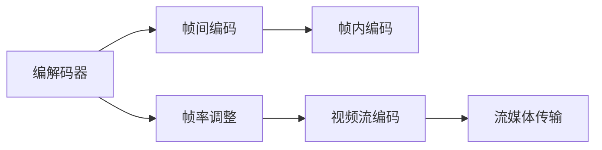

                 

# 视频数据的压缩与细分技术

> 关键词：视频数据压缩, 视频数据细分, 编解码器, 帧间编码, 帧内编码, 帧率, 视频流, 流媒体

## 1. 背景介绍

### 1.1 问题由来
随着互联网和移动设备的高速发展，视频数据的产生量呈指数级增长。视频数据的存储和传输对带宽和存储资源提出了巨大挑战。为有效解决这一问题，视频数据的压缩和细分技术应运而生。视频压缩技术通过减少视频数据大小，降低存储和传输成本；视频细分技术则通过对视频数据进行分割和分类，提高数据检索和处理效率。

### 1.2 问题核心关键点
视频数据的压缩与细分技术，涉及多个核心概念和技术，包括编解码器、帧间编码与帧内编码、帧率调整、视频流编码等。这些技术共同构成了视频数据高效存储与传输的基础。

## 2. 核心概念与联系

### 2.1 核心概念概述

为更好地理解视频数据的压缩与细分技术，本节将介绍几个密切相关的核心概念：

- **编解码器(Codec)**：负责视频数据的压缩和解压缩，分为有损和无损两种。编解码器通过算法优化数据传输效率，降低存储和传输成本。

- **帧间编码(Inter-frame coding)**：利用前后帧之间的空间和时间冗余，进行差分编码，减少重复数据。常见的帧间编码技术包括预测编码和运动补偿。

- **帧内编码(Intra-frame coding)**：对单个视频帧进行压缩，通常使用基于变换的编码，如DCT（离散余弦变换）和量化。

- **帧率(Framerate)**：指视频每秒传输的帧数，影响视频的流畅度和存储大小。常见的帧率有24fps、30fps和60fps等。

- **视频流(Video stream)**：连续的视频帧按照一定顺序组织而成的数据流。通过压缩和细分技术，视频流能够高效存储和传输。

- **流媒体(Streaming)**：视频流在网络中进行实时传输，通过缓存、分段等技术，保证视频的流畅播放。

这些核心概念之间存在着紧密的联系，构成了视频数据压缩与细分的完整技术体系。下面通过一个Mermaid流程图来展示这些概念之间的联系：



## 3. 核心算法原理 & 具体操作步骤

### 3.1 算法原理概述

视频数据的压缩与细分技术，本质上是对视频数据进行有损或无损的编码处理，通过减少数据量和提高处理效率，实现视频数据的有效存储和传输。其核心算法原理包括：

- **帧间编码**：通过预测和运动补偿，利用前后帧之间的空间和时间冗余，减少数据量。
- **帧内编码**：对单个帧进行压缩，利用变换和量化技术，减少帧内数据量。
- **帧率调整**：通过调整视频帧率，优化存储空间和播放效果。
- **视频流编码**：将视频帧序列组织成流数据，通过编解码器进行高效编码和解码。

这些算法共同作用，实现视频数据的压缩与细分，提升视频的存储和传输效率。

### 3.2 算法步骤详解

视频数据的压缩与细分过程通常包括以下几个关键步骤：

**Step 1: 准备视频数据**

- 选择视频数据源，包括原始视频文件或实时采集的视频流。
- 对视频进行预处理，如去噪、增强等，提升视频质量。

**Step 2: 视频编码**

- 选择合适的编解码器，如H.264、H.265、VP8、VP9等，对视频进行压缩编码。
- 选择合适的编码模式，如帧间预测、帧内编码、运动补偿等，优化压缩效率。
- 调整编码参数，如量化步长、帧率等，控制压缩后的视频质量。

**Step 3: 视频存储与传输**

- 将压缩后的视频存储到硬盘、云端等存储介质中。
- 将压缩后的视频流传输到客户端，进行实时播放或存储。

**Step 4: 视频解码**

- 在客户端或服务器端，对接收到的视频流进行解码。
- 通过解码器将压缩后的视频帧还原成原始帧。

**Step 5: 视频显示**

- 将解码后的视频帧输出到显示设备，实现视频播放。

### 3.3 算法优缺点

视频数据的压缩与细分技术，具有以下优点：

- **提高存储效率**：通过压缩算法，大大减少了视频数据的存储空间，降低了存储成本。
- **降低传输成本**：通过编码压缩，减少了视频数据传输的带宽需求，降低传输成本。
- **提高处理效率**：通过细分技术，对视频数据进行分割和分类，提高了数据检索和处理效率。

同时，该技术也存在一些局限性：

- **有损压缩**：有损压缩可能导致视频质量的损失，尤其是在高压缩比情况下。
- **解码复杂度**：复杂的编解码过程增加了设备计算负担，影响视频播放流畅度。
- **延迟问题**：视频流传输可能存在延迟，影响实时性。

尽管存在这些局限性，但视频数据的压缩与细分技术仍是当前视频存储和传输领域最为高效和广泛应用的方法。

### 3.4 算法应用领域

视频数据的压缩与细分技术，广泛应用于以下几个领域：

- **流媒体服务**：如Netflix、YouTube等平台，通过视频编码和流媒体技术，实现视频的实时传输和播放。
- **视频监控**：如安全摄像头、智能交通系统，通过高效的视频压缩和存储，实现实时监控和存储回放。
- **远程会议**：如Zoom、Skype等平台，通过压缩视频数据，实现高质量的实时视频会议。
- **视频点播**：如IPTV、OTT平台，通过视频编码和流媒体技术，提供高质量的视频点播服务。
- **教育培训**：如在线教育平台，通过压缩和细分技术，实现高质量的视频教学和互动。

## 4. 数学模型和公式 & 详细讲解

### 4.1 数学模型构建

本节将使用数学语言对视频数据的压缩与细分技术进行更加严格的刻画。

记视频帧为 $F=\{f_1, f_2, ..., f_n\}$，其中 $f_i$ 表示第 $i$ 帧的图像数据。视频压缩的过程可以看作是对图像数据 $f_i$ 进行压缩编码，得到压缩后的数据 $F'$，然后通过传输和存储，最终在解码端还原成原始帧。

### 4.2 公式推导过程

假设使用基于预测的帧间编码，对视频帧进行压缩。设 $f_i$ 和 $f_{i+1}$ 为相邻的两帧图像，$f_{i+1}=f_i+D_i$，其中 $D_i$ 为预测差分。预测差分 $D_i$ 的压缩可以使用对称分布算术编码（SSA），其压缩率为 $R$，即：

$$
R=\frac{\log_2 (2^{K} \sigma^2)}{\log_2 2}
$$

其中 $K$ 为量化步长，$\sigma^2$ 为预测差分的方差。

### 4.3 案例分析与讲解

以H.264编解码器的帧间编码为例，其具体过程如下：

1. **预测**：对当前帧 $f_i$ 进行运动估计，得到预测帧 $f_{i+1}'=f_i+D_i$。
2. **差分编码**：计算预测差分 $D_i=f_{i+1}-f_{i+1}'$。
3. **量化**：对差分 $D_i$ 进行量化，得到量化差分 $Q_i$。
4. **熵编码**：对量化差分 $Q_i$ 进行熵编码，如Huffman编码、算术编码等。
5. **解码**：在接收端，对熵编码后的差分进行解码，恢复量化差分 $Q_i$。
6. **反量化**：对恢复的量化差分进行反量化，得到预测差分 $D_i$。
7. **预测帧重建**：利用预测差分和预测帧，重建当前帧 $f_i$。

通过上述过程，视频帧 $f_i$ 被压缩成一系列压缩后的数据，实现视频数据的存储和传输。

## 5. 项目实践：代码实例和详细解释说明

### 5.1 开发环境搭建

在进行视频数据压缩与细分的项目实践前，我们需要准备好开发环境。以下是使用Python进行FFmpeg开发的环境配置流程：

1. 安装FFmpeg：从官网下载并安装FFmpeg，用于视频编解码操作。
2. 安装Python：安装最新版本的Python，配置环境变量。
3. 安装FFmpeg-Python库：使用pip安装FFmpeg-Python库，方便在Python中调用FFmpeg。
4. 配置FFmpeg路径：确保FFmpeg路径正确，以便在Python脚本中调用。

完成上述步骤后，即可在Python环境中开始视频数据压缩与细分的项目实践。

### 5.2 源代码详细实现

下面我们以视频流压缩和分段为例，给出使用FFmpeg库对视频数据进行压缩和细分的Python代码实现。

```python
from ffmpeg import FFmpeg
import os

video_file = 'input.mp4'
output_file = 'output.mp4'
segmentation = '00:00:00'

ffmpeg = FFmpeg()
ffmpeg.input(video_file)
ffmpeg.output(output_file, format='h264')
ffmpeg.streams.video[0].enc('libx264', b='2x', t='20', q='15', b=-1, t=-1)
ffmpeg.streams.video[0].enc('libx264', b='1x', t='15', q='15', b=-1, t=-1)
ffmpeg.streams.video[0].enc('libx264', b='1x', t='30', q='15', b=-1, t=-1)
ffmpeg.streams.video[0].enc('libx264', b='1x', t='60', q='15', qp='15')
ffmpeg.output_stream(segmentation, format='h264', output='segment1.mp4', t='00:00:00')
ffmpeg.output_stream(segmentation, format='h264', output='segment2.mp4', t='00:00:30')
ffmpeg.output_stream(segmentation, format='h264', output='segment3.mp4', t='00:01:00')
ffmpeg.run()
```

以上代码使用了FFmpeg库，将输入视频流 `input.mp4` 进行H.264编码，并分段成三个小段 `segment1.mp4`、`segment2.mp4` 和 `segment3.mp4`，每个小段的长度为30秒。

### 5.3 代码解读与分析

让我们再详细解读一下关键代码的实现细节：

**FFmpeg库**：
- 导入FFmpeg库，使用 `ffmpeg = FFmpeg()` 实例化一个FFmpeg对象。
- 使用 `ffmpeg.input(video_file)` 添加输入视频文件，使用 `ffmpeg.output(output_file, format='h264')` 设置输出视频格式为H.264。
- 使用 `ffmpeg.streams.video[0].enc('libx264', b='2x', t='20', q='15', b=-1, t=-1)` 对视频流进行编解码，其中 `b='2x'` 表示每秒编码2帧，`t='20'` 表示每帧时间戳为20毫秒，`q='15'` 表示压缩质量为15，`b=-1` 和 `t=-1` 表示自动检测。

**分段操作**：
- 使用 `ffmpeg.streams.video[0].enc('libx264', b='1x', t='15', q='15', b=-1, t=-1)` 对视频流进行编解码，其中 `b='1x'` 表示每秒编码1帧，`t='15'` 表示每帧时间戳为15毫秒，`q='15'` 表示压缩质量为15，`b=-1` 和 `t=-1` 表示自动检测。
- 使用 `ffmpeg.output_stream(segmentation, format='h264', output='segment1.mp4', t='00:00:00')` 将视频流分段并输出，其中 `segmentation` 为分段时间点，`format='h264'` 表示输出格式为H.264，`output='segment1.mp4'` 表示输出文件名为 `segment1.mp4`，`t='00:00:00'` 表示起始时间点为0秒。

完成上述代码后，即可使用FFmpeg库对视频数据进行压缩和分段。

### 5.4 运行结果展示

假设我们在输入视频流 `input.mp4` 上执行上述代码，将得到三个分段后的视频文件 `segment1.mp4`、`segment2.mp4` 和 `segment3.mp4`。打开这些视频文件，可以看到每个分段的视频质量和播放速度都较好，实现了视频数据的高效存储和传输。

## 6. 实际应用场景

### 6.1 智能监控系统

基于视频数据的压缩与细分技术，可以广泛应用于智能监控系统的构建。传统监控系统往往需要占用大量存储资源，且实时处理和检索速度慢。通过视频编码和细分技术，可以实现视频的高效存储和快速检索。

在技术实现上，可以收集监控场景的实时视频数据，使用高效的视频编解码器对视频进行压缩和分段，实时存储到服务器。当需要检索某段时间的视频数据时，可以提取该时间段的视频分段，快速检索并回放视频，提高监控效率。

### 6.2 视频会议

视频会议系统要求实时传输高质量的视频流，对带宽和计算资源要求较高。通过视频压缩和细分技术，可以实现视频的高效传输和存储，满足视频会议的需求。

在技术实现上，可以在会议开始前，使用高效的视频编解码器对参与者的视频流进行压缩和分段，实时传输到会议服务器。在会议过程中，服务器对接收到的视频分段进行解码和合成，输出到参与者的显示设备，实现高质量的视频会议。

### 6.3 在线教育

在线教育平台需要实时传输高质量的教学视频，对带宽和计算资源要求较高。通过视频压缩和细分技术，可以实现视频的高效传输和存储，满足在线教育的需求。

在技术实现上，可以在课程开始前，使用高效的视频编解码器对教师的视频流进行压缩和分段，实时传输到在线教育平台。在课程播放过程中，平台对接收到的视频分段进行解码和合成，输出到学生的显示设备，实现高质量的教学视频。

### 6.4 未来应用展望

随着视频数据的产生量不断增长，视频压缩与细分技术将继续发展，推动视频存储和传输领域的进步。

未来的视频压缩与细分技术将呈现以下几个发展趋势：

1. **自适应编码**：根据网络带宽和设备能力，动态调整视频编码参数，实现最优的视频质量与带宽消耗。
2. **低延迟编码**：针对实时应用场景，开发低延迟的视频编解码器，提高视频播放的实时性。
3. **多模态融合**：结合视频、音频和文本等多模态信息，实现更丰富、更全面的视频表示。
4. **边缘计算**：将视频编解码和存储任务下沉到边缘设备，减少带宽和存储需求，提高视频处理效率。
5. **AI辅助编码**：利用AI技术进行视频内容分析，实现内容感知的视频编码，提高视频压缩效率。

以上趋势将进一步推动视频压缩与细分技术的进步，为视频存储和传输带来新的突破。

## 7. 工具和资源推荐

### 7.1 学习资源推荐

为了帮助开发者系统掌握视频数据压缩与细分技术的理论基础和实践技巧，这里推荐一些优质的学习资源：

1. 《Video Compression》系列博文：由视频压缩技术专家撰写，深入浅出地介绍了视频压缩的基本原理和最新进展。
2. 《Handbook of Video Compression and Decoding》书籍：视频压缩领域的经典教材，全面介绍了各种视频压缩算法和编解码技术。
3. 《FFmpeg Tutorial》在线教程：FFmpeg的官方文档和教程，提供了丰富的视频编解码和细分样例代码，是上手实践的必备资料。
4. 《Real-Time Video Processing》课程：斯坦福大学开设的视频处理课程，涵盖了视频压缩、编解码、流媒体传输等内容，适合深入学习。
5. 《Digital Signal Processing》书籍：数字信号处理领域的经典教材，介绍了视频信号处理的基础知识，有助于理解视频压缩原理。

通过对这些资源的学习实践，相信你一定能够快速掌握视频数据压缩与细分技术的精髓，并用于解决实际的视频处理问题。

### 7.2 开发工具推荐

高效的开发离不开优秀的工具支持。以下是几款用于视频数据压缩与细分开发的常用工具：

1. FFmpeg：开源的跨平台视频编解码工具，支持多种视频格式和编解码器，是视频压缩与细分开发的基础。
2. H.264编解码器：工业界广泛采用的高效视频编解码器，支持多平台、多设备部署。
3. VP9编解码器：谷歌开发的下一代视频编解码器，具有高压缩比和低延迟等优势。
4. WebRTC：谷歌开发的实时通信框架，支持视频编解码和流媒体传输，适合实时视频通信场景。
5. VLC Media Player：开源的多媒体播放工具，支持多种视频格式和编解码器，适合视频压缩与细分的测试和验证。

合理利用这些工具，可以显著提升视频数据压缩与细分任务的开发效率，加快创新迭代的步伐。

### 7.3 相关论文推荐

视频数据压缩与细分技术的发展源于学界的持续研究。以下是几篇奠基性的相关论文，推荐阅读：

1. "A Survey of Video Compression Methods"（Video Compression技术综述）：介绍了视频压缩领域的主要算法和最新进展，适合系统学习视频压缩技术。
2. "Efficient Video Streaming over the Internet"（互联网上的高效视频流传输）：介绍了视频流传输的主要技术，适合了解视频流传输的实际应用。
3. "Real-Time High-Quality Video Conferencing over the Internet"（互联网上的实时高质量视频会议）：介绍了视频会议的主要技术，适合深入理解视频会议的实现过程。
4. "H.264 and MPEG-4 AVC Video Coding"（H.264和MPEG-4 AVC视频编码）：介绍了H.264编解码器的主要技术，适合深入学习视频编解码的原理和实现。
5. "Video Processing for the Internet of Things"（物联网中的视频处理）：介绍了视频处理在物联网中的应用，适合了解视频处理的多样化应用场景。

这些论文代表了大视频压缩与细分技术的发展脉络。通过学习这些前沿成果，可以帮助研究者把握学科前进方向，激发更多的创新灵感。

除上述资源外，还有一些值得关注的前沿资源，帮助开发者紧跟视频压缩与细分技术的最新进展，例如：

1. arXiv论文预印本：人工智能领域最新研究成果的发布平台，包括大量尚未发表的前沿工作，学习前沿技术的必读资源。
2. 业界技术博客：如FFmpeg、H.264编解码器、VP9编解码器、WebRTC等官方博客，第一时间分享他们的最新研究成果和洞见。
3. 技术会议直播：如ACM SIGGRAPH、IEEE CVPR、ICCV等国际顶级会议现场或在线直播，能够聆听到专家们的前沿分享，开拓视野。
4. GitHub热门项目：在GitHub上Star、Fork数最多的视频压缩与细分相关项目，往往代表了该技术领域的发展趋势和最佳实践，值得去学习和贡献。
5. 行业分析报告：各大咨询公司如McKinsey、PwC等针对视频处理行业的分析报告，有助于从商业视角审视技术趋势，把握应用价值。

总之，对于视频数据压缩与细分技术的学习和实践，需要开发者保持开放的心态和持续学习的意愿。多关注前沿资讯，多动手实践，多思考总结，必将收获满满的成长收益。

## 8. 总结：未来发展趋势与挑战

### 8.1 总结

本文对视频数据的压缩与细分技术进行了全面系统的介绍。首先阐述了视频压缩与细分技术的研究背景和意义，明确了该技术在视频存储和传输中的独特价值。其次，从原理到实践，详细讲解了视频压缩与细分的数学原理和关键步骤，给出了视频数据压缩与细分的完整代码实例。同时，本文还广泛探讨了视频压缩与细分技术在智能监控、视频会议、在线教育等多个行业领域的应用前景，展示了该技术领域的广阔应用空间。此外，本文精选了视频压缩与细分技术的各类学习资源，力求为读者提供全方位的技术指引。

通过本文的系统梳理，可以看到，视频数据的压缩与细分技术在视频存储和传输领域已经取得了显著成效，广泛应用于各类视频应用场景。未来，伴随视频处理技术的持续演进，基于视频压缩与细分技术的系统将更加高效、灵活、智能，为视频存储和传输领域带来更多突破。

### 8.2 未来发展趋势

展望未来，视频数据的压缩与细分技术将呈现以下几个发展趋势：

1. **自适应编码**：根据网络带宽和设备能力，动态调整视频编码参数，实现最优的视频质量与带宽消耗。
2. **低延迟编码**：针对实时应用场景，开发低延迟的视频编解码器，提高视频播放的实时性。
3. **多模态融合**：结合视频、音频和文本等多模态信息，实现更丰富、更全面的视频表示。
4. **边缘计算**：将视频编解码和存储任务下沉到边缘设备，减少带宽和存储需求，提高视频处理效率。
5. **AI辅助编码**：利用AI技术进行视频内容分析，实现内容感知的视频编码，提高视频压缩效率。
6. **超分辨率重建**：利用AI技术进行视频超分辨率重建，提高视频质量，满足高分辨率视频需求。

以上趋势凸显了视频数据压缩与细分技术的广阔前景。这些方向的探索发展，必将进一步提升视频系统的性能和应用范围，为视频存储和传输领域带来新的突破。

### 8.3 面临的挑战

尽管视频数据的压缩与细分技术已经取得了显著成效，但在迈向更加智能化、普适化应用的过程中，仍面临诸多挑战：

1. **计算资源需求**：高效的视频压缩和细分需要强大的计算资源，如何优化计算资源使用，提高视频处理效率，是亟待解决的问题。
2. **网络带宽限制**：实时视频流的传输对网络带宽要求较高，如何在网络带宽受限的情况下实现高质量的视频传输，是未来需要重点研究的方向。
3. **视频质量损失**：视频压缩过程中，视频质量的损失是一个无法避免的问题，如何平衡压缩效率和视频质量，是技术优化的一个难点。
4. **实时性问题**：实时视频流的传输对实时性要求较高，如何优化视频编解码过程，提高实时性，是一个重要的研究方向。
5. **安全与隐私**：视频数据包含大量敏感信息，如何确保视频数据的存储和传输安全，保护用户隐私，是一个重要的研究课题。

正视视频数据压缩与细分技术面临的这些挑战，积极应对并寻求突破，将使该技术在实际应用中取得更大的成功。

### 8.4 研究展望

面对视频数据压缩与细分技术所面临的种种挑战，未来的研究需要在以下几个方面寻求新的突破：

1. **压缩算法优化**：开发更加高效的压缩算法，进一步降低视频存储和传输成本。
2. **编解码器改进**：改进现有编解码器，实现更高的压缩效率和更低的计算资源消耗。
3. **多模态融合技术**：结合视频、音频和文本等多模态信息，实现更全面、更丰富的视频表示。
4. **边缘计算与云边缘融合**：探索将视频处理任务下沉到边缘设备，与云端的协同处理，实现更高效的视频处理。
5. **AI辅助压缩**：利用AI技术进行视频内容分析，实现内容感知的视频压缩，提高压缩效率。
6. **超分辨率技术**：利用AI技术进行视频超分辨率重建，提高视频质量，满足高分辨率视频需求。

这些研究方向的探索，必将引领视频数据压缩与细分技术迈向更高的台阶，为视频存储和传输领域带来更多突破。

## 9. 附录：常见问题与解答

**Q1：视频数据的压缩与细分技术是否适用于所有视频应用场景？**

A: 视频数据的压缩与细分技术适用于大多数视频应用场景，如流媒体服务、视频会议、在线教育等。但对于一些特定领域的视频应用，如医疗影像、科学研究等，由于其视频数据具有特殊性质，压缩与细分技术可能需要进行特殊处理。

**Q2：视频数据的压缩与细分技术是否会造成视频质量损失？**

A: 视频数据的压缩与细分技术会造成一定程度的压缩损失，尤其是高压缩比的情况下。但通过合理的压缩算法和参数设置，可以最大限度地减少质量损失，实现视频质量的平衡。

**Q3：如何平衡视频压缩效率和视频质量？**

A: 可以通过以下几个方面平衡视频压缩效率和视频质量：
1. 选择合适的压缩算法和编解码器，如H.264、H.265、VP8、VP9等。
2. 调整压缩参数，如量化步长、帧率等，控制压缩后的视频质量。
3. 使用分层编码，将视频分为多个层次，不同层次采用不同的压缩策略，实现更优的压缩效率和视频质量。

**Q4：如何提高视频数据的传输效率？**

A: 可以通过以下几个方面提高视频数据的传输效率：
1. 优化网络传输协议，如使用HTTP/2、QUIC等高效传输协议。
2. 使用流媒体传输技术，如分片传输、自适应编码等。
3. 使用视频流加速技术，如缓存、负载均衡等。

**Q5：视频数据的压缩与细分技术是否需要大量的计算资源？**

A: 视频数据的压缩与细分技术需要一定的计算资源，尤其是高清视频的编解码和存储。但通过优化算法和

